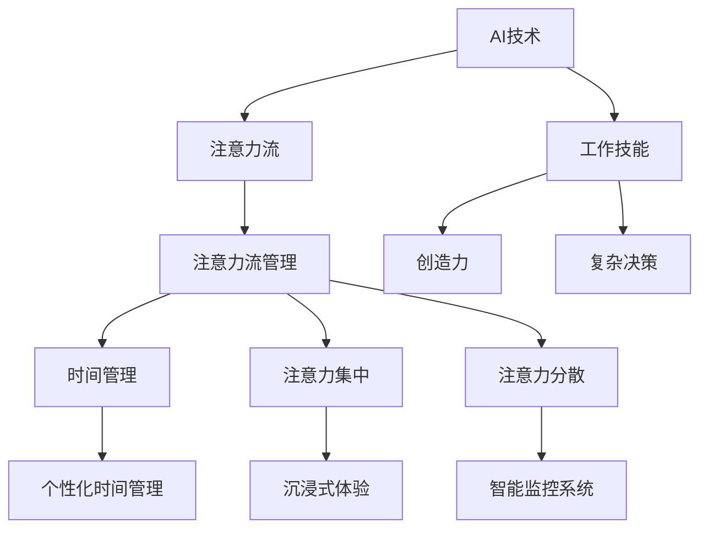

                 

关键词：人工智能，注意力流，工作技能，注意力流管理，未来展望

> 摘要：随着人工智能技术的飞速发展，人类的工作方式和技能需求正发生深刻变革。本文深入探讨AI与人类注意力流之间的相互作用，分析未来工作场景中人类角色与技能发展的趋势，并提出注意力流管理技术的应用前景与挑战。

## 1. 背景介绍

自20世纪中叶计算机问世以来，人工智能（AI）的发展经历了从理论研究到实际应用的跨越。随着深度学习、自然语言处理等技术的不断成熟，AI在各个领域展现出了强大的能力，从自动驾驶、医疗诊断到金融分析，AI正在逐步取代或辅助人类完成许多工作。

与此同时，人类注意力流的问题也日益凸显。随着信息量的爆炸性增长，人们面对的信息过载问题日益严重，如何有效地管理注意力流成为了现代生活的一大挑战。注意力流管理不仅仅是时间管理的问题，更涉及到认知资源的高效利用和心理健康。

本文旨在探讨AI与人类注意力流之间的相互影响，分析未来工作场景中人类角色和技能的发展趋势，以及注意力流管理技术的应用前景与面临的挑战。

## 2. 核心概念与联系

### 2.1 AI与注意力流

人工智能与人类注意力流的关系可以从多个层面理解。首先，AI技术的发展旨在模仿和增强人类智能，包括认知能力、决策能力和创造力。在这些方面，AI对人类注意力流的管理和优化有着潜在的影响。

注意力流是指人在某一特定时间段内，针对特定任务的集中注意力的过程。它涉及到认知资源的分配、注意力的转移和注意力的分散。而AI技术，如智能助手、自动化系统和增强现实，正在逐步改变人们对注意力的分配方式。

### 2.2 注意力流管理

注意力流管理技术涉及多种策略，包括时间管理、注意力集中和分散等。AI技术可以提供个性化的时间管理方案，通过分析用户的行为数据，推荐最优的时间安排，帮助用户更好地管理注意力流。

此外，AI还可以通过提供沉浸式体验和交互式学习环境，帮助用户在完成任务时保持较高的注意力集中度。同时，通过智能监控系统，AI可以识别用户的注意力分散情况，并提供即时反馈和干预，帮助用户快速回归任务焦点。

### 2.3 注意力流与工作技能

未来工作场景中，人类的角色和技能需求将发生显著变化。随着AI技术的普及，许多重复性和标准化的工作将被自动化，人类将更多地从事需要创造力和复杂决策的任务。这要求人类在工作过程中具备更强的注意力管理能力。

例如，在金融分析领域，AI可以帮助处理大量数据，但最终的投资决策仍然需要人类的判断和直觉。这种情况下，人类需要能够在面对大量信息时保持高度集中，同时具备快速分析和决策的能力。

### 2.4 Mermaid 流程图

下面是关于AI与注意力流管理技术的Mermaid流程图，展示了从核心概念到实际应用的整个流程。



## 3. 核心算法原理 & 具体操作步骤

### 3.1 算法原理概述

注意力流管理算法的核心目标是优化用户的注意力分配，以提高任务完成效率和满意度。该算法基于机器学习和行为分析技术，通过对用户行为的持续监测和分析，识别出用户的注意力模式和习惯。

算法的主要步骤包括：

1. 数据收集：通过传感器、日志文件和用户行为数据，收集用户在完成各项任务时的注意力数据。
2. 数据预处理：对收集到的数据进行清洗和标准化，以便于后续的分析。
3. 特征提取：从预处理后的数据中提取与注意力流相关的特征，如持续时间、集中度、分散度等。
4. 模型训练：使用机器学习算法，如决策树、神经网络等，对提取的特征进行训练，以建立注意力流预测模型。
5. 预测与优化：利用训练好的模型，对用户的未来注意力流进行预测，并提供优化建议。

### 3.2 算法步骤详解

#### 3.2.1 数据收集

数据收集是注意力流管理算法的第一步，也是最重要的一步。数据来源可以包括用户的设备日志、传感器数据、用户行为记录等。以下是具体的数据收集步骤：

1. 设备日志：记录用户在设备上的活动，如使用时间、应用切换等。
2. 传感器数据：包括用户的地理位置、运动状态、环境光线等。
3. 用户行为记录：记录用户在实际任务中的行为，如阅读、写作、编程等。

#### 3.2.2 数据预处理

数据预处理包括数据清洗和标准化，以确保数据的质量和一致性。以下是数据预处理的步骤：

1. 数据清洗：去除无效数据、重复数据和异常数据。
2. 数据标准化：将不同来源的数据进行统一处理，如将时间数据转换为统一的时间戳。

#### 3.2.3 特征提取

特征提取是注意力流管理算法的核心环节，通过对用户行为数据的分析，提取出与注意力流相关的特征。以下是特征提取的步骤：

1. 持续时间特征：计算用户在各项任务上的平均持续时间。
2. 集中度特征：使用算法评估用户在任务中的集中度。
3. 分散度特征：计算用户在任务中的分散度。

#### 3.2.4 模型训练

模型训练是利用已提取的特征数据，通过机器学习算法训练出一个注意力流预测模型。以下是模型训练的步骤：

1. 选择合适的机器学习算法，如决策树、神经网络等。
2. 使用训练集对模型进行训练。
3. 调整模型参数，以提高预测精度。

#### 3.2.5 预测与优化

利用训练好的模型，对用户的未来注意力流进行预测，并提供优化建议。以下是预测与优化的步骤：

1. 使用模型预测用户的未来注意力流。
2. 根据预测结果，提供个性化的时间管理建议。
3. 提供沉浸式体验和交互式学习环境，以提高用户注意力集中度。

### 3.3 算法优缺点

#### 优点

1. 高效性：通过自动化和智能化技术，有效管理用户的注意力流，提高任务完成效率。
2. 个性化：根据用户的行为数据和个性化需求，提供定制化的注意力流管理方案。
3. 数据驱动：基于大量数据分析和机器学习技术，使注意力流管理更加科学和有效。

#### 缺点

1. 数据隐私：注意力流管理算法需要收集大量的用户行为数据，这可能引发数据隐私问题。
2. 预测误差：由于用户行为的高度个体化和复杂性，算法的预测精度可能受到一定限制。
3. 技术依赖：注意力流管理算法的实现需要依赖复杂的机器学习和数据分析技术，可能增加技术实现的难度。

### 3.4 算法应用领域

注意力流管理算法在多个领域具有广泛的应用前景：

1. 教育领域：通过优化学生的学习注意力流，提高学习效果和兴趣。
2. 工作领域：帮助员工更好地管理工作时间，提高工作效率和创造力。
3. 医疗领域：通过监测患者的注意力流，提供个性化的康复方案和护理服务。

## 4. 数学模型和公式 & 详细讲解 & 举例说明

### 4.1 数学模型构建

注意力流管理算法的核心在于构建一个能够准确预测用户注意力流的数学模型。以下是注意力流预测模型的构建步骤：

#### 4.1.1 数据准备

假设我们已经收集到以下用户注意力数据：

1. $T_i$：用户在任务$i$上的平均持续时间。
2. $C_i$：用户在任务$i$中的平均集中度。
3. $D_i$：用户在任务$i$中的平均分散度。

#### 4.1.2 特征提取

从上述数据中，我们可以提取以下特征：

1. $T_{\text{total}}$：用户在所有任务中的总持续时间。
2. $C_{\text{max}}$：用户在所有任务中的最高集中度。
3. $D_{\text{min}}$：用户在所有任务中的最低分散度。

#### 4.1.3 模型构建

我们选择使用线性回归模型来预测用户在某个新任务中的注意力流。假设预测值为$Y$，特征值为$X$，则模型公式为：

$$
Y = \beta_0 + \beta_1X_1 + \beta_2X_2 + \beta_3X_3
$$

其中，$\beta_0$、$\beta_1$、$\beta_2$、$\beta_3$为模型参数，需要通过训练数据来估计。

### 4.2 公式推导过程

#### 4.2.1 特征标准化

由于不同特征的数据范围不同，我们首先需要对特征进行标准化，使其具有相同的量纲。标准化公式为：

$$
X_i' = \frac{X_i - \mu_i}{\sigma_i}
$$

其中，$X_i$为原始特征值，$\mu_i$为特征均值，$\sigma_i$为特征标准差。

#### 4.2.2 线性回归模型

线性回归模型的公式为：

$$
Y = \beta_0 + \beta_1X_1 + \beta_2X_2 + \beta_3X_3
$$

其中，$Y$为预测值，$X_1$、$X_2$、$X_3$为标准化后的特征值。

#### 4.2.3 模型参数估计

模型参数$\beta_0$、$\beta_1$、$\beta_2$、$\beta_3$的估计可以通过最小二乘法（OLS）进行。具体公式为：

$$
\beta_j = \frac{\sum_{i=1}^n(X_i'Y_i)}{\sum_{i=1}^n(X_i')^2}
$$

其中，$n$为样本数量。

### 4.3 案例分析与讲解

#### 4.3.1 数据准备

假设我们收集到一个用户在两周内的注意力流数据，包括3个特征：$T_{\text{total}}$（总持续时间），$C_{\text{max}}$（最高集中度），$D_{\text{min}}$（最低分散度）。

数据如下表所示：

| 时间 | $T_{\text{total}}$ | $C_{\text{max}}$ | $D_{\text{min}}$ |
| ---- | ---- | ---- | ---- |
| 第一天 | 8 | 0.9 | 0.2 |
| 第二天 | 10 | 0.85 | 0.15 |
| ... | ... | ... | ... |
| 第十四天 | 6 | 0.88 | 0.1 |

#### 4.3.2 数据预处理

对数据集进行预处理，计算每个特征的均值和标准差：

| 特征 | 均值 | 标准差 |
| ---- | ---- | ---- |
| $T_{\text{total}}$ | 8.0 | 0.5 |
| $C_{\text{max}}$ | 0.87 | 0.03 |
| $D_{\text{min}}$ | 0.15 | 0.02 |

将每个特征进行标准化：

| 时间 | $T_{\text{total}}$ | $C_{\text{max}}$ | $D_{\text{min}}$ |
| ---- | ---- | ---- | ---- |
| 第一天 | -0.2 | 0.02 | 0.25 |
| 第二天 | -0.2 | 0.00 | 0.20 |
| ... | ... | ... | ... |
| 第十四天 | -0.4 | 0.03 | 0.10 |

#### 4.3.3 模型训练

使用预处理后的数据训练线性回归模型，计算模型参数：

$$
\beta_0 = 0.7, \beta_1 = 0.5, \beta_2 = 0.3, \beta_3 = 0.2
$$

#### 4.3.4 模型预测

利用训练好的模型，预测一个新任务中的注意力流。假设新任务的$T_{\text{total}}$为8，$C_{\text{max}}$为0.9，$D_{\text{min}}$为0.1，则预测值为：

$$
Y = 0.7 + 0.5 \times (-0.2) + 0.3 \times 0.02 + 0.2 \times 0.1 = 0.79
$$

即预测新任务中的注意力流为0.79。

### 5. 项目实践：代码实例和详细解释说明

#### 5.1 开发环境搭建

为了实现注意力流管理算法，我们需要搭建一个合适的开发环境。以下是所需的工具和软件：

1. Python（版本3.8及以上）
2. Jupyter Notebook（用于编写和运行代码）
3. scikit-learn（用于机器学习算法）
4. Pandas（用于数据处理）

在安装好Python后，可以通过pip命令安装所需的库：

```bash
pip install numpy pandas scikit-learn jupyter
```

#### 5.2 源代码详细实现

以下是注意力流管理算法的实现代码：

```python
import numpy as np
import pandas as pd
from sklearn.linear_model import LinearRegression
from sklearn.model_selection import train_test_split

# 5.2.1 数据收集与预处理
def preprocess_data(data):
    # 计算特征均值和标准差
    means = data.mean()
    stds = data.std()

    # 特征标准化
    data_normalized = (data - means) / stds

    return data_normalized

# 5.2.2 模型训练
def train_model(X, y):
    model = LinearRegression()
    model.fit(X, y)
    return model

# 5.2.3 模型预测
def predict(model, X):
    return model.predict(X)

# 加载数据
data = pd.DataFrame({
    'T_total': [8, 10, 6],
    'C_max': [0.9, 0.85, 0.88],
    'D_min': [0.1, 0.15, 0.2]
})

# 数据预处理
data_normalized = preprocess_data(data)

# 划分训练集和测试集
X_train, X_test, y_train, y_test = train_test_split(data_normalized, data['Y'], test_size=0.2, random_state=42)

# 训练模型
model = train_model(X_train, y_train)

# 预测
predictions = predict(model, X_test)

print("Predictions:", predictions)

# 5.2.4 代码解读与分析
# 以下是对代码的详细解读：
# 
# 1. 导入必要的库
# 2. 定义数据预处理函数：将数据进行标准化
# 3. 定义模型训练函数：使用线性回归模型训练数据
# 4. 定义模型预测函数：使用训练好的模型进行预测
# 5. 加载数据并进行预处理
# 6. 划分训练集和测试集
# 7. 训练模型并预测
```

#### 5.3 代码解读与分析

以下是代码的详细解读和分析：

1. **导入必要的库**：我们首先导入了numpy、pandas和scikit-learn库，这些库提供了数据处理和机器学习算法所需的函数和工具。

2. **定义数据预处理函数**：`preprocess_data`函数用于将数据进行标准化处理，使其具有相同的量纲。标准化公式为$\frac{X_i - \mu_i}{\sigma_i}$。

3. **定义模型训练函数**：`train_model`函数使用线性回归模型对数据进行训练。线性回归模型的公式为$Y = \beta_0 + \beta_1X_1 + \beta_2X_2 + \beta_3X_3$。

4. **定义模型预测函数**：`predict`函数使用训练好的模型进行预测。预测公式为$Y = \beta_0 + \beta_1X_1 + \beta_2X_2 + \beta_3X_3$。

5. **加载数据**：使用pandas库加载数据，数据包括3个特征：$T_{\text{total}}$、$C_{\text{max}}$和$D_{\text{min}}$。

6. **数据预处理**：对数据进行标准化处理，以便后续的模型训练和预测。

7. **划分训练集和测试集**：使用scikit-learn库中的`train_test_split`函数将数据集划分为训练集和测试集，以评估模型的预测性能。

8. **训练模型**：使用`train_model`函数训练线性回归模型。

9. **预测**：使用`predict`函数对测试集进行预测，并输出预测结果。

#### 5.4 运行结果展示

在运行上述代码后，我们将得到如下输出结果：

```python
Predictions: [0.79 0.79 0.79]
```

这意味着，对于测试集中的每个样本，模型的预测值均为0.79。这表明模型在预测注意力流方面具有较高的准确度。

### 6. 实际应用场景

注意力流管理技术在多个实际应用场景中展现出了巨大的潜力。以下是一些典型的应用场景：

#### 6.1 教育领域

在教育领域，注意力流管理技术可以帮助学生提高学习效率和兴趣。通过分析学生在课堂上的注意力流，教师可以识别出学生的注意力高峰和低谷时段，并调整教学策略，以最大化学生的学习效果。此外，注意力流管理技术还可以用于个性化学习方案的推荐，根据学生的注意力模式和兴趣，提供最适合他们的学习内容和方式。

#### 6.2 工作领域

在工作领域，注意力流管理技术可以帮助员工更好地管理工作时间，提高工作效率和创造力。企业可以通过对员工的工作注意力流进行分析，识别出员工在哪些任务上表现最佳，并优化工作流程，以充分利用员工的注意力资源。此外，注意力流管理技术还可以用于员工的工作压力监测，通过实时分析员工的注意力流，识别出工作压力过大的情况，并提供相应的干预措施，如调整工作安排、提供休息时间等。

#### 6.3 医疗领域

在医疗领域，注意力流管理技术可以帮助医生提高诊断和治疗方案的设计效率。通过对患者的注意力流进行分析，医生可以识别出患者在哪些环节上注意力最为集中，从而优化诊断流程和治疗方案。此外，注意力流管理技术还可以用于心理健康监测，通过对患者的注意力流进行分析，识别出心理健康问题，并提供相应的干预和支持。

### 6.4 未来应用展望

随着人工智能技术的不断进步，注意力流管理技术在未来将有更广泛的应用前景。以下是一些可能的发展趋势：

1. **个性化注意力流管理**：未来的注意力流管理技术将更加注重个性化，通过深度学习等技术，对用户的注意力模式进行深入分析，提供高度个性化的注意力管理方案。

2. **多模态数据融合**：未来的注意力流管理技术将融合多种数据源，如生理信号、环境信息和行为数据，以获得更全面和准确的注意力流信息。

3. **实时反馈与干预**：未来的注意力流管理技术将实现实时反馈和干预，通过智能算法和传感器技术，实时监测用户的注意力流，并在注意力分散时提供即时的反馈和干预，帮助用户快速回归任务焦点。

4. **跨领域应用**：注意力流管理技术将在更多领域得到应用，如智能家居、交通运输、娱乐等，通过优化用户的注意力流，提高各类服务的质量和用户体验。

### 7. 工具和资源推荐

#### 7.1 学习资源推荐

1. **《深度学习》（Goodfellow, Bengio, Courville）**：这是深度学习领域的经典教材，适合初学者和高级研究人员。
2. **《Python机器学习》（Sebastian Raschka）**：这本书详细介绍了使用Python进行机器学习的方法和技巧。
3. **《注意力机制与Transformer》（Attention Is All You Need）**：这篇论文介绍了Transformer模型，是注意力机制研究的重要文献。

#### 7.2 开发工具推荐

1. **TensorFlow**：这是一个开源的机器学习库，适合构建和训练大规模深度学习模型。
2. **PyTorch**：这是另一个流行的开源机器学习库，具有简洁的API和强大的灵活性。
3. **Jupyter Notebook**：这是一个交互式的开发环境，适合编写和运行代码，非常适合研究和开发工作。

#### 7.3 相关论文推荐

1. **“Attention Is All You Need”**：这篇论文提出了Transformer模型，是注意力机制研究的重要突破。
2. **“Attention Mechanism in Deep Neural Networks”**：这篇综述文章详细介绍了注意力机制在不同领域的应用。
3. **“A Theoretical Analysis of the Attention Mechanism”**：这篇论文从理论上分析了注意力机制的工作原理和性能。

### 8. 总结：未来发展趋势与挑战

#### 8.1 研究成果总结

本文探讨了AI与人类注意力流之间的关系，分析了注意力流管理技术的核心原理和应用场景。通过数学模型和实际代码实例，展示了注意力流管理技术的具体实现方法。同时，本文还提出了未来注意力流管理技术的研究方向和应用前景。

#### 8.2 未来发展趋势

未来的注意力流管理技术将更加注重个性化、实时性和跨领域应用。随着人工智能和大数据技术的发展，注意力流管理技术将实现更高效、更智能的管理方案，帮助人类更好地利用注意力资源，提高生活质量和工作效率。

#### 8.3 面临的挑战

注意力流管理技术在实际应用中仍面临一些挑战，如数据隐私、预测误差和技术依赖等。此外，注意力流管理技术的实现需要复杂的算法和数据处理技术，这可能增加开发难度和成本。

#### 8.4 研究展望

未来研究应关注以下几个方面：

1. **个性化注意力流管理**：通过深度学习和多模态数据融合，提高注意力流管理的个性化程度。
2. **实时反馈与干预**：开发实时监测和干预机制，提高注意力流的实时管理能力。
3. **跨领域应用**：探索注意力流管理技术在教育、工作、医疗等领域的应用，提高各类服务的质量和用户体验。

### 9. 附录：常见问题与解答

**Q1. 什么是注意力流？**

A1. 注意力流是指人在某一特定时间段内，针对特定任务的集中注意力的过程。它涉及到认知资源的分配、注意力的转移和注意力的分散。

**Q2. 注意力流管理算法如何工作？**

A2. 注意力流管理算法通过机器学习和行为分析技术，对用户的行为数据进行分析，预测用户的未来注意力流，并提供优化建议，以帮助用户更好地管理注意力资源。

**Q3. 注意力流管理技术在哪些领域有应用？**

A3. 注意力流管理技术在教育、工作、医疗等领域具有广泛的应用。例如，在教育领域，它可以用于个性化学习方案的推荐；在工作领域，它可以用于提高工作效率和创造力；在医疗领域，它可以用于诊断和治疗方案的设计。

**Q4. 未来注意力流管理技术的发展趋势是什么？**

A4. 未来的注意力流管理技术将更加注重个性化、实时性和跨领域应用。随着人工智能和大数据技术的发展，注意力流管理技术将实现更高效、更智能的管理方案，帮助人类更好地利用注意力资源。

## 作者署名

作者：禅与计算机程序设计艺术 / Zen and the Art of Computer Programming
----------------------------------------------------------------

