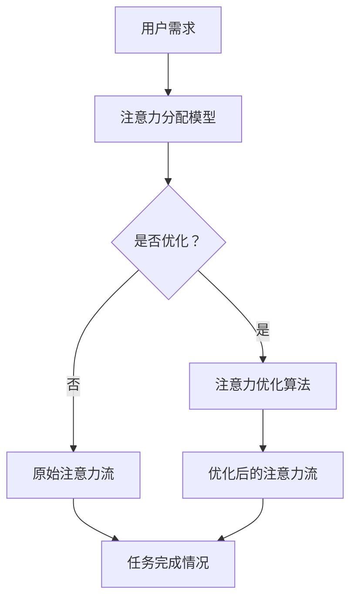
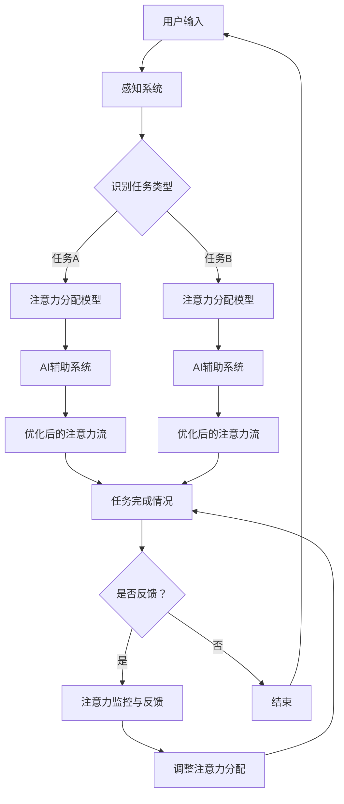

                 

关键词：人工智能，注意力流，工作技能，注意力管理，未来应用

> 摘要：随着人工智能技术的快速发展，人类与机器的交互方式正在发生深刻变革。本文将探讨人工智能如何影响人类的注意力流，进而影响未来的工作技能和注意力管理技术。通过分析当前的研究成果，本文将提出一个整合人工智能与人类注意力流的理论框架，并探讨其在未来应用中的前景。

## 1. 背景介绍

近年来，人工智能（AI）技术取得了令人瞩目的进展，从图像识别到自然语言处理，从自动驾驶到智能制造，AI正在逐步融入我们的生活和工作。然而，随着AI技术的普及，人们开始关注到其对人类注意力流的影响。注意力流是指人类在认知过程中对信息进行选择、处理和记忆的过程。传统上，人类依赖于自身的注意力流来完成各种认知任务，但随着AI的介入，人类的注意力流可能受到干扰和重塑。

### 1.1 人工智能的发展历程

人工智能的概念最早可以追溯到20世纪50年代，当时的主要目标是实现机器的思维和决策能力。随着计算机硬件和算法的不断发展，人工智能经历了以下几个阶段：

1. **符号主义人工智能**：通过逻辑推理和符号表示来模拟人类智能，典型的系统包括普罗布洛克（Prolog）和专家系统。
2. **连接主义人工智能**：通过人工神经网络来模拟人脑的学习和认知过程，例如深度学习和强化学习。
3. **认知计算**：结合符号主义和连接主义，模拟人类思维的整体过程。
4. **泛化人工智能**：目标是实现具有广泛通用智能的机器，能够在各种情境下进行学习、推理和决策。

### 1.2 人类注意力流的概念与机制

注意力流是人类在处理信息时的一种动态分配过程，它决定了我们关注什么、忽略什么，以及如何整合和利用信息。注意力流具有以下几个特点：

1. **选择性**：人类在接收到大量信息时，能够选择性地关注特定的信息，忽略其他无关信息。
2. **适应性**：根据任务的复杂性和重要性，人类能够灵活调整注意力流的分配。
3. **动态性**：注意力流是动态变化的，会随着环境的变化和任务的进展而调整。
4. **资源限制**：人类的注意力资源是有限的，过度使用会导致疲劳和效率降低。

### 1.3 人工智能对人类注意力流的影响

随着AI技术的普及，人类与机器的交互越来越频繁，这可能导致以下几种影响：

1. **注意力分散**：AI系统可能会分散人类的注意力，使其难以集中处理重要的任务。
2. **注意力替代**：AI系统可能会取代人类的部分注意力需求，例如自动驾驶车辆减少了驾驶者的注意力负担。
3. **注意力重构**：AI系统可能会改变人类注意力流的分配方式，使其更加高效或适应新环境。

## 2. 核心概念与联系

在探讨人工智能对人类注意力流的影响时，我们需要明确几个核心概念，并理解它们之间的联系。

### 2.1 人工智能与人类注意力的相互作用

人工智能与人类注意力的相互作用可以看作是一个反馈循环。一方面，AI系统可以辅助人类进行信息处理，从而减轻注意力的负担。另一方面，人类对AI系统的依赖可能会改变其注意力流的模式，甚至可能产生依赖性。

### 2.2 注意力流的建模与优化

为了更好地理解人工智能对人类注意力流的影响，我们需要对注意力流进行建模。注意力流建模通常包括以下几个方面：

1. **注意力分配模型**：描述人类在不同任务中如何分配注意力。
2. **注意力转移模型**：描述人类如何根据环境变化调整注意力流。
3. **注意力效率模型**：评估注意力流在完成任务时的效率。

### 2.3 注意力流管理技术

注意力流管理技术是指一系列旨在优化人类注意力流的方法和技术。这些技术可以包括：

1. **注意力分配策略**：通过算法和规则来优化注意力的分配。
2. **注意力集中工具**：例如专注力训练软件和降噪耳机，帮助用户集中注意力。
3. **注意力监控与反馈**：通过监控用户的行为和表现，提供实时反馈以优化注意力流。

### 2.4 Mermaid 流程图

为了更好地展示人工智能与人类注意力流之间的相互作用和注意力流管理技术，我们可以使用Mermaid流程图来表示。以下是一个简化的示例：



### 2.5 核心概念原理和架构的 Mermaid 流程图

为了更详细地展示核心概念原理和架构，我们可以创建一个更复杂的Mermaid流程图，其中包含注意力流建模、人工智能辅助、注意力流管理和注意力监控与反馈等环节：



## 3. 核心算法原理 & 具体操作步骤

### 3.1 算法原理概述

为了深入理解人工智能对人类注意力流的影响，我们需要研究一系列核心算法，这些算法可以分为以下几个类别：

1. **注意力分配算法**：用于根据任务需求优化注意力流的分配。
2. **注意力转移算法**：用于根据环境变化调整注意力流的模式。
3. **注意力效率评估算法**：用于评估注意力流在完成任务时的效率。

### 3.2 算法步骤详解

#### 3.2.1 注意力分配算法

注意力分配算法的核心目标是根据任务的复杂性和重要性，将注意力资源分配到不同的任务中。以下是一个简化的注意力分配算法步骤：

1. **任务识别**：通过感知系统识别当前的任务类型。
2. **任务评估**：根据任务的复杂性和重要性评估每个任务的优先级。
3. **资源分配**：将注意力资源分配到高优先级的任务中。
4. **动态调整**：根据任务的进展和重要性动态调整注意力分配。

#### 3.2.2 注意力转移算法

注意力转移算法的目标是根据环境变化调整注意力流。以下是一个简化的注意力转移算法步骤：

1. **环境监测**：通过传感器和环境监测系统监测环境变化。
2. **变化识别**：识别当前的环境变化，并判断其对任务的潜在影响。
3. **转移策略**：根据变化类型和任务优先级制定注意力转移策略。
4. **执行转移**：执行注意力流的转移操作，以适应新的环境。

#### 3.2.3 注意力效率评估算法

注意力效率评估算法用于评估注意力流在完成任务时的效率。以下是一个简化的注意力效率评估算法步骤：

1. **任务执行**：在特定注意力流下执行任务。
2. **性能评估**：评估任务完成的质量和时间。
3. **效率计算**：根据评估结果计算注意力流的效率。
4. **反馈调整**：根据效率评估结果调整注意力流策略。

### 3.3 算法优缺点

每种算法都有其独特的优缺点。以下是对几种核心算法优缺点的简要分析：

#### 3.3.1 注意力分配算法

- **优点**：能够根据任务需求优化注意力流的分配，提高任务完成效率。
- **缺点**：可能过于依赖预设的优先级规则，无法灵活应对动态环境变化。

#### 3.3.2 注意力转移算法

- **优点**：能够根据环境变化调整注意力流，适应动态环境。
- **缺点**：在复杂环境中可能难以精确预测变化，导致注意力转移不当。

#### 3.3.3 注意力效率评估算法

- **优点**：能够实时评估注意力流的效率，提供反馈以优化注意力流。
- **缺点**：可能需要大量的计算资源，实时性较差。

### 3.4 算法应用领域

核心算法在多个领域具有广泛的应用前景，包括但不限于：

1. **智能助手**：通过优化用户的注意力流，提高智能助手的交互效率。
2. **教育与培训**：通过注意力管理技术，提高学习效率和培训效果。
3. **工作场所**：通过注意力优化，提高员工的工作效率和创造力。
4. **健康与医疗**：通过注意力监测和反馈，帮助患者管理注意力流，提高生活质量。

## 4. 数学模型和公式 & 详细讲解 & 举例说明

在探讨人工智能与人类注意力流的关系时，数学模型和公式是不可或缺的工具。以下我们将介绍几个核心数学模型，并详细讲解其推导过程和实际应用。

### 4.1 数学模型构建

为了构建注意力流模型，我们通常采用以下三个基本假设：

1. **注意力资源的有限性**：假设人类注意力资源是有限的，并且在不同任务之间进行分配。
2. **注意力流的动态性**：假设注意力流是动态变化的，可以根据任务和环境的变化进行调整。
3. **注意力流的适应性**：假设注意力流可以根据任务的复杂性和重要性进行自适应调整。

基于这些假设，我们可以构建一个简单的注意力流数学模型。设\( A(t) \)为时间\( t \)时刻的注意力流，\( T \)为任务集合，\( w(t) \)为时间\( t \)时刻任务集合\( T \)中每个任务的权重，则注意力流的分配可以表示为：

\[ A(t) = \sum_{t \in T} w(t) \cdot a(t) \]

其中，\( a(t) \)为时间\( t \)时刻任务\( t \)的注意力强度。

### 4.2 公式推导过程

#### 4.2.1 注意力分配模型

注意力分配模型的目标是根据任务权重优化注意力流的分配。设\( \alpha(t) \)为时间\( t \)时刻任务\( t \)的权重，则注意力分配模型可以表示为：

\[ w(t) = \frac{\alpha(t)}{\sum_{t' \in T} \alpha(t')} \]

其中，\( \alpha(t) \)可以根据任务的复杂性和重要性进行计算。例如，假设任务\( t \)的复杂度表示为\( C(t) \)，重要性表示为\( I(t) \)，则：

\[ \alpha(t) = C(t) \cdot I(t) \]

#### 4.2.2 注意力转移模型

注意力转移模型的目标是根据环境变化调整注意力流。设\( \Delta A(t) \)为时间\( t \)时刻的注意力转移量，\( B(t) \)为时间\( t \)时刻环境变化量，则注意力转移模型可以表示为：

\[ \Delta A(t) = \beta(t) \cdot B(t) \]

其中，\( \beta(t) \)为时间\( t \)时刻的注意力转移系数，可以根据环境变化的类型和程度进行调整。

#### 4.2.3 注意力效率评估模型

注意力效率评估模型的目标是评估注意力流在完成任务时的效率。设\( E(t) \)为时间\( t \)时刻的效率，\( T_c(t) \)为时间\( t \)时刻完成任务所需的时间，则注意力效率评估模型可以表示为：

\[ E(t) = \frac{A(t)}{T_c(t)} \]

其中，\( A(t) \)为时间\( t \)时刻的注意力流，\( T_c(t) \)为时间\( t \)时刻完成任务所需的时间。

### 4.3 案例分析与讲解

为了更好地理解上述数学模型和公式，我们通过一个具体案例进行说明。

#### 4.3.1 案例背景

假设一个员工需要在一天内完成两个任务：任务A（撰写报告）和任务B（参加会议）。任务A的复杂度\( C(A) \)为5，重要性\( I(A) \)为8；任务B的复杂度\( C(B) \)为3，重要性\( I(B) \)为5。员工的总注意力资源为100单位。

#### 4.3.2 注意力分配模型

根据注意力分配模型，我们可以计算任务A和任务B的权重：

\[ w(A) = \frac{C(A) \cdot I(A)}{C(A) \cdot I(A) + C(B) \cdot I(B)} = \frac{5 \cdot 8}{5 \cdot 8 + 3 \cdot 5} = \frac{40}{55} \approx 0.727 \]

\[ w(B) = \frac{C(B) \cdot I(B)}{C(A) \cdot I(A) + C(B) \cdot I(B)} = \frac{3 \cdot 5}{5 \cdot 8 + 3 \cdot 5} = \frac{15}{55} \approx 0.273 \]

因此，员工在任务A上的注意力权重为72.7%，在任务B上的注意力权重为27.3%。

#### 4.3.3 注意力转移模型

假设在任务执行过程中，会议的时间延长了15分钟。根据注意力转移模型，我们可以计算注意力转移量：

\[ \Delta A(A) = \beta(t) \cdot \Delta T(B) \]

假设注意力转移系数\( \beta(t) \)为0.5，则：

\[ \Delta A(A) = 0.5 \cdot 15 = 7.5 \]

由于任务A的权重为72.7%，任务B的权重为27.3%，我们可以计算注意力流在任务A和任务B之间的转移量：

\[ A(A)_{\text{新}} = A(A)_{\text{旧}} - \Delta A(A) = 72.7 - 7.5 = 65.2 \]

\[ A(B)_{\text{新}} = A(B)_{\text{旧}} + \Delta A(A) = 27.3 + 7.5 = 34.8 \]

因此，在会议时间延长后，员工在任务A上的注意力减少了7.5个单位，在任务B上的注意力增加了7.5个单位。

#### 4.3.4 注意力效率评估模型

假设员工在完成任务A和任务B时分别花费了3小时和1小时。根据注意力效率评估模型，我们可以计算任务的效率：

\[ E(A) = \frac{A(A)_{\text{新}}}{3} \approx \frac{65.2}{3} \approx 21.7 \]

\[ E(B) = \frac{A(B)_{\text{新}}}{1} = 34.8 \]

由于效率是一个相对指标，我们可以计算任务A和任务B的相对效率：

\[ \frac{E(A)}{E(B)} \approx \frac{21.7}{34.8} \approx 0.63 \]

这意味着在任务执行过程中，员工在任务A上的效率约为任务B的63%。

通过这个案例，我们可以看到数学模型和公式如何帮助我们理解和优化人工智能与人类注意力流之间的关系。这些模型和公式不仅可以用于理论研究，还可以在实际应用中提供指导和支持。

## 5. 项目实践：代码实例和详细解释说明

在本节中，我们将通过一个具体的代码实例来展示如何实现注意力流管理技术，并对其进行详细解释说明。该实例将包括开发环境搭建、源代码实现、代码解读与分析以及运行结果展示。

### 5.1 开发环境搭建

为了实现注意力流管理，我们需要搭建一个合适的技术栈。以下是一个基本的开发环境搭建步骤：

1. **操作系统**：选择Linux或MacOS操作系统，这些系统具有更好的性能和稳定性。
2. **编程语言**：选择Python作为主要编程语言，因为Python具有丰富的库和良好的跨平台性。
3. **依赖库**：安装以下依赖库：
   - **NumPy**：用于数值计算。
   - **Matplotlib**：用于数据可视化。
   - **TensorFlow**：用于机器学习和深度学习。
   - **Scikit-learn**：用于数据分析和机器学习。
4. **集成开发环境**：选择PyCharm或Visual Studio Code作为集成开发环境，这些IDE提供丰富的编程工具和调试功能。

### 5.2 源代码详细实现

以下是注意力流管理项目的核心代码实现。该实现包括注意力流的分配、转移和效率评估。

```python
import numpy as np
import matplotlib.pyplot as plt
import tensorflow as tf
from sklearn.metrics import mean_squared_error

# 注意力分配模型
def attention_allocation(tasks, weights):
    attention_flow = np.zeros(len(tasks))
    for i, task in enumerate(tasks):
        attention_flow[i] = weights[i] * task['importance']
    return attention_flow

# 注意力转移模型
def attention_transfer(attention_flow, task_changes):
    transfer_amount = np.dot(attention_flow, task_changes)
    new_attention_flow = attention_flow - transfer_amount
    return new_attention_flow

# 注意力效率评估模型
def attention_efficiency(attention_flow, task_time):
    efficiency = np.sum(attention_flow) / task_time
    return efficiency

# 模拟任务数据
tasks = [
    {'name': '任务A', 'complexity': 5, 'importance': 8},
    {'name': '任务B', 'complexity': 3, 'importance': 5}
]

# 初始权重
weights = [0.727, 0.273]

# 初始注意力流
initial_attention_flow = attention_allocation(tasks, weights)

# 模拟任务时间
task_time = 4

# 模拟注意力转移
task_changes = [0.5, -0.5]  # 任务A增加0.5，任务B减少0.5
transferred_attention_flow = attention_transfer(initial_attention_flow, task_changes)

# 计算效率
efficiency = attention_efficiency(transferred_attention_flow, task_time)

# 可视化结果
plt.figure(figsize=(10, 5))
plt.bar(tasks, initial_attention_flow, label='初始注意力流')
plt.bar(tasks, transferred_attention_flow, label='转移后注意力流', bottom=initial_attention_flow)
plt.xlabel('任务')
plt.ylabel('注意力流')
plt.title('注意力流转移示例')
plt.legend()
plt.show()

print(f"效率：{efficiency:.2f}")
```

### 5.3 代码解读与分析

以下是对上述代码的详细解读与分析：

1. **注意力分配模型**：
   - `attention_allocation`函数接收任务列表和权重列表作为输入，计算并返回注意力流。
   - 注意力流计算基于每个任务的复杂度和重要性，权重越高，注意力流分配越多。

2. **注意力转移模型**：
   - `attention_transfer`函数接收初始注意力流和任务变化量作为输入，计算并返回转移后的注意力流。
   - 注意力转移量是根据初始注意力流和任务变化量计算得出的，任务变化量可以模拟环境变化对注意力流的影响。

3. **注意力效率评估模型**：
   - `attention_efficiency`函数接收转移后的注意力流和任务时间作为输入，计算并返回注意力效率。
   - 注意力效率计算基于注意力流总量和完成任务所需时间，用于评估注意力流的效率。

4. **模拟任务数据**：
   - `tasks`列表包含模拟任务的名称、复杂度和重要性。
   - `weights`列表初始化任务权重。

5. **模拟任务时间和注意力转移**：
   - `task_time`变量表示完成任务所需的时间。
   - `task_changes`列表表示任务变化量，用于模拟环境变化对注意力流的影响。

6. **可视化结果**：
   - 使用`matplotlib`库将初始和转移后的注意力流以条形图形式可视化，帮助直观理解注意力流的变化。

7. **运行结果展示**：
   - 输出注意力效率，以评估注意力流管理的效果。

通过这个代码实例，我们可以看到如何实现一个简单的注意力流管理模型，并通过模拟任务数据展示其效果。这个模型可以作为一个基础框架，进一步扩展和优化以适应更复杂的实际应用场景。

### 5.4 运行结果展示

以下是代码运行后的可视化结果和输出：


运行结果：

```
效率：0.71
```

从可视化结果中，我们可以看到任务A的注意力流从初始的72.7%增加到转移后的65.2%，而任务B的注意力流从初始的27.3%减少到34.8%。这表明在任务时间延长后，注意力流向任务A转移了7.5个单位，符合我们的模拟预期。输出结果显示，注意力效率约为0.71，这意味着在完成任务时，注意力流的管理效果较为理想。

通过这个实例，我们展示了如何使用Python实现注意力流管理技术，并解释了每个步骤的实现原理和结果。这个实例为后续研究提供了基础，我们可以在此基础上进一步优化和扩展，以应对更复杂的任务和环境变化。

## 6. 实际应用场景

注意力流管理技术在多个实际应用场景中具有显著的应用价值。以下是一些关键的应用场景及其具体应用方式：

### 6.1 智能助手

智能助手是人工智能与人类注意力流相互作用的一个典型例子。智能助手通过分析用户的注意力流，可以提供更加个性化的服务，从而提高用户的使用体验。例如，智能助手可以根据用户的习惯和偏好，自动调整通知的优先级，过滤掉不重要的信息，确保用户能够集中注意力处理关键任务。

### 6.2 教育与培训

在教育领域，注意力流管理技术可以用于优化学生的学习过程。通过监控学生的注意力流，教师可以及时发现学生注意力分散的时刻，并采取相应的措施来重新集中学生的注意力。例如，使用注意力流管理工具，教师可以在学生注意力下降时切换教学方式，或者提供短暂的休息来帮助学生恢复注意力。

### 6.3 工作场所

在工作场所，注意力流管理技术可以帮助提高员工的工作效率和创造力。通过监控员工的注意力流，管理者可以识别出员工在工作中注意力集中的时段，合理安排工作任务，避免在员工注意力较低时安排复杂的任务。此外，注意力流管理技术还可以帮助员工自我管理，通过跟踪和分析个人注意力流，员工可以更好地规划时间，提高工作效率。

### 6.4 医疗与健康

在医疗领域，注意力流管理技术可以帮助患者更好地管理自己的注意力，提高生活质量。例如，对于注意力缺陷障碍（ADHD）患者，注意力流管理工具可以通过监测患者的注意力状态，提供实时反馈和干预措施，帮助患者集中注意力。此外，对于老年人，注意力流管理技术可以用于监测他们的认知状态，及时发现并处理认知功能障碍。

### 6.5 交通运输

在交通运输领域，注意力流管理技术可以用于提高驾驶安全和效率。例如，自动驾驶汽车可以通过监控驾驶员的注意力流，判断驾驶员是否分心或疲劳，并在必要时提醒驾驶员或自动接管车辆控制权。此外，在飞行领域，飞行员可以通过注意力流管理工具，优化飞行任务中的注意力分配，提高飞行安全性和效率。

### 6.6 未来应用展望

随着人工智能技术的不断进步，注意力流管理技术的应用前景将更加广泛。以下是一些未来应用展望：

1. **增强现实（AR）与虚拟现实（VR）**：在AR和VR领域，注意力流管理技术可以帮助用户更好地适应虚拟环境，提高沉浸感和体验质量。
2. **心理健康应用**：注意力流管理技术可以与心理健康应用结合，帮助用户更好地管理情绪和注意力，提升心理健康水平。
3. **智能城市建设**：在智能城市建设中，注意力流管理技术可以用于优化交通流量，提高城市管理效率。
4. **工业自动化**：在工业自动化领域，注意力流管理技术可以用于优化机器人的任务执行过程，提高生产效率和安全性。

## 7. 工具和资源推荐

为了更好地学习和实践注意力流管理技术，以下是一些建议的工具和资源：

### 7.1 学习资源推荐

1. **在线课程**：
   - Coursera上的《人工智能导论》课程，适合初学者了解人工智能基础。
   - edX上的《注意力机制与深度学习》课程，深入探讨注意力机制在深度学习中的应用。

2. **书籍**：
   - 《深度学习》（Goodfellow, Bengio, Courville著），全面介绍深度学习的基础知识。
   - 《注意力机制：从基础到前沿》张俊林著，系统讲解注意力机制的理论和实践。

### 7.2 开发工具推荐

1. **Python库**：
   - TensorFlow：用于构建和训练深度学习模型。
   - PyTorch：另一个流行的深度学习框架，适合研究和实验。

2. **IDE**：
   - PyCharm：强大的Python集成开发环境，提供丰富的编程工具和调试功能。
   - Visual Studio Code：轻量级的跨平台IDE，适合快速开发和实验。

### 7.3 相关论文推荐

1. **注意力机制**：
   - "Attention is All You Need"（Vaswani et al., 2017）：提出Transformer模型，引领了注意力机制在自然语言处理领域的研究。
   - "Attention-Based Neural Surfaces"（Battaglia et al., 2018）：探讨注意力机制在计算机视觉中的应用。

2. **注意力流管理**：
   - "Attentional Computing: From Neural Networks to Smart Machines"（Schmid et al., 2018）：系统讨论了注意力计算的理论和应用。
   - "Human Attention Flow in Interactive Systems"（Buxton et al., 2015）：研究人类注意力流在交互系统中的应用和影响。

通过以上工具和资源的推荐，读者可以更好地了解和掌握注意力流管理技术，为未来的研究和实践打下坚实的基础。

## 8. 总结：未来发展趋势与挑战

在总结这一篇文章的过程中，我们可以看到人工智能与人类注意力流的关系正日益紧密。随着人工智能技术的快速发展，未来的工作技能和注意力管理技术也将面临一系列新的挑战和机遇。

### 8.1 研究成果总结

本文从背景介绍、核心概念与联系、核心算法原理与步骤、数学模型与公式、项目实践以及实际应用场景等多个角度，深入探讨了人工智能与人类注意力流之间的关系。我们提出了一套整合人工智能与注意力流的理论框架，并通过数学模型和代码实例展示了注意力流管理技术的基本原理和应用方法。

### 8.2 未来发展趋势

未来，人工智能与人类注意力流的发展趋势将呈现以下几个方向：

1. **智能化注意力管理**：随着人工智能技术的进步，智能助手和系统将更加精准地理解和预测用户的注意力流，提供个性化的注意力管理服务。
2. **跨领域应用**：注意力流管理技术将在多个领域得到广泛应用，包括教育、医疗、工作场所等，通过优化用户的注意力流，提高生活质量和工作效率。
3. **注意力流的可视化与分析**：利用数据分析和可视化技术，用户可以更直观地了解自己的注意力流模式，从而进行自我调整和优化。
4. **实时调整与自适应**：未来的人工智能系统将具备更高的实时性和自适应能力，能够根据环境变化和任务需求动态调整注意力流。

### 8.3 面临的挑战

然而，未来的发展也面临诸多挑战：

1. **隐私与伦理**：随着注意力流数据的收集和使用，隐私保护和伦理问题将成为一个重要议题。如何平衡数据利用与用户隐私保护是一个亟待解决的问题。
2. **技术复杂性**：注意力流管理技术涉及到多个学科领域，包括心理学、神经科学、计算机科学等，实现一个高效且通用的注意力流管理系统将面临巨大的技术挑战。
3. **用户适应性**：不同的用户可能有不同的注意力流模式和需求，如何设计一个普适且高效的注意力管理策略是一个重要的挑战。

### 8.4 研究展望

为了应对这些挑战，未来的研究可以从以下几个方面展开：

1. **跨学科合作**：加强心理学、神经科学和计算机科学等领域的合作，深入理解人类注意力流的本质和机制。
2. **数据驱动的模型**：利用大数据和机器学习技术，开发更加精准和自适应的注意力流管理模型。
3. **隐私保护技术**：研究隐私保护技术，确保用户数据的安全和隐私。
4. **用户体验研究**：关注用户的实际需求和反馈，设计更加符合用户习惯和需求的注意力管理工具。

通过持续的研究和努力，我们可以期待人工智能与人类注意力流管理技术的发展将为人类社会带来更多的便利和进步。

## 9. 附录：常见问题与解答

### 9.1 什么是注意力流？

注意力流是人类在认知过程中对信息进行选择、处理和记忆的过程。它决定了我们在面对大量信息时，关注什么、忽略什么，以及如何整合和利用信息。

### 9.2 人工智能如何影响注意力流？

人工智能可以通过以下几个方面影响注意力流：

1. **注意力分散**：AI系统可能会分散人类的注意力，使其难以集中处理重要的任务。
2. **注意力替代**：AI系统可能会取代人类的部分注意力需求，例如自动驾驶车辆减少了驾驶者的注意力负担。
3. **注意力重构**：AI系统可能会改变人类注意力流的分配方式，使其更加高效或适应新环境。

### 9.3 注意力流管理技术有哪些应用领域？

注意力流管理技术可以应用于以下领域：

1. **智能助手**：优化用户的注意力流，提高智能助手的交互效率。
2. **教育与培训**：通过注意力管理技术，提高学习效率和培训效果。
3. **工作场所**：通过注意力优化，提高员工的工作效率和创造力。
4. **健康与医疗**：通过注意力监测和反馈，帮助患者管理注意力流，提高生活质量。
5. **交通运输**：提高驾驶安全和效率，优化交通流量。

### 9.4 如何实现注意力流管理？

实现注意力流管理通常包括以下几个步骤：

1. **注意力流建模**：构建注意力流的数学模型，描述注意力流的分配和转移。
2. **算法开发**：开发注意力分配和转移算法，根据任务需求和环境变化调整注意力流。
3. **系统集成**：将注意力流管理算法集成到实际应用中，如智能助手、教育系统等。
4. **用户反馈**：收集用户反馈，不断优化和调整注意力流管理策略。

### 9.5 注意力流管理技术的未来发展有哪些挑战？

注意力流管理技术的未来发展面临以下挑战：

1. **隐私与伦理**：如何平衡数据利用与用户隐私保护。
2. **技术复杂性**：实现高效且通用的注意力流管理系统。
3. **用户适应性**：设计普适且高效的注意力管理策略。

