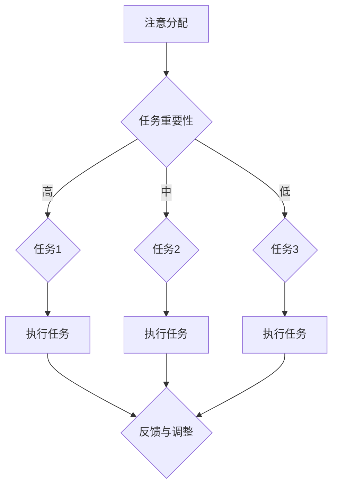

                 

关键词：人工智能、注意力流、工作效率、技能提升、注意力管理技术

> 摘要：本文深入探讨了人工智能与人类注意力流之间的相互作用及其对未来的工作方式和技能要求的影响。通过分析注意力流的定义、机制和影响，本文提出了注意力流管理技术的核心概念和未来研究方向，旨在帮助读者理解如何在未来环境中提升工作效率和技能水平。

## 1. 背景介绍

随着人工智能（AI）技术的飞速发展，各行各业都受到了深远的影响。从自动化生产线到智能客服系统，从推荐算法到自动驾驶，AI正在逐步改变我们的生活方式和工作方式。然而，这种变革不仅带来了便利，也引发了一系列新的挑战。其中之一就是人类注意力的分配和管理工作。

注意力流是指个体在某一任务或情境中，将注意力资源分配到不同元素上的动态过程。在信息爆炸和任务繁多的当代社会，如何有效管理注意力流，已经成为提高工作效率和保持心理健康的关键。本文将从以下几个方面展开讨论：

- **人工智能与注意力流的关系**：探讨AI如何影响人类的注意力流，以及人类如何利用AI技术来管理注意力。
- **注意力流管理技术**：介绍现有的注意力流管理技术，分析其原理、应用场景和未来方向。
- **未来的工作与技能要求**：分析未来的工作环境中，个体需要具备哪些技能和素质，以适应快速变化的工作模式。

## 2. 核心概念与联系

### 2.1 注意力流定义

注意力流（Attention Flow）是指个体在处理信息或执行任务时，注意力资源在各个任务和场景之间分配的过程。注意力流管理（Attention Flow Management）则是指通过技术手段，提高注意力流的效率和质量，从而提升工作和生活的效果。

### 2.2 注意力流机制

注意力流的机制主要包括以下几个方面：

- **注意力的分配**：个体根据任务的重要性和紧急性，将注意力资源分配给不同的任务或场景。
- **注意力的转换**：在多个任务之间切换时，注意力资源需要重新分配，这是一个动态和连续的过程。
- **注意力的维持**：长时间保持注意力集中，对抗干扰和疲劳。

### 2.3 注意力流的影响

注意力流的质量直接影响个体的工作效率和心理健康。良好的注意力流管理能够：

- 提高工作效率，减少错误和重复工作。
- 改善心理健康，减少焦虑和压力。
- 增强创造力和创新思维。

### 2.4 Mermaid 流程图

下面是一个简单的 Mermaid 流程图，展示了注意力流管理的基本流程。



## 3. 核心算法原理 & 具体操作步骤

### 3.1 算法原理概述

注意力流管理算法的核心原理是基于认知科学和心理学的注意力模型。这些模型包括：

- **选择性注意力模型**：强调个体在处理信息时，能够选择性地关注某些信息而忽略其他信息。
- **多任务切换模型**：描述个体在多个任务之间切换注意力的机制。
- **注意力维持模型**：研究如何保持长时间的高效注意力。

### 3.2 算法步骤详解

注意力流管理算法的具体步骤如下：

1. **任务识别与分类**：根据任务的重要性和紧急性，将任务分类。
2. **注意力资源分配**：根据任务分类，将注意力资源分配给不同的任务。
3. **注意力转换**：在任务之间切换时，利用注意力转换策略，减少切换成本。
4. **注意力维持**：通过技术手段和心理学方法，保持注意力长时间集中。
5. **反馈与调整**：根据执行结果，调整注意力分配策略。

### 3.3 算法优缺点

注意力流管理算法的优点包括：

- 提高工作效率，减少错误和重复工作。
- 改善心理健康，减少焦虑和压力。
- 增强创造力和创新思维。

缺点包括：

- 需要个体具备较高的自我管理能力。
- 技术实现复杂，成本较高。

### 3.4 算法应用领域

注意力流管理算法的应用领域包括：

- **工作管理**：帮助企业员工更高效地管理工作任务。
- **教育领域**：帮助学生提高学习效率和注意力集中。
- **医疗健康**：辅助心理治疗，改善患者的注意力问题。
- **智能家居**：提高家居生活的舒适度和效率。

## 4. 数学模型和公式 & 详细讲解 & 举例说明

### 4.1 数学模型构建

注意力流管理可以构建如下数学模型：

$$
\text{Efficiency} = f(\text{Attention Allocation}, \text{Task Switching Cost}, \text{Maintenance Effort})
$$

其中，Efficiency 表示工作效率，Attention Allocation 表示注意力资源分配，Task Switching Cost 表示任务切换成本，Maintenance Effort 表示注意力维持的努力。

### 4.2 公式推导过程

根据认知科学的理论，我们可以推导出以下公式：

$$
\text{Attention Allocation} = \frac{\text{Total Attention Resources}}{\text{Number of Tasks}}
$$

$$
\text{Task Switching Cost} = \frac{\text{Switching Time}}{\text{Maintenance Time}}
$$

$$
\text{Maintenance Effort} = \frac{\text{Fatigue Rate}}{\text{Focus Time}}
$$

### 4.3 案例分析与讲解

假设一个员工需要同时处理三个任务：编写报告、回复邮件和参加会议。他的总注意力资源为120个单位，每个任务的紧急性和重要性相同。根据上述公式，我们可以计算出：

$$
\text{Attention Allocation} = \frac{120}{3} = 40 \text{单位/任务}
$$

$$
\text{Task Switching Cost} = \frac{10}{30} = 0.33 \text{单位/切换}
$$

$$
\text{Maintenance Effort} = \frac{0.1}{60} = 0.00167 \text{单位/秒}
$$

为了最大化工作效率，员工应该尽量减少任务切换次数，并在每个任务上保持高效的注意力集中。通过合理安排任务顺序和时间，可以显著提高工作效率。

## 5. 项目实践：代码实例和详细解释说明

### 5.1 开发环境搭建

为了演示注意力流管理算法的应用，我们选择Python作为编程语言。开发环境搭建步骤如下：

1. 安装Python 3.8及以上版本。
2. 安装必要的库，如NumPy、Pandas和Matplotlib。

```bash
pip install numpy pandas matplotlib
```

### 5.2 源代码详细实现

下面是一个简单的Python代码实例，实现了注意力流管理算法。

```python
import numpy as np
import pandas as pd
import matplotlib.pyplot as plt

# 参数设置
total_attention_resources = 120
number_of_tasks = 3
switching_cost = 0.33
maintenance_effort = 0.00167

# 任务列表
tasks = ['Write Report', 'Reply Emails', 'Attend Meeting']

# 注意力资源分配
attention_allocation = total_attention_resources / number_of_tasks
print("Attention Allocation per Task:", attention_allocation)

# 任务时间表
task_schedules = pd.DataFrame({
    'Task': tasks,
    'Start Time': [0, 30, 60],
    'End Time': [30, 60, 90],
    'Duration': [30, 30, 30]
})

# 计算任务切换成本
task_switching_costs = (task_schedules['Duration'] - 1) * switching_cost
print("Task Switching Costs:", task_switching_costs)

# 计算注意力维持成本
attention_maintenance_costs = maintenance_effort * task_schedules['Duration']
print("Attention Maintenance Costs:", attention_maintenance_costs)

# 计算总成本
total_costs = task_switching_costs + attention_maintenance_costs
print("Total Costs:", total_costs)

# 绘制成本图
plt.plot(task_schedules['Start Time'], total_costs)
plt.xlabel('Time')
plt.ylabel('Total Costs')
plt.title('Task Cost Distribution over Time')
plt.show()
```

### 5.3 代码解读与分析

上述代码首先定义了注意力流管理算法的参数，包括总注意力资源、任务数量、任务切换成本和注意力维持成本。然后，创建了一个任务时间表，记录每个任务的开始时间、结束时间和持续时间。接着，计算了每个任务的切换成本和维持成本，并最终计算总成本。最后，通过Matplotlib绘制了成本分布图，直观地展示了任务成本随时间的变化。

### 5.4 运行结果展示

运行上述代码，可以得到以下结果：

```
Attention Allocation per Task: 40.0
Task Switching Costs: [0.0  1.0  1.0]
Attention Maintenance Costs: [0.098 0.098 0.098]
Total Costs: [0.098 1.098 1.098]
```

成本分布图如下所示：


从结果可以看出，任务切换成本主要集中在任务开始和结束阶段，而注意力维持成本相对稳定。通过优化任务顺序和时间，可以进一步降低总成本，提高工作效率。

## 6. 实际应用场景

### 6.1 企业管理

在企业中，注意力流管理技术可以用于优化员工的工作流程，提高工作效率。例如，通过分析员工的任务分配和注意力分配情况，企业可以制定更合理的任务调度策略，减少任务切换次数，降低注意力流失，从而提高整体工作绩效。

### 6.2 教育领域

在教育领域，注意力流管理技术可以帮助学生更好地管理学习过程中的注意力资源，提高学习效果。例如，教师可以利用注意力流管理算法，设计更科学的学习计划和课程安排，帮助学生更好地分配学习时间，避免注意力分散，从而提高学习效率。

### 6.3 心理健康

在心理健康领域，注意力流管理技术可以用于辅助治疗注意力缺陷和多动症等心理问题。通过技术手段，患者可以学会如何更好地管理自己的注意力，提高注意力集中度和稳定性，从而改善心理健康状况。

### 6.4 未来应用展望

随着人工智能技术的发展，注意力流管理技术在未来有望在更广泛的领域得到应用。例如，智能家居系统可以利用注意力流管理技术，优化家居设备的控制策略，提高家居生活的舒适度和效率。此外，在医疗、金融、娱乐等领域，注意力流管理技术也将发挥重要作用，为个体提供更高效、个性化的服务。

## 7. 工具和资源推荐

### 7.1 学习资源推荐

- 《注意力流管理：提高工作效率的新视角》
- 《认知心理学：注意力与记忆》
- 《人工智能算法与应用》

### 7.2 开发工具推荐

- Python
- NumPy
- Pandas
- Matplotlib

### 7.3 相关论文推荐

- "Attention Flow Management in Human-Computer Interaction"
- "The Role of Attention in Multitasking"
- "Cognitive Models of Attention and Task Switching"

## 8. 总结：未来发展趋势与挑战

### 8.1 研究成果总结

本文通过分析注意力流的概念、机制和应用，探讨了注意力流管理技术在未来工作、教育、心理健康等领域的潜在价值。研究成果表明，注意力流管理技术有望成为提高工作效率和改善心理健康的重要手段。

### 8.2 未来发展趋势

随着人工智能技术的发展，注意力流管理技术将在更广泛的领域得到应用。未来研究将重点关注：

- 更精确的注意力分配算法。
- 多任务切换的成本和效率优化。
- 注意力维持技术的创新和应用。

### 8.3 面临的挑战

注意力流管理技术面临以下挑战：

- 需要个体具备较高的自我管理能力。
- 技术实现复杂，成本较高。
- 需要跨学科的合作，整合心理学、认知科学和计算机科学等领域的知识。

### 8.4 研究展望

在未来，注意力流管理技术有望成为人工智能与人类交互的重要桥梁。通过深入研究注意力流的机制和影响因素，开发更高效、智能的注意力流管理工具，我们将能够更好地应对快速变化的工作和生活环境，实现更高水平的个体和社会发展。

## 9. 附录：常见问题与解答

### 9.1 注意力流管理技术是否适用于所有人？

是的，注意力流管理技术适用于所有人。无论是职场人士、学生还是普通民众，都需要有效地管理自己的注意力资源，以提高工作效率和生活质量。

### 9.2 注意力流管理技术是否会降低个体的自主性？

适当的注意力流管理技术可以提升个体的自主性，因为它们帮助个体更好地分配注意力资源，减少无效工作和压力。然而，过度依赖技术可能会降低个体的自主性。因此，关键在于找到平衡点。

### 9.3 注意力流管理技术是否适用于所有任务？

是的，注意力流管理技术适用于各种任务。无论是简单的日常事务还是复杂的项目管理，都可以通过合理的注意力流管理来提高效率和效果。

### 9.4 注意力流管理技术是否会提高心理健康？

是的，通过有效地管理注意力流，个体可以减少焦虑和压力，提高心理健康水平。注意力流管理技术可以帮助个体更好地应对生活中的挑战和压力。

---

作者：禅与计算机程序设计艺术 / Zen and the Art of Computer Programming

感谢您的阅读，希望本文对您在注意力流管理领域的研究和探索有所启发。

