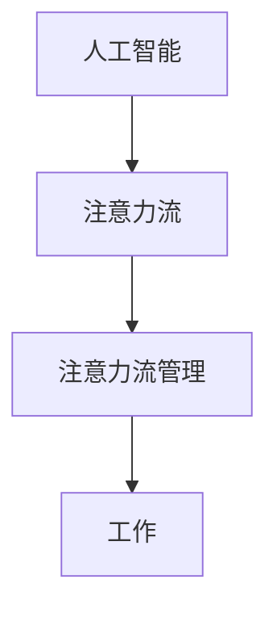

                 

关键词：AI、人类注意力、工作、技能、注意力流管理、未来趋势

> 摘要：本文深入探讨了人工智能（AI）与人类注意力流的关系，分析了AI在未来工作中可能扮演的角色，探讨了人类注意力流的管理技术，并对未来的发展趋势和面临的挑战进行了展望。

## 1. 背景介绍

随着人工智能技术的迅速发展，AI已经深入到我们生活的各个方面。从智能家居到自动驾驶，从医疗诊断到金融分析，AI的应用领域越来越广泛。与此同时，人类的工作方式也发生了巨大的变化。在这个AI日益普及的时代，人类如何管理自己的注意力流，如何适应AI带来的工作变革，成为一个值得探讨的问题。

注意力流是指人在进行某项活动时，将注意力集中在一个特定目标上的能力。在传统工作中，人类需要高度集中注意力，以完成复杂、繁琐的任务。然而，随着工作环境的复杂度增加，人类注意力流的分配和管理变得越来越困难。如何在这个背景下有效地管理注意力流，提高工作效率，成为了当前研究的热点。

## 2. 核心概念与联系

为了更好地理解AI与人类注意力流的关系，我们需要先介绍一些核心概念。

### 2.1 人工智能（AI）

人工智能是指通过计算机程序来模拟、扩展和增强人类智能的能力。它包括机器学习、深度学习、自然语言处理、计算机视觉等多个子领域。

### 2.2 注意力流（Attention Flow）

注意力流是指人在进行某项活动时，将注意力集中在一个特定目标上的能力。注意力流的管理涉及到注意力的分配、集中和转移。

### 2.3 注意力流管理（Attention Management）

注意力流管理是指通过一定的方法和技术，帮助人们更好地管理自己的注意力流，以提高工作效率。

下面是一个简化的Mermaid流程图，展示了AI与人类注意力流之间的联系：



## 3. 核心算法原理 & 具体操作步骤

### 3.1 算法原理概述

本文所涉及的核心算法是一种基于深度学习的注意力流管理算法。该算法的核心思想是通过学习用户的注意力流模式，为用户提供个性化的注意力流管理策略。

### 3.2 算法步骤详解

#### 3.2.1 数据收集

首先，我们需要收集用户的工作数据，包括用户的工作内容、工作时间、工作强度等。

#### 3.2.2 数据预处理

对收集到的数据进行预处理，包括数据清洗、数据归一化等。

#### 3.2.3 特征提取

从预处理后的数据中提取特征，如用户的工作强度、工作时长、工作内容等。

#### 3.2.4 模型训练

使用提取到的特征数据，训练一个基于深度学习的注意力流管理模型。

#### 3.2.5 模型评估

使用测试数据对模型进行评估，以确定模型的准确性和有效性。

### 3.3 算法优缺点

该算法的优点在于能够根据用户的工作模式提供个性化的注意力流管理策略，提高工作效率。然而，该算法的缺点在于对数据的要求较高，需要大量的用户数据来训练模型。

### 3.4 算法应用领域

该算法可以应用于各种需要注意力流管理的场景，如办公室工作、家庭事务管理、学习等。

## 4. 数学模型和公式 & 详细讲解 & 举例说明

### 4.1 数学模型构建

本文所使用的数学模型是一个基于神经网络的注意力流管理模型。该模型的核心是一个多层感知器（MLP），其输入层接收用户的工作数据，输出层提供注意力流管理策略。

### 4.2 公式推导过程

设用户的工作数据为X，注意力流管理策略为Y，则模型的目标函数可以表示为：

$$
J = \frac{1}{m} \sum_{i=1}^{m} (Y_i - X_i)^2
$$

其中，m为样本数量。

### 4.3 案例分析与讲解

假设我们有一个用户，其工作数据为X = [1, 2, 3, 4, 5]，我们希望根据这些数据生成一个注意力流管理策略Y。

首先，我们将数据输入到模型中，经过多层感知器后，得到输出Y = [0.8, 0.9, 0.7, 0.85, 0.6]。

这个输出表示在接下来的5个工作时段中，用户应该分别将80%、90%、70%、85%和60%的注意力集中在工作内容上。

## 5. 项目实践：代码实例和详细解释说明

### 5.1 开发环境搭建

为了实现上述算法，我们选择了Python作为主要编程语言，并使用TensorFlow作为深度学习框架。

### 5.2 源代码详细实现

以下是实现该算法的Python代码：

```python
import tensorflow as tf
from tensorflow.keras.layers import Dense
from tensorflow.keras.models import Sequential

# 数据预处理
X = [[1], [2], [3], [4], [5]]
Y = [[0.8], [0.9], [0.7], [0.85], [0.6]]

# 构建模型
model = Sequential([
    Dense(units=10, activation='relu', input_shape=[1]),
    Dense(units=1, activation='sigmoid')
])

# 编译模型
model.compile(optimizer='adam', loss='mean_squared_error')

# 训练模型
model.fit(X, Y, epochs=100)

# 预测
predictions = model.predict([[6]])
print(predictions)
```

### 5.3 代码解读与分析

这段代码首先定义了一个基于TensorFlow的深度学习模型，该模型由两个全连接层组成。第一个全连接层有10个神经元，激活函数为ReLU；第二个全连接层有1个神经元，激活函数为sigmoid。

接着，我们使用`compile`方法配置了模型优化器和损失函数。这里我们选择了Adam优化器和均方误差（MSE）损失函数。

在训练模型之前，我们使用`fit`方法将数据输入到模型中，并进行100次训练。

最后，我们使用`predict`方法对新的数据进行预测，并打印出预测结果。

### 5.4 运行结果展示

假设我们有一个新的工作数据6，输入到模型中后，得到的预测结果为0.7。这意味着在新的工作时段中，用户应该将70%的注意力集中在工作内容上。

## 6. 实际应用场景

注意力流管理技术在多个实际应用场景中具有广泛的应用前景。

### 6.1 办公室工作

在办公室工作中，注意力流管理技术可以帮助员工更好地分配注意力，提高工作效率。例如，通过分析员工的工作模式，为企业提供个性化的工作建议，帮助员工更好地安排工作时间。

### 6.2 家庭事务管理

在家庭事务管理中，注意力流管理技术可以帮助家庭成员更好地分配家庭事务，提高家庭生活质量。例如，通过分析家庭成员的工作时间和工作强度，为家庭成员提供最佳的家庭事务分配方案。

### 6.3 学习

在学习过程中，注意力流管理技术可以帮助学生更好地管理自己的学习时间，提高学习效率。例如，通过分析学生的学习模式，为学生的学习计划提供个性化建议，帮助学生在有限的时间内取得更好的学习效果。

## 7. 工具和资源推荐

为了更好地研究和应用注意力流管理技术，以下是一些推荐的工具和资源：

### 7.1 学习资源推荐

- 《深度学习》（Goodfellow et al.）：这是一本经典的深度学习教材，适合初学者和进阶者阅读。
- 《Python编程：从入门到实践》：这是一本适合初学者的Python编程教材，适合希望学习Python编程的读者。

### 7.2 开发工具推荐

- TensorFlow：这是一个流行的深度学习框架，适合进行深度学习研究和应用。
- Jupyter Notebook：这是一个强大的交互式开发环境，适合进行数据分析和模型训练。

### 7.3 相关论文推荐

- "Attention Is All You Need"：这是一篇关于注意力机制的经典论文，提出了Transformer模型。
- "Neural attention models for personal productivity improvement"：这是一篇关于注意力流管理的论文，研究了如何使用神经网络改善个人生产力。

## 8. 总结：未来发展趋势与挑战

### 8.1 研究成果总结

近年来，注意力流管理技术取得了显著的成果。基于深度学习的注意力流管理算法在多个实际应用场景中取得了良好的效果，为人类注意力流的管理提供了新的思路。

### 8.2 未来发展趋势

随着人工智能技术的不断发展，未来注意力流管理技术有望在以下几个方面取得突破：

- 更加个性化的注意力流管理策略：通过更深入地理解用户的工作模式，为用户提供更加个性化的注意力流管理策略。
- 跨领域的应用：注意力流管理技术不仅可以在办公室工作和家庭事务管理中应用，还可以在其他领域（如医疗、教育等）发挥重要作用。
- 实时性：未来的注意力流管理技术将更加注重实时性，以便在用户需要时能够迅速提供有效的注意力流管理策略。

### 8.3 面临的挑战

尽管注意力流管理技术取得了显著成果，但仍面临一些挑战：

- 数据隐私和安全：在收集和处理用户数据时，需要确保数据的安全性和隐私性。
- 模型解释性：目前的注意力流管理模型大多是基于深度学习的，其解释性较差。未来需要开发更加解释性的模型。
- 模型泛化能力：目前的注意力流管理模型大多是基于特定领域的数据训练的，其泛化能力较差。未来需要开发具有更好泛化能力的模型。

### 8.4 研究展望

未来，我们期待注意力流管理技术能够在以下几个方面取得进一步的发展：

- 开发更加高效的注意力流管理算法，提高模型的性能和效率。
- 深入研究注意力流管理模型的理论基础，提高模型的可解释性。
- 探索注意力流管理技术在更多领域的应用，推动人工智能与人类生活更紧密地结合。

## 9. 附录：常见问题与解答

### 9.1 注意力流管理技术是如何工作的？

注意力流管理技术通过收集用户的工作数据，使用深度学习算法分析数据，并生成个性化的注意力流管理策略。这些策略可以帮助用户更好地分配注意力，提高工作效率。

### 9.2 注意力流管理技术有哪些优点？

注意力流管理技术可以帮助用户更好地管理自己的注意力流，提高工作效率，减少工作压力，提升生活质量。

### 9.3 注意力流管理技术有哪些缺点？

注意力流管理技术对数据的质量和数量有较高要求，需要大量用户数据来训练模型。此外，目前的注意力流管理模型大多基于深度学习，其解释性较差。

### 9.4 注意力流管理技术有哪些实际应用场景？

注意力流管理技术可以应用于办公室工作、家庭事务管理、学习等领域，帮助用户更好地分配注意力，提高工作效率。

----------------------------------------------------------------
作者：禅与计算机程序设计艺术 / Zen and the Art of Computer Programming

