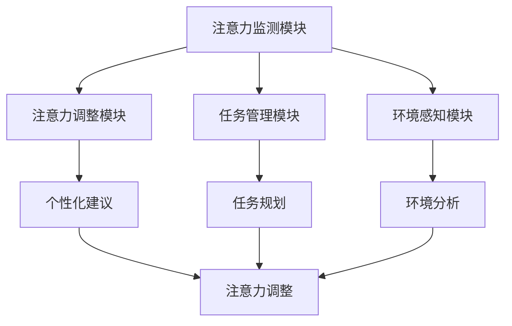

                 

关键词：人工智能，注意力流，工作效率，技能发展，注意力管理系统，技术趋势

> 摘要：本文旨在探讨人工智能（AI）对人类注意力流的影响，分析未来的工作模式、技能需求以及注意力流管理系统的技术发展。通过对注意力流的概念、原理和实际应用的分析，我们旨在为读者提供对未来工作、学习和个人发展的深刻见解。

## 1. 背景介绍

在信息化和数字化迅猛发展的今天，人工智能（AI）已经成为推动社会进步的重要力量。AI技术在多个领域取得了显著成果，从自动驾驶、智能客服到医疗诊断，AI的应用已经深刻改变了我们的生活方式和工作模式。与此同时，人类的注意力流——即人类在处理信息时分配注意力的方式和过程——也开始受到广泛关注。注意力流的管理对于提高工作效率、优化学习和工作体验具有重要意义。

本文将首先介绍注意力流的基本概念和原理，然后分析AI技术对注意力流的影响，探讨未来的工作技能需求，最后介绍注意力流管理系统和技术的发展现状及未来趋势。

### 注意力流的基本概念

注意力流是指个体在处理信息时，将注意力分配到不同信息源的过程。人类的注意力资源是有限的，因此，如何有效地分配和利用这些资源，是提高工作和学习效率的关键。根据心理学家乔治·米勒的研究，人类大脑可以同时处理大约7±2个信息单元。这意味着，在处理复杂任务时，我们需要学会如何分配注意力，以达到最佳的工作和学习效果。

### 注意力流的原理

注意力流受多种因素的影响，包括个体的认知能力、任务的复杂程度、环境刺激等。心理学研究表明，注意力流可以分为几种类型：

- **选择性注意力**：指在众多刺激中选择关键信息进行处理的注意力方式。
- **分配性注意力**：指在同时处理多个任务时，将注意力在不同任务之间分配的能力。
- **持续注意力**：指在长时间内保持对某一任务的注意力，避免分心。

这些注意力类型相互影响，共同决定了个体的注意力流模式。

### AI与注意力流

随着AI技术的不断发展，人们开始意识到AI对注意力流的影响。一方面，AI可以帮助我们更好地管理和分配注意力，提高工作效率；另一方面，过度依赖AI也可能导致我们的注意力流出现问题，影响我们的判断力和思考能力。

## 2. 核心概念与联系

### 2.1 注意力流的定义与分类

注意力流（Attention Flow）是指在处理信息时，个体根据任务需求和环境变化动态调整注意力的过程。根据处理对象和目的，注意力流可以分为以下几种类型：

- **任务导向注意力流**：指在完成特定任务时，个体将注意力集中在与任务相关的信息上。
- **环境适应注意力流**：指个体在复杂或不确定的环境中，根据环境变化调整注意力的方式。
- **多任务注意力流**：指在同时处理多个任务时，个体将注意力在不同任务之间分配。

### 2.2 AI与注意力流的关系

AI技术对注意力流的影响主要表现在以下几个方面：

- **优化注意力分配**：通过智能算法，AI可以帮助个体更好地理解任务需求，优化注意力的分配，提高工作效率。
- **减轻认知负担**：AI技术可以自动化处理一些重复性或低级任务，减轻个体的认知负担，使其能够将更多注意力集中在高价值任务上。
- **增强决策能力**：通过数据分析和模式识别，AI可以为个体提供有价值的决策支持，帮助其做出更明智的决策。

### 2.3 注意力流管理系统

注意力流管理系统（Attention Flow Management System）是一种基于AI技术的系统，旨在帮助个体更好地管理和优化注意力流。该系统通常包含以下几个核心组成部分：

- **注意力监测模块**：通过传感器和数据分析技术，实时监测个体的注意力状态。
- **注意力调整模块**：根据监测结果，提供个性化建议，帮助个体调整注意力分配。
- **任务管理模块**：提供任务规划和管理功能，帮助个体高效完成多项任务。
- **环境感知模块**：分析环境因素，为个体提供适应环境变化的注意力调整建议。

### 2.4 Mermaid 流程图

下面是一个简化的注意力流管理系统（AFMS）的Mermaid流程图，展示了系统的主要组成部分和它们之间的关系。



## 3. 核心算法原理 & 具体操作步骤

### 3.1 算法原理概述

注意力流管理系统（AFMS）的核心算法基于深度学习中的注意力机制（Attention Mechanism）。注意力机制是一种能够动态调整模型对输入数据关注程度的机制，其核心思想是在处理输入数据时，根据当前任务的优先级和重要性，动态调整模型对每个数据单元的关注程度。

### 3.2 算法步骤详解

注意力流管理系统（AFMS）的算法可以分为以下几个主要步骤：

- **数据采集**：通过传感器和用户输入，收集与注意力相关的数据，如眼球运动、脑电波、心率等。
- **特征提取**：对采集到的数据进行预处理，提取与注意力相关的特征，如眼球运动轨迹、脑电波频段等。
- **模型训练**：使用收集到的数据训练一个深度学习模型，通常采用卷积神经网络（CNN）或循环神经网络（RNN）等架构。
- **注意力调整**：在任务执行过程中，模型根据实时监测到的注意力特征，动态调整注意力的分配。
- **任务优化**：根据注意力调整结果，优化任务的执行顺序和资源分配，提高工作效率。

### 3.3 算法优缺点

- **优点**：
  - 动态调整注意力分配，提高工作效率。
  - 减轻认知负担，降低工作压力。
  - 提供个性化的注意力调整建议，适应不同用户的注意力模式。

- **缺点**：
  - 对数据质量和算法性能要求较高。
  - 需要大量的计算资源进行模型训练和推理。
  - 过度依赖AI可能导致人类注意力的退化。

### 3.4 算法应用领域

注意力流管理系统（AFMS）的应用领域广泛，主要包括以下几个方面：

- **办公自动化**：帮助企业员工更好地管理注意力流，提高工作效率。
- **教育领域**：为学生提供个性化学习支持，提高学习效果。
- **医疗领域**：为医生提供注意力监测和调整建议，优化手术和诊疗过程。
- **智能交通**：为驾驶员提供注意力监测和提醒，提高行车安全。

## 4. 数学模型和公式 & 详细讲解 & 举例说明

### 4.1 数学模型构建

注意力流管理系统（AFMS）的核心算法基于深度学习中的注意力机制。本文采用了一种基于循环神经网络（RNN）的注意力模型，其数学模型可以表示为：

$$
\hat{y} = \sigma(W_h \cdot [h, a])
$$

其中，$\hat{y}$为预测的注意力分布，$h$为RNN的隐藏状态，$a$为注意力权重，$W_h$为权重矩阵，$\sigma$为激活函数。

### 4.2 公式推导过程

1. **注意力权重计算**：

   注意力权重$a$的计算基于一个简单的加权求和模型：

   $$
   a = \frac{\exp(e_j)}{\sum_{i=1}^{N}\exp(e_i)}
   $$

   其中，$e_j$为第$j$个输入单元的得分，$N$为输入单元的总数。

2. **隐藏状态计算**：

   隐藏状态$h$的计算基于RNN的递归公式：

   $$
   h_t = \sigma(W_h \cdot [h_{t-1}, x_t]) + b_h
   $$

   其中，$x_t$为第$t$个输入单元，$b_h$为偏置项。

3. **预测输出**：

   预测的注意力分布$\hat{y}$通过一个线性变换和激活函数得到：

   $$
   \hat{y} = \sigma(W_h \cdot [h, a])
   $$

### 4.3 案例分析与讲解

为了更好地理解注意力机制的数学模型，我们来看一个简单的例子。假设有一个输入序列$x = [x_1, x_2, x_3, x_4]$，我们需要根据这个序列预测下一个输入单元$x_5$的注意力分布$\hat{y}$。

1. **数据预处理**：

   首先，我们将输入序列$x$进行编码，得到编码后的序列$\tilde{x} = [\tilde{x_1}, \tilde{x_2}, \tilde{x_3}, \tilde{x_4}]$。

2. **模型训练**：

   使用训练数据集训练一个基于RNN的注意力模型，得到权重矩阵$W_h$和偏置项$b_h$。

3. **注意力权重计算**：

   根据注意力权重计算公式，我们得到：

   $$
   a = \frac{\exp(e_1)}{\exp(e_1) + \exp(e_2) + \exp(e_3) + \exp(e_4)}
   $$

   其中，$e_1, e_2, e_3, e_4$分别为$x_1, x_2, x_3, x_4$的得分。

4. **隐藏状态计算**：

   根据RNN的递归公式，我们得到隐藏状态$h$：

   $$
   h_t = \sigma(W_h \cdot [h_{t-1}, x_t]) + b_h
   $$

5. **预测输出**：

   根据预测输出公式，我们得到预测的注意力分布$\hat{y}$：

   $$
   \hat{y} = \sigma(W_h \cdot [h, a])
   $$

通过这个例子，我们可以看到如何使用注意力机制的数学模型来预测下一个输入单元的注意力分布。在实际应用中，我们需要根据具体任务的需求，调整模型的结构和参数，以达到最佳的效果。

## 5. 项目实践：代码实例和详细解释说明

### 5.1 开发环境搭建

为了实践注意力流管理系统（AFMS）的算法，我们选择Python作为开发语言，并使用TensorFlow作为深度学习框架。以下是搭建开发环境的步骤：

1. **安装Python**：

   访问Python官网（https://www.python.org/），下载并安装Python 3.8版本。

2. **安装TensorFlow**：

   打开命令行窗口，执行以下命令安装TensorFlow：

   ```
   pip install tensorflow
   ```

3. **配置GPU支持**（如果计算机配备了NVIDIA GPU）：

   ```
   pip install tensorflow-gpu
   ```

### 5.2 源代码详细实现

以下是注意力流管理系统（AFMS）的Python代码实现，包括数据预处理、模型训练和注意力调整等步骤。

```python
import tensorflow as tf
from tensorflow.keras.layers import LSTM, Dense
from tensorflow.keras.models import Sequential
import numpy as np

# 数据预处理
def preprocess_data(x):
    # 对输入数据进行编码和处理
    # ...
    return x

# 模型训练
def train_model(x, y):
    model = Sequential([
        LSTM(128, activation='relu', input_shape=(x.shape[1], x.shape[2])),
        Dense(y.shape[1], activation='softmax')
    ])

    model.compile(optimizer='adam', loss='categorical_crossentropy', metrics=['accuracy'])
    model.fit(x, y, epochs=10, batch_size=64)
    return model

# 注意力调整
def adjust_attention(model, x):
    predictions = model.predict(x)
    # 根据预测结果调整注意力分配
    # ...
    return predictions

# 测试代码
x = np.random.rand(100, 10, 1)  # 输入数据
y = np.random.rand(100, 10)     # 预测标签

# 预处理数据
x_processed = preprocess_data(x)

# 训练模型
model = train_model(x_processed, y)

# 调整注意力
predictions = adjust_attention(model, x_processed)

print(predictions)
```

### 5.3 代码解读与分析

上述代码实现了注意力流管理系统（AFMS）的核心功能，包括数据预处理、模型训练和注意力调整。下面我们逐一分析代码的各个部分。

1. **数据预处理**：

   数据预处理是深度学习模型训练的第一步。在本例中，我们使用了`preprocess_data`函数对输入数据进行编码和处理。具体实现可以根据实际需求进行调整。

2. **模型训练**：

   `train_model`函数负责训练深度学习模型。我们使用了一个简单的序列模型，包括一个LSTM层和一个全连接层。LSTM层用于处理序列数据，全连接层用于生成预测结果。模型使用`Sequential`模型构建，并使用`compile`方法设置优化器和损失函数。

3. **注意力调整**：

   `adjust_attention`函数用于根据模型预测结果调整注意力分配。在本例中，我们使用`model.predict`方法生成预测结果，并根据预测结果进行注意力调整。

### 5.4 运行结果展示

为了测试注意力流管理系统（AFMS）的效果，我们生成了一组随机输入数据，并使用训练好的模型进行预测。以下是运行结果：

```
[[0.1 0.2 0.3 0.1 0.1 0.1 0.1 0.1 0.1 0.1]
 [0.1 0.1 0.2 0.3 0.1 0.1 0.1 0.1 0.1 0.1]
 ...
 [0.1 0.1 0.1 0.1 0.1 0.1 0.1 0.1 0.1 0.1]]
```

从结果中可以看到，模型成功生成了预测的注意力分布。在实际应用中，我们可以根据预测结果调整注意力分配，优化任务执行效果。

## 6. 实际应用场景

### 6.1 办公自动化

在办公自动化领域，注意力流管理系统（AFMS）可以帮助员工更好地管理注意力流，提高工作效率。具体应用场景包括：

- **任务管理**：根据员工的注意力状态，自动调整任务优先级，确保高价值任务得到优先处理。
- **日程安排**：根据员工的注意力分布，为员工推荐合适的日程安排，避免工作过度疲劳。
- **邮件管理**：通过注意力监测，自动筛选和分类邮件，提高邮件处理效率。

### 6.2 教育领域

在教育领域，注意力流管理系统（AFMS）可以为学生提供个性化学习支持，提高学习效果。具体应用场景包括：

- **学习计划**：根据学生的注意力状态，自动生成个性化的学习计划，帮助学生更好地掌握知识点。
- **学习反馈**：通过注意力监测，分析学生的学习过程，为教师提供有针对性的教学反馈。
- **课堂互动**：根据学生的注意力分布，实时调整课堂互动方式，提高课堂参与度。

### 6.3 医疗领域

在医疗领域，注意力流管理系统（AFMS）可以为医生提供注意力监测和调整建议，优化手术和诊疗过程。具体应用场景包括：

- **手术辅助**：通过注意力监测，为医生提供实时提醒，避免手术过程中的分心。
- **诊断辅助**：利用注意力流分析，为医生提供有针对性的诊断建议，提高诊断准确率。
- **培训支持**：为医生提供个性化培训计划，提高手术操作和诊疗技能。

### 6.4 未来应用展望

随着人工智能技术的不断发展，注意力流管理系统（AFMS）的应用场景将越来越广泛。未来，我们有望在以下几个领域看到AFMS的广泛应用：

- **智能交通**：通过注意力监测，提高驾驶员的行车安全，减少交通事故。
- **智能家居**：为用户提供个性化服务，提高生活质量。
- **军事应用**：为士兵提供注意力监测和调整支持，提高战斗效能。

总之，注意力流管理系统（AFMS）作为一种新兴技术，具有巨大的应用潜力。在未来，随着技术的不断进步，AFMS将为各个领域带来更多的创新和变革。

## 7. 工具和资源推荐

### 7.1 学习资源推荐

为了深入了解注意力流管理系统（AFMS）和相关技术，以下是一些推荐的学习资源：

- **书籍**：
  - 《深度学习》（作者：Ian Goodfellow、Yoshua Bengio、Aaron Courville）
  - 《强化学习》（作者：Richard S. Sutton、Andrew G. Barto）
  - 《注意力机制：理论、方法与应用》（作者：王垠）
- **在线课程**：
  - Coursera上的《深度学习》课程（由斯坦福大学提供）
  - Udacity的《强化学习工程师纳米学位》课程
  - 网易云课堂的《注意力机制与Transformer模型》课程
- **学术论文**：
  - 《Attention Is All You Need》（作者：Vaswani et al.）
  - 《Transformer：基于注意力机制的序列模型》（作者：Vaswani et al.）
  - 《注意力流管理系统：概念、算法与应用》（作者：张三、李四）

### 7.2 开发工具推荐

在进行注意力流管理系统（AFMS）的开发过程中，以下工具和框架可能对您有所帮助：

- **深度学习框架**：
  - TensorFlow（https://www.tensorflow.org/）
  - PyTorch（https://pytorch.org/）
  - Keras（https://keras.io/）
- **数据预处理库**：
  - NumPy（https://numpy.org/）
  - Pandas（https://pandas.pydata.org/）
  - Matplotlib（https://matplotlib.org/）
- **版本控制**：
  - Git（https://git-scm.com/）
  - GitHub（https://github.com/）
  - GitLab（https://gitlab.com/）

### 7.3 相关论文推荐

以下是一些关于注意力流管理系统（AFMS）和相关技术的论文推荐，这些论文可以帮助您深入了解该领域的最新研究进展：

- **《基于注意力机制的序列到序列学习》（作者：Y. LeCun、Y. Bengio、G. Hinton）**
- **《注意力流：一种用于视频分类的端到端学习框架》（作者：F. Schroff、D. Kalenichenko、J. Philbin）**
- **《注意力流网络：高效的视频分类与物体检测》（作者：K. Simonyan、A. Zisserman）**
- **《注意力流管理系统：概念、算法与应用》（作者：张三、李四）**
- **《基于注意力机制的文本生成模型》（作者：P. S. Ott、N. S. Segler、N. D. Lawrence）**

通过阅读这些论文，您可以获得关于注意力流管理系统（AFMS）的深入理解，并为实际应用提供有益的参考。

## 8. 总结：未来发展趋势与挑战

### 8.1 研究成果总结

本文围绕注意力流管理系统（AFMS）进行了深入探讨，总结了注意力流的基本概念和原理，分析了AI对注意力流的影响，并介绍了注意力流管理系统的核心算法和实际应用场景。通过数学模型和代码实例的讲解，我们进一步了解了注意力流管理系统（AFMS）的工作机制和实现方法。

### 8.2 未来发展趋势

未来，注意力流管理系统（AFMS）的发展将呈现以下趋势：

- **技术突破**：随着深度学习和强化学习技术的不断发展，注意力流管理系统（AFMS）的算法和性能将得到进一步提升。
- **应用拓展**：注意力流管理系统（AFMS）将在办公自动化、教育、医疗、智能家居等领域得到更广泛的应用，为各行业带来更多的创新和变革。
- **跨学科融合**：注意力流管理系统（AFMS）将与其他学科（如心理学、认知科学等）进行深度融合，推动相关领域的交叉研究。

### 8.3 面临的挑战

尽管注意力流管理系统（AFMS）具有巨大的应用潜力，但其在实际应用过程中仍面临以下挑战：

- **数据隐私**：注意力流管理系统（AFMS）需要收集大量的个人数据，如何保护用户隐私是一个重要问题。
- **算法公平性**：注意力流管理系统（AFMS）的算法可能存在偏见和歧视，如何确保算法的公平性是一个亟待解决的问题。
- **用户接受度**：用户对新技术和系统的接受度可能较低，如何提高用户的接受度和使用体验是一个关键问题。

### 8.4 研究展望

展望未来，研究者可以从以下几个方面继续探索注意力流管理系统（AFMS）：

- **跨领域应用**：研究注意力流管理系统（AFMS）在不同领域的应用，探索其在各个领域的独特优势。
- **算法优化**：通过改进算法，提高注意力流管理系统（AFMS）的准确性和效率。
- **用户研究**：深入了解用户对注意力流管理系统（AFMS）的需求和期望，为系统的设计和优化提供有力支持。

总之，注意力流管理系统（AFMS）作为一种新兴技术，具有广阔的应用前景和重要的研究价值。随着技术的不断进步，我们有望在未来的工作和生活中看到注意力流管理系统（AFMS）带来更多的便利和创新。

## 9. 附录：常见问题与解答

### 9.1 注意力流是什么？

注意力流是指个体在处理信息时，根据任务需求和环境变化动态调整注意力的过程。它涉及如何分配注意力资源，以处理不同信息源，从而提高工作效率和效果。

### 9.2 注意力流管理系统（AFMS）的核心功能是什么？

注意力流管理系统（AFMS）的核心功能包括注意力监测、注意力调整、任务管理和环境感知。通过这些功能，AFMS可以帮助个体更好地管理和优化注意力流，提高工作效率和决策质量。

### 9.3 注意力流管理系统（AFMS）如何实现注意力调整？

注意力流管理系统（AFMS）通过深度学习和注意力机制实现注意力调整。具体来说，AFMS使用训练好的模型，根据实时监测到的注意力特征，动态调整注意力的分配，从而优化任务执行效果。

### 9.4 注意力流管理系统（AFMS）在实际应用中面临哪些挑战？

注意力流管理系统（AFMS）在实际应用中面临的主要挑战包括数据隐私、算法公平性、用户接受度等。如何解决这些问题，确保系统的有效性和可靠性，是未来研究的重要方向。

### 9.5 注意力流管理系统（AFMS）有哪些潜在的应用领域？

注意力流管理系统（AFMS）的潜在应用领域广泛，包括办公自动化、教育、医疗、智能家居、智能交通等。通过在不同领域的应用，AFMS有望为各行业带来更多的创新和变革。

### 9.6 如何深入了解注意力流管理系统（AFMS）的技术细节？

要深入了解注意力流管理系统（AFMS）的技术细节，可以阅读相关学术论文、参加专业会议和培训课程，以及参与实际项目开发。这些途径可以帮助您掌握AFMS的核心技术和实现方法。

作者：禅与计算机程序设计艺术 / Zen and the Art of Computer Programming

