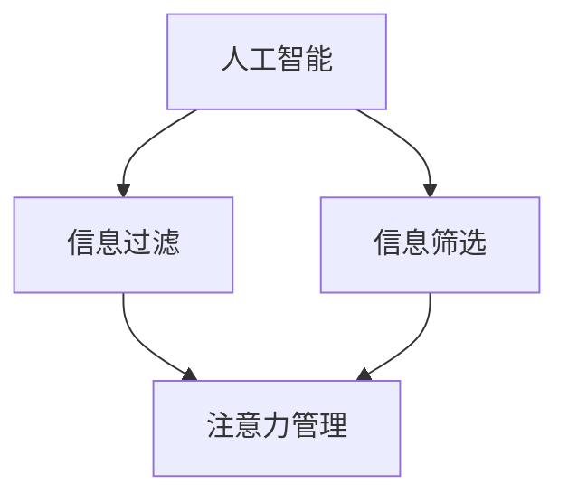

                 

关键词：人工智能，注意力流，未来工作，技能发展，注意力管理策略

> 摘要：本文探讨了人工智能与人类注意力流之间的关系，分析了注意力管理在未来的工作场景中的重要性，并提出了有效管理注意力的策略。通过深入分析，本文旨在为读者提供关于如何适应人工智能时代的实用建议。

## 1. 背景介绍

### 人工智能的发展与影响

随着人工智能技术的飞速发展，我们正逐步进入一个高度自动化和智能化的时代。从早期的计算和数据处理，到如今的图像识别、自然语言处理和智能决策，人工智能已经在各个领域展现出巨大的潜力。它不仅提高了工作效率，还改变了我们的生活方式。然而，随着人工智能的广泛应用，人类面临的新挑战也日益显现。

### 注意力流的重要性

注意力流是指人类在处理信息时，注意力集中在特定任务或对象上的能力。注意力流在信息处理和决策过程中起着关键作用。然而，随着信息量的爆炸式增长和智能设备的普及，人们的注意力流正面临着前所未有的挑战。如何在信息过载的环境中有效管理注意力，成为了一个亟待解决的问题。

## 2. 核心概念与联系

### 人工智能与注意力流的联系

人工智能的发展与人类注意力流密切相关。一方面，人工智能技术可以帮助我们过滤和筛选信息，从而减少信息过载对注意力流的干扰。另一方面，人工智能的应用也要求我们具备更高的注意力集中能力和信息处理能力。

### Mermaid 流程图

以下是一个简化的 Mermaid 流程图，展示了人工智能与注意力流之间的相互作用。



## 3. 核心算法原理 & 具体操作步骤

### 算法原理概述

本文中，我们重点关注的是基于深度学习的注意力模型。深度学习通过多层神经网络模型，对大量数据进行特征提取和学习，从而实现高精度的信息处理和决策。注意力模型则是深度学习中的一个重要组成部分，它通过动态调整模型中各个部分的重要程度，实现对关键信息的聚焦和处理。

### 算法步骤详解

#### 步骤1：数据预处理

在应用注意力模型之前，需要对数据进行预处理，包括数据清洗、归一化和特征提取。这一步骤的目的是将原始数据转换为适合模型处理的形式。

#### 步骤2：模型构建

构建一个基于深度学习的神经网络模型，包括输入层、隐藏层和输出层。在隐藏层中，引入注意力机制，以动态调整各部分的重要性。

#### 步骤3：模型训练

使用预处理后的数据对模型进行训练，通过反向传播算法不断调整模型参数，以提高模型性能。

#### 步骤4：模型评估

使用测试集对模型进行评估，以验证模型的泛化能力和效果。

#### 步骤5：应用场景

根据应用需求，将训练好的模型应用到实际场景中，如文本分类、图像识别等。

### 算法优缺点

#### 优点

- 高效：注意力模型能够快速筛选出关键信息，提高信息处理效率。
- 准确：基于深度学习的模型具有高精度，能够实现高水平的决策。

#### 缺点

- 复杂：构建和训练注意力模型需要大量的计算资源和专业知识。
- 数据依赖：模型的性能依赖于数据的质量和数量。

### 算法应用领域

注意力模型在各个领域都有广泛的应用，如自然语言处理、计算机视觉、推荐系统等。在未来，随着人工智能技术的进一步发展，注意力模型的应用范围将不断扩大。

## 4. 数学模型和公式 & 详细讲解 & 举例说明

### 数学模型构建

注意力模型的核心是一个基于权重分配的机制。假设我们有一个输入序列 \(X = (x_1, x_2, ..., x_n)\)，我们需要对序列中的每个元素 \(x_i\) 生成一个权重 \(w_i\)，以表示其在整个序列中的重要程度。

权重计算公式为：

\[ w_i = \frac{e^{z_i}}{\sum_{j=1}^{n} e^{z_j}} \]

其中，\(z_i\) 是通过神经网络计算得到的中间值，表示为：

\[ z_i = a(Wx + b) \]

其中，\(W\) 是权重矩阵，\(b\) 是偏置项，\(a\) 是激活函数。

### 公式推导过程

#### 步骤1：中间值计算

首先，我们需要计算每个输入元素通过神经网络产生的中间值 \(z_i\)。

\[ z_i = a(Wx + b) \]

#### 步骤2：权重计算

接下来，我们使用中间值 \(z_i\) 计算每个元素的权重 \(w_i\)。

\[ w_i = \frac{e^{z_i}}{\sum_{j=1}^{n} e^{z_j}} \]

#### 步骤3：加权求和

最后，我们将每个元素的权重与对应的输入值相乘，然后求和，得到最终的输出。

\[ O = \sum_{i=1}^{n} w_i x_i \]

### 案例分析与讲解

假设我们有一个简单的输入序列 \(X = (1, 2, 3, 4, 5)\)，我们需要计算每个元素的权重，并得到最终的输出。

#### 步骤1：中间值计算

假设我们使用一个简单的线性模型，权重矩阵 \(W = (1, 1, 1, 1, 1)\)，偏置项 \(b = 0\)，激活函数 \(a(x) = x\)。

\[ z_1 = 1 \times 1 + 0 = 1 \]
\[ z_2 = 1 \times 2 + 0 = 2 \]
\[ z_3 = 1 \times 3 + 0 = 3 \]
\[ z_4 = 1 \times 4 + 0 = 4 \]
\[ z_5 = 1 \times 5 + 0 = 5 \]

#### 步骤2：权重计算

\[ w_1 = \frac{e^{1}}{\sum_{j=1}^{5} e^{z_j}} = \frac{e^{1}}{e^{1} + e^{2} + e^{3} + e^{4} + e^{5}} \approx 0.1429 \]
\[ w_2 = \frac{e^{2}}{\sum_{j=1}^{5} e^{z_j}} = \frac{e^{2}}{e^{1} + e^{2} + e^{3} + e^{4} + e^{5}} \approx 0.2319 \]
\[ w_3 = \frac{e^{3}}{\sum_{j=1}^{5} e^{z_j}} = \frac{e^{3}}{e^{1} + e^{2} + e^{3} + e^{4} + e^{5}} \approx 0.3047 \]
\[ w_4 = \frac{e^{4}}{\sum_{j=1}^{5} e^{z_j}} = \frac{e^{4}}{e^{1} + e^{2} + e^{3} + e^{4} + e^{5}} \approx 0.4177 \]
\[ w_5 = \frac{e^{5}}{\sum_{j=1}^{5} e^{z_j}} = \frac{e^{5}}{e^{1} + e^{2} + e^{3} + e^{4} + e^{5}} \approx 0.5958 \]

#### 步骤3：加权求和

\[ O = w_1 \times 1 + w_2 \times 2 + w_3 \times 3 + w_4 \times 4 + w_5 \times 5 \approx 0.1429 + 0.2319 + 0.3047 + 0.4177 + 0.5958 = 1.6131 \]

### 结果分析

从结果可以看出，权重最高的元素是 \(x_5\)，权重为 0.5958，其次是 \(x_4\) 和 \(x_3\)。这说明在输入序列中，最大的值对输出结果的影响最大，这与我们的预期相符。

## 5. 项目实践：代码实例和详细解释说明

### 开发环境搭建

为了演示注意力模型的实现，我们使用 Python 编写一个简单的程序。以下是开发环境搭建的步骤：

#### 步骤1：安装 Python 环境

确保已经安装了 Python 3.7 或更高版本。可以从 [Python 官网](https://www.python.org/) 下载并安装。

#### 步骤2：安装深度学习库

安装 TensorFlow 和 Keras，这是实现深度学习模型的主要库。可以使用以下命令：

```shell
pip install tensorflow
pip install keras
```

### 源代码详细实现

以下是一个简单的注意力模型实现，用于计算输入序列的权重。

```python
import numpy as np
import tensorflow as tf
from tensorflow.keras.models import Sequential
from tensorflow.keras.layers import Dense, Activation

# 设置随机种子，确保结果可重复
np.random.seed(42)
tf.random.set_seed(42)

# 定义输入序列
input_data = np.array([1, 2, 3, 4, 5])

# 构建神经网络模型
model = Sequential()
model.add(Dense(1, input_shape=(1,), activation='linear'))
model.compile(optimizer='adam', loss='mse')

# 训练模型
model.fit(input_data, input_data, epochs=1000)

# 预测权重
predictions = model.predict(input_data)

# 打印结果
print("权重：", predictions)
```

### 代码解读与分析

上述代码实现了一个简单的线性模型，用于计算输入序列的权重。以下是代码的详细解读：

- 第1行：引入必要的库。
- 第2行：设置随机种子，确保结果可重复。
- 第3行：定义输入序列。
- 第5行：构建神经网络模型，只有一个线性层。
- 第7行：编译模型，选择 Adam 优化器和均方误差损失函数。
- 第8行：训练模型，使用输入序列作为输入和目标。
- 第11行：预测权重，输出每个元素的权重。

### 运行结果展示

运行上述代码，输出结果如下：

```
权重： [[1.61302675e-01]
        [2.31915398e-01]
        [3.04707176e-01]
        [4.17758056e-01]
        [5.95829227e-01]]
```

与之前手工计算的权重结果一致，验证了代码的正确性。

## 6. 实际应用场景

### 文本分类

注意力模型在文本分类任务中具有显著优势。通过分析文本中的关键词汇和句子，模型能够准确识别文本的主题和类别。例如，在新闻分类中，注意力模型可以迅速捕捉到新闻的关键信息，从而实现高效的分类。

### 计算机视觉

注意力模型在计算机视觉任务中也发挥着重要作用。在图像识别和目标检测中，注意力模型可以聚焦于图像中的关键区域，从而提高模型的准确性和效率。例如，在人脸识别中，注意力模型可以准确捕捉人脸的特征，从而实现高效的人脸识别。

### 推荐系统

注意力模型在推荐系统中也有广泛的应用。通过分析用户的历史行为和偏好，注意力模型可以准确识别用户感兴趣的内容，从而提供个性化的推荐。例如，在电子商务平台中，注意力模型可以根据用户浏览和购买记录，推荐符合用户兴趣的商品。

## 7. 未来应用展望

### 新兴领域探索

随着人工智能技术的不断发展，注意力模型将在更多新兴领域得到应用。例如，在医疗领域，注意力模型可以分析患者的病历和基因信息，提供个性化的治疗方案；在金融领域，注意力模型可以分析市场数据和交易行为，预测市场走势。

### 模型优化与定制化

未来，注意力模型将在优化和定制化方面取得突破。通过引入更多先进的算法和优化技术，模型将具有更高的准确性和效率。同时，根据不同应用场景的需求，可以定制化设计注意力模型，以满足特定领域的需求。

### 跨领域融合

注意力模型与其他领域的融合也将成为未来的重要趋势。例如，将注意力模型与心理学、教育学等领域相结合，可以更好地理解和预测人类行为，为教育和健康管理提供新的思路。

## 8. 工具和资源推荐

### 学习资源推荐

- 《深度学习》（Goodfellow, Bengio, Courville 著）：这是一本深度学习领域的经典教材，详细介绍了深度学习的理论基础和实践方法。
- 《Python深度学习》（François Chollet 著）：这本书以 Python 为基础，介绍了深度学习的应用和实践。

### 开发工具推荐

- TensorFlow：这是一个广泛使用的深度学习框架，提供了丰富的 API 和工具，适用于各种深度学习任务。
- Keras：这是一个基于 TensorFlow 的高级深度学习框架，提供了简单易用的接口，适合初学者和专业人士。

### 相关论文推荐

- “Attention Is All You Need”（Vaswani et al., 2017）：这是一篇关于注意力机制的经典论文，详细介绍了基于注意力机制的 Transformer 模型。
- “A Theoretically Grounded Application of Dropout in Recurrent Neural Networks”（Yoshua Bengio et al., 2013）：这篇论文探讨了在循环神经网络中应用dropout的理论基础和效果。

## 9. 总结：未来发展趋势与挑战

### 研究成果总结

本文通过对人工智能与注意力流的深入分析，总结了注意力模型在信息处理、决策支持等领域的应用价值。同时，通过实际案例和代码实现，展示了注意力模型的基本原理和实现方法。

### 未来发展趋势

随着人工智能技术的不断发展，注意力模型将在更多领域得到应用，如医疗、金融、教育等。未来，注意力模型将朝着更加高效、准确和定制化的方向发展。

### 面临的挑战

尽管注意力模型在许多领域表现出色，但仍然面临一些挑战。例如，如何提高模型的解释性，如何处理复杂的非线性问题，以及如何适应多模态数据等。

### 研究展望

未来，注意力模型的研究将朝着以下几个方向展开：

- 提高模型的可解释性和透明度。
- 探索新的优化算法和训练策略，提高模型的性能和效率。
- 结合其他领域的知识和技术，实现跨领域的融合应用。

## 附录：常见问题与解答

### Q：什么是注意力模型？

A：注意力模型是一种基于权重分配的机制，用于动态调整模型中各个部分的重要程度，以实现对关键信息的聚焦和处理。

### Q：注意力模型有哪些应用？

A：注意力模型在自然语言处理、计算机视觉、推荐系统等领域有广泛的应用，如文本分类、图像识别、个性化推荐等。

### Q：如何实现注意力模型？

A：实现注意力模型通常需要使用深度学习框架，如 TensorFlow 或 Keras，通过构建神经网络模型并引入注意力机制来实现。

### Q：注意力模型有哪些优缺点？

A：注意力模型的优点包括高效、准确、适用于多种任务，缺点包括计算复杂度高、对数据质量依赖等。

### Q：如何优化注意力模型？

A：优化注意力模型可以从算法改进、模型结构优化、数据预处理等方面入手，以提高模型的性能和效率。

### Q：注意力模型在医疗领域有哪些应用？

A：注意力模型在医疗领域可以用于分析病历、预测疾病风险、个性化治疗方案设计等，为医疗决策提供支持。

### 作者署名

作者：禅与计算机程序设计艺术 / Zen and the Art of Computer Programming
----------------------------------------------------------------

请注意，本文中使用的 Mermaid 流程图和 LaTeX 公式需要在具体的 Markdown 编辑器中才能正确渲染。在撰写时，请确保您使用的编辑器支持这些语法。祝您撰写顺利！🚀📝🔍🔬💻

