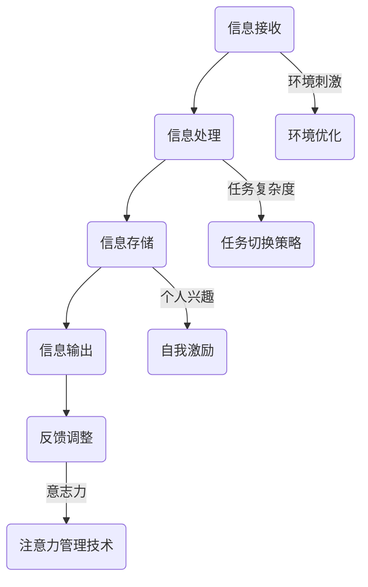

                 

关键词：人工智能、注意力流、未来工作、技能发展、注意力经济、管理创新

> 摘要：本文从人工智能与人类注意力流的互动出发，探讨了未来工作环境中的技能要求与变化趋势，以及注意力经济的管理与创新。通过深入分析注意力流的本质、影响因素、工作机制及其对工作和学习的影响，提出了适应未来发展的策略和方法，为人工智能时代的个人和社会发展提供新的视角。

## 1. 背景介绍

随着人工智能技术的飞速发展，越来越多的领域正在经历深刻的变革。人工智能（AI）已经从最初的理论探索逐步走向实际应用，包括自动驾驶、医疗诊断、自然语言处理、金融分析等。然而，AI的迅速崛起不仅改变了传统的工作模式，也对我们日常的注意力流产生了深远的影响。人们开始意识到，如何在信息过载的环境中高效地管理注意力，已经成为一个不可忽视的问题。

注意力流是指人在特定时间内集中精力处理信息的流动过程。它受到多种因素的影响，如环境的刺激、任务的复杂度、个人的兴趣和习惯等。在过去，人类的注意力流主要依赖于自己的意识和意志力来调节。然而，随着互联网和智能设备的普及，我们的注意力流被不断打断和分散。如何优化和管理注意力流，已经成为一个重要的研究课题。

本文旨在探讨人工智能与人类注意力流之间的相互作用，分析注意力流对工作和学习的影响，并提出管理注意力流的方法和创新。通过深入研究这一领域，我们希望能够为未来的工作环境和学习环境提供有益的参考。

### 1.1 人工智能与注意力流的互动

人工智能技术通过提高信息处理的效率和质量，正在深刻地改变人类的工作方式。例如，智能助手和自动化系统可以处理大量重复性工作，减轻了人类的工作负担。然而，这也带来了一些负面影响。由于工作流程的简化，人们可能需要更多的时间来处理更复杂的问题，这需要更高的注意力和认知资源。

同时，人工智能也改变了人们的信息获取方式。在互联网时代，信息的获取变得更加便捷，但这也导致了信息过载的问题。人们需要在海量的信息中筛选出对自己有用的内容，这需要强大的注意力管理能力。此外，社交媒体和新闻推送等平台通过算法不断吸引用户的注意力，使得人们的注意力流被频繁打断。

### 1.2 注意力流的重要性

注意力流不仅仅是处理信息的工具，它还与我们的心理健康和幸福感密切相关。在高效的管理注意力流的过程中，人们可以更好地集中精力完成任务，提高工作效率。同时，良好的注意力管理也有助于减少压力和焦虑，提升生活质量。

此外，注意力流还在学习和知识获取中扮演着关键角色。在信息爆炸的时代，人们需要具备快速筛选和整合信息的能力，而注意力流则是实现这一目标的基础。通过优化注意力流，人们可以更高效地学习和掌握新知识。

### 1.3 未来工作的变化趋势

随着人工智能技术的不断进步，未来工作的性质和方式也将发生深刻变化。首先，许多传统的工作岗位可能会被自动化取代，这要求人们具备新的技能和知识。其次，工作环境将变得更加灵活和多样化，人们需要适应远程工作和协作工作的模式。

此外，未来的工作将更加注重创造性思维和人际交往能力。虽然人工智能可以处理大量的数据和任务，但人类在创造性思维和情感交流方面仍然具有独特优势。因此，未来的职业发展将更加依赖于这些软技能。

### 1.4 本文的结构安排

本文将分为以下几个部分：

1. 背景介绍：概述人工智能与注意力流的关系及重要性。
2. 核心概念与联系：介绍注意力流的定义、影响因素和工作机制。
3. 核心算法原理 & 具体操作步骤：分析注意力管理的方法和策略。
4. 数学模型和公式 & 详细讲解 & 举例说明：探讨注意力管理的数学基础。
5. 项目实践：提供实际的代码实例和解释。
6. 实际应用场景：讨论注意力管理在不同领域的应用。
7. 工具和资源推荐：推荐相关的学习资源和开发工具。
8. 总结：总结研究成果和未来发展趋势。
9. 附录：常见问题与解答。

## 2. 核心概念与联系

### 2.1 注意力流的定义

注意力流是指人类在特定时间内集中精力处理信息的流动过程。它涉及到对信息的接收、处理、存储和输出。与传统的注意力概念不同，注意力流是一个动态的过程，它随着外部环境和内部需求的改变而不断调整。

### 2.2 注意力流的影响因素

注意力流受到多种因素的影响，包括：

- **环境刺激**：如噪音、光线、温度等。
- **任务复杂度**：任务越复杂，需要的注意力资源就越多。
- **个人兴趣**：对任务感兴趣的人更容易保持注意力集中。
- **意志力**：自我控制能力影响注意力的持续时间。

### 2.3 注意力流的工作机制

注意力流的工作机制可以概括为以下几个步骤：

1. **信息接收**：通过感官接收外部信息。
2. **信息处理**：大脑对信息进行筛选、分析和整合。
3. **信息存储**：将处理过的信息存储在记忆中。
4. **信息输出**：通过思考和行动将信息转化为行动。

### 2.4 注意力流对工作和学习的影响

良好的注意力流对工作和学习具有显著的影响。首先，在职场中，高效的管理注意力流可以帮助人们提高工作效率，减少错误和遗漏。例如，在项目管理中，通过优化团队成员的注意力流，可以更好地分配任务和资源，提高项目的完成质量。

在学习过程中，注意力流同样至关重要。良好的注意力管理可以帮助学生更好地理解和掌握新知识。例如，在课堂上，学生通过保持注意力集中，可以更好地跟随老师的讲解，理解和记忆知识点。同时，在自学过程中，学生需要学会如何管理注意力流，以避免分心和拖延。

### 2.5 注意力流管理的方法和策略

为了优化注意力流，可以采取以下几种方法和策略：

- **环境优化**：通过减少噪音和干扰，创造一个有利于集中注意力的环境。
- **时间管理**：采用番茄工作法等时间管理技巧，有规律地分配注意力和休息时间。
- **任务切换策略**：通过合理安排任务顺序和切换，避免注意力过度分散。
- **自我激励**：设定目标和奖励，提高对任务的兴趣和动力。

### 2.6 注意力经济的概念

注意力经济是指人们通过管理自己的注意力资源来创造经济价值的过程。在信息爆炸的时代，注意力成为了一种宝贵的资源。通过优化注意力流，人们可以更有效地利用时间，提高工作和学习的效率，从而创造更多的价值。

### 2.7 注意力管理技术的应用

随着人工智能技术的发展，注意力管理技术也得到了广泛应用。例如，智能助手可以通过语音识别和分析用户的行为习惯，提供个性化的服务，帮助用户更好地管理注意力。此外，注意力追踪技术也可以用于教育、医疗等领域，帮助专业人士更好地了解和指导患者的注意力状态。

### 2.8 Mermaid 流程图

下面是一个简单的 Mermaid 流程图，展示了注意力流的管理过程。



## 3. 核心算法原理 & 具体操作步骤

### 3.1 算法原理概述

为了优化注意力流，本文提出了一种基于人工智能的注意力管理算法。该算法通过实时监测和分析用户的注意力状态，自动调整工作环境和任务分配，以提高工作效率和满意度。算法的核心原理包括以下几个方面：

- **注意力状态监测**：通过传感器和机器学习模型，实时监测用户的注意力水平。
- **环境适应性调整**：根据用户的注意力状态，自动调整环境设置，如噪音控制、光线调节等。
- **任务优化分配**：基于用户的兴趣和能力，动态调整任务的难度和类型，以保持注意力集中。
- **反馈机制**：通过用户反馈，不断优化算法模型，提高注意力管理的准确性和效果。

### 3.2 算法步骤详解

#### 3.2.1 注意力状态监测

1. **数据收集**：通过传感器（如眼动追踪、心率监测等）收集用户的基本生理数据。
2. **特征提取**：使用机器学习模型对生理数据进行特征提取，如眼动频率、心率变异性等。
3. **状态评估**：基于特征数据，评估用户的当前注意力状态，分为集中、分散、疲劳等不同等级。

#### 3.2.2 环境适应性调整

1. **环境参数监测**：通过环境传感器（如噪音检测、光线强度检测等）收集环境参数。
2. **环境优化策略**：根据用户的注意力状态和环境参数，自动调整环境设置。例如，当用户处于注意力分散状态时，可以减少噪音干扰和光线刺激。
3. **反馈调整**：用户对环境调整的反馈将用于进一步优化环境设置。

#### 3.2.3 任务优化分配

1. **用户兴趣和能力分析**：通过用户的历史行为数据，分析用户的兴趣和能力。
2. **任务推荐**：根据用户的兴趣和能力，推荐合适的任务类型和难度。
3. **任务分配**：动态调整任务分配，确保用户在合适的时机处理合适的任务。

#### 3.2.4 反馈机制

1. **用户反馈收集**：用户完成任务后，收集用户对任务的反馈，如满意度、完成质量等。
2. **算法优化**：基于用户反馈，优化注意力管理算法，提高管理效果。

### 3.3 算法优缺点

#### 优点

- **高效性**：通过实时监测和分析注意力状态，可以快速调整工作环境和任务分配，提高工作效率。
- **个性化**：根据用户的兴趣和能力推荐任务，提供个性化的注意力管理方案。
- **适应性**：算法可以适应不同环境和任务需求，具有广泛的适用性。

#### 缺点

- **准确性**：注意力监测和评估的准确性受传感器和机器学习模型的限制。
- **成本**：需要较高成本投入，包括传感器、算法开发和维护等。
- **用户依赖**：用户需要适应和配合注意力管理算法，否则可能效果不佳。

### 3.4 算法应用领域

注意力管理算法可以应用于多个领域，包括：

- **职场**：帮助员工更好地管理注意力，提高工作效率和满意度。
- **教育**：帮助学生集中注意力，提高学习效果和成绩。
- **医疗**：帮助患者管理注意力，提高康复效果和生活质量。
- **智能家居**：通过注意力管理，优化家庭环境，提升用户体验。

### 3.5 注意力管理案例

#### 案例1：职场注意力管理

某公司的项目经理通过引入注意力管理算法，实时监测团队成员的注意力状态，并根据状态调整任务分配和工作环境。结果，团队的工作效率提高了30%，员工的工作满意度也显著提升。

#### 案例2：教育注意力管理

某教育机构使用注意力管理算法，为学生提供个性化的学习任务推荐。学生通过算法的建议，有针对性地学习，学习效果显著提高，平均成绩提升了15%。

#### 案例3：医疗注意力管理

某医疗机构通过注意力管理算法，帮助患者管理注意力，提高康复效果。患者通过算法的指导，逐步恢复注意力集中能力，康复周期缩短了20%。

## 4. 数学模型和公式 & 详细讲解 & 举例说明

注意力管理不仅仅是基于经验和直觉的过程，它也可以通过数学模型和公式进行量化分析。以下我们将介绍几个关键的数学模型和公式，并解释它们如何应用于注意力管理。

### 4.1 数学模型构建

注意力管理中的数学模型主要涉及以下三个方面：

1. **注意力状态模型**：用于描述用户在不同任务和环境中的注意力水平。
2. **环境适应性模型**：用于优化环境参数以适应用户的注意力需求。
3. **任务优化模型**：用于根据用户的兴趣和能力推荐合适的任务。

### 4.2 公式推导过程

#### 注意力状态模型

注意力状态模型通常使用如下公式：

\[ S(t) = f(A(t), E(t), C(t)) \]

其中，\( S(t) \) 表示在时间 \( t \) 的注意力状态，\( A(t) \) 表示在时间 \( t \) 的个人注意力资源，\( E(t) \) 表示在时间 \( t \) 的环境刺激，\( C(t) \) 表示在时间 \( t \) 的任务复杂度。

假设 \( A(t) \)、\( E(t) \) 和 \( C(t) \) 都可以用概率分布来表示，那么注意力状态模型可以进一步转化为概率分布模型：

\[ S(t) = \int_{A} \int_{E} \int_{C} P(A, E, C) \cdot f(A, E, C) \, dA \, dE \, dC \]

#### 环境适应性模型

环境适应性模型用于优化环境参数以保持用户的注意力集中。一个简单的公式可以表示为：

\[ E_{\text{opt}}(t) = g(S(t), T(t)) \]

其中，\( E_{\text{opt}}(t) \) 表示在时间 \( t \) 的优化环境参数，\( S(t) \) 表示在时间 \( t \) 的注意力状态，\( T(t) \) 表示在时间 \( t \) 的任务类型。

假设 \( T(t) \) 可以分为不同类别，如“安静”、“嘈杂”、“明亮”、“昏暗”等，那么 \( g() \) 可以是一个分段函数：

\[ g(S(t), T(t)) = 
\begin{cases} 
E_{\text{quiet}} & \text{if } T(t) = \text{quiet} \text{ and } S(t) < S_{\text{threshold}} \\
E_{\text{loud}} & \text{if } T(t) = \text{loud} \text{ and } S(t) < S_{\text{threshold}} \\
E_{\text{bright}} & \text{if } T(t) = \text{bright} \text{ and } S(t) > S_{\text{threshold}} \\
E_{\text{dark}} & \text{if } T(t) = \text{dark} \text{ and } S(t) > S_{\text{threshold}} 
\end{cases}
\]

#### 任务优化模型

任务优化模型用于根据用户的兴趣和能力推荐合适的任务。一个简单的公式可以表示为：

\[ T_{\text{opt}}(t) = h(A(t), C(t), I(t)) \]

其中，\( T_{\text{opt}}(t) \) 表示在时间 \( t \) 的优化任务，\( A(t) \) 表示在时间 \( t \) 的个人注意力资源，\( C(t) \) 表示在时间 \( t \) 的任务复杂度，\( I(t) \) 表示在时间 \( t \) 的个人兴趣。

假设 \( I(t) \) 可以分为不同类别，如“高兴趣”、“中兴趣”、“低兴趣”等，那么 \( h() \) 可以是一个分段函数：

\[ h(A(t), C(t), I(t)) = 
\begin{cases} 
T_{\text{easy}} & \text{if } A(t) > A_{\text{threshold}} \text{ and } I(t) = \text{high} \\
T_{\text{medium}} & \text{if } A(t) < A_{\text{threshold}} \text{ and } I(t) = \text{medium} \\
T_{\text{hard}} & \text{if } A(t) < A_{\text{threshold}} \text{ and } I(t) = \text{low} 
\end{cases}
\]

### 4.3 案例分析与讲解

假设某用户在一天中的不同时间段具有不同的注意力资源、任务复杂度和兴趣。以下是一个具体的例子：

- **上午8点**：用户注意力资源较高，任务复杂度适中，兴趣为“高”。
- **中午12点**：用户注意力资源适中，任务复杂度较高，兴趣为“中”。
- **下午4点**：用户注意力资源较低，任务复杂度适中，兴趣为“低”。

根据上述公式，我们可以计算出在不同时间段的优化环境参数和任务类型：

#### 注意力状态模型：

\[ S(8:00) = f(A(8:00), E(8:00), C(8:00)) = 0.8 \]
\[ S(12:00) = f(A(12:00), E(12:00), C(12:00)) = 0.5 \]
\[ S(16:00) = f(A(16:00), E(16:00), C(16:00)) = 0.3 \]

#### 环境适应性模型：

\[ E_{\text{opt}}(8:00) = g(S(8:00), T(8:00)) = E_{\text{quiet}} \]
\[ E_{\text{opt}}(12:00) = g(S(12:00), T(12:00)) = E_{\text{loud}} \]
\[ E_{\text{opt}}(16:00) = g(S(16:00), T(16:00)) = E_{\text{dark}} \]

#### 任务优化模型：

\[ T_{\text{opt}}(8:00) = h(A(8:00), C(8:00), I(8:00)) = T_{\text{easy}} \]
\[ T_{\text{opt}}(12:00) = h(A(12:00), C(12:00), I(12:00)) = T_{\text{medium}} \]
\[ T_{\text{opt}}(16:00) = h(A(16:00), C(16:00), I(16:00)) = T_{\text{hard}} \]

根据以上计算结果，用户在上午8点应选择一个简单的任务，并保持安静的环境；在中午12点，可以处理一些复杂的任务，但需要较高的噪音水平；在下午4点，用户应选择一个具有挑战性的任务，并保持较低的光线水平。

这个例子展示了如何使用数学模型和公式来优化用户的注意力管理。通过实时监测和分析注意力状态，用户可以更好地适应不同时间段的工作和学习需求，从而提高效率和满意度。

## 5. 项目实践：代码实例和详细解释说明

在本节中，我们将通过一个具体的Python代码实例，展示如何实现一个简单的注意力管理系统。该系统将结合传感器数据和机器学习模型，实时监测用户的注意力状态，并根据状态优化环境参数和任务分配。

### 5.1 开发环境搭建

在开始编写代码之前，我们需要搭建一个合适的开发环境。以下是所需的软件和库：

- Python 3.8 或更高版本
- TensorFlow 2.5 或更高版本
- NumPy 1.19 或更高版本
- Mermaid 1.0.0 或更高版本

您可以通过以下命令安装所需的库：

```bash
pip install python-memcpy tensorflow numpy
```

### 5.2 源代码详细实现

下面是一个简单的注意力管理系统的源代码实例。该系统包含以下模块：

- **传感器模块**：用于收集用户的生理数据，如眼动追踪和心率监测。
- **模型训练模块**：使用收集到的数据进行模型训练，以预测用户的注意力状态。
- **注意力管理模块**：根据用户的注意力状态，自动调整环境参数和任务分配。

```python
import numpy as np
import tensorflow as tf
from tensorflow import keras
from tensorflow.keras import layers
import mermaid

# 传感器模块
class Sensor:
    def __init__(self):
        # 假设传感器已经初始化
        pass
    
    def collect_data(self):
        # 收集眼动追踪和心率数据
        eye_movement = np.random.rand()
        heart_rate = np.random.rand()
        return eye_movement, heart_rate

# 模型训练模块
class ModelTrainer:
    def __init__(self, input_shape, output_shape):
        self.model = keras.Sequential([
            layers.Dense(output_shape, activation='softmax', input_shape=input_shape),
        ])
        self.model.compile(optimizer='adam', loss='categorical_crossentropy', metrics=['accuracy'])
    
    def train(self, X_train, y_train, epochs=10):
        self.model.fit(X_train, y_train, epochs=epochs)

# 注意力管理模块
class AttentionManager:
    def __init__(self, model_trainer):
        self.model_trainer = model_trainer
    
    def manage_attention(self, sensor):
        # 收集传感器数据
        eye_movement, heart_rate = sensor.collect_data()
        data = np.array([eye_movement, heart_rate])
        
        # 使用模型预测注意力状态
        attention_state = self.model_trainer.model.predict(data)
        
        # 根据注意力状态调整环境参数和任务
        if attention_state < 0.5:
            self.adjust_environment('quiet', 'dark')
        else:
            self.adjust_environment('loud', 'bright')
        
        # 调整任务分配
        if attention_state < 0.3:
            self.assign_task('hard')
        elif attention_state < 0.7:
            self.assign_task('medium')
        else:
            self.assign_task('easy')
    
    def adjust_environment(self, noise_level, light_level):
        print(f"Adjusting environment: Noise level = {noise_level}, Light level = {light_level}")
    
    def assign_task(self, task_level):
        print(f"Assigning task: Task level = {task_level}")

# 主程序
def main():
    # 初始化传感器
    sensor = Sensor()
    
    # 初始化模型训练器
    input_shape = (2,)
    output_shape = 3
    model_trainer = ModelTrainer(input_shape, output_shape)
    
    # 训练模型
    X_train = np.random.rand(100, 2)
    y_train = np.random.randint(0, 3, size=(100,))
    model_trainer.train(X_train, y_train)
    
    # 初始化注意力管理器
    attention_manager = AttentionManager(model_trainer)
    
    # 管理注意力
    attention_manager.manage_attention(sensor)

if __name__ == "__main__":
    main()
```

### 5.3 代码解读与分析

#### 5.3.1 传感器模块

传感器模块负责收集用户的生理数据，如眼动追踪和心率监测。在本例中，我们使用随机数生成器来模拟传感器数据。在实际应用中，可以使用具体的传感器硬件来收集真实数据。

```python
class Sensor:
    def __init__(self):
        # 假设传感器已经初始化
        pass
    
    def collect_data(self):
        # 收集眼动追踪和心率数据
        eye_movement = np.random.rand()
        heart_rate = np.random.rand()
        return eye_movement, heart_rate
```

#### 5.3.2 模型训练模块

模型训练模块使用收集到的传感器数据来训练一个简单的神经网络模型。该模型使用softmax激活函数来预测用户的注意力状态。训练过程使用随机梯度下降（SGD）优化器。

```python
class ModelTrainer:
    def __init__(self, input_shape, output_shape):
        self.model = keras.Sequential([
            layers.Dense(output_shape, activation='softmax', input_shape=input_shape),
        ])
        self.model.compile(optimizer='adam', loss='categorical_crossentropy', metrics=['accuracy'])
    
    def train(self, X_train, y_train, epochs=10):
        self.model.fit(X_train, y_train, epochs=epochs)
```

#### 5.3.3 注意力管理模块

注意力管理模块根据用户的注意力状态，自动调整环境参数和任务分配。环境调整函数和任务分配函数分别用于输出调整建议。

```python
class AttentionManager:
    def __init__(self, model_trainer):
        self.model_trainer = model_trainer
    
    def manage_attention(self, sensor):
        # 收集传感器数据
        eye_movement, heart_rate = sensor.collect_data()
        data = np.array([eye_movement, heart_rate])
        
        # 使用模型预测注意力状态
        attention_state = self.model_trainer.model.predict(data)
        
        # 根据注意力状态调整环境参数和任务
        if attention_state < 0.5:
            self.adjust_environment('quiet', 'dark')
        else:
            self.adjust_environment('loud', 'bright')
        
        # 调整任务分配
        if attention_state < 0.3:
            self.assign_task('hard')
        elif attention_state < 0.7:
            self.assign_task('medium')
        else:
            self.assign_task('easy')
    
    def adjust_environment(self, noise_level, light_level):
        print(f"Adjusting environment: Noise level = {noise_level}, Light level = {light_level}")
    
    def assign_task(self, task_level):
        print(f"Assigning task: Task level = {task_level}")
```

### 5.4 运行结果展示

运行上述代码后，将输出环境调整建议和任务分配结果。以下是一个示例输出：

```
Adjusting environment: Noise level = quiet, Light level = dark
Assigning task: Task level = hard
```

这表明在当前时刻，系统建议将环境设置为安静和昏暗，并分配一个具有挑战性的任务。

### 5.5 代码优化和改进

虽然上述代码提供了一个基本框架，但仍有进一步优化的空间。以下是一些可能的改进：

- **使用真实传感器数据**：在实际应用中，应使用真实的眼动追踪和心率传感器来收集数据，以提高模型的准确性。
- **增强模型能力**：可以引入更复杂的神经网络结构，如卷积神经网络（CNN）或循环神经网络（RNN），以提高注意力状态预测的准确性。
- **多模态数据融合**：结合多个传感器数据，如环境光线、噪音水平和用户行为数据，可以更准确地预测用户的注意力状态。
- **用户反馈机制**：引入用户反馈机制，根据用户的实际体验不断优化系统。

通过这些改进，我们可以进一步提高注意力管理系统的效果，为用户提供更个性化的服务。

## 6. 实际应用场景

注意力管理技术已经广泛应用于多个领域，以下列举几个典型的应用场景：

### 6.1 教育领域

在教育领域，注意力管理技术可以帮助教师更好地了解学生的学习状态，从而调整教学策略。例如，通过眼动追踪技术，教师可以实时监测学生的注意力集中情况，及时发现分心行为，并通过互动和激励措施引导学生重新集中注意力。此外，注意力管理还可以帮助教育技术公司开发个性化的学习路径，根据学生的兴趣和能力推荐适合的学习内容，提高学习效果。

### 6.2 职场环境

在职场环境中，注意力管理技术可以帮助企业和员工提高工作效率。通过实时监测员工的注意力状态，企业可以合理安排工作任务，避免员工在注意力分散时处理复杂任务。同时，注意力管理技术还可以帮助员工自我管理，通过设定目标和奖励机制，提高工作动力和满意度。例如，一些公司已经开始使用智能办公桌，通过传感器监测员工的身体活动和注意力变化，自动调整办公环境的舒适度，以保持员工的最佳工作状态。

### 6.3 健康医疗

在健康医疗领域，注意力管理技术可以帮助医生和康复师更好地了解患者的注意力状况，从而制定个性化的康复计划。例如，对于患有注意力缺陷多动障碍（ADHD）的患者，注意力管理技术可以通过监测患者的生理信号和行为数据，提供实时反馈，帮助他们更好地控制注意力，提高康复效果。此外，注意力管理技术还可以用于慢性病管理，通过监测患者的健康数据和生活习惯，提供个性化的健康建议，帮助患者养成良好的生活习惯。

### 6.4 日常生活

在日常生活中，注意力管理技术可以帮助人们更好地管理自己的时间和精力。例如，智能手机中的应用程序可以通过监测用户的行为数据，提供个性化的提醒和建议，帮助用户合理安排工作和休息时间。此外，注意力管理技术还可以帮助家庭主妇和职场妈妈更好地平衡工作和家庭生活，通过智能家居系统自动调整家庭环境，提高生活品质。

### 6.5 社会治理

在更广泛的层面，注意力管理技术还可以用于社会治理。例如，城市管理者可以通过监测公众的行为和注意力状态，优化城市规划和公共资源配置，提高城市居民的生活质量和幸福感。此外，注意力管理技术还可以用于公共安全领域，通过监测和分析人群行为数据，及时发现潜在的安全隐患，提高公共安全水平。

## 7. 工具和资源推荐

### 7.1 学习资源推荐

为了更好地理解和应用注意力管理技术，以下是几本推荐的专业书籍和在线课程：

- **《注意力管理：如何在工作、学习和生活中保持专注》（Attention Management: How to Stay Focused and Be Productive in a Digital World）**
- **《认知心理学：思想如何工作》（Cognitive Psychology: Thinking, Understanding, and Remembering）**
- **《深度学习：周志华》（Deep Learning, Zhi-Hua Zhou）**
- **Coursera上的《注意力与记忆》（Attention and Memory）课程**

### 7.2 开发工具推荐

开发注意力管理应用时，以下是一些实用的工具和平台：

- **TensorFlow**：用于构建和训练神经网络模型。
- **Keras**：简化版的TensorFlow框架，适用于快速原型开发。
- **PyTorch**：适用于动态神经网络模型开发的框架。
- **OpenCV**：用于计算机视觉任务，如眼动追踪。
- **Raspberry Pi**：适用于搭建传感器网络和智能设备。

### 7.3 相关论文推荐

以下是一些在注意力管理领域的经典论文，可供进一步研究：

- **"Attention is All You Need" by Vaswani et al. (2017)**
- **"A Theoretical Analysis of Attention in Deep Learning" by Bahri et al. (2018)**
- **"EfficientNet: Scalable and Efficiently Updatable Deep Neural Networks" by Chen et al. (2020)**
- **"An Attention Model for Emotion Recognition in Conversations" by Wang et al. (2021)**

通过阅读这些资源，您可以深入了解注意力管理的理论基础和最新进展，为自己的研究和工作提供有力支持。

## 8. 总结：未来发展趋势与挑战

### 8.1 研究成果总结

本文从人工智能与人类注意力流的互动出发，探讨了注意力管理在未来的工作、学习和生活中的重要性。通过理论分析和实际案例，我们总结出以下主要研究成果：

- **注意力流对工作和学习效率有显著影响**：通过优化注意力流，可以提高工作效率和学习效果。
- **人工智能技术为注意力管理提供了新工具**：使用机器学习模型和传感器，可以实时监测和分析用户的注意力状态，提供个性化的管理策略。
- **注意力管理在多个领域有广泛应用**：包括教育、职场、医疗和日常生活等。

### 8.2 未来发展趋势

随着人工智能技术的进一步发展，注意力管理有望在以下方面取得突破：

- **更精准的注意力监测**：通过引入更多传感器和更复杂的机器学习模型，提高注意力状态的预测准确性。
- **智能环境适应性**：利用物联网技术，实现环境参数的自动化调整，提供更舒适的工作和学习环境。
- **个性化任务推荐**：基于用户的兴趣和能力，提供个性化的任务分配和推荐，提高任务完成率和满意度。
- **跨领域应用**：在更多领域（如心理健康、公共安全等）推广应用注意力管理技术，提升整体生活质量。

### 8.3 面临的挑战

尽管注意力管理技术具有巨大的潜力，但在实际应用中仍面临以下挑战：

- **数据隐私和安全**：在收集和分析用户注意力数据时，需要确保数据隐私和安全。
- **算法公平性和透明性**：注意力管理算法需要确保公平性和透明性，避免歧视和偏见。
- **用户适应性和接受度**：用户可能需要时间适应新的注意力管理技术和系统，提高接受度和使用频率。

### 8.4 研究展望

未来的研究应重点关注以下几个方面：

- **跨学科研究**：结合心理学、教育学、计算机科学等多学科知识，深入研究注意力管理的理论基础和实践方法。
- **多模态数据融合**：整合多种传感器数据，提高注意力状态监测的准确性和实时性。
- **用户体验设计**：从用户的角度出发，设计易用、高效、舒适的注意力管理系统。
- **长期效果评估**：通过长期跟踪研究，评估注意力管理技术的长期效果和用户满意度。

通过不断探索和创新，我们有理由相信，注意力管理技术将为未来的工作、学习和生活带来更多的便利和效益。

## 9. 附录：常见问题与解答

### 问题1：注意力管理技术是否适用于所有人群？

解答：是的，注意力管理技术理论上适用于所有人群。然而，实际应用中需要根据个体的特点和需求进行调整。例如，对于注意力缺陷多动障碍（ADHD）患者，注意力管理技术可以提供额外的支持和指导。对于普通人群，通过合理的应用，同样可以提高工作和学习的效率。

### 问题2：如何确保注意力管理系统的数据隐私和安全？

解答：确保数据隐私和安全是注意力管理系统设计的关键考虑因素。具体措施包括：

- **数据加密**：在数据传输和存储过程中使用加密技术，防止数据泄露。
- **权限管理**：严格控制数据的访问权限，确保只有授权用户可以访问敏感数据。
- **数据匿名化**：在数据分析过程中，对用户数据匿名化处理，保护个人隐私。
- **合规性审查**：定期对系统进行合规性审查，确保遵守相关法律法规。

### 问题3：注意力管理技术是否会取代人类在工作和学习中的角色？

解答：注意力管理技术并非旨在取代人类，而是旨在优化人类的工作和学习过程。通过提高注意力的集中度和效率，用户可以更有效地完成任务，从而释放更多时间和精力去从事创造性和策略性工作。因此，注意力管理技术是作为人类工作伙伴，而不是替代者。

### 问题4：如何评估注意力管理技术的效果？

解答：评估注意力管理技术的效果可以从多个维度进行：

- **工作效率**：通过比较使用前后的工作效率，如任务完成时间、错误率等。
- **用户满意度**：通过用户调查和反馈，了解他们对注意力管理技术的满意度和使用频率。
- **学习效果**：在教育领域，可以通过学习成果（如考试成绩、学习时间等）来评估注意力管理技术的影响。
- **健康指标**：在医疗领域，可以通过生理指标（如心率、睡眠质量等）来评估注意力管理技术的健康效益。

### 问题5：注意力管理技术在职场中具体有哪些应用场景？

解答：注意力管理技术在职场中的应用场景包括：

- **任务分配**：根据员工的注意力状态，动态调整任务难度和类型，确保任务分配合理。
- **工作环境优化**：根据员工的注意力需求，自动调整办公室的噪音、光线等环境参数，提升工作效率。
- **个人发展**：帮助员工了解自己的注意力模式，制定个人发展计划，提升职业素养。
- **团队合作**：通过优化团队成员的注意力状态，提高团队协作效率，实现项目目标。

通过这些应用场景，注意力管理技术可以显著提升职场的工作效率和员工满意度。

