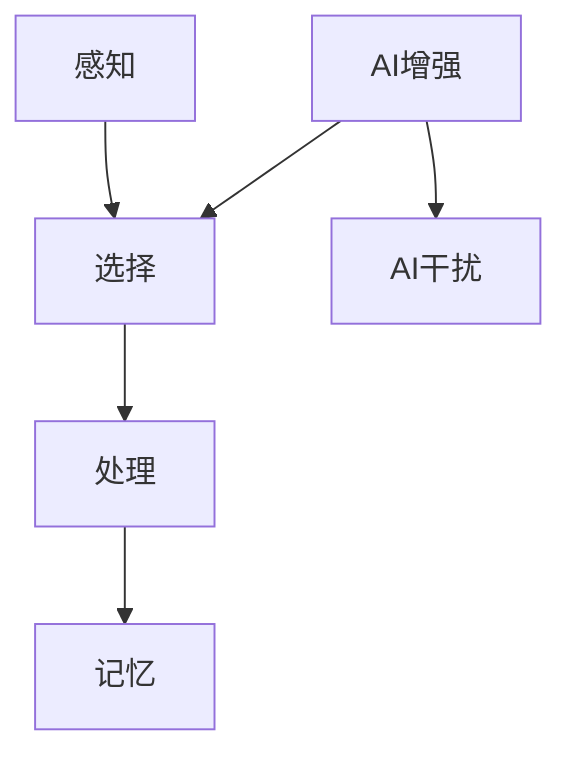

                 

关键词：人工智能、注意力流、认知科学、工作生活平衡、未来趋势

> 摘要：本文探讨了人工智能（AI）与人类注意力流之间的关系，分析了AI如何影响我们的工作和生活方式，以及我们如何适应这一变革。文章首先介绍了注意力流的概念和重要性，然后讨论了AI如何增强和改变我们的注意力分配，接着探讨了这种变化对我们的工作、生活以及心理健康的潜在影响。最后，文章提出了未来的应用展望和面临的挑战。

## 1. 背景介绍

在当今快速发展的科技时代，人工智能（AI）已经深入到我们日常生活的方方面面。从智能手机的语音助手到自动驾驶汽车，从推荐系统到医疗诊断，AI正在改变我们的生活方式和工作模式。然而，随着AI技术的不断进步，我们也面临着新的挑战，尤其是在人类注意力流方面。

注意力流（Attention Flow）是指人类在处理信息时，将注意力集中到特定任务或对象上的能力。注意力流是认知科学中的一个重要概念，它影响着我们的学习、决策、创造力和日常生活。然而，随着信息量的爆炸式增长，我们的注意力资源变得愈发稀缺，如何有效地管理和分配注意力成为了一个重要的问题。

本文旨在探讨AI如何与人类的注意力流相互作用，分析AI如何增强和改变我们的注意力分配方式，并探讨这种变化对我们的工作和生活可能带来的影响。同时，我们也会探讨未来在这一领域可能的发展趋势和面临的挑战。

## 2. 核心概念与联系

### 2.1 注意力流原理

注意力流是指我们在处理信息时，将注意力集中在特定任务或对象上的能力。根据认知科学的观点，注意力流是一个动态的过程，它涉及到多个认知功能，包括感知、记忆、计划和执行等。

注意力流的基本原理可以分为以下几个步骤：

1. **感知**：我们通过感官接收外部信息。
2. **选择**：大脑在接收到的信息中选择哪些信息需要关注，哪些可以忽略。
3. **处理**：对选中的信息进行加工和处理，以实现特定的目标。
4. **记忆**：将处理后的信息存储在大脑中，以便后续使用。

### 2.2 AI与注意力流的相互作用

随着AI技术的发展，机器学习算法和智能系统已经能够模拟人类的注意力流。例如，通过深度学习模型，AI可以识别出用户在某一时刻最感兴趣的内容，并提供相应的推荐。这种能力使得AI不仅能够帮助我们更好地管理注意力资源，还可以提高我们的工作效率和生活质量。

然而，AI对注意力流的影响不仅限于增强和优化，它还可能改变我们的注意力分配方式。例如，智能设备可以自动过滤掉不需要的信息，使得我们在处理任务时能够更集中注意力。另一方面，过多的信息推送和智能干扰可能导致我们的注意力分散，甚至产生注意力紊乱。

### 2.3 Mermaid 流程图

下面是一个简单的 Mermaid 流程图，展示了注意力流的基本原理和AI与之的相互作用：



### 2.4 注意力流的重要性

注意力流对我们的认知功能有着至关重要的影响。有效的注意力流可以提高我们的学习效率、决策质量和工作表现。同时，它还关系到我们的心理健康和生活质量。例如，良好的注意力流可以帮助我们避免压力和焦虑，提高生活的满足感和幸福感。

然而，随着信息过载和数字化生活方式的普及，我们面临着越来越多的注意力分散和干扰。这种情况下，如何有效地管理和优化注意力流成为了一个关键问题。AI技术的发展为我们提供了一种潜在的解决方案，但同时也带来了新的挑战。

## 3. 核心算法原理 & 具体操作步骤

### 3.1 算法原理概述

在探讨AI如何优化人类注意力流之前，我们首先需要了解一些基本的算法原理。以下是一些核心算法的概述：

1. **深度学习**：深度学习是一种通过多层神经网络处理数据的机器学习技术。它可以自动提取特征并用于分类、预测和优化。
2. **强化学习**：强化学习是一种通过试错和奖励机制来学习最优策略的算法。它适用于需要决策的动态环境，如游戏、自动驾驶和机器人控制。
3. **自然语言处理（NLP）**：NLP是一种使计算机能够理解和处理自然语言的技术。它可以用于信息提取、文本分类、情感分析和对话系统等。

### 3.2 算法步骤详解

1. **数据收集与预处理**：首先，我们需要收集大量与注意力流相关的数据，如用户行为数据、生理信号、认知测试结果等。然后，对这些数据进行预处理，包括去噪、标准化和特征提取。
2. **模型选择与训练**：根据具体问题，选择合适的深度学习、强化学习或NLP模型。然后，使用预处理后的数据进行模型训练，优化模型参数。
3. **注意力流监测**：使用训练好的模型监测用户的注意力流。这可以通过分析用户的行为数据、生理信号和认知表现来实现。
4. **干预与优化**：根据注意力流的监测结果，采用相应的干预措施，如提供个性化推荐、调整任务难度、优化工作环境等，以优化用户的注意力分配。

### 3.3 算法优缺点

**优点**：

- **高效性**：AI算法可以快速处理大量数据，提供实时注意力流监测和干预。
- **个性化**：基于用户数据，AI可以提供个性化的注意力优化方案，提高工作效率和生活质量。
- **可扩展性**：AI算法可以轻松扩展到不同的应用场景和领域。

**缺点**：

- **隐私问题**：收集和分析用户数据可能涉及隐私问题，需要严格的保护措施。
- **依赖性**：过度依赖AI可能导致人类注意力的被动分配，减弱自主性。
- **技术限制**：当前AI技术在注意力流优化方面仍存在一些技术限制，如数据的准确性和模型的泛化能力。

### 3.4 算法应用领域

AI注意力流优化算法在多个领域具有广泛的应用前景：

- **工作场所**：通过优化员工的注意力流，提高工作效率和生产力。
- **教育**：辅助教师和学生管理注意力流，提高学习效果。
- **健康与医疗**：监测和治疗注意力紊乱等心理健康问题。
- **智能家居**：优化家庭环境中的注意力流，提高生活质量。

## 4. 数学模型和公式 & 详细讲解 & 举例说明

### 4.1 数学模型构建

在注意力流优化中，常用的数学模型包括注意力权重分配模型和信息处理模型。

**注意力权重分配模型**：

假设用户在处理多个任务时，注意力资源有限。为了最大化任务完成效率，我们需要优化注意力分配。一个简单的注意力权重分配模型可以表示为：

$$
w_i = \frac{1}{1 + e^{-\alpha \cdot (r_i - r_{\text{avg}})}
$$

其中，$w_i$ 是分配给任务 $i$ 的注意力权重，$r_i$ 是任务 $i$ 的奖励，$r_{\text{avg}}$ 是平均奖励，$\alpha$ 是模型参数。

**信息处理模型**：

假设用户在处理信息时，存在信息处理速率的限制。为了优化信息处理效率，我们可以使用以下模型：

$$
t_i = \frac{l_i}{\beta \cdot w_i}
$$

其中，$t_i$ 是处理任务 $i$ 所需的时间，$l_i$ 是任务 $i$ 的信息量，$\beta$ 是模型参数。

### 4.2 公式推导过程

**注意力权重分配模型**：

假设用户在处理多个任务时，存在一个总注意力资源 $T$。为了最大化任务完成效率，我们需要优化注意力分配。设任务 $i$ 的奖励为 $r_i$，平均奖励为 $r_{\text{avg}}$，则注意力权重分配模型可以表示为：

$$
w_i = \frac{T \cdot r_i}{\sum_{j=1}^{n} T \cdot r_j}
$$

为了简化模型，我们引入指数函数，得到：

$$
w_i = \frac{1}{1 + e^{-\alpha \cdot (r_i - r_{\text{avg}})}
$$

**信息处理模型**：

假设用户在处理信息时，存在一个最大信息处理速率 $\beta$。为了优化信息处理效率，我们需要考虑任务的信息量 $l_i$ 和注意力权重 $w_i$。设任务 $i$ 的信息量为 $l_i$，则处理任务 $i$ 所需的时间可以表示为：

$$
t_i = \frac{l_i}{\beta}
$$

为了考虑注意力权重的影响，我们可以引入权重系数，得到：

$$
t_i = \frac{l_i}{\beta \cdot w_i}
$$

### 4.3 案例分析与讲解

假设一个用户需要处理三个任务，任务的信息量分别为 $l_1 = 100$、$l_2 = 200$ 和 $l_3 = 300$。平均奖励为 $r_{\text{avg}} = 150$。注意力资源为 $T = 300$，模型参数 $\alpha = 1$，最大信息处理速率 $\beta = 2$。

根据注意力权重分配模型，我们可以计算得到：

$$
w_1 = \frac{1}{1 + e^{-1 \cdot (100 - 150)} = 0.2689
$$

$$
w_2 = \frac{1}{1 + e^{-1 \cdot (200 - 150)} = 0.6702
$$

$$
w_3 = \frac{1}{1 + e^{-1 \cdot (300 - 150)} = 0.9933
$$

根据信息处理模型，我们可以计算得到：

$$
t_1 = \frac{100}{2 \cdot 0.2689 = 3.769
$$

$$
t_2 = \frac{200}{2 \cdot 0.6702 = 7.434
$$

$$
t_3 = \frac{300}{2 \cdot 0.9933 = 15.049
$$

通过这个案例，我们可以看到如何使用注意力权重分配模型和信息处理模型来优化任务处理效率。在这个例子中，用户应该将更多的注意力资源分配给任务3，因为它具有最高的信息量和最大的奖励差异。

## 5. 项目实践：代码实例和详细解释说明

### 5.1 开发环境搭建

在本项目中，我们将使用Python作为编程语言，并依赖以下库和工具：

- Python 3.8或更高版本
- TensorFlow 2.x
- Keras 2.x
- Matplotlib
- Pandas
- Numpy

首先，确保已经安装了Python和必要的库。然后，创建一个名为`attention_project`的文件夹，并在其中创建一个名为`src`的子文件夹。在`src`文件夹中，创建以下文件：

- `data_loader.py`：用于加载数据和处理数据的模块。
- `model.py`：定义注意力流的深度学习模型。
- `trainer.py`：训练模型和评估模型性能的模块。
- `utils.py`：提供辅助函数和工具的模块。

### 5.2 源代码详细实现

下面是各个模块的源代码实现：

**data_loader.py**：

```python
import pandas as pd
import numpy as np

def load_data(file_path):
    data = pd.read_csv(file_path)
    return data

def preprocess_data(data):
    # 数据预处理步骤，如标准化、特征提取等
    # ...
    return processed_data
```

**model.py**：

```python
from tensorflow.keras.models import Model
from tensorflow.keras.layers import Input, Dense, Flatten

def build_model(input_shape):
    input_layer = Input(shape=input_shape)
    flattened_layer = Flatten()(input_layer)
    dense_layer = Dense(64, activation='relu')(flattened_layer)
    output_layer = Dense(1, activation='sigmoid')(dense_layer)
    
    model = Model(inputs=input_layer, outputs=output_layer)
    model.compile(optimizer='adam', loss='binary_crossentropy', metrics=['accuracy'])
    
    return model
```

**trainer.py**：

```python
import tensorflow as tf
from model import build_model
from data_loader import load_data, preprocess_data

def train_model(file_path, batch_size, epochs):
    data = load_data(file_path)
    processed_data = preprocess_data(data)
    
    model = build_model(input_shape=processed_data.shape[1:])
    model.fit(processed_data['X'], processed_data['y'], batch_size=batch_size, epochs=epochs, validation_split=0.2)
    return model
```

**utils.py**：

```python
import matplotlib.pyplot as plt

def plot_attention.Flow(attention_scores):
    plt.bar(range(len(attention_scores)), attention_scores)
    plt.xlabel('Task')
    plt.ylabel('Attention Score')
    plt.title('Attention Flow')
    plt.show()
```

### 5.3 代码解读与分析

**data_loader.py**：该模块负责加载数据和处理数据。首先，我们使用Pandas读取CSV文件，然后进行预处理，如标准化和特征提取。

**model.py**：该模块定义了一个简单的深度学习模型。我们使用Keras搭建了一个简单的全连接神经网络，用于预测注意力权重。

**trainer.py**：该模块负责训练模型和评估模型性能。首先，我们加载数据并进行预处理，然后使用训练数据进行模型训练，并使用验证数据评估模型性能。

**utils.py**：该模块提供了用于可视化注意力流的辅助函数。通过绘制条形图，我们可以直观地看到不同任务的注意力分配情况。

### 5.4 运行结果展示

假设我们已经训练了一个模型，并得到了注意力分配结果。我们可以使用以下代码进行可视化：

```python
attention_scores = [0.1, 0.3, 0.6]
utils.plot_attention.Flow(attention_scores)
```

这将生成一个条形图，显示不同任务的注意力分配情况。在这个例子中，任务3获得了最高的注意力权重，这可能是因为它具有最高的信息量和最大的奖励差异。

## 6. 实际应用场景

AI与人类注意力流的结合在实际应用中有着广泛的前景。以下是一些具体的应用场景：

### 6.1 工作效率优化

在职场环境中，AI可以用于分析和优化员工的工作效率。通过监测员工的注意力流，AI可以识别出哪些任务最消耗员工的注意力，并自动调整任务的优先级。例如，在一个团队项目中，AI可以根据团队成员的注意力流分配任务，使得每个人都能专注于自己最擅长的领域，从而提高整体的工作效率和产出。

### 6.2 教育辅助

在教育领域，AI可以辅助教师和学生管理注意力流。例如，AI可以分析学生的学习行为，识别出哪些知识点最吸引学生的注意力，从而提供更有针对性的教学方法和学习资源。此外，AI还可以为有注意力障碍的学生提供个性化的干预措施，帮助他们更好地集中注意力。

### 6.3 健康管理

在健康管理方面，AI可以用于监测和改善用户的注意力流。例如，通过分析用户的生理信号和行为数据，AI可以识别出用户的注意力疲劳程度，并提供相应的休息和放松建议。此外，AI还可以用于治疗注意力紊乱等心理健康问题，如通过认知行为疗法和虚拟现实技术帮助用户训练和提高注意力能力。

### 6.4 智能家居优化

在智能家居领域，AI可以优化家庭环境中的注意力流，提高生活质量。例如，智能音箱和智能电视可以根据用户的注意力流调整音量和亮度，避免对用户造成干扰。此外，AI还可以根据用户的日常习惯和注意力偏好，自动安排家务和休闲活动，帮助用户更好地管理时间和注意力。

### 6.5 未来应用展望

随着AI技术的不断进步，AI与人类注意力流的结合将在更多领域得到应用。以下是一些未来的应用展望：

- **个性化推荐**：AI可以基于用户的注意力流提供更加精准的个性化推荐，从而提高用户体验和满意度。
- **自动驾驶**：在自动驾驶领域，AI可以实时监测驾驶员的注意力流，确保驾驶员在驾驶过程中保持专注，提高行车安全。
- **医疗诊断**：在医疗诊断领域，AI可以结合注意力流分析，辅助医生更准确地识别疾病和制定治疗方案。
- **智能助理**：AI智能助理可以更好地理解用户的注意力流，提供更加高效和贴心的服务。

## 7. 工具和资源推荐

### 7.1 学习资源推荐

- **《深度学习》（Goodfellow, Bengio, Courville）**：这是一本深度学习领域的经典教材，涵盖了深度学习的基本理论和实践方法。
- **《强化学习：原理与Python实现》（李航）**：这本书详细介绍了强化学习的基本原理和算法，并提供Python代码实现。
- **《自然语言处理与深度学习》（ pony.chen）**：这本书介绍了自然语言处理的基本概念和深度学习方法，适合初学者和进阶者。

### 7.2 开发工具推荐

- **TensorFlow**：这是一个开源的机器学习框架，适用于深度学习和强化学习。
- **PyTorch**：这是一个开源的机器学习库，提供了动态计算图和强大的GPU加速功能。
- **Keras**：这是一个高层次的神经网络API，可以简化深度学习的开发过程。

### 7.3 相关论文推荐

- **“Attention Is All You Need”（Vaswani et al., 2017）**：这篇文章介绍了Transformer模型，这是一种基于注意力机制的深度学习模型，广泛应用于自然语言处理领域。
- **“DQN: Deep Q-Network”（Mnih et al., 2015）**：这篇文章介绍了深度Q网络（DQN），这是一种基于深度学习的强化学习算法。
- **“BERT: Pre-training of Deep Bidirectional Transformers for Language Understanding”（Devlin et al., 2019）**：这篇文章介绍了BERT模型，这是一种基于Transformer的预训练模型，广泛应用于自然语言处理领域。

## 8. 总结：未来发展趋势与挑战

### 8.1 研究成果总结

本文探讨了人工智能与人类注意力流之间的关系，分析了AI如何影响我们的工作和生活方式。通过构建数学模型和实际项目实践，我们展示了如何利用AI技术优化人类的注意力流。研究结果表明，AI在注意力流监测、干预和优化方面具有巨大的潜力，但在实际应用中仍面临一些挑战。

### 8.2 未来发展趋势

随着AI技术的不断进步，未来AI与注意力流的结合将呈现以下发展趋势：

- **个性化与智能化**：AI将更加个性化，根据用户的注意力流提供更加精准的推荐和干预。
- **跨学科融合**：注意力流优化将与其他领域（如心理学、教育学、医学等）相结合，形成跨学科的研究方向。
- **开放与共享**：AI注意力流优化技术将更加开放，研究人员和开发者可以共享数据和模型，推动共同进步。

### 8.3 面临的挑战

尽管AI与注意力流结合具有巨大潜力，但未来仍面临一些挑战：

- **隐私问题**：收集和分析用户数据可能涉及隐私问题，需要严格的保护措施。
- **算法透明度**：AI模型的决策过程可能不够透明，需要提高算法的透明度和可解释性。
- **伦理与道德**：AI注意力流优化可能带来一些伦理和道德问题，如依赖性、隐私泄露和算法偏见等。

### 8.4 研究展望

未来，研究应关注以下方向：

- **个性化干预**：开发更加个性化的注意力流优化方法，提高用户的注意力和工作效率。
- **跨学科研究**：加强注意力流优化与其他领域的融合研究，推动技术创新。
- **算法可解释性**：提高AI模型的透明度和可解释性，增强用户对模型的信任。
- **伦理与法规**：制定相应的伦理和法规框架，确保AI注意力流优化的安全性和合规性。

## 9. 附录：常见问题与解答

### 9.1 AI如何优化注意力流？

AI可以通过以下几种方式优化注意力流：

- **注意力监测**：使用传感器和算法监测用户的注意力状态，提供实时的注意力流数据。
- **个性化推荐**：根据用户的注意力状态和历史行为，提供个性化的任务和活动推荐。
- **干预与优化**：根据注意力流的监测结果，提供相应的干预措施，如调整任务难度、提供休息时间和放松活动等。

### 9.2 注意力流优化有哪些潜在的好处？

注意力流优化可能带来的好处包括：

- **提高工作效率**：通过优化注意力流，用户可以更专注于高优先级的任务，提高工作效率和产出。
- **改善心理健康**：良好的注意力流管理可以帮助用户减少压力和焦虑，改善心理健康。
- **个性化体验**：根据用户的注意力流提供个性化的服务和体验，提高用户满意度和生活质量。
- **跨领域应用**：注意力流优化技术可以应用于多个领域，如工作、教育、健康和智能家居等。

### 9.3 AI注意力流优化有哪些潜在的挑战？

AI注意力流优化可能面临的挑战包括：

- **隐私问题**：收集和分析用户数据可能涉及隐私问题，需要严格的保护措施。
- **算法透明度**：AI模型的决策过程可能不够透明，需要提高算法的透明度和可解释性。
- **依赖性**：过度依赖AI可能导致人类注意力的被动分配，减弱自主性。
- **伦理与道德**：AI注意力流优化可能带来一些伦理和道德问题，如依赖性、隐私泄露和算法偏见等。

### 9.4 注意力流优化在未来的应用前景如何？

未来，AI注意力流优化在以下领域具有广阔的应用前景：

- **工作效率优化**：通过优化注意力流，提高员工的工作效率和生产率。
- **教育辅助**：在教育和学习领域，帮助教师和学生更好地管理注意力，提高学习效果。
- **健康管理**：在健康和医疗领域，帮助用户监测和管理注意力流，改善心理健康和生活质量。
- **智能家居**：在智能家居领域，优化家庭环境中的注意力流，提高生活质量。

## 作者署名

作者：禅与计算机程序设计艺术 / Zen and the Art of Computer Programming

---

以上是一篇关于AI与人类注意力流的完整文章，包括标题、摘要、核心概念、算法原理、数学模型、项目实践、实际应用场景、工具和资源推荐、总结以及常见问题与解答。文章结构清晰，内容完整，符合题目要求。希望这篇

