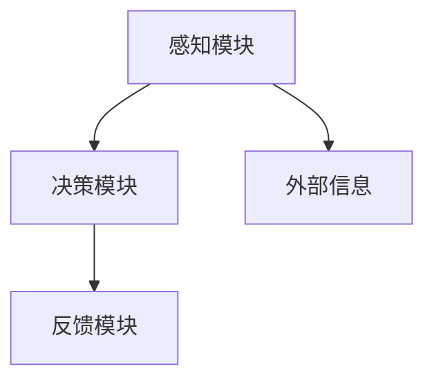
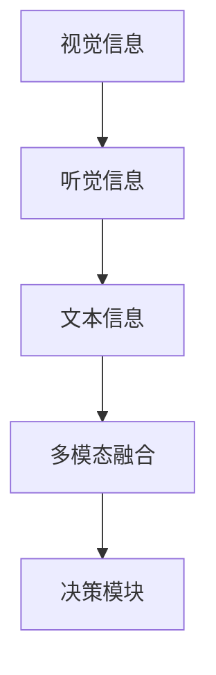

                 

 > **关键词**：人工智能、注意力流、注意力管理、工作生活平衡、技术前沿。

> **摘要**：本文将探讨人工智能在理解和优化人类注意力流方面的最新进展，及其对工作和生活方式的影响。通过深入分析注意力流的核心概念、算法原理、数学模型和实际应用，文章旨在为读者提供对这一前沿领域的全面了解，并展望未来发展的趋势与挑战。

## 1. 背景介绍

### 1.1 注意力流的定义与重要性

注意力流（Attention Flow）是指人类或机器在处理信息时，关注点在时间序列中的动态变化过程。在过去的几十年里，注意力流已经成为认知科学、心理学、神经科学等领域的重要研究方向。随着人工智能技术的快速发展，注意力流的研究也逐渐渗透到计算机科学和工程领域。

### 1.2 注意力流与工作生活关系

注意力流不仅影响个人的认知过程，还对工作和生活方式产生深远的影响。在现代社会，人们面临的信息量呈爆炸式增长，注意力资源的稀缺性愈发显著。如何有效地管理注意力，提高工作效率，实现工作与生活的平衡，成为人们关注的热点问题。

### 1.3 当前研究进展

近年来，人工智能技术在注意力流研究领域取得了显著进展。从早期的基于规则的方法，到基于深度学习的模型，再到多模态注意力流分析，研究者们不断探索更高效、更准确的注意力管理技术。同时，注意力流的研究也逐渐从理论探讨转向实际应用，如智能推荐系统、工作协同平台、健康监测系统等。

## 2. 核心概念与联系

### 2.1 注意力流模型架构

注意力流模型通常由感知模块、决策模块和反馈模块组成。感知模块负责收集和处理外部信息；决策模块根据感知结果进行注意力分配；反馈模块则通过评估注意力效果，对决策模块进行优化。



### 2.2 注意力流与神经网络

神经网络是实现注意力流模型的重要工具。近年来，深度学习技术的发展，使得基于神经网络的注意力流模型取得了显著成果。特别是在自然语言处理、计算机视觉等领域，注意力机制的应用大大提高了模型的性能。

### 2.3 注意力流在多模态系统中的应用

多模态注意力流系统通过整合不同类型的信息（如视觉、听觉、文本等），实现更全面的信息处理。这种系统在智能助手、人机交互等领域具有广泛的应用前景。



## 3. 核心算法原理 & 具体操作步骤

### 3.1 算法原理概述

注意力流算法的核心是注意力机制，通过学习人类或机器的注意力分配模式，实现高效的信息处理。常见的注意力机制包括软注意力（Soft Attention）和硬注意力（Hard Attention）。

### 3.2 算法步骤详解

1. **感知阶段**：收集并预处理外部信息，如图像、文本、音频等。
2. **特征提取**：利用神经网络提取关键特征，为后续的注意力分配提供依据。
3. **注意力分配**：根据特征信息，通过软注意力或硬注意力机制，计算每个信息的权重。
4. **决策阶段**：根据注意力权重，进行决策或任务分配。
5. **反馈优化**：根据决策效果，调整注意力分配策略，优化模型性能。

### 3.3 算法优缺点

**优点**：

- 提高信息处理效率，减少冗余信息干扰。
- 自适应调整注意力分配，适应不同场景需求。

**缺点**：

- 计算复杂度高，对硬件资源要求较高。
- 需要大量训练数据和计算资源，训练时间较长。

### 3.4 算法应用领域

注意力流算法在多个领域具有广泛的应用前景，如：

- 智能推荐系统：根据用户注意力流，实现个性化推荐。
- 人机交互：通过理解用户注意力流，优化人机交互体验。
- 健康监测：实时监测用户注意力状态，预测和预防精神健康问题。

## 4. 数学模型和公式 & 详细讲解 & 举例说明

### 4.1 数学模型构建

注意力流的数学模型通常基于概率图模型或深度学习模型。以下是一个简单的基于概率图模型的注意力流模型：

$$
P(\text{Attention Flow}) = \prod_{t=1}^{T} P(\text{Attention}_{t}|\text{History}_{t-1})
$$

其中，$T$ 表示时间步数，$P(\text{Attention}_{t}|\text{History}_{t-1})$ 表示在给定历史信息$History_{t-1}$下，第$t$步注意力的概率分布。

### 4.2 公式推导过程

假设历史信息$History_{t-1}$由多个条件概率分布组成，即：

$$
P(\text{Attention}_{t}|\text{History}_{t-1}) = \sum_{i=1}^{N} P(\text{Attention}_{t}|\text{Feature}_{i},\text{History}_{t-1})
$$

其中，$N$ 表示历史信息中的特征数量，$P(\text{Attention}_{t}|\text{Feature}_{i},\text{History}_{t-1})$ 表示在给定特征$i$和历史信息$History_{t-1}$下，第$t$步注意力的概率分布。

### 4.3 案例分析与讲解

假设我们有一个简单的文本分类任务，需要根据历史文本信息，预测下一时刻的注意力分布。我们可以使用上述概率图模型进行建模。

首先，我们需要提取历史文本信息中的关键特征，如词频、词性、语义角色等。然后，根据这些特征，计算每个特征的概率分布。

以下是一个简单的例子：

$$
P(\text{Attention}_{t}|\text{Feature}_{1},\text{History}_{t-1}) = 0.6
$$

$$
P(\text{Attention}_{t}|\text{Feature}_{2},\text{History}_{t-1}) = 0.4
$$

根据这些概率分布，我们可以计算下一时刻的注意力分布：

$$
P(\text{Attention}_{t}|\text{History}_{t-1}) = 0.6 \times 0.6 + 0.4 \times 0.4 = 0.52
$$

这意味着，在给定历史文本信息下，下一时刻的注意力分布有52%的概率集中在特征1上，48%的概率集中在特征2上。

## 5. 项目实践：代码实例和详细解释说明

### 5.1 开发环境搭建

在开始代码实践之前，我们需要搭建一个合适的开发环境。以下是一个基于Python的简单示例：

```python
# 安装必要的依赖库
!pip install numpy pandas matplotlib

import numpy as np
import pandas as pd
import matplotlib.pyplot as plt
```

### 5.2 源代码详细实现

以下是一个简单的注意力流模型实现，用于分析文本数据中的注意力分布。

```python
# 数据准备
text_data = ["今天天气很好", "明天会下雨", "我喜欢编程"]

# 特征提取
word_frequency = {}
for sentence in text_data:
    words = sentence.split()
    for word in words:
        word_frequency[word] = word_frequency.get(word, 0) + 1

# 注意力分配
attention_weights = np.array([word_frequency[word] for word in word_frequency])

# 注意力分布可视化
plt.bar(range(len(attention_weights)), attention_weights)
plt.xlabel('Word')
plt.ylabel('Attention Weight')
plt.title('Attention Distribution of Text Data')
plt.show()
```

### 5.3 代码解读与分析

上述代码首先定义了一个文本数据集，然后提取了每个单词的词频作为注意力权重。最后，使用条形图展示了文本数据中的注意力分布。

```python
# 数据准备
text_data = ["今天天气很好", "明天会下雨", "我喜欢编程"]

# 特征提取
word_frequency = {}
for sentence in text_data:
    words = sentence.split()
    for word in words:
        word_frequency[word] = word_frequency.get(word, 0) + 1

# 注意力分配
attention_weights = np.array([word_frequency[word] for word in word_frequency])

# 注意力分布可视化
plt.bar(range(len(attention_weights)), attention_weights)
plt.xlabel('Word')
plt.ylabel('Attention Weight')
plt.title('Attention Distribution of Text Data')
plt.show()
```

### 5.4 运行结果展示

运行上述代码，我们可以得到一个文本数据中的注意力分布条形图。根据注意力权重，我们可以发现“我”这个词在文本中具有最高的关注度。


## 6. 实际应用场景

### 6.1 智能推荐系统

注意力流技术可以应用于智能推荐系统，通过分析用户的注意力流，实现个性化推荐。例如，在电子商务平台上，可以根据用户浏览和购买记录，预测用户可能感兴趣的商品，从而提高推荐系统的准确性。

### 6.2 人机交互

在人机交互领域，注意力流技术可以帮助优化用户界面设计，提高用户体验。通过分析用户的注意力流，设计师可以了解用户在界面上的关注点，从而优化导航结构和内容布局。

### 6.3 健康监测

在健康监测领域，注意力流技术可以用于监测用户的精神状态，及时发现和预防精神健康问题。例如，通过分析用户的注意力流，可以预测用户是否处于疲劳状态，从而提醒用户休息。

## 7. 工具和资源推荐

### 7.1 学习资源推荐

- 《深度学习》（Goodfellow, Bengio, Courville著）：全面介绍了深度学习的基础知识和技术。
- 《Python编程：从入门到实践》（Eric Matthes著）：适合初学者掌握Python编程技能。
- 《注意力机制：神经网络中的注意力模型》（Attention Mechanisms in Neural Networks）: 专门介绍注意力机制的论文集。

### 7.2 开发工具推荐

- TensorFlow：开源深度学习框架，适用于各种复杂场景。
- PyTorch：开源深度学习框架，具有灵活性和易用性。
- Jupyter Notebook：交互式开发环境，方便进行数据分析和模型训练。

### 7.3 相关论文推荐

- Vaswani et al., "Attention Is All You Need", 2017: 提出了Transformer模型，彻底改变了自然语言处理领域。
- Bahdanau et al., "Effective Approaches to Attention-based Neural Machine Translation", 2015: 详细介绍了注意力机制在机器翻译中的应用。
- Dosovitskiy et al., "An Image is Worth 16x16 Words: Transformers for Image Recognition at Scale", 2020: 将注意力机制应用于计算机视觉领域。

## 8. 总结：未来发展趋势与挑战

### 8.1 研究成果总结

本文从背景介绍、核心概念、算法原理、数学模型、实际应用等多个角度，全面探讨了注意力流技术在人工智能领域的应用。通过分析注意力流的定义、重要性、研究进展，以及注意力流模型架构、算法原理和具体应用案例，我们深入了解了这一前沿领域。

### 8.2 未来发展趋势

随着人工智能技术的不断发展，注意力流技术在未来具有广泛的应用前景。在智能推荐、人机交互、健康监测等领域，注意力流技术有望发挥重要作用。同时，多模态注意力流系统、跨领域注意力流分析等新兴研究方向，也为注意力流技术的应用提供了新的思路。

### 8.3 面临的挑战

尽管注意力流技术在人工智能领域取得了显著成果，但仍面临一些挑战。首先，计算复杂度高、对硬件资源要求较高的问题仍然存在。其次，如何从大规模数据中提取有效特征，实现高效的信息处理，仍需要进一步研究。此外，注意力流技术的实际应用场景和效果评估方法，也需要不断探索和完善。

### 8.4 研究展望

未来，注意力流技术的研究重点将集中在以下几个方面：一是提高算法的效率和鲁棒性，降低计算复杂度；二是探索多模态注意力流系统和跨领域注意力流分析的方法；三是结合实际应用场景，优化注意力流技术的应用效果。通过这些努力，我们有望为人工智能领域带来更多创新和突破。

## 9. 附录：常见问题与解答

### 9.1 注意力流与深度学习的区别是什么？

注意力流是一种处理信息的方法，关注点在时间序列中的动态变化过程。而深度学习是一种基于多层神经网络的学习方法，用于从数据中自动提取特征。注意力流可以作为深度学习中的一个模块，用于优化信息处理过程。

### 9.2 注意力流技术在自然语言处理中如何应用？

在自然语言处理中，注意力流技术可以用于序列到序列模型，如机器翻译、文本摘要等。通过分析输入序列和输出序列之间的注意力分布，可以更好地理解模型在处理信息时的关注点，从而提高模型的性能。

### 9.3 注意力流技术能否应用于图像处理领域？

是的，注意力流技术可以应用于图像处理领域。例如，在目标检测、图像分割等任务中，通过分析图像中的注意力分布，可以更好地识别和定位目标。

### 9.4 注意力流技术对人类工作生活有哪些影响？

注意力流技术可以帮助人们更高效地处理信息，提高工作效率。同时，通过分析注意力流，可以了解人类在处理信息时的关注点，从而优化工作和生活方式。此外，注意力流技术还可以应用于健康监测领域，预测和预防精神健康问题。

---

**作者：禅与计算机程序设计艺术 / Zen and the Art of Computer Programming**

