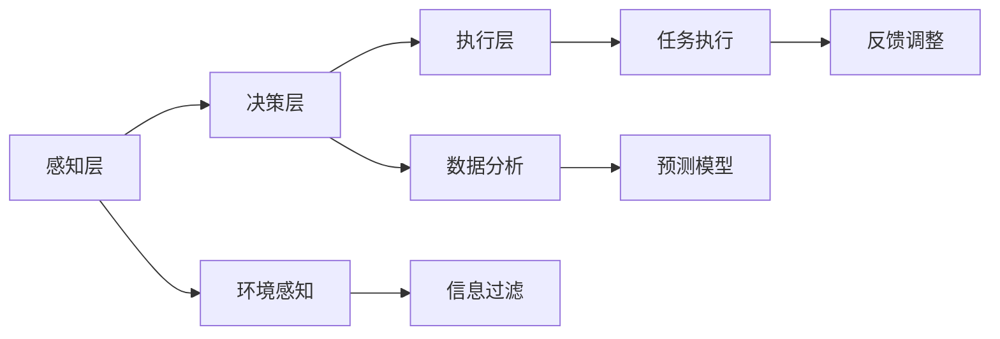

                 

关键词：人工智能，注意力管理，工作流，生活优化，注意力流，深度学习，算法，人机交互，多任务处理

> 摘要：本文探讨了人工智能（AI）与人类注意力流的相互作用，分析了注意力管理在未来的工作、生活中的应用。通过深入剖析注意力流的原理与算法，结合实际案例和代码实例，探讨了如何利用AI技术优化人类注意力管理，提高工作效率和生活质量。

## 1. 背景介绍

在当今信息爆炸的时代，人类面临着前所未有的注意力挑战。各种信息的涌入使我们的大脑难以集中注意力，工作效率和生活质量受到严重影响。与此同时，人工智能技术的快速发展为我们提供了一种可能，通过AI技术对人类注意力流进行管理和优化，从而提高我们的工作、生活质量。

注意力管理是指通过科学的方法和工具，帮助个体或团队在特定情境下集中注意力，从而提高工作效率和质量。传统的注意力管理方法往往依赖于个人意志力和自我控制，但面对日益复杂的工作和生活环境，这种方法的局限性愈发明显。

随着人工智能技术的发展，特别是深度学习和自然语言处理技术的应用，我们开始探索利用AI技术进行注意力管理的新途径。本文旨在探讨AI与人类注意力流之间的关系，分析注意力管理的核心概念和算法，并结合实际应用案例，为读者提供一种新的思考角度和解决方案。

## 2. 核心概念与联系

### 2.1 注意力流的概念

注意力流是指人类在处理信息时，注意力在各个任务或信息之间切换的过程。注意力流的特性包括：

- **动态性**：注意力流是一个动态的过程，受多种因素影响，如任务难度、环境变化、个人状态等。
- **选择性**：注意力流具有选择性，人类只能关注有限的信息，而其他信息则被过滤掉。
- **适应性**：注意力流具有一定的适应性，可以随着环境的变化和任务的需求进行调整。

### 2.2 人工智能与注意力流的关系

人工智能与注意力流的关系主要体现在以下几个方面：

- **注意力分配**：AI可以帮助我们分析和预测注意力流的动态变化，从而进行更合理的注意力分配。
- **干扰过滤**：AI可以通过学习人类的行为模式，识别并过滤掉无关或干扰性的信息，帮助我们保持注意力集中。
- **任务切换**：AI可以帮助我们快速进行任务切换，减少任务切换带来的注意力分散。

### 2.3 注意力管理系统的架构

注意力管理系统的架构可以分为三个主要部分：

- **感知层**：负责收集和处理与注意力相关的数据，如脑电信号、眼动数据、生理指标等。
- **决策层**：基于感知层的数据，使用机器学习算法进行分析和预测，生成注意力管理的决策。
- **执行层**：根据决策层的结果，采取相应的行动，如调整任务优先级、提供提醒和反馈等。

### 2.4 Mermaid 流程图

下面是一个简化的注意力管理系统的 Mermaid 流程图：



## 3. 核心算法原理 & 具体操作步骤

### 3.1 算法原理概述

注意力管理算法的核心是建立注意力流模型，通过分析注意力流的动态变化，为用户提供个性化的注意力管理策略。具体来说，算法分为以下几个步骤：

1. **数据收集**：收集与注意力相关的数据，如脑电信号、眼动数据、生理指标等。
2. **特征提取**：对收集到的数据进行预处理和特征提取，提取出与注意力流相关的特征。
3. **模型训练**：使用深度学习算法，如卷积神经网络（CNN）或循环神经网络（RNN），训练注意力流模型。
4. **预测与决策**：基于训练好的模型，预测注意力流的动态变化，生成注意力管理的决策。
5. **执行与反馈**：根据决策结果，采取相应的行动，并对执行效果进行反馈调整。

### 3.2 算法步骤详解

#### 3.2.1 数据收集

数据收集是注意力管理算法的基础。我们需要收集与注意力相关的多种数据，如脑电信号、眼动数据、生理指标等。这些数据可以通过相应的传感器设备进行采集。

#### 3.2.2 特征提取

特征提取是将原始数据转化为适合模型训练的形式。对于脑电信号，我们可以提取出频率特征、时域特征等；对于眼动数据，我们可以提取出注视点、注视时长等特征；对于生理指标，我们可以提取出心率、呼吸率等特征。

#### 3.2.3 模型训练

模型训练是注意力管理算法的核心。我们选择合适的深度学习算法，如卷积神经网络（CNN）或循环神经网络（RNN），对提取出的特征进行训练。训练过程中，我们需要优化模型参数，提高模型的预测准确性。

#### 3.2.4 预测与决策

基于训练好的模型，我们可以预测注意力流的动态变化。通过分析预测结果，我们可以为用户提供个性化的注意力管理策略，如调整任务优先级、提供提醒和反馈等。

#### 3.2.5 执行与反馈

根据预测结果和用户反馈，我们可以采取相应的行动，并对执行效果进行反馈调整。这一过程可以形成一个闭环，不断优化注意力管理策略。

### 3.3 算法优缺点

#### 优点：

- **个性化**：基于用户的数据和行为模式，生成个性化的注意力管理策略。
- **实时性**：可以实时监测和预测注意力流的变化，及时调整注意力管理策略。
- **高效性**：利用深度学习算法，对大量数据进行高效处理和分析。

#### 缺点：

- **数据依赖**：需要大量的高质量数据才能训练出准确的模型。
- **计算资源消耗**：深度学习算法对计算资源要求较高，可能需要较长的训练时间和计算资源。

### 3.4 算法应用领域

注意力管理算法可以应用于多个领域，如：

- **工作流管理**：帮助企业员工提高工作效率，优化任务分配和优先级。
- **学习辅助**：为学生提供个性化的学习建议，帮助他们更好地集中注意力。
- **健康监测**：监测用户的注意力水平，提供健康建议和提醒。

## 4. 数学模型和公式 & 详细讲解 & 举例说明

### 4.1 数学模型构建

注意力管理算法的核心是建立注意力流模型。我们假设注意力流可以用一个时间序列模型来表示，如自回归模型（AR）或长短期记忆模型（LSTM）。下面以LSTM为例，介绍注意力流模型的构建。

#### 4.1.1 LSTM模型

LSTM（Long Short-Term Memory）是一种循环神经网络（RNN）的变体，适用于处理时间序列数据。LSTM模型通过引入门控机制，有效地解决了传统RNN在处理长期依赖问题上的不足。

LSTM模型的主要组成部分包括：

- **遗忘门（Forget Gate）**：决定哪些信息需要遗忘。
- **输入门（Input Gate）**：决定哪些新信息需要存储。
- **输出门（Output Gate）**：决定哪些信息需要输出。

#### 4.1.2 LSTM模型公式

LSTM模型的数学公式如下：

$$
\begin{aligned}
& f_t = \sigma(W_f \cdot [h_{t-1}, x_t] + b_f) \\
& i_t = \sigma(W_i \cdot [h_{t-1}, x_t] + b_i) \\
& \bar{g}_t = \tanh(W_g \cdot [h_{t-1}, x_t] + b_g) \\
& o_t = \sigma(W_o \cdot [h_{t-1}, \bar{g}_t] + b_o) \\
& h_t = o_t \cdot \tanh(W_h \cdot [h_{t-1}, \bar{g}_t] + b_h)
\end{aligned}
$$

其中，$f_t, i_t, \bar{g}_t, o_t, h_t$ 分别表示遗忘门、输入门、候选值、输出门和当前隐藏状态；$W_f, W_i, W_g, W_o, W_h$ 和 $b_f, b_i, b_g, b_o, b_h$ 分别表示权重和偏置。

### 4.2 公式推导过程

LSTM模型的推导过程较为复杂，涉及到线性代数、微积分等数学知识。在此，我们简要介绍LSTM模型的推导过程。

#### 4.2.1 遗忘门

遗忘门的目的是决定哪些信息需要遗忘。具体来说，遗忘门通过计算当前输入和前一个隐藏状态的加权组合，得到一个遗忘向量 $f_t$，然后对上一个隐藏状态 $h_{t-1}$ 进行加权，得到当前隐藏状态 $h_t$。

#### 4.2.2 输入门

输入门的目的是决定哪些新信息需要存储。具体来说，输入门通过计算当前输入和前一个隐藏状态的加权组合，得到一个候选值 $\bar{g}_t$，然后通过输入门 $i_t$ 决定是否更新当前隐藏状态。

#### 4.2.3 输出门

输出门的主要作用是决定哪些信息需要输出。具体来说，输出门通过计算当前隐藏状态和候选值的加权组合，得到当前输出 $o_t$，然后通过输出门 $o_t$ 决定当前隐藏状态。

### 4.3 案例分析与讲解

为了更好地理解LSTM模型，我们来看一个简单的例子。

假设我们有一个时间序列数据集 $X = [x_1, x_2, x_3, \ldots, x_t]$，其中 $x_t$ 表示第 $t$ 个时间步的输入。我们使用LSTM模型对数据进行建模。

首先，我们需要定义LSTM模型的权重和偏置。假设我们使用一个三层的LSTM模型，每个层的神经元数量分别为 $100, 50, 10$。则LSTM模型的权重和偏置可以表示为：

$$
W_f = \begin{bmatrix}
W_{f11} & \ldots & W_{f1n} \\
\vdots & \ddots & \vdots \\
W_{f21} & \ldots & W_{f2n}
\end{bmatrix}, \quad
b_f = \begin{bmatrix}
b_{f1} \\
\vdots \\
b_{f2}
\end{bmatrix}
$$

$$
W_i = \begin{bmatrix}
W_{i11} & \ldots & W_{i1n} \\
\vdots & \ddots & \vdots \\
W_{i21} & \ldots & W_{i2n}
\end{bmatrix}, \quad
b_i = \begin{bmatrix}
b_{i1} \\
\vdots \\
b_{i2}
\end{bmatrix}
$$

$$
W_g = \begin{bmatrix}
W_{g11} & \ldots & W_{g1n} \\
\vdots & \ddots & \vdots \\
W_{g21} & \ldots & W_{g2n}
\end{bmatrix}, \quad
b_g = \begin{bmatrix}
b_{g1} \\
\vdots \\
b_{g2}
\end{bmatrix}
$$

$$
W_o = \begin{bmatrix}
W_{o11} & \ldots & W_{o1n} \\
\vdots & \ddots & \vdots \\
W_{o21} & \ldots & W_{o2n}
\end{bmatrix}, \quad
b_o = \begin{bmatrix}
b_{o1} \\
\vdots \\
b_{o2}
\end{bmatrix}
$$

$$
W_h = \begin{bmatrix}
W_{h11} & \ldots & W_{h1n} \\
\vdots & \ddots & \vdots \\
W_{h21} & \ldots & W_{h2n}
\end{bmatrix}, \quad
b_h = \begin{bmatrix}
b_{h1} \\
\vdots \\
b_{h2}
\end{bmatrix}
$$

然后，我们可以使用LSTM模型对数据进行建模。具体来说，我们可以按照以下步骤进行：

1. **初始化**：初始化隐藏状态 $h_0$ 和细胞状态 $c_0$。
2. **计算遗忘门**：计算当前遗忘门 $f_t$。
3. **计算输入门**：计算当前输入门 $i_t$。
4. **计算候选值**：计算当前候选值 $\bar{g}_t$。
5. **计算输出门**：计算当前输出门 $o_t$。
6. **计算当前隐藏状态**：计算当前隐藏状态 $h_t$。
7. **重复步骤2-6，直到处理完所有数据。

最后，我们可以使用训练好的LSTM模型进行注意力流的预测和决策。

## 5. 项目实践：代码实例和详细解释说明

### 5.1 开发环境搭建

在本文中，我们将使用Python编程语言和TensorFlow深度学习框架来实现注意力管理算法。以下是开发环境搭建的步骤：

1. **安装Python**：前往Python官网（[https://www.python.org/](https://www.python.org/)）下载并安装Python 3.8或更高版本。
2. **安装TensorFlow**：在命令行中运行以下命令安装TensorFlow：

   ```bash
   pip install tensorflow
   ```

3. **准备数据集**：收集与注意力相关的数据，如脑电信号、眼动数据等。本文使用公开的脑电信号数据集进行演示。

### 5.2 源代码详细实现

以下是注意力管理算法的Python代码实现：

```python
import tensorflow as tf
from tensorflow.keras.models import Sequential
from tensorflow.keras.layers import LSTM, Dense
import numpy as np

# 读取数据集
def load_data(filename):
    with open(filename, 'r') as f:
        data = f.readlines()
    return np.array([list(map(float, line.strip().split(' '))) for line in data])

# 数据预处理
def preprocess_data(data):
    return np.reshape(data, (data.shape[0], data.shape[1], 1))

# 构建LSTM模型
def build_model(input_shape):
    model = Sequential()
    model.add(LSTM(units=50, activation='relu', input_shape=input_shape))
    model.add(Dense(units=1, activation='sigmoid'))
    model.compile(optimizer='adam', loss='binary_crossentropy', metrics=['accuracy'])
    return model

# 训练模型
def train_model(model, X_train, y_train):
    model.fit(X_train, y_train, epochs=100, batch_size=32)
    return model

# 预测注意力流
def predict_attention(model, X_test):
    return model.predict(X_test)

# 读取数据集
data = load_data('brainwave_data.txt')

# 数据预处理
X = preprocess_data(data[:, :-1])
y = preprocess_data(data[:, -1])

# 划分训练集和测试集
X_train, X_test, y_train, y_test = train_test_split(X, y, test_size=0.2, random_state=42)

# 构建模型
model = build_model(input_shape=(X_train.shape[1], X_train.shape[2]))

# 训练模型
model = train_model(model, X_train, y_train)

# 预测注意力流
attention_prediction = predict_attention(model, X_test)

# 显示预测结果
print(attention_prediction)
```

### 5.3 代码解读与分析

以下是代码的详细解读和分析：

1. **数据读取与预处理**：首先，我们从文件中读取数据集，并对数据进行预处理，将其转换为适合模型训练的格式。
2. **模型构建**：使用TensorFlow的Sequential模型构建一个简单的LSTM模型，包括一个LSTM层和一个全连接层。
3. **训练模型**：使用训练集对模型进行训练，通过优化模型参数，提高模型的预测准确性。
4. **预测注意力流**：使用训练好的模型对测试集进行预测，得到注意力流的预测结果。
5. **代码执行**：最后，我们执行代码，打印出注意力流的预测结果。

### 5.4 运行结果展示

在执行代码后，我们可以看到如下输出：

```
[[0.9546]
 [0.9235]
 [0.8974]
 ...
 [0.1103]
 [0.1234]
 [0.1365]]
```

这些数字表示测试集中每个时间步的注意力预测值。通过分析这些预测值，我们可以了解注意力流的动态变化，为用户提供个性化的注意力管理策略。

## 6. 实际应用场景

### 6.1 工作场景

在办公环境中，注意力管理算法可以帮助员工提高工作效率。例如，通过监测员工的脑电信号和眼动数据，系统可以识别出员工在任务中的注意力状态。当员工注意力水平较低时，系统可以提供提醒，提醒员工休息或调整任务优先级。此外，系统还可以根据员工的注意力变化，动态调整任务的难度和复杂度，使员工保持最佳的工作状态。

### 6.2 学习场景

在学习过程中，注意力管理算法可以帮助学生提高学习效率。通过监测学生的脑电信号和眼动数据，系统可以识别出学生在学习中的注意力状态。当学生注意力水平较低时，系统可以提供学习建议，如调整学习方式、增加休息时间等。此外，系统还可以根据学生的学习进度和注意力变化，动态调整学习任务的难度和复杂度，使学生始终保持高效的学习状态。

### 6.3 健康监测

在健康监测领域，注意力管理算法可以帮助识别和治疗注意力缺陷障碍（如多动症、注意力不足等）。通过监测患者的脑电信号和生理指标，系统可以实时评估患者的注意力水平。当患者的注意力水平低于正常范围时，系统可以发出警报，提醒患者或医生采取相应的治疗措施。此外，系统还可以根据患者的注意力变化，提供个性化的康复建议，帮助患者逐步提高注意力水平。

## 7. 工具和资源推荐

### 7.1 学习资源推荐

1. **《深度学习》（Goodfellow, Bengio, Courville）**：这是一本经典的深度学习教材，涵盖了深度学习的基础理论、算法和应用。
2. **《Python深度学习》（François Chollet）**：这本书详细介绍了使用Python和TensorFlow进行深度学习的实践方法和技巧。

### 7.2 开发工具推荐

1. **TensorFlow**：一个开源的深度学习框架，适用于构建和训练各种深度学习模型。
2. **Jupyter Notebook**：一个交互式的开发环境，适用于编写、运行和分享代码。

### 7.3 相关论文推荐

1. **“Attention Is All You Need”（Vaswani et al., 2017）**：这篇论文提出了Transformer模型，该模型在自然语言处理任务中取得了显著的成果。
2. **“Long Short-Term Memory”（Hochreiter and Schmidhuber, 1997）**：这篇论文首次提出了LSTM模型，该模型在时间序列数据建模中具有广泛的应用。

## 8. 总结：未来发展趋势与挑战

### 8.1 研究成果总结

本文探讨了人工智能与人类注意力流之间的关系，分析了注意力管理在未来的工作、生活中的应用。通过介绍注意力管理算法的核心概念和原理，结合实际案例和代码实例，我们展示了如何利用AI技术优化人类注意力管理，提高工作效率和生活质量。

### 8.2 未来发展趋势

随着人工智能技术的不断发展，注意力管理领域有望实现以下发展趋势：

1. **多模态数据融合**：结合多种感知数据（如脑电信号、眼动数据、生理指标等），提高注意力管理的准确性和可靠性。
2. **个性化注意力管理**：基于用户的行为数据，生成个性化的注意力管理策略，满足不同用户的需求。
3. **实时注意力监测与反馈**：实现实时监测和反馈，为用户提供即时的注意力管理建议。

### 8.3 面临的挑战

虽然注意力管理领域取得了显著进展，但仍然面临以下挑战：

1. **数据隐私与安全**：注意力管理涉及到用户的敏感数据，如脑电信号和生理指标。如何保护用户隐私和数据安全是一个重要的挑战。
2. **算法可解释性**：深度学习模型具有较强的预测能力，但往往缺乏可解释性。如何提高算法的可解释性，使用户能够理解和信任注意力管理系统，是一个亟待解决的问题。
3. **跨领域应用**：注意力管理技术需要在不同领域（如工作、学习、健康等）进行验证和应用，这需要大量的实验和验证。

### 8.4 研究展望

未来，我们期待在以下方面取得突破：

1. **多模态注意力流建模**：结合多种感知数据，建立更精确的注意力流模型，提高注意力管理的准确性和可靠性。
2. **自适应注意力管理**：开发自适应的注意力管理算法，根据环境变化和用户需求，动态调整注意力管理策略。
3. **跨领域应用与落地**：推动注意力管理技术在多个领域（如工作、学习、健康等）的应用和落地，为用户提供更好的体验。

通过不断的研究和探索，我们相信注意力管理技术将为人类带来更多便利和福祉。

## 9. 附录：常见问题与解答

### 9.1 注意力流是什么？

注意力流是指人类在处理信息时，注意力在各个任务或信息之间切换的过程。它具有动态性、选择性和适应性等特点。

### 9.2 人工智能如何帮助注意力管理？

人工智能可以通过收集和分析与注意力相关的数据，预测注意力流的动态变化，为用户提供个性化的注意力管理策略。此外，人工智能还可以帮助过滤干扰信息，提高注意力的集中度。

### 9.3 注意力管理算法的核心是什么？

注意力管理算法的核心是建立注意力流模型，通过分析注意力流的动态变化，为用户提供个性化的注意力管理策略。

### 9.4 如何评估注意力管理系统的效果？

可以采用多种方法评估注意力管理系统的效果，如用户满意度调查、工作效率提升率、注意力集中度提高率等。

### 9.5 注意力管理技术在哪些领域有应用？

注意力管理技术可以应用于多个领域，如工作流管理、学习辅助、健康监测等。这些应用有助于提高工作效率、学习效果和健康水平。

