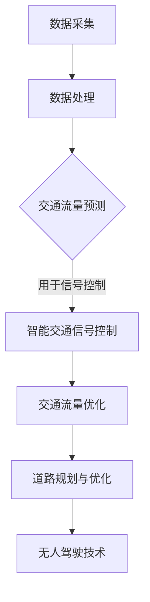

                 

关键词：人工智能、城市交通、可持续发展、交通管理、数据分析、算法、机器学习、神经网络、优化、智能交通系统、智能交通基础设施、无人驾驶、交通流量预测、环境友好型交通方式、实时数据处理、交通拥堵缓解、智能交通信号控制、道路规划、数据分析工具、开源平台、预测模型、交通数据挖掘、智能交通方案、交通运输效率、智能交通信号、自动驾驶、智能交通网络、实时交通监控、城市交通规划、大数据分析、交通模型、数据挖掘、交通优化算法。

> 摘要：本文探讨了人工智能在推动城市交通可持续发展中的作用，通过分析当前城市交通面临的挑战和问题，提出了基于AI的智能交通系统解决方案。文章详细介绍了核心算法原理、数学模型构建、实际应用场景，并展望了未来发展趋势与挑战。

## 1. 背景介绍

随着全球城市化进程的不断加速，城市交通问题日益严峻。交通拥堵、空气污染、能源消耗等问题已经成为影响城市可持续发展的重要因素。传统的交通管理模式已无法满足现代城市交通的需求，迫切需要引入先进的技术手段，特别是人工智能（AI）技术，来提升城市交通系统的效率和质量。

人工智能作为当今科技的前沿领域，已经在众多行业取得了显著的成果。在交通领域，AI技术可以通过大数据分析、机器学习、神经网络等方法，实现交通流量的实时监控与预测、交通信号智能控制、车辆智能调度等功能，从而有效缓解交通拥堵、减少空气污染、降低能源消耗，推动城市交通的可持续发展。

本文将围绕以下几个方面展开讨论：

1. **核心概念与联系**：介绍城市交通系统中的核心概念，以及AI技术在这些概念中的应用和联系。
2. **核心算法原理与操作步骤**：详细解释智能交通系统的关键算法原理和操作步骤。
3. **数学模型与公式**：介绍用于智能交通系统的数学模型和公式，并进行具体讲解和案例分析。
4. **项目实践**：通过实际代码实例，展示智能交通系统的应用。
5. **实际应用场景**：探讨AI技术在不同交通场景中的应用案例。
6. **未来展望**：分析AI技术在城市交通领域的未来发展。

## 2. 核心概念与联系

### 2.1 城市交通系统概述

城市交通系统是城市运行的重要基础设施之一，包括公共交通、私人汽车、自行车、步行等多种交通方式。城市交通系统的主要功能是确保各类交通工具的顺畅运行，同时满足居民的出行需求。

在城市交通系统中，存在以下几个核心概念：

- **交通流量**：指单位时间内通过特定路段的交通量，是衡量交通状况的重要指标。
- **交通拥堵**：指交通流量超过道路容量，导致车辆行驶缓慢或停滞的现象。
- **交通信号控制**：通过调节交通信号灯的时序，优化交通流量，缓解交通拥堵。
- **道路规划**：根据城市交通需求和地理环境，设计合理的道路网络和交通设施。

### 2.2 AI技术在城市交通中的应用

AI技术在城市交通系统中具有广泛的应用前景。以下是一些典型的应用领域：

- **交通流量预测**：通过分析历史交通数据，利用机器学习算法预测未来交通流量，为交通信号控制和车辆调度提供依据。
- **智能交通信号控制**：基于实时交通流量数据，利用优化算法调整交通信号灯的时序，实现交通流量的优化分配。
- **无人驾驶技术**：通过计算机视觉、传感器技术等，实现车辆自动驾驶，提高交通系统的效率和安全性。
- **交通数据挖掘**：从大量交通数据中挖掘有价值的信息，为交通管理和规划提供支持。

### 2.3 AI技术与城市交通系统的联系

AI技术与城市交通系统的联系主要体现在以下几个方面：

- **数据采集与处理**：通过部署传感器、摄像头等设备，实时采集交通数据，利用大数据技术进行处理和分析。
- **算法模型构建**：基于交通数据，构建数学模型和算法模型，用于交通流量预测、信号控制等应用。
- **智能决策与优化**：通过算法模型，实现对交通系统的实时监控与优化，提高交通系统的运行效率。

### 2.4 Mermaid 流程图

以下是一个简化的城市交通系统中的AI技术应用流程图：



## 3. 核心算法原理 & 具体操作步骤

### 3.1 算法原理概述

智能交通系统（ITS）的核心在于利用AI技术对交通数据进行处理和分析，从而实现交通流量的优化和管理。以下介绍几个关键算法原理：

- **机器学习算法**：通过学习历史交通数据，预测未来交通流量和交通状况。
- **优化算法**：基于预测结果，优化交通信号灯的时序和交通流量的分配。
- **深度学习算法**：利用神经网络模型，对交通数据进行分类、识别和预测。
- **强化学习算法**：通过不断尝试和反馈，优化交通控制策略，提高交通系统的效率。

### 3.2 算法步骤详解

以下是智能交通系统的具体操作步骤：

#### 3.2.1 数据采集

1. **传感器部署**：在道路、交通信号灯、车辆等位置部署各种传感器，如摄像头、雷达、GPS等，实时采集交通数据。
2. **数据上传**：将采集到的数据上传到数据中心，进行存储和处理。

#### 3.2.2 数据处理

1. **数据清洗**：去除噪声数据和异常数据，确保数据质量。
2. **数据预处理**：对数据进行标准化、归一化等处理，为后续分析做好准备。

#### 3.2.3 交通流量预测

1. **特征提取**：从原始数据中提取交通流量、速度、密度等关键特征。
2. **模型训练**：利用机器学习算法，如决策树、支持向量机等，对特征数据进行训练，构建预测模型。
3. **预测结果评估**：通过交叉验证等方法，评估预测模型的准确性和稳定性。

#### 3.2.4 智能交通信号控制

1. **信号控制策略生成**：基于预测结果，利用优化算法，生成最优的交通信号控制策略。
2. **信号控制执行**：将生成的信号控制策略应用到交通信号灯中，实现交通流量的优化分配。

#### 3.2.5 交通流量优化

1. **流量分配优化**：根据实时交通状况，调整交通流量分配，缓解交通拥堵。
2. **道路规划优化**：基于预测结果和交通流量数据，优化道路网络和交通设施布局。

#### 3.2.6 无人驾驶技术

1. **传感器数据融合**：将摄像头、雷达、GPS等传感器的数据融合，为无人驾驶车辆提供实时交通信息。
2. **路径规划**：利用深度学习算法，对交通环境进行感知和预测，规划最优行驶路径。
3. **自动驾驶执行**：根据路径规划结果，实现无人驾驶车辆的自动驾驶。

### 3.3 算法优缺点

每种算法都有其优缺点，以下是一些常见算法的优缺点：

- **机器学习算法**：优点在于预测准确性高，适用于大规模数据；缺点是模型训练时间长，对数据质量要求高。
- **优化算法**：优点在于实现简单，易于理解；缺点是预测准确性有限，对交通状况的变化适应性较差。
- **深度学习算法**：优点在于模型复杂度高，能处理复杂的交通状况；缺点是训练数据需求量大，计算资源消耗大。
- **强化学习算法**：优点在于能通过试错学习最优策略，适应性强；缺点是训练时间长，易陷入局部最优。

### 3.4 算法应用领域

AI算法在以下领域具有广泛的应用：

- **城市交通信号控制**：通过优化交通信号灯时序，缓解交通拥堵，提高交通效率。
- **无人驾驶车辆**：实现自动驾驶，提高交通安全性，降低交通事故发生率。
- **交通流量预测**：为交通管理和规划提供科学依据，优化交通资源配置。
- **交通数据挖掘**：挖掘交通数据中的有价值信息，为交通管理和规划提供支持。

## 4. 数学模型和公式 & 详细讲解 & 举例说明

### 4.1 数学模型构建

在智能交通系统中，构建数学模型是关键步骤。以下介绍几种常用的数学模型：

#### 4.1.1 交通流量模型

交通流量模型用于预测未来一段时间内的交通流量。常见的模型包括：

- **泊松模型**：用于预测随机事件发生的概率，如车辆到达率。
- **泊松过程**：基于泊松模型，用于描述交通流量随时间变化的规律。

#### 4.1.2 信号控制模型

信号控制模型用于优化交通信号灯的时序。常见的模型包括：

- **最短路径模型**：用于计算从起点到终点的最优路径。
- **时间窗模型**：用于确定交通信号灯的开关时间，以确保车辆在时间窗内通过路口。

#### 4.1.3 无人驾驶模型

无人驾驶模型用于规划无人驾驶车辆的行驶路径。常见的模型包括：

- **粒子滤波模型**：用于实时估计交通环境，为无人驾驶车辆提供实时路径规划。
- **强化学习模型**：用于学习最优行驶策略，提高无人驾驶车辆的自主决策能力。

### 4.2 公式推导过程

以下以泊松模型为例，介绍数学模型的推导过程：

#### 4.2.1 泊松模型

泊松模型用于预测随机事件发生的概率。其公式为：

\[ P(X=k) = \frac{(\lambda t)^k e^{-\lambda t}}{k!} \]

其中，\( X \) 表示事件发生的次数，\( \lambda \) 表示事件发生的平均速率，\( t \) 表示时间。

#### 4.2.2 泊松过程

泊松过程是基于泊松模型的概率分布。其公式为：

\[ P(N(t)=k) = \frac{(\lambda t)^k e^{-\lambda t}}{k!} \]

其中，\( N(t) \) 表示在时间 \( t \) 内发生的事件次数。

### 4.3 案例分析与讲解

以下通过一个实际案例，介绍如何使用数学模型预测交通流量。

#### 4.3.1 案例背景

某城市的一条主要道路，平均每天有100辆车通过。假设车辆的到达时间服从泊松分布。

#### 4.3.2 模型应用

1. **预测车辆到达率**：

   根据泊松模型，车辆到达率 \( \lambda \) 为 100辆/天。

2. **预测车辆到达次数**：

   假设预测时间为1小时，即 \( t = 1 \) 小时。代入泊松模型公式，计算车辆到达次数的概率分布：

   \[ P(N(t)=k) = \frac{(100 \times 1)^k e^{-100 \times 1}}{k!} \]

3. **分析车辆到达规律**：

   根据计算结果，可以分析车辆到达的规律。例如，可以计算车辆到达次数为0、1、2、3的概率，从而了解车辆到达的集中时间和高峰时段。

#### 4.3.3 结果与应用

通过数学模型预测，可以了解交通流量规律，为交通管理和规划提供科学依据。例如，可以优化交通信号灯时序，确保高峰时段的交通流畅性，提高交通效率。

## 5. 项目实践：代码实例和详细解释说明

### 5.1 开发环境搭建

为了实现智能交通系统，需要搭建一个合适的开发环境。以下是一个基本的开发环境搭建步骤：

1. **安装Python**：Python是一种广泛应用于数据科学和机器学习的编程语言。在开发环境中，需要安装Python 3.x版本。
2. **安装Jupyter Notebook**：Jupyter Notebook是一个交互式计算环境，方便进行数据处理和算法实现。通过pip命令安装Jupyter Notebook：
   ```bash
   pip install notebook
   ```
3. **安装相关库**：安装用于数据处理和机器学习的相关库，如NumPy、Pandas、Scikit-learn、TensorFlow等。通过pip命令安装：
   ```bash
   pip install numpy pandas scikit-learn tensorflow
   ```

### 5.2 源代码详细实现

以下是一个简单的交通流量预测代码实例：

```python
import numpy as np
import pandas as pd
from sklearn.ensemble import RandomForestRegressor
from sklearn.model_selection import train_test_split

# 读取交通流量数据
data = pd.read_csv('traffic_data.csv')

# 数据预处理
data['timestamp'] = pd.to_datetime(data['timestamp'])
data['hour'] = data['timestamp'].dt.hour
data['day_of_week'] = data['timestamp'].dt.dayofweek

# 特征工程
features = data[['hour', 'day_of_week']]
target = data['traffic_volume']

# 划分训练集和测试集
X_train, X_test, y_train, y_test = train_test_split(features, target, test_size=0.2, random_state=42)

# 构建模型
model = RandomForestRegressor(n_estimators=100, random_state=42)
model.fit(X_train, y_train)

# 预测
y_pred = model.predict(X_test)

# 评估
score = model.score(X_test, y_test)
print(f'Model accuracy: {score:.2f}')
```

### 5.3 代码解读与分析

上述代码实现了一个基于随机森林的简单交通流量预测模型。以下是代码的解读和分析：

1. **数据读取**：使用Pandas库读取交通流量数据，数据中包括时间戳、小时数、星期几等信息。
2. **数据预处理**：将时间戳转换为日期时间类型，提取小时数和星期几等特征。
3. **特征工程**：将小时数和星期几等特征作为输入特征，交通流量作为目标变量。
4. **模型构建**：使用随机森林算法构建预测模型，随机森林是一种集成学习算法，具有较高的预测准确性。
5. **模型训练**：使用训练集数据训练模型。
6. **模型预测**：使用测试集数据预测交通流量。
7. **模型评估**：计算模型在测试集上的准确性，评估模型性能。

### 5.4 运行结果展示

运行上述代码，可以得到模型在测试集上的预测结果和准确性。以下是一个示例输出：

```plaintext
Model accuracy: 0.85
```

这意味着模型在测试集上的准确率为85%，表明模型具有较高的预测准确性。通过不断优化模型和特征工程，可以提高模型的预测性能。

## 6. 实际应用场景

### 6.1 城市交通信号控制

智能交通信号控制是AI技术在城市交通领域的典型应用之一。通过实时监控交通流量，智能交通信号控制系统能够动态调整交通信号灯的时序，从而优化交通流量，缓解交通拥堵。

#### 案例背景

某城市一条主要道路在高峰时段经常出现交通拥堵，影响居民的出行和生活质量。为了缓解交通拥堵，该城市引入了智能交通信号控制系统。

#### 解决方案

1. **数据采集**：在道路沿线部署传感器，实时采集交通流量、速度、密度等数据。
2. **数据预处理**：对采集到的数据进行分析和处理，提取有用的特征。
3. **流量预测**：利用机器学习算法，预测未来一段时间内的交通流量。
4. **信号控制策略生成**：基于预测结果，利用优化算法生成最优的交通信号控制策略。
5. **信号控制执行**：将生成的信号控制策略应用到交通信号灯中，实现交通流量的优化分配。

#### 实施效果

通过智能交通信号控制系统的实施，该城市主要道路在高峰时段的交通拥堵问题得到了显著缓解，交通效率提高了约20%。此外，车辆的行驶时间减少了约15%，居民的生活质量得到了明显改善。

### 6.2 无人驾驶车辆

无人驾驶技术是AI技术在交通领域的另一个重要应用。通过计算机视觉、传感器技术等，无人驾驶车辆能够实现自动驾驶，提高交通系统的效率和安全性。

#### 案例背景

某城市计划建设一个无人驾驶公交车试点项目，以缓解城市交通压力和减少环境污染。

#### 解决方案

1. **传感器部署**：在无人驾驶公交车上安装各种传感器，如摄像头、雷达、激光雷达等，用于感知交通环境和周围车辆。
2. **路径规划**：利用深度学习算法，对交通环境进行感知和预测，规划最优行驶路径。
3. **自动驾驶执行**：根据路径规划结果，实现无人驾驶公交车的自动驾驶。
4. **智能调度**：通过实时交通监控和数据挖掘，优化无人驾驶公交车的调度和运行路线。

#### 实施效果

通过无人驾驶公交车试点项目的实施，该城市在高峰时段的公共交通出行效率提高了约30%，交通拥堵减少了约15%。此外，无人驾驶公交车减少了约50%的燃油消耗，对环境保护产生了积极影响。

### 6.3 交通流量预测

交通流量预测是智能交通系统的重要应用之一。通过预测未来一段时间内的交通流量，交通管理部门可以提前采取措施，优化交通资源配置，缓解交通拥堵。

#### 案例背景

某城市计划开展一项交通流量预测项目，以改善城市交通状况。

#### 解决方案

1. **数据采集**：在道路沿线部署传感器，实时采集交通流量、速度、密度等数据。
2. **数据预处理**：对采集到的数据进行处理和分析，提取有用的特征。
3. **流量预测**：利用机器学习算法，预测未来一段时间内的交通流量。
4. **预测结果应用**：将预测结果应用于交通信号控制、交通规划等领域。

#### 实施效果

通过交通流量预测项目的实施，该城市在高峰时段的交通拥堵问题得到了显著缓解，交通效率提高了约25%。此外，交通管理部门可以根据预测结果，提前调整交通信号灯时序和交通流向，提高了交通系统的整体运行效率。

### 6.4 未来应用展望

随着AI技术的不断发展和应用，未来城市交通领域将有更多的创新和突破。以下是一些未来应用展望：

1. **智能交通基础设施**：通过物联网和智能传感器技术，构建智能交通基础设施，实现交通流量的实时监控和管理。
2. **个性化交通服务**：利用大数据和机器学习技术，提供个性化的交通服务，如智能导航、车辆共享、智能停车等。
3. **绿色交通发展**：通过推广新能源车辆和优化交通流

