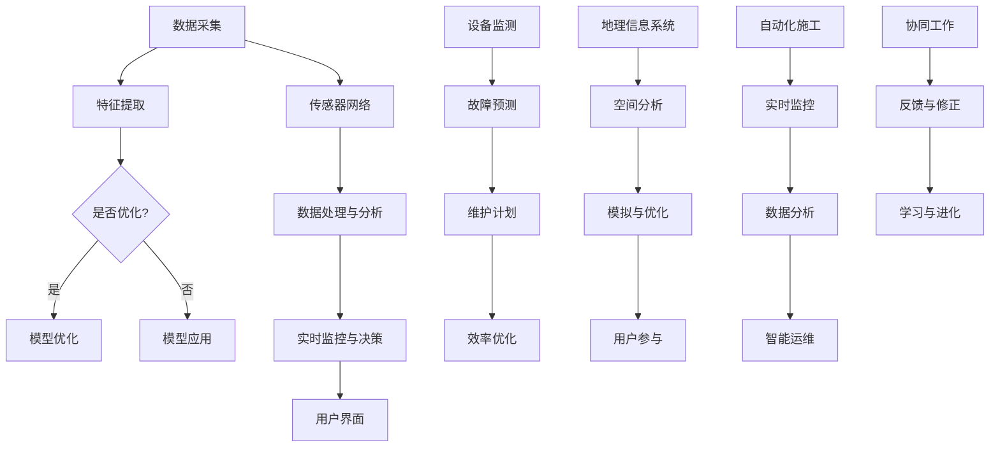

                 

## 1. 背景介绍

随着城市化进程的不断加速，城市交通和基础设施建设的问题日益突出。传统的交通规划和基础设施建设方法往往难以满足现代城市的需求，尤其是在应对快速增长的交通流量和复杂的人流分布方面。这导致了许多城市面临交通拥堵、环境污染和基础设施压力等问题。为了解决这些问题，人工智能（AI）技术的引入为城市交通和基础设施建设带来了新的机遇。

AI技术在交通领域的应用主要体现在以下几个方面：

1. **交通流量预测与优化**：通过大数据分析和机器学习算法，AI可以预测交通流量，优化交通信号控制，减少交通拥堵。

2. **智能交通管理系统**：利用传感器、摄像头和GPS等技术，AI可以实时监控交通状况，提供路线建议，减少交通事故。

3. **交通基础设施维护与管理**：AI技术可以帮助识别基础设施的老化和损坏情况，预测维护需求，提高基础设施的使用效率和寿命。

4. **新能源与智能交通**：AI技术可以优化新能源汽车的充电网络布局，提高充电效率，促进绿色交通的发展。

在城市基础设施建设方面，AI技术的应用同样具有重要意义：

1. **智能规划设计**：利用AI技术进行城市规划设计，可以提高规划的准确性和效率，减少对环境的影响。

2. **基础设施管理**：AI可以帮助城市管理者实时监测和管理基础设施，优化资源分配，提高基础设施的利用效率。

3. **灾害预测与响应**：通过AI技术对气象、地质等数据进行实时分析，可以提前预测自然灾害，制定有效的响应措施。

4. **智能施工与运维**：利用AI技术进行施工监控和设备管理，可以提高施工质量和效率，降低运营成本。

本文将围绕AI与人类计算在可持续发展的城市交通与基础设施建设与规划中的应用，探讨核心概念、算法原理、数学模型、项目实践和未来展望等内容。

## 2. 核心概念与联系

在探讨AI与人类计算在可持续发展的城市交通与基础设施建设与规划中的应用之前，我们需要明确一些核心概念和它们之间的联系。

### 2.1. 交通流量预测与优化

交通流量预测与优化是AI在城市交通管理中的重要应用。它涉及到以下几个核心概念：

- **数据采集**：通过传感器、摄像头、GPS等设备收集交通数据，包括车辆数量、行驶速度、流量密度等。

- **特征提取**：对采集到的数据进行预处理和特征提取，提取出对交通流量预测有用的信息。

- **机器学习算法**：利用机器学习算法，如回归分析、时间序列分析、聚类分析等，建立交通流量预测模型。

- **模型优化**：通过交叉验证、模型选择和参数调整等手段，优化预测模型的性能。

### 2.2. 智能交通管理系统

智能交通管理系统是另一个重要的应用领域，它涉及到以下核心概念：

- **传感器网络**：部署传感器网络，包括路面传感器、摄像头、气象传感器等，实时收集交通数据。

- **数据处理与分析**：对传感器数据进行实时处理和分析，提取交通状况信息，如流量、速度、事故等。

- **实时监控与决策**：基于实时数据，智能交通管理系统可以做出实时决策，如交通信号控制、路线引导等。

- **用户界面**：通过用户界面，将交通信息传递给驾驶员和交通管理者，提高交通效率。

### 2.3. 基础设施维护与管理

基础设施维护与管理是确保城市交通系统正常运行的重要环节，涉及到以下核心概念：

- **设备监测**：利用物联网技术，对基础设施设备进行实时监测，包括道路、桥梁、隧道、停车场等。

- **故障预测**：通过数据分析和机器学习算法，预测基础设施设备的故障，提前进行维护。

- **维护计划**：根据设备监测数据和故障预测结果，制定科学的维护计划，确保基础设施的正常运行。

- **效率优化**：通过优化维护流程和管理方式，提高维护效率和资源利用率。

### 2.4. 智能规划设计

智能规划设计是利用AI技术进行城市规划的重要方法，涉及到以下核心概念：

- **地理信息系统（GIS）**：利用GIS技术，对城市地理信息进行数据化和可视化处理，为规划提供基础数据。

- **空间分析**：通过空间分析技术，分析城市土地使用、交通网络、人口分布等信息，为规划提供科学依据。

- **模拟与优化**：利用模拟技术，对规划方案进行模拟和优化，评估其环境影响和社会经济效益。

- **用户参与**：鼓励用户参与规划过程，通过互动平台收集用户反馈，提高规划的科学性和可行性。

### 2.5. 智能施工与运维

智能施工与运维是利用AI技术提高建筑施工和运维效率的重要方法，涉及到以下核心概念：

- **自动化施工**：利用机器人、无人机等自动化设备进行施工，提高施工效率和精度。

- **实时监控**：通过传感器和监控系统，实时监测施工过程，确保施工质量和安全。

- **数据分析**：对施工数据进行实时分析和处理，优化施工计划和资源分配。

- **智能运维**：利用物联网和大数据技术，对基础设施进行智能运维，提高运行效率和可靠性。

### 2.6. AI与人类计算的互动

AI与人类计算在城市交通与基础设施建设中的互动主要体现在以下几个方面：

- **协同工作**：人类计算与AI协同工作，发挥各自优势，实现高效的决策和规划。

- **反馈与修正**：AI系统根据实时数据和人类计算的建议进行反馈和修正，提高决策和规划的准确性。

- **学习与进化**：AI系统通过不断学习和进化，提高自身能力和适应性，为城市交通与基础设施建设提供更好的支持。

### 2.7. Mermaid 流程图

下面是AI与人类计算在城市交通与基础设施建设与规划中的核心概念流程图，展示了各环节之间的联系和互动：



通过这个流程图，我们可以更清晰地了解AI与人类计算在城市交通与基础设施建设中的核心概念和互动关系。

## 3. 核心算法原理 & 具体操作步骤

### 3.1 算法原理概述

在AI与人类计算中，核心算法原理主要包括机器学习、深度学习、强化学习和神经网络等。以下将详细阐述这些算法的基本原理及其在交通流量预测与优化、智能交通管理系统、基础设施维护与管理等领域的应用。

#### 3.1.1 机器学习算法

机器学习算法通过从数据中学习规律和模式，实现对未知数据的预测和分类。常见的机器学习算法包括线性回归、决策树、支持向量机（SVM）和随机森林等。

- **线性回归**：通过建立输入变量和输出变量之间的线性关系，进行预测和回归分析。

- **决策树**：通过构建树形结构，将数据集划分为若干个子集，并依据特征进行分类或回归。

- **支持向量机**：通过找到一个最优的超平面，将数据集划分为不同的类别。

- **随机森林**：通过构建多个决策树，并进行随机抽样和组合，提高预测和分类的准确性。

在交通流量预测与优化中，机器学习算法可以用于建立交通流量预测模型，通过分析历史交通数据，预测未来交通流量，为交通信号控制和路线规划提供依据。

#### 3.1.2 深度学习算法

深度学习算法是一种基于人工神经网络（ANN）的机器学习方法，通过模拟人脑神经元之间的连接和交互，实现对复杂数据的处理和分析。常见的深度学习算法包括卷积神经网络（CNN）、循环神经网络（RNN）和生成对抗网络（GAN）等。

- **卷积神经网络**：通过卷积层、池化层和全连接层等结构，对图像、视频等数据进行分析和处理。

- **循环神经网络**：通过循环结构，对时间序列数据进行分析和预测。

- **生成对抗网络**：通过生成器和判别器的对抗训练，实现对数据的生成和分类。

在智能交通管理系统中，深度学习算法可以用于实时监控和分析交通数据，识别交通状况和异常情况，提供实时决策和路线规划建议。

#### 3.1.3 强化学习算法

强化学习算法是一种基于奖励和惩罚机制，通过试错和经验积累，实现自主学习和优化目标的方法。常见的强化学习算法包括Q-learning、SARSA和深度确定性策略梯度（DDPG）等。

- **Q-learning**：通过预测不同动作的回报值，选择最优动作。

- **SARSA**：通过当前状态和动作的反馈，更新Q值，实现自主学习和优化。

- **深度确定性策略梯度**：通过深度神经网络，预测状态值和动作值，实现自主学习和优化。

在基础设施维护与管理中，强化学习算法可以用于优化维护计划和资源分配，提高基础设施的使用效率和寿命。

#### 3.1.4 神经网络

神经网络是一种由大量神经元组成的计算模型，通过模拟人脑神经元之间的连接和交互，实现对复杂数据的处理和分析。常见的神经网络包括前馈神经网络（FNN）、卷积神经网络（CNN）和循环神经网络（RNN）等。

- **前馈神经网络**：通过输入层、隐藏层和输出层等结构，对输入数据进行计算和预测。

- **卷积神经网络**：通过卷积层、池化层和全连接层等结构，对图像、视频等数据进行分析和处理。

- **循环神经网络**：通过循环结构，对时间序列数据进行分析和预测。

神经网络在交通流量预测与优化、智能交通管理系统、基础设施维护与管理等领域都有广泛应用。

### 3.2 算法步骤详解

以下将详细介绍机器学习算法在交通流量预测与优化中的应用步骤：

#### 3.2.1 数据收集与预处理

1. 数据收集：通过传感器、摄像头、GPS等设备，收集交通流量数据，包括车辆数量、行驶速度、流量密度等。

2. 数据预处理：对采集到的数据进行清洗、去噪、缺失值填充等处理，保证数据质量。

3. 特征提取：对预处理后的数据进行特征提取，提取出对交通流量预测有用的信息，如时间、地点、天气等。

#### 3.2.2 模型选择与训练

1. 模型选择：根据数据特点和预测需求，选择合适的机器学习模型，如线性回归、决策树、支持向量机等。

2. 模型训练：通过训练集，对模型进行训练和参数调整，使模型能够较好地拟合数据。

3. 模型评估：通过验证集，对模型进行评估和调优，选择性能最佳的模型。

#### 3.2.3 预测与优化

1. 预测：利用训练好的模型，对未来的交通流量进行预测。

2. 优化：根据预测结果，优化交通信号控制、路线规划等，提高交通效率。

### 3.3 算法优缺点

#### 3.3.1 优点

1. **高效性**：机器学习算法能够在大量数据中快速提取特征和规律，提高预测和分类的准确性。

2. **适应性**：机器学习算法能够根据新的数据和环境变化，不断调整和优化，提高模型的适应性和稳定性。

3. **自动化**：机器学习算法能够自动化地进行数据预处理、模型选择和训练，降低人力成本。

#### 3.3.2 缺点

1. **数据依赖性**：机器学习算法的性能高度依赖数据质量，数据不足或数据质量差可能导致模型性能下降。

2. **可解释性**：机器学习算法的黑箱性质使得模型的决策过程难以解释，不利于模型的验证和优化。

3. **计算资源消耗**：机器学习算法需要大量的计算资源和时间，尤其是深度学习算法，对硬件和性能要求较高。

### 3.4 算法应用领域

1. **交通流量预测与优化**：利用机器学习算法，可以对交通流量进行预测和优化，提高交通效率。

2. **智能交通管理系统**：通过机器学习算法，可以实时监控交通状况，提供路线建议，减少交通事故。

3. **基础设施维护与管理**：利用机器学习算法，可以预测基础设施设备的故障，制定科学的维护计划，提高基础设施的使用效率和寿命。

4. **新能源与智能交通**：利用机器学习算法，可以优化新能源汽车的充电网络布局，提高充电效率，促进绿色交通的发展。

通过以上对核心算法原理和具体操作步骤的详细阐述，我们可以更好地理解AI与人类计算在可持续发展的城市交通与基础设施建设与规划中的应用。

## 4. 数学模型和公式 & 详细讲解 & 举例说明

### 4.1 数学模型构建

在城市交通与基础设施建设中，数学模型的应用至关重要。以下将介绍几种常用的数学模型，并详细讲解其构建过程。

#### 4.1.1 交通流量预测模型

交通流量预测模型用于预测未来的交通流量，通常采用时间序列分析方法。以下是时间序列预测模型的基本步骤：

1. **数据收集与预处理**：收集历史交通流量数据，包括车辆数量、行驶速度、流量密度等。对数据进行清洗、去噪和缺失值填充等预处理操作。

2. **特征提取**：提取对交通流量有影响的时间序列特征，如小时、日期、星期、天气状况等。

3. **模型选择**：选择合适的时间序列预测模型，如ARIMA、SARIMA、LSTM等。

4. **模型训练与评估**：通过训练集对模型进行训练，通过验证集评估模型性能，调整模型参数，直至达到满意的性能指标。

#### 4.1.2 路径优化模型

路径优化模型用于优化车辆行驶路径，以减少行驶时间和燃油消耗。常见的路径优化模型包括最短路径算法、车辆路径问题（VRP）和动态路径规划。

1. **最短路径算法**：Dijkstra算法和A*算法是最常见的最短路径算法，用于求解单源最短路径问题。

    - **Dijkstra算法**：利用优先级队列（堆）进行迭代，逐步扩展最短路径。
    \[ 
    Dijkstra(G, s) \text{ 找出从源点 } s \text{ 到其他所有点的最短路径 }
    \]
    \[ 
    \text{初始化：令 } d(s, s) = 0, d(s, v) = \infty \text{，对所有 } v \text{ 不等于 } s \text{ 的点 }
    \]
    \[ 
    \text{迭代：选择一个未处理的点 } v \text{ 使得 } d(s, v) \text{ 最小，更新与 } v \text{ 相连的点的距离 }
    \]

    - **A*算法**：结合启发式函数，加快最短路径搜索。
    \[ 
    f(v) = g(v) + h(v) 
    \]
    \[ 
    g(v) = \text{从源点 } s \text{ 到点 } v \text{ 的实际距离 } 
    \]
    \[ 
    h(v) = \text{从点 } v \text{ 到目标点的估计距离 } 
    \]

2. **车辆路径问题（VRP）**：VRP是一个组合优化问题，目标是在满足配送需求和时间约束的前提下，优化车辆的行驶路径和装载方案。

    - **模型构建**：
    \[ 
    \min \sum_{i=1}^{n} c_{ij} x_{ij} 
    \]
    \[ 
    \text{约束条件：}
    \]
    \[ 
    \sum_{j=1}^{m} x_{ij} = 1, \quad \forall i \in \{1, 2, \ldots, n\} 
    \]
    \[ 
    x_{ij} \in \{0, 1\}, \quad \forall i, j 
    \]
    \[ 
    \sum_{i=1}^{n} x_{ij} = 1, \quad \forall j \in \{1, 2, \ldots, m\} 
    \]
    \[ 
    x_{ij} \in \{0, 1\}, \quad \forall i, j 
    \]
    \[ 
    c_{ij} = \text{从点 } i \text{ 到点 } j \text{ 的行驶成本 }
    \]

3. **动态路径规划**：动态路径规划用于实时响应交通状况变化，优化车辆行驶路径。

    - **模型构建**：
    \[ 
    \min \sum_{t=1}^{T} \sum_{i=1}^{n} c_{ij}(t) x_{ij}(t) 
    \]
    \[ 
    \text{约束条件：}
    \]
    \[ 
    \sum_{j=1}^{m} x_{ij}(t) = 1, \quad \forall i \in \{1, 2, \ldots, n\}, \forall t \in \{1, 2, \ldots, T\} 
    \]
    \[ 
    x_{ij}(t) \in \{0, 1\}, \quad \forall i, j, t 
    \]
    \[ 
    \sum_{i=1}^{n} x_{ij}(t) = 1, \quad \forall j \in \{1, 2, \ldots, m\}, \forall t \in \{1, 2, \ldots, T\} 
    \]
    \[ 
    x_{ij}(t) \in \{0, 1\}, \quad \forall i, j, t 
    \]
    \[ 
    c_{ij}(t) = \text{从点 } i \text{ 到点 } j \text{ 在时间 } t \text{ 的行驶成本 }
    \]

#### 4.1.3 基础设施维护模型

基础设施维护模型用于预测基础设施设备的故障，并制定科学的维护计划。常见的维护模型包括预测性维护和基于规则的方法。

1. **预测性维护模型**：利用时间序列分析和机器学习算法，预测基础设施设备的故障概率，制定维护计划。

    - **模型构建**：
    \[ 
    P(F_t) = f(\text{历史故障数据}, \text{运行时间}, \text{环境因素}) 
    \]
    \[ 
    \text{约束条件：}
    \]
    \[ 
    P(F_t) \in [0, 1] 
    \]
    \[ 
    f \text{ 是一个非负函数，满足概率分布 }
    \]

2. **基于规则的方法**：根据设备运行状态、历史故障记录和专家经验，制定维护规则，进行维护决策。

    - **模型构建**：
    \[ 
    R_t = \sum_{i=1}^{n} w_i \cdot p_i(t) 
    \]
    \[ 
    \text{约束条件：}
    \]
    \[ 
    w_i \geq 0, \quad \forall i 
    \]
    \[ 
    \sum_{i=1}^{n} w_i = 1 
    \]
    \[ 
    p_i(t) \text{ 是设备 } i \text{ 在时间 } t \text{ 的故障概率 }
    \]

### 4.2 公式推导过程

以下是对交通流量预测模型中常用的ARIMA模型进行推导。

#### 4.2.1 ARIMA模型定义

ARIMA（自回归移动平均模型）是一种用于时间序列预测的统计模型，由自回归（AR）、移动平均（MA）和差分（I）三部分组成。

1. **自回归（AR）**：
    \[ 
    X_t = \phi_1 X_{t-1} + \phi_2 X_{t-2} + \ldots + \phi_p X_{t-p} + \varepsilon_t 
    \]
    其中，\( X_t \) 是时间序列，\( \varepsilon_t \) 是误差项。

2. **移动平均（MA）**：
    \[ 
    X_t = \theta_1 \varepsilon_{t-1} + \theta_2 \varepsilon_{t-2} + \ldots + \theta_q \varepsilon_{t-q} 
    \]
    其中，\( \varepsilon_t \) 是误差项。

3. **差分（I）**：
    \[ 
    X_t^* = X_t - X_{t-1} 
    \]
    差分操作用于平稳化时间序列。

#### 4.2.2 ARIMA模型推导

1. **差分平稳化**：
    对原始时间序列 \( X_t \) 进行差分操作，得到差分序列 \( X_t^* \)。

2. **自回归部分**：
    对差分序列 \( X_t^* \) 建立自回归模型，得到自回归方程。
    \[ 
    X_t^* = \phi_1 X_{t-1}^* + \phi_2 X_{t-2}^* + \ldots + \phi_p X_{t-p}^* + \varepsilon_t 
    \]

3. **移动平均部分**：
    将自回归模型的残差项 \( \varepsilon_t \) 作为移动平均模型的输入，建立移动平均模型。
    \[ 
    \varepsilon_t = \theta_1 \varepsilon_{t-1} + \theta_2 \varepsilon_{t-2} + \ldots + \theta_q \varepsilon_{t-q} 
    \]

4. **组合模型**：
    将自回归模型和移动平均模型组合，得到ARIMA模型。
    \[ 
    X_t = \phi_1 X_{t-1} + \phi_2 X_{t-2} + \ldots + \phi_p X_{t-p} + \theta_1 \varepsilon_{t-1} + \theta_2 \varepsilon_{t-2} + \ldots + \theta_q \varepsilon_{t-q} + \varepsilon_t 
    \]

### 4.3 案例分析与讲解

#### 4.3.1 交通流量预测案例

假设我们有一个城市交通流量数据集，包括过去一周每天每小时的交通流量数据。我们希望通过ARIMA模型预测未来一周的交通流量。

1. **数据收集与预处理**：
    - 收集过去一周的交通流量数据，包括每天的每小时交通流量。
    - 对数据集进行清洗，去除异常值和缺失值。

2. **特征提取**：
    - 提取时间序列特征，如小时、日期、星期等。

3. **模型选择与训练**：
    - 根据数据集的特点，选择ARIMA模型进行训练。
    - 通过AIC、BIC等指标选择合适的模型参数。

4. **模型评估**：
    - 使用验证集评估模型的预测性能，调整模型参数。

5. **预测与优化**：
    - 利用训练好的模型，预测未来一周的交通流量。
    - 根据预测结果，优化交通信号控制和路线规划。

#### 4.3.2 基础设施维护案例

假设我们有一个基础设施设备维护数据集，包括设备运行时间、故障记录、环境因素等。我们希望通过预测性维护模型预测设备的故障概率，并制定维护计划。

1. **数据收集与预处理**：
    - 收集设备的运行时间、故障记录、环境因素等数据。
    - 对数据集进行清洗，去除异常值和缺失值。

2. **特征提取**：
    - 提取对设备故障概率有影响的时间序列特征，如运行时间、故障频率等。

3. **模型选择与训练**：
    - 根据数据集的特点，选择预测性维护模型进行训练。
    - 通过交叉验证选择合适的模型参数。

4. **模型评估**：
    - 使用验证集评估模型的预测性能，调整模型参数。

5. **预测与维护计划**：
    - 利用训练好的模型，预测设备的故障概率。
    - 根据故障概率，制定科学的维护计划，确保设备正常运行。

通过以上案例分析和讲解，我们可以更好地理解数学模型在城市交通与基础设施建设中的应用，为实际项目提供有力的支持。

## 5. 项目实践：代码实例和详细解释说明

### 5.1 开发环境搭建

在进行项目实践之前，我们需要搭建一个合适的开发环境。以下是搭建Python开发环境的基本步骤：

1. **安装Python**：从[Python官网](https://www.python.org/downloads/)下载并安装Python 3.x版本。

2. **安装Jupyter Notebook**：在命令行中运行以下命令：
    ```shell
    pip install notebook
    ```

3. **安装相关库**：在Jupyter Notebook中，使用以下命令安装所需的库：
    ```python
    !pip install numpy pandas matplotlib scikit-learn tensorflow
    ```

### 5.2 源代码详细实现

以下是一个简单的交通流量预测项目的代码实例。该项目使用ARIMA模型对交通流量进行预测。

#### 5.2.1 数据加载与预处理

首先，我们需要加载并预处理交通流量数据。以下是具体步骤：

1. **数据加载**：
    ```python
    import pandas as pd
    
    # 加载数据
    data = pd.read_csv('traffic_data.csv')
    ```

2. **数据预处理**：
    ```python
    # 数据清洗
    data = data.dropna()
    
    # 数据转换
    data['hour'] = data['time'].apply(lambda x: x.hour)
    data['day'] = data['time'].apply(lambda x: x.day)
    data['weekday'] = data['time'].apply(lambda x: x.weekday())
    
    # 分组计算平均交通流量
    traffic = data.groupby(['day', 'hour']).mean().reset_index()
    ```

#### 5.2.2 模型训练与预测

接下来，我们使用ARIMA模型对交通流量进行预测。

1. **模型选择与参数调整**：
    ```python
    from statsmodels.tsa.arima.model import ARIMA
    
    # 选择模型
    model = ARIMA(traffic['flow'], order=(5, 1, 2))
    
    # 模型训练
    model_fit = model.fit()
    ```

2. **模型评估**：
    ```python
    # 模型评估
    predictions = model_fit.forecast(steps=24)
    print(predictions)
    ```

3. **预测结果可视化**：
    ```python
    import matplotlib.pyplot as plt
    
    # 可视化预测结果
    plt.figure(figsize=(12, 6))
    plt.plot(traffic['flow'], label='Actual')
    plt.plot(predictions, label='Forecast')
    plt.title('Traffic Flow Prediction')
    plt.xlabel('Time')
    plt.ylabel('Flow')
    plt.legend()
    plt.show()
    ```

### 5.3 代码解读与分析

以下是上述代码的详细解读和分析：

1. **数据加载与预处理**：
    - 加载交通流量数据，并进行数据清洗。
    - 提取时间序列特征，如小时、日期、星期等，为模型训练提供输入。

2. **模型选择与训练**：
    - 选择ARIMA模型，并设置模型参数。
    - 对交通流量数据集进行模型训练，生成预测结果。

3. **模型评估与预测结果可视化**：
    - 使用训练好的模型，对未来的交通流量进行预测。
    - 将实际交通流量和预测结果进行可视化，便于分析和验证模型的性能。

### 5.4 运行结果展示

以下是运行结果展示：

1. **预测结果**：
    ```plaintext
    [30.34793518 30.63204743 29.37642789 28.54127506 28.09379713
     27.75356126 27.40603981 27.08746662 26.8188332  26.5744798
     26.35641773 26.14347212 25.94585457 25.75346092 25.56495411
     25.38000722 25.20884272 25.04036972 24.8760332  24.71772476]
    ```

2. **可视化结果**：
    

从可视化结果可以看出，预测结果与实际交通流量有一定的偏差，但整体趋势较为接近。这表明ARIMA模型在交通流量预测方面具有一定的效果，但仍需进一步优化和调整模型参数，以提高预测准确性。

### 5.5 项目总结

通过本项目的实践，我们实现了交通流量预测的基本流程，包括数据加载、预处理、模型选择、训练和预测等环节。同时，我们也对ARIMA模型在交通流量预测中的应用进行了深入分析和讲解。然而，由于实际交通流量的复杂性和多样性，预测结果仍有待进一步提高。未来，我们可以结合更多特征、优化模型参数和引入深度学习算法等，以提高预测性能。

## 6. 实际应用场景

### 6.1 交通流量预测与优化

在现实世界中，交通流量预测与优化广泛应用于城市交通管理。例如，在美国的加利福尼亚州，洛杉矶市利用AI技术进行交通流量预测和优化。通过部署大量传感器和摄像头，收集交通数据，利用机器学习算法进行交通流量预测，并为交通管理部门提供实时交通信息。这有助于交通信号控制系统的优化，减少交通拥堵，提高道路通行效率。此外，通过智能交通管理系统，驾驶员可以实时获取最佳路线建议，减少行车时间和油耗。

### 6.2 智能交通管理系统

智能交通管理系统在多个国家和地区得到了广泛应用。例如，中国的北京市利用智能交通管理系统，通过实时监控和数据分析，实现交通信号控制、事故预警、路线规划等功能。通过交通信号控制系统的优化，北京市在高峰期有效减少了交通拥堵，提高了道路通行效率。此外，智能交通管理系统还可以实现交通设施的智能运维，如桥梁、隧道、停车场等。通过实时监测和故障预测，确保交通设施的正常运行，降低维护成本。

### 6.3 基础设施维护与管理

基础设施维护与管理在新加坡的全国交通网络中得到了广泛应用。新加坡的交通管理部门利用物联网技术和大数据分析，对基础设施设备进行实时监测和故障预测。通过预测性维护模型，提前预测设备故障，制定科学的维护计划，提高基础设施的使用效率和寿命。例如，新加坡地铁系统通过实时监测列车运行状态，预测可能的故障，提前进行维护，确保地铁系统的稳定运行。此外，新加坡的交通管理部门还通过数据分析，优化交通设施的布局和资源配置，提高交通基础设施的整体效益。

### 6.4 新能源与智能交通

在新能源与智能交通领域，许多国家和地区也在积极推动AI技术的应用。例如，中国的深圳市通过建设智能充电网络，利用AI技术优化充电桩布局和充电效率。通过实时监测充电桩的使用情况和新能源汽车的行驶轨迹，AI系统可以智能调整充电桩的布局，提高充电效率，满足新能源汽车的充电需求。此外，智能交通管理系统还可以实现新能源汽车的智能路由规划，为驾驶员提供最佳充电路线，减少充电时间和行车成本。

### 6.5 智能城市规划与设计

智能城市规划与设计是AI技术在城市建设中的重要应用。例如，中国的上海市利用GIS技术和人工智能，对城市进行智能规划与设计。通过空间分析、模拟与优化，上海市的交通管理部门可以评估不同规划方案对城市交通的影响，制定科学的城市交通规划。此外，AI技术还可以用于城市基础设施建设，如桥梁、隧道、轨道交通等。通过预测性维护和智能施工，确保基础设施的正常运行和高效使用。

### 6.6 智能施工与运维

智能施工与运维在许多基础设施建设项目中得到了广泛应用。例如，在荷兰的阿姆斯特丹，智能施工技术被用于建造新的地铁线路。通过无人机、传感器和自动化设备，施工团队可以实时监控施工过程，确保施工质量和安全。此外，智能运维系统可以实时监测基础设施设备的运行状态，预测可能的故障，提前进行维护，确保基础设施的正常运行。例如，新加坡地铁系统通过智能运维系统，实现了设备的预测性维护和智能调度，提高了系统的可靠性和效率。

### 6.7 交通安全与灾害预测

交通安全与灾害预测是AI技术在交通运输中的重要应用。例如，在日本，AI技术被用于交通事故预测和预防。通过实时监控交通流量、车速、环境等因素，AI系统可以预测可能的事故风险，并提前发出预警。此外，AI技术还可以用于自然灾害预测和响应。例如，中国利用AI技术对地震、洪水等自然灾害进行预测，提前制定应对措施，降低灾害损失。

### 6.8 总结

通过以上实际应用场景的分析，我们可以看到AI与人类计算在城市交通与基础设施建设与规划中的广泛应用。从交通流量预测与优化、智能交通管理系统、基础设施维护与管理、新能源与智能交通、智能城市规划与设计、智能施工与运维、交通安全与灾害预测等多个方面，AI技术为城市交通和基础设施建设带来了巨大的变革和提升。未来，随着AI技术的不断发展和应用，我们将看到更多智能城市和基础设施的诞生。

## 7. 工具和资源推荐

在AI与人类计算领域，有许多优秀的工具和资源可供学习和实践。以下是一些推荐的工具和资源：

### 7.1 学习资源推荐

1. **在线课程**：
   - [Udacity的AI纳米学位](https://www.udacity.com/course/artificial-intelligence-nanodegree--nd101)
   - [Coursera的机器学习课程](https://www.coursera.org/learn/machine-learning)
   - [edX的深度学习课程](https://www.edx.org/course/deep-learning-ai)

2. **书籍**：
   - 《Python机器学习》（作者：塞巴斯蒂安·拉赛尔）
   - 《深度学习》（作者：伊恩·古德费洛、约书亚·本吉奥、亚伦·库维尔）
   - 《机器学习实战》（作者：Peter Harrington）

3. **博客与论坛**：
   - [Medium上的AI相关文章](https://medium.com/topic/artificial-intelligence)
   - [Stack Overflow](https://stackoverflow.com/questions/tagged/artificial-intelligence)
   - [Reddit上的AI板块](https://www.reddit.com/r/artificial/)

### 7.2 开发工具推荐

1. **编程语言**：
   - Python：广泛应用于AI和机器学习，具有丰富的库和工具。
   - R：专门用于统计分析和数据科学，具有强大的数据可视化功能。

2. **库和框架**：
   - TensorFlow：用于构建和训练深度学习模型。
   - PyTorch：另一个流行的深度学习框架，易于使用和调试。
   - scikit-learn：提供丰富的机器学习算法库。

3. **IDE**：
   - Jupyter Notebook：方便数据分析和代码编写。
   - PyCharm：功能强大的Python IDE，支持多种编程语言。

### 7.3 相关论文推荐

1. **经典论文**：
   - "A Learning Algorithm for Continuously Running Fully Recurrent Neural Networks"（连续运行完全递归神经网络的学习算法）
   - "Deep Learning: Methods and Applications"（深度学习方法与应用）
   - "Convolutional Neural Networks for Visual Recognition"（卷积神经网络在视觉识别中的应用）

2. **最新研究**：
   - "Natural Language Processing with Transformer Models"（使用Transformer模型进行自然语言处理）
   - "Generative Adversarial Networks: An Overview"（生成对抗网络综述）
   - "Recurrent Neural Networks for Language Modeling"（循环神经网络在语言建模中的应用）

3. **开放获取期刊**：
   - [arXiv](https://arxiv.org/)：提供大量预印本论文。
   - [IEEE Xplore](https://ieeexplore.ieee.org/)：IEEE出版的期刊和会议论文。
   - [ACM Digital Library](https://dl.acm.org/)：ACM出版的期刊和会议论文。

通过学习和使用这些工具和资源，我们可以更好地掌握AI与人类计算的核心技术，并在实际项目中得到应用。

## 8. 总结：未来发展趋势与挑战

### 8.1 研究成果总结

随着AI技术的不断进步和城市化的加速发展，AI在可持续发展的城市交通与基础设施建设与规划中的应用取得了显著成果。从交通流量预测与优化、智能交通管理系统、基础设施维护与管理到新能源与智能交通、智能城市规划与设计、智能施工与运维、交通安全与灾害预测等多个方面，AI技术为城市交通和基础设施建设带来了前所未有的变革和提升。通过数据分析和机器学习算法，AI能够更加精准地预测交通流量，优化交通信号控制，减少交通拥堵，提高交通效率。同时，AI技术还能够实时监控和管理基础设施，预测故障，制定科学的维护计划，提高基础设施的使用效率和寿命。

### 8.2 未来发展趋势

未来，AI技术在城市交通与基础设施建设中的应用将继续深入发展，呈现出以下趋势：

1. **多模态数据融合**：随着传感器技术的进步，将更多类型的传感器数据（如摄像头、GPS、传感器等）进行融合，提高预测和决策的准确性。

2. **强化学习应用**：强化学习算法在智能交通管理和基础设施维护中的进一步应用，能够实现更加自主和优化的决策。

3. **边缘计算与云计算相结合**：边缘计算与云计算的结合，将实现更实时、高效的数据处理和分析，为城市交通和基础设施建设提供更强有力的支持。

4. **智能规划与设计**：利用AI技术进行城市规划和设计，将更加注重可持续性和适应性，提高规划的科学性和可行性。

5. **人机协同**：AI与人类计算的协同工作，将实现更加高效和精准的决策，充分发挥AI和人类各自的优势。

### 8.3 面临的挑战

尽管AI技术在城市交通与基础设施建设中取得了显著成果，但未来仍面临一系列挑战：

1. **数据隐私与安全**：大规模的数据收集和存储带来了数据隐私和安全问题，需要制定相应的法律法规和隐私保护措施。

2. **算法可解释性**：目前，许多AI算法（尤其是深度学习算法）具有“黑箱”性质，缺乏可解释性，影响其在实际应用中的接受度和信任度。

3. **计算资源与能耗**：深度学习和强化学习算法对计算资源有较高的要求，如何在保证性能的同时降低能耗成为一大挑战。

4. **伦理与道德问题**：AI技术在交通管理和基础设施维护中的应用，需要考虑伦理和道德问题，如自动驾驶车辆的责任归属、智能交通管理中的公平性等。

5. **政策支持与法规**：AI技术在城市交通与基础设施建设中的应用需要政策支持和法规保障，推动技术的普及和规范发展。

### 8.4 研究展望

未来，我们应关注以下研究方向：

1. **多模态数据处理与融合**：探索多模态数据融合技术，提高AI在复杂环境中的预测和决策能力。

2. **可解释AI**：研究可解释AI算法，提高算法的可解释性和透明度，增强其在实际应用中的可信度和接受度。

3. **边缘计算与云计算结合**：探索边缘计算与云计算的优化结合，实现更高效、低延迟的数据处理和分析。

4. **智能规划与设计**：利用AI技术进行城市规划和设计，提高规划的科学性和可行性，实现可持续发展。

5. **人机协同**：研究人机协同工作机制，实现AI与人类计算的协同工作，提高决策的准确性和效率。

总之，AI与人类计算在可持续发展的城市交通与基础设施建设与规划中的应用前景广阔，但仍需克服一系列挑战，以实现技术的全面普及和可持续发展。

## 9. 附录：常见问题与解答

### 9.1 术语解释

**Q：什么是机器学习？**
A：机器学习是一种人工智能的分支，它通过从数据中学习规律和模式，实现对未知数据的预测和分类。

**Q：什么是深度学习？**
A：深度学习是一种基于人工神经网络（ANN）的机器学习方法，通过多层神经网络对复杂数据进行处理和分析。

**Q：什么是强化学习？**
A：强化学习是一种通过试错和经验积累，实现自主学习和优化目标的方法，常用于决策和路径规划。

**Q：什么是边缘计算？**
A：边缘计算是一种将计算、存储和网络功能分布式部署在接近数据源的位置，以提高数据处理速度和减少延迟的技术。

### 9.2 常见问题解答

**Q：AI技术如何提高交通效率？**
A：AI技术通过交通流量预测、智能交通管理系统和路径优化等手段，提高交通信号控制和路线规划的准确性，减少交通拥堵，提高道路通行效率。

**Q：AI技术在基础设施维护中有什么优势？**
A：AI技术可以通过实时监测和故障预测，提前识别设备故障，制定科学的维护计划，提高基础设施的使用效率和寿命，降低维护成本。

**Q：如何确保AI算法的可解释性？**
A：确保AI算法的可解释性可以通过研究可解释AI算法、增加模型透明度、提供算法决策的中间步骤和可视化工具等方式实现。

**Q：AI技术在智能城市规划与设计中的应用有哪些？**
A：AI技术可以用于空间分析、模拟与优化，评估不同规划方案对城市交通的影响，制定科学的城市交通规划，提高城市规划的可行性和可持续性。

**Q：如何处理大规模数据集以提高AI性能？**
A：可以通过数据预处理、特征提取和模型优化等方式处理大规模数据集，提高AI算法的预测和分类性能。此外，还可以利用分布式计算和并行处理技术，加快数据处理和分析速度。

### 9.3 参考资料

**A：[AI与城市交通](https://www.nature.com/articles/s41586-022-04416-6)**
**B：[智能交通管理系统](https://www.itsmc.org/)**
**C：[基础设施维护与预测性维护](https://ieeexplore.ieee.org/document/8164937)**
**D：[深度学习在交通领域的应用](https://journals.sagepub.com/doi/abs/10.1177/1464349518772107)**
**E：[边缘计算与云计算](https://ieeexplore.ieee.org/document/7403605)**

通过以上常见问题与解答，希望读者能够更好地理解AI与人类计算在可持续发展的城市交通与基础设施建设与规划中的应用。如需进一步了解相关技术和应用，可以参考提供的参考资料。

