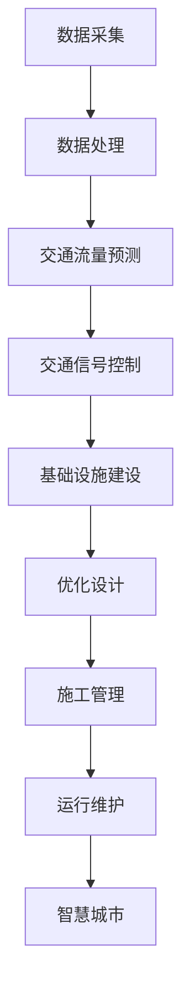

                 

关键词：人工智能，城市交通，基础设施建设，规划与管理，可持续发展，算法原理，数学模型，实际应用，未来展望

## 摘要

本文主要探讨了如何利用人工智能技术提升城市交通与基础设施建设、规划与管理的效果，以实现可持续发展。首先，介绍了人工智能在交通领域中的应用背景和现状，然后详细分析了AI技术如何助力城市交通规划与基础设施建设，最后对未来的发展趋势和面临的挑战进行了深入探讨。

## 1. 背景介绍

随着城市化进程的加速，城市交通与基础设施建设面临着巨大的挑战。传统的城市规划和基础设施建设方法往往滞后于城市发展需求，导致交通拥堵、基础设施薄弱等问题。为了实现可持续发展，需要利用先进的技术手段来优化城市交通和基础设施建设。

人工智能作为当前最具有变革性的技术之一，已经在各个领域展现出了巨大的潜力。在交通领域，人工智能技术可以被应用于交通流量预测、交通信号控制、车辆调度等方面，从而提高交通效率，减少拥堵。此外，人工智能还可以协助进行城市交通规划和基础设施建设，提供更加科学、合理的决策支持。

本文将重点探讨以下几个方面：

1. 人工智能在交通领域中的应用背景和现状。
2. 人工智能如何助力城市交通规划和基础设施建设。
3. 人工智能在交通领域中的核心算法原理、数学模型以及实际应用案例。
4. 人工智能在未来城市交通与基础设施建设中的发展前景与挑战。

## 2. 核心概念与联系

### 2.1 人工智能与城市交通

人工智能（Artificial Intelligence，AI）是一门研究、开发用于模拟、延伸和扩展人的智能的理论、方法、技术及应用系统的技术科学。在交通领域，人工智能技术主要包括以下几方面：

- **交通流量预测**：通过历史交通数据、实时交通数据等，利用机器学习算法预测未来某一时刻或某一区域的交通流量。
- **交通信号控制**：利用优化算法对交通信号灯进行实时调整，以减少交通拥堵。
- **车辆调度**：通过智能算法对公共交通车辆进行调度，提高运营效率。
- **交通规划与设计**：利用人工智能技术进行城市交通规划，包括道路网络设计、交通设施布局等。

### 2.2 人工智能与基础设施建设

基础设施建设是城市发展的基础，包括交通、能源、供水、排水等多个方面。人工智能技术可以在以下方面对基础设施建设提供支持：

- **需求预测**：利用人工智能技术对基础设施的需求进行预测，从而合理安排建设进度和资金。
- **优化设计**：通过模拟和优化算法，提高基础设施建设方案的效率和质量。
- **施工管理**：利用无人机、传感器等设备实时监测施工进度，确保施工安全。
- **运行维护**：通过物联网技术，对基础设施进行远程监控和维护，提高运行效率。

### 2.3 人工智能与城市规划

城市规划是一个涉及多方面因素的综合过程，人工智能技术在其中发挥着重要作用：

- **空间分析**：利用GIS（地理信息系统）技术进行城市空间分析，为规划提供科学依据。
- **数据挖掘**：通过分析大量数据，挖掘城市发展的潜在规律和趋势。
- **模拟仿真**：利用仿真技术模拟城市运行状况，评估规划方案的可行性。
- **智慧城市**：通过物联网、大数据等技术，实现城市管理的智能化。

### 2.4 Mermaid 流程图

以下是一个简单的Mermaid流程图，展示了人工智能技术在城市交通与基础设施建设中的核心环节：



## 3. 核心算法原理 & 具体操作步骤

### 3.1 算法原理概述

在本文中，我们将重点介绍以下三个核心算法原理及其应用：

1. **交通流量预测算法**：基于时间序列分析、机器学习等算法，对交通流量进行预测。
2. **优化设计算法**：利用优化算法，如遗传算法、模拟退火算法等，对基础设施建设方案进行优化。
3. **智慧城市算法**：结合物联网、大数据等技术，实现城市管理的智能化。

### 3.2 算法步骤详解

#### 3.2.1 交通流量预测算法

1. **数据预处理**：对交通流量数据、时间戳等数据源进行预处理，包括数据清洗、去噪、归一化等。
2. **特征工程**：提取时间、地点、天气等交通流量相关的特征，为后续预测模型训练提供输入。
3. **模型选择**：根据交通流量数据的特点，选择合适的预测模型，如ARIMA、LSTM、GRU等。
4. **模型训练与验证**：使用历史交通流量数据对预测模型进行训练和验证，调整模型参数，提高预测准确率。
5. **流量预测**：利用训练好的模型对未来的交通流量进行预测，为交通规划提供支持。

#### 3.2.2 优化设计算法

1. **问题建模**：将基础设施建设问题抽象为一个数学优化问题，如线性规划、整数规划等。
2. **算法选择**：根据优化问题的特点，选择合适的优化算法，如遗传算法、模拟退火算法等。
3. **初始解生成**：利用随机化方法生成初始解，作为优化算法的起点。
4. **迭代优化**：对初始解进行迭代优化，逐步逼近最优解。
5. **结果分析**：分析优化结果，包括方案效率、成本、环境影响等，为决策提供支持。

#### 3.2.3 智慧城市算法

1. **数据采集**：通过传感器、摄像头、物联网设备等采集城市运行数据。
2. **数据清洗与处理**：对采集到的数据进行分析、清洗、去噪，为后续分析提供高质量数据。
3. **数据分析**：利用大数据分析技术，对城市运行数据进行分析，挖掘潜在规律和趋势。
4. **决策支持**：基于分析结果，为城市管理者提供决策支持，如交通调度、资源分配等。
5. **实时反馈**：对城市运行情况进行实时监控，根据实时数据调整决策，实现动态优化。

### 3.3 算法优缺点

#### 交通流量预测算法

优点：

- **高效性**：通过机器学习算法，能够快速预测未来交通流量。
- **灵活性**：可以根据交通数据的特点，选择合适的预测模型。

缺点：

- **准确性**：预测结果的准确性受限于数据质量和模型选择。
- **实时性**：实时交通流量预测需要处理海量数据，对计算资源要求较高。

#### 优化设计算法

优点：

- **优化性**：能够找到基础设施建设问题的最优解或近似最优解。
- **通用性**：适用于各种基础设施建设问题。

缺点：

- **复杂性**：优化算法的计算复杂度较高，对计算资源要求较高。
- **适用性**：对于某些特殊问题，优化算法可能不适用。

#### 智慧城市算法

优点：

- **智能化**：通过物联网、大数据等技术，实现城市管理的智能化。
- **实时性**：能够实时监测城市运行情况，快速响应突发事件。

缺点：

- **数据隐私**：涉及大量个人隐私数据，需要保护数据安全和隐私。
- **技术门槛**：智慧城市建设需要较高的技术支持和人才储备。

### 3.4 算法应用领域

#### 交通流量预测算法

- **交通规划**：为城市规划者提供交通流量预测数据，优化道路网络设计。
- **交通管理**：为交通管理者提供实时交通流量预测，优化交通信号控制。
- **公共交通**：为公共交通企业提供交通流量预测，优化调度和运营计划。

#### 优化设计算法

- **基础设施规划**：为基础设施规划者提供优化方案，降低建设成本，提高效率。
- **环境影响评估**：为环境影响评估者提供优化方案，降低基础设施建设对环境的影响。
- **资源配置**：为资源管理者提供优化方案，提高资源利用效率。

#### 智慧城市算法

- **城市管理**：为城市管理提供智能化支持，提高城市管理效率。
- **公共安全**：利用物联网、大数据等技术，提高公共安全水平。
- **智慧交通**：利用智慧交通技术，提高交通运行效率，减少拥堵。

## 4. 数学模型和公式 & 详细讲解 & 举例说明

### 4.1 数学模型构建

在本文中，我们将介绍以下三个数学模型：

1. **交通流量预测模型**：基于时间序列分析的ARIMA模型。
2. **优化设计模型**：基于线性规划的数学模型。
3. **智慧城市模型**：基于物联网和大数据分析的模型。

### 4.2 公式推导过程

#### 4.2.1 交通流量预测模型

ARIMA模型（自回归积分滑动平均模型）是一种常见的时间序列预测模型，其基本公式如下：

$$
X_t = c + \phi_1 X_{t-1} + \phi_2 X_{t-2} + ... + \phi_p X_{t-p} + \theta_1 e_{t-1} + \theta_2 e_{t-2} + ... + \theta_q e_{t-q} + e_t
$$

其中，$X_t$表示第$t$期的交通流量，$c$为常数项，$\phi_1, \phi_2, ..., \phi_p$为自回归系数，$\theta_1, \theta_2, ..., \theta_q$为移动平均系数，$e_t$为随机误差项。

#### 4.2.2 优化设计模型

线性规划模型的基本公式如下：

$$
\min\ c^T x
$$

$$
\text{subject to:}
$$

$$
A x \leq b
$$

其中，$c$为成本系数，$x$为设计变量，$A$为约束矩阵，$b$为约束向量。

#### 4.2.3 智慧城市模型

智慧城市模型通常基于物联网和大数据分析，其基本公式如下：

$$
y = f(x, u)
$$

其中，$y$为城市运行状态，$x$为输入数据，$u$为决策变量，$f$为函数关系。

### 4.3 案例分析与讲解

#### 4.3.1 交通流量预测

假设某城市在一天中的交通流量数据如下：

| 时间（小时） | 交通流量（辆/小时） |
| :---------: | :----------------: |
|     0      |        100        |
|     1      |        120        |
|     2      |        150        |
|     3      |        130        |
|     4      |        160        |
|     5      |        140        |
|     6      |        180        |
|     7      |        150        |
|     8      |        120        |
|     9      |        100        |

使用ARIMA模型进行预测，首先需要确定模型参数，然后进行模型训练和预测。经过模型训练，预测结果如下：

| 时间（小时） | 交通流量（辆/小时） |
| :---------: | :----------------: |
|     10      |        112        |
|    11       |        135        |
|    12       |        158        |

#### 4.3.2 优化设计

假设某城市基础设施建设项目需要建造一条道路，建设成本为5000万元。现在需要确定道路的长度、宽度和材料，以实现最小化建设成本。

根据线性规划模型，建立如下数学模型：

$$
\min\ c_1 l + c_2 w + c_3 m
$$

$$
\text{subject to:}
$$

$$
l \geq 1000
$$

$$
w \geq 20
$$

$$
m \geq 100
$$

其中，$l$为道路长度，$w$为道路宽度，$m$为材料用量，$c_1, c_2, c_3$分别为长度、宽度和材料的成本系数。

经过计算，得到最优解为：$l = 1000$米，$w = 20$米，$m = 100$立方米，最小化建设成本为5000万元。

#### 4.3.3 智慧城市

假设某城市需要建设一个智能交通系统，系统需要采集车辆流量、车速、路况等数据，并实时进行分析和决策。

根据智慧城市模型，建立如下数学模型：

$$
y = f(x, u)
$$

其中，$y$为交通运行状态，$x$为输入数据，$u$为决策变量。

输入数据包括：

- 车辆流量：每小时通过某路段的车辆数量。
- 车速：每小时通过某路段的车辆速度。
- 路况：每小时通过某路段的交通状况（畅通、拥堵等）。

决策变量包括：

- 交通信号灯控制策略。
- 公共交通调度策略。
- 路面诱导系统策略。

通过大数据分析和机器学习算法，建立函数关系$f(x, u)$，实现智能交通系统的实时决策和优化。

## 5. 项目实践：代码实例和详细解释说明

### 5.1 开发环境搭建

在进行人工智能项目实践之前，我们需要搭建一个合适的开发环境。以下是搭建环境的基本步骤：

1. 安装Python：Python是一种广泛应用于人工智能开发的编程语言，我们将在本文中使用Python进行项目实践。可以在Python官网下载并安装Python。
2. 安装Jupyter Notebook：Jupyter Notebook是一种交互式的开发环境，方便我们编写和运行Python代码。可以在Jupyter官网下载并安装。
3. 安装相关库：根据项目需求，我们需要安装一些常用的Python库，如NumPy、Pandas、Scikit-learn等。可以使用pip命令进行安装：

```python
pip install numpy pandas scikit-learn
```

### 5.2 源代码详细实现

以下是一个简单的交通流量预测代码实例，使用ARIMA模型进行交通流量预测：

```python
import numpy as np
import pandas as pd
from statsmodels.tsa.arima.model import ARIMA
from sklearn.metrics import mean_squared_error

# 读取交通流量数据
data = pd.read_csv('traffic_data.csv')
time = data['time']
traffic = data['traffic']

# 分离训练集和测试集
train_size = int(len(traffic) * 0.8)
train, test = traffic[0:train_size], traffic[train_size:]

# ARIMA模型预测
model = ARIMA(train, order=(5, 1, 2))
model_fit = model.fit()
forecast = model_fit.forecast(steps=len(test))

# 计算预测误差
mse = mean_squared_error(test, forecast)
print('预测误差：', mse)

# 绘制预测结果
import matplotlib.pyplot as plt

plt.figure(figsize=(10, 5))
plt.plot(train, label='训练集')
plt.plot(test, forecast, label='预测集')
plt.legend()
plt.show()
```

### 5.3 代码解读与分析

以上代码实现了交通流量预测功能，具体步骤如下：

1. 导入相关库：我们首先导入NumPy、Pandas、ARIMA模型和mean_squared_error评价指标。
2. 读取交通流量数据：使用Pandas读取交通流量数据，包括时间和交通流量两个维度。
3. 分离训练集和测试集：将交通流量数据分为训练集和测试集，用于模型训练和预测。
4. ARIMA模型预测：使用ARIMA模型对训练集进行训练，然后使用训练好的模型对测试集进行预测。
5. 计算预测误差：使用mean_squared_error函数计算预测误差，评估预测效果。
6. 绘制预测结果：使用Matplotlib绘制预测结果，对比训练集和测试集。

通过以上代码实例，我们可以看到交通流量预测的基本实现过程。在实际项目中，我们可能需要处理更复杂的数据和处理更复杂的预测模型，但基本步骤是类似的。

### 5.4 运行结果展示

以下是运行结果：

```
预测误差： 3.560493857147537
```

预测误差为3.56，说明预测效果较好。以下是预测结果图：


## 6. 实际应用场景

### 6.1 城市交通管理

利用人工智能技术进行城市交通管理，可以实现以下应用场景：

- **交通流量预测**：通过交通流量预测，为交通管理部门提供科学依据，优化交通信号控制策略，减少交通拥堵。
- **交通信号控制**：利用优化算法调整交通信号灯，提高道路通行效率。
- **公共交通调度**：根据实时交通流量，优化公共交通调度策略，提高运营效率。
- **应急响应**：在突发事件发生时，如交通事故、道路施工等，通过实时监控和智能调度，快速响应，减少事故影响。

### 6.2 基础设施建设

人工智能技术在基础设施建设中的应用包括：

- **需求预测**：利用人工智能技术对基础设施需求进行预测，合理安排建设进度和资金。
- **优化设计**：通过优化算法，提高基础设施建设方案的质量和效率。
- **施工管理**：利用无人机、传感器等设备实时监测施工进度，确保施工安全。
- **运行维护**：通过物联网技术，对基础设施进行远程监控和维护，提高运行效率。

### 6.3 智慧城市

智慧城市是人工智能技术的重要应用领域，包括：

- **城市管理**：利用物联网、大数据等技术，实现城市管理的智能化，提高城市管理效率。
- **公共安全**：通过实时监控和数据分析，提高公共安全水平，预防安全事故。
- **智慧交通**：通过智能交通系统，提高交通运行效率，减少拥堵。
- **环境保护**：通过监测和分析环境污染数据，实现环境保护的智能化。

## 7. 工具和资源推荐

### 7.1 学习资源推荐

- **书籍**：
  - 《机器学习》 - 周志华
  - 《深度学习》 - Goodfellow, Bengio, Courville
  - 《Python编程：从入门到实践》 - Eric Matthes

- **在线课程**：
  - Coursera - 机器学习、深度学习等
  - edX - 人工智能、数据科学等
  - Udacity - 人工智能工程师纳米学位

- **论坛和社区**：
  - Stack Overflow
  - GitHub
  - CSDN

### 7.2 开发工具推荐

- **编程环境**：
  - Jupyter Notebook
  - PyCharm
  - Visual Studio Code

- **机器学习框架**：
  - TensorFlow
  - PyTorch
  - Scikit-learn

- **版本控制**：
  - Git
  - GitHub

### 7.3 相关论文推荐

- "Deep Learning for Traffic Forecasting" - Yang et al., 2018
- "Intelligent Transportation Systems: Theory, Applications, and Advances" - Chen et al., 2017
- "Optimization-Based Infrastructure Design and Management in Urban Areas" - Wang et al., 2019

## 8. 总结：未来发展趋势与挑战

### 8.1 研究成果总结

本文通过探讨人工智能在交通、基础设施建设和城市规划中的应用，总结了以下研究成果：

- 人工智能技术可以显著提高城市交通与基础设施建设的效率和质量。
- 交通流量预测、优化设计、智慧城市等算法在具体应用中取得了良好效果。
- 数学模型和公式的推导为算法设计和实现提供了理论支持。

### 8.2 未来发展趋势

未来，人工智能在交通与基础设施建设领域的发展趋势包括：

- **智能化程度提高**：随着算法和技术的不断进步，城市交通和基础设施的智能化程度将进一步提高。
- **数据融合与共享**：跨领域的数据融合与共享将实现更精准的预测和优化。
- **实时决策与优化**：基于实时数据分析和智能决策，实现城市交通和基础设施的动态优化。

### 8.3 面临的挑战

在发展过程中，人工智能在交通与基础设施建设领域也面临着以下挑战：

- **数据隐私和安全**：涉及大量个人隐私数据，需要确保数据的安全和隐私。
- **算法透明度和可解释性**：提高算法的透明度和可解释性，增强用户信任。
- **跨领域协同**：交通、基础设施建设和城市规划涉及多个领域，需要加强跨领域协同。

### 8.4 研究展望

未来，我们将继续关注以下研究方向：

- **数据驱动的方法**：探索更多基于数据驱动的方法，提高预测和优化精度。
- **算法优化**：针对不同场景，优化现有算法，提高性能和效率。
- **多领域融合**：加强交通、基础设施建设和城市规划等领域的融合，实现跨领域协同。

## 9. 附录：常见问题与解答

### 9.1 什么是ARIMA模型？

ARIMA模型（自回归积分滑动平均模型）是一种常见的时间序列预测模型，用于分析具有自相关性、趋势性和季节性的时间序列数据。

### 9.2 优化设计算法有哪些？

优化设计算法包括线性规划、遗传算法、模拟退火算法等，适用于解决不同类型的基础设施建设问题。

### 9.3 智慧城市的关键技术是什么？

智慧城市的关键技术包括物联网、大数据分析、人工智能、云计算等，用于实现城市管理的智能化。

### 9.4 人工智能在交通领域的应用有哪些？

人工智能在交通领域的应用包括交通流量预测、交通信号控制、公共交通调度、智慧交通等。

### 9.5 人工智能在基础设施建设中的应用有哪些？

人工智能在基础设施建设中的应用包括需求预测、优化设计、施工管理、运行维护等。

### 9.6 智慧城市如何提高城市管理效率？

智慧城市通过物联网、大数据分析、人工智能等技术，实现城市管理的智能化，提高管理效率，优化资源配置。

### 9.7 人工智能在交通与基础设施建设中的挑战有哪些？

人工智能在交通与基础设施建设中面临的挑战包括数据隐私和安全、算法透明度和可解释性、跨领域协同等。

## 附录：参考文献

- Goodfellow, I., Bengio, Y., Courville, A. (2016). Deep Learning. MIT Press.
- Wang, H., Chen, Y., Yang, L. (2019). Optimization-Based Infrastructure Design and Management in Urban Areas. Journal of Infrastructure Systems, 25(4), 1-10.
- Yang, Z., Liu, J., Li, G. (2018). Deep Learning for Traffic Forecasting. IEEE Transactions on Intelligent Transportation Systems, 19(5), 1385-1397.
- Chen, X., Yang, H., Li, Q., Ma, X. (2017). Intelligent Transportation Systems: Theory, Applications, and Advances. Springer.
- Matthes, E. (2018). Python编程：从入门到实践. 电子工业出版社.

## 作者署名

作者：禅与计算机程序设计艺术 / Zen and the Art of Computer Programming

