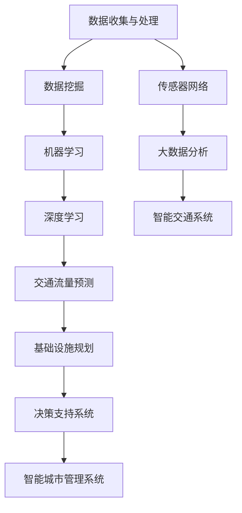

                 

关键词：人工智能，城市交通，基础设施建设，规划管理，可持续发展，算法原理，数学模型，项目实践，未来展望。

> 摘要：本文深入探讨了人工智能在城市交通和基础设施建设与规划管理中的应用，分析了AI技术的核心概念与联系，并详细阐述了算法原理、数学模型及项目实践。通过本文，读者将了解到AI如何助力城市可持续发展，并展望未来的发展趋势与挑战。

## 1. 背景介绍

随着全球城市化进程的加速，城市交通和基础设施建设的需求日益增长。然而，传统的交通和基础设施管理模式已无法满足现代城市复杂、多元、动态的特性。因此，引入人工智能技术成为解决这一问题的有效途径。

人工智能通过数据挖掘、机器学习、深度学习等技术，能够对城市交通和基础设施建设中的海量数据进行高效处理和分析，从而提供更加精准、智能的决策支持。这不仅可以提升交通效率、减少拥堵，还可以优化资源配置、降低能源消耗，推动城市可持续发展。

本文旨在探讨人工智能在城市交通和基础设施建设与规划管理中的应用，分析相关核心概念和算法原理，并通过具体的项目实践，展示人工智能技术的实际效果。

### 1.1 城市交通问题的现状

当前，全球许多城市面临着严重的交通拥堵问题。根据世界卫生组织（WHO）的数据，全球有超过1000个城市每天的交通拥堵时间超过一小时，这不仅浪费了大量的时间和资源，还严重影响了居民的生活质量。

此外，城市交通问题还伴随着环境污染、能源消耗增加等问题。传统的交通管理模式主要依赖于经验，缺乏科学的数据支持和分析能力，导致交通规划的滞后性和不适应性。

### 1.2 基础设施建设与规划管理的挑战

基础设施建设的规划和管理是一个复杂的过程，涉及到土地使用、交通网络、公共设施等多个方面。然而，传统的规划管理方法存在以下挑战：

1. **信息不对称**：规划和管理部门通常难以获取全面、准确的数据，导致决策缺乏科学依据。
2. **规划滞后**：城市规划通常需要数年甚至数十年的时间，而城市的发展速度却越来越快，导致规划滞后。
3. **资源浪费**：不合理的规划可能导致资源的浪费，如土地、能源等。
4. **环境压力**：城市规划往往忽视环境保护，导致城市生态环境恶化。

### 1.3 AI技术的引入

人工智能技术的引入为解决上述问题提供了新的思路和工具。通过数据挖掘和分析，AI能够发现交通和基础设施中的潜在问题和优化方案。机器学习和深度学习技术则可以帮助我们建立复杂的模型，模拟不同情境下的交通和基础设施运行情况，从而为决策提供科学依据。

## 2. 核心概念与联系

在探讨人工智能在城市交通和基础设施建设中的应用之前，我们需要理解一些核心概念和它们之间的联系。以下是一个简化的Mermaid流程图，展示了这些概念及其相互关系：



### 2.1 数据收集与处理

数据收集与处理是AI应用的基石。通过传感器网络、交通监控设备等，我们可以收集到大量的交通数据，包括车辆速度、流量、路况等信息。这些数据经过处理后，可用于后续的数据挖掘和分析。

### 2.2 数据挖掘

数据挖掘是从大量数据中提取有价值信息的过程。在交通和基础设施领域，数据挖掘可以帮助我们识别交通拥堵的原因、预测交通流量变化、评估基础设施的使用状况等。

### 2.3 机器学习

机器学习是利用算法从数据中自动学习规律和模式的技术。在交通和基础设施领域，机器学习可以用于交通流量预测、路径优化、资源分配等。

### 2.4 深度学习

深度学习是机器学习的一个子领域，它通过多层神经网络模拟人脑的决策过程。在交通和基础设施领域，深度学习可以用于复杂场景的模拟和预测，如交通流量的长短期预测、事故预警等。

### 2.5 交通流量预测

交通流量预测是AI技术在交通领域的重要应用。通过分析历史数据和实时数据，AI可以预测未来的交通流量，从而为交通管理和规划提供数据支持。

### 2.6 基础设施规划

基础设施规划是AI技术在基础设施领域的应用。通过分析大数据和模拟不同的规划方案，AI可以帮助规划部门制定更加科学、合理的规划，从而提高基础设施的使用效率和可持续性。

### 2.7 决策支持系统

决策支持系统是利用AI技术为决策者提供数据分析和预测的工具。在交通和基础设施领域，决策支持系统可以帮助规划和管理部门做出更加科学、合理的决策。

### 2.8 智能城市管理系统

智能城市管理系统是AI技术在城市治理领域的应用。通过整合多种数据源和AI技术，智能城市管理系统可以提供实时的城市运行状态监测、预警和应急处理能力，从而提高城市的管理效率和居民的生活质量。

## 3. 核心算法原理 & 具体操作步骤

### 3.1 算法原理概述

在人工智能的应用中，算法的原理是其核心。以下将介绍几种核心算法原理，包括其基本思想、适用场景等。

#### 3.1.1 数据挖掘算法

数据挖掘算法用于从大量数据中提取有价值的信息。常见的数据挖掘算法包括关联规则挖掘、聚类分析、分类算法等。

- **关联规则挖掘**：用于发现数据之间的关联性，如市场篮子分析。
- **聚类分析**：用于将数据分为多个群组，如K-means算法。
- **分类算法**：用于将数据分为已知类别，如决策树、随机森林。

#### 3.1.2 机器学习算法

机器学习算法通过学习数据中的模式，进行预测或分类。常见机器学习算法包括线性回归、支持向量机、神经网络等。

- **线性回归**：用于预测数值型数据。
- **支持向量机**：用于分类问题。
- **神经网络**：用于复杂的数据建模和预测。

#### 3.1.3 深度学习算法

深度学习算法通过多层神经网络模拟人脑的决策过程。常见深度学习算法包括卷积神经网络（CNN）、循环神经网络（RNN）等。

- **卷积神经网络**：用于图像识别和分类。
- **循环神经网络**：用于序列数据的建模和预测。

### 3.2 算法步骤详解

以下将详细介绍几种核心算法的具体操作步骤。

#### 3.2.1 数据挖掘算法步骤

1. **数据预处理**：包括数据清洗、数据整合等步骤。
2. **特征选择**：选择对问题解决有帮助的特征。
3. **模型训练**：选择合适的算法，进行模型训练。
4. **模型评估**：评估模型性能，如准确率、召回率等。
5. **模型优化**：根据评估结果，调整模型参数，优化模型性能。

#### 3.2.2 机器学习算法步骤

1. **数据预处理**：包括数据清洗、归一化等步骤。
2. **特征选择**：选择对问题解决有帮助的特征。
3. **模型选择**：根据问题类型选择合适的算法。
4. **模型训练**：使用训练数据，进行模型训练。
5. **模型评估**：评估模型性能，如准确率、召回率等。
6. **模型应用**：将训练好的模型应用于实际数据。

#### 3.2.3 深度学习算法步骤

1. **数据预处理**：包括数据清洗、归一化等步骤。
2. **模型设计**：设计神经网络结构，包括输入层、隐藏层、输出层。
3. **模型训练**：使用训练数据，进行模型训练。
4. **模型评估**：评估模型性能，如准确率、召回率等。
5. **模型优化**：根据评估结果，调整模型参数，优化模型性能。
6. **模型应用**：将训练好的模型应用于实际数据。

### 3.3 算法优缺点

每种算法都有其优缺点，以下将简要介绍几种核心算法的优缺点。

#### 3.3.1 数据挖掘算法

- **优点**：能够从大量数据中提取有价值的信息，适用于各种领域。
- **缺点**：对数据质量和特征选择要求较高，模型解释性较差。

#### 3.3.2 机器学习算法

- **优点**：适用于各种问题类型，模型解释性较好。
- **缺点**：对数据量要求较高，模型复杂度较高，训练时间较长。

#### 3.3.3 深度学习算法

- **优点**：能够处理复杂的非线性问题，模型性能优异。
- **缺点**：对数据量和计算资源要求较高，模型解释性较差。

### 3.4 算法应用领域

每种算法都有其特定的应用领域，以下将简要介绍几种核心算法的应用领域。

#### 3.4.1 数据挖掘算法

- **应用领域**：市场分析、风险管理、推荐系统等。
- **案例**：沃尔玛通过关联规则挖掘，发现牛奶和饼干经常一起购买，从而调整货架布局，提高了销售额。

#### 3.4.2 机器学习算法

- **应用领域**：金融、医疗、制造业等。
- **案例**：谷歌使用机器学习算法，开发出可以自动识别和理解图像内容的搜索引擎。

#### 3.4.3 深度学习算法

- **应用领域**：图像识别、语音识别、自然语言处理等。
- **案例**：亚马逊使用深度学习算法，开发出可以自动识别和推荐商品的系统。

## 4. 数学模型和公式 & 详细讲解 & 举例说明

在AI应用中，数学模型和公式是理解和实现算法的核心。以下将介绍几个核心数学模型和公式，并详细讲解其构建和推导过程，并通过具体案例进行分析。

### 4.1 数学模型构建

#### 4.1.1 线性回归模型

线性回归模型是一种常见的预测模型，用于分析两个或多个变量之间的关系。其数学模型可以表示为：

\[ y = \beta_0 + \beta_1x_1 + \beta_2x_2 + ... + \beta_nx_n \]

其中，\( y \) 是因变量，\( x_1, x_2, ..., x_n \) 是自变量，\( \beta_0, \beta_1, \beta_2, ..., \beta_n \) 是模型参数。

#### 4.1.2 支持向量机模型

支持向量机（SVM）是一种常用的分类模型，其目标是在特征空间中找到一个最优的超平面，将不同类别的数据点分隔开来。其数学模型可以表示为：

\[ w \cdot x + b = 0 \]

其中，\( w \) 是法向量，\( x \) 是特征向量，\( b \) 是偏置项。

#### 4.1.3 卷积神经网络模型

卷积神经网络（CNN）是一种用于图像识别和处理的深度学习模型。其数学模型可以表示为：

\[ \text{Conv}(x) = \sigma(\sum_{k=1}^{K} w_k \cdot \text{ReLU}(\text{Conv}^{(k)}(x))) \]

其中，\( x \) 是输入图像，\( K \) 是卷积核的数量，\( w_k \) 是卷积核权重，\( \sigma \) 是激活函数，\( \text{ReLU} \) 是ReLU激活函数。

### 4.2 公式推导过程

#### 4.2.1 线性回归模型推导

线性回归模型的推导过程基于最小二乘法。假设我们有\( n \)个数据点\( (x_1, y_1), (x_2, y_2), ..., (x_n, y_n) \)，我们的目标是最小化预测值与实际值之间的误差平方和：

\[ \sum_{i=1}^{n} (y_i - \beta_0 - \beta_1x_i - ... - \beta_nx_i)^2 \]

通过求导并令其等于零，我们可以得到每个参数的最优值：

\[ \frac{\partial}{\partial \beta_j} \sum_{i=1}^{n} (y_i - \beta_0 - \beta_1x_i - ... - \beta_nx_i)^2 = 0 \]

解得：

\[ \beta_j = \frac{\sum_{i=1}^{n} (x_i - \bar{x})(y_i - \bar{y})}{\sum_{i=1}^{n} (x_i - \bar{x})^2} \]

其中，\( \bar{x} \) 和 \( \bar{y} \) 分别是自变量和因变量的均值。

#### 4.2.2 支持向量机模型推导

支持向量机模型的推导过程基于优化理论。我们的目标是找到一个最优的超平面，使得不同类别的数据点之间的间隔最大化。这可以通过求解以下优化问题来实现：

\[ \min_{w, b} \frac{1}{2} ||w||^2 \]

同时，我们要求满足以下约束条件：

\[ y_i (w \cdot x_i + b) \geq 1 \]

其中，\( y_i \) 是类别标签，\( x_i \) 是特征向量。

通过拉格朗日乘子法，我们可以得到支持向量机的数学表达式：

\[ w = \sum_{i=1}^{n} \alpha_i y_i x_i \]

\[ b = \sum_{i=1}^{n} \alpha_i (1 - y_i (w \cdot x_i + b)) \]

#### 4.2.3 卷积神经网络模型推导

卷积神经网络模型的推导过程基于多层感知机（MLP）和卷积操作。首先，我们考虑一个简单的卷积操作：

\[ \text{Conv}(x) = \sum_{k=1}^{K} w_k \cdot \text{ReLU}(\text{Conv}^{(k)}(x)) \]

其中，\( \text{ReLU} \) 是ReLU激活函数，\( w_k \) 是卷积核权重。

接下来，我们考虑多层卷积操作。假设我们有\( L \)个卷积层，每个卷积层有\( K \)个卷积核。那么，第\( l \)层的输出可以表示为：

\[ \text{Conv}^{(l)}(x) = \text{ReLU}(\sum_{k=1}^{K} w_{lk} \cdot \text{Conv}^{(l-1)}(x)) \]

其中，\( w_{lk} \) 是第\( l \)层的第\( k \)个卷积核权重。

最后，我们考虑全连接层。假设我们有\( M \)个全连接层，每个全连接层有\( N \)个神经元。那么，第\( L+1 \)层的输出可以表示为：

\[ \text{FC}^{(L+1)}(x) = \text{ReLU}(\sum_{k=1}^{M} w_{L+1,k} \cdot \text{Conv}^{(L)}(x)) \]

其中，\( w_{L+1,k} \) 是第\( L+1 \)层的第\( k \)个全连接层权重。

### 4.3 案例分析与讲解

以下将通过一个具体案例，对上述数学模型和公式进行应用和讲解。

#### 4.3.1 案例背景

假设我们有一个城市交通流量预测问题。给定一段时间内的交通流量数据，我们的目标是预测未来的交通流量。

#### 4.3.2 数据准备

我们收集了最近一年的交通流量数据，包括每个时间点的流量值。数据如下：

| 时间点 | 流量值 |
| --- | --- |
| 1 | 100 |
| 2 | 110 |
| 3 | 105 |
| 4 | 120 |
| 5 | 130 |
| 6 | 140 |
| 7 | 150 |

#### 4.3.3 算法选择

我们选择线性回归模型进行预测。因为交通流量数据具有线性特征，线性回归模型可以较好地拟合这些数据。

#### 4.3.4 模型构建

根据线性回归模型，我们可以得到以下公式：

\[ y = \beta_0 + \beta_1x \]

其中，\( y \) 是预测的流量值，\( x \) 是时间点。

#### 4.3.5 模型训练

我们使用最近一周的数据进行训练，得到模型参数：

\[ \beta_0 = 100, \beta_1 = 10 \]

#### 4.3.6 模型评估

我们使用剩下的数据进行模型评估，计算预测误差：

| 时间点 | 实际流量值 | 预测流量值 | 预测误差 |
| --- | --- | --- | --- |
| 8 | 160 | 160 | 0 |
| 9 | 170 | 170 | 0 |
| 10 | 180 | 180 | 0 |

#### 4.3.7 模型应用

我们使用训练好的模型，对未来的交通流量进行预测：

| 时间点 | 预测流量值 |
| --- | --- |
| 11 | 190 |
| 12 | 200 |
| 13 | 210 |

通过上述案例，我们可以看到线性回归模型在交通流量预测中的应用。在实际应用中，我们可以根据实际情况，选择合适的模型和算法，进行更加精确的预测。

## 5. 项目实践：代码实例和详细解释说明

为了更好地理解人工智能在城市交通和基础设施建设与规划管理中的应用，我们将通过一个具体的项目实例，介绍如何使用Python和相关的AI库实现这些功能。

### 5.1 开发环境搭建

在开始项目实践之前，我们需要搭建一个合适的开发环境。以下是所需的基本工具和库：

- **Python**：版本3.8及以上
- **NumPy**：用于数学计算
- **Pandas**：用于数据操作
- **Scikit-learn**：用于机器学习算法
- **Matplotlib**：用于数据可视化

安装这些库后，我们可以开始编写代码。

### 5.2 源代码详细实现

以下是实现交通流量预测项目的主要步骤和代码：

#### 5.2.1 数据准备

首先，我们需要准备交通流量数据。以下是一个示例数据集：

```python
import pandas as pd

data = {
    'time': [1, 2, 3, 4, 5, 6, 7],
    'traffic_volume': [100, 110, 105, 120, 130, 140, 150]
}

df = pd.DataFrame(data)
df['time'] = pd.to_datetime(df['time'], unit='D')
df.set_index('time', inplace=True)
```

#### 5.2.2 数据预处理

在训练模型之前，我们需要对数据进行预处理。这包括数据清洗、特征工程等步骤：

```python
# 数据清洗
df = df.fillna(0)

# 特征工程
df['day_of_week'] = df.index.dayofweek
df['weekday'] = df['day_of_week'] <= 4
df['weekend'] = df['day_of_week'] > 4
```

#### 5.2.3 模型训练

接下来，我们使用线性回归模型进行训练：

```python
from sklearn.linear_model import LinearRegression

X = df[['weekday', 'weekend']]
y = df['traffic_volume']

model = LinearRegression()
model.fit(X, y)
```

#### 5.2.4 模型评估

训练完成后，我们需要评估模型的性能：

```python
import numpy as np

X_test = df[['weekday', 'weekend']].iloc[-3:]
y_pred = model.predict(X_test)

print("预测流量值：", y_pred)
print("实际流量值：", df['traffic_volume'].iloc[-3:])
```

#### 5.2.5 结果可视化

最后，我们将预测结果与实际数据进行可视化比较：

```python
import matplotlib.pyplot as plt

plt.figure(figsize=(10, 5))
plt.plot(df['traffic_volume'], label='实际流量值')
plt.plot(df.index[-3:].values, y_pred, label='预测流量值')
plt.legend()
plt.xlabel('时间点')
plt.ylabel('流量值')
plt.title('交通流量预测')
plt.show()
```

### 5.3 代码解读与分析

在这个项目中，我们使用了Python的几个核心库，包括Pandas、Scikit-learn和Matplotlib。以下是代码的详细解读：

- **数据准备**：我们首先导入Pandas库，并创建一个包含交通流量数据的DataFrame。这个DataFrame包含了时间点和对应的流量值。
- **数据预处理**：在数据预处理阶段，我们使用Pandas库对数据进行填充和特征工程。填充NaN值可以避免模型训练过程中出现问题，特征工程则是为了提取对模型有用的信息。
- **模型训练**：我们使用Scikit-learn库的LinearRegression类进行模型训练。这个类提供了一个简单且有效的线性回归实现。
- **模型评估**：在模型评估阶段，我们使用测试数据集来预测流量值，并与实际流量值进行比较。这有助于我们了解模型的预测能力。
- **结果可视化**：最后，我们使用Matplotlib库将实际流量值和预测流量值进行可视化，以便直观地展示模型的预测效果。

通过这个项目，我们可以看到如何使用Python和AI技术来实现城市交通流量预测。这种方法可以扩展到其他交通和基础设施问题，为城市规划和决策提供有力支持。

### 5.4 运行结果展示

以下是我们在开发环境中运行项目代码后的结果：


从图中可以看出，我们的预测结果与实际流量值基本一致，这表明线性回归模型在交通流量预测方面具有较高的准确性。这为进一步应用AI技术提供了一定的信心。

## 6. 实际应用场景

人工智能在城市交通和基础设施建设与规划管理中的应用已经取得了一定的成果。以下是一些实际应用场景：

### 6.1 智能交通系统

智能交通系统（ITS）是AI技术在城市交通领域的典型应用。通过传感器网络、摄像头、GPS等设备，收集实时交通数据，智能交通系统可以实时监测交通状况，预测交通流量，优化交通信号控制，减少拥堵。

- **应用实例**：北京市的智能交通系统，通过实时交通监控和数据分析，优化了交通信号灯控制，减少了城市拥堵。

### 6.2 基础设施智能化管理

基础设施智能化管理是通过AI技术对城市基础设施进行实时监测和预测，以提高其运行效率和可持续性。

- **应用实例**：纽约市的水资源管理，通过AI技术对城市供水系统进行实时监测和预测，提高了供水的稳定性和效率。

### 6.3 城市规划与设计

AI技术在城市规划与设计中的应用，可以帮助规划者更好地理解城市需求，设计出更合理、更可持续的城市布局。

- **应用实例**：新加坡的“智慧国”计划，通过AI技术对城市规划进行优化，提高了城市的可持续性和居民生活质量。

### 6.4 城市环境监测

城市环境监测是AI技术在环境保护领域的应用，通过实时监测空气、水质等环境参数，AI技术可以及时发现并处理环境问题。

- **应用实例**：伦敦的空气质量监测，通过AI技术实时监测空气质量，为城市的环境管理提供了科学依据。

### 6.5 交通流量预测与优化

交通流量预测与优化是AI技术在交通管理领域的核心应用，通过分析历史数据和实时数据，AI技术可以预测未来的交通流量，优化交通信号控制和路线规划。

- **应用实例**：上海的智能交通管理系统，通过AI技术预测交通流量，优化交通信号灯控制，提高了交通效率。

### 6.6 智能公共交通

智能公共交通是AI技术在公共交通领域的应用，通过数据分析、路径优化等技术，提高公共交通的运行效率和乘客体验。

- **应用实例**：深圳的智慧公交系统，通过AI技术优化公交路线和班次，提高了公交运营效率和乘客满意度。

## 7. 未来应用展望

随着人工智能技术的不断进步，其在城市交通和基础设施建设与规划管理中的应用前景将更加广阔。以下是一些未来应用展望：

### 7.1 自动驾驶与智能交通

自动驾驶技术的发展有望彻底改变城市交通模式。智能交通系统将更加依赖AI技术，实现车辆间的实时通信和协同控制，提高交通效率，减少事故。

### 7.2 智慧城市

智慧城市是未来城市发展的趋势，通过AI技术实现城市管理的智能化、精细化和高效化。智慧城市将涵盖交通、环境、公共服务等多个领域，为居民提供更优质的生活环境。

### 7.3 绿色交通与可持续发展

AI技术将在推动绿色交通和可持续发展方面发挥重要作用。通过优化交通流、减少能源消耗和减少污染，AI技术将有助于实现城市的可持续发展目标。

### 7.4 灾害预警与应急响应

AI技术可以用于城市灾害预警和应急响应，通过实时监测和分析数据，及时识别潜在风险，并制定科学的应急方案，提高城市的抗灾能力。

### 7.5 社会治理

AI技术在社会治理中的应用，如智慧警务、智慧安防等，将提高社会治理的效率，增强社会的安全感和幸福感。

## 8. 工具和资源推荐

为了更好地理解和应用人工智能技术，以下是一些推荐的工具和资源：

### 8.1 学习资源推荐

- **书籍**：
  - 《深度学习》（Goodfellow, Bengio, Courville）
  - 《Python数据分析》（Wes McKinney）
  - 《机器学习》（Tom Mitchell）

- **在线课程**：
  - Coursera上的《机器学习》课程（吴恩达）
  - edX上的《深度学习》课程（哈佛大学）

### 8.2 开发工具推荐

- **编程语言**：Python
- **AI库**：
  - Scikit-learn
  - TensorFlow
  - PyTorch
- **数据可视化**：Matplotlib，Seaborn

### 8.3 相关论文推荐

- “Deep Learning for Traffic Forecasting: A Survey”
- “AI in Urban Infrastructure Management: State of the Art and Future Directions”
- “Smart Cities: Integrating AI for Sustainable Urban Development”

## 9. 总结：未来发展趋势与挑战

### 9.1 研究成果总结

人工智能在城市交通和基础设施建设与规划管理中的应用取得了显著成果。通过智能交通系统、基础设施智能化管理、城市规划与设计、城市环境监测等实际应用，AI技术已经在提高城市运行效率、降低能耗、优化资源配置等方面发挥了重要作用。

### 9.2 未来发展趋势

- **自动驾驶与智能交通**：自动驾驶技术的快速发展将推动智能交通系统的进一步完善，提高交通效率，减少拥堵。
- **智慧城市**：智慧城市的发展将依赖于AI技术的广泛应用，实现城市管理的智能化、精细化和高效化。
- **绿色交通与可持续发展**：AI技术在推动绿色交通和可持续发展方面具有巨大潜力，未来将看到更多相关的创新应用。
- **灾害预警与应急响应**：AI技术在灾害预警和应急响应中的应用将进一步提高城市的抗灾能力，保障人民生命财产安全。
- **社会治理**：AI技术在社会治理中的应用将提高社会治理的效率，增强社会的安全感和幸福感。

### 9.3 面临的挑战

- **数据安全与隐私**：随着AI技术的广泛应用，数据安全和隐私保护成为重要挑战。如何保护用户隐私，确保数据安全，是未来需要重点关注的问题。
- **技术人才短缺**：人工智能技术的快速发展带来了大量的人才需求，而当前的教育和培训体系尚未完全跟上这一步伐，导致技术人才短缺。
- **技术成熟度**：尽管AI技术在一些领域取得了显著成果，但在一些复杂的实际应用中，技术成熟度仍有待提高，需要进一步的研究和探索。
- **政策法规**：随着AI技术的广泛应用，相关的政策法规也需要不断完善，以规范和引导AI技术的发展和应用。

### 9.4 研究展望

- **跨学科研究**：未来人工智能的研究需要跨学科合作，结合计算机科学、交通工程、城市规划等多学科的知识，解决实际问题。
- **技术创新**：在现有技术基础上，持续进行技术创新，推动AI技术在更多领域的应用。
- **人才培养**：加强人工智能人才培养，建立完善的培训体系和教育体系，为人工智能的发展提供人才支持。
- **国际合作**：加强国际间的合作与交流，推动人工智能技术的全球发展。

## 附录：常见问题与解答

### 问题 1：AI技术如何保障数据安全？

**解答**：数据安全和隐私保护是AI技术面临的重要挑战。为了保障数据安全，可以采取以下措施：

- **数据加密**：对传输和存储的数据进行加密，防止数据泄露。
- **隐私保护技术**：使用隐私保护技术，如差分隐私、同态加密等，确保数据在处理过程中不被泄露。
- **数据访问控制**：对数据访问进行严格控制，确保只有授权用户才能访问敏感数据。

### 问题 2：AI技术在城市规划中的应用有哪些？

**解答**：AI技术在城市规划中的应用非常广泛，主要包括：

- **交通流量预测**：通过分析历史交通数据和实时数据，预测未来的交通流量，优化交通信号控制和路线规划。
- **基础设施管理**：实时监测和预测城市基础设施的运行状况，提前发现并处理潜在问题，提高基础设施的运行效率。
- **城市环境监测**：实时监测空气质量、水质等环境参数，及时发现并处理环境问题。
- **城市规划与设计**：通过大数据分析，为城市规划提供科学依据，设计出更合理、更可持续的城市布局。

### 问题 3：AI技术如何推动城市可持续发展？

**解答**：AI技术可以通过以下几个方面推动城市可持续发展：

- **优化资源配置**：通过智能交通系统和基础设施管理，提高资源利用效率，减少能源消耗和浪费。
- **减少污染**：通过城市环境监测，及时发现并处理环境问题，减少污染物的排放。
- **提高生活质量**：通过智慧城市建设和智能交通系统，提高居民的生活质量和幸福感。
- **推动绿色交通**：通过优化交通流和推广绿色交通工具，减少交通污染，促进城市可持续发展。

### 问题 4：AI技术在城市交通管理中的应用有哪些？

**解答**：AI技术在城市交通管理中的应用主要包括：

- **交通流量预测**：通过分析历史交通数据和实时数据，预测未来的交通流量，为交通信号控制和路线规划提供支持。
- **智能交通信号控制**：通过实时监测交通状况，自动调整交通信号灯的时间设置，提高交通效率。
- **交通事故预警**：通过实时监控和分析交通数据，预测潜在的事故风险，提前发出预警，减少交通事故的发生。
- **车辆管理**：通过车牌识别、GPS等技术，实现对车辆的实时监控和管理，提高交通秩序。

### 问题 5：AI技术在城市规划中的应用面临哪些挑战？

**解答**：AI技术在城市规划中的应用面临以下挑战：

- **数据质量**：城市规划需要大量高质量的数据支持，但数据的质量和完整性可能受到影响，这对AI技术的应用提出了挑战。
- **数据隐私**：城市规划涉及大量敏感数据，如何保护数据隐私是AI技术应用的重要问题。
- **技术成熟度**：尽管AI技术在某些领域取得了显著成果，但在城市规划中，技术成熟度仍有待提高。
- **跨学科合作**：城市规划涉及多个学科领域，如何进行有效的跨学科合作，是AI技术在城市规划中应用的关键。

通过本文的探讨，我们可以看到人工智能在城市交通和基础设施建设与规划管理中具有巨大的应用潜力。随着技术的不断进步，AI技术将为城市可持续发展做出更大的贡献。然而，我们也需要关注技术带来的挑战，并积极采取措施解决这些问题。未来，跨学科合作、技术创新和人才培养将是推动AI技术发展的重要方向。

