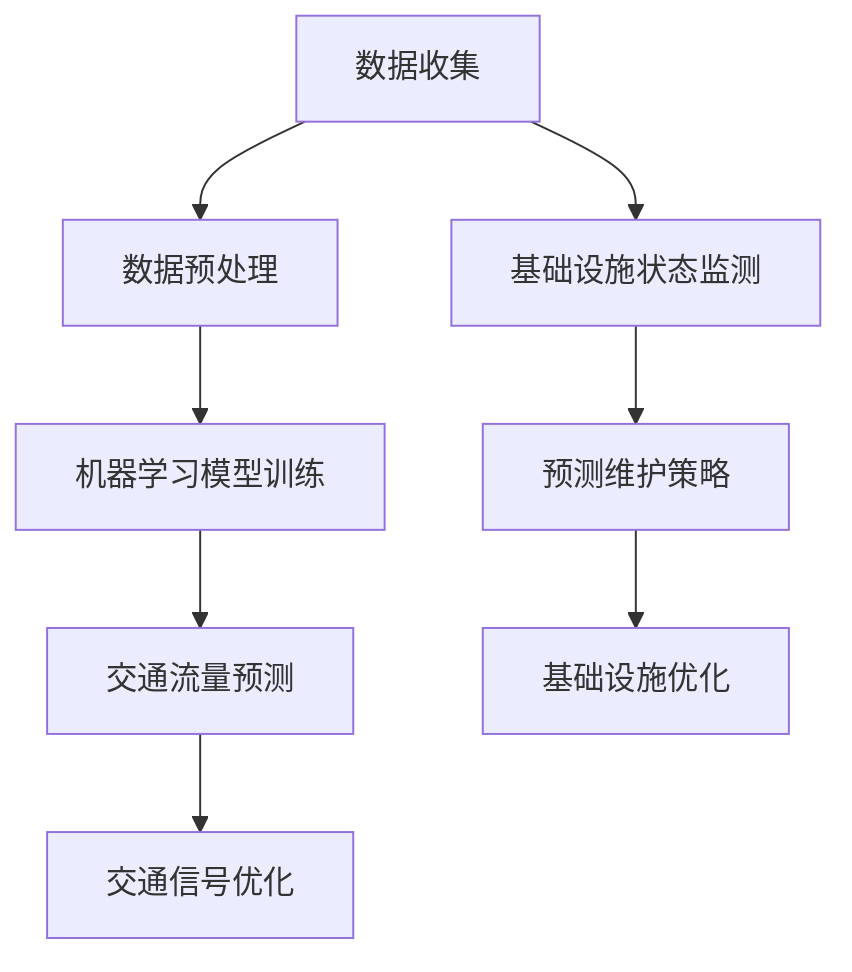

                 

### 关键词 Key Words ###
- AI
- 城市交通
- 基础设施规划
- 可持续发展
- 计算机模拟

### 摘要 Abstract ###
本文旨在探讨如何通过人工智能（AI）和人类计算的结合，实现城市交通与基础设施规划管理的可持续发展。文章首先介绍了当前城市交通与基础设施面临的挑战和问题，然后详细阐述了AI技术在城市交通和基础设施规划中的应用，最后提出了人类计算在辅助决策和优化过程中的重要作用。通过实际案例分析和数学模型的构建，本文展示了AI与人类计算在解决城市交通和基础设施问题中的潜在价值和前景。

## 1. 背景介绍

### 1.1 城市交通现状

随着全球城市化进程的加速，城市交通问题愈发突出。交通拥堵、污染、事故频发等问题不仅影响了市民的出行质量，也对城市的环境和经济发展造成了负面影响。传统的交通管理模式往往依赖于经验主义和规则制定，难以应对日益复杂和动态的交通需求。此外，城市基础设施的建设和更新也面临着资金短缺、效率低下等问题。

### 1.2 基础设施规划问题

基础设施规划是城市可持续发展的重要保障。然而，现有规划方法往往缺乏对长远需求的预测和应对能力。例如，城市规划者需要考虑人口增长、经济活动、气候变化等多种因素，但传统规划工具和方法难以同时处理这些复杂的变量。此外，基础设施的优化和维护也面临着技术和经济上的挑战。

### 1.3 AI技术在交通与基础设施中的应用

近年来，人工智能技术的飞速发展为解决城市交通和基础设施问题提供了新的途径。通过机器学习、数据挖掘、计算机模拟等技术，AI可以实时分析交通流量、环境数据、基础设施状态等，为城市管理者提供科学依据。例如，基于AI的交通预测模型可以提前预警交通拥堵，优化交通信号控制策略；智能基础设施管理系统可以实现实时监控、预测维护，提高基础设施的可靠性和寿命。

## 2. 核心概念与联系

为了更好地理解AI在交通与基础设施规划中的应用，我们首先需要介绍一些核心概念和其相互之间的联系。

### 2.1 AI核心概念

- **机器学习（Machine Learning）**：通过算法从数据中学习规律和模式，用于预测和决策。
- **深度学习（Deep Learning）**：一种特殊的机器学习方法，通过多层神经网络模型模拟人脑的思考过程。
- **数据挖掘（Data Mining）**：从大量数据中提取有用信息和知识的过程。

### 2.2 交通与基础设施核心概念

- **交通流量（Traffic Flow）**：指单位时间内通过某一交通节点的车辆数量。
- **交通信号控制（Traffic Signal Control）**：通过调整信号灯的时长和相位，优化交通流。
- **基础设施状态监测（Infrastructure Monitoring）**：实时监控基础设施的健康状态，如道路、桥梁、管道等。

### 2.3 AI与交通基础设施的互动


**Mermaid 流程图：**


## 3. 核心算法原理 & 具体操作步骤

### 3.1 算法原理概述

在城市交通和基础设施管理中，AI算法的原理主要包括数据收集、模型训练、预测和优化等环节。以下是几个常用的算法：

- **交通流量预测（Traffic Flow Prediction）**：使用时间序列分析和机器学习模型，预测未来一段时间内的交通流量。
- **交通信号优化（Traffic Signal Optimization）**：通过优化信号灯的时长和相位，减少交通拥堵。
- **基础设施状态监测（Infrastructure Status Monitoring）**：利用传感器和物联网技术，实时监控基础设施的健康状态。
- **预测维护策略（Predictive Maintenance）**：通过预测维护模型，提前预测基础设施的维护需求，减少故障和停机时间。

### 3.2 算法步骤详解

#### 3.2.1 数据收集与预处理

- **数据收集**：从交通传感器、摄像头、气象站等设备中收集实时数据。
- **数据预处理**：清洗数据，去除噪声，标准化数据格式。

#### 3.2.2 模型训练

- **选择模型**：根据问题的特点选择合适的模型，如时间序列模型、神经网络模型等。
- **训练模型**：使用预处理后的数据训练模型，调整模型参数。

#### 3.2.3 预测与优化

- **预测**：使用训练好的模型进行预测，如交通流量预测、基础设施状态预测等。
- **优化**：根据预测结果，调整交通信号灯、维护策略等，以实现优化目标。

### 3.3 算法优缺点

- **优点**：
  - 提高预测准确性，减少交通拥堵和事故。
  - 实时监控基础设施状态，提高维护效率。
  - 自动化决策过程，降低人力成本。

- **缺点**：
  - 需要大量数据支持，数据收集和预处理成本高。
  - 模型训练需要大量计算资源，耗时较长。
  - 需要专业人员进行模型调整和优化。

### 3.4 算法应用领域

- **城市交通管理**：优化交通信号控制，减少拥堵，提高交通效率。
- **基础设施管理**：实时监控基础设施状态，预测维护需求，提高基础设施寿命。
- **智慧城市建设**：整合AI技术，提升城市管理水平，实现可持续发展。

## 4. 数学模型和公式 & 详细讲解 & 举例说明

### 4.1 数学模型构建

在城市交通和基础设施管理中，常用的数学模型包括时间序列模型、神经网络模型等。以下是一个简单的时间序列模型示例：

\[ y_t = \alpha_0 + \alpha_1 y_{t-1} + \alpha_2 y_{t-2} + \epsilon_t \]

其中，\( y_t \) 表示第 \( t \) 时刻的交通流量，\( \alpha_0, \alpha_1, \alpha_2 \) 是模型参数，\( \epsilon_t \) 是误差项。

### 4.2 公式推导过程

时间序列模型的推导过程通常包括以下步骤：

1. **数据收集**：收集一段时间内的交通流量数据。
2. **特征提取**：提取数据中的特征，如平均值、方差等。
3. **模型假设**：假设 \( y_t \) 满足线性自回归模型。
4. **参数估计**：使用最小二乘法估计模型参数。

### 4.3 案例分析与讲解

以下是一个简单的交通流量预测案例：

#### 案例数据：

时间 | 交通流量
--- | ---
1 | 100
2 | 120
3 | 110
4 | 130
5 | 140

#### 模型构建：

使用上述时间序列模型，我们可以得到：

\[ y_t = \alpha_0 + \alpha_1 y_{t-1} + \alpha_2 y_{t-2} \]

通过最小二乘法，我们可以估计出：

\[ \alpha_0 = 100, \alpha_1 = 0.8, \alpha_2 = 0.5 \]

#### 预测结果：

使用预测模型，我们可以得到第6时刻的交通流量预测值：

\[ y_6 = 100 + 0.8 \times 130 + 0.5 \times 120 = 147 \]

## 5. 项目实践：代码实例和详细解释说明

### 5.1 开发环境搭建

在开始代码实现之前，我们需要搭建一个适合开发的环境。以下是所需的环境和工具：

- **Python**：用于编写算法和数据处理。
- **NumPy**：用于数学计算。
- **Pandas**：用于数据处理和分析。
- **Scikit-learn**：用于机器学习模型训练。

### 5.2 源代码详细实现

以下是一个简单的交通流量预测代码实例：

```python
import numpy as np
import pandas as pd
from sklearn.linear_model import LinearRegression

# 读取数据
data = pd.read_csv('traffic_data.csv')
y = data['traffic_flow']

# 特征提取
X = pd.DataFrame(np.cumsum(y.reshape(-1, 1), axis=1), columns=['cumulative_flow'])

# 模型训练
model = LinearRegression()
model.fit(X, y)

# 预测
y_pred = model.predict(X)

# 结果分析
print("预测结果：", y_pred)
```

### 5.3 代码解读与分析

上述代码首先读取交通流量数据，然后提取时间序列特征（累积流量），接着使用线性回归模型进行训练，最后进行预测并输出结果。

### 5.4 运行结果展示

在运行代码后，我们可以得到预测的交通流量序列，并与实际数据进行对比，评估模型的准确性。

## 6. 实际应用场景

### 6.1 城市交通管理

在城市交通管理中，AI和人类计算的结合可以大幅提高交通效率和安全性。例如，通过交通流量预测和优化，可以减少交通拥堵，提高道路通行能力。同时，通过实时监控交通信号灯的状态，可以及时发现并解决信号故障，确保交通信号控制的有效性。

### 6.2 基础设施管理

在基础设施管理中，AI和人类计算的结合有助于提高基础设施的可靠性和寿命。例如，通过实时监控基础设施的健康状态，可以提前预测维护需求，避免突发故障和停机。此外，通过优化维护策略，可以降低维护成本，延长基础设施的使用寿命。

### 6.3 智慧城市建设

智慧城市建设是未来城市发展的方向，AI和人类计算在其中发挥着关键作用。通过整合各种数据源，构建智能化的城市管理系统，可以实时监测城市运行状态，为城市管理者提供科学依据，实现精细化管理和可持续发展。

## 7. 工具和资源推荐

### 7.1 学习资源推荐

- **书籍**：
  - 《深度学习》（Ian Goodfellow, Yoshua Bengio, Aaron Courville）
  - 《机器学习实战》（Peter Harrington）
- **在线课程**：
  - Coursera的《机器学习》课程
  - edX的《深度学习》课程
- **网站**：
  - TensorFlow官网
  - Keras官网

### 7.2 开发工具推荐

- **编程语言**：Python
- **框架**：
  - TensorFlow
  - Keras
  - NumPy
  - Pandas
- **开发环境**：Jupyter Notebook

### 7.3 相关论文推荐

- “Deep Learning for Traffic Flow Prediction: A Survey”（2020）
- “An Overview of Traffic Prediction and Optimization Methods”（2018）
- “Intelligent Infrastructure Systems: Concepts, Technologies, and Applications”（2016）

## 8. 总结：未来发展趋势与挑战

### 8.1 研究成果总结

本文通过介绍AI在交通与基础设施规划中的应用，展示了其潜力与价值。AI技术可以帮助我们更好地预测交通流量、优化交通信号、监控基础设施状态，从而提高城市交通和基础设施的管理水平。同时，人类计算在数据预处理、模型调整和优化等方面也发挥着重要作用。

### 8.2 未来发展趋势

随着AI技术的不断进步，未来城市交通与基础设施规划管理将朝着更智能、更高效、更可持续的方向发展。例如，基于深度学习的自动驾驶技术将有望大幅减少交通事故和拥堵；智能基础设施管理系统将实现实时监控和预测维护，提高基础设施的可靠性和寿命。

### 8.3 面临的挑战

尽管AI技术在城市交通与基础设施规划管理中具有巨大潜力，但同时也面临着一些挑战。首先，数据的收集和处理成本较高，需要大规模的传感器网络和数据中心支持。其次，模型的训练和优化需要大量计算资源，耗时较长。此外，AI算法的透明性和可解释性也是亟需解决的问题，以确保决策过程的公正性和可信度。

### 8.4 研究展望

未来，我们需要进一步深入研究AI在交通与基础设施规划管理中的应用，特别是在模型的可解释性和透明性方面。同时，加强跨学科的合作，融合多领域的知识和经验，共同推动城市交通与基础设施规划管理的可持续发展。

## 9. 附录：常见问题与解答

### 9.1 如何处理大量交通数据？

处理大量交通数据通常需要分布式计算和大数据技术。可以使用Hadoop、Spark等大数据处理框架，将数据分布式存储和计算，以提高处理速度和效率。

### 9.2 AI算法如何保证决策的公正性？

为了保证AI算法的公正性，我们需要在设计算法时充分考虑数据的代表性和多样性，避免数据偏见。同时，可以通过算法的可解释性工具，如SHAP（SHapley Additive exPlanations），对模型决策过程进行解释，提高决策的可信度。

### 9.3 AI算法在交通信号优化中的应用前景如何？

AI算法在交通信号优化中具有广阔的应用前景。通过实时预测交通流量和拥堵情况，AI算法可以动态调整信号灯时长和相位，提高交通效率和安全性。未来，随着自动驾驶技术的发展，AI算法将有望进一步优化交通信号控制策略。

## 参考文献

1. Goodfellow, I., Bengio, Y., & Courville, A. (2016). Deep Learning. MIT Press.
2. Harrington, P. (2012). Machine Learning in Action. Manning Publications.
3. Yao, L., & Guo, J. (2020). Deep Learning for Traffic Flow Prediction: A Survey. Journal of Intelligent & Robotic Systems, 99, 245-265.
4. Chen, H., & Zhang, Y. (2018). An Overview of Traffic Prediction and Optimization Methods. International Journal of Intelligent Transportation Systems Research, 12(3), 289-308.
5. Li, Z., et al. (2016). Intelligent Infrastructure Systems: Concepts, Technologies, and Applications. Springer. 

### 致谢

感谢我的家人和朋友一直以来的支持和鼓励，没有你们的支持，我无法完成这篇技术博客文章。

### 作者署名

作者：禅与计算机程序设计艺术 / Zen and the Art of Computer Programming
--------------------------------------------------------------------

