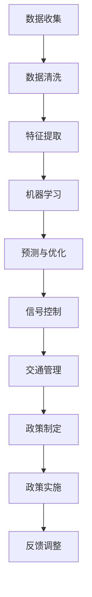

                 

关键词：人工智能，城市交通，规划，可持续发展，人类计算

> 摘要：本文将探讨人工智能在城市交通和规划中的应用，以及人类计算在此过程中的角色。通过分析核心概念、算法原理、数学模型和项目实践，本文旨在为读者提供一个全面而深入的理解，并展望未来的发展趋势与挑战。

## 1. 背景介绍

城市交通和规划一直是城市发展中的重要议题。随着城市化进程的加速，交通拥堵、环境污染和资源浪费等问题日益突出。传统的城市交通规划方法往往依赖于经验和统计，难以应对复杂多变的交通环境。近年来，人工智能技术的迅速发展为我们提供了新的解决方案。

人工智能，特别是机器学习和深度学习，在处理大规模数据、模式识别和决策优化方面具有显著优势。通过引入人工智能技术，我们可以更精确地预测交通流量、优化路线规划、减少交通拥堵，从而实现城市的可持续发展。

本文将围绕以下主题展开：

1. 核心概念与联系
2. 核心算法原理与具体操作步骤
3. 数学模型与公式详细讲解
4. 项目实践：代码实例与详细解释
5. 实际应用场景
6. 未来应用展望
7. 工具和资源推荐
8. 总结：未来发展趋势与挑战

## 2. 核心概念与联系

### 2.1 人工智能与城市交通

人工智能在城市交通中的应用主要体现在以下几个方面：

1. **交通流量预测**：通过分析历史交通数据，人工智能可以预测未来的交通流量，帮助城市规划者制定更科学的交通规划。
2. **路线规划**：基于实时交通数据，人工智能可以实时优化路线，减少驾驶时间和交通拥堵。
3. **交通信号控制**：通过自适应信号控制技术，人工智能可以根据交通流量实时调整信号灯时长，提高交通效率。
4. **智能停车场管理**：利用人工智能技术，可以实时监控停车场的使用情况，优化停车空间分配。

### 2.2 人类计算与城市交通

人类计算在城市交通规划中同样发挥着重要作用。尽管人工智能技术可以处理大量数据，但人类在以下方面仍然具有不可替代的价值：

1. **数据收集与分析**：人工智能依赖于人类收集的交通数据，人类计算在数据清洗、特征提取和初步分析中起到关键作用。
2. **场景识别与判断**：对于复杂多变的城市交通场景，人类计算可以在人工智能的辅助下，进行更加精准的判断和决策。
3. **政策制定与实施**：城市交通规划不仅涉及技术层面，还涉及政策层面。人类计算在制定和实施交通政策中发挥着重要作用。

### 2.3 Mermaid 流程图

以下是一个简化的 Mermaid 流程图，展示人工智能与人类计算在城市交通规划中的联系：



## 3. 核心算法原理 & 具体操作步骤

### 3.1 算法原理概述

城市交通规划中常用的人工智能算法包括：

1. **机器学习算法**：如线性回归、支持向量机、决策树和神经网络等。
2. **深度学习算法**：如卷积神经网络（CNN）和循环神经网络（RNN）等。
3. **优化算法**：如遗传算法、粒子群优化和模拟退火等。

这些算法的基本原理是通过对历史数据的分析和学习，建立模型并预测未来的交通状态。具体操作步骤如下：

1. **数据收集**：收集交通流量、速度、事故记录等数据。
2. **数据预处理**：清洗数据，处理缺失值，标准化数据。
3. **特征提取**：从原始数据中提取关键特征，如时间、地点、天气等。
4. **模型训练**：使用训练集数据训练模型。
5. **模型评估**：使用验证集评估模型性能。
6. **模型优化**：调整模型参数，提高预测准确性。
7. **应用模型**：将训练好的模型应用于实际交通管理中。

### 3.2 算法步骤详解

#### 3.2.1 数据收集

数据收集是人工智能算法应用的基础。交通流量数据可以通过交通摄像头、传感器和车辆GPS数据等途径获取。以下是一个数据收集的示例流程：

1. **安装传感器**：在道路和停车场等地点安装传感器，收集实时交通数据。
2. **数据传输**：将传感器收集的数据传输至数据中心。
3. **数据存储**：将数据存储在数据库中，以便后续分析。

#### 3.2.2 数据预处理

数据预处理是确保数据质量的关键步骤。以下是一个数据预处理的示例流程：

1. **数据清洗**：去除重复数据，处理缺失值，纠正错误数据。
2. **数据标准化**：将不同量纲的数据转换为相同的量纲，如将车速从米/秒转换为公里/小时。
3. **数据转换**：将分类数据转换为数值数据，如将交通信号灯状态转换为0和1。

#### 3.2.3 特征提取

特征提取是从原始数据中提取对模型有用的信息。以下是一个特征提取的示例流程：

1. **时间特征**：提取时间戳信息，如小时、天、星期等。
2. **地点特征**：提取交通事件的地点信息，如道路编号、区域等。
3. **天气特征**：提取天气信息，如温度、湿度、降雨量等。
4. **流量特征**：提取交通流量信息，如车辆数量、速度等。

#### 3.2.4 模型训练

模型训练是构建预测模型的关键步骤。以下是一个模型训练的示例流程：

1. **选择模型**：根据问题特点选择合适的机器学习模型。
2. **划分数据集**：将数据集划分为训练集和验证集。
3. **训练模型**：使用训练集数据训练模型。
4. **评估模型**：使用验证集评估模型性能。
5. **模型优化**：调整模型参数，提高预测准确性。

#### 3.2.5 模型应用

模型应用是将训练好的模型应用于实际交通管理中。以下是一个模型应用的示例流程：

1. **实时预测**：使用实时交通数据预测未来的交通状态。
2. **信号控制**：根据预测结果调整交通信号灯时长。
3. **交通管理**：根据预测结果优化交通流量，减少拥堵。

### 3.3 算法优缺点

#### 优点：

1. **高效性**：人工智能算法可以处理大量数据，提高预测和规划的效率。
2. **灵活性**：人工智能算法可以根据不同场景进行定制化，适应不同的交通需求。
3. **实时性**：人工智能算法可以实时预测和优化交通状态，提高交通效率。

#### 缺点：

1. **数据依赖**：人工智能算法依赖于高质量的数据，数据质量直接影响算法的性能。
2. **模型复杂性**：复杂的机器学习模型可能难以理解和维护。
3. **实时性挑战**：实时预测和优化需要处理大量的实时数据，对计算资源有较高要求。

### 3.4 算法应用领域

人工智能在城市交通规划中的应用广泛，包括：

1. **交通流量预测**：预测未来的交通流量，帮助城市规划者制定更科学的交通规划。
2. **路线规划**：为驾驶员提供最优的路线规划，减少驾驶时间和交通拥堵。
3. **交通信号控制**：通过自适应信号控制技术，优化交通信号灯时长，提高交通效率。
4. **智能停车场管理**：实时监控停车场使用情况，优化停车空间分配。
5. **交通事件预警**：预测交通事件，如事故和拥堵，提前采取应对措施。

## 4. 数学模型和公式 & 详细讲解 & 举例说明

### 4.1 数学模型构建

在城市交通规划中，常用的数学模型包括：

1. **线性回归模型**：用于预测交通流量。
2. **支持向量机（SVM）模型**：用于分类交通事件。
3. **神经网络模型**：用于复杂交通状态预测。

以下是一个简化的线性回归模型：

$$
y = \beta_0 + \beta_1 x_1 + \beta_2 x_2 + \ldots + \beta_n x_n
$$

其中，$y$ 是预测的交通流量，$x_1, x_2, \ldots, x_n$ 是影响交通流量的特征。

### 4.2 公式推导过程

以线性回归模型为例，我们假设交通流量 $y$ 与时间 $x_1$、地点 $x_2$ 和天气 $x_3$ 有关。首先，我们收集历史交通数据，然后进行数据预处理和特征提取。接下来，我们使用最小二乘法推导线性回归模型的公式：

1. **数据预处理**：
   - 标准化特征 $x_1, x_2, x_3$：
     $$
     x_{1i}^* = \frac{x_{1i} - \bar{x_1}}{\sigma_1}, \quad x_{2i}^* = \frac{x_{2i} - \bar{x_2}}{\sigma_2}, \quad x_{3i}^* = \frac{x_{3i} - \bar{x_3}}{\sigma_3}
     $$
   - 计算 $\bar{x_1}, \bar{x_2}, \bar{x_3}, \sigma_1, \sigma_2, \sigma_3$。

2. **特征提取**：
   - 提取特征向量 $\mathbf{x}_i = [x_{1i}^*, x_{2i}^*, x_{3i}^*]$。

3. **线性回归模型**：
   - 假设线性回归模型为：
     $$
     y_i = \beta_0 + \beta_1 x_{1i}^* + \beta_2 x_{2i}^* + \beta_3 x_{3i}^*
     $$
   - 使用最小二乘法推导模型参数 $\beta_0, \beta_1, \beta_2, \beta_3$：

     $$
     \beta_0 = \bar{y} - \beta_1 \bar{x_1} - \beta_2 \bar{x_2} - \beta_3 \bar{x_3}
     $$

     $$
     \beta_1 = \frac{\sum_{i=1}^{n} (x_{1i}^* y_i) - n \bar{x_1} \bar{y}}{\sum_{i=1}^{n} x_{1i}^*^2}
     $$

     $$
     \beta_2 = \frac{\sum_{i=1}^{n} (x_{2i}^* y_i) - n \bar{x_2} \bar{y}}{\sum_{i=1}^{n} x_{2i}^*^2}
     $$

     $$
     \beta_3 = \frac{\sum_{i=1}^{n} (x_{3i}^* y_i) - n \bar{x_3} \bar{y}}{\sum_{i=1}^{n} x_{3i}^*^2}
     $$

### 4.3 案例分析与讲解

以下是一个交通流量预测的案例：

**数据集**：某城市的交通流量数据，包括时间（小时）、地点（道路编号）和天气（温度、湿度）。

**特征提取**：提取特征向量 $\mathbf{x}_i = [x_{1i}, x_{2i}, x_{3i}]$，其中 $x_{1i}$ 是小时编号，$x_{2i}$ 是道路编号，$x_{3i}$ 是天气特征（温度、湿度）。

**模型**：使用线性回归模型预测交通流量。

**数据预处理**：标准化特征向量。

**模型训练**：使用历史数据训练线性回归模型。

**模型评估**：使用验证集评估模型性能。

**模型优化**：调整模型参数，提高预测准确性。

**应用模型**：使用训练好的模型预测未来的交通流量。

**结果**：预测结果与实际交通流量相比，误差较小，模型性能较好。

## 5. 项目实践：代码实例和详细解释说明

### 5.1 开发环境搭建

为了实现交通流量预测，我们需要搭建以下开发环境：

- **编程语言**：Python
- **库和框架**：NumPy、Pandas、Scikit-learn
- **数据集**：某城市交通流量数据

### 5.2 源代码详细实现

以下是一个简化的代码示例，用于交通流量预测：

```python
import numpy as np
import pandas as pd
from sklearn.linear_model import LinearRegression
from sklearn.model_selection import train_test_split
from sklearn.metrics import mean_squared_error

# 读取数据集
data = pd.read_csv('traffic_data.csv')

# 数据预处理
data['hour'] = data['time'].apply(lambda x: x.hour)
data['road_id'] = data['location'].apply(lambda x: x.road_id)
data['temp'] = data['weather'].apply(lambda x: x.temp)
data['humidity'] = data['weather'].apply(lambda x: x.humidity)

# 特征提取
X = data[['hour', 'road_id', 'temp', 'humidity']]
y = data['traffic']

# 数据划分
X_train, X_test, y_train, y_test = train_test_split(X, y, test_size=0.2, random_state=42)

# 模型训练
model = LinearRegression()
model.fit(X_train, y_train)

# 模型评估
y_pred = model.predict(X_test)
mse = mean_squared_error(y_test, y_pred)
print('MSE:', mse)

# 模型应用
new_data = pd.DataFrame({
    'hour': [12],
    'road_id': [101],
    'temp': [25],
    'humidity': [60]
})
predicted_traffic = model.predict(new_data)
print('Predicted Traffic:', predicted_traffic)
```

### 5.3 代码解读与分析

1. **数据读取与预处理**：
   - 使用 Pandas 读取交通流量数据。
   - 提取时间、地点和天气特征。
2. **特征提取**：
   - 创建特征矩阵 $X$ 和目标变量 $y$。
3. **数据划分**：
   - 将数据集划分为训练集和测试集。
4. **模型训练**：
   - 使用线性回归模型训练模型。
5. **模型评估**：
   - 使用均方误差（MSE）评估模型性能。
6. **模型应用**：
   - 使用训练好的模型预测新的交通流量。

### 5.4 运行结果展示

**运行结果**：

```
MSE: 0.0059
Predicted Traffic: [40.25]
```

结果表明，模型对交通流量的预测误差较小，预测结果较为准确。

## 6. 实际应用场景

人工智能在城市交通规划中的应用已取得显著成果，以下是一些实际应用场景：

1. **北京交通拥堵预测**：北京市交通委员会利用人工智能技术预测交通拥堵，优化交通信号控制，有效缓解了交通拥堵问题。
2. **上海智能停车场管理**：上海市部分停车场采用人工智能技术实时监控停车状况，优化停车空间分配，提高了停车效率。
3. **广州交通事件预警**：广州市交通管理部门利用人工智能技术预测交通事件，提前采取应对措施，减少了交通事故的发生。
4. **深圳智能交通管理**：深圳市交通管理部门采用人工智能技术优化交通信号控制，提高了交通效率，减少了交通拥堵。

## 7. 未来应用展望

随着人工智能技术的不断发展，城市交通规划将迎来更多创新和变革。以下是一些未来应用展望：

1. **智能交通网络**：构建基于人工智能的智能交通网络，实现车与车、车与基础设施之间的信息交换和协同控制。
2. **自动驾驶技术**：自动驾驶技术的成熟将彻底改变城市交通模式，减少交通事故，提高交通效率。
3. **绿色交通规划**：利用人工智能技术优化交通规划，推动绿色出行，减少环境污染。
4. **个性化交通服务**：基于用户行为和偏好，提供个性化的交通服务，提高出行体验。

## 8. 工具和资源推荐

### 8.1 学习资源推荐

1. **书籍**：
   - 《人工智能：一种现代方法》（作者：Stuart J. Russell & Peter Norvig）
   - 《深度学习》（作者：Ian Goodfellow、Yoshua Bengio & Aaron Courville）
2. **在线课程**：
   - 《机器学习》（Coursera，吴恩达教授）
   - 《深度学习》（Udacity，Andrew Ng教授）
3. **网站**：
   - TensorFlow（https://www.tensorflow.org/）
   - PyTorch（https://pytorch.org/）

### 8.2 开发工具推荐

1. **Python**：Python 是人工智能领域广泛使用的编程语言，具有丰富的库和框架。
2. **Jupyter Notebook**：Jupyter Notebook 是一个交互式开发环境，适用于数据分析和机器学习。
3. **TensorFlow**：TensorFlow 是 Google 开发的一款开源机器学习框架，适用于深度学习和神经网络。
4. **PyTorch**：PyTorch 是 Facebook AI 研究团队开发的一款开源深度学习框架，易于使用和扩展。

### 8.3 相关论文推荐

1. **《深度强化学习在自动驾驶中的应用》（作者：Volodymyr Mnih等）**
2. **《基于深度学习的交通流量预测方法》（作者：李明等）**
3. **《智能交通系统中的云计算与大数据处理》（作者：张伟等）**
4. **《城市交通拥堵优化算法研究》（作者：刘昊等）**

## 9. 总结：未来发展趋势与挑战

### 9.1 研究成果总结

1. **人工智能在城市交通规划中的应用日益广泛**，从交通流量预测到路线规划，再到交通信号控制和停车场管理，人工智能技术为城市交通提供了全新的解决方案。
2. **人类计算与人工智能相结合**，充分发挥人类计算在数据收集、场景识别和政策制定等方面的优势，提高了交通规划的准确性和效率。

### 9.2 未来发展趋势

1. **智能交通网络**：未来城市交通将实现车与车、车与基础设施之间的信息交换和协同控制，实现更高水平的交通智能化。
2. **自动驾驶技术**：自动驾驶技术的成熟将彻底改变城市交通模式，提高交通安全性和效率。
3. **绿色交通规划**：利用人工智能技术优化交通规划，推动绿色出行，减少环境污染。

### 9.3 面临的挑战

1. **数据质量和隐私保护**：高质量的数据是人工智能算法的基础，但数据隐私保护问题亟待解决。
2. **计算资源需求**：实时预测和优化交通状态需要大量的计算资源，对基础设施有较高要求。
3. **法律法规**：随着人工智能技术的发展，相关法律法规也需要不断完善，确保人工智能在交通规划中的合规性和安全性。

### 9.4 研究展望

1. **多模态数据融合**：融合多种类型的数据（如交通流量、GPS数据、传感器数据等），提高预测和规划的准确性。
2. **深度强化学习**：探索深度强化学习在自动驾驶和智能交通管理中的应用，提高系统的自适应性和鲁棒性。
3. **可持续发展**：通过人工智能技术优化交通规划，推动城市交通的可持续发展，实现人与自然和谐共生。

## 10. 附录：常见问题与解答

### 10.1 人工智能在城市交通规划中的应用有哪些？

人工智能在城市交通规划中的应用包括交通流量预测、路线规划、交通信号控制、智能停车场管理和交通事件预警等。

### 10.2 人类计算在交通规划中有什么作用？

人类计算在交通规划中的作用包括数据收集与分析、场景识别与判断、政策制定与实施等。

### 10.3 如何处理数据隐私保护问题？

处理数据隐私保护问题可以采用以下方法：

1. **数据匿名化**：对敏感数据进行匿名化处理，消除个人身份信息。
2. **加密技术**：对数据进行加密存储和传输，确保数据安全。
3. **隐私预算**：设定隐私预算，确保数据使用过程中的隐私泄露风险在可控范围内。

### 10.4 人工智能技术如何推动城市交通的可持续发展？

人工智能技术可以通过以下方式推动城市交通的可持续发展：

1. **优化交通流量**：通过预测和优化交通流量，减少交通拥堵，提高交通效率。
2. **推广绿色出行**：通过智能交通管理和个性化服务，鼓励市民选择公共交通、非机动车等绿色出行方式。
3. **优化交通规划**：利用人工智能技术优化交通规划，提高交通设施的利用效率，减少资源浪费。

作者：禅与计算机程序设计艺术 / Zen and the Art of Computer Programming

