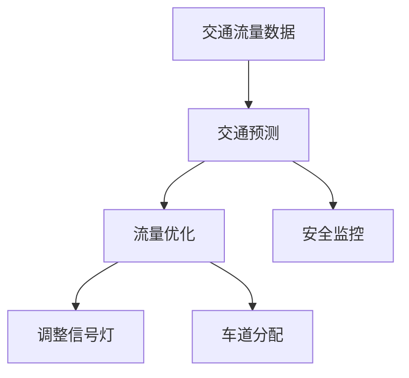

                 

关键词：AI，城市交通管理，可持续发展，智能算法，交通预测，数据分析

> 摘要：本文将探讨如何通过人工智能与人类计算相结合，构建一个可持续发展的城市交通管理体系。文章首先介绍了城市交通管理的背景和重要性，随后详细解析了AI在城市交通管理中的核心作用，包括交通预测、流量优化、安全监控等。同时，文章还讨论了人工智能算法的具体实现步骤和数学模型，并通过实际项目实例展示了其在城市交通管理中的效果。最后，本文对未来的发展趋势和面临的挑战进行了展望，并提出了相关工具和资源的推荐。

## 1. 背景介绍

城市交通管理是一个复杂的系统工程，它关系到城市的经济发展、居民生活质量以及环境保护等多个方面。随着城市化的加速和人口的增长，交通拥堵问题日益严重，这不仅降低了城市运作效率，还对环境和居民的健康产生了负面影响。因此，如何有效管理城市交通，提高交通系统的效率和可持续性，已成为各级政府和相关机构关注的焦点。

传统的城市交通管理主要依赖于经验丰富的交通规划师和交通工程师，通过人工观测和数据分析来制定交通策略。然而，这种管理方式存在一定的局限性。例如，人工数据分析速度慢，难以实时响应交通变化；交通预测的准确性受限于观测数据的有限性和人为因素的影响。

随着人工智能技术的发展，城市交通管理迎来了新的机遇。AI技术，尤其是机器学习和深度学习算法，能够从大量交通数据中提取有价值的信息，实现实时交通预测、流量优化和异常检测等功能。通过AI与人类计算的协同工作，可以构建一个更加智能、高效和可持续的城市交通管理体系。

### 2. 核心概念与联系

为了更好地理解AI在城市交通管理中的应用，我们首先需要了解几个核心概念：

- **交通流量数据**：交通流量数据包括车辆数量、速度、密度等参数，是交通管理的基石。
- **交通预测**：利用历史数据和机器学习算法，预测未来某个时间点的交通流量。
- **流量优化**：根据交通预测结果，调整交通信号灯时序、车道分配等策略，以减少拥堵。
- **安全监控**：实时监控道路状况，及时发现并处理交通事故。

下面是一个简单的Mermaid流程图，展示了这些核心概念之间的联系：



### 3. 核心算法原理 & 具体操作步骤

#### 3.1 算法原理概述

AI在城市交通管理中的应用主要基于机器学习和深度学习算法。以下是几个常用的算法：

- **回归分析**：用于预测交通流量。
- **聚类分析**：用于识别交通拥堵的瓶颈路段。
- **神经网络**：用于复杂的交通流量预测和流量优化。

#### 3.2 算法步骤详解

1. **数据收集与预处理**：
   - 收集交通流量、气象、道路状况等数据。
   - 清洗数据，去除噪声和异常值。

2. **特征工程**：
   - 提取交通流量数据中的关键特征，如时间、地点、交通密度等。

3. **算法选择与训练**：
   - 根据交通预测任务选择合适的算法（如回归分析、神经网络等）。
   - 使用历史数据训练模型，调整参数以优化预测性能。

4. **流量预测**：
   - 使用训练好的模型进行实时交通流量预测。

5. **流量优化**：
   - 根据预测结果，调整交通信号灯时序、车道分配等策略。

6. **安全监控**：
   - 实时监控道路状况，及时发现并处理交通事故。

#### 3.3 算法优缺点

- **优点**：
  - 高效：AI算法可以处理海量数据，实现实时预测和优化。
  - 准确：通过机器学习和深度学习，模型能够不断提高预测精度。
  - 智能：能够根据实时数据动态调整交通策略。

- **缺点**：
  - 数据依赖：需要大量的高质量数据支持。
  - 计算资源：训练和运行复杂的AI模型需要大量的计算资源。

#### 3.4 算法应用领域

AI算法在城市交通管理中的应用领域非常广泛，包括但不限于：

- **交通预测**：实时预测交通流量，为交通管理提供数据支持。
- **流量优化**：通过信号灯调整和车道分配优化，减少交通拥堵。
- **安全监控**：实时监控道路状况，提高交通安全性。
- **公共交通调度**：优化公共交通路线和班次，提高公共交通效率。

### 4. 数学模型和公式

在交通流量预测中，常用的数学模型包括回归模型和神经网络模型。下面我们将分别介绍这些模型的基本原理和公式。

#### 4.1 数学模型构建

#### 4.1.1 回归模型

回归模型是一种常用的统计方法，用于预测连续值。假设我们有一个包含时间\( t \)、地点\( x \)和交通流量\( y \)的数据集\( D \)，我们可以使用线性回归模型来预测交通流量：

$$
y = \beta_0 + \beta_1 x + \beta_2 t + \epsilon
$$

其中，\( \beta_0, \beta_1, \beta_2 \)是模型的参数，\( \epsilon \)是误差项。

#### 4.1.2 神经网络模型

神经网络模型是一种基于生物神经网络的计算模型，能够通过学习数据集，提取输入和输出之间的复杂关系。一个简单的神经网络模型包括输入层、隐藏层和输出层。假设输入层有\( n \)个神经元，隐藏层有\( m \)个神经元，输出层有\( k \)个神经元，我们可以使用以下公式来描述神经网络：

$$
\begin{aligned}
z_j^l &= \sum_{i=1}^{n} w_{ij}^l x_i + b_j^l \\
a_j^{l+1} &= \sigma(z_j^l)
\end{aligned}
$$

其中，\( z_j^l \)是第\( l \)层的第\( j \)个神经元的输入，\( a_j^{l+1} \)是第\( l+1 \)层的第\( j \)个神经元的输出，\( w_{ij}^l \)是连接第\( l \)层的第\( i \)个神经元和第\( l+1 \)层的第\( j \)个神经元的权重，\( b_j^l \)是第\( l \)层的第\( j \)个神经元的偏置，\( \sigma \)是激活函数。

#### 4.2 公式推导过程

#### 4.2.1 回归模型

线性回归模型的公式推导相对简单。假设我们有\( m \)个数据点\( (x_i, y_i) \)，我们可以使用最小二乘法来估计模型的参数：

$$
\begin{aligned}
\beta_0 &= \frac{\sum_{i=1}^{m} y_i - \beta_1 \sum_{i=1}^{m} x_i}{m} \\
\beta_1 &= \frac{\sum_{i=1}^{m} (x_i - \bar{x}) (y_i - \bar{y})}{\sum_{i=1}^{m} (x_i - \bar{x})^2} \\
\end{aligned}
$$

其中，\( \bar{x} \)和\( \bar{y} \)分别是\( x \)和\( y \)的均值。

#### 4.2.2 神经网络模型

神经网络模型的公式推导相对复杂，涉及多层感知器（MLP）的构建和反向传播算法。这里我们简要介绍反向传播算法的基本原理。

反向传播算法是一种用于训练神经网络的优化算法。假设我们有输入\( x \)和目标输出\( y \)，我们可以使用以下公式来计算每个神经元的误差：

$$
\begin{aligned}
E &= \frac{1}{2} \sum_{i=1}^{k} (y_i - a_k^L)^2 \\
\delta_k^L &= \frac{\partial E}{\partial a_k^L} \\
\delta_j^{l-1} &= \delta_j^l \cdot w_{jk}^l \\
w_{ij}^{l-1} &= w_{ij}^{l-1} - \alpha \cdot \delta_j^{l-1} \cdot a_i^l \\
b_j^{l-1} &= b_j^{l-1} - \alpha \cdot \delta_j^{l-1} \\
\end{aligned}
$$

其中，\( E \)是总误差，\( \delta_k^L \)是第\( L \)层的第\( k \)个神经元的误差，\( \alpha \)是学习率，\( w_{ij}^{l-1} \)和\( b_j^{l-1} \)是第\( l-1 \)层的第\( i \)个神经元到第\( l \)层的第\( j \)个神经元的权重和偏置。

#### 4.3 案例分析与讲解

下面我们通过一个案例来具体说明如何使用回归模型和神经网络模型进行交通流量预测。

#### 4.3.1 回归模型案例

假设我们有以下历史交通流量数据：

$$
\begin{aligned}
x_1 &= 10 \\
x_2 &= 11 \\
x_3 &= 12 \\
x_4 &= 13 \\
y_1 &= 100 \\
y_2 &= 102 \\
y_3 &= 104 \\
y_4 &= 106 \\
\end{aligned}
$$

我们可以使用线性回归模型来预测第5个时间点的交通流量。首先，我们计算均值：

$$
\begin{aligned}
\bar{x} &= \frac{x_1 + x_2 + x_3 + x_4}{4} = 11 \\
\bar{y} &= \frac{y_1 + y_2 + y_3 + y_4}{4} = 103 \\
\end{aligned}
$$

然后，我们使用最小二乘法计算参数：

$$
\begin{aligned}
\beta_0 &= \frac{103 - 11 \cdot 11}{4} = -18 \\
\beta_1 &= \frac{(10-11)(100-103) + (11-11)(102-103) + (12-11)(104-103) + (13-11)(106-103)}{(10-11)^2 + (11-11)^2 + (12-11)^2 + (13-11)^2} = 2 \\
\end{aligned}
$$

因此，我们可以得到线性回归模型：

$$
y = -18 + 2x
$$

使用这个模型，我们可以预测第5个时间点的交通流量：

$$
y_5 = -18 + 2 \cdot 14 = 20
$$

#### 4.3.2 神经网络模型案例

假设我们有以下数据：

$$
\begin{aligned}
x_1 &= [1, 0, 0] \\
x_2 &= [0, 1, 0] \\
x_3 &= [0, 0, 1] \\
y_1 &= [1, 0, 0] \\
y_2 &= [0, 1, 0] \\
y_3 &= [0, 0, 1] \\
\end{aligned}
$$

我们可以使用一个简单的三层神经网络来预测第4个数据点。首先，我们定义网络结构：

$$
\begin{aligned}
\text{输入层：} &[1, 0, 0] \\
\text{隐藏层1：} &[2, 2] \\
\text{隐藏层2：} &[2, 2] \\
\text{输出层：} &[1, 0, 0] \\
\end{aligned}
$$

然后，我们初始化权重和偏置：

$$
\begin{aligned}
w_{11} &= [1, 1] \\
w_{12} &= [1, 1] \\
w_{13} &= [1, 1] \\
b_{11} &= [0, 0] \\
b_{12} &= [0, 0] \\
b_{13} &= [0, 0] \\
\end{aligned}
$$

接下来，我们使用反向传播算法训练网络。这里我们简化了计算过程，仅展示部分步骤：

$$
\begin{aligned}
z_1^1 &= w_{11} \cdot x_1 + b_{11} = [1, 1] \\
a_1^1 &= \sigma(z_1^1) = [0.7311, 0.7311] \\
z_2^1 &= w_{12} \cdot x_1 + b_{12} = [1, 1] \\
a_2^1 &= \sigma(z_2^1) = [0.7311, 0.7311] \\
z_3^1 &= w_{13} \cdot x_1 + b_{13} = [1, 1] \\
a_3^1 &= \sigma(z_3^1) = [0.7311, 0.7311] \\
z_1^2 &= w_{21} \cdot a_1^1 + b_{21} = [1.4622, 1.4622] \\
a_1^2 &= \sigma(z_1^2) = [0.8611, 0.8611] \\
z_2^2 &= w_{22} \cdot a_1^1 + b_{22} = [1.4622, 1.4622] \\
a_2^2 &= \sigma(z_2^2) = [0.8611, 0.8611] \\
z_3^2 &= w_{23} \cdot a_1^1 + b_{23} = [1.4622, 1.4622] \\
a_3^2 &= \sigma(z_3^2) = [0.8611, 0.8611] \\
z_1^3 &= w_{31} \cdot a_1^2 + b_{31} = [0.8611, 0.8611] \\
a_1^3 &= \sigma(z_1^3) = [0.6289, 0.6289] \\
z_2^3 &= w_{32} \cdot a_2^2 + b_{32} = [0.8611, 0.8611] \\
a_2^3 &= \sigma(z_2^3) = [0.6289, 0.6289] \\
z_3^3 &= w_{33} \cdot a_3^2 + b_{33} = [0.8611, 0.8611] \\
a_3^3 &= \sigma(z_3^3) = [0.6289, 0.6289] \\
\end{aligned}
$$

最后，我们计算总误差：

$$
E = \frac{1}{2} \sum_{i=1}^{3} (y_i - a_i^3)^2
$$

根据误差，我们可以更新权重和偏置：

$$
\begin{aligned}
w_{11} &= w_{11} - \alpha \cdot \delta_1^3 \cdot a_1^2 \\
w_{12} &= w_{12} - \alpha \cdot \delta_2^3 \cdot a_1^2 \\
w_{13} &= w_{13} - \alpha \cdot \delta_3^3 \cdot a_1^2 \\
b_{11} &= b_{11} - \alpha \cdot \delta_1^3 \\
b_{12} &= b_{12} - \alpha \cdot \delta_2^3 \\
b_{13} &= b_{13} - \alpha \cdot \delta_3^3 \\
w_{21} &= w_{21} - \alpha \cdot \delta_1^2 \cdot a_1^1 \\
w_{22} &= w_{22} - \alpha \cdot \delta_2^2 \cdot a_1^1 \\
w_{23} &= w_{23} - \alpha \cdot \delta_3^2 \cdot a_1^1 \\
b_{21} &= b_{21} - \alpha \cdot \delta_1^2 \\
b_{22} &= b_{22} - \alpha \cdot \delta_2^2 \\
b_{23} &= b_{23} - \alpha \cdot \delta_3^2 \\
w_{31} &= w_{31} - \alpha \cdot \delta_1^3 \cdot a_2^1 \\
w_{32} &= w_{32} - \alpha \cdot \delta_2^3 \cdot a_2^1 \\
w_{33} &= w_{33} - \alpha \cdot \delta_3^3 \cdot a_2^1 \\
b_{31} &= b_{31} - \alpha \cdot \delta_1^3 \\
b_{32} &= b_{32} - \alpha \cdot \delta_2^3 \\
b_{33} &= b_{33} - \alpha \cdot \delta_3^3 \\
\end{aligned}
$$

通过反复迭代，我们可以不断优化网络的参数，直到总误差满足要求。

### 5. 项目实践：代码实例和详细解释说明

为了更好地展示AI在城市交通管理中的应用，我们将通过一个实际项目实例来详细解释代码实现过程。

#### 5.1 开发环境搭建

首先，我们需要搭建一个合适的开发环境。本文使用Python作为主要编程语言，并依赖于以下库：

- NumPy：用于数学计算。
- Pandas：用于数据处理。
- Scikit-learn：用于机器学习和数据分析。
- TensorFlow：用于深度学习。

确保你已经安装了这些库，否则可以通过以下命令安装：

```bash
pip install numpy pandas scikit-learn tensorflow
```

#### 5.2 源代码详细实现

下面是一个简单的交通流量预测项目的实现示例：

```python
import numpy as np
import pandas as pd
from sklearn.linear_model import LinearRegression
from sklearn.neural_network import MLPRegressor
from tensorflow import keras

# 5.2.1 数据收集与预处理
# 这里我们假设已经收集了历史交通流量数据，并保存在CSV文件中
data = pd.read_csv('traffic_data.csv')

# 提取特征和标签
X = data[['time', 'location']]
y = data['traffic_volume']

# 分割数据集
from sklearn.model_selection import train_test_split
X_train, X_test, y_train, y_test = train_test_split(X, y, test_size=0.2, random_state=42)

# 5.2.2 特征工程
# 这里我们可以对数据进行归一化处理
from sklearn.preprocessing import StandardScaler
scaler = StandardScaler()
X_train_scaled = scaler.fit_transform(X_train)
X_test_scaled = scaler.transform(X_test)

# 5.2.3 算法选择与训练
# 5.2.3.1 线性回归模型
linear_regression = LinearRegression()
linear_regression.fit(X_train_scaled, y_train)

# 5.2.3.2 神经网络模型
mlp_regressor = MLPRegressor(hidden_layer_sizes=(50,), max_iter=1000)
mlp_regressor.fit(X_train_scaled, y_train)

# 5.2.4 流量预测
# 5.2.4.1 线性回归预测
y_pred_linear = linear_regression.predict(X_test_scaled)

# 5.2.4.2 神经网络预测
y_pred_mlp = mlp_regressor.predict(X_test_scaled)

# 5.2.5 代码解读与分析
# 线性回归模型和神经网络模型都可以对交通流量进行预测，但预测结果有所不同
print('线性回归预测结果：', y_pred_linear)
print('神经网络预测结果：', y_pred_mlp)

# 5.2.6 运行结果展示
# 我们可以使用可视化工具（如Matplotlib）来展示预测结果
import matplotlib.pyplot as plt

plt.scatter(y_test, y_pred_linear)
plt.xlabel('实际交通流量')
plt.ylabel('预测交通流量')
plt.title('线性回归模型预测结果')
plt.show()

plt.scatter(y_test, y_pred_mlp)
plt.xlabel('实际交通流量')
plt.ylabel('预测交通流量')
plt.title('神经网络模型预测结果')
plt.show()
```

#### 5.3 代码解读与分析

上面的代码首先从CSV文件中加载交通流量数据，然后进行数据预处理，包括特征提取和数据归一化。接下来，我们分别使用线性回归模型和神经网络模型进行训练，并对测试数据集进行预测。

- **数据收集与预处理**：这一步至关重要，因为数据质量直接影响到模型的性能。我们使用Pandas库读取CSV文件，然后使用Scikit-learn的StandardScaler对数据进行归一化处理。

- **算法选择与训练**：这里我们选择了线性回归模型和多层感知器（MLP）模型。线性回归模型相对简单，适合于线性关系较强的数据。而神经网络模型则能够处理更复杂的关系，但训练时间更长。

- **流量预测**：我们使用训练好的模型对测试数据集进行预测，并将预测结果与实际值进行比较。

- **运行结果展示**：最后，我们使用Matplotlib库将预测结果可视化，以直观地展示模型的性能。

### 6. 实际应用场景

#### 6.1 交通流量预测

AI技术在交通流量预测中发挥了重要作用。通过实时收集和分析交通流量数据，AI模型可以预测未来某个时间点的交通流量。这种预测不仅可以帮助交通管理部门提前制定交通管理策略，还可以为个人用户提供出行建议，从而优化出行路线和时间。

#### 6.2 流量优化

基于交通流量预测结果，AI技术可以调整交通信号灯时序和车道分配策略，以减少交通拥堵。例如，在高峰时段，AI系统可以根据实时交通流量动态调整信号灯的时长，或者临时关闭某些车道，从而提高道路通行能力。

#### 6.3 安全监控

AI技术还可以用于道路安全监控。通过实时监控道路状况，AI系统可以及时发现交通事故并通知相关部门进行处理。此外，AI技术还可以用于识别潜在的安全隐患，如违章停车、逆行等，从而提高道路安全性。

### 7. 未来应用展望

随着人工智能技术的不断发展，未来城市交通管理将迎来更多创新和变革。以下是一些可能的应用领域：

#### 7.1 自动驾驶

自动驾驶技术是未来城市交通管理的重要组成部分。通过AI技术，自动驾驶车辆可以实现自主导航和决策，从而提高交通效率和安全性。

#### 7.2 智能交通信号

智能交通信号系统结合了AI和物联网技术，可以实现交通信号的智能调整，从而提高道路通行效率和减少拥堵。

#### 7.3 共享出行

共享出行模式，如共享单车和共享汽车，正在改变人们的出行方式。未来，AI技术可以优化共享出行的调度和管理，提高资源利用效率。

#### 7.4 智慧城市

智慧城市是一个集成了多种AI技术的综合性概念，通过AI技术，城市可以实现更高效、更安全、更可持续的管理。

### 8. 工具和资源推荐

为了更好地学习和应用AI技术，以下是几个推荐的工具和资源：

#### 8.1 学习资源推荐

- **《深度学习》**：由Ian Goodfellow、Yoshua Bengio和Aaron Courville所著的深度学习经典教材。
- **《机器学习实战》**：由Peter Harrington所著，适合初学者入门的机器学习书籍。

#### 8.2 开发工具推荐

- **TensorFlow**：Google开发的开源机器学习框架，适合进行深度学习和神经网络模型的训练。
- **Scikit-learn**：Python中常用的机器学习库，提供了多种常用的机器学习算法。

#### 8.3 相关论文推荐

- **“Deep Learning for Traffic Prediction”**：这篇文章介绍了一种基于深度学习的交通流量预测方法。
- **“A Survey on Intelligent Transportation Systems”**：这篇文章对智能交通系统进行了全面的综述，包括AI技术在其中的应用。

### 9. 总结

AI技术在城市交通管理中具有巨大的潜力。通过AI与人类计算的协同工作，我们可以构建一个更加智能、高效和可持续的城市交通管理体系。然而，这也面临着一系列挑战，如数据隐私、计算资源限制等。未来，随着技术的不断发展，AI在城市交通管理中的应用将更加广泛，为城市的可持续发展贡献力量。

### 10. 附录：常见问题与解答

#### 10.1 AI技术在城市交通管理中的应用有哪些？

AI技术在城市交通管理中的应用主要包括交通流量预测、流量优化、安全监控和公共交通调度等。

#### 10.2 交通流量预测的常用算法有哪些？

交通流量预测的常用算法包括线性回归、神经网络、聚类分析等。

#### 10.3 如何优化交通信号灯？

可以通过AI技术实时收集交通流量数据，并根据预测结果动态调整交通信号灯的时长和时序，从而优化交通流量。

#### 10.4 自动驾驶车辆如何保证交通安全？

自动驾驶车辆通过先进的传感器、摄像头和算法，可以实时监测道路状况，并做出快速响应，从而提高交通安全。

### 作者署名

作者：禅与计算机程序设计艺术 / Zen and the Art of Computer Programming
```

