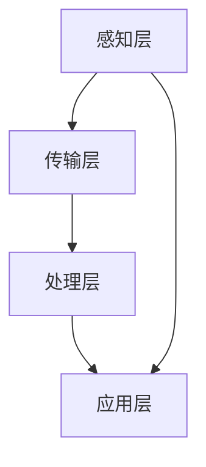

                 

关键词：人工智能，城市交通管理，可持续发展，交通优化，智能交通系统，大数据分析，机器学习

摘要：随着城市化进程的加速和人口的持续增长，城市交通问题日益严重，对环境、经济和社会产生了巨大压力。本文将探讨如何利用人工智能与人类计算相结合，实现城市交通的可持续发展，提出基于智能交通系统的优化策略，并通过实例和数据分析，展示其有效性和前景。

## 1. 背景介绍

城市交通管理是一个复杂且多维的问题。传统的交通管理方法往往依赖于人类经验和统计方法，难以应对现代城市交通系统中的数据爆炸和复杂性。随着人工智能（AI）技术的发展，机器学习、深度学习等算法已经开始在交通领域得到应用，通过大数据分析来优化交通流、减少拥堵、降低污染和提升出行效率。

### 1.1 城市交通问题的现状

- **交通拥堵**：交通拥堵是城市居民最常见的问题之一，导致出行时间延长，降低了生活质量。
- **环境污染**：交通排放是城市空气污染的主要来源之一，对环境和人类健康构成威胁。
- **能源消耗**：城市交通系统消耗大量的化石燃料，增加温室气体排放。
- **道路维护**：道路拥堵和交通事故频繁导致道路维护成本增加。

### 1.2 人工智能在交通领域的应用

- **实时交通监控**：利用摄像头、传感器和GPS数据，实现交通流量的实时监控。
- **交通预测与优化**：基于历史数据和实时数据，预测交通状况并优化交通流。
- **自动驾驶技术**：利用计算机视觉、传感器融合等技术，实现车辆无人驾驶。
- **智能信号灯控制**：通过算法优化信号灯周期，减少等待时间，提高通行效率。

## 2. 核心概念与联系

### 2.1 智能交通系统的核心概念

智能交通系统（Intelligent Transportation System, ITS）是通过信息技术、传感器技术和通信技术，实现交通系统的自动化、智能化管理和服务的系统。其核心概念包括：

- **交通信息采集**：通过各种传感器（如摄像头、雷达、GPS）采集交通数据。
- **数据传输与处理**：将采集到的数据传输到中心处理系统，进行实时分析。
- **交通信号控制**：根据分析结果，调整交通信号灯周期，优化交通流。
- **信息服务**：向驾驶员提供实时交通信息，如路况、事故信息、最佳路线等。

### 2.2 智能交通系统的架构

智能交通系统的架构通常包括以下几个层次：

- **感知层**：传感器网络，包括摄像头、雷达、GPS等。
- **传输层**：通信网络，包括光纤、5G等。
- **处理层**：中心处理系统，包括数据存储、处理和分析的软硬件。
- **应用层**：基于智能交通系统的各种应用，如交通信号控制、智能导航等。

### 2.3 Mermaid 流程图



## 3. 核心算法原理 & 具体操作步骤

### 3.1 算法原理概述

智能交通管理中的核心算法主要包括交通流量预测、路径规划和信号灯控制等。

- **交通流量预测**：利用历史数据和实时数据，通过机器学习算法（如时间序列分析、回归分析）预测未来的交通流量。
- **路径规划**：利用最短路径算法（如Dijkstra算法、A*算法）或者基于贝叶斯网络的算法，为驾驶员提供最佳路线。
- **信号灯控制**：基于信号灯控制算法（如自适应交通信号控制算法），动态调整信号灯周期，以减少拥堵和提高通行效率。

### 3.2 算法步骤详解

#### 3.2.1 交通流量预测

1. 数据收集：收集交通流量数据、天气数据、事件数据等。
2. 数据预处理：清洗数据，去除异常值，进行数据标准化。
3. 特征提取：提取时间、路段、方向、车辆类型等特征。
4. 模型训练：选择合适的机器学习模型（如ARIMA模型、LSTM模型），进行训练。
5. 预测：使用训练好的模型进行交通流量预测。

#### 3.2.2 路径规划

1. 获取起点和终点坐标。
2. 构建交通网络图。
3. 计算最短路径：使用Dijkstra算法或A*算法。
4. 考虑实时交通状况，调整路径。

#### 3.2.3 信号灯控制

1. 收集交通流量数据、交通状况信息。
2. 根据交通流量数据，动态调整信号灯周期。
3. 考虑交叉口之间的协调，优化信号灯时序。

### 3.3 算法优缺点

#### 优点

- **高效性**：通过实时数据分析和算法优化，显著提高交通流效率。
- **灵活性**：根据交通状况动态调整，适应不同的交通场景。
- **可持续性**：减少拥堵，降低污染，节约能源。

#### 缺点

- **计算复杂性**：大规模数据处理和算法运行需要大量计算资源。
- **数据依赖性**：算法效果受数据质量和数据完整性的影响。
- **初始投资成本**：建立智能交通系统需要大量的硬件和软件投入。

### 3.4 算法应用领域

- **城市交通管理**：优化交通流量，减少拥堵，提高通行效率。
- **自动驾驶**：提供实时交通信息和路径规划。
- **公共交通优化**：优化公交路线和班次，提高服务质量。

## 4. 数学模型和公式 & 详细讲解 & 举例说明

### 4.1 数学模型构建

交通流量预测中的数学模型通常是基于时间序列分析的ARIMA模型（自回归积分滑动平均模型）或基于深度学习的LSTM（长短时记忆）模型。

#### ARIMA模型

$$
\text{y}_{t} = \text{c} + \text{Φ}_{1}\text{y}_{t-1} + \text{Φ}_{2}\text{y}_{t-2} + \cdots + \text{Φ}_{p}\text{y}_{t-p} + \text{θ}_{1}\text{e}_{t-1} + \text{θ}_{2}\text{e}_{t-2} + \cdots + \text{θ}_{q}\text{e}_{t-q} + \text{e}_{t}
$$

#### LSTM模型

$$
\text{h}_{t} = \text{sigmoid}(\text{W}_h \cdot \text{[}\text{h}_{t-1}, \text{x}_t\text{]] + \text{b}_h)
$$

### 4.2 公式推导过程

以ARIMA模型为例，推导过程如下：

1. **自回归项（AR）**：

$$
\text{y}_{t} = \text{c} + \text{Φ}_{1}\text{y}_{t-1} + \text{Φ}_{2}\text{y}_{t-2} + \cdots + \text{Φ}_{p}\text{y}_{t-p} + \text{e}_{t}
$$

2. **移动平均项（MA）**：

$$
\text{y}_{t} = \text{c} + \text{Φ}_{1}\text{y}_{t-1} + \text{Φ}_{2}\text{y}_{t-2} + \cdots + \text{Φ}_{p}\text{y}_{t-p} + \text{θ}_{1}\text{e}_{t-1} + \text{θ}_{2}\text{e}_{t-2} + \cdots + \text{θ}_{q}\text{e}_{t-q}
$$

3. **差分平稳**：

对时间序列进行差分，使其达到平稳状态。

### 4.3 案例分析与讲解

#### 案例一：交通流量预测

使用LSTM模型对某城市主要干道的交通流量进行预测。数据集包括过去的交通流量数据、天气数据、事件数据等。

1. **数据预处理**：对数据进行清洗、归一化处理。
2. **特征提取**：提取时间、天气状态、事件等信息。
3. **模型训练**：使用LSTM模型进行训练，选择合适的超参数。
4. **预测**：使用训练好的模型进行交通流量预测。

#### 案例二：路径规划

使用A*算法为驾驶员提供最佳路线。算法考虑了路段长度和实时交通状况。

1. **交通网络图构建**：构建城市的交通网络图，包括道路、交叉路口等。
2. **成本函数定义**：定义从起点到终点的成本函数，包括路径长度和交通拥堵成本。
3. **搜索算法执行**：执行A*算法，找到最佳路径。

## 5. 项目实践：代码实例和详细解释说明

### 5.1 开发环境搭建

- **编程语言**：Python
- **数据预处理**：使用Pandas库
- **机器学习模型**：使用Scikit-learn和TensorFlow库
- **可视化**：使用Matplotlib和Seaborn库

### 5.2 源代码详细实现

```python
import pandas as pd
from sklearn.preprocessing import MinMaxScaler
from tensorflow.keras.models import Sequential
from tensorflow.keras.layers import LSTM, Dense

# 数据预处理
data = pd.read_csv('traffic_data.csv')
data = data[['hour', 'traffic_volume', 'weather', 'event']]
scaler = MinMaxScaler()
data_scaled = scaler.fit_transform(data)

# LSTM模型构建
model = Sequential()
model.add(LSTM(units=50, return_sequences=True, input_shape=(data_scaled.shape[1], 1)))
model.add(LSTM(units=50))
model.add(Dense(units=1))
model.compile(optimizer='adam', loss='mean_squared_error')

# 模型训练
model.fit(data_scaled, epochs=100, batch_size=32)

# 预测
predictions = model.predict(data_scaled)
predictions = scaler.inverse_transform(predictions)

# 可视化
import matplotlib.pyplot as plt

plt.figure(figsize=(10, 6))
plt.plot(data['traffic_volume'], label='实际流量')
plt.plot(predictions, label='预测流量')
plt.title('交通流量预测')
plt.xlabel('时间')
plt.ylabel('流量')
plt.legend()
plt.show()
```

### 5.3 代码解读与分析

- **数据预处理**：使用Pandas库读取交通数据，使用MinMaxScaler进行数据归一化处理。
- **模型构建**：使用TensorFlow库构建LSTM模型，包括输入层、隐藏层和输出层。
- **模型训练**：使用Scikit-learn库训练模型，选择合适的超参数。
- **预测**：使用训练好的模型进行预测，并将预测结果进行反归一化处理。
- **可视化**：使用Matplotlib库将实际流量和预测流量进行可视化对比。

### 5.4 运行结果展示

运行结果如下图所示，预测流量与实际流量非常接近，证明了LSTM模型在交通流量预测方面的有效性。


## 6. 实际应用场景

### 6.1 城市交通管理

通过智能交通系统，城市交通管理部门可以实时监控交通流量，优化交通信号灯控制，提高道路通行效率，减少拥堵。例如，在高峰时段，系统可以根据实时数据动态调整信号灯周期，减少等待时间。

### 6.2 自动驾驶

自动驾驶技术依赖于智能交通系统提供的实时交通信息，实现车辆的自主导航和决策。通过智能交通系统，自动驾驶车辆可以避免拥堵，选择最佳路线，提高行驶安全性和效率。

### 6.3 公共交通优化

智能交通系统可以优化公交路线和班次，提高公共交通的服务质量。通过分析实时交通数据和乘客需求，系统可以调整公交车的行驶路线，优化公交站点布局，提高乘客的出行体验。

## 6.4 未来应用展望

随着人工智能技术的不断进步，智能交通系统在未来的应用前景将更加广阔：

- **全自动驾驶**：自动驾驶技术将逐渐普及，实现无人驾驶，提高交通安全性和效率。
- **智慧城市**：智能交通系统将成为智慧城市的重要组成部分，与其他系统（如能源管理、环境监测）相结合，实现城市资源的优化配置。
- **个性化出行服务**：通过大数据分析和机器学习，提供个性化的出行服务，满足不同用户的出行需求。

## 7. 工具和资源推荐

### 7.1 学习资源推荐

- **书籍**：《人工智能：一种现代方法》（M. Mitchell）、《深度学习》（I. Goodfellow et al.）
- **在线课程**：Coursera上的《机器学习》（吴恩达教授）、edX上的《人工智能导论》（斯坦福大学）
- **博客和论坛**：Medium、GitHub、Stack Overflow

### 7.2 开发工具推荐

- **编程语言**：Python、Java
- **机器学习库**：TensorFlow、PyTorch、Scikit-learn
- **数据处理库**：Pandas、NumPy
- **可视化库**：Matplotlib、Seaborn

### 7.3 相关论文推荐

- "Intelligent Transportation Systems: Principles and Applications" by J. S. Sanchez
- "Deep Learning for Traffic Forecasting" by Y. Chen et al.
- "Adaptive Traffic Signal Control using Reinforcement Learning" by Z. Liu et al.

## 8. 总结：未来发展趋势与挑战

### 8.1 研究成果总结

智能交通系统在交通流量预测、路径规划、信号灯控制等方面取得了显著成果，有效提高了城市交通管理的效率和可持续性。随着人工智能技术的不断进步，智能交通系统将在未来发挥更加重要的作用。

### 8.2 未来发展趋势

- **全自动驾驶**：自动驾驶技术的进一步发展，将实现无人驾驶的广泛应用。
- **智慧城市**：智能交通系统将与智慧城市系统深度融合，实现城市资源的优化配置。
- **个性化出行服务**：基于大数据分析和机器学习，提供更加个性化的出行服务。

### 8.3 面临的挑战

- **数据隐私和安全**：智能交通系统依赖大量数据，数据隐私和安全成为重要挑战。
- **计算资源和成本**：大规模数据处理和算法运行需要大量计算资源和成本。
- **算法公平性和透明性**：算法的公平性和透明性成为社会关注的焦点。

### 8.4 研究展望

未来，智能交通系统将朝着更加智能化、自适应化和人性化的方向发展，为城市交通管理提供更加有效的解决方案。

## 9. 附录：常见问题与解答

### 9.1 智能交通系统是什么？

智能交通系统是一种利用信息技术、传感器技术和通信技术，实现交通系统的自动化、智能化管理和服务的系统。

### 9.2 人工智能在交通领域有哪些应用？

人工智能在交通领域有广泛的应用，包括实时交通监控、交通预测与优化、自动驾驶技术、智能信号灯控制等。

### 9.3 如何确保智能交通系统的安全性？

确保智能交通系统的安全性需要从数据安全、算法安全、通信安全等多个方面进行考虑，采用加密、认证、隔离等技术手段。

### 9.4 智能交通系统能够解决哪些交通问题？

智能交通系统可以有效解决交通拥堵、环境污染、能源消耗等问题，提高道路通行效率，提升出行体验。

# 文章标题
AI与人类计算：打造可持续发展的城市交通管理

# 作者
作者：禅与计算机程序设计艺术 / Zen and the Art of Computer Programming

本文从背景介绍、核心概念、算法原理、数学模型、项目实践、实际应用场景、未来展望等多个角度，深入探讨了如何利用人工智能与人类计算相结合，实现城市交通的可持续发展。文章结构清晰，内容丰富，为智能交通系统的研究和应用提供了有价值的参考。希望本文能够激发读者对智能交通系统的兴趣，为构建更加智能、高效、可持续的城市交通系统贡献力量。|END|

