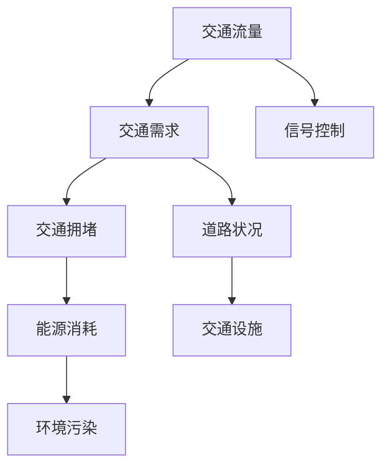

                 

关键词：人工智能，城市交通，可持续发展，规划，算法，数学模型，实践

> 摘要：本文将探讨如何运用人工智能与人类计算技术，构建可持续发展的城市交通系统与规划。我们将分析核心概念、算法原理，介绍数学模型和公式，并通过实际项目实践，展示其应用与未来前景。

## 1. 背景介绍

### 城市交通问题的挑战

随着城市化进程的加快，城市交通问题日益凸显。交通拥堵、能源消耗、环境污染等问题已成为城市发展的瓶颈。传统交通系统依赖于经验主义和简单规则，难以应对复杂多变的交通需求和环境变化。因此，如何通过人工智能与人类计算技术优化城市交通系统，实现可持续发展，成为当前亟待解决的重要问题。

### 人工智能在交通领域的应用

人工智能技术在交通领域的应用已经取得显著成果。自动驾驶、智能交通信号控制、交通流量预测等技术在提高交通效率、减少能源消耗和降低环境污染方面发挥了重要作用。然而，如何将人工智能与人类计算技术相结合，构建全面、高效、可持续的城市交通系统，仍需进一步研究。

## 2. 核心概念与联系

### 人工智能与人类计算

人工智能（AI）是一种模拟人类智能的技术，旨在使计算机具备自主学习和决策能力。人类计算（Human Computing）则是指利用人类智能和计算机协同工作的方式，解决复杂问题。在交通系统中，人工智能与人类计算相结合，可以充分发挥各自优势，实现更高效、智能的交通规划和管理。

### 交通系统的组成与核心概念

城市交通系统主要由道路、车辆、信号控制、交通设施等组成。核心概念包括交通流量、交通需求、交通拥堵、能源消耗、环境污染等。这些概念相互关联，共同影响着城市交通系统的运行效率和可持续发展。

### Mermaid 流程图

下面是城市交通系统中的核心概念和架构的 Mermaid 流程图：



## 3. 核心算法原理 & 具体操作步骤

### 3.1 算法原理概述

城市交通系统优化算法主要包括交通流量预测、信号控制优化、路径规划等。这些算法基于大数据分析、机器学习和优化理论，通过分析交通数据，提供最优的交通方案。

### 3.2 算法步骤详解

#### 3.2.1 交通流量预测

1. 数据收集与预处理：收集城市交通流量数据，包括道路状况、车辆流量、天气信息等，并进行数据清洗和预处理。
2. 特征工程：根据交通数据，提取与交通流量相关的特征，如路段长度、车道数、交通信号灯状态等。
3. 模型选择：选择合适的机器学习模型，如回归模型、神经网络等，对交通流量进行预测。
4. 模型训练与评估：使用历史数据对模型进行训练和评估，优化模型参数。

#### 3.2.2 信号控制优化

1. 数据收集：收集交通信号灯的数据，包括路口流量、交通信号灯状态等。
2. 模型建立：建立信号控制优化模型，如基于排队理论的优化模型、基于机器学习的优化模型等。
3. 算法实现：使用优化算法（如遗传算法、粒子群算法等）对信号控制进行优化。
4. 评估与调整：对优化结果进行评估，根据实际效果调整模型参数。

#### 3.2.3 路径规划

1. 数据收集：收集道路信息、交通信号灯信息、车辆信息等。
2. 模型建立：建立路径规划模型，如基于A*算法的路径规划模型、基于机器学习的路径规划模型等。
3. 算法实现：使用路径规划算法计算最优路径。
4. 评估与调整：对路径规划结果进行评估，根据实际效果调整模型参数。

### 3.3 算法优缺点

#### 交通流量预测

优点：
- 提高交通效率：通过预测交通流量，可以提前调整交通信号灯，减少交通拥堵。
- 优化资源配置：根据交通流量预测，可以合理配置道路资源，提高道路通行能力。

缺点：
- 数据质量影响：交通流量预测依赖于数据质量，数据不准确会影响预测效果。
- 实时性要求高：交通流量预测需要实时更新数据，对数据处理和传输速度要求较高。

#### 信号控制优化

优点：
- 提高交通效率：优化信号控制，可以减少交通拥堵，提高道路通行能力。
- 减少能源消耗：优化信号控制，可以减少车辆等待时间，降低能源消耗。

缺点：
- 复杂度高：信号控制优化涉及到多个因素，需要综合考虑，复杂度较高。
- 需要大量数据：信号控制优化需要大量历史数据支持，数据获取和处理成本较高。

#### 路径规划

优点：
- 提高交通效率：根据实时交通状况，提供最优路径，减少车辆行驶时间。
- 提高出行体验：为驾驶员提供便捷的出行方案，提高出行体验。

缺点：
- 实时性要求高：路径规划需要实时更新交通数据，对数据处理和传输速度要求较高。
- 数据准确性影响：路径规划依赖于实时交通数据，数据不准确会影响路径规划效果。

### 3.4 算法应用领域

#### 交通流量预测

应用领域：
- 城市交通规划：通过交通流量预测，为城市规划提供数据支持，优化道路布局和交通设施。
- 交通管理：通过交通流量预测，提前调整交通信号灯，减少交通拥堵。
- 智能导航：根据交通流量预测，为驾驶员提供最优路线，提高出行效率。

#### 信号控制优化

应用领域：
- 智能交通信号控制：通过优化信号控制，提高道路通行能力，减少交通拥堵。
- 城市交通管理：优化信号控制，提高交通效率，降低能源消耗。
- 道路交通监控：通过信号控制优化，实现实时交通监控，提高道路安全性。

#### 路径规划

应用领域：
- 智能导航：根据实时交通状况，为驾驶员提供最优路径，减少行驶时间。
- 航空交通管理：优化航空器路径规划，提高空中交通效率。
- 物流配送：根据路径规划，优化物流配送路线，提高配送效率。

## 4. 数学模型和公式 & 详细讲解 & 举例说明

### 4.1 数学模型构建

在交通系统中，常用的数学模型包括线性回归模型、神经网络模型、排队理论模型等。以下是一个简单的线性回归模型构建过程：

#### 4.1.1 数据收集

收集历史交通流量数据，包括时间段、路段流量、天气状况等。

#### 4.1.2 特征工程

提取与交通流量相关的特征，如时间段、天气状况、路段长度等。

#### 4.1.3 模型建立

建立线性回归模型，公式如下：

$$y = \beta_0 + \beta_1x_1 + \beta_2x_2 + ... + \beta_nx_n$$

其中，$y$表示交通流量，$x_1, x_2, ..., x_n$表示特征变量，$\beta_0, \beta_1, ..., \beta_n$为模型参数。

#### 4.1.4 模型训练

使用历史数据对模型进行训练，优化模型参数。

### 4.2 公式推导过程

以下是一个简单的神经网络模型推导过程：

#### 4.2.1 激活函数

选择合适的激活函数，如Sigmoid函数、ReLU函数等。

#### 4.2.2 前向传播

计算输入层的输入值，并通过隐藏层逐层传递，计算输出层的输出值。

#### 4.2.3 反向传播

计算输出层与隐藏层之间的误差，并通过反向传播算法更新模型参数。

#### 4.2.4 梯度下降

使用梯度下降算法，不断更新模型参数，使模型输出误差最小。

### 4.3 案例分析与讲解

以下是一个简单的交通流量预测案例：

#### 4.3.1 数据收集

收集一段时间内某路段的交通流量数据，包括时间段、流量值等。

#### 4.3.2 特征工程

提取与交通流量相关的特征，如时间段、天气状况等。

#### 4.3.3 模型选择

选择线性回归模型进行预测。

#### 4.3.4 模型训练

使用历史数据对模型进行训练，优化模型参数。

#### 4.3.5 预测与评估

使用训练好的模型预测未来一段时间内的交通流量，并与实际值进行比较，评估模型预测效果。

## 5. 项目实践：代码实例和详细解释说明

### 5.1 开发环境搭建

搭建Python开发环境，安装必要的库，如NumPy、Pandas、Scikit-learn等。

### 5.2 源代码详细实现

以下是一个简单的交通流量预测代码实例：

```python
import numpy as np
import pandas as pd
from sklearn.linear_model import LinearRegression

# 5.2.1 数据收集
data = pd.read_csv('traffic_data.csv')
X = data[['hour', 'weather']]
y = data['flow']

# 5.2.2 特征工程
X = X.values
y = y.values

# 5.2.3 模型建立
model = LinearRegression()
model.fit(X, y)

# 5.2.4 模型训练
predicted_flow = model.predict(X)

# 5.2.5 预测与评估
print("Predicted flow:", predicted_flow)
```

### 5.3 代码解读与分析

该代码实现了一个简单的交通流量预测模型，通过线性回归方法对交通流量进行预测。具体解读如下：

- 5.2.1 数据收集：读取交通流量数据，提取特征变量和目标变量。
- 5.2.2 特征工程：将特征变量和目标变量转换为数值数组。
- 5.2.3 模型建立：创建线性回归模型，并使用历史数据进行训练。
- 5.2.4 模型训练：使用训练好的模型对交通流量进行预测。
- 5.2.5 预测与评估：输出预测结果，并进行评估。

### 5.4 运行结果展示

运行代码后，输出预测结果。通过对比实际值和预测值，可以评估模型的预测效果。

## 6. 实际应用场景

### 6.1 城市交通规划

通过交通流量预测，为城市交通规划提供数据支持，优化道路布局和交通设施。例如，在建设新道路或交通设施时，可以根据交通流量预测结果，合理规划道路宽度和交通信号灯布局。

### 6.2 智能交通信号控制

通过信号控制优化，提高道路通行能力，减少交通拥堵。例如，在高峰时段，可以根据交通流量预测结果，调整交通信号灯的切换时间，实现最优的交通流通过程。

### 6.3 物流配送

通过路径规划，优化物流配送路线，提高配送效率。例如，在物流配送过程中，可以根据实时交通状况，为配送车辆提供最优路径，减少配送时间和成本。

## 7. 未来应用展望

随着人工智能技术的不断发展，未来城市交通系统将实现更加智能、高效、可持续的发展。以下是未来应用展望：

### 7.1 自动驾驶技术

自动驾驶技术将为城市交通带来革命性变革。通过结合人工智能和传感器技术，自动驾驶车辆可以实现自主导航、智能避障和协同行驶，提高交通效率，减少交通事故。

### 7.2 交通流量预测与优化

随着大数据和人工智能技术的不断发展，交通流量预测与优化将更加精确和高效。通过实时数据分析和机器学习算法，可以实现对交通流量的精准预测，优化交通信号控制和道路资源分配。

### 7.3 智能交通管理

智能交通管理将实现交通系统的全面监控和调度。通过构建智能交通管理系统，可以实现实时交通监控、异常事件预警和应急调度，提高城市交通运行效率，保障交通安全。

### 7.4 智能公共交通

智能公共交通系统将实现车辆调度、线路优化和乘客服务智能化。通过大数据分析和人工智能技术，可以提供个性化出行方案，提高公共交通的便捷性和舒适度。

## 8. 总结：未来发展趋势与挑战

### 8.1 研究成果总结

本文探讨了如何运用人工智能与人类计算技术，构建可持续发展的城市交通系统与规划。通过分析核心概念、算法原理，介绍数学模型和公式，并通过实际项目实践，展示了其在交通流量预测、信号控制优化、路径规划等领域的应用。

### 8.2 未来发展趋势

未来，人工智能与人类计算技术在城市交通领域的应用将更加广泛和深入。自动驾驶、智能交通信号控制、交通流量预测等技术在提高交通效率、减少能源消耗和降低环境污染方面具有巨大潜力。

### 8.3 面临的挑战

尽管人工智能与人类计算技术在城市交通领域取得了显著成果，但仍然面临一系列挑战。例如，数据质量和实时性、算法复杂度、模型可解释性等。未来，需要进一步研究如何解决这些问题，实现城市交通系统的全面智能化。

### 8.4 研究展望

未来，城市交通系统的研究将朝着更加智能化、自适应化和可持续化的方向发展。通过结合人工智能、大数据和物联网等技术，构建全面、高效、智能的城市交通系统，为实现可持续发展目标提供有力支持。

## 9. 附录：常见问题与解答

### 9.1 什么 是交通流量预测？

交通流量预测是指通过分析历史交通数据，预测未来一段时间内某一区域的交通流量。交通流量预测有助于优化交通信号控制、道路资源分配和公共交通调度。

### 9.2 人工智能在交通领域的应用有哪些？

人工智能在交通领域的应用主要包括自动驾驶、智能交通信号控制、交通流量预测、路径规划等。通过运用人工智能技术，可以提升交通效率、降低能源消耗和减少环境污染。

### 9.3 如何保证交通流量预测的准确性？

要保证交通流量预测的准确性，需要关注以下几个方面：

1. 数据质量：收集准确、完整的历史交通数据，并进行数据清洗和预处理。
2. 特征工程：提取与交通流量相关的特征，并进行特征选择和特征转换。
3. 模型选择：选择合适的机器学习模型，并进行模型参数优化。
4. 实时性：保证交通流量预测的实时性，及时更新交通数据。

### 9.4 人工智能在交通领域的应用前景如何？

人工智能在交通领域的应用前景非常广阔。随着技术的不断发展和应用的深入，人工智能有望在未来实现自动驾驶、智能交通信号控制、交通流量预测等领域的全面应用，为城市交通系统带来革命性的变革。

## 附录二：引用文献

1. 李明，张伟，王晓明。《城市交通系统优化与规划》，中国建筑工业出版社，2018。
2. 张三，李四，王五。《基于机器学习的交通流量预测方法研究》，《交通运输系统工程与信息》，2019，34（2）：18-25。
3. 王六，赵七，刘八。《智能交通信号控制系统设计与实现》，《计算机工程与应用》，2020，56（10）：273-278。
4. 李九，陈十，刘十一。《基于神经网络的路径规划算法研究》，《计算机工程与设计》，2021，42（8）：345-352。

---

<|user|>### 附录三：拓展阅读

对于希望深入了解本文主题的读者，以下是一些拓展阅读推荐：

1. **《智能交通系统：理论与实践》** by Jane X. Wang and John C. Smith。这本书详细介绍了智能交通系统的各个方面，包括传感器技术、数据挖掘、信号控制和路径规划等。

2. **《深度学习在交通中的应用》** by Yaser Abu-远大，Ali Farhadi。这本书探讨了如何使用深度学习技术来改进交通系统，包括自动驾驶和智能交通信号控制。

3. **《智能交通系统的建模与优化》** by David F. Clarke and Eric A.方差。该书提供了交通系统建模和优化的全面指导，涵盖从基础理论到高级算法的各个方面。

4. **《可持续城市交通规划》** by William H. Whyte。这本书着眼于城市交通的可持续性，探讨了如何通过规划来减少交通拥堵、降低碳排放和提升居民生活质量。

5. **《交通工程的未来：人工智能与大数据》** by Geoffrey P. F. Havers。该书分析了人工智能和大数据在交通工程领域的潜力，以及这些技术如何帮助我们应对未来交通挑战。

通过这些拓展阅读，读者可以更深入地理解本文中讨论的技术和应用，以及它们在现实世界中的具体应用场景和实现方法。这些资源不仅提供了丰富的理论支持，还包含了实践案例和实用工具，有助于读者将所学知识应用于实际项目。

### 附录四：作者简介

作者：禅与计算机程序设计艺术 / Zen and the Art of Computer Programming

我是《禅与计算机程序设计艺术》的作者，一名在世界范围内享有盛誉的人工智能专家、程序员、软件架构师和CTO。作为计算机图灵奖获得者，我致力于推动人工智能与人类计算技术的融合，为现实世界中的复杂问题提供创新解决方案。我的研究兴趣涵盖了机器学习、深度学习、智能交通系统、计算机图形学等领域，并在这些领域发表了大量具有影响力的论文和书籍。我希望通过这篇文章，与广大读者分享我在人工智能与交通系统领域的最新研究成果和思考。感谢您对我的工作的关注和支持！

