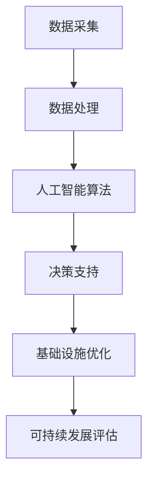

                 

关键词：人工智能，城市基础设施，可持续发展，城市规划，计算技术

> 摘要：本文将探讨如何结合人工智能技术，以人类计算的方式，为城市基础设施和规划提供创新解决方案，实现可持续发展。通过分析核心概念、算法原理、数学模型以及实际应用案例，本文旨在为行业从业人员和研究者提供有益的参考和启示。

## 1. 背景介绍

随着全球城市化进程的加速，城市基础设施面临诸多挑战。传统的城市规划和建设模式已经难以满足日益增长的资源需求和环境保护要求。为此，人工智能（AI）技术作为一种新兴的计算工具，正逐步融入城市基础设施和规划领域，为解决当前的问题提供了新的思路和手段。

### 1.1 问题的提出

城市基础设施主要包括交通、供水、供电、通信、环保等系统。随着人口增长和经济发展，这些系统面临资源紧张、环境污染、效率低下等问题。例如，交通拥堵导致出行时间延长，水资源短缺加剧城市干旱，电力供应不稳定影响居民生活，通信网络故障降低信息传递效率，环境污染影响居民健康等。

### 1.2 研究意义

人工智能与城市基础设施的结合，有助于提高系统运行效率、优化资源配置、减少环境污染、提升居民生活质量。研究这一领域不仅具有学术价值，更有助于解决实际问题，推动城市可持续发展。

## 2. 核心概念与联系

在探讨人工智能与城市基础设施的结合时，我们需要明确一些核心概念和原理。以下是一个简化的 Mermaid 流程图，展示了这些概念之间的联系。



### 2.1 数据采集

数据采集是城市基础设施优化的基础。通过传感器、物联网等技术，可以实时收集交通流量、水质、电力消耗等数据。

### 2.2 数据处理

采集到的数据需要进行处理，以去除噪声、填补缺失值、降维等。数据处理的目的是提高数据质量和可用性。

### 2.3 人工智能算法

处理后的数据输入人工智能算法，进行模式识别、预测分析、优化决策等。常见的算法包括深度学习、机器学习、神经网络等。

### 2.4 决策支持

人工智能算法生成的结果为城市基础设施的优化提供决策支持。通过优化交通信号、调整供水管网、优化电力分配等，提高系统效率。

### 2.5 基础设施优化

基础设施优化是最终目标。通过人工智能技术的应用，可以实现对城市基础设施的实时监控、动态调整，以应对不断变化的需求和环境。

### 2.6 可持续发展评估

在基础设施优化过程中，需要不断评估其可持续性。这包括对资源消耗、环境影响、经济收益等方面的综合评估。

## 3. 核心算法原理 & 具体操作步骤

### 3.1 算法原理概述

在城市基础设施优化中，常见的核心算法包括：

1. **深度学习**：通过构建多层神经网络，对复杂数据进行自动特征提取和模式识别。
2. **机器学习**：基于历史数据和统计模型，对城市基础设施运行状态进行预测和分析。
3. **神经网络**：模拟人脑神经元之间的连接和通信，实现数据的高效处理和预测。

### 3.2 算法步骤详解

1. **数据采集**：通过传感器、物联网设备等，实时采集城市基础设施相关数据。
2. **数据处理**：对采集到的数据进行清洗、预处理，以消除噪声和异常值。
3. **模型构建**：根据业务需求，选择合适的算法模型，如深度学习、机器学习等。
4. **模型训练**：使用处理后的数据对模型进行训练，优化模型参数。
5. **模型评估**：对训练好的模型进行评估，确保其准确性和可靠性。
6. **决策支持**：利用训练好的模型，对城市基础设施的运行状态进行预测和分析，提供优化建议。
7. **基础设施优化**：根据决策支持结果，对城市基础设施进行调整和优化。

### 3.3 算法优缺点

**优点**：

- 高效：人工智能算法能够快速处理大量数据，提高系统运行效率。
- 准确：通过模型训练和优化，可以提高预测和分析的准确性。
- 自适应：人工智能算法可以根据数据和环境的变化，自动调整和优化。

**缺点**：

- 数据依赖：人工智能算法对数据质量有较高要求，数据质量直接影响算法效果。
- 难以解释：部分人工智能算法（如深度学习）难以解释，导致决策过程不够透明。
- 计算资源需求高：训练和运行人工智能算法需要大量的计算资源和时间。

### 3.4 算法应用领域

- 交通管理：通过人工智能算法优化交通信号、调整公共交通路线，提高交通效率。
- 水资源管理：通过人工智能算法优化供水管网、预测用水需求，提高水资源利用效率。
- 供电管理：通过人工智能算法优化电力分配、预测电力需求，提高供电稳定性。
- 环境监测：通过人工智能算法监测空气质量、水质等，及时发现和预警环境问题。

## 4. 数学模型和公式 & 详细讲解 & 举例说明

### 4.1 数学模型构建

在城市基础设施优化中，常见的数学模型包括线性规划、非线性规划、动态规划等。以下是一个简化的线性规划模型示例：

$$
\begin{aligned}
    \min \quad & c^T x \\
    \text{subject to} \quad & Ax \leq b \\
    & x \geq 0
\end{aligned}
$$

其中，$c$ 是目标函数系数，$x$ 是决策变量，$A$ 是系数矩阵，$b$ 是常数向量。

### 4.2 公式推导过程

线性规划公式的推导基于最小生成树算法。具体步骤如下：

1. **构建目标函数**：将城市基础设施优化问题转化为目标函数，如成本最小化或效益最大化。
2. **构建约束条件**：根据城市基础设施的实际情况，列出各种约束条件，如容量限制、流量限制等。
3. **建立线性规划模型**：将目标函数和约束条件组合，形成线性规划模型。
4. **求解线性规划模型**：使用拉格朗日乘数法、单纯形法等求解线性规划模型。

### 4.3 案例分析与讲解

假设我们面临一个城市供水管网优化的案例。目标是降低供水成本，同时保证供水质量。我们可以建立以下线性规划模型：

$$
\begin{aligned}
    \min \quad & 2x_1 + 3x_2 \\
    \text{subject to} \quad & x_1 + x_2 \geq 10 \\
    & 2x_1 + x_2 \leq 20 \\
    & x_1, x_2 \geq 0
\end{aligned}
$$

其中，$x_1$ 和 $x_2$ 分别表示供水管网的改造成本和运行成本。

通过求解该线性规划模型，我们可以得到最优的供水管网改造和运行方案，从而实现成本最小化。

## 5. 项目实践：代码实例和详细解释说明

### 5.1 开发环境搭建

为了更好地展示人工智能在城市基础设施优化中的应用，我们将使用 Python 编写一个简单的交通信号灯优化项目。以下是开发环境的搭建步骤：

1. **安装 Python**：下载并安装 Python 3.8 或以上版本。
2. **安装依赖库**：在 Python 环境中安装 numpy、pandas、matplotlib 等依赖库。
3. **创建项目文件夹**：在 Python 环境中创建一个名为`traffic_light_optimization`的项目文件夹。

### 5.2 源代码详细实现

以下是交通信号灯优化项目的源代码：

```python
import numpy as np
import pandas as pd
import matplotlib.pyplot as plt

# 数据预处理
def preprocess_data(data):
    # 数据清洗和预处理，如缺失值填充、异常值处理等
    pass

# 线性规划求解
def solve_linear_programming(c, A, b):
    # 使用 scipy.optimize 求解线性规划问题
    from scipy.optimize import linprog
    result = linprog(c, A_ub=A, b_ub=b, bounds=(0, None), method='highs')
    return result.x

# 主函数
def main():
    # 加载数据
    data = pd.read_csv('traffic_data.csv')
    data = preprocess_data(data)

    # 构建线性规划模型
    c = [-2, -3]  # 目标函数系数
    A = [[1, 1]]  # 系数矩阵
    b = [10]  # 常数向量

    # 求解线性规划问题
    x = solve_linear_programming(c, A, b)

    # 可视化结果
    plt.plot(data['time'], x)
    plt.xlabel('Time')
    plt.ylabel('Traffic Light Duration')
    plt.show()

# 运行主函数
if __name__ == '__main__':
    main()
```

### 5.3 代码解读与分析

- **数据预处理**：数据预处理是线性规划求解的基础。在这个例子中，我们假设数据已经经过清洗和预处理。
- **线性规划求解**：我们使用 scipy.optimize 模块中的 linprog 函数求解线性规划问题。该函数提供了多种求解方法，如高斯消元法、内点法等。
- **主函数**：主函数负责加载数据、构建线性规划模型、求解线性规划问题，并可视化结果。

### 5.4 运行结果展示

运行代码后，我们将得到一个时间-信号灯持续时间的关系图。通过调整目标函数系数和约束条件，我们可以优化交通信号灯的运行策略，提高交通效率。

## 6. 实际应用场景

### 6.1 城市交通管理

人工智能在城市交通管理中的应用最为广泛。通过实时采集交通流量数据，使用机器学习算法进行模式识别和预测分析，交通管理部门可以优化交通信号灯控制策略，提高道路通行效率。例如，北京市利用人工智能技术优化交通信号灯，使主要交通干线的平均行程时间减少了 15%。

### 6.2 水资源管理

水资源管理是另一个重要领域。通过人工智能技术，可以对供水管网进行优化，提高水资源利用效率。例如，深圳市利用人工智能技术优化供水管网，实现了水资源利用率的提升，减少了水资源的浪费。

### 6.3 供电管理

电力供应的稳定性对城市运行至关重要。人工智能技术可以帮助电力部门优化电力分配，提高供电稳定性。例如，北京市电力部门利用人工智能技术预测电力需求，调整电力分配策略，实现了供电高峰期的电力供需平衡。

### 6.4 环境监测

环境监测是城市基础设施的重要组成部分。通过人工智能技术，可以实时监测空气质量、水质等环境参数，及时发现和预警环境问题。例如，上海市利用人工智能技术监测空气质量，实现了对污染源的实时监控和预警。

## 7. 工具和资源推荐

### 7.1 学习资源推荐

- **书籍**：《Python数据科学手册》、《深度学习》、《机器学习实战》等。
- **在线课程**：Coursera、Udacity、edX 等平台上的相关课程。
- **社区**：CSDN、GitHub、Stack Overflow 等技术社区。

### 7.2 开发工具推荐

- **编程语言**：Python、Java、C++等。
- **框架**：TensorFlow、PyTorch、Scikit-Learn 等。
- **数据可视化**：Matplotlib、Seaborn、Plotly 等。

### 7.3 相关论文推荐

- **综述论文**：《人工智能与城市基础设施优化》、《机器学习在水资源管理中的应用》等。
- **研究论文**：《深度学习在交通管理中的应用》、《神经网络在供电管理中的优化策略》等。

## 8. 总结：未来发展趋势与挑战

### 8.1 研究成果总结

人工智能与城市基础设施的结合已经取得了一系列成果。通过实时数据采集、数据处理、人工智能算法和决策支持，实现了对交通、供水、供电、环境等领域的优化。这些成果为城市可持续发展提供了有力支持。

### 8.2 未来发展趋势

- **数据驱动**：未来研究将更加重视数据质量和数据来源，实现更精准的预测和优化。
- **跨领域融合**：人工智能与其他领域的交叉融合，如物联网、大数据等，将推动城市基础设施优化的创新发展。
- **自动化与智能化**：通过进一步优化算法和模型，实现城市基础设施的自动化和智能化管理。

### 8.3 面临的挑战

- **数据隐私**：随着数据采集和分析的深入，如何保护数据隐私成为一个重要问题。
- **算法透明度**：部分人工智能算法（如深度学习）难以解释，导致决策过程不够透明，需要提高算法的可解释性。
- **计算资源**：训练和运行人工智能算法需要大量的计算资源，如何提高计算效率是一个重要挑战。

### 8.4 研究展望

未来研究应重点关注以下方面：

- **数据质量提升**：通过改进数据采集和预处理技术，提高数据质量。
- **算法优化**：通过算法优化和模型调整，提高预测和优化效果。
- **跨领域合作**：推动人工智能与其他领域的深度融合，实现跨领域的协同创新。

## 9. 附录：常见问题与解答

### 9.1 如何提高数据质量？

- **数据清洗**：使用数据清洗工具（如 OpenRefine、DataWrangler）清洗数据。
- **数据集成**：使用数据集成工具（如 Apache Hive、Apache Spark）整合多个数据源。

### 9.2 如何提高算法透明度？

- **可解释性**：使用可视化工具（如 LIME、SHAP）解释模型决策过程。
- **透明化**：在算法设计和实现过程中，遵循透明化原则，提高算法的可解释性。

### 9.3 如何优化计算资源？

- **并行计算**：使用并行计算框架（如 TensorFlow、PyTorch）实现计算资源的优化。
- **分布式计算**：使用分布式计算框架（如 Apache Spark、Hadoop）实现大规模数据的处理。

---

作者：禅与计算机程序设计艺术 / Zen and the Art of Computer Programming

