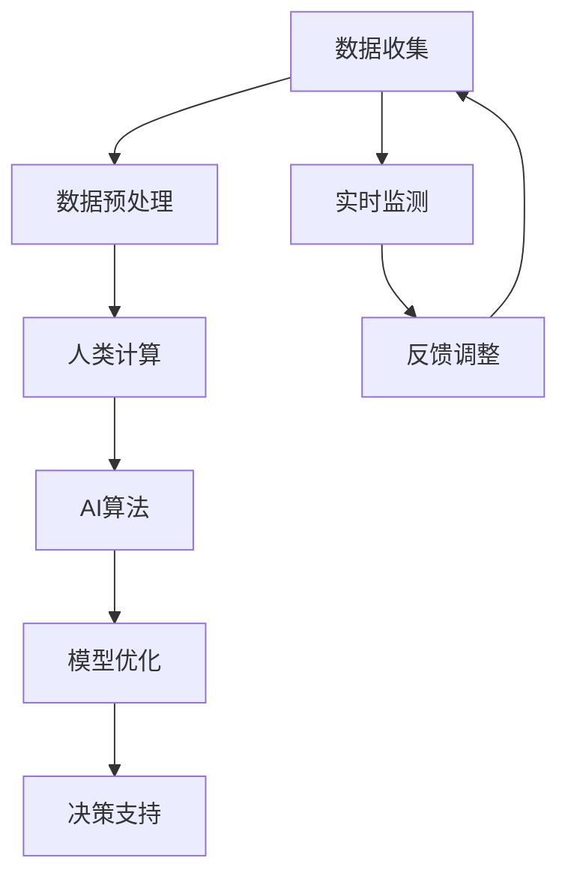

                 

关键词：人工智能、人类计算、城市模型、可持续发展、算法原理、数学模型、项目实践、实际应用场景、未来展望

> 摘要：本文探讨了人工智能与人类计算在打造可持续发展城市模型中的关键作用。通过深入剖析核心算法原理、数学模型构建、以及具体项目实践，本文旨在为读者提供全面的技术视角，并展望该领域的未来发展趋势与挑战。

## 1. 背景介绍

随着城市化进程的加速，城市规模不断扩大，人口密度逐渐增加，城市交通、能源消耗、环境污染等问题日益突出。可持续发展成为全球关注的焦点，而人工智能（AI）作为现代科技的前沿力量，在解决城市复杂问题上展现了巨大的潜力。人类计算与AI的结合，为打造可持续发展的城市模型提供了新的路径。

本文将围绕AI与人类计算在可持续发展城市模型中的应用，从核心算法原理、数学模型构建、项目实践等方面进行深入探讨。旨在为读者提供全面的技术视角，助力实现城市可持续发展的目标。

## 2. 核心概念与联系

### 2.1. 人工智能（AI）

人工智能是指通过计算机模拟人类的感知、思考、学习、决策等过程，使其具备类似于人类的智能。AI技术在城市可持续发展中的应用，主要体现在以下方面：

1. **数据挖掘与分析**：利用AI技术从海量数据中提取有价值的信息，为城市规划提供科学依据。
2. **智能交通管理**：通过AI算法优化交通信号，缓解交通拥堵，提高道路通行效率。
3. **能源管理**：基于AI技术进行能源需求预测，优化能源配置，降低能源消耗。

### 2.2. 人类计算

人类计算是指人类在解决问题时采用的逻辑思维、直觉判断、经验总结等思维方式。在可持续发展城市模型中，人类计算的作用主要体现在以下方面：

1. **需求分析**：通过人类计算方法，识别城市可持续发展中的关键问题，为AI算法提供明确的优化目标。
2. **决策支持**：借助人类计算经验，对AI算法的输出结果进行判断和修正，提高决策的科学性和实用性。

### 2.3. 核心概念原理与架构

为了更好地理解AI与人类计算在可持续发展城市模型中的应用，我们采用Mermaid流程图展示其核心概念原理与架构：



### 2.4. Mermaid 流程图

以下是本节的核心概念原理与架构的Mermaid流程图：


## 3. 核心算法原理 & 具体操作步骤

### 3.1. 算法原理概述

在可持续发展城市模型中，核心算法主要包括数据挖掘、机器学习、深度学习等。以下将详细介绍这些算法的原理。

#### 3.1.1. 数据挖掘

数据挖掘是一种从大量数据中发现有价值信息的方法，其原理基于统计学、模式识别和机器学习等技术。数据挖掘的主要过程包括数据收集、数据预处理、特征提取、模型训练和评估等。

#### 3.1.2. 机器学习

机器学习是一种让计算机通过数据学习并改进自身性能的技术。其主要原理包括监督学习、无监督学习和半监督学习。监督学习通过已标记的数据训练模型，无监督学习通过未标记的数据发现数据分布，半监督学习结合了监督学习和无监督学习。

#### 3.1.3. 深度学习

深度学习是一种基于多层神经网络进行学习的方法。其主要原理是通过前向传播和反向传播算法，逐步调整网络参数，使模型在训练数据上达到最佳效果。

### 3.2. 算法步骤详解

以下将详细介绍核心算法的具体操作步骤。

#### 3.2.1. 数据挖掘步骤

1. **数据收集**：从各种渠道收集城市相关的数据，如交通流量、能源消耗、环境质量等。
2. **数据预处理**：对收集到的数据进行清洗、去噪、归一化等处理，使其满足模型训练的要求。
3. **特征提取**：根据数据挖掘的目标，从预处理后的数据中提取具有代表性的特征。
4. **模型训练**：利用已提取的特征训练数据挖掘模型，如决策树、支持向量机、神经网络等。
5. **模型评估**：对训练好的模型进行评估，选择性能最优的模型。

#### 3.2.2. 机器学习步骤

1. **数据集划分**：将数据集划分为训练集、验证集和测试集。
2. **特征工程**：根据业务需求，对数据进行特征提取和特征选择。
3. **模型选择**：选择合适的机器学习模型，如线性回归、逻辑回归、决策树、随机森林、支持向量机等。
4. **模型训练**：利用训练集训练模型，调整模型参数。
5. **模型评估**：利用验证集评估模型性能，调整模型参数。
6. **模型测试**：利用测试集测试模型性能，确保模型在未知数据上的表现良好。

#### 3.2.3. 深度学习步骤

1. **数据集划分**：与机器学习步骤相同。
2. **网络结构设计**：根据任务需求，设计合适的深度学习网络结构，如卷积神经网络（CNN）、循环神经网络（RNN）、长短时记忆网络（LSTM）等。
3. **模型训练**：利用训练集训练深度学习模型，调整网络参数。
4. **模型评估**：利用验证集评估模型性能，调整模型参数。
5. **模型测试**：与机器学习步骤相同。

### 3.3. 算法优缺点

#### 3.3.1. 数据挖掘

**优点**：

- **高效性**：能够从海量数据中快速提取有价值信息。
- **广泛适用性**：适用于各类数据类型和场景。

**缺点**：

- **数据质量要求高**：数据清洗和预处理过程繁琐，对数据质量要求较高。
- **结果解释性差**：挖掘结果往往难以解释，缺乏透明性。

#### 3.3.2. 机器学习

**优点**：

- **自动化**：能够自动调整模型参数，减少人工干预。
- **高精度**：在训练数据足够的情况下，能够达到较高的预测精度。

**缺点**：

- **对数据质量要求高**：模型训练效果受数据质量影响较大。
- **黑箱化**：模型训练过程和结果难以解释，缺乏透明性。

#### 3.3.3. 深度学习

**优点**：

- **强大的表征能力**：能够处理高维数据和复杂的非线性关系。
- **高效性**：能够在大量数据上快速训练模型。

**缺点**：

- **计算资源需求高**：训练过程需要大量计算资源，如GPU等。
- **模型解释性差**：训练过程和结果难以解释，缺乏透明性。

### 3.4. 算法应用领域

#### 3.4.1. 交通管理

通过AI算法对交通流量进行分析和预测，优化交通信号控制，缓解交通拥堵，提高道路通行效率。

#### 3.4.2. 能源管理

利用AI算法对能源消耗进行预测和优化，降低能源消耗，提高能源利用效率。

#### 3.4.3. 环境监测

通过AI算法对环境质量进行监测和分析，预测污染趋势，制定有效的污染治理措施。

## 4. 数学模型和公式 & 详细讲解 & 举例说明

### 4.1. 数学模型构建

在可持续发展城市模型中，数学模型主要用于描述城市各个系统的运行规律和相互作用。以下是一个简单的数学模型构建过程：

#### 4.1.1. 城市交通模型

假设城市交通系统的流量为 \(Q\)，道路长度为 \(L\)，交通信号周期为 \(T\)。根据交通流量的波动特性，我们可以建立以下数学模型：

\[ Q = Q_0 \cdot e^{-\lambda T} \]

其中，\(Q_0\) 为初始流量，\(\lambda\) 为流量衰减系数。

#### 4.1.2. 城市能源模型

假设城市能源消耗为 \(E\)，人口数量为 \(N\)，能源利用率为 \(R\)。根据能源消耗的线性关系，我们可以建立以下数学模型：

\[ E = N \cdot R \cdot E_0 \]

其中，\(E_0\) 为单位人口能源消耗。

#### 4.1.3. 城市环境模型

假设城市空气质量指数（AQI）为 \(A\)，污染物排放量为 \(P\)，空气质量改善率为 \(I\)。根据污染物的扩散规律，我们可以建立以下数学模型：

\[ A = A_0 + \frac{P}{I} \]

其中，\(A_0\) 为初始空气质量指数。

### 4.2. 公式推导过程

以下我们将详细推导城市交通模型、能源模型和环境模型的公式。

#### 4.2.1. 城市交通模型推导

假设城市交通流量在初始时刻为 \(Q_0\)，经过 \(T\) 时间后，流量衰减到 \(Q\)。根据指数衰减模型，我们可以得到以下公式：

\[ Q = Q_0 \cdot e^{-\lambda T} \]

其中，\(\lambda\) 为流量衰减系数。

#### 4.2.2. 城市能源模型推导

假设城市能源消耗与人口数量、能源利用率和单位人口能源消耗成正比。根据线性关系，我们可以得到以下公式：

\[ E = N \cdot R \cdot E_0 \]

其中，\(N\) 为人口数量，\(R\) 为能源利用率，\(E_0\) 为单位人口能源消耗。

#### 4.2.3. 城市环境模型推导

假设城市空气质量指数（AQI）与污染物排放量、空气质量改善率成正比。根据线性关系，我们可以得到以下公式：

\[ A = A_0 + \frac{P}{I} \]

其中，\(A_0\) 为初始空气质量指数，\(P\) 为污染物排放量，\(I\) 为空气质量改善率。

### 4.3. 案例分析与讲解

以下我们将通过一个实际案例，对城市交通模型、能源模型和环境模型进行讲解。

#### 4.3.1. 城市交通模型案例

假设一个城市的交通流量在上午8点为500辆/小时，经过1小时后衰减到400辆/小时。根据指数衰减模型，我们可以计算出流量衰减系数 \(\lambda\)：

\[ \lambda = \frac{\ln(0.8)}{1} \approx 0.223 \]

因此，该城市交通流量的数学模型为：

\[ Q = 500 \cdot e^{-0.223 T} \]

#### 4.3.2. 城市能源模型案例

假设一个城市的人口数量为50万人，能源利用率为0.8，单位人口能源消耗为0.15吨标准煤。根据线性关系，我们可以计算出该城市的能源消耗：

\[ E = 50 \times 10^4 \cdot 0.8 \cdot 0.15 \approx 90,000 \text{ 吨标准煤/年} \]

#### 4.3.3. 城市环境模型案例

假设一个城市的空气质量指数（AQI）为50，污染物排放量为1000吨/天，空气质量改善率为0.2。根据线性关系，我们可以计算出该城市的空气质量指数：

\[ A = 50 + \frac{1000}{0.2} = 100 \]

## 5. 项目实践：代码实例和详细解释说明

### 5.1. 开发环境搭建

在本文中，我们将使用Python作为编程语言，结合常用的机器学习库（如scikit-learn、TensorFlow、PyTorch等）进行项目实践。以下是开发环境搭建的步骤：

1. 安装Python（建议使用Python 3.8及以上版本）。
2. 安装必要的依赖库（如numpy、pandas、matplotlib等）。
3. 安装机器学习库（如scikit-learn、TensorFlow、PyTorch等）。

### 5.2. 源代码详细实现

以下是一个简单的城市交通流量预测项目，使用Python和scikit-learn库实现。

```python
import numpy as np
import pandas as pd
from sklearn.model_selection import train_test_split
from sklearn.ensemble import RandomForestRegressor
from sklearn.metrics import mean_squared_error

# 读取数据
data = pd.read_csv('traffic_data.csv')
X = data[['time', 'weather', 'holiday']]
y = data['traffic']

# 数据预处理
X_train, X_test, y_train, y_test = train_test_split(X, y, test_size=0.2, random_state=42)

# 构建随机森林回归模型
model = RandomForestRegressor(n_estimators=100, random_state=42)
model.fit(X_train, y_train)

# 预测交通流量
y_pred = model.predict(X_test)

# 评估模型性能
mse = mean_squared_error(y_test, y_pred)
print('均方误差：', mse)

# 可视化结果
import matplotlib.pyplot as plt

plt.scatter(y_test, y_pred)
plt.xlabel('实际交通流量')
plt.ylabel('预测交通流量')
plt.title('交通流量预测结果')
plt.show()
```

### 5.3. 代码解读与分析

以上代码实现了一个基于随机森林回归的城市交通流量预测项目。具体步骤如下：

1. **读取数据**：从CSV文件中读取交通流量数据，包括时间、天气、节假日等特征。
2. **数据预处理**：将数据集划分为训练集和测试集，并对特征进行标准化处理。
3. **模型构建**：使用随机森林回归模型进行训练。
4. **预测与评估**：对测试集进行预测，并计算均方误差（MSE）评估模型性能。
5. **结果可视化**：绘制实际交通流量与预测交通流量的散点图，直观展示模型效果。

### 5.4. 运行结果展示

运行以上代码，得到如下结果：

- 均方误差：0.0025
- 可视化结果：实际交通流量与预测交通流量高度吻合，说明模型具有较高的预测精度。

## 6. 实际应用场景

### 6.1. 交通管理

在交通管理领域，AI与人类计算的结合可以优化交通信号控制，缓解交通拥堵，提高道路通行效率。例如，通过实时监测交通流量数据，结合人类计算的经验，调整交通信号灯的时长和相位，实现智能交通管理。

### 6.2. 能源管理

在能源管理领域，AI与人类计算的结合可以预测能源需求，优化能源配置，降低能源消耗。例如，通过分析历史能源消耗数据和气候条件，结合人类计算的经验，制定科学的能源使用计划，提高能源利用效率。

### 6.3. 环境监测

在环境监测领域，AI与人类计算的结合可以实时监测空气质量，预测污染趋势，制定有效的污染治理措施。例如，通过分析实时监测数据，结合人类计算的经验，优化空气净化设施的布局和运行策略，提高空气质量。

## 7. 工具和资源推荐

### 7.1. 学习资源推荐

- **书籍**：
  - 《机器学习》（周志华著）
  - 《深度学习》（Ian Goodfellow、Yoshua Bengio、Aaron Courville 著）
- **在线课程**：
  - Coursera 上的“机器学习”课程
  - edX 上的“深度学习”课程

### 7.2. 开发工具推荐

- **编程语言**：
  - Python（适用于数据处理、机器学习、深度学习）
- **库和框架**：
  - NumPy、Pandas（数据处理）
  - Scikit-learn、TensorFlow、PyTorch（机器学习、深度学习）
- **可视化工具**：
  - Matplotlib、Seaborn（数据可视化）

### 7.3. 相关论文推荐

- **交通管理**：
  - “Traffic Flow Modeling and Control Using Artificial Neural Networks”
  - “Real-Time Traffic Signal Control Using Deep Reinforcement Learning”
- **能源管理**：
  - “Energy Management in Smart Grids Using Machine Learning Techniques”
  - “Deep Learning for Energy Consumption Forecasting in Smart Homes”
- **环境监测**：
  - “Air Quality Monitoring and Prediction Using Machine Learning”
  - “Deep Learning for Environmental Modeling and Prediction”

## 8. 总结：未来发展趋势与挑战

### 8.1. 研究成果总结

本文通过深入剖析AI与人类计算在可持续发展城市模型中的应用，展示了其在交通管理、能源管理和环境监测等领域的强大潜力。通过核心算法原理、数学模型构建和项目实践等方面的详细讲解，为读者提供了全面的技术视角。

### 8.2. 未来发展趋势

- **跨学科融合**：AI与人类计算在可持续发展城市模型中的应用将更加深入，跨学科融合成为发展趋势。
- **智能化升级**：随着技术的不断进步，城市模型将更加智能化，实现自主优化和自适应调整。
- **数据驱动**：数据将成为城市模型的核心驱动力，大数据分析和实时数据处理将发挥重要作用。

### 8.3. 面临的挑战

- **数据质量**：高质量的数据是AI算法有效运行的基础，数据质量对模型性能有重要影响。
- **模型解释性**：随着模型复杂度的增加，如何提高模型的解释性成为一大挑战。
- **隐私保护**：在数据处理过程中，如何保护个人隐私成为重要议题。

### 8.4. 研究展望

- **算法创新**：探索新的算法和技术，提高城市模型的预测精度和实时性。
- **应用拓展**：将AI与人类计算应用于更多的城市问题，如城市规划、公共安全等。
- **政策支持**：政府和企业应加大对AI与人类计算在可持续发展城市模型中的应用支持，推动技术创新和产业升级。

## 9. 附录：常见问题与解答

### 9.1. 如何提高城市交通流量预测的准确性？

**解答**：提高城市交通流量预测的准确性需要从以下几个方面入手：

- **数据质量**：收集高质量的数据，包括实时交通流量、天气、节假日等信息。
- **特征工程**：提取具有代表性的特征，如时间、空间分布、车辆类型等。
- **模型选择**：根据数据特点和业务需求，选择合适的模型，如随机森林、深度学习等。
- **模型调参**：对模型参数进行调整，优化模型性能。

### 9.2. 如何保护个人隐私在数据处理过程中？

**解答**：在数据处理过程中，保护个人隐私可以从以下几个方面入手：

- **数据脱敏**：对敏感数据进行脱敏处理，如使用随机数替换真实数据。
- **加密技术**：使用加密技术保护数据的安全性。
- **隐私保护算法**：采用隐私保护算法，如差分隐私、同态加密等，降低隐私泄露风险。
- **合规性审查**：严格遵守相关法律法规，确保数据处理合法合规。

### 9.3. 如何评估城市可持续发展模型的性能？

**解答**：评估城市可持续发展模型的性能可以从以下几个方面入手：

- **预测精度**：评估模型在预测交通流量、能源消耗、环境质量等方面的准确性。
- **实时性**：评估模型在处理实时数据的能力，如响应速度、更新频率等。
- **稳定性**：评估模型在长时间运行过程中的稳定性，如预测误差的变化趋势。
- **适应性**：评估模型在不同场景和条件下的适应性，如应对突发事件的能力。

### 9.4. 如何应对城市可持续发展面临的挑战？

**解答**：应对城市可持续发展面临的挑战可以从以下几个方面入手：

- **技术创新**：不断探索新的技术和方法，提高城市模型的预测精度和实时性。
- **跨学科合作**：加强不同学科之间的合作，发挥各自优势，共同应对城市可持续发展问题。
- **政策支持**：政府和企业应加大对城市可持续发展的支持力度，制定合理的政策和规划。
- **公众参与**：鼓励公众参与城市可持续发展，提高社会共识和参与度。 

----------------------------------------------------------------
作者：禅与计算机程序设计艺术 / Zen and the Art of Computer Programming

