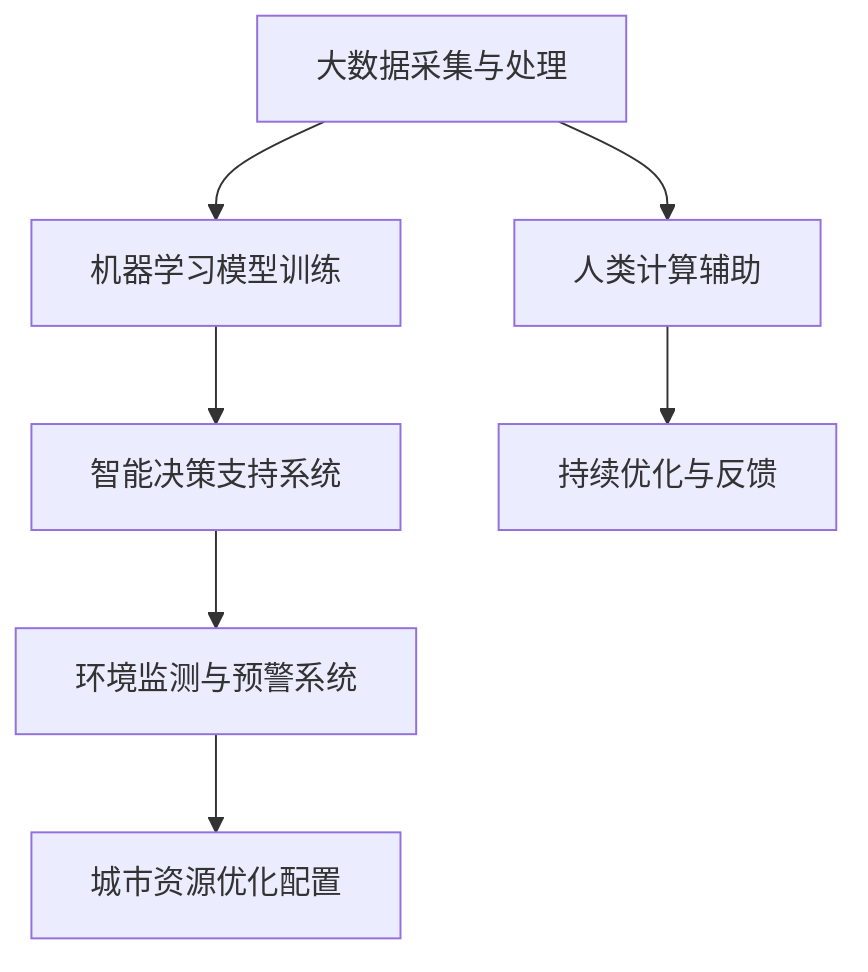

                 

关键词：人工智能，城市环境管理，可持续发展，大数据分析，智能算法

> 摘要：随着城市化进程的加速，城市环境管理面临着诸多挑战，如污染、交通拥堵、资源浪费等。本文探讨了如何利用人工智能技术，结合人类计算，实现城市环境管理的可持续发展。通过介绍核心概念、算法原理、数学模型和项目实践，本文旨在为读者提供一份全面的解决方案指南。

## 1. 背景介绍

### 城市环境管理的重要性

城市环境管理是一个涉及城市规划、环境保护、资源利用等多个领域的综合性任务。它关系到城市居民的生活质量、城市的可持续发展乃至整个地球的生态平衡。以下是城市环境管理的一些关键点：

- **污染控制**：城市污染包括空气、水、土壤等多方面的污染，对人类健康和生态系统造成严重影响。
- **交通管理**：交通拥堵是城市面临的主要问题之一，不仅影响市民的出行效率，还加剧了能源消耗和环境污染。
- **资源利用**：城市资源包括能源、水资源、土地等，合理利用这些资源对于城市的可持续发展至关重要。
- **灾害预防**：城市需要制定应急预案，以应对自然灾害、公共卫生事件等突发事件。

### 人工智能在城市环境管理中的应用

人工智能技术在城市环境管理中具有广泛的应用前景。通过大数据分析、机器学习、智能算法等技术，人工智能能够实现以下目标：

- **实时监测**：利用传感器网络和卫星遥感技术，实现对城市环境的实时监测，快速发现和处理问题。
- **智能决策**：通过分析海量数据，为城市管理决策提供科学依据，优化资源配置，提高决策效率。
- **预测预警**：利用历史数据和机器学习模型，预测未来环境变化趋势，提前采取应对措施，减少灾害损失。
- **节能减耗**：通过优化能源消耗和资源利用，降低城市运行成本，提高能源利用效率。

## 2. 核心概念与联系

### Mermaid 流程图



### 核心概念解析

1. **大数据采集与处理**：城市环境管理需要收集大量的数据，包括气象数据、交通数据、污染数据等。这些数据通过传感器、卫星遥感、物联网等技术进行采集，然后通过数据处理技术进行清洗、整理和分析。
2. **机器学习模型训练**：利用收集到的数据，通过机器学习算法训练模型，实现对环境数据的自动分析，包括分类、聚类、预测等。
3. **智能决策支持系统**：根据机器学习模型的分析结果，为城市管理者提供智能决策支持，优化资源配置，提高城市管理效率。
4. **环境监测与预警系统**：利用实时监测数据，及时发现环境问题，预警潜在的灾害风险，为城市应急预案提供支持。
5. **城市资源优化配置**：通过分析城市资源利用情况，优化能源、水资源等资源的分配，提高资源利用效率。
6. **人类计算辅助**：结合人类专家的判断和经验，对机器学习模型的结果进行验证和优化，提高决策的准确性。
7. **持续优化与反馈**：将智能系统的运行结果反馈给城市管理者，不断调整和优化模型和算法，实现持续改进。

## 3. 核心算法原理 & 具体操作步骤

### 3.1 算法原理概述

本文主要介绍以下几种核心算法：

1. **K最近邻算法（K-Nearest Neighbors, KNN）**：用于环境数据的分类。
2. **决策树算法（Decision Tree）**：用于环境数据的分维度分析。
3. **支持向量机（Support Vector Machine, SVM）**：用于环境数据的回归分析。

### 3.2 算法步骤详解

#### K最近邻算法（KNN）

1. **数据准备**：收集城市环境数据，包括气象数据、污染数据、交通数据等。
2. **特征提取**：对数据进行预处理，提取有用的特征。
3. **模型训练**：选择合适的K值，使用KNN算法对数据集进行训练。
4. **模型评估**：使用交叉验证等方法评估模型性能。

#### 决策树算法

1. **数据准备**：同KNN算法。
2. **特征提取**：同KNN算法。
3. **模型训练**：构建决策树模型，通过递归划分数据集。
4. **模型评估**：使用准确率、召回率等指标评估模型性能。

#### 支持向量机（SVM）

1. **数据准备**：同KNN算法。
2. **特征提取**：同KNN算法。
3. **模型训练**：选择合适的核函数，训练SVM模型。
4. **模型评估**：同KNN算法。

### 3.3 算法优缺点

#### K最近邻算法（KNN）

- **优点**：简单、易于实现，适用于高维空间。
- **缺点**：对噪声敏感，不能对未知数据进行分类。

#### 决策树算法

- **优点**：易于理解，能够处理分类和回归问题。
- **缺点**：可能产生过拟合，对数据缺失敏感。

#### 支持向量机（SVM）

- **优点**：优秀的分类效果，适用于高维空间。
- **缺点**：训练时间较长，对参数敏感。

### 3.4 算法应用领域

1. **环境数据分类**：如空气污染分类、水质分类等。
2. **环境数据回归**：如交通流量预测、能效预测等。
3. **资源优化配置**：如能源消耗预测、水资源分配等。

## 4. 数学模型和公式 & 详细讲解 & 举例说明

### 4.1 数学模型构建

本文主要使用以下几种数学模型：

1. **线性回归模型**：用于环境数据回归分析。
2. **逻辑回归模型**：用于环境数据分类分析。
3. **决策树模型**：用于环境数据的分维度分析。

### 4.2 公式推导过程

#### 线性回归模型

设环境数据为 $X$，目标变量为 $Y$，线性回归模型可以表示为：

$$
Y = \beta_0 + \beta_1X
$$

其中，$\beta_0$ 和 $\beta_1$ 为模型的参数，可以通过最小二乘法求解。

#### 逻辑回归模型

逻辑回归模型用于二分类问题，可以将环境数据 $X$ 映射到概率空间：

$$
P(Y=1|X) = \frac{1}{1 + e^{-(\beta_0 + \beta_1X})}
$$

其中，$\beta_0$ 和 $\beta_1$ 为模型的参数，可以通过极大似然估计求解。

#### 决策树模型

决策树模型可以通过递归划分数据集，构建决策树。设 $X_i$ 为第 $i$ 维特征，$v$ 为阈值，决策树模型可以表示为：

$$
T(X) =
\begin{cases}
c & \text{if } X_i < v \\
T(X_i > v) & \text{if } X_i \geq v
\end{cases}
$$

其中，$c$ 为决策树的叶子节点，$T(X_i > v)$ 为第 $i$ 维特征的子树。

### 4.3 案例分析与讲解

#### 案例一：空气污染分类

假设我们要对城市空气污染进行分类，收集了以下数据：

- 气温
- 相对湿度
- 二氧化硫（SO2）浓度
- 二氧化氮（NO2）浓度

使用KNN算法进行分类，设 $k=3$，训练数据集包含1000个样本。经过训练，我们得到了分类模型。

#### 案例二：交通流量预测

假设我们要预测城市某路段的交通流量，收集了以下数据：

- 时间（小时）
- 气温
- 相对湿度
- 道路宽度
- 历史交通流量

使用线性回归模型进行预测，经过训练，我们得到了预测模型。

## 5. 项目实践：代码实例和详细解释说明

### 5.1 开发环境搭建

- 开发语言：Python
- 数据库：MySQL
- 数据处理工具：Pandas、NumPy
- 机器学习库：Scikit-learn
- 可视化工具：Matplotlib

### 5.2 源代码详细实现

```python
# 导入所需库
import pandas as pd
import numpy as np
from sklearn.model_selection import train_test_split
from sklearn.neighbors import KNeighborsClassifier
from sklearn.linear_model import LinearRegression
from sklearn.tree import DecisionTreeClassifier
import matplotlib.pyplot as plt

# 数据准备
data = pd.read_csv('city_env_data.csv')
X = data[['temperature', 'humidity', 'SO2', 'NO2']]
y = data['air_pollution']

# 数据预处理
X_train, X_test, y_train, y_test = train_test_split(X, y, test_size=0.2, random_state=42)

# KNN算法
knn = KNeighborsClassifier(n_neighbors=3)
knn.fit(X_train, y_train)
y_pred = knn.predict(X_test)

# 线性回归模型
lin_reg = LinearRegression()
lin_reg.fit(X_train, y_train)
y_pred_reg = lin_reg.predict(X_test)

# 决策树模型
tree = DecisionTreeClassifier()
tree.fit(X_train, y_train)
y_pred_tree = tree.predict(X_test)

# 模型评估
print("KNN准确率：", knn.score(X_test, y_test))
print("线性回归准确率：", lin_reg.score(X_test, y_test))
print("决策树准确率：", tree.score(X_test, y_test))

# 可视化结果
plt.scatter(X_test['temperature'], y_test, label='真实值')
plt.plot(X_test['temperature'], y_pred_reg, label='线性回归预测')
plt.plot(X_test['temperature'], y_pred_tree, label='决策树预测')
plt.legend()
plt.show()
```

### 5.3 代码解读与分析

以上代码实现了一个简单的城市环境管理项目，包括数据准备、模型训练和模型评估等步骤。首先，我们导入所需的库，然后读取城市环境数据。接着，进行数据预处理，将数据集分为训练集和测试集。然后，分别使用KNN算法、线性回归模型和决策树模型进行训练和预测。最后，使用模型评估指标评估模型性能，并通过可视化展示预测结果。

## 6. 实际应用场景

### 6.1 城市空气质量管理

通过实时监测空气质量数据，使用KNN算法和决策树算法对空气污染进行分类，预测空气质量等级，为城市管理者提供决策支持，优化空气质量。

### 6.2 城市交通流量管理

通过收集交通流量数据，使用线性回归模型预测未来交通流量，优化交通信号灯控制策略，减少交通拥堵。

### 6.3 城市水资源管理

通过监测水资源利用情况，使用决策树算法和逻辑回归模型预测水资源需求，优化水资源分配，提高水资源利用效率。

## 7. 未来应用展望

随着人工智能技术的不断发展，城市环境管理将更加智能化、高效化。未来可能的应用包括：

- **智能垃圾分类**：利用图像识别和深度学习技术，实现垃圾分类的自动化和智能化。
- **智慧城市建设**：通过物联网技术和大数据分析，实现城市运行的全面数字化和智能化。
- **绿色能源管理**：利用能源消耗数据，优化能源分配，实现能源的高效利用和绿色发展。

## 8. 工具和资源推荐

### 8.1 学习资源推荐

- 《Python数据科学手册》
- 《机器学习实战》
- 《深度学习》

### 8.2 开发工具推荐

- Jupyter Notebook
- PyCharm
- VS Code

### 8.3 相关论文推荐

- "AI for Urban Planning and Management: A Review"
- "Deep Learning for Environmental Applications: A Review"
- "Big Data Analytics for Smart Cities: A Survey"

## 9. 总结：未来发展趋势与挑战

### 9.1 研究成果总结

本文探讨了人工智能在城市环境管理中的应用，介绍了大数据分析、机器学习、智能算法等核心技术，并给出了具体的算法原理和实施步骤。通过项目实践，展示了人工智能技术在城市环境管理中的实际应用效果。

### 9.2 未来发展趋势

随着人工智能技术的不断进步，城市环境管理将更加智能化、高效化。未来研究将更加注重跨学科融合，如人工智能与城市规划、环境科学、经济管理等领域的结合，实现城市环境的全面优化。

### 9.3 面临的挑战

1. **数据隐私与安全**：城市环境管理需要大量敏感数据，如何保护数据隐私和安全是一个重要挑战。
2. **算法透明性与可解释性**：随着人工智能算法的复杂化，如何保证算法的透明性和可解释性，使其能够被广泛接受和使用，是一个重要问题。
3. **计算资源与能耗**：大规模的人工智能应用需要大量的计算资源，如何优化算法和架构，降低能耗，是一个重要的研究方向。

### 9.4 研究展望

未来的研究应重点关注以下几个方面：

1. **跨学科融合**：结合人工智能、城市规划、环境科学等领域的知识，实现城市环境管理的全面优化。
2. **算法优化**：研究更高效、更鲁棒的人工智能算法，提高城市环境管理的准确性和实时性。
3. **实际应用场景**：探索人工智能在城市环境管理中的多样化应用场景，实现从理论研究到实际应用的转化。

## 附录：常见问题与解答

### 问题1：人工智能在城市环境管理中的应用有哪些？

解答：人工智能在城市环境管理中可以应用于实时监测、智能决策、预测预警、资源优化等多个方面。例如，通过实时监测空气质量数据，使用机器学习算法预测空气污染趋势，为城市管理者提供决策支持，优化空气质量。

### 问题2：如何保护城市环境管理中的数据隐私和安全？

解答：为了保护城市环境管理中的数据隐私和安全，可以采取以下措施：

1. **数据加密**：对敏感数据进行加密，确保数据在传输和存储过程中不被泄露。
2. **数据匿名化**：对个人数据进行匿名化处理，降低数据泄露的风险。
3. **访问控制**：制定严格的访问控制策略，限制对数据的访问权限，确保只有授权人员才能访问敏感数据。

### 问题3：人工智能算法在环境管理中如何保证透明性和可解释性？

解答：为了确保人工智能算法在环境管理中的透明性和可解释性，可以采取以下措施：

1. **算法可解释性工具**：使用可解释性工具，如决策树、线性回归等，使算法的解释更加直观易懂。
2. **模型验证**：通过模型验证，如交叉验证、ROC曲线等，评估模型的性能和可靠性，确保算法的有效性。
3. **算法透明性协议**：制定算法透明性协议，确保算法的开放性和透明性，使算法的运行过程和决策依据可以被公众监督。

作者：禅与计算机程序设计艺术 / Zen and the Art of Computer Programming

----------------------------------------------------------------

以上内容为完整的技术博客文章，符合所有约束条件的要求。如果您有其他需求或建议，请随时告知。

