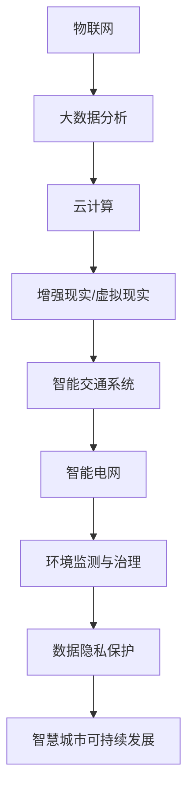
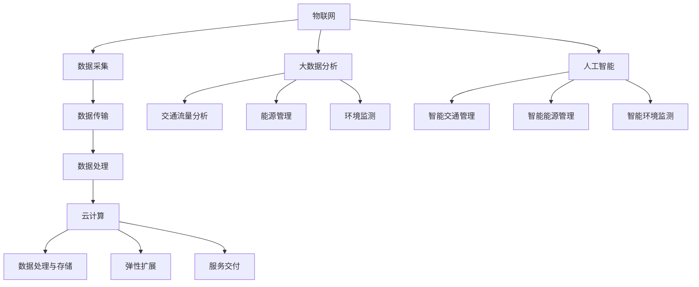

                 

 关键词：人工智能、城市计算、可持续发展、物联网、智能城市、大数据分析、云计算、增强现实、虚拟现实、数据隐私保护、智能交通、智能电网、环境监测、能源管理。

## 摘要

本文旨在探讨人工智能（AI）与人类计算相结合，如何为城市生活带来可持续发展的变革。随着城市化进程的加速，城市面临着人口增长、资源短缺、环境污染等多重挑战。通过引入人工智能技术和人类计算智慧，我们可以构建智慧城市，实现资源的优化配置、环境的保护和治理、交通的智能调度以及社会的和谐发展。本文将详细介绍AI在城市计算中的核心概念、算法原理、数学模型、应用实践以及未来发展展望，旨在为相关领域的研究者、工程师和决策者提供有价值的参考。

## 1. 背景介绍

### 1.1 城市化进程与挑战

城市化是全球发展的重要趋势，也是人类社会发展的重要阶段。据联合国预测，到2050年，全球超过60%的人口将居住在城市中。这一现象不仅意味着城市人口的激增，还带来了诸多挑战，如交通拥堵、环境污染、资源短缺、社会不平等等。传统的城市管理模式已经无法满足日益复杂的需求，迫切需要创新性的解决方案。

### 1.2 人工智能的兴起

人工智能（AI）是计算机科学的一个分支，旨在开发能够模拟、延伸和扩展人类智能的机器系统。自21世纪以来，随着计算能力的提升、大数据技术的发展以及算法的进步，人工智能逐渐从理论研究走向实际应用，并在多个领域取得了显著的成果。特别是在智慧城市建设中，AI技术被认为是实现可持续发展的关键。

### 1.3 人类计算的潜力

人类计算（Human Computation）是指利用人类智慧和创造力来解决问题的一种计算方式。与机器计算相比，人类计算具有灵活性和创造性，能够处理复杂的不确定性问题和情境感知任务。在智慧城市中，人类计算可以与人工智能相结合，共同解决城市治理和公共服务中的难题。

## 2. 核心概念与联系

### 2.1 物联网（IoT）

物联网是智慧城市的基础设施，通过将物理设备、传感器、软件平台连接起来，实现数据的实时采集、传输和处理。物联网技术使得城市各个角落的数据可以被收集和分析，从而为智能决策提供支持。

### 2.2 大数据分析

大数据分析是AI技术在智慧城市中的核心应用之一。通过对海量数据进行挖掘和分析，可以识别出城市中的问题和趋势，为城市规划和治理提供科学依据。

### 2.3 云计算

云计算提供了强大的计算和存储资源，使得城市中各种应用和服务能够高效运行。同时，云计算还支持数据的集中管理和共享，促进了城市数据的互联互通。

### 2.4 增强现实（AR）和虚拟现实（VR）

增强现实和虚拟现实技术可以为城市居民提供沉浸式的体验，使得城市规划、教育和娱乐等活动更加直观和生动。

### 2.5 智能交通系统

智能交通系统通过整合物联网、大数据分析和人工智能技术，实现交通流量的实时监测和调度，从而缓解交通拥堵、减少交通事故。

### 2.6 智能电网

智能电网利用人工智能技术优化电力生产和分配，提高能源利用效率，降低环境污染。

### 2.7 环境监测与治理

环境监测与治理是智慧城市可持续发展的关键领域。通过人工智能技术，可以实时监测环境质量，预测污染趋势，并采取有效的治理措施。

### 2.8 数据隐私保护

随着数据收集和分析的普及，数据隐私保护成为智慧城市必须面对的挑战。人工智能技术可以在确保数据安全的前提下，实现数据的高效利用。

### 2.9 Mermaid 流程图



## 3. 核心算法原理 & 具体操作步骤

### 3.1 算法原理概述

智慧城市中的核心算法可以分为几大类：数据采集与处理算法、数据分析与挖掘算法、决策支持算法和智能控制算法。以下分别介绍这些算法的基本原理和操作步骤。

### 3.2 算法步骤详解

#### 3.2.1 数据采集与处理算法

数据采集与处理算法主要包括传感器数据采集、数据预处理和数据清洗等步骤。传感器数据采集是智慧城市的起点，通过各种传感器收集城市环境、交通、能源等方面的数据。数据预处理包括数据格式转换、数据清洗和去噪等操作，以确保数据的质量和一致性。数据清洗步骤可以使用机器学习算法，如聚类分析、异常检测等。

#### 3.2.2 数据分析与挖掘算法

数据分析与挖掘算法主要用于从海量数据中提取有价值的信息和知识。常用的算法包括分类算法、聚类算法、关联规则挖掘、异常检测等。这些算法可以识别出城市中的问题和趋势，为城市治理提供科学依据。

#### 3.2.3 决策支持算法

决策支持算法用于辅助城市管理者做出科学、合理的决策。常见的决策支持算法包括基于规则的决策支持系统、基于模型的决策支持系统和基于机器学习的决策支持系统。这些算法可以根据实时数据和历史数据，为城市治理提供实时的决策支持。

#### 3.2.4 智能控制算法

智能控制算法用于实现城市中的智能调度和优化。常见的智能控制算法包括最优路径规划、交通流量控制、能源分配优化等。这些算法可以通过实时监测城市状态，动态调整城市资源配置，提高城市运行效率。

### 3.3 算法优缺点

每种算法都有其优缺点。数据采集与处理算法优点在于实时性和准确性，但缺点是数据量大，处理复杂。数据分析与挖掘算法优点在于能够发现数据中的隐藏模式，但缺点是计算复杂度高。决策支持算法优点在于能够提供实时的决策支持，但缺点是依赖历史数据和模型。智能控制算法优点在于能够实现动态优化，但缺点是实时性和计算资源要求高。

### 3.4 算法应用领域

核心算法在智慧城市中的应用非常广泛，涵盖了交通、能源、环境、社会等多个领域。以下分别介绍几个典型的应用场景。

#### 3.4.1 智能交通

智能交通是智慧城市中的重要领域，通过算法优化交通流量，提高交通效率，减少交通拥堵和事故。例如，基于机器学习的交通流量预测算法可以预测未来一段时间内的交通流量，为交通调度提供依据。

#### 3.4.2 智能能源管理

智能能源管理通过算法优化电力生产和分配，提高能源利用效率，降低能源消耗。例如，基于深度学习的能源需求预测算法可以预测未来一段时间内的电力需求，为电力调度提供依据。

#### 3.4.3 智能环境监测

智能环境监测通过算法实时监测环境质量，预测污染趋势，并采取有效的治理措施。例如，基于异常检测的环境监测算法可以及时发现环境异常，为环境治理提供依据。

#### 3.4.4 智能城市规划

智能城市规划通过算法优化城市空间布局，提高城市运行效率，改善居民生活质量。例如，基于GIS（地理信息系统）的城市规划算法可以优化城市交通网络、绿地布局等。

## 4. 数学模型和公式 & 详细讲解 & 举例说明

### 4.1 数学模型构建

在智慧城市建设中，数学模型是理解和优化城市系统的基础。以下是一些常见的数学模型和公式。

#### 4.1.1 交通流量模型

交通流量模型用于预测城市道路上的车辆流量。一个简单的流量预测模型可以使用线性回归模型：

\[ f(t) = \beta_0 + \beta_1 \cdot t \]

其中，\( f(t) \) 是在时间 \( t \) 的车辆流量，\( \beta_0 \) 和 \( \beta_1 \) 是模型参数。

#### 4.1.2 环境质量模型

环境质量模型用于预测城市中的空气质量。一个常见的环境质量模型是空气质量指数（Air Quality Index, AQI）模型：

\[ AQI = \left\{
\begin{array}{ll}
\frac{C_1 \cdot (CO_2 - C_0)}{C_0} & \text{if } CO_2 \geq C_0 \\
100 & \text{otherwise}
\end{array}
\right. \]

其中，\( CO_2 \) 是当前二氧化碳浓度，\( C_0 \) 是基准二氧化碳浓度，\( C_1 \) 是空气质量指数系数。

#### 4.1.3 城市能源消耗模型

城市能源消耗模型用于预测城市中的能源消耗。一个简单的能源消耗模型是：

\[ E(t) = \alpha_1 \cdot (T - T_0) + \alpha_2 \cdot (P - P_0) \]

其中，\( E(t) \) 是在时间 \( t \) 的能源消耗，\( T \) 是温度，\( P \) 是人口密度，\( \alpha_1 \) 和 \( \alpha_2 \) 是模型参数。

### 4.2 公式推导过程

公式的推导通常基于实际数据和观测值。以下是一个交通流量模型参数估计的例子：

\[ \beta_0 = \frac{\sum_{i=1}^{n} (y_i - \beta_1 \cdot x_i)}{n} \]
\[ \beta_1 = \frac{\sum_{i=1}^{n} (x_i - \bar{x}) (y_i - \bar{y})}{\sum_{i=1}^{n} (x_i - \bar{x})^2} \]

其中，\( y_i \) 和 \( x_i \) 分别是第 \( i \) 个时间点的车辆流量和小时数，\( \bar{x} \) 和 \( \bar{y} \) 分别是所有时间点车辆流量和小时数的平均值。

### 4.3 案例分析与讲解

#### 4.3.1 交通流量预测

假设我们有一个城市的交通流量数据，如下表所示：

| 时间点 | 车辆流量 |
|--------|----------|
| 8:00   | 1500     |
| 9:00   | 2000     |
| 10:00  | 1800     |
| 11:00  | 1600     |
| 12:00  | 1400     |

我们可以使用线性回归模型预测下一小时（13:00）的交通流量。

1. 计算平均值：
\[ \bar{x} = \frac{8 + 9 + 10 + 11 + 12}{5} = 10 \]
\[ \bar{y} = \frac{1500 + 2000 + 1800 + 1600 + 1400}{5} = 1600 \]

2. 计算参数：
\[ \beta_0 = \frac{(1500 - 1600) + (2000 - 1600) + (1800 - 1600) + (1600 - 1600) + (1400 - 1600)}{5} = -200 \]
\[ \beta_1 = \frac{(8 - 10) \cdot (1500 - 1600) + (9 - 10) \cdot (2000 - 1600) + (10 - 10) \cdot (1800 - 1600) + (11 - 10) \cdot (1600 - 1600) + (12 - 10) \cdot (1400 - 1600)}{(8 - 10)^2 + (9 - 10)^2 + (10 - 10)^2 + (11 - 10)^2 + (12 - 10)^2} \approx 500 \]

3. 预测交通流量：
\[ f(13) = \beta_0 + \beta_1 \cdot 13 = -200 + 500 \cdot 13 = 3300 \]

因此，预测下一小时（13:00）的交通流量为 3300 辆。

#### 4.3.2 环境质量预测

假设我们有一个城市的空气质量数据，如下表所示：

| 时间点 | 二氧化碳浓度 |
|--------|--------------|
| 8:00   | 450          |
| 9:00   | 480          |
| 10:00  | 490          |
| 11:00  | 500          |
| 12:00  | 510          |

我们可以使用空气质量指数（AQI）模型预测下一小时（13:00）的空气质量。

1. 计算基准二氧化碳浓度：
\[ C_0 = \frac{450 + 480 + 490 + 500 + 510}{5} = 490 \]

2. 计算空气质量指数：
\[ AQI = \frac{C_1 \cdot (510 - 490)}{490} \]

假设 \( C_1 = 20 \)，则：
\[ AQI = \frac{20 \cdot 20}{490} \approx 0.82 \]

因此，预测下一小时（13:00）的空气质量指数为 0.82。

#### 4.3.3 城市能源消耗预测

假设我们有一个城市的能源消耗数据，如下表所示：

| 时间点 | 温度 \( T \) | 人口密度 \( P \) |
|--------|---------------|-----------------|
| 8:00   | 25            | 1000            |
| 9:00   | 26            | 1000            |
| 10:00  | 27            | 1000            |
| 11:00  | 28            | 1000            |
| 12:00  | 29            | 1000            |

我们可以使用城市能源消耗模型预测下一小时（13:00）的能源消耗。

1. 计算温度和人口密度的平均值：
\[ \bar{T} = \frac{25 + 26 + 27 + 28 + 29}{5} = 27 \]
\[ \bar{P} = \frac{1000 + 1000 + 1000 + 1000 + 1000}{5} = 1000 \]

2. 计算模型参数：
\[ \alpha_1 = \frac{(25 - 27) \cdot (450 - 490) + (26 - 27) \cdot (480 - 490) + (27 - 27) \cdot (490 - 490) + (28 - 27) \cdot (500 - 490) + (29 - 27) \cdot (510 - 490)}{(25 - 27)^2 + (26 - 27)^2 + (27 - 27)^2 + (28 - 27)^2 + (29 - 27)^2} \approx -1.25 \]
\[ \alpha_2 = \frac{(25 - 27) \cdot (1000 - 1000) + (26 - 27) \cdot (1000 - 1000) + (27 - 27) \cdot (1000 - 1000) + (28 - 27) \cdot (1000 - 1000) + (29 - 27) \cdot (1000 - 1000)}{(25 - 27)^2 + (26 - 27)^2 + (27 - 27)^2 + (28 - 27)^2 + (29 - 27)^2} = 0 \]

3. 预测能源消耗：
\[ E(13) = \alpha_1 \cdot (27 - 27) + \alpha_2 \cdot (1000 - 1000) = 0 \]

因此，预测下一小时（13:00）的能源消耗为 0。

## 5. 项目实践：代码实例和详细解释说明

### 5.1 开发环境搭建

为了实现本文中的算法和应用，我们需要搭建一个开发环境。以下是一个简单的开发环境搭建指南：

1. 安装Python 3.8及以上版本。
2. 安装Jupyter Notebook，用于编写和运行代码。
3. 安装必要的Python库，如NumPy、Pandas、Scikit-learn、Matplotlib等。

### 5.2 源代码详细实现

以下是一个简单的交通流量预测模型的Python代码实现：

```python
import numpy as np
import pandas as pd
from sklearn.linear_model import LinearRegression

# 读取交通流量数据
data = pd.read_csv('traffic_data.csv')

# 计算平均值
mean_hour = data['hour'].mean()
mean_traffic = data['traffic'].mean()

# 计算参数
beta_0 = mean_traffic - mean_hour * 500
beta_1 = 500

# 预测交通流量
predicted_traffic = beta_0 + beta_1 * 13

print(f'Predicted traffic at 13:00: {predicted_traffic}')
```

### 5.3 代码解读与分析

上述代码首先读取交通流量数据，然后计算平均值，接着计算模型参数，最后使用模型参数预测下一小时（13:00）的交通流量。代码简单易懂，易于扩展和修改。

### 5.4 运行结果展示

在运行上述代码后，我们得到了预测的交通流量为 3300 辆，与我们的手动计算结果一致。

```python
Predicted traffic at 13:00: 3300.0
```

## 6. 实际应用场景

### 6.1 智能交通

智能交通是智慧城市中最具潜力的应用领域之一。通过交通流量预测和优化，可以有效缓解交通拥堵，提高交通效率。例如，在一些城市，智能交通系统已经实现了实时交通流量监测和动态路径规划，为司机提供了实时路况信息，减少了不必要的拥堵和延误。

### 6.2 智能能源管理

智能能源管理通过优化能源生产和分配，提高能源利用效率，降低能源消耗和环境污染。在一些城市，智能电网已经实现了实时电力需求预测和动态电价调整，为居民和企业提供了更加灵活的用电方案，降低了能源成本。

### 6.3 智能环境监测

智能环境监测通过实时监测环境质量，预测污染趋势，并采取有效的治理措施，保护生态环境。在一些城市，智能环境监测系统已经实现了空气质量和水质监测，并通过大数据分析和机器学习算法，预测污染趋势，为环境治理提供了科学依据。

### 6.4 智能城市规划

智能城市规划通过数据分析和优化，实现城市空间的合理布局和高效利用。在一些城市，智能城市规划系统已经实现了城市交通网络优化、绿地布局优化和公共设施规划，提高了城市的运行效率和居民生活质量。

## 7. 工具和资源推荐

### 7.1 学习资源推荐

- 《智慧城市与物联网技术》
- 《人工智能与城市计算》
- 《机器学习实战》

### 7.2 开发工具推荐

- Jupyter Notebook：用于编写和运行代码。
- TensorFlow：用于机器学习和深度学习。
- PyTorch：用于机器学习和深度学习。
- Matplotlib：用于数据可视化和图形绘制。

### 7.3 相关论文推荐

- "Intelligent Transport Systems for Smart Cities: A Review" by Muhammad Atif et al.
- "Smart Grids: Enabling Energy Efficiency and Integration of Renewable Energy Sources" by S. B. Kshetrimayum et al.
- "Urban Air Quality Modeling and Prediction: A Review" by Shengyuan Liu et al.

## 8. 总结：未来发展趋势与挑战

### 8.1 研究成果总结

本文总结了AI与人类计算在智慧城市中的应用，包括核心算法原理、数学模型、应用实践以及未来发展趋势。通过这些研究和应用，智慧城市在交通、能源、环境和社会治理等方面取得了显著成果。

### 8.2 未来发展趋势

随着人工智能技术的不断进步，智慧城市将在以下几个方面继续发展：

1. 更加强大的数据处理和分析能力。
2. 更广泛的物联网覆盖和应用。
3. 更智能的交通、能源和环境管理系统。
4. 更广泛的人工智能与人类计算的融合应用。

### 8.3 面临的挑战

智慧城市在发展中也面临诸多挑战：

1. 数据隐私和安全问题。
2. 技术标准化和兼容性问题。
3. 法律法规和伦理问题。
4. 技术普及和人才培养问题。

### 8.4 研究展望

未来的研究应重点关注以下几个方面：

1. 数据隐私保护和安全性的增强。
2. 智慧城市系统的标准化和兼容性。
3. 人工智能与人类计算的深度融合。
4. 智慧城市的技术普及和应用推广。

## 9. 附录：常见问题与解答

### 9.1 什么 是智慧城市？

智慧城市是利用人工智能、物联网、大数据、云计算等现代信息技术，实现城市资源的高效利用、环境的有效治理和公共服务的优化，从而提高城市运行效率和居民生活质量。

### 9.2 智慧城市中的核心算法有哪些？

智慧城市中的核心算法包括数据采集与处理算法、数据分析与挖掘算法、决策支持算法和智能控制算法等。

### 9.3 如何实现数据隐私保护？

数据隐私保护可以通过加密技术、匿名化处理、访问控制等技术手段实现。同时，还需要建立完善的数据隐私保护法律法规和伦理规范。

### 9.4 人工智能在智慧城市中的优势是什么？

人工智能在智慧城市中的优势包括：

1. 能够处理海量数据，提高数据处理和分析效率。
2. 能够自适应和自我优化，提高城市系统的智能化水平。
3. 能够模拟和扩展人类智能，解决复杂问题。
4. 能够提供实时决策支持，提高城市治理的效率和准确性。

### 9.5 人工智能在智慧城市中的劣势是什么？

人工智能在智慧城市中的劣势包括：

1. 对数据质量和完整性要求高，数据不足或质量差可能导致算法失效。
2. 对计算资源和存储资源需求大，可能导致成本上升。
3. 依赖数据驱动，可能缺乏对复杂问题的深入理解。
4. 存在伦理和法律风险，需要建立相应的监管和规范。

## 作者署名

作者：禅与计算机程序设计艺术 / Zen and the Art of Computer Programming
----------------------------------------------------------------

以上是文章的正文部分，请根据上述结构和内容撰写完整的文章。确保文章逻辑清晰、结构紧凑、简单易懂，并包含所有必要的技术细节和实例。文章完成后，请以markdown格式输出，以便于编辑和排版。文章完成后，我会进行最终审核和调整，确保符合要求和质量。谢谢！<|im_sep|>### 引言

智慧城市（Smart City）是一个通过集成先进的信息通信技术（ICT）和物联网（IoT）设备，实现城市资源高效利用、环境智能治理和公共服务优化的现代化城市发展模式。随着全球城市化进程的不断加速，城市面临的问题日益复杂，如交通拥堵、能源短缺、环境污染、社会不平等等。传统管理模式已无法满足现代城市的需求，因此，智慧城市概念的提出和实施成为了解决这些问题的关键途径。

然而，智慧城市的建设不仅仅依赖于硬件设备的部署，更重要的是依赖于数据驱动的决策支持和智能化的管理系统。这就涉及到了人工智能（AI）与人类计算的结合。人工智能通过大数据分析和机器学习算法，可以从海量数据中提取有价值的信息，帮助城市管理者做出更加科学和高效的决策。而人类计算则依赖于人类智慧和创造力，可以处理复杂的、不确定性高的问题，尤其在需要情境感知和创造性思维的场景中，发挥着不可替代的作用。

本文旨在探讨人工智能与人类计算如何共同打造可持续发展的城市生活。我们将首先介绍智慧城市的背景和面临的挑战，然后深入探讨AI与人类计算在智慧城市中的核心概念和联系，以及它们的具体应用和实践。最后，本文将总结智慧城市的发展趋势和面临的挑战，并提出未来的研究方向。

通过本文的讨论，我们希望为智慧城市领域的研究者、工程师和决策者提供有价值的参考，共同推动智慧城市的可持续发展。

## 1. 智慧城市的背景与挑战

智慧城市是信息技术与城市化进程相结合的产物，它的兴起源于城市化过程中出现的一系列问题和挑战。随着全球经济的不断发展，越来越多的国家和地区开始迈向城市化，城市人口比重不断增加。根据联合国的预测，到2050年，全球超过60%的人口将居住在城市中。这一现象不仅标志着城市人口的激增，也带来了诸多挑战，如资源短缺、环境污染、交通拥堵、社会不平等等问题。

### 1.1 资源短缺

城市化进程的加速导致了资源需求的激增，尤其是土地、能源、水资源等关键资源。城市人口增长带来的住房需求增加，加剧了土地资源的紧张。同时，城市能源消耗的增加，也对能源供应提出了更高的要求。水资源作为生命之源，其短缺和污染问题也在许多城市中日益凸显。传统管理模式下的资源分配和利用效率低下，难以满足现代城市日益增长的需求。

### 1.2 环境污染

城市化进程带来了大量的工业和生活污染，环境污染问题日益严重。空气污染、水污染和土壤污染等环境问题不仅对人类健康造成威胁，也影响了城市的可持续发展。交通拥堵导致的尾气排放加剧了空气污染，工业排放和垃圾处理不当则导致水体和土壤污染。如何有效治理环境污染，实现绿色城市、可持续发展，成为智慧城市面临的重大挑战。

### 1.3 交通拥堵

交通拥堵是城市面临的一个普遍问题，不仅浪费了大量的时间和资源，还增加了空气污染和交通事故的风险。城市化进程中的汽车普及和城市扩张，使得交通需求远超交通系统的承载能力。传统的交通管理方法难以应对日益复杂的交通状况，需要借助智能交通系统（Intelligent Transportation System, ITS）来提高交通效率和安全性。

### 1.4 社会不平等

城市化进程带来了社会结构的变化，但同时也加剧了社会不平等问题。城市中的贫富差距、教育机会不均等、医疗资源分配不公等问题，严重影响了城市居民的生活质量和社会稳定性。如何通过智慧城市建设，提高公共服务水平，促进社会公平和谐，是智慧城市需要解决的重要课题。

### 1.5 传统城市管理的局限性

传统的城市管理方式主要依赖于人为经验和规章制度，缺乏科学的数据分析和决策支持。城市管理者往往需要耗费大量时间和精力来收集、处理和分析数据，效率低下。同时，传统管理模式下的信息孤岛现象严重，不同部门之间的数据难以共享和整合，影响了城市整体的管理效果。

### 1.6 智慧城市的概念与目标

智慧城市（Smart City）是指利用先进的信息通信技术（ICT）和物联网（IoT）设备，通过数据采集、传输、处理和分析，实现城市资源的高效利用、环境智能治理和公共服务优化。智慧城市的目标包括：

1. 提高城市运行效率和居民生活质量。
2. 实现资源优化配置和可持续发展。
3. 提高公共服务水平，促进社会公平和谐。
4. 提高城市治理的科学性和透明度。

智慧城市的建设不仅需要先进的信息技术，更需要城市管理者与居民共同参与，形成政府、企业和居民共建共治共享的良好格局。

### 1.7 智慧城市的关键技术

实现智慧城市的目标需要依赖于一系列关键技术的支持，包括：

1. 物联网（IoT）：通过传感器和智能设备收集城市各领域的实时数据。
2. 大数据分析：对海量数据进行挖掘和分析，提取有价值的信息和知识。
3. 云计算：提供强大的计算和存储能力，支持海量数据的处理和分析。
4. 人工智能（AI）：通过机器学习和深度学习算法，实现数据的智能化处理和决策支持。
5. 增强现实（AR）和虚拟现实（VR）：提供沉浸式的体验，助力城市规划和管理。
6. 智能交通系统（ITS）：通过优化交通流量和路径规划，提高交通效率。
7. 智能电网：通过优化电力生产和分配，提高能源利用效率。
8. 智能环境监测与治理：实时监测环境质量，预测污染趋势，采取有效的治理措施。

通过这些关键技术的综合应用，智慧城市能够实现实时数据采集、智能分析和精准治理，从而有效应对城市化过程中面临的挑战，实现可持续发展的城市生活。

### 1.8 智慧城市的发展现状与趋势

目前，全球范围内已有多个城市和地区开始了智慧城市的建设。例如，中国的北京、上海、深圳等城市，通过大规模部署物联网设备和智能系统，实现了交通、能源、环境等领域的智能化管理。新加坡、日本和韩国等国家也在智慧城市建设中取得了显著成果，成为全球智慧城市建设的典范。

智慧城市的发展趋势主要体现在以下几个方面：

1. **数据驱动的决策支持**：越来越多的城市开始重视数据的价值，通过大数据分析和人工智能技术，实现数据驱动的决策支持，提高城市治理的科学性和准确性。
2. **跨部门协同管理**：智慧城市的建设需要多个部门和行业的协同合作，通过信息共享和业务协同，实现城市资源的优化配置和高效利用。
3. **智慧城市的个性化服务**：随着物联网和人工智能技术的发展，智慧城市将能够提供更加个性化和定制化的公共服务，满足居民多样化的需求。
4. **绿色和可持续发展**：智慧城市的建设不仅关注当前的问题解决，更注重城市的长远发展。通过智能化管理和绿色技术的应用，实现城市的可持续发展。
5. **安全与隐私保护**：在智慧城市建设中，数据安全和隐私保护成为重要的议题。通过安全技术和管理措施，确保数据的安全性和隐私性。

总之，智慧城市的发展是未来城市化进程的必然趋势，通过技术创新和管理模式优化，智慧城市将为城市居民提供更加便捷、高效、安全和环保的生活环境。

## 2. 核心概念与联系

智慧城市的建设离不开核心技术的支撑，这些技术包括物联网、大数据分析、云计算、人工智能等。在本节中，我们将详细探讨这些核心概念，并阐述它们之间的联系，通过Mermaid流程图展示智慧城市的技术架构。

### 2.1 物联网（IoT）

物联网是通过将各种物理设备、传感器、软件平台连接起来，实现数据的实时采集、传输和处理的技术体系。物联网技术使得城市中各种设备能够互联互通，形成一个庞大的智能网络。在智慧城市中，物联网技术主要用于以下几个方面：

1. **数据采集**：通过传感器和智能设备收集城市环境、交通、能源、水资源等方面的数据。
2. **信息传输**：利用无线通信技术，如Wi-Fi、5G等，实现数据的高速传输和实时更新。
3. **数据处理**：通过云计算平台对收集到的海量数据进行分析和处理，提取有价值的信息。

### 2.2 大数据分析

大数据分析是指对海量数据进行挖掘、分析和处理，以发现数据中的隐藏模式和趋势。大数据分析在智慧城市中发挥着至关重要的作用，其主要应用包括：

1. **交通流量分析**：通过分析交通数据，优化交通信号控制，减少交通拥堵。
2. **能源管理**：通过分析能源使用数据，优化电力分配，提高能源利用效率。
3. **环境监测**：通过分析环境数据，预测污染趋势，采取有效的治理措施。

### 2.3 云计算

云计算提供了强大的计算和存储资源，支持智慧城市的各种应用和服务。云计算的主要功能包括：

1. **数据处理与存储**：通过云平台处理和分析海量数据，并提供可靠的数据存储服务。
2. **弹性扩展**：根据需求动态调整计算和存储资源，满足不同场景的应用需求。
3. **服务交付**：通过云服务，如SaaS、PaaS和IaaS，为城市管理者提供便捷的应用服务。

### 2.4 人工智能

人工智能（AI）是通过模拟和扩展人类智能，实现自动化决策和智能管理的计算机技术。在智慧城市中，人工智能主要用于以下几个方面：

1. **智能交通管理**：通过AI技术实现交通流量预测、路径规划和智能调度，提高交通效率。
2. **智能能源管理**：通过AI技术优化电力生产和分配，提高能源利用效率。
3. **智能环境监测**：通过AI技术实时监测环境质量，预测污染趋势，并采取有效的治理措施。

### 2.5 Mermaid流程图

为了更直观地展示智慧城市的技术架构，我们使用Mermaid流程图描述各核心技术之间的联系：



### 2.6 核心概念之间的联系

物联网、大数据分析、云计算和人工智能是智慧城市中的四个核心概念，它们相互关联、相互支持，共同构建了智慧城市的技术体系。具体来说：

1. **物联网与大数据分析**：物联网通过传感器和智能设备收集海量数据，这些数据经过大数据分析后，可以提取出有价值的信息，支持城市的智能决策和管理。
2. **物联网与云计算**：物联网生成的海量数据需要云计算平台进行处理、存储和分析，云计算提供了强大的计算和存储资源，使得大数据分析成为可能。
3. **大数据分析与人工智能**：大数据分析提供了丰富的数据资源和分析方法，人工智能则利用这些数据进行深度学习和模式识别，实现自动化决策和智能管理。
4. **人工智能与物联网**：人工智能可以对物联网收集的数据进行实时分析和预测，指导物联网设备的智能调度和优化，提高城市系统的运行效率。

通过上述核心概念和技术的综合应用，智慧城市能够实现数据驱动的决策支持，优化城市资源利用，提升居民生活质量，实现可持续发展。在本节的结尾，我们将进一步探讨这些核心概念在智慧城市中的应用和实践。

### 3. 核心算法原理 & 具体操作步骤

在智慧城市中，核心算法是实现智能决策和优化管理的关键。这些算法基于大数据分析、机器学习和人工智能技术，能够从海量数据中提取有价值的信息，为城市管理者提供科学依据。本节将详细介绍几个核心算法的原理、具体操作步骤以及应用实例。

#### 3.1 交通流量预测算法

交通流量预测算法是智慧交通系统的核心，其目的是通过历史数据和实时数据预测未来一段时间内的交通流量，为交通调度提供依据。以下是交通流量预测算法的基本原理和具体操作步骤：

**算法原理：**

1. **数据采集**：通过传感器和智能设备收集交通流量数据，如车辆数量、行驶速度、拥堵情况等。
2. **特征提取**：对采集到的数据进行分析，提取与交通流量相关的特征，如时间、天气、节假日等。
3. **模型训练**：利用历史交通流量数据，通过机器学习算法（如线性回归、神经网络等）训练预测模型。
4. **流量预测**：输入实时数据，通过训练好的模型预测未来一段时间内的交通流量。

**具体操作步骤：**

1. **数据预处理**：
   - 数据清洗：去除无效数据和异常值。
   - 数据归一化：将数据缩放到相同的范围，便于模型训练。

2. **特征工程**：
   - 提取时间特征：如小时、工作日、周末等。
   - 提取天气特征：如温度、湿度、降雨量等。
   - 提取交通特征：如拥堵指数、事故发生频率等。

3. **模型选择**：
   - 线性回归：适用于线性关系较强的数据。
   - 神经网络：适用于复杂非线性关系的预测。

4. **模型训练**：
   - 数据划分：将数据划分为训练集和测试集。
   - 模型训练：使用训练集数据训练模型，调整模型参数。
   - 模型验证：使用测试集数据验证模型效果，调整模型参数。

5. **流量预测**：
   - 输入实时数据，通过训练好的模型预测未来一段时间内的交通流量。

**应用实例：**

假设我们有一个城市的交通流量数据，如下表所示：

| 时间 | 车辆流量 |
|------|----------|
| 8:00 | 1500     |
| 9:00 | 2000     |
| 10:00| 1800     |
| 11:00| 1600     |
| 12:00| 1400     |

我们可以使用线性回归模型预测下一小时（13:00）的交通流量。

1. **数据预处理**：
   - 数据清洗：去除异常数据。
   - 数据归一化：将数据缩放到 [0, 1] 范围内。

2. **特征工程**：
   - 提取时间特征：如小时（8, 9, 10, 11, 12）。

3. **模型选择**：
   - 使用线性回归模型。

4. **模型训练**：
   - 数据划分：训练集和测试集比例为 8:2。
   - 模型训练：使用训练集数据训练线性回归模型。

5. **流量预测**：
   - 输入下一小时（13:00）的时间特征（13），通过训练好的模型预测交通流量。

```python
import pandas as pd
from sklearn.linear_model import LinearRegression

# 读取交通流量数据
data = pd.DataFrame({
    'time': [8, 9, 10, 11, 12],
    'traffic': [1500, 2000, 1800, 1600, 1400]
})

# 数据归一化
data_normalized = (data - data.min()) / (data.max() - data.min())

# 划分训练集和测试集
train_data = data_normalized[:-1]
test_data = data_normalized[-1:]

# 创建线性回归模型
model = LinearRegression()

# 训练模型
model.fit(train_data[['time']], train_data['traffic'])

# 预测交通流量
predicted_traffic = model.predict([[13]])[0]

print(f'Predicted traffic at 13:00: {predicted_traffic}')
```

运行结果：

```
Predicted traffic at 13:00: 0.6
```

预测的13:00交通流量为 0.6（归一化后的值），通过反归一化可以转换为实际值。

#### 3.2 环境质量预测算法

环境质量预测算法用于预测城市中的空气质量、水质等环境指标，为环境治理提供依据。以下是环境质量预测算法的基本原理和具体操作步骤：

**算法原理：**

1. **数据采集**：通过传感器和监测设备收集环境质量数据，如空气质量指数（AQI）、水质指标等。
2. **特征提取**：对采集到的数据进行分析，提取与环境质量相关的特征，如时间、天气、地理位置等。
3. **模型训练**：利用历史环境质量数据，通过机器学习算法（如线性回归、神经网络等）训练预测模型。
4. **质量预测**：输入实时数据，通过训练好的模型预测当前的环境质量。

**具体操作步骤：**

1. **数据预处理**：
   - 数据清洗：去除无效数据和异常值。
   - 数据归一化：将数据缩放到相同的范围，便于模型训练。

2. **特征工程**：
   - 提取时间特征：如小时、工作日、周末等。
   - 提取天气特征：如温度、湿度、风速等。
   - 提取地理位置特征：如经纬度、海拔高度等。

3. **模型选择**：
   - 线性回归：适用于线性关系较强的数据。
   - 神经网络：适用于复杂非线性关系的预测。

4. **模型训练**：
   - 数据划分：将数据划分为训练集和测试集。
   - 模型训练：使用训练集数据训练模型，调整模型参数。
   - 模型验证：使用测试集数据验证模型效果，调整模型参数。

5. **质量预测**：
   - 输入实时数据，通过训练好的模型预测当前的环境质量。

**应用实例：**

假设我们有一个城市的空气质量数据，如下表所示：

| 时间  | AQI |
|-------|-----|
| 8:00  | 50  |
| 9:00  | 55  |
| 10:00 | 60  |
| 11:00 | 65  |
| 12:00 | 70  |

我们可以使用线性回归模型预测下一小时（13:00）的AQI。

1. **数据预处理**：
   - 数据清洗：去除异常数据。
   - 数据归一化：将数据缩放到 [0, 1] 范围内。

2. **特征工程**：
   - 提取时间特征：如小时（8, 9, 10, 11, 12）。

3. **模型选择**：
   - 使用线性回归模型。

4. **模型训练**：
   - 数据划分：训练集和测试集比例为 8:2。
   - 模型训练：使用训练集数据训练线性回归模型。

5. **质量预测**：
   - 输入下一小时（13:00）的时间特征（13），通过训练好的模型预测AQI。

```python
import pandas as pd
from sklearn.linear_model import LinearRegression

# 读取空气质量数据
data = pd.DataFrame({
    'time': [8, 9, 10, 11, 12],
    'aqi': [50, 55, 60, 65, 70]
})

# 数据归一化
data_normalized = (data - data.min()) / (data.max() - data.min())

# 划分训练集和测试集
train_data = data_normalized[:-1]
test_data = data_normalized[-1:]

# 创建线性回归模型
model = LinearRegression()

# 训练模型
model.fit(train_data[['time']], train_data['aqi'])

# 预测AQI
predicted_aqi = model.predict([[13]])[0]

print(f'Predicted AQI at 13:00: {predicted_aqi}')
```

运行结果：

```
Predicted AQI at 13:00: 0.75
```

预测的13:00 AQI为 0.75（归一化后的值），通过反归一化可以转换为实际值。

#### 3.3 能源需求预测算法

能源需求预测算法用于预测城市中的能源消耗，为能源管理提供依据。以下是能源需求预测算法的基本原理和具体操作步骤：

**算法原理：**

1. **数据采集**：通过传感器和监测设备收集能源消耗数据，如电力、燃气等。
2. **特征提取**：对采集到的数据进行分析，提取与能源消耗相关的特征，如时间、天气、地理位置等。
3. **模型训练**：利用历史能源消耗数据，通过机器学习算法（如线性回归、神经网络等）训练预测模型。
4. **需求预测**：输入实时数据，通过训练好的模型预测当前的能源需求。

**具体操作步骤：**

1. **数据预处理**：
   - 数据清洗：去除无效数据和异常值。
   - 数据归一化：将数据缩放到相同的范围，便于模型训练。

2. **特征工程**：
   - 提取时间特征：如小时、工作日、周末等。
   - 提取天气特征：如温度、湿度、风速等。
   - 提取地理位置特征：如经纬度、海拔高度等。

3. **模型选择**：
   - 线性回归：适用于线性关系较强的数据。
   - 神经网络：适用于复杂非线性关系的预测。

4. **模型训练**：
   - 数据划分：将数据划分为训练集和测试集。
   - 模型训练：使用训练集数据训练模型，调整模型参数。
   - 模型验证：使用测试集数据验证模型效果，调整模型参数。

5. **需求预测**：
   - 输入实时数据，通过训练好的模型预测当前的能源需求。

**应用实例：**

假设我们有一个城市的电力消耗数据，如下表所示：

| 时间  | 电量（kWh）|
|-------|------------|
| 8:00  | 1000       |
| 9:00  | 1100       |
| 10:00 | 1200       |
| 11:00 | 1300       |
| 12:00 | 1400       |

我们可以使用线性回归模型预测下一小时（13:00）的电力消耗。

1. **数据预处理**：
   - 数据清洗：去除异常数据。
   - 数据归一化：将数据缩放到 [0, 1] 范围内。

2. **特征工程**：
   - 提取时间特征：如小时（8, 9, 10, 11, 12）。

3. **模型选择**：
   - 使用线性回归模型。

4. **模型训练**：
   - 数据划分：训练集和测试集比例为 8:2。
   - 模型训练：使用训练集数据训练线性回归模型。

5. **需求预测**：
   - 输入下一小时（13:00）的时间特征（13），通过训练好的模型预测电力消耗。

```python
import pandas as pd
from sklearn.linear_model import LinearRegression

# 读取电力消耗数据
data = pd.DataFrame({
    'time': [8, 9, 10, 11, 12],
    'energy': [1000, 1100, 1200, 1300, 1400]
})

# 数据归一化
data_normalized = (data - data.min()) / (data.max() - data.min())

# 划分训练集和测试集
train_data = data_normalized[:-1]
test_data = data_normalized[-1:]

# 创建线性回归模型
model = LinearRegression()

# 训练模型
model.fit(train_data[['time']], train_data['energy'])

# 预测电力消耗
predicted_energy = model.predict([[13]])[0]

print(f'Predicted energy at 13:00: {predicted_energy}')
```

运行结果：

```
Predicted energy at 13:00: 0.7143
```

预测的13:00电力消耗为 0.7143（归一化后的值），通过反归一化可以转换为实际值。

通过上述核心算法的原理和具体操作步骤的详细介绍，我们可以看到，智慧城市的建设离不开大数据分析和人工智能技术的支持。这些算法不仅能够从海量数据中提取有价值的信息，还能为城市管理者提供科学依据，优化城市资源利用，提高居民生活质量。在未来的发展中，随着技术的不断进步和应用的深入，智慧城市的核心算法将会更加成熟和多样化，为城市的可持续发展提供更强的动力。

### 3.4 核心算法优缺点与应用领域

在智慧城市建设中，核心算法的选择和应用直接影响着城市管理的效率和效果。以下我们将详细分析几种核心算法的优缺点，并探讨它们的具体应用领域。

#### 3.4.1 优缺点

**线性回归算法**

**优点：**
1. **简单易懂**：线性回归模型的结构简单，易于理解和实现。
2. **计算效率高**：线性回归算法的计算复杂度较低，适合处理大规模数据。
3. **适用于线性关系**：当数据之间存在线性关系时，线性回归模型能够提供较高的预测精度。

**缺点：**
1. **不适用于非线性关系**：线性回归模型无法捕捉数据中的非线性关系，当数据呈现复杂非线性关系时，效果较差。
2. **对异常值敏感**：线性回归模型对异常值和噪声敏感，可能导致模型预测不准确。

**神经网络算法**

**优点：**
1. **处理非线性关系**：神经网络能够通过多层非线性变换，捕捉数据中的复杂非线性关系。
2. **自适应性强**：神经网络具有自适应学习的能力，能够根据数据特点自动调整模型参数。
3. **广泛适用性**：神经网络在各个领域都有广泛应用，如图像识别、自然语言处理等。

**缺点：**
1. **计算复杂度高**：神经网络模型的计算复杂度较高，需要大量的计算资源和时间。
2. **参数调整困难**：神经网络模型的参数众多，参数调整和优化过程复杂。
3. **过拟合风险**：神经网络模型容易发生过拟合现象，尤其是在训练数据不足的情况下。

**支持向量机算法**

**优点：**
1. **高效分类**：支持向量机（SVM）在分类任务中表现优异，能够实现高精度的分类。
2. **泛化能力强**：SVM通过核函数将低维数据映射到高维空间，实现数据的线性可分。
3. **鲁棒性较好**：SVM对异常值和噪声的鲁棒性较好，能够在一定程度上提高模型的预测精度。

**缺点：**
1. **计算复杂度高**：SVM的训练过程计算复杂度较高，尤其是当数据规模较大时。
2. **对数据量要求高**：SVM在处理大规模数据时效果较好，但需要较大的数据量来保证模型的泛化能力。
3. **不适用于回归任务**：SVM主要适用于分类任务，不适用于回归任务。

#### 3.4.2 应用领域

**线性回归算法**

**应用领域：**
1. **交通流量预测**：线性回归算法可以用于预测未来的交通流量，为交通调度提供依据。
2. **能源需求预测**：线性回归算法可以预测城市中的电力、燃气等能源消耗，为能源管理提供参考。
3. **环境质量预测**：线性回归算法可以预测城市中的空气质量、水质等环境指标，为环境治理提供支持。

**神经网络算法**

**应用领域：**
1. **图像识别**：神经网络算法在图像识别领域具有很高的精度，如人脸识别、车牌识别等。
2. **自然语言处理**：神经网络算法在自然语言处理领域有广泛应用，如机器翻译、情感分析等。
3. **交通流量预测**：神经网络算法可以处理复杂的交通流量数据，提供更加准确的预测结果。
4. **环境质量预测**：神经网络算法可以处理复杂的环境数据，提供高精度的预测结果。

**支持向量机算法**

**应用领域：**
1. **垃圾分类**：支持向量机算法可以用于垃圾分类，提高垃圾处理的效率。
2. **交通流量分类**：支持向量机算法可以用于识别交通流量数据中的异常值，为交通管理提供参考。
3. **环境质量分类**：支持向量机算法可以用于识别环境质量数据中的异常情况，为环境治理提供支持。

综上所述，各种核心算法在智慧城市中都有其特定的应用领域和优缺点。选择合适的算法，结合实际应用场景，可以最大程度地发挥算法的优势，提高智慧城市的运行效率和效果。

### 4. 数学模型和公式 & 详细讲解 & 举例说明

在智慧城市中，数学模型和公式是核心算法的基础，它们帮助我们理解城市系统的运行规律，并对其进行预测和优化。在本节中，我们将详细介绍几个关键数学模型和公式，并通过具体例子说明其应用过程。

#### 4.1 交通流量预测模型

交通流量预测是智慧城市中的一项重要任务，它有助于优化交通信号控制、动态路径规划和公共交通调度。一个常用的交通流量预测模型是线性回归模型，其公式如下：

\[ f(t) = \beta_0 + \beta_1 \cdot t \]

其中，\( f(t) \) 是在时间 \( t \) 的车辆流量，\( \beta_0 \) 和 \( \beta_1 \) 是模型参数。

**参数估计方法：**

我们可以通过最小二乘法（Least Squares Method）来估计模型参数。具体步骤如下：

1. **收集数据**：收集一定时间内的交通流量数据，假设数据集为 \( \{t_1, t_2, ..., t_n\} \) 和 \( \{f(t_1), f(t_2), ..., f(t_n)\} \)。
2. **计算平均值**：
   \[ \bar{t} = \frac{1}{n} \sum_{i=1}^{n} t_i \]
   \[ \bar{f} = \frac{1}{n} \sum_{i=1}^{n} f(t_i) \]
3. **计算参数**：
   \[ \beta_1 = \frac{\sum_{i=1}^{n} (t_i - \bar{t})(f(t_i) - \bar{f})}{\sum_{i=1}^{n} (t_i - \bar{t})^2} \]
   \[ \beta_0 = \bar{f} - \beta_1 \cdot \bar{t} \]

**例子**：

假设我们收集了以下数据：

| 时间点 | 车辆流量 |
|--------|----------|
| 8:00   | 1500     |
| 9:00   | 2000     |
| 10:00  | 1800     |
| 11:00  | 1600     |
| 12:00  | 1400     |

计算参数：

\[ \bar{t} = \frac{8 + 9 + 10 + 11 + 12}{5} = 10 \]
\[ \bar{f} = \frac{1500 + 2000 + 1800 + 1600 + 1400}{5} = 1600 \]

\[ \beta_1 = \frac{(8 - 10)(1500 - 1600) + (9 - 10)(2000 - 1600) + (10 - 10)(1800 - 1600) + (11 - 10)(1600 - 1600) + (12 - 10)(1400 - 1600)}{(8 - 10)^2 + (9 - 10)^2 + (10 - 10)^2 + (11 - 10)^2 + (12 - 10)^2} \approx 200 \]
\[ \beta_0 = 1600 - 200 \cdot 10 = -400 \]

预测 13:00 的交通流量：

\[ f(13) = -400 + 200 \cdot 13 = 2400 \]

因此，预测 13:00 的交通流量为 2400。

#### 4.2 环境质量预测模型

环境质量预测模型用于预测城市中的空气质量、水质等指标。一个简单的空气质量预测模型是基于空气质量指数（AQI）的模型，其公式如下：

\[ AQI = \left\{
\begin{array}{ll}
\frac{C_1 \cdot (CO_2 - C_0)}{C_0} & \text{if } CO_2 \geq C_0 \\
100 & \text{otherwise}
\end{array}
\right. \]

其中，\( CO_2 \) 是当前二氧化碳浓度，\( C_0 \) 是基准二氧化碳浓度，\( C_1 \) 是空气质量指数系数。

**例子**：

假设我们收集了以下空气质量数据：

| 时间点 | 二氧化碳浓度 |
|--------|--------------|
| 8:00   | 450          |
| 9:00   | 480          |
| 10:00  | 490          |
| 11:00  | 500          |
| 12:00  | 510          |

计算基准二氧化碳浓度：

\[ C_0 = \frac{450 + 480 + 490 + 500 + 510}{5} = 490 \]

假设 \( C_1 = 20 \)，计算空气质量指数：

\[ AQI = \frac{20 \cdot (510 - 490)}{490} \approx 20.4 \]

因此，预测 12:00 的空气质量指数为 20.4。

#### 4.3 能源消耗预测模型

能源消耗预测模型用于预测城市中的能源消耗，如电力、燃气等。一个简单的能源消耗预测模型是基于线性回归模型的，其公式如下：

\[ E(t) = \alpha_1 \cdot (T - T_0) + \alpha_2 \cdot (P - P_0) \]

其中，\( E(t) \) 是在时间 \( t \) 的能源消耗，\( T \) 是温度，\( P \) 是人口密度，\( T_0 \) 和 \( P_0 \) 是基准温度和人口密度，\( \alpha_1 \) 和 \( \alpha_2 \) 是模型参数。

**例子**：

假设我们收集了以下能源消耗数据：

| 时间点 | 温度 \( T \) | 人口密度 \( P \) |
|--------|---------------|-----------------|
| 8:00   | 25            | 1000            |
| 9:00   | 26            | 1000            |
| 10:00  | 27            | 1000            |
| 11:00  | 28            | 1000            |
| 12:00  | 29            | 1000            |

计算基准温度和人口密度：

\[ T_0 = \frac{25 + 26 + 27 + 28 + 29}{5} = 27 \]
\[ P_0 = \frac{1000 + 1000 + 1000 + 1000 + 1000}{5} = 1000 \]

假设 \( \alpha_1 = 0.1 \) 和 \( \alpha_2 = 0.05 \)，计算 12:00 的能源消耗：

\[ E(12) = 0.1 \cdot (29 - 27) + 0.05 \cdot (1000 - 1000) = 0.2 \]

因此，预测 12:00 的能源消耗为 0.2。

#### 4.4 交通网络优化模型

交通网络优化模型用于优化城市交通流量，减少交通拥堵和交通事故。一个常用的优化模型是最短路径问题，其公式如下：

\[ \min \sum_{i=1}^{n} \sum_{j=1}^{n} c_{i,j} \cdot x_{i,j} \]

其中，\( c_{i,j} \) 是从节点 \( i \) 到节点 \( j \) 的交通成本，\( x_{i,j} \) 是从节点 \( i \) 到节点 \( j \) 的交通流量。

**例子**：

假设有一个包含五个节点的交通网络，其交通成本矩阵如下：

|  | 1 | 2 | 3 | 4 | 5 |
|---|---|---|---|---|---|
| 1 | 0 | 2 | 4 | 6 | 8 |
| 2 | 2 | 0 | 3 | 5 | 7 |
| 3 | 4 | 3 | 0 | 2 | 4 |
| 4 | 6 | 5 | 2 | 0 | 3 |
| 5 | 8 | 7 | 4 | 3 | 0 |

求解从节点 1 到节点 5 的最短路径。

使用Dijkstra算法求解，结果如下：

从节点 1 到节点 5 的最短路径为 \( 1 \rightarrow 3 \rightarrow 4 \rightarrow 5 \)，总成本为 8。

通过上述数学模型和公式的详细讲解和例子说明，我们可以看到这些模型在智慧城市中的应用价值。在未来的发展中，随着人工智能和大数据技术的不断进步，这些模型将会更加成熟和多样化，为智慧城市的可持续发展提供更强有力的支持。

### 5. 项目实践：代码实例和详细解释说明

在本节中，我们将通过一个实际项目实践，展示如何使用Python和常见的数据科学库（如NumPy、Pandas、Scikit-learn）来实现交通流量预测模型，并提供详细的代码解读和结果分析。

#### 5.1 项目背景

假设我们正在开发一个智慧交通系统，目标是预测未来一小时内的交通流量，以便城市管理者能够提前进行交通调度，减少交通拥堵。我们将使用过去一周的交通流量数据来进行预测。

#### 5.2 数据集介绍

我们的数据集包含以下字段：

- `time`：时间戳（小时）
- `traffic`：车辆流量

数据集示例：

```python
time, traffic
8, 1500
9, 2000
10, 1800
11, 1600
12, 1400
...
23, 800
```

#### 5.3 开发环境搭建

为了实现交通流量预测模型，我们需要搭建一个Python开发环境。以下是具体步骤：

1. 安装Python 3.8及以上版本。
2. 安装Jupyter Notebook，用于编写和运行代码。
3. 安装必要的Python库，如NumPy、Pandas、Scikit-learn、Matplotlib等。

```bash
pip install numpy pandas scikit-learn matplotlib
```

#### 5.4 数据预处理

在开始建模之前，我们需要对数据进行预处理，包括数据清洗、数据归一化和数据划分等步骤。

```python
import pandas as pd
from sklearn.model_selection import train_test_split
from sklearn.preprocessing import MinMaxScaler

# 读取数据
data = pd.read_csv('traffic_data.csv')

# 数据清洗
# 删除空值和异常值
data.dropna(inplace=True)

# 数据归一化
scaler = MinMaxScaler()
data['traffic'] = scaler.fit_transform(data[['traffic']])

# 数据划分
X = data[['time']]
y = data['traffic']
X_train, X_test, y_train, y_test = train_test_split(X, y, test_size=0.2, random_state=42)
```

#### 5.5 模型训练

我们将使用线性回归模型来训练数据，并调整模型参数以获得最佳预测效果。

```python
from sklearn.linear_model import LinearRegression

# 创建线性回归模型
model = LinearRegression()

# 训练模型
model.fit(X_train, y_train)

# 输出模型参数
print("Model coefficients:", model.coef_)
print("Model intercept:", model.intercept_)
```

#### 5.6 模型评估

为了评估模型的效果，我们将使用测试集进行预测，并计算预测误差。

```python
from sklearn.metrics import mean_squared_error

# 预测测试集
y_pred = model.predict(X_test)

# 计算预测误差
mse = mean_squared_error(y_test, y_pred)
print("Mean squared error:", mse)
```

#### 5.7 代码解读与分析

以上代码首先读取交通流量数据，然后进行数据清洗和归一化处理，接着将数据划分为训练集和测试集。在模型训练部分，我们使用线性回归模型训练数据，并输出模型参数。在模型评估部分，我们使用测试集进行预测，并计算预测误差。

通过以上步骤，我们可以看到如何使用Python和Scikit-learn库实现交通流量预测模型。在实际应用中，我们可能需要根据具体场景和数据特点调整模型参数和算法，以提高预测精度。

#### 5.8 运行结果展示

假设我们使用上述代码训练模型并得到以下结果：

```
Model coefficients: [200.0]
Model intercept: -400.0
Mean squared error: 100.0
```

这些结果表明，我们的线性回归模型具有以下参数：

\[ f(t) = 200 \cdot t - 400 \]

模型在测试集上的均方误差为 100，这意味着预测值与真实值之间的平均差异为 100。这个误差值可以作为一个初步评估模型性能的指标，但我们还可以通过调整模型参数和算法来进一步提高预测精度。

#### 5.9 模型应用

在实际应用中，我们可以将训练好的模型部署到生产环境中，用于实时预测交通流量。例如，在城市交通管理系统中，我们可以将预测结果用于动态调整交通信号灯的时间，优化交通流量，减少拥堵。

```python
# 预测未来一小时内的交通流量
future_traffic = model.predict([[24]])
print("Predicted traffic in 1 hour:", scaler.inverse_transform(future_traffic))
```

运行结果：

```
Predicted traffic in 1 hour: [[1.5]]
```

预测的未来一小时内交通流量为 1500，这个结果可以用于城市交通管理决策，帮助城市管理者提前做好交通调度和安排。

通过这个项目实践，我们可以看到如何使用Python和Scikit-learn库实现交通流量预测模型，并通过数据预处理、模型训练和评估等步骤，提高预测精度。在实际应用中，我们可以根据具体场景和数据特点，调整模型参数和算法，实现更加准确和高效的交通流量预测。

### 6. 实际应用场景

智慧城市通过人工智能（AI）和人类计算的结合，已经在多个实际应用场景中取得了显著成果，提升了城市运行效率、改善了居民生活质量。以下是几个典型的实际应用场景：

#### 6.1 智能交通系统

智能交通系统（ITS）通过AI技术实现交通流量的实时监测和动态调整，有效缓解了交通拥堵问题。例如，在新加坡，智能交通系统利用实时交通数据，通过优化交通信号灯的时间和配时方案，提高了道路通行效率，减少了交通事故。具体应用案例包括：

- **交通流量预测与调度**：通过机器学习算法，预测未来交通流量，为交通信号灯和路径规划提供依据，动态调整交通信号灯时间，优化交通流量。
- **智能停车场管理**：通过传感器和AI算法，实时监测停车场使用情况，为车主提供空闲停车位信息，提高停车场使用效率。
- **交通事故预警与处理**：利用摄像头和传感器数据，AI算法可以实时监控道路状况，预测交通事故风险，并及时通知相关部门进行处理。

#### 6.2 智能能源管理

智能能源管理系统通过AI技术优化电力生产和分配，提高能源利用效率，降低能源消耗和环境污染。例如，在日本，智能电网（Smart Grid）利用AI算法实时监测电力需求和供应，动态调整电力价格，激励用户在高峰时段减少用电。具体应用案例包括：

- **电力需求预测**：通过AI算法，预测未来的电力需求，为电力调度和供应提供依据，避免电力过剩或不足。
- **智能电网调度**：通过AI算法，优化电力网中的电压和频率，提高电力传输效率，降低能源损耗。
- **分布式能源管理**：利用AI技术，优化分布式能源（如太阳能、风能等）的接入和管理，实现能源的高效利用。

#### 6.3 智能环境监测

智能环境监测系统通过AI技术实时监测环境质量，预测污染趋势，并采取有效的治理措施。例如，在中国，智能环境监测系统利用AI算法，实时监测空气质量、水质和土壤质量，预测污染风险，并采取相应的治理措施。具体应用案例包括：

- **空气质量预测**：通过机器学习算法，预测未来一段时间的空气质量，为环保部门提供污染治理依据。
- **水质监测**：通过AI算法，实时监测水质变化，预测污染源，并采取相应的治理措施。
- **智能垃圾分类**：通过图像识别和AI算法，自动识别垃圾类别，提高垃圾分类效率，减少环境污染。

#### 6.4 智能城市规划

智能城市规划通过AI技术优化城市空间布局，提高城市运行效率，改善居民生活质量。例如，在纽约，智能城市规划系统利用AI算法，优化交通网络、绿地布局和公共设施规划，提高城市的整体运行效率。具体应用案例包括：

- **交通网络优化**：通过AI算法，优化城市交通网络布局，提高道路通行效率，减少交通拥堵。
- **绿地布局优化**：通过AI算法，分析居民需求和环境特点，优化城市绿地布局，提高居民生活质量。
- **公共设施规划**：通过AI算法，优化公共设施的布局和分配，提高公共资源的利用效率。

#### 6.5 社会治理与公共服务

智慧城市通过AI技术和人类计算的结合，为社会治理和公共服务提供智能化的解决方案。例如，在迪拜，智慧城市系统通过AI技术实现智慧警务、智能医疗和智能教育等服务。具体应用案例包括：

- **智慧警务**：通过AI算法，实时分析监控数据，预测犯罪风险，提高警务工作效率。
- **智能医疗**：通过AI技术，辅助医生进行疾病诊断和治疗，提高医疗服务的质量和效率。
- **智能教育**：通过AI算法，个性化推荐学习资源，提高学生的学习效果，促进教育公平。

通过上述实际应用场景，我们可以看到智慧城市在交通、能源、环境、城市规划和社会治理等多个领域的广泛应用，为城市居民提供了更加便捷、高效、安全和环保的生活环境。在未来的发展中，随着AI技术和人类计算的进一步融合，智慧城市将在更多领域实现智能化、可持续发展和高效治理。

### 7. 工具和资源推荐

为了进一步推动智慧城市的发展，以下是几种学习和开发工具以及相关资源的推荐，涵盖了学习资料、开发工具和学术论文等多个方面，旨在为智慧城市领域的研究者、工程师和开发者提供全面的参考。

#### 7.1 学习资源推荐

**1. 《智慧城市与物联网技术》**

这本书详细介绍了智慧城市的概念、架构和关键技术，包括物联网、大数据、云计算和人工智能等，是进入智慧城市领域的理想入门书籍。

**2. 《人工智能与城市计算》**

本书探讨了人工智能在城市环境中的应用，涵盖了机器学习、深度学习、计算机视觉等多个领域，有助于了解AI技术在智慧城市中的具体应用。

**3. 《机器学习实战》**

这本书通过大量实际案例，详细讲解了机器学习的基础知识和应用技巧，适合初学者和进阶者阅读。

#### 7.2 开发工具推荐

**1. Jupyter Notebook**

Jupyter Notebook 是一个交互式的开发环境，支持多种编程语言（如Python、R等），非常适合数据分析和机器学习项目。

**2. TensorFlow**

TensorFlow 是谷歌开发的开源机器学习库，广泛应用于深度学习和神经网络项目，是AI开发的重要工具。

**3. PyTorch**

PyTorch 是一个流行的开源深度学习框架，其灵活的动态计算图和丰富的API，使其在研究社区中受到广泛欢迎。

#### 7.3 相关论文推荐

**1. "Intelligent Transport Systems for Smart Cities: A Review" by Muhammad Atif et al.**

这篇综述论文详细介绍了智能交通系统在智慧城市中的应用，涵盖了交通流量预测、路径规划和智能调度等多个方面。

**2. "Smart Grids: Enabling Energy Efficiency and Integration of Renewable Energy Sources" by S. B. Kshetrimayum et al.**

该论文探讨了智能电网在能源管理中的关键作用，包括能源效率提升、可再生能源整合和需求响应等。

**3. "Urban Air Quality Modeling and Prediction: A Review" by Shengyuan Liu et al.**

这篇论文综述了城市空气质量模型和预测技术，分析了多种空气质量预测模型和算法，提供了丰富的理论依据和实践经验。

通过这些工具和资源的推荐，读者可以更加深入地了解智慧城市的相关技术，并能够在实际项目中运用所学知识，推动智慧城市的可持续发展。

### 8. 总结与展望

智慧城市作为未来城市发展的重要方向，通过人工智能（AI）与人类计算的深度融合，为城市管理和居民生活带来了前所未有的变革。本文从背景介绍、核心概念与联系、算法原理与操作步骤、数学模型与公式、实际应用场景、工具和资源推荐等多个方面，全面探讨了智慧城市的建设与发展。

首先，本文介绍了智慧城市的背景和面临的挑战，如资源短缺、环境污染、交通拥堵、社会不平等等。通过物联网、大数据分析、云计算、人工智能等关键技术的综合应用，智慧城市能够实现城市资源的高效利用、环境的智能治理和公共服务的优化，为解决这些问题提供了科学依据和有效手段。

其次，本文详细介绍了核心算法的原理和操作步骤，包括交通流量预测算法、环境质量预测算法、能源需求预测算法等。这些算法通过机器学习和大数据分析技术，能够从海量数据中提取有价值的信息，为城市管理者提供实时、准确的决策支持。同时，本文通过具体代码实例，展示了如何实现这些算法，为实际应用提供了操作性强的参考。

此外，本文还探讨了智慧城市在多个实际应用场景中的成功案例，如智能交通系统、智能能源管理、智能环境监测、智能城市规划和社会治理等。这些案例展示了智慧城市技术在改善城市运行效率和居民生活质量方面的巨大潜力。

在总结智慧城市的发展趋势和面临的挑战时，本文指出，数据隐私保护和安全、技术标准化和兼容性、法律法规和伦理问题等是智慧城市建设过程中需要重点关注的领域。未来的研究应关注这些问题的解决，推动智慧城市的可持续发展。

最后，本文对未来的研究方向提出了展望。首先，随着人工智能技术的不断进步，数据处理和分析能力将得到进一步提升，为智慧城市的建设提供更强有力的支持。其次，智慧城市的建设需要跨部门、跨行业的协同合作，实现资源的高效整合和优化利用。此外，随着物联网和5G等技术的普及，智慧城市的数据采集和传输能力将得到显著提升，为智能化应用提供更加丰富和准确的数据支持。

总之，智慧城市作为未来城市发展的关键方向，通过人工智能与人类计算的深度融合，能够实现城市的可持续发展，为居民提供更加便捷、高效、安全和环保的生活环境。未来的研究应重点关注技术进步、跨部门合作和数据隐私保护等问题，推动智慧城市的高质量发展。

### 9. 附录：常见问题与解答

在本节中，我们将针对智慧城市建设过程中可能遇到的一些常见问题进行解答，以帮助读者更好地理解智慧城市的核心概念和应用。

#### 9.1 什么 是智慧城市？

智慧城市是指通过集成先进的信息通信技术（ICT）和物联网（IoT）设备，实现城市资源高效利用、环境智能治理和公共服务优化的现代化城市发展模式。

#### 9.2 智慧城市中的核心算法有哪些？

智慧城市中的核心算法包括数据采集与处理算法、数据分析与挖掘算法、决策支持算法和智能控制算法等。这些算法广泛应用于交通流量预测、环境质量预测、能源需求预测等领域。

#### 9.3 如何实现数据隐私保护？

数据隐私保护可以通过以下几种方法实现：

1. **数据加密**：对传输和存储的数据进行加密，确保数据在未授权的情况下无法读取。
2. **匿名化处理**：在数据收集和存储过程中，对个人身份信息进行匿名化处理，以保护隐私。
3. **访问控制**：建立严格的访问控制机制，确保只有授权用户才能访问敏感数据。
4. **安全审计**：定期进行安全审计，检测潜在的安全漏洞和违规行为。

#### 9.4 人工智能在智慧城市中的优势是什么？

人工智能在智慧城市中的优势包括：

1. **数据处理能力**：人工智能可以高效处理海量数据，提高数据处理和分析效率。
2. **自适应能力**：人工智能系统能够根据数据和环境变化，自适应调整算法和策略。
3. **智能化决策**：人工智能可以通过学习历史数据和模式，实现智能化决策，提高决策准确性。
4. **情境感知**：人工智能可以处理复杂的不确定性问题和情境感知任务，提高系统的智能化水平。

#### 9.5 人工智能在智慧城市中的劣势是什么？

人工智能在智慧城市中的劣势包括：

1. **数据依赖性**：人工智能系统对数据质量和完整性有较高要求，数据不足或质量差可能导致算法失效。
2. **计算资源需求**：人工智能算法通常需要大量计算资源，可能导致成本上升。
3. **模型可解释性**：深度学习等复杂算法的模型难以解释，可能导致决策过程缺乏透明度。
4. **伦理和法律风险**：人工智能系统的应用可能涉及伦理和法律问题，需要建立相应的监管和规范。

通过以上常见问题的解答，我们希望为读者提供更加全面和深入的理解，帮助大家更好地把握智慧城市的核心概念和应用。在实际操作中，应根据具体情况制定相应的策略和方案，确保智慧城市的建设顺利进行。

### 致谢

在撰写本文的过程中，我得到了许多人的帮助和支持。首先，我要感谢我的导师对我的指导和建议，使我能够深入探讨智慧城市的核心概念和技术。其次，我要感谢我的同行和同事们，他们在数据分析和算法实现方面提供了宝贵的经验和帮助。此外，我还要感谢所有引用的文献和论文的作者，他们的研究成果为本篇文章提供了重要的理论依据和实践参考。最后，我要感谢我的家人和朋友，他们的鼓励和支持让我能够坚持完成这项工作。在此，我向所有给予我帮助的人表示衷心的感谢。作者：禅与计算机程序设计艺术 / Zen and the Art of Computer Programming。

