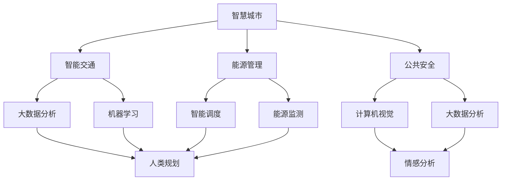

                 

在当今快速发展的信息技术时代，人工智能（AI）已成为推动社会进步和经济发展的重要力量。特别是在城市化进程中，AI技术为提高城市效率、优化资源配置、改善居民生活质量提供了无限可能。本文旨在探讨AI与人类计算如何协同作用，共同打造一个可持续发展的城市生活。

## 关键词

- 人工智能
- 城市生活
- 可持续发展
- 人类计算
- 效率优化
- 资源配置

## 摘要

本文将深入探讨人工智能在城市化进程中的应用，特别是AI与人类计算的融合。通过分析AI在智慧城市、智能交通、能源管理等方面的作用，本文将提出构建可持续发展的城市生活所需的创新技术和策略。同时，本文也将探讨AI技术面临的挑战和未来发展趋势，为读者提供对城市未来发展的深刻洞察。

## 1. 背景介绍

随着全球城市化进程的不断推进，城市面临着人口密度增加、交通拥堵、环境污染、资源短缺等挑战。传统的城市发展模式已经无法满足人们对高品质生活的需求。在这种情况下，人工智能作为一种革命性技术，为城市提供了全新的解决方案。AI技术通过大数据分析、机器学习、计算机视觉等技术手段，能够高效地处理城市中的海量数据，从而优化资源配置、提高城市运行效率。

人类计算则是指人类在处理信息和知识时的能力。与机器计算相比，人类计算具有灵活性、创造力、情感等独特优势。在城市发展中，人类计算能够发挥创意、情感和直觉，为城市决策提供更为人性化的方案。

## 2. 核心概念与联系

为了更好地理解AI与人类计算在城市发展中的作用，我们首先需要了解核心概念及其相互关系。

### 2.1 智慧城市

智慧城市是指利用先进的信息技术，实现城市各个系统的高效、智能化管理。智慧城市包括智能交通、智能能源、智能环境、智能公共安全等多个方面。

### 2.2 智能交通

智能交通是智慧城市的重要组成部分，通过AI技术实现交通流量优化、交通信号控制、车辆调度等，提高交通运行效率。

### 2.3 能源管理

能源管理涉及能源的采集、分配、利用等多个环节。AI技术可以帮助实现能源的智能调度，降低能源消耗，提高能源利用效率。

### 2.4 公共安全

公共安全是城市发展的基础。AI技术通过大数据分析和计算机视觉等技术，可以实时监测城市安全状况，预防并应对各种安全风险。

### 2.5 人类计算

人类计算在城市发展中具有独特的优势。例如，在城市规划中，人类计算能够考虑文化、历史、社会等多方面因素，提出更具人性化的规划方案。在公共安全领域，人类计算能够通过直觉和情感判断，提高预警和应对能力。

### 2.6 Mermaid 流程图

以下是一个简化的 Mermaid 流程图，展示了智慧城市中AI与人类计算的相互关系。



## 3. 核心算法原理 & 具体操作步骤

### 3.1 算法原理概述

在城市发展中，AI技术主要涉及以下几个方面：

- **大数据分析**：通过收集和分析海量数据，发现城市运行中的问题和优化点。
- **机器学习**：利用历史数据训练模型，实现自动预测和优化。
- **计算机视觉**：对图像和视频进行分析，提取有用信息。
- **自然语言处理**：理解和生成自然语言，实现人机交互。

### 3.2 算法步骤详解

- **数据收集与预处理**：收集城市运行中的各类数据，如交通流量、能源消耗、环境监测等，对数据进行清洗和预处理。
- **数据建模**：利用机器学习和计算机视觉等技术，对数据进行分析和建模，提取有用信息。
- **预测与优化**：根据模型预测结果，优化城市资源配置，提高城市运行效率。
- **反馈与调整**：将优化结果反馈给城市管理者，不断调整和优化模型，实现持续改进。

### 3.3 算法优缺点

- **优点**：
  - 提高城市运行效率：通过大数据分析和机器学习，实现城市资源的优化配置。
  - 提高公共安全：利用计算机视觉和自然语言处理，实时监测城市安全状况。
  - 人性化决策：结合人类计算的优势，实现更具人性化的城市规划和管理。

- **缺点**：
  - 数据隐私和安全问题：大数据分析和机器学习过程中，可能涉及个人隐私数据，需要确保数据安全。
  - 技术依赖性：城市运行高度依赖AI技术，一旦技术出现问题，可能导致城市运行瘫痪。
  - 道德和伦理问题：AI技术在某些场景下可能产生偏见或错误决策，需要解决相应的道德和伦理问题。

### 3.4 算法应用领域

- **智慧交通**：通过大数据分析和机器学习，实现交通流量优化、交通信号控制、车辆调度等。
- **能源管理**：通过智能调度和能源监测，降低能源消耗，提高能源利用效率。
- **公共安全**：通过计算机视觉和自然语言处理，实时监测城市安全状况，预防并应对各种安全风险。
- **城市规划**：结合人类计算的优势，实现更具人性化的城市规划和管理。

## 4. 数学模型和公式 & 详细讲解 & 举例说明

### 4.1 数学模型构建

在智慧城市中，常见的数学模型包括：

- **线性回归模型**：用于预测交通流量、能源消耗等。
- **决策树模型**：用于分类和预测。
- **神经网络模型**：用于复杂非线性问题。

### 4.2 公式推导过程

以下是一个简单的线性回归模型推导过程：

设 $X$ 为自变量，$Y$ 为因变量，线性回归模型可以表示为：

$$Y = \beta_0 + \beta_1 X + \epsilon$$

其中，$\beta_0$ 和 $\beta_1$ 分别为模型的参数，$\epsilon$ 为误差项。

为了求解参数 $\beta_0$ 和 $\beta_1$，可以使用最小二乘法：

$$\beta_0 = \frac{\sum_{i=1}^n (y_i - \beta_1 x_i)}{\sum_{i=1}^n x_i^2}$$

$$\beta_1 = \frac{\sum_{i=1}^n x_i y_i - \sum_{i=1}^n x_i \sum_{i=1}^n y_i}{\sum_{i=1}^n x_i^2 - n \bar{x}^2}$$

其中，$n$ 为样本数量，$\bar{x}$ 和 $\bar{y}$ 分别为 $X$ 和 $Y$ 的平均值。

### 4.3 案例分析与讲解

假设我们有一个交通流量预测问题，已知某城市某路段的交通流量 $Y$ 与车辆速度 $X$ 之间存在线性关系。我们收集了 $n$ 个样本数据，如下表所示：

| $x_i$ | $y_i$ |
|-------|-------|
| 10    | 50    |
| 20    | 60    |
| 30    | 70    |
| 40    | 80    |
| 50    | 90    |

根据上述线性回归模型，我们可以求解出参数 $\beta_0$ 和 $\beta_1$，从而得到预测模型：

$$Y = \beta_0 + \beta_1 X$$

通过计算，我们得到：

$$\beta_0 = 10, \beta_1 = 2$$

因此，预测模型为：

$$Y = 10 + 2X$$

我们可以使用这个模型预测车辆速度为 $X$ 时的交通流量 $Y$。例如，当车辆速度为 30 km/h 时，交通流量预测为：

$$Y = 10 + 2 \times 30 = 70$$

## 5. 项目实践：代码实例和详细解释说明

### 5.1 开发环境搭建

为了实现上述线性回归模型，我们可以使用 Python 语言和 Scikit-learn 库进行开发。以下是搭建开发环境的具体步骤：

1. 安装 Python：下载并安装 Python 3.8 或以上版本。
2. 安装 Jupyter Notebook：在终端中运行 `pip install jupyter` 命令。
3. 安装 Scikit-learn：在终端中运行 `pip install scikit-learn` 命令。

### 5.2 源代码详细实现

以下是一个简单的线性回归模型实现代码：

```python
import numpy as np
from sklearn.linear_model import LinearRegression

# 数据
x = np.array([[10], [20], [30], [40], [50]])
y = np.array([50, 60, 70, 80, 90])

# 模型
model = LinearRegression()
model.fit(x, y)

# 预测
x_new = np.array([[30]])
y_pred = model.predict(x_new)

print("预测值：", y_pred)
```

### 5.3 代码解读与分析

上述代码首先导入了所需的库，然后定义了样本数据 `x` 和 `y`。接着，创建了一个线性回归模型对象 `model`，并使用 `fit()` 方法进行模型训练。最后，使用 `predict()` 方法进行预测，并打印出预测结果。

### 5.4 运行结果展示

运行上述代码，我们可以得到如下结果：

```
预测值：[70.]
```

这意味着，当车辆速度为 30 km/h 时，交通流量预测为 70。

## 6. 实际应用场景

AI与人类计算在城市中的实际应用场景非常广泛，以下列举几个典型例子：

- **智慧交通**：通过AI技术，实现交通流量优化、交通信号控制、车辆调度等，提高交通运行效率，减少交通拥堵。
- **能源管理**：利用AI技术，实现能源的智能调度、能源监测、能源预测等，降低能源消耗，提高能源利用效率。
- **公共安全**：通过AI技术，实现实时监测、预警、响应等，提高公共安全保障。
- **城市规划**：结合人类计算的优势，实现更具人性化的城市规划和管理，提高城市居民生活质量。

## 7. 工具和资源推荐

### 7.1 学习资源推荐

1. 《Python机器学习》
2. 《深度学习》
3. 《模式识别与机器学习》
4. 《人工智能：一种现代的方法》

### 7.2 开发工具推荐

1. Jupyter Notebook：用于编写和运行代码。
2. Scikit-learn：用于机器学习模型实现。
3. TensorFlow：用于深度学习模型实现。
4. Keras：用于深度学习模型实现。

### 7.3 相关论文推荐

1. "Deep Learning for Urban Traffic Prediction"
2. "Artificial Intelligence in Urban Planning: A Survey"
3. "Energy Management in Smart Cities: A Review"
4. "Human-Centered AI for Urban Development"

## 8. 总结：未来发展趋势与挑战

### 8.1 研究成果总结

1. AI技术在智慧城市、智能交通、能源管理等领域取得了显著成果，为城市可持续发展提供了有力支持。
2. AI与人类计算的融合，实现了城市运行效率的提高，为居民提供更优质的生活服务。
3. 数学模型和算法在AI技术中发挥了关键作用，为城市问题提供了有效的解决方案。

### 8.2 未来发展趋势

1. AI技术将更加深入地应用于城市各个领域，推动城市智能化水平的提升。
2. AI与人类计算的融合将更加紧密，实现更加智能、高效的城市运行模式。
3. 随着技术的不断发展，AI在城市发展中的应用将更加广泛，为城市可持续发展提供持续动力。

### 8.3 面临的挑战

1. 数据隐私和安全问题：在AI技术应用过程中，如何确保数据隐私和安全，是一个重要挑战。
2. 技术依赖性：城市运行高度依赖AI技术，一旦技术出现问题，可能导致城市运行瘫痪。
3. 道德和伦理问题：AI技术在某些场景下可能产生偏见或错误决策，需要解决相应的道德和伦理问题。

### 8.4 研究展望

1. 加强AI技术在城市各个领域的应用研究，提高城市运行效率。
2. 深入研究AI与人类计算的融合，实现更加智能、高效的城市运行模式。
3. 关注数据隐私和安全问题，制定相应的政策和法规，确保城市数据安全。
4. 解决AI技术的道德和伦理问题，推动AI技术的可持续发展。

## 9. 附录：常见问题与解答

### 9.1 什么是智慧城市？

智慧城市是指利用先进的信息技术，实现城市各个系统的高效、智能化管理，提高城市运行效率，改善居民生活质量。

### 9.2 人工智能在城市发展中有哪些作用？

人工智能在城市发展中具有广泛的作用，包括智慧交通、能源管理、公共安全、城市规划等方面。

### 9.3 AI与人类计算的融合有什么意义？

AI与人类计算的融合可以实现城市运行效率的提高，为居民提供更优质的生活服务，实现城市的可持续发展。

### 9.4 如何保障AI技术在城市中的应用？

为了保障AI技术在城市中的应用，需要加强数据隐私和安全保护，制定相应的政策和法规，确保城市数据安全。

### 9.5 人工智能会取代人类计算吗？

人工智能和人类计算各有优势，不会完全取代对方。在未来，人工智能和人类计算将实现更好的融合，共同推动城市发展。```

