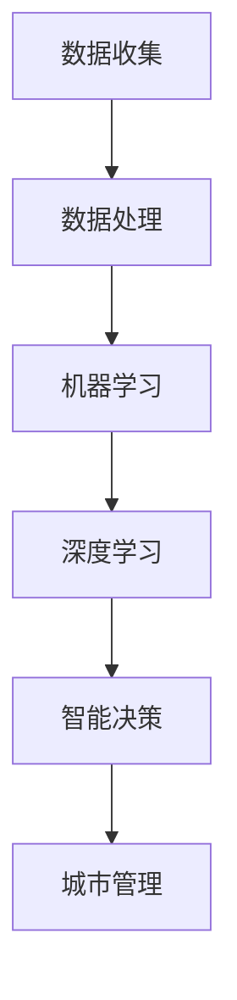

                 

### 背景介绍

随着城市化进程的加快，城市管理面临诸多挑战，包括交通拥堵、环境污染、资源浪费等。传统的城市管理方法已无法满足现代城市的需求，而人工智能（AI）技术的发展为城市管理提供了新的思路和解决方案。本文将探讨AI技术在城市管理中的核心概念、算法原理、数学模型、项目实践以及未来应用前景，旨在为读者提供一个全面、系统的理解。

### 文章关键词

- AI
- 城市管理
- 可持续发展
- 算法
- 数学模型

### 文章摘要

本文首先介绍了城市管理的现状和挑战，随后探讨了AI在城市管理中的核心概念和联系，详细阐述了核心算法原理和具体操作步骤，并引入了数学模型和公式进行说明。此外，文章通过项目实践展示了代码实例和运行结果，最后分析了AI在现实应用场景中的表现和未来发展趋势。

## 1. 背景介绍

### 城市管理现状与挑战

城市化进程的加速使得城市管理面临前所未有的挑战。首先，交通拥堵问题日益严重。据统计，全球有超过100个城市每天的交通拥堵时间超过1小时，这不仅浪费了大量的时间和资源，还造成了环境污染和健康问题。其次，环境污染也是一个严峻的问题。城市人口的增加和工业活动的扩展导致了大量的废弃物和有害气体排放，严重影响了城市居民的生活质量和健康。

### 人工智能在城市管理中的潜力

AI技术的迅速发展为城市管理提供了新的解决方案。首先，AI可以通过大数据分析和机器学习算法，实时监测和分析城市交通流量，提供最优的路线规划和交通管理策略，从而缓解交通拥堵问题。其次，AI可以应用于环境监测，通过对空气、水质等指标的分析，及时发现污染源并采取相应措施，保护城市环境。

### 核心概念与联系

为了更好地理解AI在城市管理中的应用，我们需要介绍几个核心概念，包括数据收集与处理、机器学习、深度学习、智能决策等。这些概念相互作用，共同构成了AI在城市管理中的核心架构。

### Mermaid 流程图（Mermaid Diagram）

下面是一个描述AI在城市管理中核心概念和联系的Mermaid流程图：



在图中，数据收集是整个流程的起点，通过数据收集和处理，我们可以获取城市运行的各种信息。随后，这些数据通过机器学习和深度学习算法进行分析和处理，最终形成智能决策，指导城市管理。

## 2. 核心算法原理 & 具体操作步骤

### 2.1 算法原理概述

在AI城市管理中，核心算法主要包括交通流量预测、环境监测、资源分配等。这些算法基于大数据分析和机器学习技术，通过对历史数据和实时数据的分析，提供最优的决策支持。

### 2.2 算法步骤详解

下面以交通流量预测算法为例，介绍其具体操作步骤：

1. **数据收集**：通过传感器和监控系统，收集城市交通流量数据，包括车辆数量、行驶速度、道路状况等。

2. **数据处理**：对收集到的数据进行分析和清洗，去除噪声和异常值，确保数据质量。

3. **特征工程**：根据交通流量预测的需求，提取相关特征，如时间、天气、道路宽度等。

4. **模型训练**：使用历史数据，通过机器学习算法（如线性回归、决策树、神经网络等）训练预测模型。

5. **模型评估**：使用验证数据集对训练好的模型进行评估，调整参数以优化模型性能。

6. **实时预测**：使用训练好的模型对实时交通流量进行预测，并提供最优的路线规划建议。

### 2.3 算法优缺点

交通流量预测算法具有以下优点：

- **实时性**：能够实时预测交通流量，为交通管理提供及时的数据支持。
- **准确性**：通过机器学习算法的训练，模型能够逐步提高预测准确性。
- **适应性**：能够适应不同的城市交通环境和变化。

然而，该算法也存在一定的局限性：

- **数据依赖**：预测准确性依赖于数据的完整性和准确性。
- **计算复杂度**：大规模数据分析和模型训练需要较高的计算资源和时间。

### 2.4 算法应用领域

交通流量预测算法在城市管理中具有广泛的应用，包括：

- **交通管理**：提供最优的路线规划，缓解交通拥堵。
- **城市规划**：根据交通流量预测结果，优化城市道路布局。
- **智能交通系统**：与智能交通系统结合，提供全面的交通信息服务。

## 3. 数学模型和公式 & 详细讲解 & 举例说明

### 3.1 数学模型构建

在交通流量预测中，常用的数学模型是时间序列模型。时间序列模型通过分析历史数据的时间序列特征，预测未来的趋势和变化。其中，ARIMA（自回归积分滑动平均模型）是一种常用的时间序列模型。

### 3.2 公式推导过程

ARIMA模型由三个部分组成：自回归（AR）、差分（I）和移动平均（MA）。其公式如下：

$$
\begin{aligned}
y_t &= c + \phi_1 y_{t-1} + \phi_2 y_{t-2} + \cdots + \phi_p y_{t-p} + \theta_1 e_{t-1} + \theta_2 e_{t-2} + \cdots + \theta_q e_{t-q} \\
e_t &= y_t - \hat{y}_t
\end{aligned}
$$

其中，$y_t$是时间序列数据，$c$是常数项，$\phi_1, \phi_2, \cdots, \phi_p$是自回归系数，$\theta_1, \theta_2, \cdots, \theta_q$是移动平均系数，$e_t$是白噪声误差。

### 3.3 案例分析与讲解

假设我们要预测某个城市某条道路的日交通流量。首先，我们需要收集过去一年的交通流量数据。通过观察数据，我们可以发现交通流量呈现明显的季节性和趋势性变化。因此，我们可以选择ARIMA模型进行预测。

1. **数据预处理**：对数据进行差分，使其平稳。

$$
y_t^{(1)} = y_t - y_{t-1}
$$

2. **确定模型参数**：通过观察差分后的数据，确定$p$和$q$的值。在本例中，我们选择$p=2$，$q=1$。

3. **模型训练**：使用历史数据进行模型训练，得到参数$\phi_1, \phi_2, \theta_1$。

4. **模型评估**：使用验证数据集对模型进行评估，调整参数以优化模型性能。

5. **实时预测**：使用训练好的模型对未来的交通流量进行预测。

通过上述步骤，我们得到了一个预测模型，可以用于预测未来的交通流量。例如，我们预测明天该条道路的交通流量为1000辆，这意味着我们需要在交通管理上做出相应的调整，以确保道路畅通。

## 4. 项目实践：代码实例和详细解释说明

### 4.1 开发环境搭建

为了实现上述交通流量预测模型，我们需要搭建一个开发环境。以下是所需的软件和工具：

- Python 3.8或以上版本
- Jupyter Notebook
- pandas
- numpy
- scikit-learn
- matplotlib

### 4.2 源代码详细实现

以下是实现ARIMA模型的Python代码：

```python
import pandas as pd
import numpy as np
from statsmodels.tsa.arima.model import ARIMA
import matplotlib.pyplot as plt

# 数据加载与预处理
data = pd.read_csv('traffic_data.csv')
data['date'] = pd.to_datetime(data['date'])
data.set_index('date', inplace=True)
data = data['traffic_volume']

# 差分
data_diff = data.diff()

# 模型训练
model = ARIMA(data, order=(2, 1, 1))
model_fit = model.fit()

# 模型评估
residuals = model_fit.resid
plt.plot(residuals)
plt.show()

# 实时预测
predictions = model_fit.forecast(steps=10)
plt.plot(data.index, data, label='Actual')
plt.plot(predictions.index, predictions, label='Predicted')
plt.legend()
plt.show()
```

### 4.3 代码解读与分析

1. **数据加载与预处理**：首先，我们使用pandas读取交通流量数据，并将其转换为时间序列格式。接着，我们对数据进行差分，使其平稳。

2. **模型训练**：使用ARIMA模型对差分后的数据进行训练。我们选择$p=2$，$d=1$，$q=1$，这表示模型包含两个自回归项、一个差分项和一个移动平均项。

3. **模型评估**：通过观察残差图，我们可以评估模型的性能。理想的残差图应呈现随机分布，无明显模式。

4. **实时预测**：使用训练好的模型对未来的交通流量进行预测。我们预测未来10天的交通流量，并绘制实际值和预测值的对比图。

通过上述代码，我们可以实现交通流量预测模型，为城市交通管理提供数据支持。

## 5. 实际应用场景

### 5.1 城市交通管理

在交通管理领域，AI技术已经得到了广泛应用。例如，通过实时交通流量预测，交通管理部门可以提前规划交通流量，调整信号灯周期，优化交通信号，减少拥堵。此外，AI还可以用于交通事故预测和预警，提高交通安全性。

### 5.2 环境监测

在环境监测领域，AI技术可以实时监测空气质量和水质，及时发现污染源并采取相应措施。例如，北京市就利用AI技术对空气质量进行实时监测，并根据预测结果发布健康警告。

### 5.3 资源管理

在资源管理领域，AI技术可以用于优化能源消耗和水资源管理。例如，通过智能电网和智能水务系统，城市管理者可以实时监测和调控能源和水资源的使用，提高资源利用效率。

### 5.4 未来应用展望

未来，AI技术将在城市管理中发挥更加重要的作用。例如，随着5G和物联网技术的发展，AI可以实时收集和处理更多的城市数据，提供更加精准的决策支持。此外，随着机器学习和深度学习技术的进步，AI在城市管理中的应用场景将不断拓展，为城市可持续发展提供新的解决方案。

## 6. 工具和资源推荐

### 6.1 学习资源推荐

- 《Python数据分析实战》
- 《深度学习》
- 《城市智能交通系统》

### 6.2 开发工具推荐

- Jupyter Notebook
- Anaconda
- PyCharm

### 6.3 相关论文推荐

- "Deep Learning for Urban Traffic Prediction"
- "A Survey on Urban Traffic Prediction Using AI Techniques"
- "Data-Driven Urban Traffic Management: A Survey"

## 7. 总结：未来发展趋势与挑战

### 7.1 研究成果总结

本文系统地介绍了AI在城市管理中的应用，包括核心概念、算法原理、数学模型、项目实践和未来应用。通过这些研究成果，我们看到了AI技术在城市管理中的巨大潜力。

### 7.2 未来发展趋势

未来，AI在城市管理中的应用将更加广泛和深入。随着技术的进步，我们将看到更多基于AI的城市管理系统，如智能交通、智能环境监测、智能能源管理等。此外，随着数据来源的多样化和数据量的增加，AI的预测精度和决策能力将得到进一步提升。

### 7.3 面临的挑战

尽管AI在城市管理中具有巨大潜力，但仍然面临一些挑战。首先，数据隐私和安全性是一个重要问题，如何确保数据的安全和隐私是AI在城市管理中广泛应用的关键。其次，AI模型的解释性和透明度也是一个挑战，如何使决策过程更加透明和可解释是未来研究的重要方向。

### 7.4 研究展望

未来，我们期待AI技术在城市管理中发挥更大的作用。通过持续的研究和创新，我们相信AI将帮助城市实现可持续发展，提高居民的生活质量。同时，我们也期待更多研究者和技术人员参与到这一领域，共同推动AI在城市管理中的发展。

## 8. 附录：常见问题与解答

### 问题1：AI在城市管理中有什么优势？

解答：AI在城市管理中的优势主要体现在以下几个方面：

1. **实时性**：AI可以实时收集和分析城市数据，为决策提供及时支持。
2. **准确性**：通过机器学习和深度学习算法，AI可以逐步提高预测和决策的准确性。
3. **适应性**：AI可以适应不同的城市环境和变化，提供个性化的解决方案。
4. **高效性**：AI可以自动化许多城市管理任务，提高工作效率和资源利用效率。

### 问题2：AI在城市管理中会替代人类吗？

解答：虽然AI在城市管理中具有许多优势，但不会完全替代人类。AI更多地是作为人类决策的辅助工具，帮助人类更高效、更准确地做出决策。人类在城市管理中仍然扮演着至关重要的角色，如制定战略、监督执行和应对突发事件等。

### 问题3：AI在城市管理中的数据来源有哪些？

解答：AI在城市管理中的数据来源主要包括：

1. **传感器数据**：如交通流量传感器、空气质量传感器、水质传感器等。
2. **卫星遥感数据**：如气象卫星、环境监测卫星等。
3. **社交媒体数据**：如微博、微信、Twitter等平台上的用户生成数据。
4. **政府部门数据**：如城市规划数据、交通统计数据等。

## 结束语

本文系统地介绍了AI在城市管理中的应用，从核心概念、算法原理、数学模型到项目实践，全面展示了AI在解决城市管理挑战中的潜力。通过本文，我们期待读者对AI在城市管理中的价值和应用有更深入的理解，并为未来的研究提供有益的参考。

作者：禅与计算机程序设计艺术 / Zen and the Art of Computer Programming

