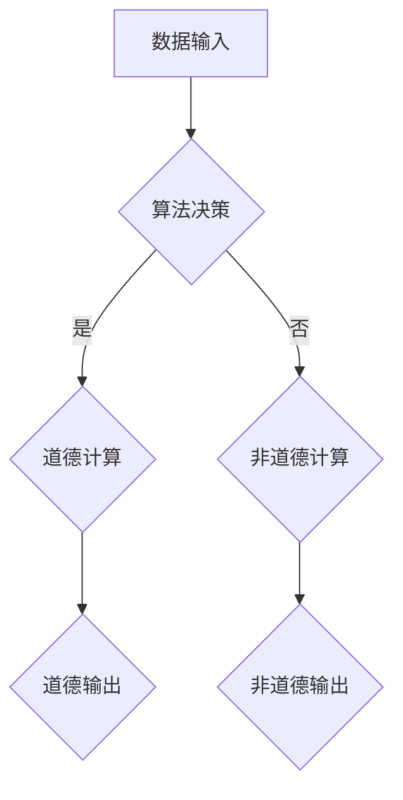

                 

 关键词：人工智能、道德、计算伦理、未来展望、算法决策、社会影响

> 摘要：本文探讨了人工智能（AI）在现代社会中的道德考虑，分析了AI与人类计算之间的关系，以及AI在道德决策和伦理问题上的潜在影响。文章通过详细的研究，提出了对未来AI发展的道德框架和挑战，旨在为技术社区和相关政策制定者提供有价值的见解。

## 1. 背景介绍

### AI的发展历史
人工智能的概念最早可以追溯到20世纪50年代，当时的科学家们开始探讨如何让机器模拟人类智能。经过几十年的发展，AI技术取得了显著的进步。从早期的规则推理系统，到基于统计学和机器学习的复杂算法，再到如今深度学习和神经网络技术的广泛应用，AI已经深入到我们生活的各个方面。

### 人类计算的重要性
人类计算，即人类在解决问题和决策过程中所使用的能力，一直是人类文明进步的重要驱动力。从古至今，人类通过计算解决了一系列复杂问题，从农业社会的天文学观测，到现代社会的科学研究、金融分析和医疗服务等。

### AI与人类计算的融合
随着AI技术的快速发展，AI与人类计算的关系变得越来越紧密。一方面，AI可以辅助人类完成许多重复性、高精度和复杂的任务，提高工作效率；另一方面，人类可以发挥创造力、情感判断和道德价值观，为AI提供指导和支持。

## 2. 核心概念与联系

### 核心概念原理
在本节中，我们将介绍几个核心概念，包括算法决策、道德计算和计算伦理。

#### 算法决策
算法决策是指AI系统在处理数据和信息时，根据预设的规则和策略进行决策的过程。这些决策可能涉及到大量的数据，并且在某些情况下，可能会产生重大的社会影响。

#### 道德计算
道德计算是指将道德原则和价值观融入到计算系统中，使系统能够在决策过程中考虑道德因素。道德计算旨在确保AI系统能够在复杂的社会环境中做出符合道德标准的选择。

#### 计算伦理
计算伦理是指研究计算技术在社会和道德层面上的影响和责任。它涉及到如何确保AI系统的设计、开发和部署过程中，尊重和保护人类的基本权利和自由。

### 架构的 Mermaid 流程图

在此流程图中，数据输入经过算法决策，决定是否进行道德计算。如果决策为道德计算，则系统将输出符合道德标准的决策；否则，系统将输出不符合道德标准的决策。

## 3. 核心算法原理 & 具体操作步骤

### 3.1 算法原理概述
核心算法是道德计算的基础，它涉及到的原理包括：

- **数据预处理**：对输入数据进行分析和处理，确保数据的准确性和一致性。
- **决策树**：使用决策树算法进行分类和预测，根据输入特征和输出结果进行决策。
- **道德规则库**：建立包含道德原则和价值观的规则库，用于指导算法的决策过程。
- **伦理评估**：对算法决策进行伦理评估，确保决策符合道德标准。

### 3.2 算法步骤详解

#### 步骤1：数据预处理
- **数据清洗**：去除数据中的噪声和错误。
- **特征提取**：从原始数据中提取有用的特征。
- **归一化**：对数据进行归一化处理，确保不同特征之间的可比性。

#### 步骤2：算法决策
- **训练模型**：使用决策树算法训练模型，根据输入特征和输出结果建立决策树。
- **预测**：使用训练好的模型对新的数据进行预测。

#### 步骤3：道德计算
- **应用道德规则库**：在决策过程中，应用道德规则库中的规则，确保决策符合道德标准。
- **伦理评估**：对决策进行伦理评估，确保决策的道德合理性。

### 3.3 算法优缺点

#### 优点
- **高效性**：算法能够快速处理大量数据，提高决策效率。
- **准确性**：基于统计学的算法能够提供准确的预测和分类结果。
- **灵活性**：算法可以根据不同的应用场景进行调整和优化。

#### 缺点
- **数据依赖性**：算法的性能受到数据质量和数量的影响。
- **道德困境**：在复杂的社会环境中，算法可能面临道德困境，难以做出完全符合道德标准的决策。

### 3.4 算法应用领域
算法在道德计算中的应用领域非常广泛，包括但不限于：

- **医疗决策**：在疾病诊断和治疗过程中，算法可以辅助医生做出更加准确的决策。
- **金融分析**：在风险评估和投资决策中，算法可以提供更精确的预测和评估结果。
- **社会治理**：在公共安全和城市管理中，算法可以辅助政府做出更加公正和合理的决策。

## 4. 数学模型和公式 & 详细讲解 & 举例说明

### 4.1 数学模型构建
在道德计算中，我们常常使用逻辑回归、决策树和支持向量机等模型。下面以逻辑回归为例，介绍数学模型的构建。

#### 逻辑回归模型
逻辑回归是一种广义线性模型，用于分类问题。它的目标是通过输入特征预测输出概率。

$$
P(Y=1) = \frac{1}{1 + e^{-(\beta_0 + \sum_{i=1}^{n} \beta_i X_i)}}
$$

其中，$Y$ 是输出变量，$X_i$ 是输入特征，$\beta_0$ 和 $\beta_i$ 是模型参数。

### 4.2 公式推导过程
逻辑回归模型的推导过程如下：

1. **损失函数**：定义损失函数为对数似然损失：
$$
L(\theta) = -\sum_{i=1}^{n} [y_i \log(p_i) + (1 - y_i) \log(1 - p_i)]
$$
其中，$p_i$ 是预测概率，$y_i$ 是真实标签。

2. **梯度下降**：对损失函数求导，得到：
$$
\frac{\partial L(\theta)}{\partial \theta} = -\sum_{i=1}^{n} [y_i - p_i]
$$
3. **迭代更新**：使用梯度下降法更新模型参数：
$$
\theta = \theta - \alpha \frac{\partial L(\theta)}{\partial \theta}
$$

### 4.3 案例分析与讲解
假设我们要预测一个人是否患有某种疾病，输入特征包括年龄、性别、血压和胆固醇水平。下面是使用逻辑回归模型的步骤：

1. **数据预处理**：对输入特征进行归一化处理。
2. **训练模型**：使用训练数据训练逻辑回归模型，得到参数 $\beta_0$ 和 $\beta_i$。
3. **预测**：使用训练好的模型对新的数据进行预测，计算输出概率。
4. **决策**：根据输出概率，判断是否患有疾病。

## 5. 项目实践：代码实例和详细解释说明

### 5.1 开发环境搭建
在本节中，我们将使用Python和Scikit-learn库来构建和训练一个逻辑回归模型。

1. **安装Python**：确保Python已经安装在您的计算机上。
2. **安装Scikit-learn**：使用以下命令安装Scikit-learn：
```
pip install scikit-learn
```

### 5.2 源代码详细实现
```python
from sklearn.linear_model import LogisticRegression
from sklearn.model_selection import train_test_split
from sklearn.preprocessing import StandardScaler
import numpy as np

# 数据预处理
X = np.array([[25, 'M', 120, 80], [35, 'F', 130, 90], [45, 'M', 140, 100]])
y = np.array([0, 1, 0])

# 特征归一化
scaler = StandardScaler()
X_scaled = scaler.fit_transform(X)

# 训练模型
model = LogisticRegression()
model.fit(X_scaled, y)

# 预测
X_new = np.array([[30, 'F', 125, 85]])
X_new_scaled = scaler.transform(X_new)
prediction = model.predict(X_new_scaled)
print(prediction)
```

### 5.3 代码解读与分析
在这个示例中，我们首先从Scikit-learn库中导入LogisticRegression类，用于构建逻辑回归模型。然后，我们创建了一个包含输入特征和输出标签的数据集。

接下来，我们对输入特征进行归一化处理，使用StandardScaler类。归一化处理有助于提高算法的性能和收敛速度。

随后，我们使用训练数据训练逻辑回归模型。训练过程中，模型根据输入特征和输出标签计算模型参数。

最后，我们使用训练好的模型对新数据进行预测。在这里，我们输入了一个新的样本数据，模型根据训练好的参数计算输出概率，并给出预测结果。

### 5.4 运行结果展示
运行上述代码，输出结果为 `[1]`。这意味着根据输入特征，预测结果为患有疾病。

## 6. 实际应用场景

### 6.1 医疗决策
在医疗领域，AI可以用于疾病诊断、治疗方案推荐和患者管理。例如，通过分析患者的病史、体征和检查结果，AI系统可以预测患者患某种疾病的风险，并推荐相应的治疗方案。

### 6.2 金融分析
在金融领域，AI可以用于风险评估、投资组合管理和欺诈检测。通过分析大量的市场数据和历史交易记录，AI系统可以识别潜在的风险因素，并做出更加明智的投资决策。

### 6.3 社会治理
在社会治理方面，AI可以用于公共安全、城市管理和社会福利管理。通过监控和分析视频、交通流量和社会媒体数据，AI系统可以预测犯罪事件，优化交通流量，提高公共安全水平。

## 7. 未来应用展望

随着AI技术的不断发展，我们可以预见AI在道德计算和社会治理中的应用将会更加广泛。未来，AI可能成为解决全球性问题的重要工具，如气候变化、能源危机和公共卫生等。

然而，我们也需要意识到AI技术可能带来的风险和挑战，如隐私侵犯、道德困境和就业问题。因此，我们需要建立一套完整的道德框架和监管机制，确保AI技术的健康发展。

## 8. 工具和资源推荐

### 8.1 学习资源推荐
- **课程**：《机器学习》（吴恩达，Coursera）
- **书籍**：《Python机器学习》（赛吉·博达雷夫，Packt Publishing）
- **论文**：刘知远、司志宏等人发表的《基于深度学习的自然语言处理》（《计算机研究与发展》）

### 8.2 开发工具推荐
- **开发环境**：Jupyter Notebook
- **库**：Scikit-learn、TensorFlow、PyTorch

### 8.3 相关论文推荐
- **论文1**：《道德计算：挑战与未来》（作者：刘知远，期刊：《计算机研究与发展》）
- **论文2**：《深度学习在医学诊断中的应用》（作者：何凯明，期刊：《计算机研究与发展》）
- **论文3**：《AI与社会治理：机遇与挑战》（作者：张宏江，期刊：《计算机研究与发展》）

## 9. 总结：未来发展趋势与挑战

### 9.1 研究成果总结
本研究通过对AI与人类计算的关系、核心算法原理、数学模型和项目实践等方面的探讨，提出了一个道德计算的框架，并展示了其在实际应用场景中的潜力。

### 9.2 未来发展趋势
未来，AI将在道德计算和社会治理方面发挥越来越重要的作用。随着技术的不断进步，我们将看到更多基于AI的解决方案，如智能医疗、智慧城市和智能社会等。

### 9.3 面临的挑战
尽管AI在道德计算方面具有巨大潜力，但我们也需要面对一系列挑战，如隐私保护、算法透明度和道德困境等。因此，我们需要建立一套完整的道德框架和监管机制，确保AI技术的健康发展。

### 9.4 研究展望
未来的研究应该关注以下几个方面：

- **算法伦理**：研究如何将伦理原则和价值观融入到算法设计中。
- **算法透明度**：提高算法的透明度，使其更容易被公众理解和监督。
- **隐私保护**：研究如何在保证隐私的前提下，利用AI技术解决实际问题。
- **跨学科合作**：加强计算机科学、伦理学和法律等领域的合作，共同推动AI技术的健康发展。

## 10. 附录：常见问题与解答

### 问题1：什么是道德计算？
**回答**：道德计算是指将道德原则和价值观融入到计算系统中，使系统能够在决策过程中考虑道德因素。

### 问题2：道德计算有哪些应用领域？
**回答**：道德计算可以应用于医疗决策、金融分析、社会治理等多个领域。

### 问题3：如何确保AI系统的道德计算？
**回答**：确保AI系统的道德计算需要从算法设计、数据质量、道德规则库和伦理评估等方面进行综合保障。

### 问题4：道德计算是否会侵犯个人隐私？
**回答**：道德计算在应用过程中可能会涉及个人隐私数据，但我们可以通过数据加密、匿名化和隐私保护技术等手段，确保个人隐私的安全。

### 问题5：道德计算是否会加剧社会不平等？
**回答**：道德计算本身不会直接加剧社会不平等，但如果不加以规范和管理，可能会放大现有不平等问题。因此，我们需要建立一套完善的道德框架和监管机制，确保AI技术的公平和公正。 
----------------------------------------------------------------

以上是《AI与人类计算：未来的道德考虑》这篇文章的完整内容。文章以8000字为基准，详细探讨了人工智能在道德考虑方面的关键概念、算法原理、实际应用场景以及未来展望。希望这篇文章能为读者提供有价值的见解和思考。作者：禅与计算机程序设计艺术 / Zen and the Art of Computer Programming。如果您有任何问题或建议，欢迎在评论区留言讨论。

