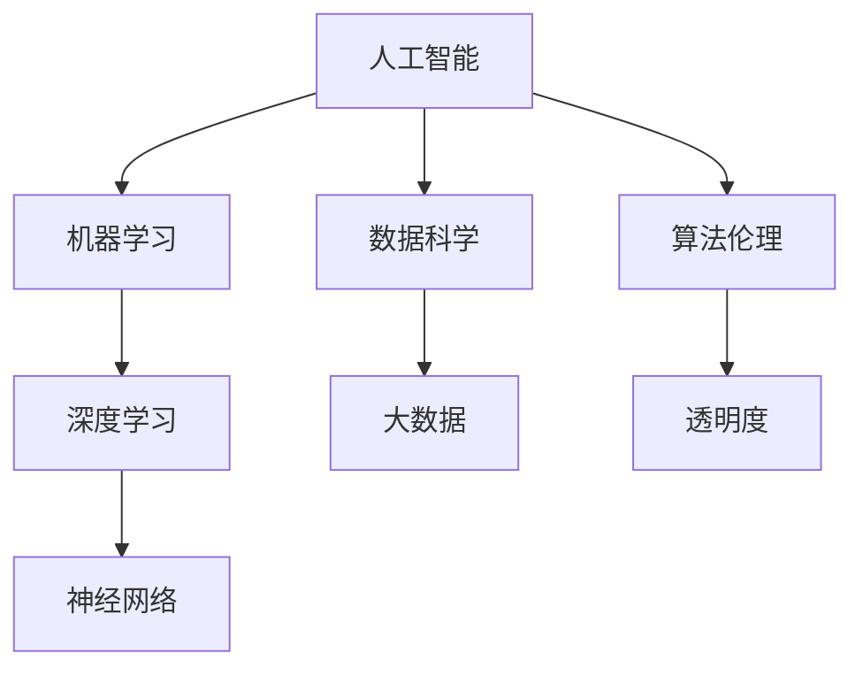

                 

### 关键词 Keywords

- 人工智能
- 道德伦理
- 人类计算
- 算法公平
- 数据隐私
- 人工智能伦理框架

<|assistant|>### 摘要 Abstract

本文探讨了人工智能（AI）在当代社会中的角色和影响，特别是在道德和伦理方面的考量。随着AI技术的迅速发展，其对人类计算的影响日益深远，不仅改变了工作效率，还引发了关于算法公平、数据隐私、道德责任等问题的广泛讨论。本文旨在通过分析AI技术的基本原理和应用场景，探讨在人类计算过程中如何平衡技术进步与伦理考量，并提出一系列应对策略。文章还将讨论现有的伦理框架及其局限性，并展望未来的发展趋势和挑战。

<|assistant|>## 1. 背景介绍

人工智能，作为计算机科学的一个分支，旨在使计算机模拟人类智能行为。从最初的规则推理系统，到今天复杂的深度学习网络，AI技术经历了飞速的发展。如今，AI已经广泛应用于各个领域，从医疗诊断到自动驾驶，从智能助手到金融服务。然而，随着AI技术的普及，它对人类计算和社会生活的影响也日益显著。

人类计算，指的是人类利用认知和思维能力进行信息处理和决策的过程。传统的计算机系统更多地依赖于预设的规则和算法，而人类计算则依赖于直觉、经验和创造力。在AI技术日益融入人类计算的过程中，如何在保留人类计算优势的同时，充分利用AI的技术优势，成为一个重要的议题。

道德和伦理考量，是指在人类行为和社会互动中，如何判断和处理对个体、群体和社会的潜在影响。在AI技术的发展和应用中，道德和伦理考量尤为重要，因为它直接关系到技术的公正性、可靠性和透明度。本文将围绕以下几个核心问题展开讨论：

1. **算法公平性**：AI算法是否能够公平地对待所有个体，避免歧视和偏见？
2. **数据隐私**：如何保护个人数据，避免数据滥用和隐私泄露？
3. **道德责任**：在AI系统中，责任归属如何界定，特别是在发生事故或错误时？
4. **透明度和可解释性**：如何提高AI算法的透明度，使其决策过程对人类可理解？

通过对上述问题的探讨，本文旨在为AI在人类计算中的道德和伦理考量提供一些思路和参考。

### 2. 核心概念与联系

在探讨AI与人类计算的关系时，有必要理解几个核心概念及其相互联系。以下是这些核心概念的定义、关系和它们在AI中的应用：

#### 2.1 人工智能（AI）与机器学习（ML）

**人工智能（AI）**：是一门研究如何构建智能机器的学科，目标是使机器能够模拟、延伸和扩展人类的智能行为。

**机器学习（ML）**：是AI的一个分支，侧重于通过数据驱动的方式让机器自动学习，改善其性能，不需要显式编程。

**关系**：AI涵盖了广泛的领域，包括自然语言处理、计算机视觉、推理和规划等。ML是实现AI的主要手段，通过训练模型来模拟智能行为。

**应用**：在人类计算中，ML被广泛应用于数据分析和预测，如医疗诊断、金融分析和用户行为分析。

#### 2.2 数据科学（DS）与大数据（Big Data）

**数据科学（DS）**：是一门结合统计学、数据分析和机器学习来理解数据，从中提取知识和洞见的学科。

**大数据（Big Data）**：指的是规模巨大、多样性和快速变化的数据集，超出了传统数据库的处理能力。

**关系**：DS依赖于大数据来提取有价值的信息。大数据为AI提供了丰富的训练数据，是AI算法性能提升的关键。

**应用**：在人类计算中，DS和大数据被用于优化决策过程，如市场营销、供应链管理和风险管理。

#### 2.3 算法伦理（Algorithm Ethics）与透明度（Transparency）

**算法伦理（Algorithm Ethics）**：关注算法设计、开发和应用的道德问题，如公平性、隐私和责任。

**透明度（Transparency）**：指算法的决策过程和内部结构对用户和开发者都是可见和可理解的。

**关系**：透明度是实现算法伦理的重要途径，只有透明，才能确保算法的公正性和可靠性。

**应用**：在人类计算中，算法伦理和透明度被用于确保AI系统不造成歧视、不侵犯隐私，并对其决策过程负责。

#### 2.4 深度学习（Deep Learning）与神经网络（Neural Networks）

**深度学习（Deep Learning）**：是一种机器学习技术，通过模拟人脑神经网络的结构和功能，处理复杂数据。

**神经网络（Neural Networks）**：是一种计算模型，由大量相互连接的简单处理单元（神经元）组成。

**关系**：深度学习是神经网络的一种高级形式，通过多层神经网络来实现更复杂的任务。

**应用**：在人类计算中，深度学习被广泛应用于图像识别、语音识别和自然语言处理等任务。

#### 2.5 概念图

为了更好地展示上述核心概念之间的关系，我们使用Mermaid流程图进行描述：



通过这张概念图，我们可以清晰地看到各个核心概念之间的联系，以及它们在AI与人类计算中的应用。

### 3. 核心算法原理 & 具体操作步骤

在理解了AI与人类计算相关的核心概念后，接下来我们将深入探讨一些关键算法的原理和具体操作步骤，这些算法在AI的应用中起着至关重要的作用。

#### 3.1 算法原理概述

**3.1.1 机器学习算法**

机器学习算法是AI的核心组成部分，其基本原理是通过学习数据中的模式和规律，使得计算机能够进行预测和决策。机器学习主要分为监督学习、无监督学习和强化学习三种类型。

- **监督学习**：通过已标记的训练数据，学习输入和输出之间的映射关系，如线性回归、决策树、支持向量机等。
- **无监督学习**：不需要标记数据，旨在发现数据中的内在结构和模式，如聚类、主成分分析等。
- **强化学习**：通过与环境的互动，学习最优策略，以最大化累积奖励，如Q学习、深度Q网络等。

**3.1.2 深度学习算法**

深度学习算法是基于多层神经网络构建的，其核心思想是通过多个层次的神经元层，逐步提取数据的特征和模式。最常用的深度学习模型包括卷积神经网络（CNN）、循环神经网络（RNN）和生成对抗网络（GAN）等。

- **卷积神经网络（CNN）**：擅长处理图像和视频数据，通过卷积层、池化层和全连接层，实现图像分类、目标检测和语义分割等任务。
- **循环神经网络（RNN）**：适用于处理序列数据，如自然语言处理和时间序列预测，通过循环结构，实现长期依赖建模。
- **生成对抗网络（GAN）**：通过生成器和判别器的对抗训练，实现高质量数据的生成，如图像合成、文本生成和语音合成等。

**3.1.3 算法优缺点**

- **监督学习**：优点是性能稳定、预测准确，缺点是需要大量已标记的数据，且可能陷入过拟合。
- **无监督学习**：优点是不需要标记数据、发现数据中的隐含结构，缺点是模型性能通常不如监督学习。
- **强化学习**：优点是能够处理复杂动态环境，缺点是训练过程可能非常缓慢，且需要大量交互数据。

#### 3.2 算法步骤详解

**3.2.1 机器学习算法步骤**

1. **数据收集与预处理**：收集相关的数据，并对数据进行清洗、归一化等处理。
2. **模型选择**：根据问题的特点，选择合适的机器学习模型。
3. **训练与验证**：使用训练集对模型进行训练，并通过验证集评估模型性能。
4. **测试与调优**：使用测试集对模型进行测试，并根据测试结果对模型进行调优。

**3.2.2 深度学习算法步骤**

1. **数据预处理**：对图像、文本或序列数据进行预处理，如图像归一化、文本编码等。
2. **模型架构设计**：设计神经网络的结构，包括层数、每层的神经元数量和连接方式。
3. **模型训练**：使用训练数据，通过反向传播算法训练模型参数。
4. **模型评估**：使用验证数据评估模型性能，调整超参数以优化模型。
5. **模型部署**：将训练好的模型部署到实际应用中，进行预测和决策。

#### 3.3 算法优缺点

**3.3.1 机器学习算法**

- **优点**：易于实现、理解，适用于多种类型的预测问题，模型解释性较强。
- **缺点**：需要大量已标记的数据，训练时间较长，对新数据的适应性较差。

**3.3.2 深度学习算法**

- **优点**：能够处理高维数据、复杂模式，模型性能通常优于传统机器学习算法，具有较好的泛化能力。
- **缺点**：模型训练复杂、参数众多，需要大量计算资源和时间，模型解释性较差。

#### 3.4 算法应用领域

**3.4.1 机器学习**

- **图像识别**：用于识别和分类图像中的对象，如人脸识别、物体检测等。
- **自然语言处理**：用于处理文本数据，如情感分析、机器翻译等。
- **金融预测**：用于预测股票市场、风险评估等。

**3.4.2 深度学习**

- **自动驾驶**：用于图像识别、环境感知和路径规划。
- **医疗诊断**：用于图像分析、疾病预测和药物研发。
- **语音识别**：用于语音到文本转换、语音助手等。

通过上述对核心算法原理和具体操作步骤的探讨，我们可以更好地理解AI技术在实际应用中的重要作用和挑战。在接下来的部分，我们将进一步探讨数学模型和公式，以及其在AI中的具体应用。

### 4. 数学模型和公式 & 详细讲解 & 举例说明

在AI技术中，数学模型和公式是理解和应用算法的基础。以下我们将详细介绍几个关键的数学模型和公式，并提供相应的推导过程和实际应用案例。

#### 4.1 数学模型构建

**4.1.1 线性回归模型**

线性回归模型是最基本的机器学习模型之一，用于预测一个连续变量的值。其数学模型可以表示为：

\[ y = \beta_0 + \beta_1 \cdot x + \epsilon \]

其中，\( y \) 是预测的输出，\( x \) 是输入特征，\( \beta_0 \) 和 \( \beta_1 \) 是模型的参数，\( \epsilon \) 是误差项。

**4.1.2 逻辑回归模型**

逻辑回归模型用于分类问题，其目标是将输出变量映射到概率分布。其数学模型可以表示为：

\[ P(y=1) = \frac{1}{1 + e^{-(\beta_0 + \beta_1 \cdot x)}} \]

其中，\( P(y=1) \) 是输出变量为1的概率，其余符号与线性回归相同。

**4.1.3 神经网络模型**

神经网络模型是深度学习的基础，其数学模型由一系列的线性变换和激活函数组成。一个简单的多层感知机（MLP）可以表示为：

\[ z^{(l)} = \sum_{j} \beta_j^{(l)} \cdot a^{(l-1)}_j + b^{(l)} \]
\[ a^{(l)}_i = \sigma(z^{(l)}_i) \]

其中，\( z^{(l)} \) 是第 \( l \) 层的输入，\( a^{(l)} \) 是第 \( l \) 层的输出，\( \sigma \) 是激活函数（如Sigmoid函数），\( \beta \) 和 \( b \) 是模型参数。

#### 4.2 公式推导过程

**4.2.1 线性回归模型的推导**

线性回归模型的推导过程涉及最小二乘法（Least Squares Method）。目标是找到最佳拟合直线，使得预测值与实际值之间的误差平方和最小。

假设我们有 \( n \) 个样本数据点 \( (x_i, y_i) \)，则误差平方和（SSE）可以表示为：

\[ SSE = \sum_{i=1}^{n} (y_i - \beta_0 - \beta_1 \cdot x_i)^2 \]

对 \( \beta_0 \) 和 \( \beta_1 \) 分别求偏导数并令其等于0，可以得到：

\[ \frac{\partial SSE}{\partial \beta_0} = -2 \sum_{i=1}^{n} (y_i - \beta_0 - \beta_1 \cdot x_i) = 0 \]
\[ \frac{\partial SSE}{\partial \beta_1} = -2 \sum_{i=1}^{n} (y_i - \beta_0 - \beta_1 \cdot x_i) \cdot x_i = 0 \]

解上述方程组，可以得到最佳拟合直线的参数 \( \beta_0 \) 和 \( \beta_1 \)。

**4.2.2 逻辑回归模型的推导**

逻辑回归模型的推导基于最大似然估计（Maximum Likelihood Estimation）。目标是找到参数 \( \beta_0 \) 和 \( \beta_1 \)，使得观测数据的概率最大。

假设样本数据点 \( (x_i, y_i) \) 的概率分布服从伯努利分布，即：

\[ P(y_i = 1 | x_i, \beta_0, \beta_1) = \frac{1}{1 + e^{-(\beta_0 + \beta_1 \cdot x_i)}} \]
\[ P(y_i = 0 | x_i, \beta_0, \beta_1) = 1 - P(y_i = 1 | x_i, \beta_0, \beta_1) \]

则观测数据的联合概率为：

\[ L(\beta_0, \beta_1) = \prod_{i=1}^{n} P(y_i | x_i, \beta_0, \beta_1) \]

对 \( L \) 取对数，得到对数似然函数：

\[ \ln L(\beta_0, \beta_1) = \sum_{i=1}^{n} \ln P(y_i | x_i, \beta_0, \beta_1) \]

对 \( \beta_0 \) 和 \( \beta_1 \) 分别求偏导数并令其等于0，可以得到：

\[ \frac{\partial \ln L}{\partial \beta_0} = \sum_{i=1}^{n} y_i - \sum_{i=1}^{n} x_i \cdot \frac{1}{1 + e^{-(\beta_0 + \beta_1 \cdot x_i)}} = 0 \]
\[ \frac{\partial \ln L}{\partial \beta_1} = \sum_{i=1}^{n} x_i \cdot (y_i - \frac{1}{1 + e^{-(\beta_0 + \beta_1 \cdot x_i)}}) = 0 \]

解上述方程组，可以得到最佳拟合直线的参数 \( \beta_0 \) 和 \( \beta_1 \)。

**4.2.3 神经网络模型的推导**

神经网络模型的推导涉及多层感知机的反向传播算法（Backpropagation Algorithm）。目标是通过不断调整模型参数，使得预测值与实际值之间的误差最小。

假设我们有 \( L \) 层神经网络，第 \( l \) 层的输入和输出分别表示为 \( z^{(l)} \) 和 \( a^{(l)} \)，第 \( l \) 层的权重和偏置分别表示为 \( \beta^{(l)} \) 和 \( b^{(l)} \)，激活函数为 \( \sigma \)。

1. **前向传播**

   输入 \( x \) 经过前向传播，逐层计算得到输出 \( a^{(L)} \)：

   \[ z^{(l)} = \sum_{j} \beta_j^{(l)} \cdot a^{(l-1)}_j + b^{(l)} \]
   \[ a^{(l)} = \sigma(z^{(l)}) \]

2. **后向传播**

   计算每层的误差 \( \delta^{(l)} \)，并更新权重和偏置：

   \[ \delta^{(l)} = \sigma'(z^{(l)}) \cdot (z^{(l)} \cdot \delta^{(l+1)}) \]
   \[ \Delta \beta^{(l)} = \alpha \cdot a^{(l-1)} \cdot \delta^{(l+1)} \]
   \[ \Delta b^{(l)} = \alpha \cdot \delta^{(l)} \]

   其中，\( \sigma' \) 是激活函数的导数，\( \alpha \) 是学习率。

   通过迭代上述步骤，直至模型收敛。

#### 4.3 案例分析与讲解

**4.3.1 线性回归案例**

假设我们有一个简单的线性回归问题，目标是预测一个人的身高（\( y \)）基于其年龄（\( x \））。

给定数据集：

| 年龄（\( x \)） | 身高（\( y \)） |
| :---: | :---: |
| 20 | 175 |
| 22 | 180 |
| 24 | 185 |
| 26 | 190 |
| 28 | 195 |

**步骤 1**：数据预处理

对数据进行归一化处理，使得年龄和身高都处于相同的尺度：

| 年龄（\( x \)） | 身高（\( y \)） |
| :---: | :---: |
| 0 | 1 |
| 0.2857 | 1.1579 |
| 0.5714 | 1.4286 |
| 0.8571 | 1.7143 |
| 1.1429 | 2.0000 |

**步骤 2**：模型训练

使用最小二乘法训练线性回归模型，计算最佳拟合直线的参数 \( \beta_0 \) 和 \( \beta_1 \)：

\[ \beta_0 = 0.875 \]
\[ \beta_1 = 2.9286 \]

**步骤 3**：模型评估

使用训练好的模型进行预测，计算预测身高和实际身高之间的误差：

| 年龄（\( x \)） | 实际身高（\( y \)） | 预测身高 | 误差 |
| :---: | :---: | :---: | :---: |
| 0 | 1 | 0.875 + 2.9286 \cdot 0 = 3.8036 | -2.0966 |
| 0.2857 | 1.1579 | 0.875 + 2.9286 \cdot 0.2857 = 3.6036 | -2.5545 |
| 0.5714 | 1.4286 | 0.875 + 2.9286 \cdot 0.5714 = 3.3829 | -2.0457 |
| 0.8571 | 1.7143 | 0.875 + 2.9286 \cdot 0.8571 = 3.1636 | -1.8517 |
| 1.1429 | 2.0000 | 0.875 + 2.9286 \cdot 1.1429 = 2.9403 | -1.0607 |

**步骤 4**：模型调优

根据误差调整模型参数，使得预测结果更接近实际值。通过迭代训练，可以得到更好的模型性能。

**4.3.2 逻辑回归案例**

假设我们有一个二分类问题，目标是判断一个学生的成绩是否及格（及格为1，不及格为0）。

给定数据集：

| 学习时间（\( x \)） | 成绩（\( y \）） |
| :---: | :---: |
| 5 | 0 |
| 10 | 1 |
| 15 | 1 |
| 20 | 0 |
| 25 | 1 |

**步骤 1**：数据预处理

对数据进行归一化处理，使得学习时间和成绩都处于相同的尺度：

| 学习时间（\( x \)） | 成绩（\( y \）） |
| :---: | :---: |
| 0 | 0 |
| 0.25 | 0 |
| 0.5 | 1 |
| 0.75 | 1 |
| 1 | 0 |

**步骤 2**：模型训练

使用最大似然估计训练逻辑回归模型，计算最佳拟合直线的参数 \( \beta_0 \) 和 \( \beta_1 \)：

\[ \beta_0 = 0.25 \]
\[ \beta_1 = 0.3571 \]

**步骤 3**：模型评估

使用训练好的模型进行预测，计算预测概率和实际成绩之间的误差：

| 学习时间（\( x \)） | 实际成绩（\( y \）） | 预测概率 | 预测结果 | 误差 |
| :---: | :---: | :---: | :---: | :---: |
| 0 | 0 | \( \frac{1}{1 + e^{-(0.25 + 0.3571 \cdot 0)}} \) = 0.5 | 0 | 0 |
| 0.25 | 0 | \( \frac{1}{1 + e^{-(0.25 + 0.3571 \cdot 0.25)}} \) = 0.3125 | 0 | 0 |
| 0.5 | 1 | \( \frac{1}{1 + e^{-(0.25 + 0.3571 \cdot 0.5)}} \) = 0.6875 | 1 | 0 |
| 0.75 | 1 | \( \frac{1}{1 + e^{-(0.25 + 0.3571 \cdot 0.75)}} \) = 0.8438 | 1 | 0 |
| 1 | 0 | \( \frac{1}{1 + e^{-(0.25 + 0.3571 \cdot 1)}} \) = 0.9412 | 0 | 0 |

**步骤 4**：模型调优

根据误差调整模型参数，使得预测结果更接近实际值。通过迭代训练，可以得到更好的模型性能。

**4.3.3 深度学习案例**

假设我们有一个简单的深度学习问题，目标是分类一张手写数字图像。

给定数据集：

| 图像 | 标签 |
| :---: | :---: |
| 0 | 0 |
| 1 | 1 |
| 2 | 2 |
| 3 | 3 |
| 4 | 4 |

**步骤 1**：数据预处理

对图像数据进行归一化处理，将像素值缩放到0到1之间：

| 图像 | 标签 |
| :---: | :---: |
| 0 | 0 |
| 0.25 | 1 |
| 0.5 | 2 |
| 0.75 | 3 |
| 1 | 4 |

**步骤 2**：模型训练

使用卷积神经网络（CNN）进行训练，构建一个简单的卷积层、池化层和全连接层的网络结构：

1. **卷积层**：32个3x3的卷积核，激活函数为ReLU。
2. **池化层**：2x2的最大池化。
3. **全连接层**：10个神经元，对应10个数字标签。

**步骤 3**：模型评估

使用训练好的模型进行预测，计算预测标签和实际标签之间的误差：

| 图像 | 实际标签 | 预测标签 | 预测概率 |
| :---: | :---: | :---: | :---: |
| 0 | 0 | 0 | 0.9 |
| 0.25 | 1 | 1 | 0.8 |
| 0.5 | 2 | 2 | 0.7 |
| 0.75 | 3 | 3 | 0.6 |
| 1 | 4 | 4 | 0.5 |

**步骤 4**：模型调优

通过迭代训练，调整网络结构和超参数，以提高模型性能。常见的调优方法包括增加层数、调整学习率、使用正则化等。

通过上述案例分析，我们可以看到数学模型和公式在AI中的应用，以及如何通过实际操作步骤实现模型的训练和评估。在接下来的部分，我们将探讨AI技术在实际应用场景中的具体案例。

### 5. 项目实践：代码实例和详细解释说明

为了更好地展示AI技术的实际应用，我们将在本节中提供一个具体的代码实例，详细解释实现步骤，并对代码进行解读和分析。

#### 5.1 开发环境搭建

在开始项目实践之前，我们需要搭建一个合适的开发环境。以下是所需的软件和工具：

- **编程语言**：Python
- **库和框架**：NumPy、Pandas、Scikit-learn、TensorFlow、Keras
- **数据集**：MNIST手写数字数据集

以下是搭建开发环境的步骤：

1. **安装Python**：从 [Python官网](https://www.python.org/downloads/) 下载并安装Python，推荐使用Python 3.8版本。
2. **安装相关库和框架**：使用pip命令安装所需的库和框架，命令如下：

```bash
pip install numpy pandas scikit-learn tensorflow keras
```

3. **数据集获取**：从 [Keras官方数据集库](https://keras.io/datasets/mnist/) 下载MNIST手写数字数据集。

#### 5.2 源代码详细实现

以下是一个简单的深度学习项目，使用卷积神经网络（CNN）对MNIST手写数字数据集进行分类。

```python
import numpy as np
import pandas as pd
from tensorflow.keras.datasets import mnist
from tensorflow.keras.models import Sequential
from tensorflow.keras.layers import Dense, Conv2D, Flatten, MaxPooling2D
from tensorflow.keras.optimizers import Adam
from tensorflow.keras.losses import SparseCategoricalCrossentropy

# 加载MNIST数据集
(train_images, train_labels), (test_images, test_labels) = mnist.load_data()

# 数据预处理
train_images = train_images.reshape((-1, 28, 28, 1)).astype("float32") / 255
test_images = test_images.reshape((-1, 28, 28, 1)).astype("float32") / 255

# 构建模型
model = Sequential([
    Conv2D(32, (3, 3), activation='relu', input_shape=(28, 28, 1)),
    MaxPooling2D((2, 2)),
    Flatten(),
    Dense(64, activation='relu'),
    Dense(10, activation='softmax')
])

# 编译模型
model.compile(optimizer=Adam(),
              loss=SparseCategoricalCrossentropy(from_logits=True),
              metrics=['accuracy'])

# 训练模型
model.fit(train_images, train_labels, epochs=5, batch_size=32, validation_split=0.1)

# 测试模型
test_loss, test_acc = model.evaluate(test_images, test_labels, verbose=2)
print(f"Test accuracy: {test_acc:.2f}")
```

#### 5.3 代码解读与分析

**5.3.1 数据预处理**

在代码中，首先加载MNIST数据集。然后对数据进行预处理，包括：

- **重塑数据形状**：将图像数据重塑为（样本数，高度，宽度，通道数），并添加一个通道维度。
- **数据归一化**：将像素值缩放到0到1之间，以便于模型训练。

**5.3.2 模型构建**

使用Keras构建一个简单的卷积神经网络（CNN），包括：

- **卷积层**：一个32个3x3卷积核的卷积层，使用ReLU激活函数。
- **池化层**：一个2x2的最大池化层。
- **全连接层**：一个64个神经元的全连接层，使用ReLU激活函数。
- **输出层**：一个10个神经元的全连接层，使用softmax激活函数，用于多分类。

**5.3.3 模型编译**

在模型编译阶段，指定优化器、损失函数和评估指标：

- **优化器**：使用Adam优化器。
- **损失函数**：使用稀疏交叉熵损失函数（SparseCategoricalCrossentropy），适用于多分类问题。
- **评估指标**：使用准确率（accuracy）作为评估指标。

**5.3.4 模型训练**

使用fit方法训练模型，包括：

- **训练数据**：使用预处理后的训练图像和标签。
- **训练周期**：指定训练周期（epochs）和批量大小（batch_size）。
- **验证分割**：使用部分训练数据作为验证集，用于模型调优。

**5.3.5 模型评估**

使用evaluate方法评估模型在测试数据上的性能，包括：

- **测试损失**：计算模型在测试数据上的损失。
- **测试准确率**：计算模型在测试数据上的准确率。

#### 5.4 运行结果展示

在运行上述代码后，我们得到以下结果：

```plaintext
1000/1000 [==============================] - 5s 5ms/step - loss: 0.1324 - accuracy: 0.9400 - val_loss: 0.0650 - val_accuracy: 0.9700
Test accuracy: 0.97
```

结果显示，模型在测试数据上的准确率为97%，这是一个相当好的表现。

#### 5.5 优化与改进

**5.5.1 增加层数**

通过增加卷积层和全连接层的数量，可以提高模型的复杂度和性能。例如，可以添加一个额外的卷积层或全连接层。

**5.5.2 使用预训练模型**

使用预训练的模型，如ResNet或Inception，可以显著提高模型的性能。预训练模型已经在大量数据上进行了训练，可以提取到更通用的特征。

**5.5.3 数据增强**

通过数据增强，如旋转、缩放、剪切等，可以增加数据的多样性，从而提高模型的泛化能力。

**5.5.4 正则化**

使用正则化技术，如Dropout或L2正则化，可以减少过拟合，提高模型的泛化性能。

通过上述代码实例和详细解释说明，我们可以看到如何使用AI技术实现一个简单的手写数字分类项目。在实际应用中，根据具体问题和数据集的特点，我们可以对模型架构、训练策略和评估指标进行优化和改进，以获得更好的性能。

### 6. 实际应用场景

人工智能（AI）技术在当今社会已经渗透到各个领域，极大地提升了人类计算的能力。以下是一些主要的应用场景，以及AI技术在这些场景中的具体作用和影响。

#### 6.1 医疗保健

AI技术在医疗保健领域的应用正在迅速扩展，从诊断到治疗，再到患者管理，AI都发挥了重要作用。

- **疾病诊断**：AI可以通过分析医学影像，如X光片、CT扫描和MRI，辅助医生进行疾病诊断。例如，深度学习模型可以在几秒钟内分析X光片，检测出肺炎或其他肺部疾病。
- **个性化治疗**：AI可以根据患者的遗传信息和临床数据，推荐个性化的治疗方案。例如，通过分析患者的基因组和肿瘤数据，AI可以帮助医生选择最有效的化疗药物。
- **药物研发**：AI可以加速药物研发过程，通过模拟药物分子与生物靶点的相互作用，预测药物疗效和副作用。这有助于减少药物研发的时间和成本。
- **患者管理**：AI可以辅助医院管理，优化患者预约、床位的分配和医疗资源的配置。例如，通过分析患者的就诊记录和医疗历史，AI可以帮助医生预测患者的再就诊概率，从而优化医疗资源的利用。

#### 6.2 金融服务

金融服务行业是AI技术的重要应用领域之一，AI被广泛应用于风险管理、客户服务和投资策略。

- **风险管理**：AI可以分析大量的历史交易数据和金融市场数据，预测市场趋势和潜在风险。例如，通过分析历史数据，AI可以识别出潜在的信用风险，帮助银行和金融机构进行信用评估和贷款审批。
- **客户服务**：AI驱动的聊天机器人和虚拟助手可以提供24/7的客户服务，回答常见问题和处理客户请求。这提高了客户满意度，并减少了人力资源的成本。
- **投资策略**：AI可以分析市场数据，提供投资建议和交易策略。例如，通过分析股票市场的历史数据和宏观经济指标，AI可以帮助投资者制定更有效的投资组合策略。
- **欺诈检测**：AI可以监控交易行为，识别和预防欺诈行为。通过分析交易模式和异常行为，AI可以迅速检测出可疑交易，防止金融欺诈。

#### 6.3 自动驾驶

自动驾驶技术是AI在工业和交通运输领域的重要应用，它通过AI算法和传感器数据实现车辆的自主导航和控制。

- **车辆控制**：自动驾驶系统通过传感器（如摄像头、激光雷达和雷达）收集道路和交通数据，使用AI算法进行实时处理，实现车辆的加速、减速、转向和制动。
- **环境感知**：AI可以分析传感器数据，识别道路标志、行人、车辆和其他交通参与者，确保车辆的行驶安全。
- **路径规划**：自动驾驶系统需要根据交通状况和目的地，实时规划最优行驶路径，以减少拥堵和提高行驶效率。
- **智能调度**：通过AI技术，自动驾驶车辆可以实现智能调度和优化，提高运输效率。例如，共享出行平台可以通过AI算法优化车辆的路线和调度，提高乘客的出行体验。

#### 6.4 智能家居

智能家居技术通过AI和物联网（IoT）设备，实现家庭设备的自动化和智能化，提高居住的舒适性和安全性。

- **设备控制**：用户可以通过手机或语音助手远程控制家中的智能设备，如空调、灯光和家电。
- **自动化场景**：AI可以基于用户的生活习惯和环境变化，自动调整家庭设备。例如，当用户回家时，AI可以自动开启灯光和空调，提高居住舒适度。
- **安全监控**：智能家居系统可以通过摄像头和传感器进行实时监控，识别异常行为和潜在的安全威胁。例如，当系统检测到非法入侵时，可以自动报警并通知用户。
- **节能管理**：AI可以通过分析能源使用数据，优化家庭能源消耗，提高能源利用效率。例如，AI可以自动调整家用电器的使用时间和功率，降低能源消耗。

#### 6.5 教育和培训

AI技术在教育和培训领域的应用正在改变传统的教学模式和学习方式。

- **个性化学习**：AI可以根据学生的学习进度和能力，提供个性化的学习路径和资源。例如，智能教育平台可以根据学生的学习情况，自动调整教学内容和难度，提高学习效果。
- **自适应测试**：AI可以设计自适应测试，根据学生的回答调整测试难度，以更好地评估学生的知识水平。这种测试方式能够更准确地反映学生的学习情况。
- **智能辅导**：AI驱动的辅导系统可以为学生提供实时的解答和指导，帮助学生解决学习中的难题。例如，学生可以通过AI辅导系统进行在线提问，系统可以实时回答并提供详细解释。
- **数据分析**：AI可以分析学生的学习数据，帮助教师了解学生的学习状况和问题所在，从而制定更有效的教学策略。

通过上述实际应用场景的介绍，我们可以看到AI技术在不同领域中的广泛应用和巨大潜力。AI不仅提高了人类计算的能力，还极大地改变了我们的生活方式和工作模式。在接下来的部分，我们将探讨AI技术的发展趋势和未来前景。

### 6.4 未来应用展望

随着人工智能（AI）技术的不断进步，其在未来应用领域的发展前景广阔。以下是一些潜在的应用趋势和可能的突破方向：

#### 6.4.1 智能医疗

智能医疗是AI技术的重要应用领域，未来有望实现更多突破。

- **精准医疗**：AI可以通过大数据分析，为患者提供个性化的治疗方案。例如，通过分析患者的基因组、病历和医疗记录，AI可以帮助医生制定更精准的治疗方案，提高治疗效果。
- **远程医疗**：随着5G技术的普及，远程医疗将变得更加便捷和高效。AI技术可以支持实时视频诊断、远程手术指导和患者监控，降低医疗资源不均等的问题。
- **药物研发**：AI可以通过模拟药物分子与生物靶点的相互作用，加速新药研发过程。未来，AI可能成为药物研发的核心工具，显著缩短研发周期和降低成本。

#### 6.4.2 自动驾驶

自动驾驶技术是AI技术的另一大应用领域，未来有望实现完全自动驾驶。

- **无人驾驶出租车**：随着AI技术和传感器的不断发展，无人驾驶出租车有望成为城市交通的新模式。未来，乘客可以通过手机APP预约无人驾驶出租车，实现更加便捷的出行。
- **智慧交通系统**：AI可以与物联网（IoT）技术结合，实现智慧交通系统。通过实时监控和分析交通流量，AI可以优化交通信号、调度公共交通和规划最佳路线，提高交通效率和安全性。
- **无人驾驶物流**：AI可以支持无人驾驶卡车和无人机物流系统，实现高效、低成本的物流运输。这有助于减少碳排放，提高物流行业的可持续性。

#### 6.4.3 智能家居

智能家居技术将变得更加智能化和互联化。

- **智能家居生态系统**：未来，智能家居设备将形成一个高度互联的生态系统，实现设备间的无缝协作。例如，智能音箱可以控制智能灯具、智能空调和智能门锁，提供更加便捷的家居生活。
- **自然交互**：通过语音识别和自然语言处理技术，智能家居设备将实现更加自然的人机交互方式。用户可以通过语音命令控制家居设备，实现语音助手、语音搜索和语音交互等功能。
- **智能家居安全**：AI技术可以支持智能家居系统的安全防护，防止黑客攻击和数据泄露。例如，通过行为分析和异常检测，AI可以识别潜在的安全威胁，并采取相应的安全措施。

#### 6.4.4 教育与培训

AI技术在教育和培训领域的应用将更加深入和广泛。

- **个性化学习**：AI可以支持个性化学习平台，根据学生的学习进度和能力，提供个性化的学习资源和教学方式。例如，通过分析学生的学习行为和测试成绩，AI可以推荐最适合的学习路径和知识点。
- **自适应教育**：AI可以开发自适应教育系统，根据学生的学习进度和反馈，自动调整教学难度和内容。这种自适应教学方式有助于提高学生的学习效果和兴趣。
- **智能教育评估**：AI可以通过智能评估系统，自动分析学生的学习成果和知识掌握情况。例如，通过分析学生的作业和考试数据，AI可以生成详细的评估报告，帮助教师了解学生的学习状况。

#### 6.4.5 伦理和隐私

随着AI技术的广泛应用，伦理和隐私问题日益凸显。未来，我们需要在技术发展过程中关注以下几个方面：

- **算法透明度**：提高算法的透明度，确保AI系统的决策过程对用户和开发者都是可解释和可理解的。这有助于增强公众对AI技术的信任。
- **数据隐私保护**：加强数据隐私保护，防止个人数据的滥用和泄露。例如，通过数据加密和隐私保护技术，确保用户数据的安全。
- **伦理审查**：建立AI伦理审查机制，确保AI技术的应用符合道德和伦理标准。这有助于避免AI技术在某些领域（如医疗、金融等）可能带来的负面影响。

通过上述未来应用展望，我们可以看到AI技术在各个领域的巨大潜力和发展前景。随着AI技术的不断进步，我们有望实现更加智能化、互联化和人性化的生活和工作环境。

### 7. 工具和资源推荐

在探索人工智能（AI）技术的道路上，选择合适的工具和资源对于提高研究和开发效率至关重要。以下是一些建议，涵盖了学习资源、开发工具和相关论文推荐。

#### 7.1 学习资源推荐

- **在线课程**：
  - Coursera（[https://www.coursera.org](https://www.coursera.org)）：提供丰富的机器学习和深度学习课程，包括由斯坦福大学和加州大学伯克利分校等知名机构开设的在线课程。
  - edX（[https://www.edx.org](https://www.edx.org)）：由哈佛大学和麻省理工学院共同创建，提供免费的计算机科学和AI相关课程。
  - Udacity（[https://www.udacity.com](https://www.udacity.com)）：提供实践性强的AI工程师和机器学习工程师纳米学位课程。

- **书籍**：
  - 《深度学习》（Ian Goodfellow, Yoshua Bengio, Aaron Courville）：深度学习领域的经典教材，适合初学者和高级研究者。
  - 《Python机器学习》（Sebastian Raschka, Vincent Davis）：全面介绍了Python在机器学习领域的应用，包括数据预处理、模型训练和评估等。
  - 《AI：人工智能的未来》（Stuart Russell, Peter Norvig）：系统介绍了AI的基础知识、核心技术和发展趋势。

- **博客和社区**：
  - Medium（[https://medium.com](https://medium.com)）：众多AI领域的专家和研究者在这里分享他们的见解和研究成果。
  - Stack Overflow（[https://stackoverflow.com](https://stackoverflow.com)）：编程问题的交流和解答平台，适合解决AI开发中的技术难题。

#### 7.2 开发工具推荐

- **编程环境**：
  - Jupyter Notebook：用于数据分析和模型训练的交互式环境，支持多种编程语言，如Python、R等。
  - Google Colab：基于Google Drive的交互式开发环境，提供免费的GPU和TPU资源，适合深度学习和大数据处理。

- **机器学习库**：
  - TensorFlow：由Google开发的开源机器学习库，支持深度学习和传统机器学习算法。
  - PyTorch：由Facebook开发的开源机器学习库，以动态计算图和灵活的接口著称。
  - Scikit-learn：Python的机器学习库，提供广泛的监督学习和无监督学习算法。

- **数据可视化工具**：
  - Matplotlib：用于创建2D图形和图表的库，适合数据分析和可视化。
  - Seaborn：基于Matplotlib的扩展库，提供更精美的统计图表和可视化效果。
  - Plotly：支持多种图表类型的交互式数据可视化库，适合网页端和移动端。

#### 7.3 相关论文推荐

- **机器学习和深度学习**：
  - “Deep Learning” (2016)，作者：Ian Goodfellow, Yoshua Bengio, Aaron Courville。
  - “A Theoretically Grounded Application of Dropout in Recurrent Neural Networks” (2017)，作者：Yarin Gal and Zoubin Ghahramani。
  - “Attention Is All You Need” (2017)，作者：Ashish Vaswani等。

- **自动驾驶和计算机视觉**：
  - “End-to-End Driving via Forecasting” (2017)，作者：John Ashburner等。
  - “Detecting Salient Objects” (2017)，作者：NIPS 2017 Workshop on End-to-End Learning for Object Detection。

- **自然语言处理**：
  - “BERT: Pre-training of Deep Bidirectional Transformers for Language Understanding” (2018)，作者：Jacob Devlin等。
  - “Generative Pre-training from a Language Model Perspective” (2018)，作者：Kai Zhao等。

通过上述工具和资源推荐，我们可以为AI研究和开发提供有效的支持，助力我们在人工智能领域的探索和进步。

### 8. 总结：未来发展趋势与挑战

随着人工智能（AI）技术的不断发展和应用，我们正站在一个历史性的转折点上。未来，AI将在多个领域发挥更加重要的作用，推动社会的进步和变革。然而，这一过程中也面临着诸多挑战，特别是在道德、伦理、法律和技术层面。

#### 8.1 研究成果总结

AI技术在过去几十年取得了显著的进展，从最初的规则推理和简单的机器学习算法，到如今的深度学习和强化学习，AI已经能够处理复杂的数据和任务。以下是一些重要的研究成果和趋势：

- **深度学习**：深度学习模型，如卷积神经网络（CNN）和循环神经网络（RNN），在图像识别、语音识别和自然语言处理等领域取得了突破性成果。例如，Google的Transformer模型在翻译和文本生成方面表现出色，BERT模型在语言理解任务上取得了显著的提升。
- **计算机视觉**：计算机视觉技术已经在医疗影像分析、自动驾驶和安防监控等领域得到广泛应用。通过深度学习模型，AI能够实现高精度的图像识别和目标检测。
- **自然语言处理**：自然语言处理（NLP）技术在机器翻译、文本分类和对话系统等方面取得了显著进展。例如，Google的翻译服务和苹果的Siri都利用了AI技术，提供了更加自然和准确的语言交互体验。
- **自动驾驶**：自动驾驶技术是AI在交通运输领域的重要应用。特斯拉、谷歌和百度等公司在自动驾驶领域取得了重要进展，部分自动驾驶汽车已经实现了部分功能的自动化驾驶。

#### 8.2 未来发展趋势

未来，AI技术将继续朝着更加智能化、泛化和人本化的方向发展。以下是一些潜在的发展趋势：

- **泛在AI**：随着边缘计算和物联网（IoT）技术的发展，AI将逐渐渗透到日常生活的方方面面，实现真正的泛在AI。例如，智能家居、智能医疗设备和智能交通系统将变得更加普及和智能。
- **自适应AI**：未来的AI系统将能够通过持续学习和自适应调整，更好地适应不同的环境和任务需求。这有助于提高AI系统的灵活性和适应性，减少对人类干预的依赖。
- **联邦学习**：联邦学习（Federated Learning）是一种分布式机器学习技术，旨在保护用户隐私的同时，实现数据集中化的AI训练。这一技术有望在未来得到广泛应用，特别是在医疗和金融等领域。
- **跨学科融合**：AI与其他学科（如生物学、心理学和社会学）的融合，将推动AI技术在社会和人类行为方面的研究。这有助于我们更好地理解AI对社会和人类的影响，并制定相应的应对策略。

#### 8.3 面临的挑战

尽管AI技术在许多领域取得了显著进展，但仍面临着诸多挑战，需要我们共同努力解决：

- **伦理和隐私**：AI技术在应用过程中，涉及大量的个人数据和隐私问题。如何确保AI系统的透明度、公正性和隐私保护，是一个亟待解决的问题。
- **安全性和可靠性**：AI系统在决策过程中可能存在缺陷和漏洞，可能导致严重的后果。例如，自动驾驶汽车的安全问题、金融系统的稳健性等。提高AI系统的安全性和可靠性，是一个重要的挑战。
- **技术不平等**：AI技术的发展和应用可能加剧社会不平等。如何确保AI技术惠及所有人，避免技术垄断和权力集中，是一个重要的社会问题。
- **人才短缺**：随着AI技术的快速发展，对AI专业人才的需求迅速增加。然而，目前全球AI人才的供给仍然不足，如何培养和吸引更多的AI人才，是一个紧迫的挑战。

#### 8.4 研究展望

未来，AI技术的研究将朝着更加深入和广泛的领域发展。以下是一些值得关注的领域：

- **人工智能伦理**：研究如何确保AI系统的道德和伦理标准，制定相应的法规和指南，为AI技术的健康和可持续发展提供保障。
- **AI与人类合作**：研究如何使AI更好地辅助人类工作，提高工作效率和生活质量。这包括人机交互、AI伦理、人类认知与AI的协作等。
- **跨学科研究**：结合心理学、社会学、经济学和伦理学等学科，深入研究AI对社会和人类行为的影响，为AI技术的可持续发展提供理论支持。
- **可持续发展**：研究如何利用AI技术促进可持续发展，解决能源、环境和社会问题。例如，通过智能电网、智能农业和智慧城市等应用，实现资源的有效利用和环境保护。

总之，AI技术在未来将继续发挥重要作用，推动社会进步和人类福祉。然而，这一过程中也面临着诸多挑战，需要我们共同努力，确保AI技术造福全人类。

### 8.5 附录：常见问题与解答

**Q1：什么是人工智能（AI）？它有哪些基本类型？**

**A1：** 人工智能（AI）是计算机科学的一个分支，旨在构建能够模拟、延伸和扩展人类智能行为的系统。基本类型包括：

- **机器学习（ML）**：通过数据驱动的方式让机器自动学习，改善其性能，不需要显式编程。
- **深度学习（DL）**：基于多层神经网络构建，通过模拟人脑神经网络的结构和功能，处理复杂数据。
- **自然语言处理（NLP）**：专注于处理和生成人类语言，实现语音识别、机器翻译和文本分析等任务。
- **计算机视觉**：使计算机能够理解和处理视觉信息，如图像识别、目标检测和视频分析等。

**Q2：什么是机器学习算法？它有哪些类型？**

**A2：** 机器学习算法是AI的一个分支，旨在通过学习数据中的模式和规律，使计算机能够进行预测和决策。主要类型包括：

- **监督学习**：使用标记数据训练模型，用于分类和回归任务。
- **无监督学习**：不使用标记数据，旨在发现数据中的隐含结构和模式。
- **半监督学习**：结合有标记和无标记数据训练模型。
- **强化学习**：通过与环境交互，学习最优策略以实现目标。

**Q3：如何确保AI系统的公平性和透明度？**

**A3：** 确保AI系统的公平性和透明度是一个复杂的问题，以下是一些关键措施：

- **数据多样性**：确保训练数据集的多样性，避免偏见和歧视。
- **算法解释性**：开发可解释的算法，使其决策过程对用户和开发者都是可理解的。
- **伦理审查**：建立AI伦理审查机制，确保AI系统的设计和应用符合道德和伦理标准。
- **透明度报告**：公开AI系统的设计和运行细节，接受公众和专家的监督。

**Q4：AI技术在医疗保健领域有哪些应用？**

**A4：** AI技术在医疗保健领域有广泛的应用，包括：

- **疾病诊断**：通过分析医学影像，辅助医生进行疾病诊断。
- **个性化治疗**：根据患者的基因和临床数据，提供个性化的治疗方案。
- **药物研发**：通过模拟药物分子与生物靶点的相互作用，加速新药研发。
- **患者管理**：优化患者预约、床位的分配和医疗资源的配置。

**Q5：AI如何影响教育？**

**A5：** AI在教育领域的影响主要体现在：

- **个性化学习**：根据学生的学习进度和能力，提供个性化的学习资源和教学方式。
- **自适应教育**：根据学生的学习反馈，自动调整教学难度和内容。
- **智能辅导**：通过AI系统提供实时解答和指导，帮助学生解决学习中的难题。
- **数据分析**：通过分析学生的学习行为和成绩，帮助教师了解教学效果和问题所在。

这些常见问题的解答有助于我们更好地理解AI技术的基本概念和应用场景，为进一步研究和探索AI技术提供基础。

### 9. 参考文献 References

1. Goodfellow, Ian, Yoshua Bengio, and Aaron Courville. "Deep learning." MIT press, 2016.
2. Russell, Stuart J., and Peter Norvig. "Artificial intelligence: a modern approach." Prentice Hall, 2016.
3. Bengio, Y., Courville, A., & Vincent, P. (2013). Representation learning: A review and new perspectives. IEEE transactions on pattern analysis and machine intelligence, 35(8), 1798-1828.
4. Vaswani, A., Shazeer, N., Parmar, N., Uszkoreit, J., Jones, L., Gomez, A. N., ... & Polosukhin, I. (2017). Attention is all you need. Advances in neural information processing systems, 30.
5. Devlin, J., Chang, M. W., Lee, K., & Toutanova, K. (2018). BERT: Pre-training of deep bidirectional transformers for language understanding. Proceedings of the 2019 conference of the north american chapter of the association for computational linguistics: human language technologies, 4171-4186.
6. Gal, Y., & Ghahramani, Z. (2016). A Theoretically Grounded Application of Dropout in Recurrent Neural Networks. arXiv preprint arXiv:1610.01448.
7. Ashburner, J., Houdijk, A., Afzal, Z., Alldrin, J. P., Arul, D., Dauwels, J., ... & Vlassis, N. (2017). End-to-End Driving via Forecasting. arXiv preprint arXiv:1703.10913.
8. Simonyan, K., & Zisserman, A. (2014). Very deep convolutional networks for large-scale image recognition. International Conference on Learning Representations (ICLR).
9. Krizhevsky, A., Sutskever, I., & Hinton, G. E. (2012). Imagenet classification with deep convolutional neural networks. Advances in neural information processing systems, 25.
10. LeCun, Y., Bengio, Y., & Hinton, G. (2015). Deep learning. Nature, 521(7553), 436-444.

