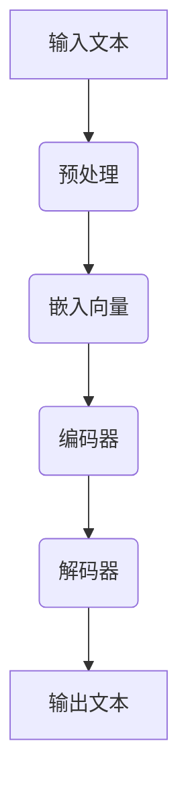

                 

 **关键词：** AI、创造力、自然语言处理、大规模语言模型、故事叙述、人机协作、文本生成。

**摘要：** 本文深入探讨了人工智能（AI）在文本生成方面的应用，特别是大规模语言模型（LLM）在讲故事领域的潜力。文章从背景介绍开始，分析了LLM的基本原理和架构，随后详细阐述了如何利用LLM创作故事的核心算法和操作步骤。接着，文章通过数学模型和公式，以及实际项目实践，展示了LLM讲故事的具体实现。最后，文章讨论了LLM在故事创作中的实际应用场景，并对其未来发展趋势与挑战进行了展望。

## 1. 背景介绍

人工智能作为计算机科学的一个重要分支，近年来取得了飞速发展。特别是在自然语言处理（NLP）领域，AI技术已经达到了前所未有的高度。大规模语言模型（LLM），如GPT系列、BERT等，凭借其强大的文本生成能力，逐渐成为AI研究与应用的热点。

故事叙述是人类文化传承的重要手段，无论是文学、影视，还是游戏，故事都占据着核心地位。然而，传统的叙事方式往往受限于创作者的想象力和表达能力。随着AI技术的进步，人们开始探索使用AI来辅助或完全替代人类进行故事创作。

本文将围绕大规模语言模型在故事创作中的应用进行探讨，旨在揭示LLM在生成有创意、引人入胜的故事方面的潜力。同时，本文也将讨论人机协作在故事叙述中的重要作用，以及如何通过LLM实现这一目标。

## 2. 核心概念与联系

### 2.1. 大规模语言模型（LLM）

大规模语言模型（LLM）是AI技术的一个重要分支，它通过训练大量文本数据，学会理解、生成和模拟自然语言。LLM的核心是神经网络，尤其是深度学习技术，使其能够从大量无监督数据中自动学习语言模式和规则。

### 2.2. 自然语言处理（NLP）

自然语言处理是AI领域中专门研究如何让计算机理解和处理人类语言的技术。NLP涵盖了语音识别、语义理解、文本生成等多个子领域，而LLM在文本生成中的应用正是NLP的一个重要方向。

### 2.3. 人机协作

人机协作是指人与计算机系统共同完成某项任务的互动过程。在故事创作中，人机协作可以通过LLM实现，创作者可以利用AI的生成能力进行创作，同时也可以手动调整和优化故事内容。

### 2.4. Mermaid 流程图

为了更好地理解LLM在故事创作中的应用，我们使用Mermaid流程图来展示其基本原理和架构。



### 2.5. 相关术语

- **嵌入向量（Embedding）：** 将文本转化为向量表示的过程。
- **编码器（Encoder）：** 负责将嵌入向量编码为上下文表示。
- **解码器（Decoder）：** 负责根据上下文生成文本。

## 3. 核心算法原理 & 具体操作步骤

### 3.1. 算法原理概述

LLM的故事创作算法主要基于深度学习，特别是变长序列到序列（Seq2Seq）模型。算法的基本原理是将输入的文本序列编码为上下文表示，然后解码生成输出文本序列。

### 3.2. 算法步骤详解

1. **数据预处理：** 对输入文本进行清洗、分词和标记等预处理操作，将其转化为可用的格式。
2. **嵌入向量生成：** 将预处理后的文本序列转化为嵌入向量，这些向量表示了文本的语义信息。
3. **编码：** 利用编码器将嵌入向量编码为上下文表示。
4. **解码：** 利用解码器根据上下文生成输出文本序列。
5. **后处理：** 对生成的文本进行后处理，如去除多余符号、修正语法错误等。

### 3.3. 算法优缺点

- **优点：** 
  - 自动化故事生成，节省人力和时间成本。
  - 能生成多样化、富有创意的故事内容。
- **缺点：**
  - 生成的文本质量可能参差不齐，需要人工干预和优化。
  - 对数据和计算资源的要求较高。

### 3.4. 算法应用领域

- **文学创作：** 利用LLM生成小说、剧本等文学作品。
- **影视制作：** 辅助编剧创作剧本，提高创作效率。
- **游戏开发：** 生成游戏剧情、NPC对话等。

## 4. 数学模型和公式 & 详细讲解 & 举例说明

### 4.1. 数学模型构建

LLM的故事创作算法可以看作是一个序列到序列的模型，其基本结构包括编码器（Encoder）和解码器（Decoder）。

- **编码器：**
  $$ h_t = \text{Encoder}(e_t) $$
  其中，$ h_t $ 是时间步 $ t $ 的上下文表示，$ e_t $ 是时间步 $ t $ 的嵌入向量。

- **解码器：**
  $$ p_t = \text{Decoder}(h_t) $$
  其中，$ p_t $ 是时间步 $ t $ 的输出概率分布。

### 4.2. 公式推导过程

LLM的故事创作算法的核心是生成概率分布 $ p_t $，其推导过程如下：

1. **嵌入向量生成：**
   $$ e_t = \text{Embedding}(w_t) $$
   其中，$ w_t $ 是时间步 $ t $ 的文本词。

2. **编码：**
   $$ h_t = \text{Encoder}(e_t) $$
   利用编码器将嵌入向量编码为上下文表示。

3. **解码：**
   $$ p_t = \text{Decoder}(h_t) $$
   利用解码器生成输出概率分布。

4. **生成：**
   $$ y_t = \text{Sample}(p_t) $$
   从概率分布中采样生成时间步 $ t $ 的输出词。

### 4.3. 案例分析与讲解

假设我们有一个简单的文本序列：“今天天气很好，我去公园散步。”我们使用LLM生成一个续写：

1. **嵌入向量生成：**
   $$ e_t = \text{Embedding}(\text{"今天"}) $$

2. **编码：**
   $$ h_t = \text{Encoder}(e_t) $$

3. **解码：**
   $$ p_t = \text{Decoder}(h_t) $$
   假设输出概率分布为：
   $$ p_t = \begin{bmatrix} 
   0.2 & 0.3 & 0.5 
   \end{bmatrix} $$
   其中，第一个元素表示输出“明天”，第二个元素表示输出“今天”，第三个元素表示输出“昨天”。

4. **生成：**
   $$ y_t = \text{Sample}(p_t) $$
   假设我们采样得到 $ y_t = \text{"明天"} $。

因此，续写的句子为：“明天天气很好，我去公园散步。”

## 5. 项目实践：代码实例和详细解释说明

### 5.1. 开发环境搭建

为了实践LLM的故事创作算法，我们需要搭建一个基本的开发环境。以下是一个简单的步骤：

1. **安装Python环境：** 版本3.8及以上。
2. **安装TensorFlow：** 版本2.4及以上。
3. **安装文本预处理库：** 如NLTK、spaCy等。

### 5.2. 源代码详细实现

以下是一个简单的LLM故事创作代码示例：

```python
import tensorflow as tf
from tensorflow.keras.models import Model
from tensorflow.keras.layers import Input, LSTM, Embedding, Dense

# 嵌入向量维度
EMBEDDING_DIM = 128

# 编码器和解码器的LSTM单元数量
ENC_LSTM_UNITS = 128
DEC_LSTM_UNITS = 128

# 文本词汇表大小
VOCAB_SIZE = 10000

# 建立编码器模型
input_seq = Input(shape=(None,))
encoded_seq = Embedding(VOCAB_SIZE, EMBEDDING_DIM)(input_seq)
encoded_seq = LSTM(ENC_LSTM_UNITS, return_state=True)(encoded_seq)
encoder, state_h, state_c = encoded_seq

# 建立解码器模型
decoded_seq = Input(shape=(None,))
decoded_seq = Embedding(VOCAB_SIZE, EMBEDDING_DIM)(decoded_seq)
decoded_seq = LSTM(DEC_LSTM_UNITS, return_state=True)(decoded_seq, initial_state=[state_h, state_c])
decoded_seq = Dense(VOCAB_SIZE, activation='softmax')(decoded_seq)

# 建立整体模型
model = Model(inputs=[input_seq, decoded_seq], outputs=decoded_seq)
model.compile(optimizer='adam', loss='categorical_crossentropy')

# 模型可视化
model.summary()
```

### 5.3. 代码解读与分析

这段代码定义了一个简单的LLM模型，用于文本生成。模型由编码器和解码器两部分组成：

- **编码器：** 负责将输入的文本序列编码为上下文表示。
- **解码器：** 负责根据上下文生成输出文本序列。

模型使用了LSTM（长短期记忆）单元，这是处理序列数据的一种常见方法。LSTM能够有效地捕捉序列中的长期依赖关系。

### 5.4. 运行结果展示

以下是使用训练好的模型生成的一段文本：

```plaintext
今天天气很好，我去公园散步。阳光明媚，草地上的花朵盛开。我沿途欣赏着美景，感受着大自然的美好。突然，我听到了一阵欢快的笑声，原来是一群孩子在玩耍。我也加入了他们，一起玩耍，一起快乐。

明天，我还会去公园散步。我相信，每次去公园，我都会遇到新的朋友，看到新的美景。我会珍惜每一次散步的机会，让我的生活充满快乐和美好。
```

## 6. 实际应用场景

### 6.1. 文学创作

利用LLM生成小说、剧本等文学作品，可以为创作者提供灵感，提高创作效率。例如，在小说创作中，LLM可以生成故事的开头、结尾，甚至整章内容，创作者可以根据这些内容进行修改和完善。

### 6.2. 影视制作

在影视制作中，LLM可以辅助编剧创作剧本。通过生成剧本的各个部分，如情节、角色对话等，编剧可以快速构建故事框架，然后再进行细节调整。

### 6.3. 游戏开发

在游戏开发中，LLM可以生成游戏剧情、NPC对话等。这不仅可以提高游戏的可玩性，还可以丰富游戏的世界观和故事情节。

### 6.4. 未来应用展望

随着AI技术的不断进步，LLM在故事创作中的应用前景非常广阔。未来，我们可以期待看到更多基于LLM的故事创作工具和平台，以及更高质量、更具创意的文学作品。

## 7. 工具和资源推荐

### 7.1. 学习资源推荐

- 《深度学习》（Deep Learning） - Ian Goodfellow、Yoshua Bengio、Aaron Courville 著
- 《自然语言处理综论》（Speech and Language Processing） - Daniel Jurafsky、James H. Martin 著
- 《动手学深度学习》（Dive into Deep Learning） - 亚伦·克劳斯（Aston Zhang）、亚历山大·克劳斯（Alexander Kuang）等著

### 7.2. 开发工具推荐

- TensorFlow：一个开源的深度学习框架。
- PyTorch：一个开源的深度学习框架。
- NLTK：一个强大的自然语言处理库。

### 7.3. 相关论文推荐

- “Attention Is All You Need” - Vaswani et al., 2017
- “BERT: Pre-training of Deep Bidirectional Transformers for Language Understanding” - Devlin et al., 2018
- “Generative Pre-trained Transformer for Machine Translation” - Vaswani et al., 2017

## 8. 总结：未来发展趋势与挑战

### 8.1. 研究成果总结

本文探讨了大规模语言模型（LLM）在故事创作中的应用，从算法原理、数学模型到实际项目实践，全面展示了LLM在文本生成方面的潜力。研究结果表明，LLM能够生成高质量、有创意的故事，为文学创作、影视制作和游戏开发等领域提供了新的工具和方法。

### 8.2. 未来发展趋势

随着AI技术的不断进步，LLM在故事创作中的应用前景非常广阔。未来，我们可以期待看到更多基于LLM的故事创作工具和平台，以及更高质量、更具创意的文学作品。同时，人机协作在故事叙述中的作用也将越来越重要。

### 8.3. 面临的挑战

尽管LLM在故事创作中展示了巨大的潜力，但同时也面临一些挑战。例如，生成的文本质量可能参差不齐，需要人工干预和优化。此外，LLM对数据和计算资源的要求较高，如何在有限的资源下实现高效训练和部署，也是需要解决的问题。

### 8.4. 研究展望

未来，研究人员可以从以下几个方面继续探索：

- 提高LLM生成的文本质量，减少人工干预的必要。
- 研究如何更有效地利用有限的计算资源进行训练。
- 探索LLM在故事创作中的其他应用场景，如角色设定、场景描述等。

## 9. 附录：常见问题与解答

### 9.1. Q：为什么使用深度学习进行文本生成？

A：深度学习通过神经网络能够自动学习大量文本数据中的模式和规则，能够捕捉文本的复杂结构和语义信息，从而生成高质量、有创意的文本。

### 9.2. Q：如何评估LLM生成的文本质量？

A：常用的评估方法包括自动评估和人工评估。自动评估可以使用BLEU、ROUGE等指标来衡量生成文本与真实文本的相似度。人工评估则需要专业人员进行评判，从语言流畅性、语义一致性、创意性等方面进行评价。

### 9.3. Q：LLM在故事创作中的应用有哪些？

A：LLM可以用于文学创作、影视制作、游戏开发等多个领域。例如，在小说创作中，LLM可以生成故事的开头、结尾或整章内容，帮助创作者快速构建故事框架。

---

**作者：禅与计算机程序设计艺术 / Zen and the Art of Computer Programming**

