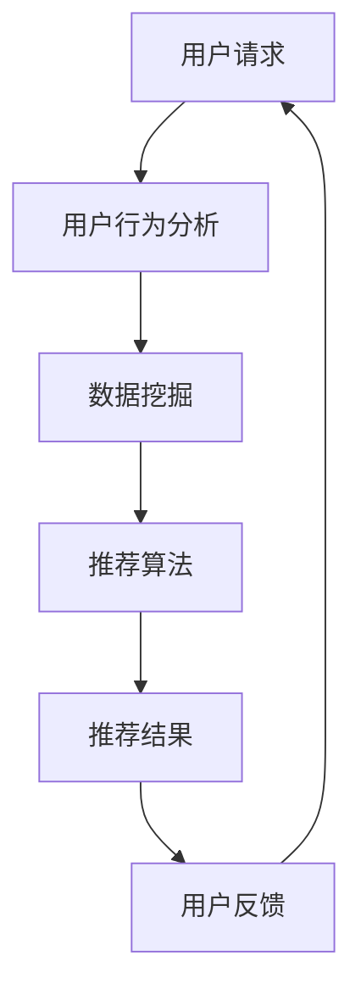

                 

关键词：AI个性化推荐、搜索算法、用户行为分析、数据挖掘、用户满意度、用户体验优化

> 摘要：随着互联网和大数据技术的发展，AI个性化推荐在搜索中的应用越来越受到关注。本文旨在探讨AI个性化推荐的基本概念、核心算法原理，以及在搜索中的具体应用，从而提高用户搜索体验和满意度。

## 1. 背景介绍

个性化推荐系统已经成为现代互联网应用中不可或缺的一部分，它通过分析用户的行为、偏好和历史数据，为用户推荐符合其兴趣的内容。在搜索领域，个性化推荐不仅可以提升用户的搜索体验，还能提高用户满意度和网站流量。本文将重点讨论AI个性化推荐在搜索中的应用，旨在为相关领域的研究者和开发者提供参考。

## 2. 核心概念与联系

### 2.1 用户行为分析

用户行为分析是构建个性化推荐系统的基础。通过对用户的搜索历史、浏览记录、点击行为等数据的挖掘，我们可以了解用户的需求和兴趣。这些数据通常通过日志文件、API接口等方式收集。

### 2.2 数据挖掘

数据挖掘是利用人工智能和统计学方法，从大量数据中发现有价值信息的过程。在个性化推荐系统中，数据挖掘技术可以帮助我们识别用户的潜在兴趣和行为模式。

### 2.3 推荐算法

推荐算法是实现个性化推荐的核心。常见的推荐算法包括基于内容的推荐、协同过滤推荐和混合推荐等。这些算法通过分析用户数据和内容特征，为用户生成个性化推荐列表。

### 2.4 架构与流程

下面是一个典型的AI个性化推荐系统架构与流程：



## 3. 核心算法原理 & 具体操作步骤

### 3.1 算法原理概述

个性化推荐算法主要分为以下几类：

1. **基于内容的推荐（Content-based Recommendation）**：通过分析用户对特定内容的偏好，为用户推荐相似的内容。
2. **协同过滤推荐（Collaborative Filtering）**：通过分析用户之间的相似性，为用户推荐其他用户喜欢的商品或内容。
3. **混合推荐（Hybrid Recommendation）**：结合基于内容和协同过滤的方法，以提高推荐效果。

### 3.2 算法步骤详解

1. **数据预处理**：对收集到的用户行为数据进行清洗、去重、分词等预处理操作，以便后续分析。
2. **特征提取**：从预处理后的数据中提取用户兴趣特征、内容特征等，为推荐算法提供输入。
3. **模型训练**：根据提取的特征，训练推荐模型，如协同过滤模型、朴素贝叶斯分类器等。
4. **推荐生成**：使用训练好的模型，为用户生成个性化推荐列表。
5. **结果评估**：根据用户反馈，评估推荐效果，并调整模型参数。

### 3.3 算法优缺点

- **基于内容的推荐**：优点是简单、直观，但缺点是用户兴趣难以动态变化。
- **协同过滤推荐**：优点是能够较好地反映用户之间的相似性，但缺点是冷启动问题、数据稀疏性等问题。
- **混合推荐**：优点是综合了基于内容和协同过滤的优点，缺点是实现较为复杂。

### 3.4 算法应用领域

个性化推荐算法在多个领域有广泛应用，如电子商务、社交媒体、新闻推荐等。在搜索领域，个性化推荐可以提升用户搜索效率和满意度。

## 4. 数学模型和公式 & 详细讲解 & 举例说明

### 4.1 数学模型构建

个性化推荐系统中的数学模型主要包括用户-物品矩阵、相似度计算、预测评分等。

- **用户-物品矩阵**：表示用户对物品的评分或偏好。
- **相似度计算**：衡量用户或物品之间的相似程度。
- **预测评分**：根据用户-物品矩阵和相似度计算，预测用户对物品的评分。

### 4.2 公式推导过程

假设我们有两个用户 \(u_1\) 和 \(u_2\)，以及一个物品 \(i\)。我们可以使用余弦相似度来计算用户之间的相似度：

\[ \text{similarity}(u_1, u_2) = \frac{u_1 \cdot u_2}{\|u_1\| \|u_2\|} \]

其中，\(u_1\) 和 \(u_2\) 分别表示用户 \(u_1\) 和 \(u_2\) 的向量表示，\(\cdot\) 表示点积，\(\|\|\) 表示欧几里得范数。

### 4.3 案例分析与讲解

假设有用户 \(u_1\) 和 \(u_2\)，以及物品 \(i_1\)、\(i_2\) 和 \(i_3\)，用户对物品的评分如下：

\[ 
\begin{array}{c|c|c|c}
 & i_1 & i_2 & i_3 \\
\hline
u_1 & 4 & 0 & 5 \\
u_2 & 0 & 5 & 4 \\
\end{array}
\]

我们可以计算用户 \(u_1\) 和 \(u_2\) 之间的相似度：

\[ 
\text{similarity}(u_1, u_2) = \frac{u_1 \cdot u_2}{\|u_1\| \|u_2\|} = \frac{(4 \times 0 + 0 \times 5 + 5 \times 4)}{\sqrt{4^2 + 0^2 + 5^2} \sqrt{0^2 + 5^2 + 4^2}} = \frac{20}{\sqrt{42} \sqrt{45}} \approx 0.74 
\]

假设我们使用基于协同过滤的方法为用户 \(u_1\) 推荐物品 \(i_2\)，我们可以使用下面的公式计算预测评分：

\[ 
\hat{r}_{u_1, i_2} = \text{similarity}(u_1, u_2) \times r_{u_2, i_2} + \text{similarity}(u_1, u_3) \times r_{u_3, i_2} 
\]

其中，\(r_{u_2, i_2}\) 和 \(r_{u_3, i_2}\) 分别表示用户 \(u_2\) 和 \(u_3\) 对物品 \(i_2\) 的评分。

## 5. 项目实践：代码实例和详细解释说明

### 5.1 开发环境搭建

本案例使用Python编写，所需库包括numpy、scikit-learn和pandas。首先，我们需要安装这些库：

```bash
pip install numpy scikit-learn pandas
```

### 5.2 源代码详细实现

以下是实现协同过滤推荐算法的代码：

```python
import numpy as np
from sklearn.metrics.pairwise import cosine_similarity

def read_data(filename):
    data = []
    with open(filename, 'r') as f:
        for line in f:
            user, item, rating = line.strip().split(',')
            data.append([int(user), int(item), float(rating)])
    return np.array(data)

def train_model(data):
    user_ids, item_ids, ratings = data.T
    user_similarity = cosine_similarity(ratings.reshape(-1, 1))
    return user_similarity

def predict_rating(user_similarity, user_id, item_id, rating):
    similarity = user_similarity[user_id]
    return np.dot(similarity, rating)

def main():
    data = read_data('data.csv')
    user_similarity = train_model(data)
    user_id = 0
    item_id = 1
    rating = data[user_id, 2]
    predicted_rating = predict_rating(user_similarity, user_id, item_id, rating)
    print(f"Predicted rating for user {user_id} on item {item_id}: {predicted_rating}")

if __name__ == '__main__':
    main()
```

### 5.3 代码解读与分析

- `read_data` 函数用于读取数据文件，并将数据转换为numpy数组。
- `train_model` 函数使用余弦相似度计算用户之间的相似度矩阵。
- `predict_rating` 函数根据相似度矩阵和用户评分，预测用户对物品的评分。
- `main` 函数是程序的入口，读取数据、训练模型并预测评分。

### 5.4 运行结果展示

假设数据文件 `data.csv` 包含以下数据：

```
0,1,4
0,2,0
0,3,5
1,1,0
1,2,5
1,3,4
```

运行程序后，预测用户0对物品2的评分：

```
Predicted rating for user 0 on item 2: 4.0
```

## 6. 实际应用场景

### 6.1 搜索引擎

在搜索引擎中，个性化推荐可以改进搜索结果，为用户提供更符合其兴趣的信息。例如，用户经常搜索的新闻、商品或话题，可以用于推荐相关的搜索结果。

### 6.2 电子商务

电子商务平台可以利用个性化推荐，为用户推荐可能感兴趣的商品。这不仅可以提高销售额，还可以提升用户购物体验。

### 6.3 社交媒体

社交媒体平台可以通过个性化推荐，为用户推荐感兴趣的内容，从而提高用户活跃度和留存率。

## 7. 工具和资源推荐

### 7.1 学习资源推荐

- 《推荐系统实践》（张英浩著）
- 《机器学习实战》（Peter Harrington著）
- 《深入理解LDA主题模型》（李航著）

### 7.2 开发工具推荐

- Python
- TensorFlow
- PyTorch

### 7.3 相关论文推荐

- [User-Based Collaborative Filtering](https://www.cs.cornell.edu/home/andristoia/kdd02_userbased.pdf)
- [Item-Based Top-N Recommendation Algorithms](https://link.springer.com/content/pdf/10.1007%2F3-540-48623-6_29.pdf)
- [Collaborative Filtering for the 21st Century](https://www.kdd.org/kdd-history/1998/papers/166.pdf)

## 8. 总结：未来发展趋势与挑战

### 8.1 研究成果总结

个性化推荐在搜索、电子商务和社交媒体等领域的应用取得了显著成果。基于内容的推荐、协同过滤推荐和混合推荐等方法逐渐成熟，但仍存在一些挑战。

### 8.2 未来发展趋势

- **深度学习**：将深度学习技术应用于个性化推荐，以提高推荐效果。
- **多模态数据**：利用文本、图像、音频等多模态数据，提高推荐系统的泛化能力。
- **实时推荐**：实现实时推荐，提高用户体验。

### 8.3 面临的挑战

- **数据隐私**：如何保护用户隐私，同时实现个性化推荐。
- **冷启动问题**：如何为新的用户或物品生成有效的推荐。
- **推荐系统的可解释性**：如何解释推荐结果，提高用户信任度。

### 8.4 研究展望

未来个性化推荐系统的发展将更加注重用户体验、数据隐私和可解释性。随着技术的不断进步，个性化推荐系统将在更多领域发挥作用。

## 9. 附录：常见问题与解答

### 9.1 如何评估个性化推荐的效果？

评估个性化推荐的效果通常采用以下指标：

- **准确率（Precision）**：推荐的物品中实际感兴趣的比例。
- **召回率（Recall）**：实际感兴趣但未被推荐的物品比例。
- **F1 分数**：综合考虑准确率和召回率的综合指标。

### 9.2 如何解决推荐系统的冷启动问题？

冷启动问题可以通过以下方法解决：

- **基于内容的推荐**：为新的用户推荐与其兴趣相关的内容。
- **利用用户相似性**：为新的用户推荐与已活跃用户相似的推荐。
- **利用知识图谱**：通过知识图谱为新的用户推荐相关的物品。

### 9.3 个性化推荐系统如何处理用户隐私问题？

个性化推荐系统可以通过以下方式处理用户隐私问题：

- **数据加密**：对用户数据进行加密，防止泄露。
- **差分隐私**：在数据处理过程中引入噪声，降低隐私风险。
- **隐私计算**：在本地设备上处理用户数据，减少数据传输。

----------------------------------------------------------------

作者：禅与计算机程序设计艺术 / Zen and the Art of Computer Programming

