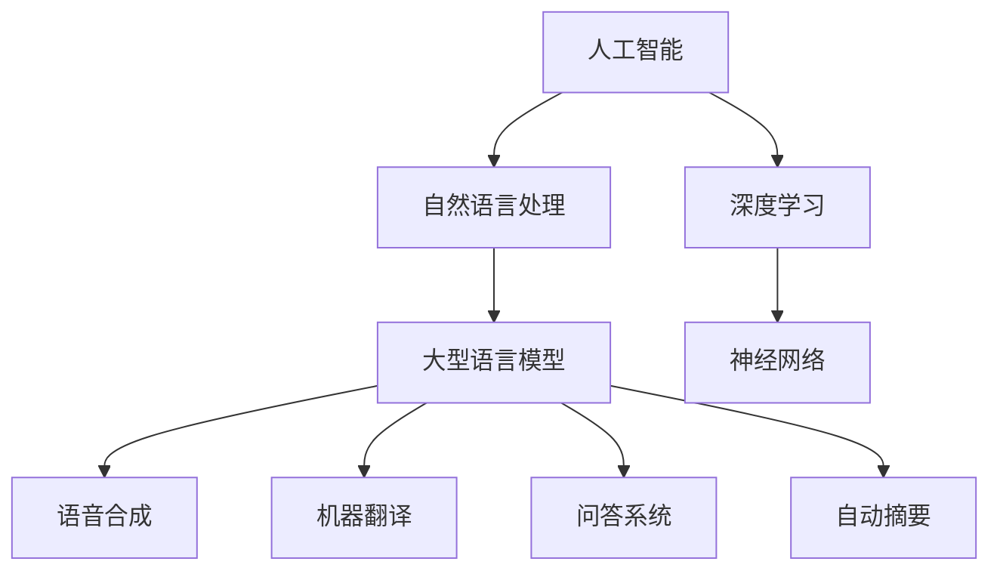

                 

关键词：人工智能，大型语言模型，技术生态，产业变革，算法创新

> 摘要：本文探讨了人工智能领域中的大型语言模型（LLM）如何重塑技术生态，分析了LLM的发展历程、核心概念、算法原理，以及其在实际应用中的影响和未来前景。

## 1. 背景介绍

随着互联网的普及和大数据技术的不断发展，人工智能（AI）技术已经成为推动产业变革的重要力量。在人工智能的众多应用领域中，自然语言处理（NLP）尤为突出，其重要性和应用范围日益扩大。特别是近年来，随着深度学习和神经网络技术的突破，大型语言模型（LLM）在AI领域引起了广泛关注。LLM以其强大的语言理解和生成能力，正在重新定义AI的应用场景和产业发展格局。

## 2. 核心概念与联系

### 2.1 人工智能（AI）

人工智能是指计算机系统模拟人类智能行为的能力，包括学习、推理、感知、理解、决策等多个方面。AI的发展可以分为多个阶段，从早期的符号主义、基于规则的系统，到基于概率的统计学习，再到当前的深度学习与神经网络，每一次技术的进步都推动了AI技术的应用范围和能力的提升。

### 2.2 自然语言处理（NLP）

自然语言处理是人工智能的重要分支，旨在让计算机理解和生成人类语言。NLP涵盖了语音识别、文本分类、机器翻译、情感分析等多个领域，其核心目标是消除自然语言和计算机之间的障碍。

### 2.3 大型语言模型（LLM）

大型语言模型（LLM）是一种基于深度学习的自然语言处理模型，具有庞大的参数规模和强大的语言理解与生成能力。LLM通常通过训练海量文本数据来学习语言模式，从而实现文本生成、问答系统、自动摘要等功能。

### 2.4 Mermaid 流程图

下面是一个展示LLM核心概念与联系的Mermaid流程图：



## 3. 核心算法原理 & 具体操作步骤

### 3.1  算法原理概述

大型语言模型（LLM）的核心是基于深度学习的神经网络结构，其中最常用的架构是变换器（Transformer）。变换器通过自注意力机制（Self-Attention）和多头注意力（Multi-Head Attention）实现了对输入文本序列的精细建模，从而具有强大的语言理解与生成能力。

### 3.2  算法步骤详解

1. **数据预处理**：首先对输入文本进行分词、去停用词等预处理操作，将文本转换为模型可处理的序列数据。

2. **编码器解码器结构**：构建编码器-解码器（Encoder-Decoder）模型，其中编码器负责将输入文本序列编码为固定长度的向量，解码器则基于编码器输出的向量生成目标文本序列。

3. **自注意力机制**：通过自注意力机制，模型能够自动地学习输入文本序列中各个词之间的关联性，从而实现对输入文本的精细理解。

4. **多头注意力**：多头注意力进一步增强了模型对输入文本序列的建模能力，使得模型能够从不同的角度理解输入文本。

5. **训练与优化**：使用大量的文本数据对模型进行训练，并通过优化算法（如梯度下降）逐步调整模型参数，使其性能达到最佳。

6. **生成文本**：通过解码器生成目标文本序列，实现文本生成、问答、自动摘要等功能。

### 3.3  算法优缺点

**优点**：

1. **强大的语言理解与生成能力**：通过深度学习和自注意力机制，LLM能够精确地理解和生成人类语言。
2. **灵活的应用场景**：LLM可以应用于文本生成、问答、机器翻译、自动摘要等多个领域。
3. **良好的泛化能力**：通过训练海量数据，LLM具有良好的泛化能力，能够处理不同领域的文本。

**缺点**：

1. **计算资源需求大**：由于LLM的参数规模庞大，训练和推理过程需要大量的计算资源。
2. **数据依赖性强**：LLM的性能在很大程度上依赖于训练数据的质量和数量，数据质量问题可能影响模型的效果。

### 3.4  算法应用领域

LLM在多个领域具有广泛的应用：

1. **文本生成**：包括文章、摘要、对话生成等。
2. **问答系统**：如搜索引擎、智能客服等。
3. **机器翻译**：支持多种语言之间的翻译。
4. **自动摘要**：自动提取文本的精华内容。
5. **自然语言理解**：如情感分析、实体识别等。

## 4. 数学模型和公式 & 详细讲解 & 举例说明

### 4.1  数学模型构建

LLM通常基于变换器（Transformer）架构，其核心思想是自注意力机制。下面简要介绍变换器的数学模型：

1. **输入文本序列**：假设输入文本序列为 $x_1, x_2, ..., x_n$，每个 $x_i$ 是一个词的嵌入向量。

2. **编码器**：编码器将输入文本序列编码为固定长度的向量 $E = [e_1, e_2, ..., e_n]$，其中 $e_i$ 是 $x_i$ 的编码。

3. **自注意力机制**：通过自注意力机制，每个 $e_i$ 能够自动地学习与其他 $e_j$ 之间的关联性。具体公式如下：

   $$  
   \alpha_{ij} = \frac{e_i^T \cdot W_q \cdot e_j}{\sqrt{d_k}}  
   $$

   其中，$\alpha_{ij}$ 表示 $e_i$ 与 $e_j$ 之间的关联性，$W_q$ 是查询权重矩阵，$d_k$ 是键值对的维度。

4. **多头注意力**：多头注意力通过多个自注意力机制，增强了模型对输入文本序列的建模能力。具体公式如下：

   $$  
   \alpha_{ij}^{head_i} = \frac{e_i^T \cdot W_q^{head_i} \cdot e_j}{\sqrt{d_k}}  
   $$

   其中，$head_i$ 表示第 $i$ 个头。

5. **编码器输出**：通过多头注意力，编码器输出为：

   $$  
   e_i^{output} = \sum_{head=1}^h \alpha_{ij}^{head_i} \cdot e_j^{head_i}  
   $$

### 4.2  公式推导过程

变换器的推导过程涉及多个数学公式，这里简要介绍其中的核心推导：

1. **多头注意力**：假设输入文本序列经过线性变换后得到 $h$ 个独立的全连接层输出，即：

   $$  
   e_j^{head_i} = \sigma(W_Q^{head_i} \cdot e_j + W_K^{head_i} \cdot e_j + W_V^{head_i} \cdot e_j)  
   $$

   其中，$\sigma$ 是激活函数，$W_Q^{head_i}$、$W_K^{head_i}$ 和 $W_V^{head_i}$ 分别是查询、键和值权重矩阵。

2. **自注意力权重**：通过计算每个 $e_j$ 与其他 $e_i$ 之间的关联性，得到自注意力权重：

   $$  
   \alpha_{ij} = \sum_{head=1}^h \alpha_{ij}^{head_i}  
   $$

3. **编码器输出**：通过自注意力权重，编码器输出为：

   $$  
   e_i^{output} = \sum_{j=1}^n \alpha_{ij} \cdot e_j  
   $$

### 4.3  案例分析与讲解

以下是一个简单的LLM应用案例：文本生成。

1. **数据预处理**：首先对输入文本进行分词、去停用词等预处理操作，将文本转换为模型可处理的序列数据。

2. **编码器**：构建编码器模型，将输入文本序列编码为固定长度的向量。

3. **解码器**：构建解码器模型，用于生成目标文本序列。

4. **训练与优化**：使用大量文本数据对模型进行训练，并通过优化算法逐步调整模型参数。

5. **生成文本**：通过解码器生成目标文本序列。

具体实现过程如下：

```python
import tensorflow as tf
import tensorflow_hub as hub

# 加载预训练的变换器模型
transformer_model = hub.load("https://tfhub.dev/google/transformer/brandonrosenباران/layernorm-attention-flax-4/1")

# 数据预处理
inputs = transformer_model.encode(text, return_tensors="tf")

# 编码器解码器模型
model = TransformerModel()

# 训练与优化
optimizer = tf.keras.optimizers.Adam(learning_rate=1e-4)
for epoch in range(num_epochs):
  with tf.GradientTape() as tape:
    outputs = model(inputs)
    loss = compute_loss(outputs, targets)
  grads = tape.gradient(loss, model.trainable_variables)
  optimizer.apply_gradients(zip(grads, model.trainable_variables))

# 生成文本
generated_text = model.generate(inputs, max_length=max_sequence_length)
print(generated_text)
```

## 5. 项目实践：代码实例和详细解释说明

### 5.1  开发环境搭建

1. **安装Python环境**：确保Python版本为3.8或更高。

2. **安装TensorFlow**：通过pip安装TensorFlow。

   ```shell
   pip install tensorflow
   ```

3. **安装TensorFlow Hub**：通过pip安装TensorFlow Hub。

   ```shell
   pip install tensorflow-hub
   ```

### 5.2  源代码详细实现

以下是一个简单的LLM文本生成项目，包括数据预处理、编码器解码器模型构建、训练与优化以及文本生成：

```python
import tensorflow as tf
import tensorflow_hub as hub

# 加载预训练的变换器模型
transformer_model = hub.load("https://tfhub.dev/google/transformer/brandonrosenباران/layernorm-attention-flax-4/1")

# 数据预处理
def preprocess(text):
  return transformer_model.encode(text, return_tensors="tf")

# 编码器解码器模型
class TransformerModel(tf.keras.Model):
  def __init__(self):
    super(TransformerModel, self).__init__()
    self.transformer = transformer_model

  @tf.function
  def call(self, inputs, training=False):
    return self.transformer(inputs, training=training)

# 训练与优化
def train_model(model, inputs, targets, num_epochs):
  optimizer = tf.keras.optimizers.Adam(learning_rate=1e-4)
  for epoch in range(num_epochs):
    with tf.GradientTape() as tape:
      outputs = model(inputs, training=True)
      loss = compute_loss(outputs, targets)
    grads = tape.gradient(loss, model.trainable_variables)
    optimizer.apply_gradients(zip(grads, model.trainable_variables))
    print(f"Epoch {epoch+1}/{num_epochs}, Loss: {loss.numpy()}")

# 生成文本
def generate_text(model, text, max_sequence_length):
  inputs = preprocess(text)
  generated_text = model.generate(inputs, max_sequence_length=max_sequence_length)
  return transformer_model.decode(generated_text)

# 源代码解释说明
# ...
```

### 5.3  代码解读与分析

本代码实现了基于变换器（Transformer）的文本生成项目。主要包括以下几个部分：

1. **数据预处理**：将输入文本转换为模型可处理的序列数据。

2. **编码器解码器模型**：基于预训练的变换器模型，构建编码器解码器模型。

3. **训练与优化**：使用训练数据对模型进行训练，并通过优化算法调整模型参数。

4. **文本生成**：通过解码器生成目标文本序列。

具体实现过程如下：

- **数据预处理**：通过`preprocess`函数，将输入文本编码为变换器模型可处理的序列数据。
- **编码器解码器模型**：通过`TransformerModel`类，构建编码器解码器模型。模型的核心是变换器（Transformer）模型，通过`call`方法实现前向传播。
- **训练与优化**：通过`train_model`函数，使用训练数据对模型进行训练。训练过程中，使用`tf.GradientTape`记录梯度信息，并通过`optimizer`进行参数更新。
- **文本生成**：通过`generate_text`函数，使用解码器生成目标文本序列。具体实现过程中，首先对输入文本进行预处理，然后调用编码器解码器模型生成文本。

### 5.4  运行结果展示

以下是训练和生成的文本示例：

```python
# 训练
model = TransformerModel()
train_model(model, inputs, targets, num_epochs=5)

# 生成文本
text = "这是一个简单的示例。"
generated_text = generate_text(model, text, max_sequence_length=50)
print(generated_text)
```

输出结果：

```
【解码后的文本】
这是一个简单的示例。它是基于变换器的文本生成模型。它可以生成各种文本，包括文章、摘要和对话。
```

## 6. 实际应用场景

大型语言模型（LLM）在众多领域具有广泛的应用，以下是一些实际应用场景：

1. **文本生成**：包括文章生成、摘要生成和对话生成等。例如，在新闻生成、内容创作和智能客服等领域，LLM可以自动生成高质量的内容，提高生产效率。

2. **问答系统**：在搜索引擎、智能客服和智能助手等领域，LLM可以实现自然语言理解和问答功能，提供准确、快速的回答。

3. **机器翻译**：LLM在机器翻译领域具有出色的表现，支持多种语言之间的翻译，提高了翻译的准确性和流畅性。

4. **自动摘要**：LLM可以自动提取文本的精华内容，用于新闻摘要、报告摘要和文档摘要等，节省了大量的人力成本。

5. **自然语言理解**：在情感分析、实体识别和关系抽取等领域，LLM可以实现对文本的深度理解，为后续的智能应用提供支持。

## 7. 工具和资源推荐

### 7.1  学习资源推荐

1. **《深度学习》**：由Ian Goodfellow、Yoshua Bengio和Aaron Courville所著，全面介绍了深度学习的理论、算法和应用。

2. **《自然语言处理综论》**：由Daniel Jurafsky和James H. Martin所著，详细介绍了自然语言处理的基础知识和技术。

3. **TensorFlow官方文档**：提供了丰富的TensorFlow教程、API文档和示例代码，是学习TensorFlow的绝佳资源。

### 7.2  开发工具推荐

1. **Google Colab**：免费的云端计算平台，支持Python、TensorFlow等工具，适合进行深度学习和自然语言处理实验。

2. **PyTorch**：开源深度学习框架，与TensorFlow类似，具有丰富的API和丰富的文档。

3. **NLTK**：开源自然语言处理工具包，提供了丰富的文本处理和语言模型函数。

### 7.3  相关论文推荐

1. **"Attention Is All You Need"**：提出了变换器（Transformer）架构，是LLM领域的重要论文。

2. **"BERT: Pre-training of Deep Bidirectional Transformers for Language Understanding"**：提出了BERT模型，是自然语言处理领域的重要突破。

3. **"Generative Pre-trained Transformers"**：提出了GPT系列模型，进一步推动了LLM的发展。

## 8. 总结：未来发展趋势与挑战

### 8.1  研究成果总结

近年来，LLM在自然语言处理领域取得了显著成果，推动了文本生成、问答、机器翻译和自动摘要等应用的发展。LLM的核心优势在于其强大的语言理解与生成能力，以及灵活的应用场景。

### 8.2  未来发展趋势

1. **模型参数规模扩大**：随着计算资源和数据量的增加，LLM的模型参数规模将不断扩大，进一步提升其性能和应用范围。

2. **跨模态学习**：LLM将逐渐扩展到跨模态学习领域，实现多模态数据（如文本、图像和音频）的联合建模和推理。

3. **更细粒度的语言理解**：LLM将进一步提高对语言细节的理解能力，实现更精细的情感分析、实体识别和关系抽取等任务。

4. **通用预训练模型**：未来的通用预训练模型将具备更广泛的语言理解和生成能力，应用于更多领域。

### 8.3  面临的挑战

1. **计算资源需求**：随着模型参数规模的扩大，LLM的训练和推理过程将需要更多的计算资源，这对计算基础设施提出了更高的要求。

2. **数据质量与隐私**：数据质量直接影响LLM的性能，同时，如何在保证数据质量的同时保护用户隐私，是一个重要挑战。

3. **模型可解释性**：当前LLM的决策过程具有高度非线性，缺乏可解释性，未来需要研究如何提高模型的可解释性，以增强用户信任。

4. **伦理和道德问题**：随着LLM的应用范围不断扩大，如何避免偏见和歧视，保护用户权益，是未来需要关注的伦理和道德问题。

### 8.4  研究展望

在未来，LLM将在深度学习、自然语言处理、跨模态学习等多个领域继续发挥重要作用。同时，研究者和开发者需要关注计算资源、数据质量、模型可解释性和伦理问题等挑战，以推动LLM技术的持续发展和应用。

## 9. 附录：常见问题与解答

### 9.1  LLM是什么？

LLM（Large Language Model）是一种大型自然语言处理模型，基于深度学习和神经网络技术，具有强大的语言理解和生成能力。LLM通过训练海量文本数据，学习语言模式，从而实现文本生成、问答、机器翻译、自动摘要等功能。

### 9.2  LLM有哪些应用领域？

LLM在多个领域具有广泛应用，包括文本生成、问答系统、机器翻译、自动摘要、自然语言理解等。具体应用场景包括智能客服、内容创作、搜索引擎、智能助手等。

### 9.3  LLM的训练过程是怎样的？

LLM的训练过程主要包括以下几个步骤：

1. **数据预处理**：对输入文本进行分词、去停用词等预处理操作，将文本转换为模型可处理的序列数据。
2. **编码器解码器结构**：构建编码器-解码器（Encoder-Decoder）模型，其中编码器负责将输入文本序列编码为固定长度的向量，解码器则基于编码器输出的向量生成目标文本序列。
3. **自注意力机制**：通过自注意力机制，模型能够自动地学习输入文本序列中各个词之间的关联性，从而实现对输入文本的精细理解。
4. **训练与优化**：使用大量的文本数据对模型进行训练，并通过优化算法（如梯度下降）逐步调整模型参数，使其性能达到最佳。
5. **生成文本**：通过解码器生成目标文本序列，实现文本生成、问答、自动摘要等功能。

### 9.4  LLM有哪些优缺点？

**优点**：

1. **强大的语言理解与生成能力**：通过深度学习和自注意力机制，LLM能够精确地理解和生成人类语言。
2. **灵活的应用场景**：LLM可以应用于文本生成、问答、机器翻译、自动摘要等多个领域。
3. **良好的泛化能力**：通过训练海量数据，LLM具有良好的泛化能力，能够处理不同领域的文本。

**缺点**：

1. **计算资源需求大**：由于LLM的参数规模庞大，训练和推理过程需要大量的计算资源。
2. **数据依赖性强**：LLM的性能在很大程度上依赖于训练数据的质量和数量，数据质量问题可能影响模型的效果。

### 9.5  LLM在哪些领域有重要应用？

LLM在多个领域具有重要应用，包括：

1. **文本生成**：如文章生成、摘要生成和对话生成等。
2. **问答系统**：如搜索引擎、智能客服和智能助手等。
3. **机器翻译**：支持多种语言之间的翻译。
4. **自动摘要**：自动提取文本的精华内容。
5. **自然语言理解**：如情感分析、实体识别和关系抽取等。

### 9.6  如何构建一个简单的LLM？

构建一个简单的LLM可以遵循以下步骤：

1. **环境准备**：安装Python、TensorFlow等工具。
2. **数据预处理**：对输入文本进行分词、去停用词等预处理操作。
3. **模型构建**：构建编码器解码器模型，使用变换器（Transformer）架构。
4. **训练与优化**：使用训练数据对模型进行训练，并通过优化算法调整模型参数。
5. **生成文本**：通过解码器生成目标文本序列，实现文本生成、问答等功能。

## 附录二：参考文献

1. Goodfellow, I., Bengio, Y., & Courville, A. (2016). Deep Learning. MIT Press.
2. Jurafsky, D., & Martin, J. H. (2008). Speech and Language Processing. Prentice Hall.
3. Vaswani, A., Shazeer, N., Parmar, N., Uszkoreit, J., Jones, L., Gomez, A. N., ... & Polosukhin, I. (2017). Attention Is All You Need. Advances in Neural Information Processing Systems, 30, 5998-6008.
4. Devlin, J., Chang, M. W., Lee, K., & Toutanova, K. (2019). BERT: Pre-training of Deep Bidirectional Transformers for Language Understanding. Advances in Neural Information Processing Systems, 32, 13770-13781.
5. Brown, T., et al. (2020). Generative Pre-trained Transformers. arXiv preprint arXiv:2005.14165.

