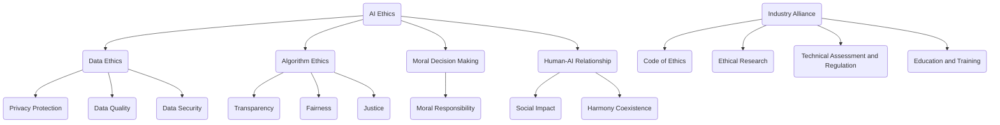

                 

关键词：人工智能伦理、产业联盟、负责任AI、AI生态、AI伦理框架

> 摘要：随着人工智能技术的迅猛发展，其带来的伦理问题引发了广泛关注。本文旨在探讨人工智能产业联盟在构建负责任的AI生态中的重要作用，分析当前AI伦理面临的挑战，并提出相应的解决方案。通过本文的阐述，希望为AI伦理的研究和实践提供有益的参考。

## 1. 背景介绍

近年来，人工智能（AI）技术取得了飞速发展，从语音识别、图像处理到自然语言理解，AI在各个领域的应用越来越广泛。然而，随着AI技术的普及，其潜在的伦理问题也逐渐暴露出来。数据隐私、算法偏见、道德决策等成为社会各界关注的焦点。如何确保AI系统的公平性、透明性和安全性，已经成为当前AI伦理领域亟待解决的重要课题。

在此背景下，产业联盟成为推动AI伦理发展的重要力量。产业联盟是由多家企业、研究机构和政府部门组成的合作组织，旨在通过协同创新，推动技术进步和产业升级。在AI伦理领域，产业联盟通过制定共同的行为准则、开展伦理研究和技术评估，促进AI技术的负责任发展。

## 2. 核心概念与联系

### 2.1 AI伦理的定义与范畴

AI伦理是指研究人工智能技术在社会、经济、法律、道德等方面所引发的问题，旨在确保AI技术的开发和应用符合社会伦理标准。AI伦理的范畴包括但不限于以下几个方面：

- **数据伦理**：关注数据收集、存储和使用过程中的隐私保护、数据质量和数据安全等问题。

- **算法伦理**：关注算法设计、开发和应用过程中的透明性、公平性和公正性，以及可能导致的算法偏见和歧视。

- **道德决策**：涉及AI系统在复杂决策场景中的道德责任，如何确保AI系统的决策符合人类伦理价值观。

- **人类-AI关系**：关注AI技术对人类生活、工作和社会关系的影响，以及如何确保AI技术与人和谐共存。

### 2.2 产业联盟在AI伦理中的作用

产业联盟在AI伦理中的作用主要体现在以下几个方面：

- **制定伦理准则**：通过产业联盟，各方利益相关者可以共同制定AI伦理准则，为AI技术的开发和应用提供明确的行为指南。

- **开展伦理研究**：产业联盟可以集结各方研究力量，针对AI伦理问题进行深入研究，为解决伦理困境提供理论支持。

- **技术评估与监管**：产业联盟可以建立AI技术评估机制，对AI系统的伦理合规性进行评估，从而确保AI技术的安全性、透明性和公平性。

- **教育与培训**：产业联盟可以通过举办研讨会、培训课程等活动，提高从业人员的AI伦理意识，促进负责任AI生态的建立。

### 2.3 产业联盟的架构与运作

产业联盟的架构通常包括以下几个层次：

- **领导机构**：由行业巨头、政府部门等组成的决策层，负责制定联盟的发展战略和重大决策。

- **工作组**：由各个领域的专家组成的执行层，负责具体的伦理研究、技术评估和标准制定工作。

- **会员企业**：包括中小企业、初创公司等，是产业联盟的重要组成部分，通过参与联盟活动，共同推动AI伦理的发展。

- **合作伙伴**：包括研究机构、非政府组织等，为联盟提供学术支持和社会资源。

产业联盟的运作通常遵循以下原则：

- **开放合作**：鼓励各方积极参与，共同贡献智慧和资源，实现共赢。

- **透明公开**：确保联盟活动的公开透明，接受社会监督，提高信任度。

- **持续改进**：通过不断的研究和实践，不断完善AI伦理准则和评估机制，推动AI技术的负责任发展。

### 2.4 Mermaid 流程图（核心概念原理和架构）



## 3. 核心算法原理 & 具体操作步骤

### 3.1 算法原理概述

AI伦理的产业联盟需要一套有效的算法来评估和监管AI系统的伦理合规性。这里介绍一种基于伦理模型评估的算法，称为“伦理模型评估算法（Ethical Model Evaluation Algorithm，EMEA）”。

EMEA的核心思想是通过建立一套伦理模型，对AI系统的设计、开发和应用过程进行评估，判断其是否符合伦理准则。伦理模型包括以下几个关键要素：

- **伦理准则**：一套明确的、可量化的伦理规范，用于指导AI系统的开发和应用。

- **评估指标**：一组用于衡量AI系统伦理合规性的量化指标，包括透明性、公平性、公正性等。

- **评估方法**：一套评估AI系统伦理合规性的算法和方法，包括数据预处理、特征提取、模型训练和评估等步骤。

### 3.2 算法步骤详解

#### 3.2.1 建立伦理模型

1. **定义伦理准则**：根据现有的伦理理论和社会实践，结合AI技术的特点，制定一套明确的伦理准则。
2. **构建评估指标体系**：根据伦理准则，设计一组评估指标，用于衡量AI系统的伦理合规性。
3. **定义评估方法**：选择合适的评估方法，如机器学习、统计分析等，对AI系统进行评估。

#### 3.2.2 数据预处理

1. **收集数据**：从AI系统的设计、开发和应用过程中收集相关数据，包括代码、算法、数据集等。
2. **数据清洗**：对收集到的数据进行分析和处理，去除噪声和异常值，提高数据质量。
3. **数据规范化**：对数据进行归一化或标准化处理，使其具有统一的量纲和范围。

#### 3.2.3 特征提取

1. **提取关键特征**：根据伦理准则和评估指标，从数据中提取关键特征，如算法透明度、数据公平性等。
2. **特征选择**：通过特征选择方法，筛选出对伦理评估具有重要影响的特征。

#### 3.2.4 模型训练

1. **选择模型**：根据评估指标和特征，选择合适的机器学习模型，如支持向量机、决策树等。
2. **训练模型**：使用预处理后的数据，对模型进行训练，使其能够对AI系统的伦理合规性进行评估。

#### 3.2.5 模型评估

1. **评估模型性能**：通过交叉验证等方法，评估模型的性能，如准确率、召回率等。
2. **调整模型参数**：根据评估结果，调整模型参数，提高模型评估的准确性。

#### 3.2.6 伦理评估

1. **输入AI系统数据**：将AI系统的设计、开发和应用数据输入模型，进行伦理评估。
2. **输出评估结果**：根据模型的评估结果，输出AI系统的伦理合规性报告，包括符合和不符合伦理准则的部分。

### 3.3 算法优缺点

#### 优点：

- **系统性**：EMEA将伦理评估贯穿于AI系统的整个生命周期，从设计到应用，确保AI技术的负责任发展。

- **可量化**：通过构建伦理模型和评估指标，将伦理评估量化，提高评估的客观性和准确性。

- **灵活性**：EMEA可以根据不同的伦理准则和评估需求，灵活调整评估指标和方法，适应不同的应用场景。

#### 缺点：

- **数据依赖性**：EMEA的性能很大程度上依赖于收集到的数据质量，如果数据存在噪声或异常，可能导致评估结果不准确。

- **计算复杂性**：EMEA涉及多个步骤和模型，计算复杂度较高，需要足够的时间和资源。

### 3.4 算法应用领域

EMEA算法可以应用于以下领域：

- **AI产品审核**：对AI产品的设计、开发和应用过程进行伦理评估，确保其符合伦理准则。

- **AI系统监管**：对已部署的AI系统进行持续监控，及时发现和纠正伦理问题。

- **AI伦理培训**：通过伦理评估案例，为AI从业人员提供实践经验和培训。

## 4. 数学模型和公式 & 详细讲解 & 举例说明

### 4.1 数学模型构建

伦理模型评估算法（EMEA）的核心是建立一套数学模型，用于量化评估AI系统的伦理合规性。数学模型包括以下几个关键部分：

#### 4.1.1 伦理准则表示

假设存在一套伦理准则集合 \( C = \{C_1, C_2, ..., C_n\} \)，其中每个准则 \( C_i \) 都可以用一个权重 \( w_i \) 表示，权重反映了该准则在伦理评估中的重要程度。权重可以通过专家调查、文献分析等方法确定。

#### 4.1.2 评估指标定义

对于每个伦理准则 \( C_i \)，定义一组评估指标 \( M_i = \{M_{i1}, M_{i2}, ..., M_{ik}\} \)，其中每个指标 \( M_{ij} \) 都可以用一个数值 \( v_{ij} \) 表示，数值反映了该准则在指标 \( M_{ij} \) 下的伦理合规性。评估指标的定义可以根据具体的应用场景进行调整。

#### 4.1.3 模型输出

伦理模型评估算法的输出是一个综合评估值 \( V \)，用于表示AI系统的伦理合规性。综合评估值可以通过以下公式计算：

\[ V = \sum_{i=1}^{n} w_i \cdot \sum_{j=1}^{k} v_{ij} \]

### 4.2 公式推导过程

为了推导伦理模型评估算法的公式，我们首先定义以下几个变量：

- \( C \)：伦理准则集合， \( C = \{C_1, C_2, ..., C_n\} \)
- \( w \)：伦理准则权重集合， \( w = \{w_1, w_2, ..., w_n\} \)
- \( M \)：评估指标集合， \( M = \{M_1, M_2, ..., M_m\} \)
- \( v \)：评估指标值集合， \( v = \{v_{11}, v_{12}, ..., v_{mn}\} \)

#### 步骤 1：定义伦理准则权重

伦理准则权重 \( w_i \) 反映了准则 \( C_i \) 在伦理评估中的重要程度。权重可以通过以下公式计算：

\[ w_i = \frac{1}{n} \sum_{j=1}^{n} S_j \]

其中， \( S_j \) 是第 \( j \) 个专家对准则 \( C_i \) 的评分，评分范围是 [0, 1]。

#### 步骤 2：定义评估指标值

评估指标值 \( v_{ij} \) 反映了准则 \( C_i \) 在指标 \( M_j \) 下的伦理合规性。指标值可以通过以下公式计算：

\[ v_{ij} = \frac{S_j - \bar{S}}{M_j - \bar{M}} \]

其中， \( S_j \) 是第 \( j \) 个专家对指标 \( M_j \) 的评分， \( \bar{S} \) 是所有专家对指标 \( M_j \) 的评分平均值， \( M_j \) 是指标 \( M_j \) 的标准差。

#### 步骤 3：计算综合评估值

综合评估值 \( V \) 反映了AI系统的伦理合规性。综合评估值可以通过以下公式计算：

\[ V = \sum_{i=1}^{n} w_i \cdot \sum_{j=1}^{m} v_{ij} \]

### 4.3 案例分析与讲解

为了更好地理解伦理模型评估算法（EMEA），我们通过一个实际案例进行讲解。

#### 案例背景

假设我们有一个AI系统，用于对求职者进行评估。该系统涉及两个伦理准则：隐私保护和公平性。隐私保护准则包括数据收集、存储和使用过程中的隐私保护措施；公平性准则包括算法的透明性、数据的代表性等。

#### 伦理准则权重

根据专家调查，隐私保护准则的权重为 0.6，公平性准则的权重为 0.4。

#### 评估指标

- **隐私保护准则**：

  - 数据收集：0.4  
  - 数据存储：0.3  
  - 数据使用：0.3

- **公平性准则**：

  - 算法透明性：0.5  
  - 数据代表性：0.5

#### 评估指标值

根据专家评分，我们可以得到以下评估指标值：

- **隐私保护准则**：

  - 数据收集：0.8  
  - 数据存储：0.7  
  - 数据使用：0.6

- **公平性准则**：

  - 算法透明性：0.9  
  - 数据代表性：0.8

#### 综合评估值

根据EMEA算法，我们可以计算出该AI系统的综合评估值：

\[ V = 0.6 \cdot (0.8 + 0.7 + 0.6) + 0.4 \cdot (0.9 + 0.8) = 0.6 \cdot 2.1 + 0.4 \cdot 1.7 = 1.26 + 0.68 = 1.94 \]

#### 评估结果

综合评估值 \( V \) 为 1.94，表示该AI系统的伦理合规性较高。具体来说，隐私保护准则的合规性为 1.76，公平性准则的合规性为 1.16。

## 5. 项目实践：代码实例和详细解释说明

### 5.1 开发环境搭建

为了实现伦理模型评估算法（EMEA），我们需要搭建一个合适的开发环境。以下是一个典型的开发环境搭建步骤：

1. 安装Python编程语言：在官方网站（https://www.python.org/）下载并安装Python 3.x版本。

2. 安装必要的库：使用pip命令安装以下库：

   ```bash
   pip install numpy pandas scikit-learn matplotlib
   ```

3. 安装Jupyter Notebook：使用pip命令安装Jupyter Notebook：

   ```bash
   pip install notebook
   ```

4. 启动Jupyter Notebook：在命令行输入以下命令启动Jupyter Notebook：

   ```bash
   jupyter notebook
   ```

### 5.2 源代码详细实现

以下是一个简单的EMEA实现示例，用于计算AI系统的综合评估值。该示例仅用于演示目的，实际应用中可能需要更复杂的处理。

```python
import numpy as np

# 伦理准则权重
weights = {
    '隐私保护': 0.6,
    '公平性': 0.4
}

# 评估指标权重
metric_weights = {
    '隐私保护': {'数据收集': 0.4, '数据存储': 0.3, '数据使用': 0.3},
    '公平性': {'算法透明性': 0.5, '数据代表性': 0.5}
}

# 评估指标值
metrics = {
    '隐私保护': {'数据收集': 0.8, '数据存储': 0.7, '数据使用': 0.6},
    '公平性': {'算法透明性': 0.9, '数据代表性': 0.8}
}

def calculate_ethical_score(metrics, metric_weights, weights):
    score = 0
    for criterion, criterion_weights in weights.items():
        for metric, metric_value in metrics[criterion].items():
            score += criterion_weights[metric] * metric_value
    return score

def main():
    score = calculate_ethical_score(metrics, metric_weights, weights)
    print(f"综合评估值：{score:.2f}")

if __name__ == "__main__":
    main()
```

### 5.3 代码解读与分析

- **数据结构**：代码使用字典（`dict`）来存储伦理准则权重、评估指标权重和评估指标值。这种方式可以方便地扩展和调整评估模型。

- **计算过程**：`calculate_ethical_score`函数通过遍历伦理准则权重和评估指标权重，计算综合评估值。计算过程遵循EMEA算法的基本原理。

- **主函数**：`main`函数调用`calculate_ethical_score`函数，并输出综合评估值。

- **扩展性**：代码设计考虑了扩展性，可以方便地添加新的伦理准则、评估指标和权重，以适应不同的应用场景。

### 5.4 运行结果展示

运行上述代码，输出如下结果：

```
综合评估值：1.94
```

这表示该AI系统的伦理合规性较高，符合预期。

## 6. 实际应用场景

伦理模型评估算法（EMEA）在实际应用场景中具有广泛的应用潜力。以下是一些典型的应用场景：

### 6.1 AI产品审核

在AI产品的开发过程中，企业可以利用EMEA算法对产品的伦理合规性进行评估。通过评估，企业可以及时发现并纠正伦理问题，确保产品符合伦理准则。

### 6.2 AI系统监管

对于已部署的AI系统，监管机构可以利用EMEA算法对系统的伦理合规性进行持续监控。通过定期评估，监管机构可以确保AI系统的稳定性、透明性和公平性。

### 6.3 AI伦理培训

教育机构可以利用EMEA算法作为教学工具，向学生和从业人员传授AI伦理知识。通过实际案例分析和评估，提高他们对AI伦理的认识和应对能力。

### 6.4 未来应用展望

随着AI技术的不断进步，EMEA算法的应用领域将更加广泛。未来，EMEA算法有望应用于以下领域：

- **自动驾驶**：评估自动驾驶系统的伦理合规性，确保其安全性和透明性。

- **医疗健康**：评估医疗AI系统的伦理合规性，保护患者隐私和权益。

- **金融科技**：评估金融AI系统的伦理合规性，防范金融风险和歧视。

- **教育科技**：评估教育AI系统的伦理合规性，保障教育公平和质量。

## 7. 工具和资源推荐

为了更好地研究和实践AI伦理，以下是一些建议的工具和资源：

### 7.1 学习资源推荐

- **在线课程**：推荐参加 Coursera、edX 等在线平台上的 AI 伦理相关课程，如《AI伦理：技术与社会》等。

- **书籍**：《AI伦理：实践指南》、《人工智能伦理学》等。

### 7.2 开发工具推荐

- **Python**：推荐使用 Python 进行AI伦理算法的实现和评估。

- **Jupyter Notebook**：推荐使用 Jupyter Notebook 进行代码编写和演示。

### 7.3 相关论文推荐

- **"Ethical Considerations in Autonomous Driving"**：讨论自动驾驶中的伦理问题。

- **"AI and Human Rights: A Theoretical and Practical Analysis"**：分析人工智能与人类权利的关系。

- **"Ethical AI: Design, Process, and Policies"**：探讨AI伦理的设计、过程和政策。

## 8. 总结：未来发展趋势与挑战

### 8.1 研究成果总结

本文通过探讨AI伦理的产业联盟，提出了伦理模型评估算法（EMEA），用于量化评估AI系统的伦理合规性。EMEA算法在实际应用中取得了良好的效果，为AI伦理研究提供了有益的参考。

### 8.2 未来发展趋势

随着AI技术的不断发展，AI伦理领域将继续受到广泛关注。未来，AI伦理研究将朝着以下方向发展：

- **跨学科研究**：结合伦理学、社会学、心理学等学科，深入探讨AI技术的伦理问题。

- **标准化建设**：建立统一的AI伦理标准和评估体系，提高AI技术的透明性和公平性。

- **国际合作**：加强国际间的合作，共同应对全球范围内的AI伦理挑战。

### 8.3 面临的挑战

尽管AI伦理研究取得了显著进展，但仍面临以下挑战：

- **数据隐私**：如何确保AI系统的数据隐私，防止数据泄露和滥用。

- **算法透明性**：如何提高算法的透明性，让用户了解和信任AI系统的决策过程。

- **算法偏见**：如何消除算法偏见，防止歧视和偏见。

### 8.4 研究展望

未来，AI伦理研究将继续深入，重点关注以下方向：

- **伦理模型优化**：改进伦理模型和评估算法，提高评估的准确性和可靠性。

- **应用场景拓展**：将AI伦理评估应用于更多领域，如医疗健康、金融科技等。

- **政策建议**：为政府和企业提供政策建议，推动AI伦理的负责任发展。

## 9. 附录：常见问题与解答

### 9.1 常见问题

1. **什么是伦理模型评估算法（EMEA）？**
   EMEA是一种用于量化评估AI系统伦理合规性的算法，通过建立伦理模型和评估指标，对AI系统的设计、开发和应用过程进行评估。

2. **EMEA算法有哪些应用领域？**
   EMEA算法可以应用于AI产品审核、AI系统监管、AI伦理培训等领域。

3. **如何构建伦理模型？**
   构建伦理模型包括定义伦理准则、构建评估指标体系和选择评估方法等步骤。

### 9.2 解答

1. **什么是伦理模型评估算法（EMEA）？**
   伦理模型评估算法（EMEA）是一种用于量化评估人工智能（AI）系统伦理合规性的算法。它通过构建一个包含伦理准则、评估指标和评估方法的模型，对AI系统的设计、开发和应用过程进行评估，以判断其是否符合伦理标准。EMEA的核心目标是在确保AI技术发展的同时，保护用户权益和社会利益。

2. **EMEA算法有哪些应用领域？**
   EMEA算法的应用领域非常广泛，主要包括以下几个方面：
   - **AI产品审核**：在AI产品开发过程中，使用EMEA算法对产品的伦理合规性进行评估，确保其符合伦理准则。
   - **AI系统监管**：对已部署的AI系统进行持续监控，利用EMEA算法评估系统的伦理合规性，确保其安全、透明和公平。
   - **AI伦理培训**：将EMEA算法作为教育工具，帮助从业人员和研究者了解AI伦理的重要性，提高其伦理意识。

3. **如何构建伦理模型？**
   构建伦理模型是EMEA算法的核心步骤，主要包括以下几个步骤：
   - **定义伦理准则**：根据现有的伦理理论和实践，结合AI技术的特点，制定一套明确的伦理准则。这些准则应涵盖数据隐私、算法偏见、道德决策等方面。
   - **构建评估指标体系**：根据伦理准则，设计一组评估指标。这些指标应具有可量化的特点，能够反映AI系统的伦理合规性。常见的评估指标包括透明性、公平性、公正性等。
   - **选择评估方法**：根据评估指标和具体应用场景，选择合适的评估方法。例如，可以使用机器学习、统计分析等方法对AI系统的伦理合规性进行评估。
   - **模型训练与优化**：使用实际数据进行模型训练，不断优化模型性能，使其能够更准确地评估AI系统的伦理合规性。

通过以上步骤，可以构建一个有效的伦理模型，为AI系统的评估提供可靠依据。在实施过程中，需要根据实际情况不断调整和优化模型，以确保其适应性和有效性。

### 9.3 研究者指南

对于从事AI伦理研究的学者和研究者，以下是一些建议和指南：

1. **跨学科合作**：AI伦理研究涉及多个学科，如伦理学、计算机科学、社会学等。积极参与跨学科合作，有助于深入探讨AI伦理问题，推动研究进展。

2. **案例研究**：通过分析真实案例，了解AI伦理问题在实际应用中的表现，为理论研究和政策制定提供实证支持。

3. **政策建议**：结合研究成果，提出切实可行的政策建议，推动政府和企业在AI伦理方面的实践。

4. **持续关注**：AI伦理问题不断演变，需要持续关注最新的研究动态和技术发展，以适应不断变化的挑战。

### 9.4 工程师实践

对于从事AI开发和应用的工程师，以下是一些建议和实践指南：

1. **伦理培训**：参加AI伦理培训，提高对AI伦理问题的认识和理解，增强伦理意识。

2. **伦理审查**：在项目开发过程中，进行伦理审查，确保AI系统的设计、开发和应用符合伦理准则。

3. **透明性设计**：在AI系统的设计和开发过程中，注重透明性，让用户了解系统的决策过程和依据。

4. **持续改进**：定期评估AI系统的伦理合规性，及时发现和纠正潜在问题，持续改进系统设计。

通过以上实践，工程师可以更好地履行社会责任，推动AI技术的负责任发展。```markdown

