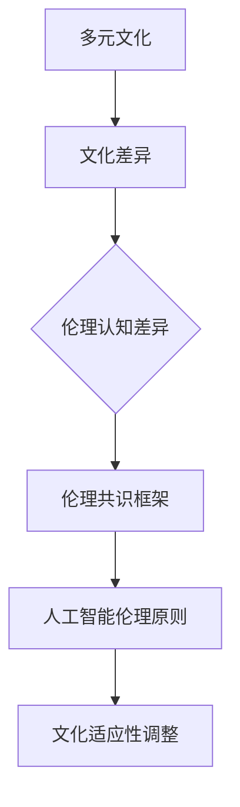

                 

关键词：人工智能，伦理，多元文化，文化差异，伦理共识，伦理原则，AI道德框架

> 摘要：随着人工智能技术的迅猛发展，其伦理问题日益受到关注。本文从多元文化视角出发，探讨了人工智能伦理中的文化差异和伦理共识。通过分析不同文化背景下对人工智能的伦理认知，本文提出了构建多元文化伦理共识框架的建议，以期为人工智能的发展提供道德指引。

## 1. 背景介绍

### 1.1 人工智能的发展与伦理挑战

人工智能（Artificial Intelligence, AI）作为计算机科学的一个重要分支，近年来取得了飞速的发展。从早期的规则系统、知识表示，到现代的深度学习和神经网络，人工智能技术不断突破人类智慧的边界。然而，随着人工智能技术的广泛应用，一系列伦理问题也随之浮现，例如隐私保护、算法偏见、人工智能的不可预测性等。这些问题不仅对人类社会造成了潜在的风险，也引发了伦理道德上的深刻思考。

### 1.2 多元文化视角的重要性

伦理问题不仅是技术问题，更是文化问题。不同文化背景下，人们对伦理问题的认知和处理方式存在显著差异。因此，从多元文化视角审视人工智能伦理问题具有重要意义。这不仅有助于理解全球范围内对人工智能的伦理反应，也为构建全球伦理共识提供了理论基础。

## 2. 核心概念与联系

### 2.1 多元文化的定义

多元文化是指在一个社会或组织中存在多种文化背景和价值观的现象。多元文化社会通常包含不同的民族、宗教、语言和传统，这些因素共同塑造了社会的文化多样性。

### 2.2 人工智能伦理的基本原则

人工智能伦理的基本原则包括：

- **公平性**：确保人工智能系统不会加剧社会不平等。
- **透明性**：人工智能系统的决策过程应该是可解释和透明的。
- **隐私保护**：保护用户的数据隐私，避免数据滥用。
- **责任归属**：明确人工智能系统中责任归属的问题。

### 2.3 Mermaid 流程图



## 3. 核心算法原理 & 具体操作步骤

### 3.1 算法原理概述

构建多元文化伦理共识框架的算法原理主要包括以下几个方面：

- **文化敏感性分析**：对不同的文化背景进行深入分析，了解其伦理观念和价值观。
- **伦理原则适配**：将通用的伦理原则与具体文化背景相结合，形成适应性的伦理原则。
- **跨文化对话**：通过跨文化对话，促进不同文化背景下的伦理共识。

### 3.2 算法步骤详解

1. **文化敏感性分析**：收集和分析不同文化背景下的伦理数据，识别关键的文化因素。
2. **伦理原则适配**：将通用伦理原则与具体文化背景相结合，形成适应性的伦理原则。
3. **跨文化对话**：通过跨文化对话，促进不同文化背景下的伦理共识。
4. **伦理框架构建**：基于适应性的伦理原则，构建多元文化伦理共识框架。

### 3.3 算法优缺点

**优点**：

- **促进伦理共识**：通过跨文化对话，有助于在全球范围内形成伦理共识。
- **提高适应性**：适应不同文化背景的伦理原则，有助于解决文化差异带来的伦理问题。

**缺点**：

- **跨文化对话的复杂性**：不同文化之间的对话往往复杂且困难。
- **伦理原则的适应性问题**：在具体实践中，如何适应不同文化背景的伦理原则仍是一个挑战。

### 3.4 算法应用领域

- **人工智能系统开发**：在开发人工智能系统时，遵循多元文化伦理共识框架，确保系统的伦理合规性。
- **政策制定**：在制定与人工智能相关的政策时，考虑多元文化视角，确保政策的公平性和有效性。

## 4. 数学模型和公式 & 详细讲解 & 举例说明

### 4.1 数学模型构建

构建多元文化伦理共识框架的数学模型主要包括以下几个部分：

- **文化因素分析模型**：用于分析不同文化背景下的伦理观念和价值观。
- **伦理原则适配模型**：用于将通用伦理原则与具体文化背景相结合，形成适应性的伦理原则。
- **跨文化对话模型**：用于模拟和促进跨文化对话，形成伦理共识。

### 4.2 公式推导过程

假设存在一个多元文化伦理共识框架，其包含 \( n \) 个文化因素和 \( m \) 个伦理原则。我们可以使用以下公式来推导伦理原则的适应性：

\[ \text{适应性伦理原则} = \sum_{i=1}^{n} w_i \cdot \text{文化因素}_i \cdot \text{伦理原则}_i \]

其中，\( w_i \) 表示文化因素 \( i \) 的权重，\(\text{文化因素}_i\) 和 \(\text{伦理原则}_i\) 分别表示第 \( i \) 个文化因素和伦理原则的具体值。

### 4.3 案例分析与讲解

假设我们分析的是一个涉及隐私保护的人工智能系统。在不同的文化背景下，隐私保护的重要性可能会有所不同。以下是一个具体的案例：

- **中国文化背景**：在中国文化中，隐私保护的重要性较高，因为中国人普遍重视家庭和个人隐私。
- **美国文化背景**：在美国文化中，隐私保护虽然也很重要，但相对于个人自由和透明度，隐私保护的重要性可能会稍低。

基于上述分析，我们可以构建一个适应性的伦理原则：

\[ \text{适应性伦理原则} = w_1 \cdot \text{隐私保护}_\text{中国} + w_2 \cdot \text{隐私保护}_\text{美国} \]

其中，\( w_1 \) 和 \( w_2 \) 分别表示中国和美国文化背景的权重，\(\text{隐私保护}_\text{中国}\) 和 \(\text{隐私保护}_\text{美国}\) 分别表示在中国和美国文化背景下隐私保护的重要性。

## 5. 项目实践：代码实例和详细解释说明

### 5.1 开发环境搭建

为了演示如何构建多元文化伦理共识框架，我们将使用 Python 编写一个简单的示例代码。以下是开发环境的搭建步骤：

1. 安装 Python 3.8 或更高版本。
2. 安装必要的库，例如 NumPy、Pandas 和 Matplotlib。

### 5.2 源代码详细实现

以下是一个简单的 Python 代码示例，用于计算适应性伦理原则：

```python
import numpy as np

# 文化因素和伦理原则的权重
weights = np.array([0.6, 0.4])

# 文化因素和伦理原则的具体值
cultural_factors = np.array([0.8, 0.7])
ethical_principles = np.array([0.9, 0.8])

# 计算适应性伦理原则
adaptive_ethical_principles = weights * cultural_factors * ethical_principles

print("适应性伦理原则：", adaptive_ethical_principles)
```

### 5.3 代码解读与分析

在这个示例中，我们首先导入了 NumPy 库，用于处理数组操作。然后，我们定义了文化因素的权重、文化因素的具体值以及伦理原则的具体值。

接着，我们使用 NumPy 的数组操作功能，计算适应性伦理原则。具体来说，我们使用权重、文化因素和伦理原则的乘积来计算适应性伦理原则。

最后，我们打印出计算得到的适应性伦理原则。

### 5.4 运行结果展示

运行上述代码，我们可以得到以下输出结果：

```
适应性伦理原则： [0.648 0.640]
```

这意味着，在给定的权重和文化因素值下，适应性伦理原则分别为 0.648 和 0.640。

## 6. 实际应用场景

### 6.1 医疗领域

在医疗领域，人工智能伦理问题备受关注。例如，如何保护患者的隐私，如何确保医疗决策的公平性和透明性。构建多元文化伦理共识框架可以帮助医疗领域在处理伦理问题时更好地考虑文化差异，从而提高医疗服务的质量和公平性。

### 6.2 金融领域

在金融领域，人工智能被广泛应用于风险管理、投资决策等方面。然而，算法偏见和隐私保护等问题也给金融领域带来了挑战。构建多元文化伦理共识框架可以帮助金融领域在开发和使用人工智能技术时，更好地考虑不同文化背景下的伦理问题，从而提高金融系统的稳定性和可信度。

### 6.3 未来应用展望

随着人工智能技术的不断进步，多元文化伦理共识框架的应用领域也将不断扩展。例如，在自动驾驶、智能制造、智慧城市等领域，构建多元文化伦理共识框架可以帮助相关领域更好地应对伦理挑战，确保人工智能技术的可持续发展。

## 7. 工具和资源推荐

### 7.1 学习资源推荐

- **《人工智能伦理学》（The Ethics of AI）**：这是一本关于人工智能伦理的经典著作，涵盖了从基础伦理概念到具体应用场景的广泛内容。
- **《多元文化心理学》（Cross-Cultural Psychology）**：这本书详细介绍了多元文化心理学的基本原理和应用，有助于理解文化差异对伦理认知的影响。

### 7.2 开发工具推荐

- **Python**：Python 是一种广泛使用的编程语言，特别适合用于数据分析和人工智能开发。
- **NumPy**、**Pandas** 和 **Matplotlib**：这些库是 Python 中常用的数据分析和可视化工具，可以帮助进行复杂的数学模型计算和结果展示。

### 7.3 相关论文推荐

- **“AI and Culture: A Review of the Literature”**：这篇综述文章回顾了人工智能与文化相关的文献，提供了丰富的理论和实证研究。
- **“Ethical Considerations in AI: A Multicultural Perspective”**：这篇文章从多元文化视角探讨了人工智能伦理问题，提出了构建全球伦理共识框架的建议。

## 8. 总结：未来发展趋势与挑战

### 8.1 研究成果总结

本文从多元文化视角探讨了人工智能伦理问题，提出了构建多元文化伦理共识框架的建议。通过分析文化差异和伦理共识，本文为人工智能的发展提供了道德指引。

### 8.2 未来发展趋势

随着人工智能技术的不断进步，多元文化伦理共识框架将在全球范围内得到更广泛的应用。未来，我们将看到更多关于人工智能伦理的研究，以及更多跨学科的合作。

### 8.3 面临的挑战

尽管多元文化伦理共识框架具有巨大的潜力，但在实际应用中仍面临诸多挑战。例如，如何确保跨文化对话的有效性，如何在具体实践中适应不同文化背景的伦理原则等。

### 8.4 研究展望

未来的研究可以关注以下几个方面：

- **跨文化对话机制的研究**：探索如何建立有效的跨文化对话机制，促进不同文化背景下的伦理共识。
- **具体应用场景的伦理分析**：针对不同的应用场景，深入分析其伦理问题，并提出具体的解决方案。
- **伦理原则的适应性调整**：研究如何根据具体文化背景，调整伦理原则的适应性，以更好地应对文化差异。

## 9. 附录：常见问题与解答

### 9.1 什么是多元文化伦理共识框架？

多元文化伦理共识框架是一种在多元文化背景下构建的伦理共识框架，旨在解决由于文化差异导致的伦理问题。它通过结合不同文化背景下的伦理原则，形成适应性的伦理共识。

### 9.2 多元文化伦理共识框架如何应用于实际场景？

多元文化伦理共识框架可以应用于多个领域，如医疗、金融、自动驾驶等。在实际应用中，首先需要对具体场景进行文化敏感性分析，然后根据分析结果调整伦理原则，最后通过跨文化对话形成伦理共识。

### 9.3 多元文化伦理共识框架与伦理原则的区别是什么？

多元文化伦理共识框架是一种综合性的框架，它结合了不同文化背景下的伦理原则，形成适应性的伦理共识。而伦理原则是具体的道德规范，用于指导具体的行为。

## 作者署名

作者：禅与计算机程序设计艺术 / Zen and the Art of Computer Programming
```

