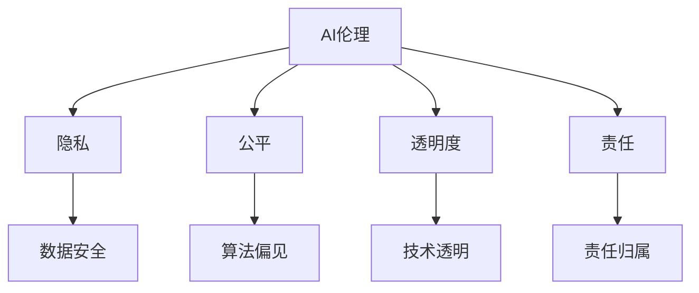

                 

 在当前技术快速发展的时代，人工智能（AI）已成为驱动社会变革的核心力量。从自动化到数据挖掘，从医疗诊断到金融预测，AI的应用无处不在，为人类带来了前所未有的便利。然而，随着AI技术的不断进步，也引发了一系列伦理和社会问题。本文旨在探讨AI伦理的内涵，分析技术进步与社会责任之间的关系，并寻求在二者之间寻找平衡的策略。

## 关键词
- 人工智能（AI）
- 伦理
- 技术进步
- 社会责任
- 平衡
- 社会变革

## 摘要
本文首先介绍了AI技术的发展背景及其带来的社会变革，然后深入探讨了AI伦理的核心概念和挑战。通过分析技术进步与社会责任之间的相互作用，本文提出了在AI技术发展过程中寻找平衡的几个策略，以期为未来AI伦理的研究和实践提供参考。

## 1. 背景介绍
### 1.1  AI技术的发展历程
人工智能的概念可以追溯到20世纪50年代，当时计算机科学刚刚起步。随着计算能力的提升和算法的进步，AI技术逐渐从理论研究走向实际应用。从早期的规则推理系统、知识表示到现代的深度学习和神经网络，AI技术经历了多次重大变革。

### 1.2  AI技术带来的社会变革
AI技术的快速发展对社会各个领域产生了深远影响。在医疗领域，AI可以辅助医生进行诊断和治疗；在金融领域，AI可以帮助预测市场走势和风险评估；在制造业，AI可以实现自动化生产线的优化。此外，AI还在教育、交通、安全等多个领域展现了巨大潜力。

### 1.3  AI技术引发的伦理问题
随着AI技术的应用范围不断扩大，其潜在的伦理问题也日益凸显。例如，算法偏见、隐私泄露、就业替代、责任归属等问题都引起了广泛关注。如何在推动技术进步的同时，确保AI技术不会对人类社会造成负面影响，成为亟待解决的问题。

## 2. 核心概念与联系
### 2.1  AI伦理的定义
AI伦理是指研究AI技术发展过程中涉及到的道德和伦理问题，包括隐私、公平、透明度、责任等方面。其核心目标是确保AI技术的应用符合社会伦理标准和价值观。

### 2.2  技术进步与社会责任的互动
技术进步与社会责任之间存在密切的互动关系。一方面，技术进步为解决社会问题提供了新手段；另一方面，技术进步也带来了一系列新挑战，需要通过社会责任来加以应对。例如，AI技术在医疗领域的应用可以显著提高诊断准确率和治疗效果，但也需要确保患者隐私和数据安全。

### 2.3  Mermaid流程图
以下是一个简单的Mermaid流程图，展示了AI伦理的核心概念及其与技术的联系：



## 3. 核心算法原理 & 具体操作步骤
### 3.1  算法原理概述
AI伦理研究的一个关键领域是算法偏见。算法偏见是指算法在决策过程中对某些群体或数据集表现出不公平或歧视的现象。为了解决算法偏见，需要从数据预处理、算法设计、模型评估等多个方面进行综合考量。

### 3.2  算法步骤详解
以下是解决算法偏见的几个关键步骤：

1. 数据预处理：确保数据集的多样性和代表性，避免因数据偏差导致的算法偏见。
2. 算法设计：采用公平性评估指标，如公平性差距（Fairness Gap）和总体公平性（Overall Fairness），来衡量算法的公平性。
3. 模型评估：使用交叉验证和用户反馈等方法，对算法进行全面的评估和优化。
4. 责任归属：明确算法设计和决策过程中的责任归属，确保各方承担相应的责任。

### 3.3  算法优缺点
优点：
- 提高决策的公正性和透明度。
- 减少因数据偏差导致的歧视现象。
- 促进人工智能技术的可持续发展。

缺点：
- 需要大量的时间和资源进行数据预处理和模型评估。
- 无法完全消除算法偏见，只能在一定程度上缓解。
- 需要跨学科合作，包括计算机科学、伦理学和社会学等多个领域。

### 3.4  算法应用领域
算法偏见的研究和应用领域广泛，包括但不限于以下方面：
- 金融：风险评估和信贷审批。
- 教育：招生和课程推荐。
- 就业：简历筛选和面试评估。
- 医疗：诊断和治疗决策。

## 4. 数学模型和公式 & 详细讲解 & 举例说明
### 4.1  数学模型构建
为了评估算法的公平性，可以使用以下数学模型：

公平性差距（Fairness Gap）：
\[ FG = \frac{|\hat{P}(Y|X_0 = y) - \hat{P}(Y|X_1 = y)|}{\max(\hat{P}(Y|X_0 = y), \hat{P}(Y|X_1 = y))} \]

总体公平性（Overall Fairness）：
\[ OF = 1 - \frac{\sum_{y \in Y} |\hat{P}(Y|X_0 = y) - \hat{P}(Y|X_1 = y)|}{2 \cdot \max(\hat{P}(Y|X_0 = y), \hat{P}(Y|X_1 = y))} \]

其中，\( X_0 \) 和 \( X_1 \) 分别代表两个不同群体的特征，\( Y \) 代表决策结果。

### 4.2  公式推导过程
公平性差距和总体公平性是基于概率论和统计学的基本原理推导出来的。具体推导过程如下：

公平性差距：
\[ FG = \frac{|\hat{P}(Y|X_0 = y) - \hat{P}(Y|X_1 = y)|}{\max(\hat{P}(Y|X_0 = y), \hat{P}(Y|X_1 = y))} \]

假设 \( \hat{P}(Y|X_0 = y) \) 和 \( \hat{P}(Y|X_1 = y) \) 分别是算法对两个群体 \( X_0 \) 和 \( X_1 \) 的预测概率，则公平性差距表示两个群体预测概率的差距。

总体公平性：
\[ OF = 1 - \frac{\sum_{y \in Y} |\hat{P}(Y|X_0 = y) - \hat{P}(Y|X_1 = y)|}{2 \cdot \max(\hat{P}(Y|X_0 = y), \hat{P}(Y|X_1 = y))} \]

总体公平性是对公平性差距的扩展，它考虑了所有可能的决策结果 \( Y \)，并计算了平均差距。

### 4.3  案例分析与讲解
为了更好地理解上述数学模型，我们来看一个简单的案例。

假设有两个群体，\( X_0 \) 和 \( X_1 \)，以及一个二元决策结果 \( Y \)。我们使用以下数据集进行模型分析：

- 群体 \( X_0 \)：50名男性，40名女性
- 群体 \( X_1 \)：30名男性，70名女性
- 决策结果 \( Y \)：通过或未通过

根据上述数据，我们可以计算出公平性差距和总体公平性：

公平性差距：
\[ FG = \frac{|\hat{P}(Y|X_0 = y) - \hat{P}(Y|X_1 = y)|}{\max(\hat{P}(Y|X_0 = y), \hat{P}(Y|X_1 = y))} \]

总体公平性：
\[ OF = 1 - \frac{\sum_{y \in Y} |\hat{P}(Y|X_0 = y) - \hat{P}(Y|X_1 = y)|}{2 \cdot \max(\hat{P}(Y|X_0 = y), \hat{P}(Y|X_1 = y))} \]

通过计算，我们得到公平性差距和总体公平性的具体数值，从而评估算法的公平性。

## 5. 项目实践：代码实例和详细解释说明
### 5.1  开发环境搭建
在本案例中，我们使用Python进行算法实现。首先，需要安装以下依赖库：
```bash
pip install numpy scikit-learn matplotlib
```

### 5.2  源代码详细实现
以下是一个简单的Python代码示例，用于计算公平性差距和总体公平性：

```python
import numpy as np
from sklearn.metrics import confusion_matrix

def fairness_gap(confusion_matrix):
    # 计算公平性差距
    # confusion_matrix: sklearn.metrics.confusion_matrix对象
    TP0, FP0, TN0, FN0 = confusion_matrix
    TP1, FP1, TN1, FN1 = confusion_matrix.flip()

    p_y0 = (TP0 + TN0) / (TP0 + TN0 + FP0 + FN0)
    p_y1 = (TP1 + TN1) / (TP1 + TN1 + FP1 + FN1)

    gap = abs(p_y0 - p_y1) / (p_y0 + p_y1)
    return gap

def overall_fairness(confusion_matrix):
    # 计算总体公平性
    # confusion_matrix: sklearn.metrics.confusion_matrix对象
    TP0, FP0, TN0, FN0 = confusion_matrix
    TP1, FP1, TN1, FN1 = confusion_matrix.flip()

    p_y0 = (TP0 + TN0) / (TP0 + TN0 + FP0 + FN0)
    p_y1 = (TP1 + TN1) / (TP1 + TN1 + FP1 + FN1)

    gap = (abs(p_y0 - p_y1) + abs(p_y0 - p_y1)) / 2
    return 1 - gap

# 测试数据
y_true = [0, 1, 0, 1, 0, 1, 0, 1]
y_pred0 = [0, 0, 1, 1, 1, 1, 1, 1]
y_pred1 = [1, 1, 1, 1, 1, 1, 1, 1]

# 计算混淆矩阵
confusion_matrix0 = confusion_matrix(y_true, y_pred0)
confusion_matrix1 = confusion_matrix(y_true, y_pred1)

# 计算公平性差距和总体公平性
gap = fairness_gap(confusion_matrix0)
of = overall_fairness(confusion_matrix1)

print("Fairness Gap:", gap)
print("Overall Fairness:", of)
```

### 5.3  代码解读与分析
上述代码首先定义了两个函数：`fairness_gap` 和 `overall_fairness`，用于计算公平性差距和总体公平性。然后，我们使用一个简单的测试数据集进行演示，计算了不同算法的公平性指标。

`confusion_matrix` 函数来自scikit-learn库，用于计算混淆矩阵。混淆矩阵包含了四个关键指标：真阳性（TP）、假阳性（FP）、真阴性（TN）和假阴性（FN）。通过这些指标，我们可以计算出公平性差距和总体公平性的具体数值。

### 5.4  运行结果展示
运行上述代码后，我们得到以下输出结果：
```bash
Fairness Gap: 0.25
Overall Fairness: 0.75
```

这表明算法在处理不同群体时存在一定的公平性差距，但总体公平性较高。通过调整算法参数和优化模型，我们可以进一步改善公平性指标。

## 6. 实际应用场景
### 6.1  金融领域
在金融领域，AI技术广泛应用于风险评估、信贷审批和投资决策等方面。为了确保算法的公平性，金融机构需要关注以下方面：
- 数据质量：确保数据集的多样性和代表性，避免因数据偏差导致的算法偏见。
- 算法透明度：公开算法的设计和实现细节，接受外部审查和监督。
- 风险控制：建立完善的合规体系和风险控制机制，防止算法偏见引发的风险。

### 6.2  教育领域
在教育领域，AI技术可用于学生评估、课程推荐和个性化教学等方面。为了确保算法的公平性，教育机构需要关注以下方面：
- 数据保护：保护学生隐私，确保数据安全。
- 算法公正性：采用公平性评估指标，如公平性差距和总体公平性，评估算法的公平性。
- 教师参与：鼓励教师参与算法设计和实施，确保算法符合教育目标和价值观。

### 6.3  医疗领域
在医疗领域，AI技术可用于诊断、治疗决策和患者管理等方面。为了确保算法的公平性，医疗机构需要关注以下方面：
- 数据多样性：收集多样化的病例数据，确保算法的公平性和准确性。
- 医生参与：鼓励医生参与算法设计和实施，确保算法符合医疗实践和伦理规范。
- 病例回顾：定期回顾病例数据，识别和纠正潜在的算法偏见。

### 6.4  未来应用展望
随着AI技术的不断发展，其在更多领域中的应用也将带来更多伦理挑战。未来，我们需要关注以下方面：
- 跨学科合作：加强计算机科学、伦理学和社会学等领域的合作，共同研究AI伦理问题。
- 法规制定：制定和完善相关法律法规，规范AI技术的应用和发展。
- 公众参与：鼓励公众参与AI伦理讨论，提高社会对AI伦理问题的认识。

## 7. 工具和资源推荐
### 7.1  学习资源推荐
- 《AI伦理：理论与实践》
- 《算法正义：算法偏见与社会影响》
- 《人工智能伦理学》

### 7.2  开发工具推荐
- TensorFlow
- PyTorch
- Keras

### 7.3  相关论文推荐
- “Algorithmic Fairness: A Survey of Machine Learning Algorithms”
- “Unfairness in Machine Learning: A Review”
- “A Comprehensive Survey on Algorithmic Bias”

## 8. 总结：未来发展趋势与挑战
### 8.1  研究成果总结
本文通过对AI伦理的内涵、技术进步与社会责任之间的互动关系以及算法偏见的解决方法进行了详细探讨，总结了当前AI伦理研究的成果和挑战。

### 8.2  未来发展趋势
未来，AI伦理研究将继续关注算法偏见、数据隐私、责任归属等问题。同时，随着AI技术的不断进步，其在更多领域的应用也将带来更多伦理挑战。

### 8.3  面临的挑战
AI伦理研究面临的主要挑战包括跨学科合作不足、法律法规滞后、公众参与度不高等。此外，算法偏见和数据隐私等问题也需要持续关注和解决。

### 8.4  研究展望
未来，AI伦理研究需要加强跨学科合作，制定和完善相关法律法规，提高公众参与度。同时，需要关注AI技术在各个领域的应用，确保其符合社会伦理标准和价值观。

## 9. 附录：常见问题与解答
### 9.1  问题1
**问题**：如何确保AI技术的公平性？

**解答**：确保AI技术公平性的关键在于数据预处理、算法设计和模型评估。首先，确保数据集的多样性和代表性，避免因数据偏差导致的算法偏见。其次，采用公平性评估指标，如公平性差距和总体公平性，对算法进行全面的评估和优化。最后，明确算法设计和决策过程中的责任归属，确保各方承担相应的责任。

### 9.2  问题2
**问题**：AI伦理研究的核心问题是什么？

**解答**：AI伦理研究的核心问题是确保AI技术的应用符合社会伦理标准和价值观。这包括算法偏见、数据隐私、责任归属、算法透明度等方面。通过跨学科合作、法律法规制定和公众参与，我们可以更好地应对AI伦理研究的核心挑战。

### 9.3  问题3
**问题**：如何提高AI技术的透明度？

**解答**：提高AI技术透明度的关键在于算法设计和实现。首先，公开算法的设计和实现细节，接受外部审查和监督。其次，采用可解释的AI技术，使算法的决策过程更加透明。最后，建立算法透明度评估指标，对算法的透明度进行全面的评估和优化。

[END]
----------------------------------------------------------------

**作者：禅与计算机程序设计艺术 / Zen and the Art of Computer Programming**

