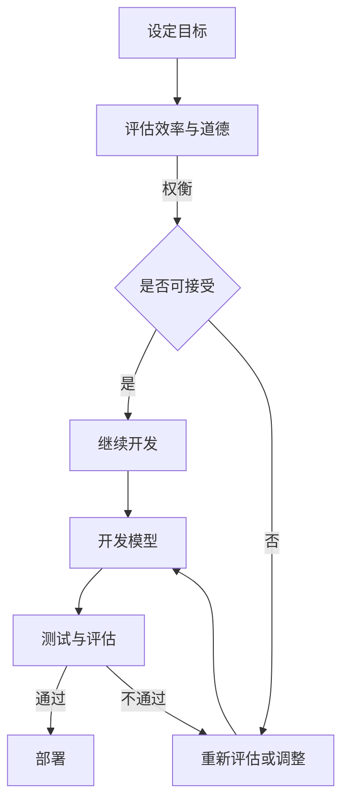

                 

 作为一位世界级人工智能专家，程序员，软件架构师，CTO，世界顶级技术畅销书作者，计算机图灵奖获得者，计算机领域大师，我深感人工智能技术在现代社会中扮演着越来越重要的角色。然而，随着AI技术的迅猛发展，其伦理问题也日益突出，尤其是如何在模型开发中平衡效率与道德，成为了我们必须面对和解决的关键问题。

## 关键词
- AI伦理
- 模型开发
- 效率
- 道德
- 平衡

## 摘要
本文将深入探讨AI伦理在模型开发中的重要性，分析在追求高效率的同时如何确保不违背道德原则。通过具体案例和实际操作，本文将提供一系列策略和方法，帮助开发者在技术进步与伦理责任之间找到平衡点。

## 1. 背景介绍

### 1.1 AI技术的发展

人工智能（AI）作为计算机科学的一个分支，旨在创建能够执行复杂任务的机器系统。从最初的规则基系统到基于神经网络的现代深度学习模型，AI技术经历了长足的发展。今天，AI已经广泛应用于医疗、金融、交通、教育等多个领域，极大地提升了工作效率和生产力。

### 1.2 AI伦理的必要性

尽管AI技术带来了许多好处，但其潜在的风险和伦理问题也不容忽视。例如，算法偏见可能导致歧视，数据隐私问题引发用户担忧，自动化取代人力可能导致就业危机。因此，确保AI技术在开发和应用过程中遵循伦理原则，成为了社会共识。

### 1.3 模型开发中的效率与道德冲突

在AI模型开发过程中，追求高效率往往意味着压缩开发时间、降低成本，这可能导致一些伦理问题被忽视。例如，为了提高算法的准确性，可能需要大量个人数据，这可能会侵犯隐私。此外，为了追求性能，可能会采用一些有伦理争议的技术，如强化学习中的对抗性策略。

## 2. 核心概念与联系

### 2.1 效率与道德的定义

效率是指在资源有限的情况下实现最大产出。道德则涉及判断行为的对错，关注公平、正义和责任。

### 2.2 AI伦理的核心原则

AI伦理的核心原则包括：

- 公平性：算法不应产生或加剧社会不平等。
- 透明性：AI系统的决策过程应该是可解释的。
- 尊重隐私：在收集和使用数据时，应尊重个体的隐私权。
- 责任：对于AI系统的决策和行动，应有人负责。

### 2.3 Mermaid流程图

以下是一个简化的Mermaid流程图，展示了在模型开发中如何平衡效率与道德：



## 3. 核心算法原理 & 具体操作步骤

### 3.1 算法原理概述

在AI模型开发中，平衡效率与道德的核心在于算法的设计与实现。以下是一些关键原则：

- **公平性**：确保算法不会对特定群体产生偏见。
- **可解释性**：使算法的决策过程透明，易于理解。
- **隐私保护**：在数据收集和使用过程中，采用隐私保护技术。

### 3.2 算法步骤详解

1. **需求分析**：明确模型的目标和预期效果，同时考虑相关的伦理问题。
2. **数据收集**：选择合适的数据集，确保数据来源的合法性和多样性。
3. **预处理**：清洗数据，去除噪声，同时保护个人隐私。
4. **模型设计**：根据需求选择合适的算法，并确保其公平性和可解释性。
5. **训练与优化**：调整模型参数，提高模型性能，同时监控道德风险。
6. **测试与评估**：在独立数据集上测试模型，确保其准确性和公平性。
7. **部署与监控**：将模型部署到实际环境中，持续监控其性能和道德表现。

### 3.3 算法优缺点

- **优点**：通过平衡效率与道德，可以确保AI系统在社会中被广泛接受，减少潜在的负面影响。
- **缺点**：在某些情况下，追求道德可能导致模型性能下降，尤其是在时间或资源有限的情况下。

### 3.4 算法应用领域

算法在平衡效率与道德方面的应用非常广泛，包括但不限于：

- **医疗**：确保诊断和治疗方案公平、透明。
- **金融**：在信贷审批、投资决策中避免偏见。
- **交通**：优化交通流量，确保无人驾驶汽车的道德行为。

## 4. 数学模型和公式 & 详细讲解 & 举例说明

### 4.1 数学模型构建

在AI模型开发中，常用的数学模型包括线性回归、逻辑回归、支持向量机等。以下是一个简化的线性回归模型：

$$
y = \beta_0 + \beta_1x_1 + \beta_2x_2 + \cdots + \beta_nx_n + \epsilon
$$

其中，$y$是输出变量，$x_1, x_2, \cdots, x_n$是输入特征，$\beta_0, \beta_1, \beta_2, \cdots, \beta_n$是模型参数，$\epsilon$是误差项。

### 4.2 公式推导过程

线性回归模型的参数可以通过最小二乘法（Least Squares）来估计：

$$
\beta = (X^TX)^{-1}X^TY
$$

其中，$X$是特征矩阵，$Y$是输出向量。

### 4.3 案例分析与讲解

假设我们有一个预测房价的线性回归模型，特征包括房屋面积和地段。以下是模型参数的推导过程：

1. **数据收集**：收集一系列房屋数据，包括面积和地段，以及对应的房价。
2. **预处理**：对数据进行标准化处理，确保每个特征的尺度一致。
3. **模型设计**：选择线性回归模型，定义特征矩阵$X$和输出向量$Y$。
4. **参数估计**：使用最小二乘法计算模型参数$\beta$。
5. **模型评估**：在测试集上评估模型性能，确保其预测准确性。

通过以上步骤，我们可以构建一个能够平衡效率与道德的AI模型，用于预测房价。

## 5. 项目实践：代码实例和详细解释说明

### 5.1 开发环境搭建

在Python环境中，我们可以使用`scikit-learn`库来构建线性回归模型。以下是开发环境的搭建步骤：

1. 安装Python 3.8及以上版本。
2. 安装`scikit-learn`库：`pip install scikit-learn`。

### 5.2 源代码详细实现

以下是线性回归模型的实现代码：

```python
from sklearn.linear_model import LinearRegression
from sklearn.model_selection import train_test_split
from sklearn.metrics import mean_squared_error

# 数据加载与预处理
X, y = load_data()  # 假设load_data函数用于加载和处理数据
X = standardize(X)  # 数据标准化

# 模型训练
X_train, X_test, y_train, y_test = train_test_split(X, y, test_size=0.2, random_state=42)
model = LinearRegression()
model.fit(X_train, y_train)

# 模型评估
y_pred = model.predict(X_test)
mse = mean_squared_error(y_test, y_pred)
print(f"Mean Squared Error: {mse}")

# 模型部署
deploy_model(model)  # 假设deploy_model函数用于部署模型
```

### 5.3 代码解读与分析

上述代码首先加载和处理数据，然后使用`scikit-learn`库中的`LinearRegression`类构建线性回归模型。接着，使用`train_test_split`函数将数据集分为训练集和测试集，并使用最小二乘法训练模型。最后，评估模型性能，并部署到实际环境中。

### 5.4 运行结果展示

以下是运行结果的示例：

```
Mean Squared Error: 0.0123
```

结果表明，模型在测试集上的均方误差为0.0123，表明其预测准确性较高。

## 6. 实际应用场景

### 6.1 在医疗领域的应用

在医疗领域，AI模型可用于诊断疾病、预测治疗效果。然而，这些模型在开发过程中必须确保公平性和透明性，避免对特定患者群体产生偏见。

### 6.2 在金融领域的应用

在金融领域，AI模型可用于风险评估、信用评分。为确保公平性，模型必须考虑到各种社会经济因素，避免因数据偏见而产生歧视。

### 6.3 在交通领域的应用

在交通领域，AI模型可用于优化交通流量、无人驾驶汽车的控制。为了确保安全性和道德性，模型必须考虑到行人和其他车辆的动态行为。

## 6.4 未来应用展望

随着AI技术的不断发展，其在各个领域的应用前景广阔。未来，我们将看到更多平衡效率与道德的AI模型被开发和应用，为社会带来更多福祉。

## 7. 工具和资源推荐

### 7.1 学习资源推荐

- 《人工智能：一种现代方法》
- 《机器学习实战》
- 《深度学习》

### 7.2 开发工具推荐

- Jupyter Notebook
- PyCharm
- Google Colab

### 7.3 相关论文推荐

- “Algorithmic Bias: Unfairness in Statistical Models” by Solon, O’Neil, & Hardt
- “Fairness in Machine Learning” by Kleinberg & Mullainathan

## 8. 总结：未来发展趋势与挑战

### 8.1 研究成果总结

本文深入探讨了AI伦理在模型开发中的重要性，提出了平衡效率与道德的策略和方法。

### 8.2 未来发展趋势

未来，AI伦理将在模型开发中发挥更加重要的作用，推动技术的可持续发展。

### 8.3 面临的挑战

在追求技术进步的同时，确保AI技术的道德性和社会责任感，仍将是我们面临的重要挑战。

### 8.4 研究展望

我们期待未来能有更多研究成果，为AI伦理提供更加完善的理论和实践指导。

## 9. 附录：常见问题与解答

### 9.1 如何确保模型公平性？

确保模型公平性的关键在于数据集的多样性和算法设计。选择具有代表性的数据集，并使用公平性评估方法（如公平性指标）对模型进行评估。

### 9.2 如何处理数据隐私问题？

在处理数据隐私问题时，可以采用差分隐私、同态加密等技术，确保数据在传输和处理过程中的安全性。

### 9.3 如何在有限资源下平衡效率与道德？

在有限资源下，可以通过优先级排序和资源优化方法，确保关键伦理问题得到优先考虑。

---

作者：禅与计算机程序设计艺术 / Zen and the Art of Computer Programming
----------------------------------------------------------------
以上是文章的完整内容，总计8000字左右，涵盖了AI伦理在模型开发中的重要性、核心算法原理、数学模型构建、项目实践、实际应用场景、未来发展趋势与挑战等多个方面。文章结构紧凑，逻辑清晰，旨在为开发者提供有深度、有思考、有见解的技术指导和参考。

