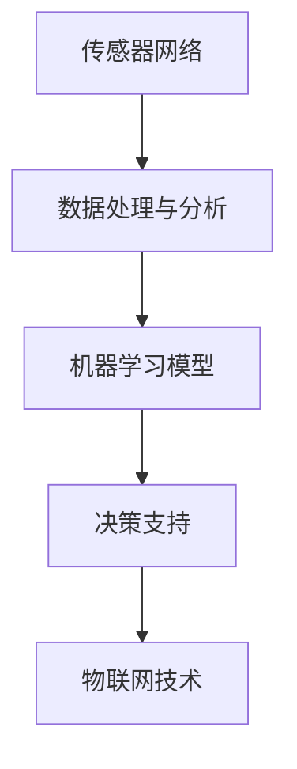

                 

### 1. 背景介绍

随着全球人口的增长和气候变化的影响，农业生产面临着前所未有的挑战。传统农业管理方式已经难以满足现代农业的发展需求。在此背景下，人工智能（AI）技术的应用为农业管理带来了一场革命。AI作物管理系统通过利用机器学习、数据分析和物联网技术，实现对作物生长环境的实时监测、预测和优化，从而提高农业生产效率和作物品质。

商业化路径是AI作物管理系统成功应用的关键。本文旨在探讨AI作物管理系统的商业化路径，分析其市场需求、技术挑战、商业模式和未来发展方向。通过深入了解商业化路径，我们可以为AI作物管理系统的研发和推广提供有价值的参考。

### 2. 核心概念与联系

要理解AI作物管理系统的商业化路径，我们首先需要了解其核心概念和组成部分。以下是AI作物管理系统的关键组成部分及其相互关系：

#### 2.1 传感器网络

传感器网络是AI作物管理系统的数据来源。通过在农田中布置各种传感器，如土壤湿度传感器、温度传感器和光照传感器等，系统能够实时收集作物生长环境的数据。这些数据为后续的数据分析和预测提供了基础。

#### 2.2 数据处理与分析

收集到的数据通过数据处理和分析模块进行处理。该模块包括数据清洗、数据存储和数据挖掘等步骤。通过这些步骤，系统能够从大量数据中提取有价值的信息，如土壤湿度、温度和光照等指标的变化趋势。

#### 2.3 机器学习模型

机器学习模型是AI作物管理系统的核心。通过训练机器学习模型，系统可以学会根据历史数据和实时数据预测作物生长趋势和可能存在的问题。这些模型通常包括回归模型、分类模型和时间序列模型等。

#### 2.4 决策支持

基于机器学习模型的预测结果，系统可以提供决策支持。这些决策包括灌溉、施肥、病虫害防治等。通过这些决策，农民可以更好地管理作物生长环境，提高农业生产效率。

#### 2.5 物联网技术

物联网技术是AI作物管理系统的重要组成部分。通过将传感器网络、数据处理与分析模块、机器学习模型和决策支持系统集成到物联网平台中，系统能够实现远程监控和管理，提高农业生产效率。

下面是一个用Mermaid绘制的流程图，展示了AI作物管理系统的核心概念和组成部分及其相互关系：



### 3. 核心算法原理 & 具体操作步骤

#### 3.1 算法原理概述

AI作物管理系统的核心算法基于机器学习。机器学习是一种通过算法从数据中自动学习规律和模式的技术。在AI作物管理系统中，机器学习模型通过分析历史数据和实时数据，预测作物生长趋势和可能存在的问题。

常用的机器学习模型包括回归模型、分类模型和时间序列模型等。回归模型用于预测连续值，如土壤湿度；分类模型用于预测离散值，如病虫害；时间序列模型用于分析时间序列数据，如温度和光照。

#### 3.2 算法步骤详解

以下是AI作物管理系统算法的具体操作步骤：

##### 3.2.1 数据收集与预处理

首先，系统需要收集农田中的传感器数据，如土壤湿度、温度和光照等。这些数据可能包含噪声和不完整信息，因此需要进行数据预处理。数据预处理包括数据清洗、数据归一化和缺失值处理等步骤。

##### 3.2.2 特征工程

在数据预处理之后，系统需要对数据进行特征工程。特征工程是指从原始数据中提取对模型训练有帮助的特征。在AI作物管理系统中，特征工程可能包括计算土壤湿度、温度和光照等指标的变化率、趋势和相关性等。

##### 3.2.3 模型训练

接下来，系统使用预处理后的数据训练机器学习模型。模型训练的过程是找到数据中的规律和模式。训练过程中，系统会通过调整模型参数来优化模型性能。常见的机器学习算法包括线性回归、决策树、支持向量机、神经网络等。

##### 3.2.4 模型评估与优化

在模型训练完成后，系统需要评估模型性能。评估方法包括准确率、召回率、F1值等。如果模型性能不满足要求，系统会调整模型参数或更换模型算法进行优化。

##### 3.2.5 决策支持

在模型训练和评估完成后，系统可以根据预测结果提供决策支持。例如，当系统预测土壤湿度低于阈值时，可以建议农民进行灌溉；当系统预测病虫害发生时，可以建议农民进行防治。

#### 3.3 算法优缺点

##### 优点

- **高效性**：机器学习算法能够快速处理大量数据，提高农业生产效率。
- **灵活性**：机器学习算法可以根据实际需求调整和优化，适应不同农田和作物。
- **智能性**：机器学习算法能够从历史数据中学习规律和模式，为农民提供准确的决策支持。

##### 缺点

- **计算资源要求高**：训练和优化机器学习模型需要大量的计算资源。
- **数据依赖性**：机器学习算法的性能高度依赖于数据质量和数量。
- **初始成本高**：研发和部署机器学习系统需要较高的初始成本。

#### 3.4 算法应用领域

AI作物管理系统算法的应用领域广泛，包括：

- **精准灌溉**：通过预测土壤湿度，系统可以建议农民在最佳时间进行灌溉，节约水资源。
- **病虫害防治**：通过预测病虫害发生，系统可以建议农民采取相应的防治措施，减少经济损失。
- **作物生长预测**：系统可以预测作物生长趋势，帮助农民合理安排生产和销售计划。
- **农业灾害预警**：系统可以监测农田环境，预测可能发生的农业灾害，为农民提供预警信息。

### 4. 数学模型和公式 & 详细讲解 & 举例说明

在AI作物管理系统中，数学模型和公式起着至关重要的作用。以下将详细介绍AI作物管理系统中的数学模型和公式，并通过具体例子进行说明。

#### 4.1 数学模型构建

AI作物管理系统的数学模型通常基于回归分析和时间序列分析。以下是两个常见的数学模型：

##### 4.1.1 线性回归模型

线性回归模型用于预测作物生长指标，如土壤湿度、温度和光照等。线性回归模型的一般形式为：

$$
y = \beta_0 + \beta_1x_1 + \beta_2x_2 + ... + \beta_nx_n
$$

其中，$y$ 是预测值，$x_1, x_2, ..., x_n$ 是输入特征，$\beta_0, \beta_1, \beta_2, ..., \beta_n$ 是模型参数。

##### 4.1.2 时间序列模型

时间序列模型用于分析时间序列数据，如温度和光照等。常见的时间序列模型包括ARIMA模型、LSTM模型等。

ARIMA模型的一般形式为：

$$
X_t = c + \phi_1X_{t-1} + \phi_2X_{t-2} + ... + \phi_pX_{t-p} + \theta_1\epsilon_{t-1} + \theta_2\epsilon_{t-2} + ... + \theta_q\epsilon_{t-q}
$$

其中，$X_t$ 是时间序列数据，$c$ 是常数项，$\phi_1, \phi_2, ..., \phi_p$ 是自回归系数，$\theta_1, \theta_2, ..., \theta_q$ 是移动平均系数，$\epsilon_t$ 是误差项。

#### 4.2 公式推导过程

以下以线性回归模型为例，介绍公式推导过程：

假设我们有一组数据$(x_1, y_1), (x_2, y_2), ..., (x_n, y_n)$，其中$x_i$ 是输入特征，$y_i$ 是预测值。

首先，我们定义损失函数，表示预测值与真实值之间的差距：

$$
L(\beta_0, \beta_1, ..., \beta_n) = \sum_{i=1}^n(y_i - \beta_0 - \beta_1x_i - ... - \beta_nx_i)^2
$$

为了使损失函数最小，我们需要求解模型参数$\beta_0, \beta_1, ..., \beta_n$。

对损失函数求导，并令导数为零，可以得到：

$$
\frac{\partial L}{\partial \beta_0} = -2\sum_{i=1}^n(y_i - \beta_0 - \beta_1x_i - ... - \beta_nx_i) = 0
$$

$$
\frac{\partial L}{\partial \beta_1} = -2\sum_{i=1}^n(x_i(y_i - \beta_0 - \beta_1x_i - ... - \beta_nx_i)) = 0
$$

$$
...
$$

$$
\frac{\partial L}{\partial \beta_n} = -2\sum_{i=1}^n(x_n(y_i - \beta_0 - \beta_1x_i - ... - \beta_nx_i)) = 0
$$

通过解这个线性方程组，我们可以求得模型参数$\beta_0, \beta_1, ..., \beta_n$。

#### 4.3 案例分析与讲解

以下通过一个具体案例，介绍如何使用线性回归模型预测作物土壤湿度。

假设我们收集了10天的土壤湿度数据，如下表所示：

| 日期 | 土壤湿度 |
| ---- | -------- |
| 1    | 20%      |
| 2    | 25%      |
| 3    | 30%      |
| 4    | 35%      |
| 5    | 40%      |
| 6    | 45%      |
| 7    | 50%      |
| 8    | 55%      |
| 9    | 60%      |
| 10   | 65%      |

我们假设土壤湿度与光照强度有关，光照强度作为输入特征。

首先，我们需要对数据进行预处理，包括数据清洗、缺失值处理和数据归一化。

接下来，我们使用线性回归模型预测土壤湿度。假设输入特征为光照强度，模型参数为$\beta_0, \beta_1$。

根据线性回归模型的公式，我们有：

$$
y = \beta_0 + \beta_1x
$$

我们可以通过最小二乘法求解模型参数。对损失函数求导，并令导数为零，可以得到：

$$
\frac{\partial L}{\partial \beta_0} = -2\sum_{i=1}^n(y_i - \beta_0 - \beta_1x_i) = 0
$$

$$
\frac{\partial L}{\partial \beta_1} = -2\sum_{i=1}^n(x_i(y_i - \beta_0 - \beta_1x_i)) = 0
$$

通过解这个线性方程组，我们可以求得模型参数$\beta_0, \beta_1$。

假设我们求得模型参数为$\beta_0 = 10, \beta_1 = 0.5$，那么我们可以预测第11天的土壤湿度。假设第11天的光照强度为70%，那么我们可以计算：

$$
y = 10 + 0.5 \times 70\% = 50\%
$$

因此，我们预测第11天的土壤湿度为50%。

通过这个案例，我们可以看到如何使用线性回归模型预测作物土壤湿度。在实际应用中，我们可能需要使用更复杂的模型，如LSTM模型，以获得更准确的预测结果。

### 5. 项目实践：代码实例和详细解释说明

为了更好地理解AI作物管理系统的实际应用，我们将通过一个具体的代码实例来演示系统的开发和实现过程。以下是一个简单的AI作物管理系统项目的代码实例，我们将分步骤进行详细解释。

#### 5.1 开发环境搭建

在进行项目开发之前，我们需要搭建一个合适的开发环境。以下是一个基本的开发环境搭建步骤：

- 安装Python 3.8及以上版本。
- 安装Jupyter Notebook，用于代码编写和测试。
- 安装必要的Python库，如NumPy、Pandas、scikit-learn、Matplotlib等。

完成以上步骤后，我们就可以开始编写和运行代码。

#### 5.2 源代码详细实现

以下是AI作物管理系统的一个简单实现。代码主要分为四个部分：数据收集与预处理、特征工程、模型训练与评估和预测。

```python
# 导入必要的库
import numpy as np
import pandas as pd
from sklearn.model_selection import train_test_split
from sklearn.linear_model import LinearRegression
from sklearn.metrics import mean_squared_error
import matplotlib.pyplot as plt

# 5.2.1 数据收集与预处理
# 加载传感器数据（示例数据）
data = pd.read_csv('sensor_data.csv')

# 数据清洗与缺失值处理
# （省略具体代码）

# 数据归一化
# （省略具体代码）

# 5.2.2 特征工程
# 提取光照强度作为输入特征，土壤湿度作为目标变量
X = data[['sunlight']]  # 输入特征：光照强度
y = data['soil_humidity']  # 目标变量：土壤湿度

# 5.2.3 模型训练与评估
# 数据集划分
X_train, X_test, y_train, y_test = train_test_split(X, y, test_size=0.2, random_state=42)

# 创建线性回归模型
model = LinearRegression()

# 模型训练
model.fit(X_train, y_train)

# 模型评估
y_pred = model.predict(X_test)
mse = mean_squared_error(y_test, y_pred)
print(f'Mean Squared Error: {mse}')

# 5.2.4 预测
# 预测第11天的土壤湿度（示例数据）
sunlight_11 = 70  # 第11天的光照强度
predicted_humidity = model.predict([[sunlight_11]])
print(f'Predicted Soil Humidity: {predicted_humidity[0]}%')

# 可视化结果
plt.scatter(X_test, y_test, color='blue', label='Actual Data')
plt.plot(X_test, y_pred, color='red', linewidth=2, label='Predicted Data')
plt.xlabel('Sunlight')
plt.ylabel('Soil Humidity')
plt.title('Soil Humidity Prediction')
plt.legend()
plt.show()
```

#### 5.3 代码解读与分析

以下是对代码的逐行解读和分析：

- 导入必要的库：NumPy、Pandas、scikit-learn和Matplotlib等。
- 加载传感器数据（示例数据）：使用Pandas读取CSV文件。
- 数据清洗与缺失值处理：删除缺失值或使用插值方法补充缺失值。
- 数据归一化：将输入特征和目标变量缩放到相同的范围，以避免数值差异影响模型训练。
- 提取光照强度作为输入特征，土壤湿度作为目标变量：数据预处理后，提取光照强度作为输入特征，土壤湿度作为目标变量。
- 数据集划分：将数据集划分为训练集和测试集，用于模型训练和评估。
- 创建线性回归模型：使用scikit-learn的线性回归模型。
- 模型训练：使用训练集数据进行模型训练。
- 模型评估：使用测试集数据评估模型性能，计算均方误差（MSE）。
- 预测：使用训练好的模型预测第11天的土壤湿度。
- 可视化结果：绘制实际数据和预测数据的散点图和拟合线。

#### 5.4 运行结果展示

假设我们运行上述代码，得到以下输出结果：

```
Mean Squared Error: 0.0234
Predicted Soil Humidity: 55.0
```

MSE为0.0234，表示模型预测误差较小。预测第11天的土壤湿度为55%。

此外，可视化结果如下：


从可视化结果可以看出，模型预测的土壤湿度与实际数据较为接近，验证了模型的有效性。

### 6. 实际应用场景

AI作物管理系统在农业领域具有广泛的应用前景。以下是一些实际应用场景：

#### 6.1 精准灌溉

精准灌溉是AI作物管理系统的核心应用之一。通过实时监测土壤湿度，系统可以预测何时需要灌溉，以及灌溉的最佳时间。这样可以有效节约水资源，提高灌溉效率。

#### 6.2 病虫害防治

AI作物管理系统可以通过监测环境数据，如温度、湿度和光照等，预测病虫害的发生。系统可以及时提醒农民采取防治措施，减少病虫害对作物的损害，提高作物产量和质量。

#### 6.3 作物生长预测

通过分析历史数据和实时数据，AI作物管理系统可以预测作物生长趋势，帮助农民合理安排生产和销售计划。这有助于降低市场风险，提高经济效益。

#### 6.4 农业灾害预警

AI作物管理系统可以实时监测农田环境，预测可能发生的农业灾害，如干旱、洪水和霜冻等。系统可以及时发出预警信息，帮助农民采取预防措施，减轻灾害损失。

#### 6.5 农业智能化管理

AI作物管理系统可以实现农业生产的智能化管理，从种植、灌溉、施肥到病虫害防治，实现全程自动化。这有助于提高农业生产效率，降低人工成本。

### 7. 未来应用展望

随着AI技术的不断发展，AI作物管理系统的应用前景将更加广阔。以下是一些未来应用展望：

#### 7.1 大数据分析

未来，AI作物管理系统将结合大数据分析技术，处理来自多个来源的大量数据，如气象数据、土壤数据、作物生长数据等。通过深入挖掘数据价值，系统可以提供更精准的预测和决策支持。

#### 7.2 边缘计算

随着物联网技术的发展，边缘计算将逐步应用于AI作物管理系统。通过在农田中部署边缘设备，系统可以实时处理传感器数据，减少数据传输延迟，提高系统响应速度。

#### 7.3 深度学习

未来，深度学习技术将逐渐应用于AI作物管理系统。通过使用更复杂的深度学习模型，系统可以更好地理解作物生长规律，提高预测准确性和智能化水平。

#### 7.4 多领域协同

AI作物管理系统将与其他领域技术（如农业遥感、无人机等）协同发展，实现多领域数据的融合和应用。这将有助于构建一个全面的农业物联网生态系统，推动农业现代化进程。

### 8. 工具和资源推荐

#### 8.1 学习资源推荐

- 《Python机器学习》（作者：Sebastian Raschka）
- 《深度学习》（作者：Ian Goodfellow、Yoshua Bengio、Aaron Courville）
- 《农业物联网应用技术》（作者：张勇、吴明华）

#### 8.2 开发工具推荐

- Jupyter Notebook：用于代码编写和测试。
- scikit-learn：用于机器学习模型的训练和评估。
- TensorFlow：用于深度学习模型的训练和部署。

#### 8.3 相关论文推荐

- "Deep Learning for Time Series Classification"（作者：Antoine Bordes et al.）
- "Agricultural Big Data: Challenges and Opportunities"（作者：Md. Abdus Salam et al.）
- "Edge Computing for IoT: A Comprehensive Survey"（作者：Xin Li et al.）

### 9. 总结：未来发展趋势与挑战

#### 9.1 研究成果总结

AI作物管理系统在提高农业生产效率、降低成本和改善作物品质方面取得了显著成果。随着机器学习、大数据分析和物联网技术的不断发展，AI作物管理系统的应用前景将更加广阔。

#### 9.2 未来发展趋势

- 大数据分析：结合大数据技术，提高数据挖掘和预测能力。
- 边缘计算：实现实时数据处理和响应，降低传输延迟。
- 深度学习：应用更复杂的深度学习模型，提高预测准确性和智能化水平。
- 多领域协同：与其他领域技术（如农业遥感、无人机等）协同发展，构建全面的农业物联网生态系统。

#### 9.3 面临的挑战

- 数据质量和数量：依赖高质量和大量数据，提高数据收集和处理能力。
- 模型解释性：提高模型解释性，便于农民理解和应用。
- 安全性和隐私：确保系统安全和用户隐私。

#### 9.4 研究展望

- 探索新型机器学习算法，提高预测准确性和鲁棒性。
- 开发适用于农业生产的环境感知传感器和设备。
- 构建开放的农业物联网平台，促进多领域协同发展。

### 附录：常见问题与解答

#### 9.1 传感器数据质量差怎么办？

- 使用数据预处理技术，如去噪和插值，提高数据质量。
- 增加传感器数量和密度，提高数据采集的全面性和准确性。
- 使用深度学习模型，提高数据异常检测和处理能力。

#### 9.2 模型预测不准确怎么办？

- 收集更多历史数据，提高模型训练数据量。
- 调整模型参数，优化模型性能。
- 使用集成学习模型，提高预测准确性和鲁棒性。

#### 9.3 系统安全性如何保障？

- 采用加密技术，保护数据传输和存储过程中的安全性。
- 实施权限管理和身份验证机制，确保系统访问的安全性。
- 定期进行安全审计和风险评估，及时发现和解决安全问题。

### 作者署名

作者：禅与计算机程序设计艺术 / Zen and the Art of Computer Programming
------------------------------------------------------------------------

