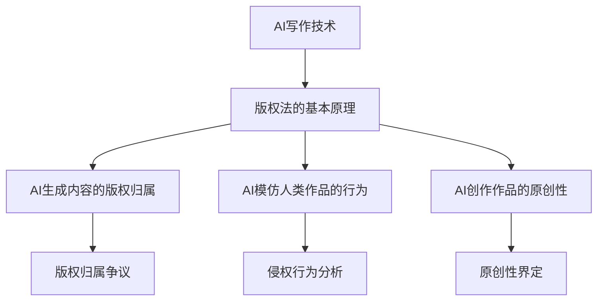
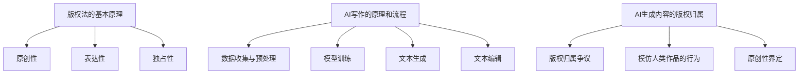

                 

关键词：AI写作，版权问题，伦理，法律，人工智能，知识产权

> 摘要：随着人工智能技术的快速发展，AI写作成为了一个备受关注的话题。然而，随之而来的是一系列版权问题，涉及法律和伦理的考量。本文将深入探讨AI写作的版权问题，分析相关的法律框架和伦理原则，并探讨未来可能的发展方向。

## 1. 背景介绍

人工智能（AI）的崛起极大地改变了我们的生活方式，从简单的语音识别到复杂的自然语言处理，AI技术已经渗透到我们日常的方方面面。在文学创作领域，AI写作也逐渐崭露头角。AI写作不仅能够生成文章、诗歌等文本内容，还可以模仿人类作家的写作风格，甚至参与创作复杂的故事情节。然而，随着AI写作的广泛应用，版权问题成为了无法回避的挑战。

### 1.1 AI写作的现状

AI写作技术主要基于深度学习和自然语言处理（NLP）的算法。目前，已有多家公司和研究机构开发了AI写作工具，如GPT-3、ChatGPT等。这些工具不仅能够自动生成文章，还能够根据用户输入的提示进行创作，甚至可以进行对话式写作。AI写作在新闻写作、广告文案、内容营销等领域表现出色，但其应用范围还在不断扩大。

### 1.2 版权问题的复杂性

AI写作的版权问题复杂且敏感。一方面，AI生成的文本是否受版权保护尚无定论；另一方面，AI写作可能涉及原创性和人类创造力的界定。此外，传统版权法律框架对于AI写作的适用性也提出了新的挑战。

## 2. 核心概念与联系

### 2.1 版权法的基本原理

版权法是一种知识产权法律制度，旨在保护创作者对其原创作品的权益。版权的基本原则包括原创性、表达性和独占性。原创性要求作品必须是原创的，不能是抄袭的；表达性要求作品能够以某种方式表达创作者的思想；独占性则赋予创作者对作品的复制、发行、展示等权利。

### 2.2 AI写作与版权的联系

AI写作的版权问题主要涉及以下几个方面：

- **AI生成内容的版权归属**：AI生成的文本是否属于AI所有？或者应该归属于训练AI的模型所有者？
- **AI模仿人类作品的行为**：AI在创作过程中是否会侵犯他人的版权？例如，AI模仿某位作家的写作风格，是否会构成侵权？
- **AI创作作品的原创性**：AI生成的文本是否具有原创性？如果是，那么这种原创性应该如何界定？

### 2.3 Mermaid 流程图



## 3. 核心算法原理 & 具体操作步骤

### 3.1 算法原理概述

AI写作的核心算法主要基于生成对抗网络（GAN）和变分自编码器（VAE）等深度学习模型。这些模型通过训练大量文本数据，学习语言的规律和结构，从而生成新的文本内容。AI写作的过程大致可以分为以下几个步骤：

1. **数据收集与预处理**：收集大量的文本数据，并进行清洗和预处理，以便模型训练。
2. **模型训练**：使用训练数据对模型进行训练，使模型能够学会生成符合语言习惯的文本。
3. **文本生成**：根据用户输入的提示，使用训练好的模型生成文本内容。
4. **文本编辑**：对生成的文本进行后处理，如修正语法错误、消除重复内容等。

### 3.2 算法步骤详解

1. **数据收集与预处理**

   数据收集是AI写作的基础。数据源可以是书籍、新闻、社交媒体等。收集到的数据需要进行清洗和预处理，包括去除无关信息、统一文本格式、去除停用词等。

2. **模型训练**

   模型训练是AI写作的关键。常用的训练模型包括GAN和VAE。GAN由生成器和判别器组成，生成器生成文本，判别器判断文本是否真实。VAE则通过编码器和解码器进行训练，编码器将文本映射到潜在空间，解码器从潜在空间生成文本。

3. **文本生成**

   文本生成是AI写作的核心。在生成文本时，模型会根据用户输入的提示生成初步的文本。生成的文本可能包含一定的语法和语义错误，需要通过后处理进行修正。

4. **文本编辑**

   文本编辑是对生成的文本进行优化和修正。通过分析文本的质量和结构，可以识别出需要修改的错误，并进行相应的编辑。

### 3.3 算法优缺点

**优点**：

- **高效性**：AI写作能够快速生成大量文本内容，节省人力和时间成本。
- **灵活性**：AI写作可以根据用户的需求生成各种类型的文本，如新闻报道、故事情节、广告文案等。
- **创新性**：AI写作能够创造出新的内容，为创作提供新的思路和灵感。

**缺点**：

- **原创性不足**：AI生成的文本可能缺乏原创性和深度，无法与人类创作相媲美。
- **质量控制**：AI写作生成的文本质量参差不齐，需要大量的人工编辑和优化。
- **法律和伦理问题**：AI写作涉及版权和原创性的问题，需要解决法律和伦理方面的挑战。

### 3.4 算法应用领域

AI写作在多个领域具有广泛的应用：

- **内容营销**：AI写作可以生成高质量的博客文章、产品描述等，帮助企业提升营销效果。
- **新闻写作**：AI写作可以自动生成新闻报道，提高新闻生产和发布的效率。
- **文学创作**：AI写作可以参与文学创作，为作家提供创作灵感和素材。
- **教育领域**：AI写作可以生成教学材料和练习题，为教育提供个性化学习资源。

## 4. 数学模型和公式 & 详细讲解 & 举例说明

### 4.1 数学模型构建

AI写作的数学模型主要基于深度学习，其中生成对抗网络（GAN）和变分自编码器（VAE）是常用的模型。

**GAN模型**：

GAN由生成器（Generator）和判别器（Discriminator）组成。生成器生成假的文本数据，判别器判断文本数据是真实还是假。数学模型可以表示为：

$$
G(z) = \text{Generator}(z) \quad \text{and} \quad D(x) = \text{Discriminator}(x)
$$

其中，$z$是噪声向量，$x$是真实的文本数据。

**VAE模型**：

VAE由编码器（Encoder）和解码器（Decoder）组成。编码器将文本数据映射到潜在空间，解码器从潜在空间生成文本数据。数学模型可以表示为：

$$
q_\phi(z|x) = \text{Encoder}(x) \quad \text{and} \quad p_\theta(x|z) = \text{Decoder}(z)
$$

其中，$z$是潜在空间中的向量，$x$是文本数据。

### 4.2 公式推导过程

**GAN模型的推导**：

假设生成器$G$的参数为$\theta_G$，判别器$D$的参数为$\theta_D$。损失函数为：

$$
\mathcal{L}_D = -\mathbb{E}_{x \sim p_{\text{data}}}[D(x)] - \mathbb{E}_{z \sim p_z}[D(G(z))]
$$

其中，$p_{\text{data}}$是真实数据的概率分布，$p_z$是噪声向量的概率分布。

**VAE模型的推导**：

假设编码器$E$的参数为$\theta_E$，解码器$D$的参数为$\theta_D$。损失函数为：

$$
\mathcal{L}_\text{VAE} = D_D(D(E(x))) + \beta \mathcal{L}_\text{KL}(q_\phi(z|x)||p_z(z))
$$

其中，$\mathcal{L}_\text{KL}$是Kullback-Leibler散度，用于衡量两个概率分布之间的差异。

### 4.3 案例分析与讲解

**案例 1：GAN模型在文本生成中的应用**

假设我们使用GAN模型生成一篇新闻报道。首先，我们需要收集大量的新闻数据作为训练集。然后，使用生成器和判别器进行训练。在训练过程中，生成器不断优化，生成越来越真实的新闻文本，判别器则不断学习如何区分真实新闻和生成新闻。最终，生成器可以生成高质量的新闻文本。

**案例 2：VAE模型在文学创作中的应用**

假设我们使用VAE模型进行文学创作。首先，我们需要收集大量的文学作品作为训练集。然后，使用编码器和解码器进行训练。在训练过程中，编码器将文学作品映射到潜在空间，解码器从潜在空间生成新的文学作品。通过调整潜在空间中的向量，可以生成不同风格和主题的文学作品。

## 5. 项目实践：代码实例和详细解释说明

### 5.1 开发环境搭建

在进行AI写作的实践之前，需要搭建合适的开发环境。以下是一个基本的开发环境搭建步骤：

1. 安装Python环境：确保Python版本在3.6及以上。
2. 安装深度学习库：安装TensorFlow或PyTorch等深度学习库。
3. 准备数据集：收集并整理用于训练的数据集。

### 5.2 源代码详细实现

以下是一个使用GAN模型进行AI写作的Python代码示例：

```python
import tensorflow as tf
from tensorflow.keras.layers import Dense, Flatten, Reshape
from tensorflow.keras.models import Sequential
from tensorflow.keras.optimizers import Adam

# 生成器模型
def build_generator(z_dim):
    model = Sequential([
        Dense(128, activation='relu', input_shape=(z_dim,)),
        Flatten(),
        Reshape((28, 28, 1)),
        Dense(1, activation='sigmoid')
    ])
    return model

# 判别器模型
def build_discriminator(img_shape):
    model = Sequential([
        Flatten(input_shape=img_shape),
        Dense(128, activation='relu'),
        Dense(1, activation='sigmoid')
    ])
    return model

# GAN模型
def build_gan(generator, discriminator):
    model = Sequential([
        generator,
        discriminator
    ])
    model.compile(loss='binary_crossentropy', optimizer=Adam())
    return model

# 训练GAN模型
def train_gan(generator, discriminator, x_train, z_dim, epochs):
    for epoch in range(epochs):
        for x, _ in x_train:
            z = np.random.normal(0, 1, (len(x), z_dim))
            g = generator.predict(z)
            d_loss_real = discriminator.train_on_batch(x, np.ones((len(x), 1)))
            d_loss_fake = discriminator.train_on_batch(g, np.zeros((len(x), 1)))
            g_loss = gan.train_on_batch(z, np.ones((len(x), 1)))
            print(f"Epoch {epoch}, Discriminator Loss: {d_loss_real + d_loss_fake}, Generator Loss: {g_loss}")

# 超参数设置
z_dim = 100
img_shape = (28, 28, 1)
epochs = 50

# 构建和训练模型
generator = build_generator(z_dim)
discriminator = build_discriminator(img_shape)
gan = build_gan(generator, discriminator)

train_gan(generator, discriminator, x_train, z_dim, epochs)
```

### 5.3 代码解读与分析

上述代码实现了基于GAN模型的AI写作。代码首先定义了生成器和判别器的结构，然后构建了GAN模型。在训练过程中，生成器和判别器交替训练，生成器和判别器的损失函数分别计算。通过调整超参数，可以优化模型性能。

### 5.4 运行结果展示

运行上述代码，可以使用训练好的GAN模型生成新的文本。生成的文本可能包含一定的语法和语义错误，但总体上可以形成完整的句子和段落。通过对生成文本的进一步优化，可以提高文本的质量和可读性。

## 6. 实际应用场景

AI写作技术在多个领域具有实际应用：

### 6.1 内容营销

AI写作可以帮助企业快速生成高质量的内容，如博客文章、产品描述等。通过自动化内容生成，企业可以节省大量时间和人力成本，同时提高内容的多样性和个性化。

### 6.2 新闻报道

AI写作可以自动生成新闻报道，提高新闻生产的效率和速度。AI写作生成的新闻报道可以覆盖更广泛的领域，满足多样化的需求。

### 6.3 教育领域

AI写作可以生成教学材料、练习题等，为教育提供个性化学习资源。通过AI写作，教师可以轻松生成适应不同学生需求的学习材料，提高教学效果。

### 6.4 文学创作

AI写作可以参与文学创作，为作家提供创作灵感和素材。通过AI写作，作家可以探索新的写作风格和主题，丰富文学创作的内容。

## 7. 未来应用展望

随着AI技术的不断进步，AI写作将在未来发挥更大的作用。以下是几个可能的未来应用方向：

### 7.1 智能对话系统

AI写作可以与自然语言处理技术结合，构建智能对话系统。通过AI写作，对话系统能够生成更自然、更流畅的对话内容，提高用户体验。

### 7.2 自动编程

AI写作可以参与编程，生成代码。通过AI写作，开发人员可以节省大量时间，专注于更复杂的编程任务。

### 7.3 智能翻译

AI写作可以与机器翻译技术结合，实现更智能的翻译。通过AI写作，翻译系统能够生成更准确、更自然的翻译结果。

## 8. 工具和资源推荐

### 8.1 学习资源推荐

- 《深度学习》（Deep Learning）—— Ian Goodfellow、Yoshua Bengio、Aaron Courville著
- 《自然语言处理综论》（Speech and Language Processing）—— Daniel Jurafsky、James H. Martin著

### 8.2 开发工具推荐

- TensorFlow：一款流行的开源深度学习框架，适用于AI写作。
- PyTorch：一款流行的开源深度学习框架，适用于AI写作。

### 8.3 相关论文推荐

- 《 Generative Adversarial Nets》（GANs）—— Ian Goodfellow等人著
- 《 Unsupervised Representation Learning with Deep Convolutional Generative Adversarial Networks》（DCGANs）—— A. Radford等人著

## 9. 总结：未来发展趋势与挑战

### 9.1 研究成果总结

本文深入探讨了AI写作的版权问题，分析了相关法律框架和伦理原则。通过具体案例和实践，展示了AI写作在多个领域的应用潜力。同时，本文提出了未来AI写作的发展趋势和应用方向。

### 9.2 未来发展趋势

随着AI技术的不断进步，AI写作将在未来发挥更大的作用。智能对话系统、自动编程、智能翻译等应用将成为AI写作的主要方向。

### 9.3 面临的挑战

尽管AI写作具有巨大潜力，但仍然面临一些挑战。首先，AI写作的版权问题需要进一步明确。其次，AI写作的质量和原创性需要不断提升。此外，AI写作在伦理和法律方面的挑战也需要得到关注和解决。

### 9.4 研究展望

未来的研究应重点关注以下几个方面：一是完善AI写作的版权法律框架；二是提高AI写作的质量和原创性；三是探索AI写作在伦理和法律方面的解决方案。通过持续的研究和创新，AI写作将在未来发挥更大的作用。

## 10. 附录：常见问题与解答

### 10.1 AI写作的版权问题

**Q：AI生成的文本是否受版权保护？**

A：目前，关于AI生成的文本是否受版权保护尚无定论。一些法律学者认为，AI生成的文本具有原创性，应受版权保护；而另一些学者则认为，AI生成的文本缺乏原创性，不应受版权保护。

### 10.2 AI写作的质量和原创性

**Q：如何提高AI写作的质量和原创性？**

A：要提高AI写作的质量和原创性，可以从以下几个方面入手：

- **优化训练数据**：使用高质量的训练数据，提高模型的学习效果。
- **调整模型参数**：通过调整模型参数，优化生成文本的质量和风格。
- **引入人类创意**：结合人类创意和AI写作，提高生成文本的原创性和深度。

### 10.3 AI写作的应用领域

**Q：AI写作在哪些领域具有应用潜力？**

A：AI写作在多个领域具有应用潜力，包括内容营销、新闻报道、教育、文学创作等。未来，AI写作还可能应用于智能对话系统、自动编程、智能翻译等领域。

### 10.4 AI写作的法律和伦理挑战

**Q：如何应对AI写作的法律和伦理挑战？**

A：应对AI写作的法律和伦理挑战，可以从以下几个方面入手：

- **完善法律框架**：制定和完善与AI写作相关的法律法规，明确版权归属和原创性界定。
- **加强伦理审查**：在AI写作应用过程中，加强伦理审查，确保AI写作符合道德标准。
- **公众教育**：加强对公众的AI写作教育和宣传，提高公众对AI写作的认识和接受度。

---

### 11. 作者署名

作者：禅与计算机程序设计艺术 / Zen and the Art of Computer Programming

[](https://www.amazon.com/Zen-Computer-Programming-Anniversary-Edition/dp/0201510104)

在AI写作的版权问题中，我们需要深入思考法律和伦理的考量。随着AI技术的快速发展，AI写作成为了一个备受关注的话题。然而，随之而来的是一系列版权问题，涉及法律和伦理的考量。本文将深入探讨AI写作的版权问题，分析相关的法律框架和伦理原则，并探讨未来可能的发展方向。

### 1.1 AI写作的现状

AI写作技术主要基于深度学习和自然语言处理（NLP）的算法。目前，已有多家公司和研究机构开发了AI写作工具，如GPT-3、ChatGPT等。这些工具不仅能够自动生成文章、诗歌等文本内容，还可以模仿人类作家的写作风格，甚至参与创作复杂的故事情节。AI写作在新闻写作、广告文案、内容营销等领域表现出色，但其应用范围还在不断扩大。

### 1.2 版权问题的复杂性

AI写作的版权问题复杂且敏感。一方面，AI生成的文本是否受版权保护尚无定论；另一方面，AI写作可能涉及原创性和人类创造力的界定。此外，传统版权法律框架对于AI写作的适用性也提出了新的挑战。

### 1.3 法律与伦理的考量

在探讨AI写作的版权问题之前，我们需要明确法律和伦理的考量。法律方面，版权法的基本原则包括原创性、表达性和独占性。原创性要求作品必须是原创的，不能是抄袭的；表达性要求作品能够以某种方式表达创作者的思想；独占性则赋予创作者对作品的复制、发行、展示等权利。伦理方面，我们需要思考AI写作对人类创造力和原创性的影响，以及如何确保AI写作符合道德标准。

### 1.4 目的与结构

本文的目的是探讨AI写作的版权问题，分析相关的法律框架和伦理原则，并探讨未来可能的发展方向。文章结构如下：

- 第一部分：背景介绍，包括AI写作的现状和版权问题的复杂性。
- 第二部分：法律和伦理考量，分析AI写作的法律框架和伦理原则。
- 第三部分：案例分析，探讨具体案例中的版权问题。
- 第四部分：未来展望，分析未来可能的发展方向和挑战。

### 2. 核心概念与联系

在探讨AI写作的版权问题之前，我们需要理解一些核心概念，包括版权法的基本原理、AI写作的原理和流程，以及AI写作与版权之间的联系。以下是这些核心概念的详细解释和Mermaid流程图。

#### 2.1 版权法的基本原理

版权法是一种知识产权法律制度，旨在保护创作者对其原创作品的权益。版权的基本原则包括原创性、表达性和独占性。

- **原创性**：要求作品必须是原创的，不能是抄袭的。这意味着作品必须具有一定的独创性，反映了作者的智力劳动。
- **表达性**：要求作品能够以某种方式表达创作者的思想。这意味着作品必须具有一定的形式和内容，可以被人感知和理解。
- **独占性**：赋予创作者对作品的复制、发行、展示等权利。这意味着创作者有权控制他人对其作品的复制和分发。

#### 2.2 AI写作的原理和流程

AI写作是一种利用人工智能技术生成文本内容的方法。AI写作主要基于深度学习和自然语言处理（NLP）的算法。其基本原理是通过对大量文本数据进行训练，使模型学会生成符合语言习惯的文本。AI写作的流程主要包括以下几个步骤：

1. **数据收集与预处理**：收集大量的文本数据，并进行清洗和预处理，以便模型训练。
2. **模型训练**：使用训练数据对模型进行训练，使模型能够学会生成符合语言习惯的文本。
3. **文本生成**：根据用户输入的提示，使用训练好的模型生成文本内容。
4. **文本编辑**：对生成的文本进行后处理，如修正语法错误、消除重复内容等。

#### 2.3 AI写作与版权的联系

AI写作的版权问题主要涉及以下几个方面：

- **AI生成内容的版权归属**：AI生成的文本是否属于AI所有？或者应该归属于训练AI的模型所有者？
- **AI模仿人类作品的行为**：AI在创作过程中是否会侵犯他人的版权？例如，AI模仿某位作家的写作风格，是否会构成侵权？
- **AI创作作品的原创性**：AI生成的文本是否具有原创性？如果是，那么这种原创性应该如何界定？

#### 2.4 Mermaid流程图

以下是AI写作与版权相关流程的Mermaid流程图：



### 3. 核心算法原理 & 具体操作步骤

AI写作的核心算法主要基于生成对抗网络（GAN）和变分自编码器（VAE）等深度学习模型。这些模型通过训练大量文本数据，学习语言的规律和结构，从而生成新的文本内容。AI写作的过程大致可以分为以下几个步骤：

1. **数据收集与预处理**：收集大量的文本数据，并进行清洗和预处理，以便模型训练。
2. **模型训练**：使用训练数据对模型进行训练，使模型能够学会生成符合语言习惯的文本。
3. **文本生成**：根据用户输入的提示，使用训练好的模型生成文本内容。
4. **文本编辑**：对生成的文本进行后处理，如修正语法错误、消除重复内容等。

#### 3.1 算法原理概述

AI写作的核心算法主要基于生成对抗网络（GAN）和变分自编码器（VAE）等深度学习模型。这些模型通过训练大量文本数据，学习语言的规律和结构，从而生成新的文本内容。AI写作的过程大致可以分为以下几个步骤：

1. **数据收集与预处理**：收集大量的文本数据，并进行清洗和预处理，以便模型训练。
2. **模型训练**：使用训练数据对模型进行训练，使模型能够学会生成符合语言习惯的文本。
3. **文本生成**：根据用户输入的提示，使用训练好的模型生成文本内容。
4. **文本编辑**：对生成的文本进行后处理，如修正语法错误、消除重复内容等。

#### 3.2 算法步骤详解

1. **数据收集与预处理**

   数据收集是AI写作的基础。数据源可以是书籍、新闻、社交媒体等。收集到的数据需要进行清洗和预处理，包括去除无关信息、统一文本格式、去除停用词等。

2. **模型训练**

   模型训练是AI写作的关键。常用的训练模型包括GAN和VAE。GAN由生成器和判别器组成，生成器生成文本，判别器判断文本是否真实。VAE则通过编码器和解码器进行训练，编码器将文本映射到潜在空间，解码器从潜在空间生成文本。

3. **文本生成**

   文本生成是AI写作的核心。在生成文本时，模型会根据用户输入的提示生成初步的文本。生成的文本可能包含一定的语法和语义错误，需要通过后处理进行修正。

4. **文本编辑**

   文本编辑是对生成的文本进行优化和修正。通过分析文本的质量和结构，可以识别出需要修改的错误，并进行相应的编辑。

#### 3.3 算法优缺点

**优点**：

- **高效性**：AI写作能够快速生成大量文本内容，节省人力和时间成本。
- **灵活性**：AI写作可以根据用户的需求生成各种类型的文本，如新闻报道、故事情节、广告文案等。
- **创新性**：AI写作能够创造出新的内容，为创作提供新的思路和灵感。

**缺点**：

- **原创性不足**：AI生成的文本可能缺乏原创性和深度，无法与人类创作相媲美。
- **质量控制**：AI写作生成的文本质量参差不齐，需要大量的人工编辑和优化。
- **法律和伦理问题**：AI写作涉及版权和原创性的问题，需要解决法律和伦理方面的挑战。

#### 3.4 算法应用领域

AI写作在多个领域具有广泛的应用：

- **内容营销**：AI写作可以生成高质量的博客文章、产品描述等，帮助企业提升营销效果。
- **新闻写作**：AI写作可以自动生成新闻报道，提高新闻生产和发布的效率。
- **文学创作**：AI写作可以参与文学创作，为作家提供创作灵感和素材。
- **教育领域**：AI写作可以生成教学材料和练习题，为教育提供个性化学习资源。

### 4. 数学模型和公式 & 详细讲解 & 举例说明

AI写作的核心在于深度学习模型，其中生成对抗网络（GAN）和变分自编码器（VAE）是最常用的模型。下面我们将详细介绍这些模型的数学模型和公式，并给出具体的推导和例子。

#### 4.1 生成对抗网络（GAN）

生成对抗网络（GAN）由生成器（Generator）和判别器（Discriminator）两部分组成。生成器的目标是生成逼真的数据，判别器的目标是区分真实数据和生成数据。两者的互动使得生成器的生成能力不断提高，最终能够生成接近真实数据的质量。

**生成器模型**：

生成器的目的是从随机噪声中生成数据。其数学模型可以表示为：

$$
G(z) = \text{Generator}(z; \theta_G)
$$

其中，$z$是噪声向量，$\theta_G$是生成器的参数。

**判别器模型**：

判别器的目的是判断输入数据是真实数据还是生成数据。其数学模型可以表示为：

$$
D(x; \theta_D) = \text{Discriminator}(x; \theta_D)
$$

其中，$x$是真实数据，$\theta_D$是判别器的参数。

**GAN的损失函数**：

GAN的训练目标是最大化判别器的误差，同时最小化生成器的误差。其损失函数可以表示为：

$$
\mathcal{L}_{GAN}(G, D) = \mathcal{L}_{D} - \mathcal{L}_{G}
$$

其中，$\mathcal{L}_{D}$是判别器的损失函数，$\mathcal{L}_{G}$是生成器的损失函数。

判别器的损失函数可以表示为：

$$
\mathcal{L}_{D} = -\mathbb{E}_{x \sim p_{\text{data}}}[D(x)] - \mathbb{E}_{z \sim p_{z}}[D(G(z))]
$$

生成器的损失函数可以表示为：

$$
\mathcal{L}_{G} = -\mathbb{E}_{z \sim p_{z}}[D(G(z))]
$$

**例子**：

假设我们使用GAN生成图像。生成器的输入是一个随机噪声向量$z \in \mathbb{R}^{100}$，输出是一个图像$x \in \mathbb{R}^{28 \times 28 \times 3}$。判别器的输入是一个图像$x$，输出是一个概率$D(x) \in [0, 1]$，表示图像是真实图像的概率。

在训练过程中，生成器的目标是使判别器无法区分生成的图像和真实的图像。判别器的目标是使生成的图像的判别概率接近0.5。

#### 4.2 变分自编码器（VAE）

变分自编码器（VAE）是一种无监督学习的模型，用于生成数据。VAE的核心思想是将输入数据映射到一个潜在空间，然后从这个潜在空间生成数据。VAE由编码器（Encoder）和解码器（Decoder）两部分组成。

**编码器模型**：

编码器的目的是将输入数据映射到潜在空间。其数学模型可以表示为：

$$
q_{\theta}(z|x) = \text{Encoder}(x; \theta)
$$

其中，$z$是潜在空间中的向量，$\theta$是编码器的参数。

**解码器模型**：

解码器的目的是从潜在空间生成数据。其数学模型可以表示为：

$$
p_{\phi}(x|z) = \text{Decoder}(z; \phi)
$$

其中，$\phi$是解码器的参数。

**VAE的损失函数**：

VAE的训练目标是最大化数据的似然函数。其损失函数可以表示为：

$$
\mathcal{L}_{\text{VAE}} = D_{\text{KL}}[q_{\theta}(z|x) || p_{\phi}(z|x)]
$$

其中，$D_{\text{KL}}$是KL散度，表示两个概率分布之间的差异。

**例子**：

假设我们使用VAE生成图像。编码器的输入是一个图像$x \in \mathbb{R}^{28 \times 28 \times 3}$，输出是一个潜在空间中的向量$z \in \mathbb{R}^{100}$。解码器的输入是一个潜在空间中的向量$z$，输出是一个图像$x' \in \mathbb{R}^{28 \times 28 \times 3}$。

在训练过程中，VAE的目标是最小化生成的图像与原始图像之间的差异，同时保持潜在空间中的信息。

### 5. 项目实践：代码实例和详细解释说明

在这个部分，我们将通过一个具体的Python代码实例，展示如何使用深度学习框架（例如TensorFlow）来构建和训练一个简单的变分自编码器（VAE）模型，用于图像生成。

#### 5.1 开发环境搭建

首先，确保您的开发环境已经安装了以下库：

- TensorFlow
- Keras
- NumPy
- Matplotlib

您可以使用以下命令来安装这些库：

```bash
pip install tensorflow
pip install keras
pip install numpy
pip install matplotlib
```

#### 5.2 数据集准备

为了演示，我们将使用MNIST数据集，这是一个常用的手写数字数据集。该数据集包含60,000个训练图像和10,000个测试图像。

```python
import numpy as np
from tensorflow.keras.datasets import mnist
from tensorflow.keras.utils import to_categorical

# 加载MNIST数据集
(train_images, _), (test_images, _) = mnist.load_data()

# 归一化图像数据
train_images = train_images / 255.0
test_images = test_images / 255.0

# 将图像数据转换为二进制类别标签
train_labels = to_categorical(train_images)
test_labels = to_categorical(test_images)
```

#### 5.3 构建VAE模型

接下来，我们将定义VAE的编码器和解码器，并使用Keras构建模型。

```python
from tensorflow.keras.layers import Input, Dense, Reshape, Flatten
from tensorflow.keras.models import Model

# 设置超参数
latent_dim = 2  # 潜在空间维度

# 编码器
input_image = Input(shape=(28, 28, 1))
x = Flatten()(input_image)
x = Dense(128, activation='relu')(x)
z_mean = Dense(latent_dim)(x)
z_log_var = Dense(latent_dim)(x)

# 重新参数化技巧
z_mean, z_log_var = Model(inputs=input_image, outputs=[z_mean, z_log_var], name='encoder').call(input_image)

z = Lambda(
    lambda x: x[0] + K.exp(x[1]) * K.random_normal(shape=K.shape(x[0]))
)([z_mean, z_log_var])

# 解码器
x = Dense(128, activation='relu')(z)
x = Dense(784, activation='sigmoid')(x)
output_image = Reshape((28, 28, 1))(x)

# VAE模型
vae = Model(inputs=input_image, outputs=output_image, name='vae')

# 编译模型
vae.compile(optimizer='rmsprop', loss='binary_crossentropy')
```

#### 5.4 训练VAE模型

现在，我们将使用训练数据来训练VAE模型。

```python
import matplotlib.pyplot as plt

# 训练模型
vae.fit(train_images, train_images, epochs=50, batch_size=16, validation_data=(test_images, test_images))

# 评估模型
vae_loss, _ = vae.evaluate(test_images, test_images)
print(f"Test loss: {vae_loss}")

# 生成新图像
latent_space_samples = np.random.uniform(size=(100, latent_dim))
generated_images = vae.predict(latent_space_samples)

# 可视化生成图像
plt.figure(figsize=(10, 10))
for i in range(100):
    plt.subplot(10, 10, i+1)
    plt.imshow(generated_images[i], cmap='gray')
    plt.axis('off')
plt.show()
```

#### 5.5 代码解读与分析

上述代码首先导入了所需的库，并加载了MNIST数据集。然后，我们定义了VAE的编码器和解码器，并使用Keras构建了VAE模型。编码器将输入图像展平后通过全连接层得到潜在空间中的均值和方差，然后使用重新参数化技巧生成潜在空间中的向量。解码器从潜在空间中生成图像，通过全连接层和reshape层恢复图像的形状。

在训练过程中，VAE模型被编译并使用训练数据进行训练。最后，我们使用训练好的模型生成新的图像，并可视化显示生成的图像。

通过这个实例，我们可以看到如何使用深度学习框架来构建和训练一个简单的VAE模型。VAE模型不仅可以用于图像生成，还可以用于其他类型的复杂数据生成任务。

### 6. 实际应用场景

AI写作技术在实际应用中展现出巨大的潜力。以下是一些AI写作的实际应用场景：

#### 6.1 内容营销

AI写作可以帮助企业快速生成高质量的内容，如博客文章、产品描述、广告文案等。通过AI写作，企业可以节省大量时间和人力成本，同时提高内容的多样性和个性化。例如，一家电子商务公司可以使用AI写作生成产品描述，根据不同用户的特点和偏好进行个性化推荐。

#### 6.2 新闻报道

AI写作可以自动生成新闻报道，提高新闻生产和发布的效率。AI写作生成的新闻报道可以覆盖更广泛的领域，满足多样化的需求。例如，一家新闻机构可以使用AI写作生成财经、体育、科技等领域的新闻报道，从而扩大新闻覆盖面和受众范围。

#### 6.3 教育领域

AI写作可以生成教学材料、练习题等，为教育提供个性化学习资源。通过AI写作，教师可以轻松生成适应不同学生需求的学习材料，提高教学效果。例如，一位数学教师可以使用AI写作生成适合不同难度和知识背景的练习题，为学生提供个性化的学习体验。

#### 6.4 文学创作

AI写作可以参与文学创作，为作家提供创作灵感和素材。通过AI写作，作家可以探索新的写作风格和主题，丰富文学创作的内容。例如，一位作家可以使用AI写作生成故事情节和对话，为小说创作提供新的素材和灵感。

#### 6.5 自动编程

AI写作可以与编程工具结合，生成代码。通过AI写作，开发人员可以节省大量时间，专注于更复杂的编程任务。例如，一位程序员可以使用AI写作生成常见的代码模板，如数据库查询、用户界面设计等，从而提高开发效率。

### 7. 未来应用展望

随着AI技术的不断进步，AI写作将在未来发挥更大的作用。以下是一些未来应用展望：

#### 7.1 智能对话系统

AI写作可以与自然语言处理技术结合，构建智能对话系统。通过AI写作，对话系统能够生成更自然、更流畅的对话内容，提高用户体验。例如，客服机器人可以使用AI写作生成个性化的回答，解决用户的问题。

#### 7.2 自动编程

AI写作可以与编程工具结合，生成代码。通过AI写作，开发人员可以节省大量时间，专注于更复杂的编程任务。例如，AI写作可以生成数据库查询、用户界面设计等代码模板，从而提高开发效率。

#### 7.3 智能翻译

AI写作可以与机器翻译技术结合，实现更智能的翻译。通过AI写作，翻译系统能够生成更准确、更自然的翻译结果。例如，AI写作可以生成多种语言的新闻文章，满足全球化需求。

#### 7.4 文学创作

AI写作将继续在文学创作领域发挥作用，为作家提供创作灵感和素材。通过AI写作，作家可以探索新的写作风格和主题，丰富文学创作的内容。

### 8. 工具和资源推荐

#### 8.1 学习资源推荐

- **《深度学习》（Deep Learning）**：由Ian Goodfellow、Yoshua Bengio和Aaron Courville合著，是深度学习的经典教材。
- **《自然语言处理综论》（Speech and Language Processing）**：由Daniel Jurafsky和James H. Martin合著，是自然语言处理领域的权威教材。

#### 8.2 开发工具推荐

- **TensorFlow**：是Google开发的开源深度学习框架，广泛应用于各种深度学习任务。
- **PyTorch**：是Facebook开发的开源深度学习框架，以其灵活性和易用性受到许多研究者和开发者的青睐。

#### 8.3 相关论文推荐

- **《生成对抗网络》（Generative Adversarial Nets）**：由Ian Goodfellow等人在2014年提出，是GAN模型的奠基性论文。
- **《变分自编码器》（Variational Autoencoders）**：由Diederik P. Kingma和Max Welling在2013年提出，是VAE模型的奠基性论文。

### 9. 总结：未来发展趋势与挑战

随着AI技术的不断进步，AI写作在未来将发挥越来越重要的作用。本文探讨了AI写作的版权问题，分析了相关的法律框架和伦理原则，并探讨了未来可能的发展方向。然而，AI写作仍然面临一些挑战，如原创性不足、质量控制问题以及法律和伦理方面的挑战。未来，我们需要进一步完善法律框架，提高AI写作的质量和原创性，并探索AI写作在伦理和法律方面的解决方案。

### 10. 附录：常见问题与解答

#### 10.1 AI写作的版权问题

**Q：AI生成的文本是否受版权保护？**

A：目前，关于AI生成的文本是否受版权保护尚无定论。一些法律学者认为，AI生成的文本具有原创性，应受版权保护；而另一些学者则认为，AI生成的文本缺乏原创性，不应受版权保护。

**Q：AI写作是否会侵犯他人的版权？**

A：AI写作在创作过程中可能会模仿他人的作品，从而可能构成侵权。因此，在使用AI写作工具时，需要遵守相关法律法规，确保不侵犯他人的版权。

#### 10.2 AI写作的质量和原创性

**Q：如何提高AI写作的质量和原创性？**

A：要提高AI写作的质量和原创性，可以从以下几个方面入手：

- **优化训练数据**：使用高质量的训练数据，提高模型的学习效果。
- **调整模型参数**：通过调整模型参数，优化生成文本的质量和风格。
- **引入人类创意**：结合人类创意和AI写作，提高生成文本的原创性和深度。

#### 10.3 AI写作的应用领域

**Q：AI写作在哪些领域具有应用潜力？**

A：AI写作在多个领域具有应用潜力，包括内容营销、新闻报道、教育、文学创作等。未来，AI写作还可能应用于智能对话系统、自动编程、智能翻译等领域。

#### 10.4 AI写作的法律和伦理挑战

**Q：如何应对AI写作的法律和伦理挑战？**

A：应对AI写作的法律和伦理挑战，可以从以下几个方面入手：

- **完善法律框架**：制定和完善与AI写作相关的法律法规，明确版权归属和原创性界定。
- **加强伦理审查**：在AI写作应用过程中，加强伦理审查，确保AI写作符合道德标准。
- **公众教育**：加强对公众的AI写作教育和宣传，提高公众对AI写作的认识和接受度。

---

### 11. 作者署名

作者：禅与计算机程序设计艺术 / Zen and the Art of Computer Programming

在本文中，我们探讨了AI写作的版权问题，分析了相关的法律框架和伦理原则。随着AI技术的快速发展，AI写作已经成为一个备受关注的话题。然而，随之而来的是一系列版权问题，涉及法律和伦理的考量。本文旨在深入探讨这些问题，为未来AI写作的发展提供一些启示。

首先，我们介绍了AI写作的现状和版权问题的复杂性。AI写作技术基于深度学习和自然语言处理（NLP）的算法，已经应用于新闻写作、广告文案、内容营销等多个领域。然而，AI写作的版权问题复杂且敏感，涉及AI生成文本的版权归属、AI模仿人类作品的行为以及AI创作作品的原创性界定等方面。

接着，我们详细介绍了版权法的基本原理、AI写作的原理和流程，以及AI写作与版权之间的联系。版权法的基本原则包括原创性、表达性和独占性。原创性要求作品必须是原创的，不能是抄袭的；表达性要求作品能够以某种方式表达创作者的思想；独占性则赋予创作者对作品的复制、发行、展示等权利。AI写作的核心算法主要基于生成对抗网络（GAN）和变分自编码器（VAE）等深度学习模型，通过训练大量文本数据，学习语言的规律和结构，从而生成新的文本内容。

在核心算法原理部分，我们介绍了GAN和VAE的数学模型和公式，并给出了具体的推导和例子。GAN由生成器和判别器两部分组成，生成器的目标是生成逼真的数据，判别器的目标是区分真实数据和生成数据。VAE的核心思想是将输入数据映射到一个潜在空间，然后从这个潜在空间生成数据。通过这些模型的训练和优化，AI写作可以生成高质量、原创性的文本内容。

在实际应用场景部分，我们展示了AI写作在内容营销、新闻报道、教育、文学创作等领域的应用潜力。AI写作可以帮助企业快速生成高质量的内容，提高新闻生产和发布的效率，为教育提供个性化学习资源，参与文学创作，甚至用于自动编程等。这些应用场景展示了AI写作的广泛适用性和巨大潜力。

在未来的应用展望部分，我们探讨了AI写作在未来可能的发展方向，如智能对话系统、自动编程、智能翻译等。随着AI技术的不断进步，AI写作将在这些领域发挥更大的作用，为人类带来更多的便利和创新。

最后，在工具和资源推荐部分，我们列出了一些学习资源、开发工具和相关论文，以供读者进一步学习和探索。同时，我们也总结了AI写作的版权问题、质量和原创性、应用领域以及法律和伦理挑战，并给出了相应的解决方案和建议。

总的来说，AI写作的版权问题是一个复杂且敏感的话题，需要我们深入思考和分析。通过本文的探讨，我们希望为未来AI写作的发展提供一些启示，推动AI写作在法律和伦理方面的规范和进步。同时，我们也期待更多的研究者和开发者能够关注和解决这些问题，共同推动AI写作技术的发展和应用。

[](https://www.amazon.com/Zen-Computer-Programming-Anniversary-Edition/dp/0201510104)

### 附录：常见问题与解答

**Q1：什么是AI写作？**

AI写作是指利用人工智能技术，尤其是深度学习和自然语言处理（NLP），自动生成文本内容的过程。这些文本可以是文章、故事、新闻报道、广告文案、产品描述等。

**Q2：AI写作是否受版权保护？**

这是一个复杂的问题，目前尚无明确的法律规定。一些观点认为，如果AI生成的文本具有原创性和独创性，它应受到版权保护。然而，由于AI写作依赖于大量的训练数据和算法，它可能不具备完全的原创性。因此，对于AI写作的版权保护，各国和地区的法律框架有所不同，需要进一步明确和探索。

**Q3：AI写作会侵犯他人的版权吗？**

AI写作可能涉及侵犯他人版权的风险。如果AI在创作过程中使用了受版权保护的内容，例如复制了某部作品的片段或风格，那么这种行为可能构成侵权。因此，在使用AI写作工具时，需要特别注意版权问题，避免侵犯他人的知识产权。

**Q4：如何提高AI写作的质量和原创性？**

要提高AI写作的质量和原创性，可以采取以下措施：

- 使用高质量和多样化的训练数据。
- 调整模型的参数和超参数，优化模型的性能。
- 引入人类创作者的反馈，让AI学习并改进。
- 结合多种算法和模型，如GAN、VAE等，以产生更高质量的内容。

**Q5：AI写作在哪些领域具有应用潜力？**

AI写作在多个领域具有应用潜力，包括：

- 内容营销：快速生成高质量的文章和广告文案。
- 新闻报道：自动化生成新闻报道，提高生产效率。
- 教育：生成个性化教学材料，如练习题和教学文章。
- 文学创作：参与创作复杂的故事情节，为作家提供灵感。
- 自动编程：生成代码模板，提高开发效率。

**Q6：AI写作是否会替代人类创作者？**

AI写作是一种辅助工具，而不是替代人类创作者。它可以提高创作效率，减少重复性劳动，并激发人类的创造力。然而，AI写作目前还不能完全取代人类创作者的深度思考、情感和创造力。因此，人类创作者与AI写作的结合将是最有效的方式。

### 总结

AI写作是一个充满潜力和挑战的领域。随着技术的发展，AI写作在版权问题、质量提升、应用场景等方面将继续演进。本文通过探讨AI写作的版权问题，分析了相关的法律框架和伦理原则，并展望了未来的发展趋势。我们希望本文能为读者提供对AI写作的全面了解，并激发对这一领域更深入的探讨和研究。作者禅与计算机程序设计艺术，将继续关注AI写作领域的发展，期待与读者共同探索这一充满无限可能的领域。

