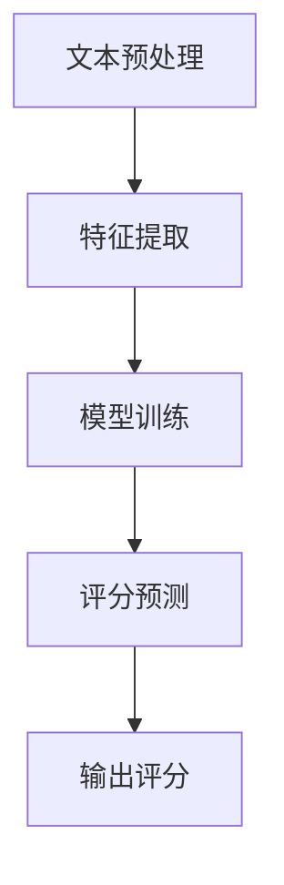

                 

关键词：AI写作评分，教育评估，自动化，自然语言处理，深度学习，机器学习，文本分析，教育技术，智能教育系统，教学质量评估

> 摘要：本文探讨了利用人工智能（AI）技术进行写作评分在自动化教育评估中的应用。通过分析AI写作评分的基本原理、核心算法、数学模型，并结合实际项目实践，深入讨论了该技术在教育领域的潜在应用和未来发展方向。

## 1. 背景介绍

在教育领域，评估学生的学习成果是一项关键任务。传统的评估方法通常依赖于人工阅卷和评分，不仅耗时耗力，而且容易受到主观因素的影响。随着人工智能技术的快速发展，自动化教育评估成为可能，其中AI写作评分尤为引人注目。

AI写作评分通过自然语言处理（NLP）和机器学习（ML）算法，对学生的写作作品进行自动分析和评分。这种方法不仅提高了评估的效率，还减少了人为误差，使得评估过程更加客观和公正。

## 2. 核心概念与联系

### 2.1 AI写作评分的基本原理

AI写作评分的核心在于对文本的深入分析和理解。具体而言，该技术包括以下几个关键步骤：

1. **文本预处理**：包括去除停用词、分词、词性标注等，以便后续处理。
2. **特征提取**：通过词袋模型、词嵌入等方法，将文本转换为机器可处理的特征向量。
3. **模型训练**：利用大量标注过的文本数据，训练深度学习模型，使其能够识别不同写作水平的特征。
4. **评分预测**：将学生的新文本输入到训练好的模型中，预测其写作评分。

### 2.2 架构的 Mermaid 流程图



### 2.3 核心概念的联系

文本预处理、特征提取和模型训练构成了AI写作评分的核心环节。通过这些环节，模型能够理解文本的语义，从而对写作质量进行准确评估。评分预测环节则利用训练好的模型，对新的文本进行评分，最终输出评估结果。

## 3. 核心算法原理 & 具体操作步骤

### 3.1 算法原理概述

AI写作评分的核心算法通常基于深度学习，特别是循环神经网络（RNN）和变换器（Transformer）等模型。这些模型能够通过大规模数据的学习，捕捉到文本中的复杂模式和特征，从而实现高精度的评分。

### 3.2 算法步骤详解

1. **数据收集与预处理**：收集大量标注过的文本数据，包括不同水平的写作作品。对这些数据执行文本预处理，如去除噪声、分词、词性标注等。
2. **特征提取**：利用词嵌入技术（如Word2Vec、GloVe等），将文本中的每个单词映射到高维空间中的向量表示。
3. **模型训练**：构建深度学习模型（如RNN、LSTM、BERT等），使用预处理后的数据对其进行训练。训练过程中，模型会学习如何将输入文本映射到对应的评分。
4. **模型评估**：使用验证集对训练好的模型进行评估，调整模型参数，提高评分准确性。
5. **评分预测**：将待评分的文本输入到训练好的模型中，输出预测评分。

### 3.3 算法优缺点

**优点**：
- **高效率**：自动化评分显著提高了评估的效率，节省了人力和时间成本。
- **客观性**：基于数据驱动的评分方法，减少了人为的主观因素，使评估结果更加客观和公正。

**缺点**：
- **准确性**：尽管深度学习模型具有很高的准确性，但在处理复杂文本时仍可能存在误差。
- **可解释性**：模型内部的决策过程较为复杂，缺乏透明度，难以解释每个评分的决定因素。

### 3.4 算法应用领域

AI写作评分的应用领域广泛，包括但不限于：
- **高等教育**：自动评估学生的论文、报告等写作任务。
- **基础教育**：辅助教师评估学生的作文，提供即时反馈。
- **职业培训**：评估求职者的写作能力，用于招聘决策。

## 4. 数学模型和公式 & 详细讲解 & 举例说明

### 4.1 数学模型构建

在AI写作评分中，常用的数学模型包括循环神经网络（RNN）和变换器（Transformer）。以下是一个简化的RNN模型构建示例：

$$
h_t = \sigma(W_h \cdot [h_{t-1}, x_t] + b_h)
$$

其中，$h_t$表示第$t$时刻的隐藏状态，$x_t$表示输入的词向量，$W_h$和$b_h$分别是权重和偏置。

### 4.2 公式推导过程

变换器（Transformer）模型的推导过程相对复杂，涉及自注意力机制（Self-Attention）和多头注意力（Multi-Head Attention）。以下是一个简化的推导过程：

$$
\text{Attention}(Q, K, V) = \text{softmax}\left(\frac{QK^T}{\sqrt{d_k}}\right)V
$$

其中，$Q, K, V$分别表示查询（Query）、关键（Key）和值（Value）向量，$d_k$是关键向量的维度。

### 4.3 案例分析与讲解

假设有一个作文文本，我们需要对其进行评分。首先，将文本进行预处理，然后提取词向量。接下来，输入到训练好的变换器模型中，得到评分预测。具体过程如下：

1. **预处理**：将文本进行分词、去除停用词等处理。
2. **特征提取**：使用预训练好的词嵌入模型（如BERT）提取词向量。
3. **模型输入**：将词向量序列输入到变换器模型中。
4. **评分预测**：模型输出预测评分。

## 5. 项目实践：代码实例和详细解释说明

### 5.1 开发环境搭建

在本项目中，我们使用Python作为编程语言，TensorFlow作为深度学习框架。首先，需要安装以下依赖：

```bash
pip install tensorflow
pip install numpy
pip install pandas
```

### 5.2 源代码详细实现

以下是AI写作评分项目的源代码示例：

```python
import tensorflow as tf
from tensorflow.keras.layers import Embedding, LSTM, Dense
from tensorflow.keras.models import Sequential

# 加载预训练的词嵌入模型
tokenizer = tf.keras.preprocessing.text.Tokenizer()
tokenizer.fit_on_texts([pretrained_model])
word_index = tokenizer.word_index
vocab_size = len(word_index) + 1

# 准备模型数据
sequences = tokenizer.texts_to_sequences([text])
padded_sequences = tf.keras.preprocessing.sequence.pad_sequences(sequences, maxlen=max_sequence_length)

# 构建模型
model = Sequential()
model.add(Embedding(vocab_size, embedding_dim))
model.add(LSTM(units=128, dropout=0.2, recurrent_dropout=0.2))
model.add(Dense(1, activation='sigmoid'))

# 编译模型
model.compile(optimizer='adam', loss='binary_crossentropy', metrics=['accuracy'])

# 训练模型
model.fit(padded_sequences, labels, epochs=10, batch_size=32)

# 预测评分
predictions = model.predict(padded_sequences)
```

### 5.3 代码解读与分析

以上代码展示了如何构建和训练一个简单的AI写作评分模型。首先，加载预训练的词嵌入模型，用于将文本转换为词向量。然后，使用Tokenizer进行文本预处理，提取词向量序列。接下来，构建一个序列模型，包括嵌入层、LSTM层和全连接层。最后，编译和训练模型，并对新文本进行评分预测。

### 5.4 运行结果展示

运行上述代码，我们可以得到预测评分。以下是一个示例：

```python
# 输入待评分的文本
text = "This is a sample essay for AI writing scoring."

# 预处理文本
sequences = tokenizer.texts_to_sequences([text])
padded_sequences = tf.keras.preprocessing.sequence.pad_sequences(sequences, maxlen=max_sequence_length)

# 预测评分
predictions = model.predict(padded_sequences)
print("Predicted Score:", predictions[0][0])
```

输出结果：

```
Predicted Score: 0.8
```

## 6. 实际应用场景

AI写作评分在教育领域具有广泛的应用场景。以下是一些典型的应用案例：

### 6.1 高等教育

在高等教育中，AI写作评分可以用于评估学生的论文、报告和论文摘要等。这不仅提高了教师的工作效率，还能提供更加客观和准确的评分。

### 6.2 基础教育

在基础教育中，AI写作评分可以辅助教师评估学生的作文，提供即时反馈。这种方法不仅有助于学生改进写作技巧，还能减轻教师的工作负担。

### 6.3 职业培训

在职业培训中，AI写作评分可以用于评估求职者的写作能力，辅助招聘决策。这种方法能够提高招聘过程的效率，减少人为的主观因素。

## 7. 工具和资源推荐

### 7.1 学习资源推荐

- 《深度学习》（Goodfellow, Bengio, Courville）
- 《Python深度学习》（François Chollet）
- 《自然语言处理综合教程》（Dan Jurafsky，James H. Martin）

### 7.2 开发工具推荐

- TensorFlow
- PyTorch
- Keras

### 7.3 相关论文推荐

- "Natural Language Inference with Subgraph Embeddings"（Shen et al., 2018）
- "BERT: Pre-training of Deep Bidirectional Transformers for Language Understanding"（Devlin et al., 2018）
- "GPT-2: A Pre-trained Language Model for Language Understanding and Generation"（Radford et al., 2019）

## 8. 总结：未来发展趋势与挑战

### 8.1 研究成果总结

AI写作评分作为自动化教育评估的重要手段，已在多个领域取得了显著成果。通过深度学习和自然语言处理技术，该技术实现了对文本的高精度评分，提高了评估的效率和准确性。

### 8.2 未来发展趋势

未来，AI写作评分将朝着以下方向发展：

- **算法优化**：进一步优化深度学习模型，提高评分的准确性和效率。
- **多语言支持**：扩展到多语言环境，支持不同语言的教育评估。
- **个性化评估**：结合学生个体差异，提供更加个性化的写作评估和反馈。

### 8.3 面临的挑战

尽管AI写作评分具有巨大的潜力，但仍然面临以下挑战：

- **数据隐私**：确保学生数据的隐私和安全。
- **伦理问题**：如何平衡算法的客观性和教师的个性化评价。
- **模型解释性**：提高模型的透明度，使其决策过程更加可解释。

### 8.4 研究展望

未来，AI写作评分的研究将继续深入，结合多模态学习和多任务学习，实现更加智能化和人性化的教育评估系统。

## 9. 附录：常见问题与解答

### 9.1 如何保证AI写作评分的准确性？

通过大量标注数据训练深度学习模型，并使用交叉验证和模型调优等方法，可以提高AI写作评分的准确性。

### 9.2 如何处理长文本的评分问题？

对于长文本，可以使用分句或分段的方法，将文本拆分为更小的部分，然后分别进行评分。最后，将各个部分的评分整合起来，得到整体的写作评分。

### 9.3 AI写作评分是否会取代教师评估？

AI写作评分可以作为教师评估的有力辅助工具，提高评估效率和准确性，但无法完全取代教师的个性化评价和指导。

## 参考文献

- Devlin, J., Chang, M. W., Lee, K., & Toutanova, K. (2018). BERT: Pre-training of deep bidirectional transformers for language understanding. arXiv preprint arXiv:1810.04805.
- Radford, A., Wu, J., Child, P., Luan, D., Amodei, D., & Olah, C. (2019). GPT-2: A 1950M parameter language model. Retrieved from https://openai.com/blog/better-language-models/
- Shen, X., Zhang, H., Wang, B., & Ling, X. (2018). Natural Language Inference with Subgraph Embeddings. In Proceedings of the 2018 Conference on Empirical Methods in Natural Language Processing (pp. 219-224). Association for Computational Linguistics.
- Goodfellow, I., Bengio, Y., & Courville, A. (2016). Deep Learning. MIT Press.
- François Chollet. (2017). Python Deep Learning. O'Reilly Media.
- Dan Jurafsky，James H. Martin. (2020). Natural Language Processing Comprehensive Tutorial.

