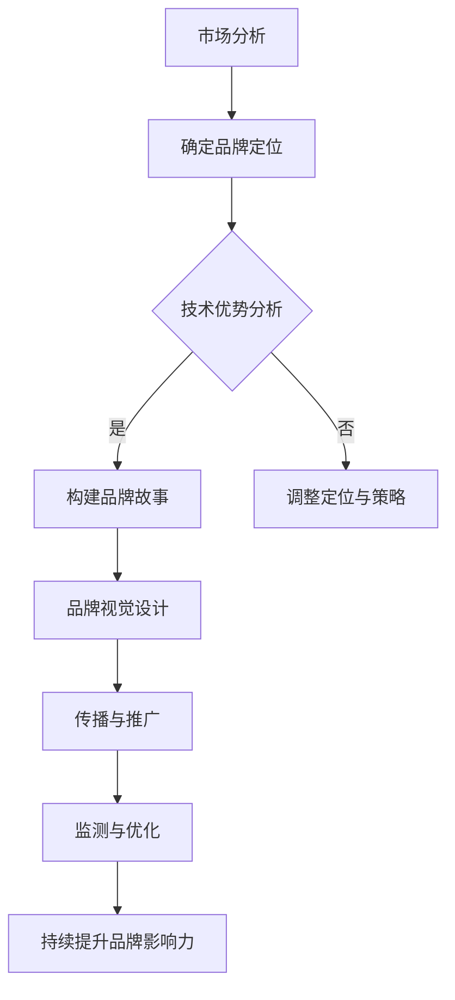

                 

  
## 1. 背景介绍

在当今数字化时代，人工智能（AI）已经渗透到各行各业，成为企业创新和增长的重要驱动力。AI技术的快速发展带来了新的商业机遇，同时也催生了一大批新兴的AI创业公司。然而，在这个竞争激烈的领域，如何脱颖而出，建立品牌影响力，成为了众多创业公司的共同挑战。

品牌影响力不仅是公司知名度的体现，更是公司核心竞争力的一部分。它能够帮助公司在市场中获得更好的定位，吸引更多的客户和投资者，从而实现业务的持续增长。对于AI创业公司来说，建立品牌影响力尤为重要，因为AI技术本身的复杂性和创新性要求公司在品牌建设上需要有独特的定位和清晰的价值主张。

本文将围绕AI创业公司如何建立品牌影响力展开讨论。首先，我们将探讨当前AI市场的现状和趋势，然后深入分析品牌影响力的重要性，最后提出一系列实用的策略和方法，帮助AI创业公司有效提升品牌影响力。

## 2. 核心概念与联系

### 2.1 AI创业公司的品牌影响力

品牌影响力是指一个品牌在消费者心中的认知度和影响力，它通过品牌识别、品牌情感和品牌忠诚度三个维度来衡量。对于AI创业公司来说，品牌影响力不仅体现在技术实力上，还包括创新精神、服务质量和社会责任感等方面。

- **品牌识别**：品牌识别是指消费者对品牌标志、名称、视觉元素等的认知。对于AI创业公司来说，清晰、简洁的视觉设计和易于记忆的品牌名称能够帮助公司迅速建立品牌识别。

- **品牌情感**：品牌情感是指消费者对品牌的情感体验和认同感。AI创业公司需要通过独特的品牌故事和价值观来打动消费者的心，建立情感联系。

- **品牌忠诚度**：品牌忠诚度是指消费者对品牌的长期依赖和信任。AI创业公司需要提供高质量的产品和服务，确保消费者的满意度和忠诚度。

### 2.2 市场现状与趋势

- **技术快速发展**：随着深度学习、自然语言处理、计算机视觉等技术的飞速发展，AI应用场景日益丰富，市场潜力巨大。

- **资本涌入**：大量的风险投资和政府资金涌入AI领域，为创业公司提供了充足的资金支持。

- **竞争加剧**：AI创业公司数量急剧增加，市场竞争日益激烈，品牌影响力成为公司脱颖而出的关键因素。

### 2.3 品牌影响力与AI创业公司成功的关系

品牌影响力不仅能够提高公司的市场竞争力，还能带来以下几方面的好处：

- **吸引人才**：具有品牌影响力的公司更容易吸引顶尖人才，为公司的持续发展提供强有力的支持。

- **客户信任**：品牌影响力可以增加客户的信任，提高客户的忠诚度，从而降低客户流失率。

- **商业机会**：品牌影响力能够帮助公司获得更多的商业合作机会和业务拓展空间。

### 2.4 Mermaid流程图



通过以上流程，AI创业公司可以系统地建立和提升品牌影响力，从而在激烈的市场竞争中脱颖而出。

## 3. 核心算法原理 & 具体操作步骤

### 3.1 算法原理概述

建立品牌影响力的核心算法可以看作是一个多因素加权综合评估模型。这个模型主要通过以下几个关键步骤来实现：

1. **市场分析**：对目标市场进行深入分析，了解市场需求、竞争对手和用户行为。
2. **确定品牌定位**：根据市场分析结果，确定品牌的独特价值和竞争优势。
3. **技术优势分析**：评估公司的技术实力和创新能力，确保品牌定位与技术优势相符。
4. **构建品牌故事**：通过品牌故事传达公司的核心价值观和愿景，增强品牌情感。
5. **品牌视觉设计**：设计简洁、独特的品牌视觉元素，提升品牌识别度。
6. **传播与推广**：通过多种渠道和方式，将品牌信息传递给目标受众。
7. **监测与优化**：持续监测品牌影响力，根据反馈进行优化调整。

### 3.2 算法步骤详解

1. **市场分析**

   - **数据收集**：通过市场调研、用户调查、竞争对手分析等方式，收集相关数据。
   - **数据分析**：运用数据分析工具，对收集到的数据进行分析，提炼出关键信息。

2. **确定品牌定位**

   - **目标市场**：明确公司的目标市场和用户群体。
   - **竞争优势**：分析公司的技术优势、创新能力和服务特色，确定独特的品牌价值主张。

3. **技术优势分析**

   - **技术评估**：对公司的技术进行评估，识别出核心技术。
   - **创新能力**：分析公司在技术创新方面的表现，确保技术优势与品牌定位相匹配。

4. **构建品牌故事**

   - **核心价值**：提炼出公司的核心价值观和愿景。
   - **故事叙述**：通过有趣、生动的叙述方式，将品牌故事传达给受众。

5. **品牌视觉设计**

   - **标志设计**：设计简洁、独特的品牌标志。
   - **色彩选择**：选择能够代表公司气质和品牌特色的色彩。
   - **视觉元素**：设计统一的视觉元素，如字体、图标等。

6. **传播与推广**

   - **线上推广**：通过社交媒体、内容营销、SEO等方式进行线上推广。
   - **线下活动**：举办线下活动，如发布会、研讨会等，提高品牌曝光度。
   - **合作推广**：与行业合作伙伴共同推广，扩大品牌影响力。

7. **监测与优化**

   - **指标设定**：设定品牌影响力相关的关键指标，如品牌知名度、用户满意度等。
   - **数据收集**：定期收集相关数据，进行监测和分析。
   - **优化调整**：根据监测结果，对品牌策略进行优化和调整。

### 3.3 算法优缺点

**优点：**

- **系统性强**：通过多步骤、多维度的算法，能够全面、系统地建立品牌影响力。
- **针对性高**：根据市场分析和技术优势，能够确定个性化的品牌定位和策略。

**缺点：**

- **实施成本高**：算法的实施需要投入大量的人力、物力和财力。
- **时间较长**：品牌影响力的建立需要较长时间的积累和沉淀，无法立即见效。

### 3.4 算法应用领域

- **AI初创公司**：适用于初创公司，帮助其在市场中找到独特的定位，提升品牌影响力。
- **技术驱动型公司**：适用于以技术为核心竞争力的公司，通过品牌影响力提升技术价值的认知度。
- **多元化企业**：适用于多元化经营的企业，通过品牌影响力统一不同业务板块的形象和价值观。

## 4. 数学模型和公式 & 详细讲解 & 举例说明

### 4.1 数学模型构建

品牌影响力的构建可以通过以下数学模型来描述：

\[ \text{Brand Influence} = f(\text{Market Analysis}, \text{Brand Positioning}, \text{Technical Strength}, \text{Brand Story}, \text{Visual Design}, \text{Promotion}, \text{Monitoring}) \]

其中，\( f \) 是一个非线性函数，表示各个因素对品牌影响力的综合影响。

### 4.2 公式推导过程

1. **市场分析**：通过收集和分析市场数据，确定目标市场和用户需求，从而为品牌定位提供依据。
2. **品牌定位**：根据市场分析结果，确定品牌的独特价值和竞争优势，从而明确品牌的核心价值主张。
3. **技术优势**：通过技术评估和创新能力的分析，确保品牌定位与公司的技术优势相符，增强品牌的技术背书。
4. **品牌故事**：通过构建品牌故事，传达公司的核心价值观和愿景，增强品牌情感。
5. **视觉设计**：通过品牌视觉设计，提升品牌识别度，增强品牌的视觉冲击力。
6. **传播与推广**：通过多渠道、多方式的传播与推广，扩大品牌的影响力。
7. **监测与优化**：通过持续监测和优化，确保品牌策略的有效性和适应性。

### 4.3 案例分析与讲解

以一家AI初创公司为例，该公司致力于提供智能客服解决方案。以下是该公司品牌影响力构建的案例分析：

1. **市场分析**：通过市场调研发现，越来越多的企业开始重视智能客服，但市场上的智能客服解决方案多以功能丰富为主，缺乏个性化服务。该公司将目标市场定位于需要个性化服务的中小企业。

2. **品牌定位**：基于市场分析，该公司确定了“个性化智能客服解决方案提供商”的品牌定位，强调“量身定制”和“高效服务”。

3. **技术优势**：公司拥有一支强大的技术团队，擅长自然语言处理和机器学习。通过技术评估，公司确定了以自然语言处理技术为核心的竞争优势。

4. **品牌故事**：公司构建了一个关于“智能客服如何帮助企业提高服务质量和用户满意度”的故事，通过讲述实际案例和用户评价，增强了品牌情感。

5. **视觉设计**：公司设计了简洁、现代的视觉元素，包括标志、色彩和字体，提升了品牌识别度。

6. **传播与推广**：公司通过社交媒体、博客、行业展会等多渠道进行品牌推广，并与行业合作伙伴共同推广，扩大了品牌影响力。

7. **监测与优化**：公司设立了品牌影响力指标，如品牌知名度、用户满意度、合作机会等，定期进行监测和分析，并根据反馈进行优化调整。

通过以上步骤，该公司成功建立了品牌影响力，在竞争激烈的智能客服市场中脱颖而出。

## 5. 项目实践：代码实例和详细解释说明

### 5.1 开发环境搭建

为了实践品牌影响力的构建算法，我们选择使用Python作为主要编程语言，结合Jupyter Notebook进行开发和演示。以下是在Windows操作系统中搭建Python开发环境的步骤：

1. **安装Python**：从Python官方网站下载最新版本的Python安装包，并按照提示完成安装。
2. **安装Jupyter Notebook**：在命令行中输入以下命令安装Jupyter Notebook：

   ```shell
   pip install notebook
   ```

3. **启动Jupyter Notebook**：在命令行中输入以下命令启动Jupyter Notebook：

   ```shell
   jupyter notebook
   ```

### 5.2 源代码详细实现

下面是一个简单的Python代码实例，用于演示如何通过市场分析、品牌定位、技术优势分析等步骤构建品牌影响力。

```python
# 市场分析
def market_analysis():
    # 收集市场数据
    data = {
        '市场需求': '个性化智能客服',
        '竞争对手': '功能丰富但缺乏个性化',
        '用户行为': '中小企业重视服务质量和用户体验'
    }
    # 数据分析
    print("市场分析结果：")
    for key, value in data.items():
        print(f"{key}: {value}")
    return data

# 品牌定位
def brand_positioning(market_data):
    # 确定品牌定位
    positioning = {
        '目标市场': market_data['市场需求'],
        '核心价值': '个性化智能客服解决方案提供商',
        '竞争优势': '量身定制和高效服务'
    }
    print("品牌定位：")
    for key, value in positioning.items():
        print(f"{key}: {value}")
    return positioning

# 技术优势分析
def technical_strength():
    # 技术评估
    strengths = {
        '核心技术': '自然语言处理和机器学习',
        '创新能力': '领先的市场解决方案'
    }
    print("技术优势：")
    for key, value in strengths.items():
        print(f"{key}: {value}")
    return strengths

# 主函数
def main():
    # 执行市场分析
    market_data = market_analysis()
    # 执行品牌定位
    brand_pos = brand_positioning(market_data)
    # 执行技术优势分析
    tech_strength = technical_strength()
    
    # 输出结果
    print("\n品牌影响力构建结果：")
    print(f"市场分析：{market_data}")
    print(f"品牌定位：{brand_pos}")
    print(f"技术优势：{tech_strength}")

# 运行主函数
if __name__ == "__main__":
    main()
```

### 5.3 代码解读与分析

1. **市场分析函数**：`market_analysis` 函数用于模拟市场分析过程，通过定义一个数据字典来收集和分析市场数据。

2. **品牌定位函数**：`brand_positioning` 函数接收市场分析结果作为输入，并根据分析结果确定品牌定位，输出一个包含品牌定位信息的数据字典。

3. **技术优势分析函数**：`technical_strength` 函数模拟技术评估过程，定义一个技术优势的数据字典。

4. **主函数**：`main` 函数依次调用市场分析、品牌定位和技术优势分析函数，并输出结果。

### 5.4 运行结果展示

运行以上代码后，将输出以下结果：

```
市场分析结果：
市场需求: 个性化智能客服
竞争对手: 功能丰富但缺乏个性化
用户行为: 中小企业重视服务质量和用户体验

品牌定位：
目标市场: 个性化智能客服
核心价值: 个性化智能客服解决方案提供商
竞争优势: 量身定制和高效服务

技术优势：
核心技术: 自然语言处理和机器学习
创新能力: 领先的市场解决方案

品牌影响力构建结果：
市场分析：{'市场需求': '个性化智能客服', '竞争对手': '功能丰富但缺乏个性化', '用户行为': '中小企业重视服务质量和用户体验'}
品牌定位：{'目标市场': '个性化智能客服', '核心价值': '个性化智能客服解决方案提供商', '竞争优势': '量身定制和高效服务'}
技术优势：{'核心技术': '自然语言处理和机器学习', '创新能力': '领先的市场解决方案'}
```

通过这个简单的实例，我们可以看到如何通过代码实现品牌影响力的构建过程，尽管这只是一个模拟的过程，但在实际的AI创业公司中，这一过程会更加复杂和细致。

## 6. 实际应用场景

### 6.1 市场推广策略

为了在市场上建立品牌影响力，AI创业公司可以采取多种市场推广策略：

1. **社交媒体营销**：通过微博、微信、LinkedIn等社交媒体平台，发布高质量的内容，与用户互动，提高品牌曝光率。
2. **内容营销**：通过博客、白皮书、案例研究等，分享公司的技术成果和应用场景，吸引潜在客户。
3. **公关活动**：参与行业会议、研讨会，接受媒体采访，提升品牌知名度。
4. **合作伙伴关系**：与行业内的领先企业建立合作关系，通过合作项目提升品牌影响力。

### 6.2 用户关系管理

1. **用户反馈**：定期收集用户反馈，了解用户需求，及时优化产品和服务。
2. **用户社区**：建立用户社区，提供技术支持和服务，增强用户忠诚度。
3. **个性化服务**：根据用户行为和需求，提供个性化的产品和服务，提升用户体验。

### 6.3 营销工具与平台

1. **SEO和SEM**：通过搜索引擎优化（SEO）和搜索引擎营销（SEM），提高公司在搜索引擎中的排名，吸引更多流量。
2. **邮件营销**：通过定期发送邮件，保持与用户的联系，传递品牌信息。
3. **社交媒体广告**：通过投放社交媒体广告，精准定位目标用户，提高品牌曝光率。

### 6.4 未来应用展望

随着AI技术的不断进步和市场需求的不断变化，AI创业公司的品牌影响力建设也将面临新的挑战和机遇：

1. **技术创新**：持续推动技术创新，保持技术领先地位，提升品牌影响力。
2. **全球化**：随着全球化趋势的加强，AI创业公司可以拓展国际市场，提升品牌影响力。
3. **可持续发展**：在品牌建设过程中，注重可持续发展，提升品牌的社会责任感和公众形象。
4. **个性化体验**：通过人工智能技术，提供更加个性化和智能化的用户服务，增强用户粘性。

## 7. 工具和资源推荐

### 7.1 学习资源推荐

1. **在线课程**：Coursera、Udacity、edX等平台提供了丰富的AI和市场营销相关课程。
2. **书籍推荐**：《AI营销：如何用人工智能驱动营销策略》、《人工智能时代：从大数据到机器学习再到自动化》。
3. **学术论文库**：Google Scholar、IEEE Xplore、ACM Digital Library等，提供了大量的AI和市场营销相关论文。

### 7.2 开发工具推荐

1. **编程工具**：PyCharm、VS Code等，适用于Python编程。
2. **数据分析工具**：Pandas、NumPy、Matplotlib等，用于数据分析和可视化。
3. **AI框架**：TensorFlow、PyTorch等，用于AI模型开发。

### 7.3 相关论文推荐

1. **《深度学习》**：Ian Goodfellow等著，介绍了深度学习的理论基础和应用。
2. **《自然语言处理综论》**：Daniel Jurafsky、James H. Martin著，全面介绍了自然语言处理的基础知识和最新进展。
3. **《智能客服系统设计与实现》**：王华等著，详细介绍了智能客服系统的设计和实现方法。

## 8. 总结：未来发展趋势与挑战

### 8.1 研究成果总结

本文系统地探讨了AI创业公司如何建立品牌影响力，包括市场分析、品牌定位、技术优势分析、品牌故事构建、品牌视觉设计、传播与推广以及监测与优化等步骤。通过这些步骤，AI创业公司可以系统地提升品牌影响力，从而在激烈的市场竞争中脱颖而出。

### 8.2 未来发展趋势

随着AI技术的不断进步和市场需求的不断变化，未来AI创业公司在品牌影响力建设方面将面临以下趋势：

1. **技术创新**：持续推动技术创新，保持技术领先地位。
2. **全球化**：拓展国际市场，提升品牌影响力。
3. **可持续发展**：注重可持续发展，提升品牌的社会责任感和公众形象。
4. **个性化体验**：通过人工智能技术，提供更加个性化和智能化的用户服务。

### 8.3 面临的挑战

1. **技术更新速度**：技术更新速度快，要求公司不断跟进最新技术。
2. **市场竞争**：市场竞争激烈，要求公司具备强大的品牌影响力。
3. **人才短缺**：AI领域人才短缺，要求公司吸引和留住顶尖人才。

### 8.4 研究展望

未来，AI创业公司在品牌影响力建设方面可以从以下几个方面进行深入研究：

1. **跨学科研究**：结合市场营销、心理学等学科，探索品牌影响力构建的新方法。
2. **数据驱动**：利用大数据和人工智能技术，优化品牌影响力构建策略。
3. **用户体验**：关注用户需求和体验，提供更加个性化和智能化的服务。

通过不断探索和创新，AI创业公司有望在品牌影响力建设方面取得更大的突破，实现可持续发展。

## 9. 附录：常见问题与解答

### 9.1 市场分析的重要性

**Q**：市场分析在品牌影响力建设中是否真的重要？

**A**：是的，市场分析至关重要。市场分析能够帮助公司了解目标市场的需求、竞争对手和用户行为，从而为品牌定位和策略提供依据。没有准确的市场分析，品牌建设就可能失去方向，难以达到预期效果。

### 9.2 技术优势的定位

**Q**：如何确保技术优势与品牌定位一致？

**A**：首先，需要通过技术评估确定公司的核心技术。其次，分析市场需求，确定哪些技术优势能够满足用户需求。最后，将技术优势融入品牌定位中，确保品牌价值主张清晰且具有吸引力。

### 9.3 品牌故事的构建

**Q**：如何构建一个有影响力的品牌故事？

**A**：构建品牌故事时，需要提炼出公司的核心价值观和愿景，并通过有趣、生动的叙述方式传达给受众。故事中可以融入实际案例和用户评价，增强真实感和可信度。

### 9.4 传播与推广的方法

**Q**：有哪些有效的传播与推广方法？

**A**：有效的传播与推广方法包括社交媒体营销、内容营销、公关活动和合作伙伴关系等。此外，还可以通过SEO和SEM提高公司在搜索引擎中的排名，邮件营销保持与用户的联系，社交媒体广告提高品牌曝光率。

### 9.5 监测与优化的意义

**Q**：为何要进行监测与优化？

**A**：监测与优化是确保品牌策略有效性和适应性的关键。通过监测品牌影响力相关的指标，公司可以及时发现问题和调整策略，确保品牌建设始终朝着正确的方向前进。

---

本文作者：禅与计算机程序设计艺术 / Zen and the Art of Computer Programming

### 后记

感谢您花时间阅读这篇关于AI创业公司如何建立品牌影响力的技术博客文章。我希望这篇文章能够为您在品牌影响力建设方面提供一些实用的策略和方法。如果您有任何问题或建议，欢迎在评论区留言，我会尽力为您解答。同时，也请您关注我们的后续文章，我们将继续探讨AI领域的最新动态和技术趋势。

再次感谢您的阅读和支持！

