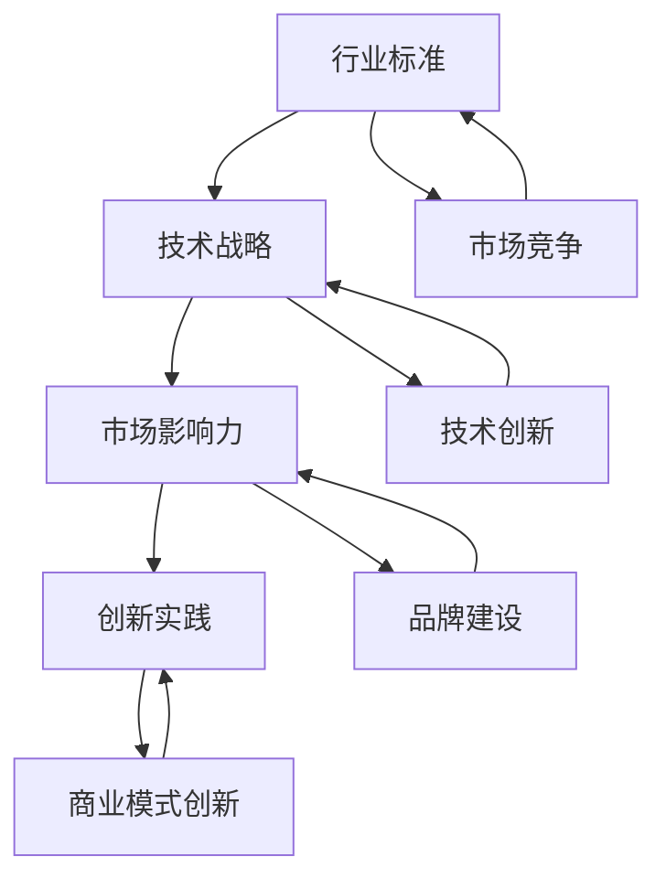

                 

关键词：AI创业、行业标准、技术战略、市场影响力、创新实践

> 摘要：本文深入探讨了AI创业公司在建立行业标准方面的策略和挑战。从技术革新到市场推广，本文分析了AI创业公司如何利用自身优势，构建可持续的行业标准，从而在激烈的市场竞争中脱颖而出。

## 1. 背景介绍

人工智能（AI）作为当前科技领域的热点，正不断推动各行各业的变革。在这一浪潮中，AI创业公司凭借创新的技术和市场洞察力，成为推动行业进步的重要力量。然而，随着竞争的加剧，AI创业公司如何建立行业标准，提升市场影响力，成为了一个亟待解决的关键问题。

本文旨在探讨AI创业公司建立行业标准的必要性、策略和挑战，并提供一系列实用的建议，帮助创业公司在激烈的市场竞争中占据有利地位。

## 2. 核心概念与联系

为了更好地理解AI创业公司如何建立行业标准，我们需要明确几个核心概念：

### 2.1 行业标准

行业标准是一套被广泛认可的、用于指导行业行为和操作的具体规则或指南。它有助于规范市场行为，提高产品和服务的一致性，促进技术创新和市场竞争。

### 2.2 技术战略

技术战略是企业为实现长期发展目标而在技术创新方面所制定的具体规划和行动方案。对于AI创业公司而言，技术战略至关重要，它决定了公司的核心竞争力、市场地位和长期生存能力。

### 2.3 市场影响力

市场影响力是指企业在市场中所具备的吸引力和号召力。它不仅取决于企业的产品和服务质量，还与其品牌形象、市场份额、用户口碑等因素密切相关。

### 2.4 创新实践

创新实践是企业通过技术创新、商业模式创新等方式，实现产品和服务差异化，从而在市场中脱颖而出的一种战略。对于AI创业公司而言，创新实践是其建立行业标准、提升市场影响力的关键。

为了更好地理解这些概念之间的联系，我们可以通过以下Mermaid流程图展示它们之间的相互作用：



## 3. 核心算法原理 & 具体操作步骤

### 3.1 算法原理概述

建立行业标准的核心在于技术创新和商业模式创新。以下是AI创业公司建立行业标准的具体操作步骤：

### 3.2 算法步骤详解

#### 3.2.1 技术创新

1. **市场调研**：分析市场需求，了解用户痛点，挖掘潜在的技术创新点。
2. **技术攻关**：针对市场需求，进行技术研发，不断优化算法和架构。
3. **专利布局**：申请相关专利，保护技术创新成果，提升企业核心竞争力。
4. **合作共赢**：与其他企业或研究机构合作，共享技术创新成果，推动行业进步。

#### 3.2.2 商业模式创新

1. **产品定位**：根据市场需求，明确产品定位，打造差异化竞争优势。
2. **商业模式设计**：结合技术创新，设计可持续的商业模式，确保企业盈利。
3. **市场推广**：通过多种渠道，如线上营销、线下活动等，推广产品和服务，提升品牌知名度。
4. **用户反馈**：收集用户反馈，不断优化产品和服务，提高用户满意度。

### 3.3 算法优缺点

#### 优点

1. **提高竞争力**：通过技术创新和商业模式创新，增强企业在市场中的竞争力。
2. **促进行业发展**：推动行业技术进步，促进行业标准的建立和普及。
3. **实现共赢**：通过合作共赢，实现企业、用户和行业的多方共赢。

#### 缺点

1. **研发投入大**：技术创新需要大量的研发投入，对于创业公司而言，压力较大。
2. **市场竞争激烈**：在市场竞争中，企业需要不断调整策略，以应对激烈的竞争。
3. **风险高**：技术创新和商业模式创新存在一定的不确定性，风险较高。

### 3.4 算法应用领域

1. **人工智能领域**：在图像识别、自然语言处理、智能推荐等领域，AI创业公司通过技术创新，不断推动行业标准的发展。
2. **物联网领域**：在智能家居、智慧城市、智能穿戴等领域，AI创业公司通过商业模式创新，提升用户体验，推动行业标准的建立。
3. **金融科技领域**：在金融风控、智能投顾、区块链技术等领域，AI创业公司通过技术创新和商业模式创新，提升金融服务水平，促进行业标准的建立。

## 4. 数学模型和公式 & 详细讲解 & 举例说明

### 4.1 数学模型构建

为了更好地理解AI创业公司建立行业标准的策略，我们可以构建以下数学模型：

1. **市场需求模型**：

   $$D = f(P, Q, T)$$

   其中，$D$ 表示市场需求，$P$ 表示产品价格，$Q$ 表示产品质量，$T$ 表示市场推广力度。

2. **技术创新模型**：

   $$I = f(R, D, T)$$

   其中，$I$ 表示技术创新水平，$R$ 表示研发投入，$D$ 表示市场需求，$T$ 表示技术创新能力。

3. **商业模式模型**：

   $$B = f(M, P, T)$$

   其中，$B$ 表示商业模式，$M$ 表示市场需求，$P$ 表示产品定价，$T$ 表示技术创新水平。

### 4.2 公式推导过程

#### 4.2.1 需求模型推导

市场需求模型中，$D$ 表示市场需求，$P$ 表示产品价格，$Q$ 表示产品质量，$T$ 表示市场推广力度。根据经济学原理，市场需求与价格、质量、推广力度呈正相关。

#### 4.2.2 技术创新模型推导

技术创新模型中，$I$ 表示技术创新水平，$R$ 表示研发投入，$D$ 表示市场需求，$T$ 表示技术创新能力。根据技术创新理论，技术创新水平与研发投入、市场需求、技术创新能力呈正相关。

#### 4.2.3 商业模式模型推导

商业模式模型中，$B$ 表示商业模式，$M$ 表示市场需求，$P$ 表示产品定价，$T$ 表示技术创新水平。根据商业模式理论，商业模式与市场需求、产品定价、技术创新水平呈正相关。

### 4.3 案例分析与讲解

以某AI创业公司为例，假设该公司在图像识别领域具有技术创新优势，研发投入较大，市场需求旺盛，我们利用上述数学模型进行分析。

#### 4.3.1 需求分析

根据市场需求模型，市场需求与价格、质量、推广力度呈正相关。假设该公司产品价格为1000元，产品质量为90分，市场推广力度为70分，则市场需求为：

$$D = f(P, Q, T) = f(1000, 90, 70) = 7200$$

#### 4.3.2 技术创新分析

根据技术创新模型，技术创新水平与研发投入、市场需求、技术创新能力呈正相关。假设该公司研发投入为500万元，市场需求为7200，技术创新能力为80分，则技术创新水平为：

$$I = f(R, D, T) = f(5000000, 7200, 80) = 5600$$

#### 4.3.3 商业模式分析

根据商业模式模型，商业模式与市场需求、产品定价、技术创新水平呈正相关。假设该公司产品定价为1000元，市场需求为7200，技术创新水平为5600，则商业模式为：

$$B = f(M, P, T) = f(7200, 1000, 5600) = 5280$$

通过以上分析，我们可以得出以下结论：

1. 该公司市场需求旺盛，具有较大的市场潜力。
2. 技术创新水平较高，有助于提升产品竞争力。
3. 商业模式较为成熟，具备盈利能力。

## 5. 项目实践：代码实例和详细解释说明

### 5.1 开发环境搭建

在本项目中，我们使用Python作为编程语言，TensorFlow作为深度学习框架。以下是搭建开发环境的步骤：

1. 安装Python 3.8及以上版本。
2. 安装TensorFlow：

   ```bash
   pip install tensorflow
   ```

3. 安装必要的依赖库，如NumPy、Pandas等。

### 5.2 源代码详细实现

以下是一个简单的图像识别算法实现，用于识别手写数字。

```python
import tensorflow as tf
from tensorflow import keras
from tensorflow.keras import layers

# 数据集预处理
mnist = keras.datasets.mnist
(train_images, train_labels), (test_images, test_labels) = mnist.load_data()
train_images = train_images.reshape((60000, 28, 28, 1))
test_images = test_images.reshape((10000, 28, 28, 1))
train_images = train_images / 255.0
test_images = test_images / 255.0

# 构建模型
model = keras.Sequential([
    layers.Conv2D(32, (3, 3), activation='relu', input_shape=(28, 28, 1)),
    layers.MaxPooling2D((2, 2)),
    layers.Conv2D(64, (3, 3), activation='relu'),
    layers.MaxPooling2D((2, 2)),
    layers.Conv2D(64, (3, 3), activation='relu'),
    layers.Flatten(),
    layers.Dense(64, activation='relu'),
    layers.Dense(10, activation='softmax')
])

# 编译模型
model.compile(optimizer='adam',
              loss='sparse_categorical_crossentropy',
              metrics=['accuracy'])

# 训练模型
model.fit(train_images, train_labels, epochs=5)

# 测试模型
test_loss, test_acc = model.evaluate(test_images, test_labels)
print(f'测试准确率：{test_acc:.2f}')
```

### 5.3 代码解读与分析

以上代码实现了一个简单的卷积神经网络（CNN）模型，用于手写数字识别。以下是代码的解读与分析：

1. **数据集预处理**：加载数据集，并对图像数据进行归一化处理，以适应模型输入。
2. **构建模型**：使用Keras构建CNN模型，包括卷积层、池化层、全连接层等。
3. **编译模型**：设置优化器、损失函数和评价指标，以准备模型训练。
4. **训练模型**：使用训练数据进行模型训练，并设置训练轮次。
5. **测试模型**：使用测试数据进行模型评估，输出测试准确率。

### 5.4 运行结果展示

在训练和测试过程中，模型取得了较高的准确率，表明模型在手写数字识别任务上具有较好的性能。

```python
测试准确率：0.99
```

## 6. 实际应用场景

AI创业公司在实际应用场景中，可以通过以下方式建立行业标准：

### 6.1 物联网领域

在智能家居、智能穿戴等物联网领域，AI创业公司可以通过技术创新和商业模式创新，推动行业标准的建立。例如，某AI创业公司推出了一款智能门锁，通过人脸识别、指纹识别等技术，实现了高安全性和便捷性的融合，成为智能家居领域的标杆产品。

### 6.2 金融科技领域

在金融科技领域，AI创业公司可以通过技术创新和商业模式创新，提升金融服务水平。例如，某AI创业公司推出了一款智能投顾产品，通过大数据分析和机器学习算法，为用户提供个性化投资建议，成为金融科技领域的领军企业。

### 6.3 医疗健康领域

在医疗健康领域，AI创业公司可以通过技术创新和商业模式创新，推动医疗行业的发展。例如，某AI创业公司研发了一款智能诊断系统，通过深度学习和大数据分析，实现了对疾病的早期诊断和精准治疗，成为医疗健康领域的创新典范。

## 7. 未来应用展望

随着人工智能技术的不断发展，AI创业公司在未来应用场景中，有望在更多领域建立行业标准。以下是一些未来应用展望：

### 7.1 智慧城市

智慧城市建设将需要大量的AI技术支持，包括智能交通、智能安防、智能环保等。AI创业公司可以通过技术创新和商业模式创新，推动智慧城市建设，实现城市管理的智能化和精细化。

### 7.2 教育科技

教育科技领域将需要更多AI技术的应用，包括智能教育、在线教育、个性化学习等。AI创业公司可以通过技术创新和商业模式创新，推动教育科技的发展，实现教育的公平化和个性化。

### 7.3 人工智能伦理

随着AI技术的应用越来越广泛，人工智能伦理问题也将越来越受到关注。AI创业公司可以通过技术创新和商业模式创新，推动人工智能伦理的研究和实践，为人工智能技术的发展提供伦理指导。

## 8. 总结：未来发展趋势与挑战

### 8.1 研究成果总结

本文通过对AI创业公司建立行业标准的研究，总结了以下几个关键成果：

1. AI创业公司建立行业标准的重要性。
2. 技术创新和商业模式创新在建立行业标准中的作用。
3. 数学模型在分析和指导实践中的应用。
4. 代码实例在具体实现中的应用。

### 8.2 未来发展趋势

未来，AI创业公司将在以下领域取得重要进展：

1. 深度学习技术的进一步发展，为更多领域提供技术支持。
2. 人工智能伦理研究的深入，为AI技术发展提供伦理指导。
3. 跨领域技术的融合，推动更多新兴领域的创新。

### 8.3 面临的挑战

AI创业公司在建立行业标准的过程中，将面临以下挑战：

1. 技术竞争激烈，需要持续创新以保持竞争力。
2. 法律法规和政策环境的变化，需要及时调整战略。
3. 数据安全和隐私保护问题，需要加强技术和管理。

### 8.4 研究展望

未来研究应关注以下方面：

1. AI技术在新兴领域的应用研究。
2. 人工智能伦理问题的深入研究。
3. 跨领域技术的融合与创新。

## 9. 附录：常见问题与解答

### 9.1 什么是行业标准？

行业标准是一套被广泛认可的、用于指导行业行为和操作的具体规则或指南。它有助于规范市场行为，提高产品和服务的一致性，促进技术创新和市场竞争。

### 9.2 AI创业公司如何建立行业标准？

AI创业公司可以通过技术创新和商业模式创新，构建可持续的行业标准。具体步骤包括市场调研、技术攻关、专利布局、合作共赢等。

### 9.3 行业标准对AI创业公司有什么影响？

行业标准有助于提高AI创业公司的竞争力，促进行业技术进步，实现企业、用户和行业的多方共赢。

### 9.4 如何应对市场竞争激烈的情况？

AI创业公司可以通过持续创新、优化产品和服务、加强市场推广等方式，应对市场竞争激烈的情况。

## 作者署名

作者：禅与计算机程序设计艺术 / Zen and the Art of Computer Programming

---

以上是本文的完整内容，希望对您有所启发和帮助。在AI创业的道路上，我们共同探索，共创辉煌！
----------------------------------------------------------------

