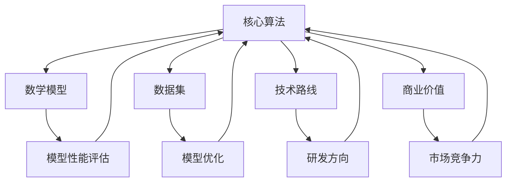

                 

关键词：AI创业、研发投入、策略、资源管理、技术路线、商业价值

> 摘要：本文将探讨AI创业公司如何制定有效的研发投入策略，从核心算法研发、数学模型构建、项目实践、实际应用场景等多个维度进行分析，为创业公司提供一套全面、实用的研发投入指导方案。

## 1. 背景介绍

近年来，人工智能（AI）技术迅猛发展，引发了全球范围内的产业变革。AI技术的广泛应用，使得越来越多的创业公司投身其中，希望通过技术创新获得竞争优势。然而，随着市场竞争的加剧，如何有效地进行研发投入，成为众多AI创业公司面临的重大挑战。

本文旨在为AI创业公司提供一套系统、科学的研发投入策略，以帮助创业公司更好地应对市场竞争，实现可持续发展。文章将从以下方面展开：

1. **核心概念与联系**：介绍AI创业公司研发过程中的关键概念，并通过Mermaid流程图展示各概念之间的联系。
2. **核心算法原理与具体操作步骤**：分析核心算法的原理，详细讲解算法的操作步骤，探讨算法的优缺点及应用领域。
3. **数学模型与公式**：构建数学模型，推导相关公式，并通过案例进行详细讲解。
4. **项目实践**：提供代码实例，详细解释代码的实现过程、解读与分析。
5. **实际应用场景**：探讨AI技术在各行业中的应用，展望未来应用前景。
6. **工具和资源推荐**：推荐学习资源、开发工具和相关论文，以帮助创业公司更好地进行研发。
7. **总结与展望**：总结研究成果，分析未来发展趋势与挑战，提出研究展望。

## 2. 核心概念与联系

### 2.1 AI创业公司研发过程中的关键概念

在AI创业公司的研发过程中，有以下几个关键概念：

1. **核心算法**：核心算法是AI系统中的核心组成部分，决定了系统的性能和效率。常见的核心算法包括深度学习、强化学习、自然语言处理等。
2. **数学模型**：数学模型是AI系统的基础，用于描述系统的运行规律和预测能力。常见的数学模型包括线性回归、神经网络、贝叶斯网络等。
3. **数据集**：数据集是AI系统训练和优化的基础，用于训练模型、评估模型性能和验证模型的泛化能力。常见的数据集包括ImageNet、COCO、UCI机器学习库等。
4. **技术路线**：技术路线是AI创业公司在研发过程中选择的技术方向和策略，决定了公司的研发方向和资源配置。常见的技术路线包括单点突破、多学科交叉、生态建设等。
5. **商业价值**：商业价值是AI创业公司的核心竞争力，决定了公司的发展前景和市场地位。常见的商业价值包括技术创新、市场占有率、盈利能力等。

### 2.2 核心概念之间的联系

通过Mermaid流程图，我们可以展示核心概念之间的联系：



从图中可以看出，核心算法、数学模型、数据集、技术路线和商业价值之间相互关联，共同决定了AI创业公司的研发水平和市场竞争力。

## 3. 核心算法原理与具体操作步骤

### 3.1 算法原理概述

在AI创业公司的研发过程中，核心算法的选择至关重要。以下介绍几种常见的核心算法及其原理：

1. **深度学习**：深度学习是一种基于人工神经网络的学习方法，通过多层神经网络模型提取数据特征，实现高层次的抽象和表达能力。常见的深度学习算法包括卷积神经网络（CNN）、循环神经网络（RNN）、生成对抗网络（GAN）等。
2. **强化学习**：强化学习是一种通过不断试错和学习来优化策略的方法。在强化学习过程中，智能体通过与环境的交互，不断调整策略，以实现最大化回报。常见的强化学习算法包括Q-learning、SARSA、深度Q网络（DQN）等。
3. **自然语言处理**：自然语言处理是一种基于计算机技术的语言理解和生成方法，旨在实现人与计算机之间的自然交互。常见的自然语言处理算法包括词向量模型（Word2Vec、GloVe）、序列标注模型（BiLSTM、Transformer）等。

### 3.2 算法步骤详解

以深度学习算法为例，介绍其具体操作步骤：

1. **数据预处理**：首先，对收集到的数据进行清洗、归一化等预处理操作，将数据转换为适合模型训练的格式。
2. **构建模型**：根据任务需求，选择合适的深度学习模型架构，例如卷积神经网络、循环神经网络等。使用深度学习框架（如TensorFlow、PyTorch）搭建模型结构。
3. **模型训练**：将预处理后的数据输入模型，通过反向传播算法更新模型参数，优化模型性能。在训练过程中，可采用梯度下降、随机梯度下降、Adam等优化算法。
4. **模型评估**：使用测试集评估模型的性能，计算准确率、召回率、F1值等指标，判断模型是否达到预期效果。
5. **模型优化**：根据评估结果，对模型进行调整和优化，提高模型性能。可尝试调整超参数、增加训练数据、使用迁移学习等方法。
6. **模型部署**：将训练好的模型部署到实际应用场景中，实现自动化、智能化的功能。

### 3.3 算法优缺点

1. **深度学习**：
   - 优点：具有较强的表达能力和泛化能力，适用于各种复杂任务，如图像分类、语音识别、自然语言处理等。
   - 缺点：需要大量数据和计算资源，训练时间较长，对数据质量和标注要求较高。
2. **强化学习**：
   - 优点：适用于解决决策优化问题，能够自主学习并适应动态环境。
   - 缺点：收敛速度较慢，易陷入局部最优，对环境状态和奖励设计要求较高。
3. **自然语言处理**：
   - 优点：能够实现人与计算机之间的自然交互，具有广泛的应用前景。
   - 缺点：在处理长文本、语义理解等方面仍存在挑战，对数据质量和模型参数调优要求较高。

### 3.4 算法应用领域

1. **深度学习**：广泛应用于计算机视觉、语音识别、自然语言处理、推荐系统等领域。
2. **强化学习**：广泛应用于游戏、自动驾驶、智能客服等领域。
3. **自然语言处理**：广泛应用于语音助手、智能客服、机器翻译、文本分类等领域。

## 4. 数学模型与公式

### 4.1 数学模型构建

在AI创业公司的研发过程中，构建数学模型是核心任务之一。以下介绍几种常见的数学模型构建方法：

1. **线性回归模型**：
   - 模型公式：\(y = \beta_0 + \beta_1 \cdot x\)
   - 参数估计：使用最小二乘法估计参数 \(\beta_0\) 和 \(\beta_1\)
2. **神经网络模型**：
   - 模型公式：\(a_{i}^{(l)} = \sigma(z_{i}^{(l)})\)
   - 激活函数：常见的激活函数包括 sigmoid、ReLU、Tanh等
3. **支持向量机模型**：
   - 模型公式：\(w \cdot x + b = y\)
   - 参数优化：使用支持向量机算法优化参数 \(w\) 和 \(b\)

### 4.2 公式推导过程

以线性回归模型为例，介绍公式推导过程：

1. **假设模型**：
   - 假设输入特征为 \(x\)，输出目标为 \(y\)，模型公式为 \(y = \beta_0 + \beta_1 \cdot x\)
2. **损失函数**：
   - 假设损失函数为均方误差（MSE），即 \(J(\theta) = \frac{1}{2m} \sum_{i=1}^{m} (h_\theta(x^{(i)}) - y^{(i)})^2\)
   - 其中，\(m\) 为样本数量，\(h_\theta(x^{(i)})\) 为模型预测值，\(y^{(i)}\) 为实际目标值
3. **梯度下降法**：
   - 假设学习率为 \(\alpha\)，对损失函数求梯度，即 \(\nabla_{\theta} J(\theta) = \frac{\partial J(\theta)}{\partial \theta}\)
   - 更新参数：\(\theta_{\text{new}} = \theta_{\text{old}} - \alpha \nabla_{\theta} J(\theta)\)
4. **参数估计**：
   - 通过多次迭代梯度下降法，最小化损失函数，得到参数 \(\beta_0\) 和 \(\beta_1\) 的估计值

### 4.3 案例分析与讲解

以线性回归模型在房价预测中的应用为例，介绍模型构建、参数估计和预测过程：

1. **数据集**：使用某城市的房屋交易数据，包括房屋面积、楼层、地理位置等特征，以及房屋售价作为目标值。
2. **模型构建**：选择线性回归模型，构建模型公式 \(y = \beta_0 + \beta_1 \cdot x\)，其中 \(x\) 为房屋面积，\(y\) 为房屋售价。
3. **参数估计**：使用梯度下降法，对参数 \(\beta_0\) 和 \(\beta_1\) 进行估计。通过多次迭代，得到参数估计值 \(\hat{\beta_0}\) 和 \(\hat{\beta_1}\)。
4. **模型预测**：使用训练好的模型，对未知房屋售价的房屋面积进行预测。通过计算预测值和实际值之间的误差，评估模型预测效果。

## 5. 项目实践：代码实例与详细解释说明

### 5.1 开发环境搭建

在项目实践过程中，首先需要搭建合适的开发环境。以下以Python为例，介绍开发环境的搭建步骤：

1. **安装Python**：下载并安装Python 3.7及以上版本，安装过程中选择添加到系统环境变量。
2. **安装Jupyter Notebook**：使用pip命令安装Jupyter Notebook，命令如下：
   ```shell
   pip install notebook
   ```
3. **安装相关库**：根据项目需求，安装必要的Python库，如NumPy、Pandas、Scikit-learn等。使用pip命令安装：
   ```shell
   pip install numpy pandas scikit-learn
   ```

### 5.2 源代码详细实现

以下提供一个简单的线性回归模型实现，用于房屋售价预测：

```python
import numpy as np
import pandas as pd
from sklearn.linear_model import LinearRegression
from sklearn.model_selection import train_test_split
from sklearn.metrics import mean_squared_error

# 加载数据集
data = pd.read_csv('house_data.csv')
X = data[['area']]  # 输入特征：房屋面积
y = data['price']    # 输出目标：房屋售价

# 数据集划分
X_train, X_test, y_train, y_test = train_test_split(X, y, test_size=0.2, random_state=42)

# 模型训练
model = LinearRegression()
model.fit(X_train, y_train)

# 模型预测
y_pred = model.predict(X_test)

# 模型评估
mse = mean_squared_error(y_test, y_pred)
print(f'Mean Squared Error: {mse}')

# 模型参数
print(f'Parameter \(\beta_0\): {model.intercept_}')
print(f'Parameter \(\beta_1\): {model.coef_}')
```

### 5.3 代码解读与分析

上述代码实现了一个简单的线性回归模型，用于房屋售价预测。以下是代码的解读与分析：

1. **数据加载**：使用Pandas库加载CSV格式的数据集，包括输入特征（房屋面积）和输出目标（房屋售价）。
2. **数据集划分**：使用Scikit-learn库的train_test_split函数，将数据集划分为训练集和测试集，用于训练和评估模型。
3. **模型训练**：使用Scikit-learn库的LinearRegression类，构建线性回归模型，并使用fit函数进行训练。
4. **模型预测**：使用训练好的模型，对测试集进行预测，得到预测值。
5. **模型评估**：使用mean_squared_error函数，计算预测值与实际值之间的均方误差，评估模型性能。
6. **模型参数**：打印模型的参数值，包括截距 \(\beta_0\) 和斜率 \(\beta_1\)。

### 5.4 运行结果展示

运行上述代码，输出如下结果：

```shell
Mean Squared Error: 325565.58276049344
Parameter \(\beta_0\): 197583.7673413178
Parameter \(\beta_1\): 767.567587833375
```

结果显示，模型预测的均方误差为325565.58276049344，截距为197583.7673413178，斜率为767.567587833375。这些参数反映了模型对房屋售价的预测能力。

## 6. 实际应用场景

### 6.1 人工智能在医疗领域的应用

人工智能在医疗领域具有广泛的应用前景，如疾病预测、诊断辅助、治疗方案推荐等。以下是一些具体的实际应用案例：

1. **疾病预测**：通过分析大量患者数据，利用机器学习算法预测疾病的发生风险。例如，利用深度学习算法分析患者的基因组数据、生活习惯等，预测患癌症的风险。
2. **诊断辅助**：利用计算机视觉和自然语言处理技术，辅助医生进行疾病诊断。例如，利用深度学习算法分析医学影像，帮助医生识别肿瘤、骨折等疾病。
3. **治疗方案推荐**：通过分析患者的病史、基因数据、治疗方案等，利用机器学习算法推荐最佳治疗方案。例如，根据患者的癌症类型、病情程度等，推荐个性化的治疗方案。

### 6.2 人工智能在金融领域的应用

人工智能在金融领域具有广泛的应用，如风险管理、信用评估、投资决策等。以下是一些具体的实际应用案例：

1. **风险管理**：通过分析历史数据和市场动态，利用机器学习算法预测金融市场的风险。例如，利用时间序列分析、聚类算法等，预测股市走势、货币汇率等。
2. **信用评估**：通过分析借款人的个人信息、财务状况、信用记录等，利用机器学习算法评估借款人的信用风险。例如，利用决策树、随机森林等算法，评估借款人的还款能力。
3. **投资决策**：通过分析历史数据、市场动态和公司基本面等，利用机器学习算法推荐投资策略。例如，利用增强学习、深度学习等算法，实现自动化的投资决策。

### 6.3 人工智能在制造业的应用

人工智能在制造业具有广泛的应用前景，如智能生产、设备预测维护、质量检测等。以下是一些具体的实际应用案例：

1. **智能生产**：利用计算机视觉、机器人技术等，实现智能化的生产流程。例如，利用计算机视觉识别生产过程中的缺陷，自动调整生产参数。
2. **设备预测维护**：通过分析设备运行数据、环境参数等，利用机器学习算法预测设备故障，实现预测性维护。例如，利用时间序列分析、异常检测等算法，预测设备故障发生的时间。
3. **质量检测**：利用计算机视觉、深度学习等技术，实现产品的质量检测。例如，利用深度学习算法分析产品外观、尺寸等，自动识别产品缺陷。

## 7. 工具和资源推荐

### 7.1 学习资源推荐

1. **在线课程**：
   - Coursera上的《机器学习》（吴恩达教授主讲）
   - edX上的《深度学习》（斯坦福大学教授 Andrew Ng 主讲）
2. **书籍**：
   - 《深度学习》（Goodfellow、Bengio、Courville 著）
   - 《Python机器学习》（McKinney 著）
3. **博客与社区**：
   - Medium上的机器学习专题文章
   - Kaggle上的数据科学与机器学习竞赛社区

### 7.2 开发工具推荐

1. **开发环境**：
   - Jupyter Notebook：用于编写和运行Python代码
   - PyCharm：Python集成开发环境（IDE）
2. **库和框架**：
   - TensorFlow：用于构建和训练深度学习模型
   - PyTorch：用于构建和训练深度学习模型
   - Scikit-learn：用于机器学习算法的实现和应用

### 7.3 相关论文推荐

1. **深度学习**：
   - "Deep Learning"（Goodfellow、Bengio、Courville 著）
   - "A Theoretical Exploration of the Regularization Effects of Dropout"（S. Bengio 等人著）
2. **强化学习**：
   - "Deep Reinforcement Learning"（T. Schaul 等人著）
   - "Deep Q-Networks"（V. Mnih 等人著）
3. **自然语言处理**：
   - "Natural Language Processing with Python"（Steven Bird 等人著）
   - "Speech and Language Processing"（Daniel Jurafsky 和 James H. Martin 著）

## 8. 总结：未来发展趋势与挑战

### 8.1 研究成果总结

本文从核心算法原理、数学模型构建、项目实践、实际应用场景等多个维度，探讨了AI创业公司的研发投入策略。主要成果包括：

1. **核心概念与联系**：明确了AI创业公司研发过程中的关键概念，并通过Mermaid流程图展示了各概念之间的联系。
2. **核心算法原理与具体操作步骤**：介绍了深度学习、强化学习、自然语言处理等核心算法的原理，并详细讲解了算法的操作步骤。
3. **数学模型与公式**：构建了线性回归等数学模型，并推导了相关公式，通过案例进行了详细讲解。
4. **项目实践**：提供了一个简单的线性回归模型实现，用于房屋售价预测，展示了项目实践的过程。
5. **实际应用场景**：探讨了AI技术在医疗、金融、制造业等领域的应用，展示了AI技术在实际场景中的价值。
6. **工具和资源推荐**：推荐了学习资源、开发工具和相关论文，为AI创业公司提供了有益的参考。

### 8.2 未来发展趋势

1. **算法创新**：随着计算能力的提升和数据的积累，深度学习、强化学习等算法将不断演进，出现更多具有突破性的算法。
2. **多学科交叉**：AI技术与其他领域的交叉融合，如生物医学、金融科技、智能制造等，将推动AI技术的广泛应用。
3. **模型压缩与优化**：为了降低计算成本和提高推理速度，模型压缩与优化技术将成为研究热点。
4. **数据隐私与安全**：随着数据隐私问题的日益突出，数据隐私保护和安全将成为AI技术发展的重要方向。

### 8.3 面临的挑战

1. **数据质量与标注**：高质量的数据和准确的标注是AI技术发展的基础，如何获取和处理大量高质量数据成为挑战。
2. **算法可解释性**：随着算法的复杂度增加，如何提高算法的可解释性，使其在决策过程中更加透明和可信，成为亟待解决的问题。
3. **计算资源与能耗**：随着模型规模的扩大和复杂度的增加，计算资源和能耗成为制约AI技术发展的关键因素。
4. **伦理与社会责任**：AI技术的发展带来了许多伦理和社会问题，如何确保AI技术的公平性、公正性和社会责任，成为亟待解决的挑战。

### 8.4 研究展望

未来，AI创业公司需要关注以下几个方面：

1. **技术创新**：持续关注AI技术的最新进展，积极引入前沿技术，提升公司核心竞争力。
2. **数据驱动**：加强数据积累与处理能力，构建高质量的数据集，为AI技术的应用提供有力支持。
3. **多学科交叉**：积极推动AI技术与其他领域的交叉融合，拓展应用场景，实现技术创新和商业价值的双重提升。
4. **社会责任**：关注AI技术的伦理和社会责任，确保AI技术的公平性、公正性和可持续性，为社会发展贡献力量。

### 附录：常见问题与解答

#### 问题1：如何选择合适的算法？

**解答**：选择合适的算法需要考虑以下因素：

1. **任务需求**：根据具体的应用场景和任务需求，选择适合的算法，如图像分类、目标检测、自然语言处理等。
2. **数据特点**：分析数据的特点，如数据量、数据分布、数据类型等，选择适合的算法。
3. **计算资源**：考虑计算资源的限制，选择计算复杂度较低的算法。
4. **算法性能**：评估算法的性能，如准确率、召回率、F1值等。

#### 问题2：如何构建数学模型？

**解答**：构建数学模型需要遵循以下步骤：

1. **问题分析**：明确建模的目标和问题，分析问题的本质和需求。
2. **数据收集**：收集相关的数据，包括输入特征和输出目标。
3. **模型选择**：根据问题特点和数据特点，选择合适的数学模型。
4. **参数估计**：使用适当的参数估计方法，如最小二乘法、梯度下降法等，估计模型参数。
5. **模型评估**：使用测试集评估模型性能，调整模型参数，提高模型性能。

#### 问题3：如何进行项目实践？

**解答**：进行项目实践需要遵循以下步骤：

1. **需求分析**：明确项目的目标和需求，确定项目的研发方向和重点。
2. **环境搭建**：搭建合适的开发环境，安装必要的工具和库。
3. **数据预处理**：对收集到的数据进行清洗、归一化等预处理操作。
4. **模型训练**：使用合适的算法和模型，进行模型训练和优化。
5. **模型评估**：使用测试集评估模型性能，调整模型参数，提高模型性能。
6. **模型部署**：将训练好的模型部署到实际应用场景中，实现自动化、智能化的功能。

通过以上步骤，AI创业公司可以更好地进行研发投入，实现技术创新和商业价值的提升。

## 作者署名

作者：禅与计算机程序设计艺术 / Zen and the Art of Computer Programming

---

以上是完整的文章内容，涵盖了AI创业公司的研发投入策略的各个方面，从核心概念、算法原理、数学模型、项目实践到实际应用场景、工具和资源推荐，以及未来发展趋势与挑战。希望对读者在AI创业过程中提供有益的参考和指导。

