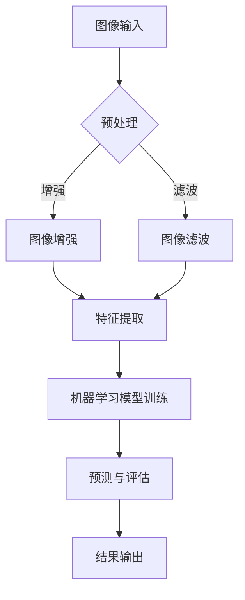

                 

关键词：AI创业，Lepton AI，成功因素，经验分享，技术领导力，市场策略

> 摘要：本文将深入探讨AI创业领域的关键成功因素，结合Lepton AI的成功经验，解析如何通过技术创新、团队建设、市场定位等多方面来实现AI创业的持续成功。

## 1. 背景介绍

近年来，随着人工智能技术的飞速发展，AI创业成为了科技领域的一大热点。众多初创公司纷纷涌现，试图通过创新技术改变世界。在这个竞争激烈的环境中，如何确保创业的成功成为了一个关键问题。本文将结合Lepton AI的成功经验，探讨AI创业的关键成功因素，为创业者提供一些实用的指导和建议。

### Lepton AI简介

Lepton AI是一家专注于计算机视觉领域的AI初创公司，成立于2015年。公司致力于研发先进的图像识别技术，旨在帮助企业和开发者更高效地处理图像数据。凭借其强大的技术实力和市场洞察力，Lepton AI在短时间内获得了广泛关注，并成功吸引了一系列投资。

### AI创业的挑战与机遇

AI创业面临着一系列挑战，包括技术门槛、资金压力、市场竞争等。同时，AI技术的高成长性和广阔的市场前景也为其带来了巨大的机遇。如何在挑战中抓住机遇，实现创业成功，是所有AI创业者共同面临的问题。

## 2. 核心概念与联系

在AI创业中，技术创新是关键驱动力。Lepton AI的成功很大程度上得益于其对计算机视觉技术的深入理解和持续创新。

### 2.1. 计算机视觉技术

计算机视觉技术是人工智能的一个重要分支，旨在使计算机能够理解和解释视觉信息。计算机视觉技术包括图像识别、目标检测、图像分类等。

### 2.2. 图像识别

图像识别是计算机视觉的核心技术之一，它通过算法对图像中的物体、场景等进行识别和分类。图像识别技术广泛应用于安防监控、医疗诊断、自动驾驶等领域。

### 2.3. 目标检测

目标检测是图像识别的一种高级形式，它不仅识别图像中的物体，还能定位这些物体的具体位置。目标检测技术广泛应用于自动驾驶、无人机监控等领域。

### 2.4. 图像分类

图像分类是一种将图像按其内容进行分类的技术。图像分类技术广泛应用于社交媒体内容审核、图像搜索引擎等领域。

### 2.5. Mermaid流程图

以下是Lepton AI在计算机视觉技术方面的Mermaid流程图：



## 3. 核心算法原理 & 具体操作步骤

### 3.1. 算法原理概述

Lepton AI的核心算法是基于深度学习的图像识别技术。深度学习是一种基于多层神经网络的机器学习技术，能够通过学习大量数据来提取特征并做出预测。

### 3.2. 算法步骤详解

#### 3.2.1. 数据预处理

数据预处理是深度学习模型训练的第一步，主要包括数据清洗、数据增强和数据归一化。数据清洗旨在去除数据中的噪声和异常值，数据增强通过变换和扩充数据来提高模型的泛化能力，数据归一化则将数据缩放到一个统一的范围内。

#### 3.2.2. 特征提取

特征提取是深度学习模型的核心步骤，通过多层神经网络对输入数据进行处理，提取出具有代表性的特征。这些特征将用于后续的机器学习模型训练。

#### 3.2.3. 机器学习模型训练

在特征提取的基础上，Lepton AI使用训练有素的神经网络对图像进行分类。训练过程包括前向传播、反向传播和梯度下降等步骤。通过不断调整网络参数，模型将逐渐提高分类准确率。

#### 3.2.4. 预测与评估

训练好的模型可以对新图像进行预测，并评估预测结果的准确率。Lepton AI采用交叉验证、混淆矩阵等评估指标来衡量模型的性能。

### 3.3. 算法优缺点

#### 优点

- **强大的特征提取能力**：深度学习模型能够自动提取高层次的图像特征，提高了模型的泛化能力。
- **自适应性强**：模型可以根据不同的应用场景进行调整和优化。
- **高效的处理速度**：深度学习模型在GPU等硬件加速的支持下，能够实现快速处理。

#### 缺点

- **对数据质量要求高**：深度学习模型的训练需要大量的高质量数据，数据质量和数量直接影响模型的性能。
- **计算资源需求大**：深度学习模型训练需要大量的计算资源和时间。

### 3.4. 算法应用领域

Lepton AI的图像识别算法广泛应用于多个领域，包括：

- **安防监控**：通过识别视频中的异常行为，提高监控系统的预警能力。
- **医疗诊断**：辅助医生进行疾病诊断，提高诊断准确率。
- **自动驾驶**：识别道路上的交通标志、行人等，提高自动驾驶的安全性。

## 4. 数学模型和公式 & 详细讲解 & 举例说明

### 4.1. 数学模型构建

深度学习模型的核心是多层神经网络，其数学基础包括线性代数、概率论和优化理论。以下是一个简化的多层神经网络模型：

$$
Z = \sigma(W \cdot X + b)
$$

其中，$X$ 是输入向量，$W$ 是权重矩阵，$b$ 是偏置项，$\sigma$ 是激活函数。

### 4.2. 公式推导过程

#### 前向传播

在前向传播过程中，神经网络从输入层开始，逐层计算每个神经元的输出：

$$
a^{(l)} = \sigma(W^{(l)} \cdot a^{(l-1)} + b^{(l)})
$$

其中，$a^{(l)}$ 是第$l$层的输出，$W^{(l)}$ 和 $b^{(l)}$ 分别是第$l$层的权重和偏置。

#### 反向传播

在反向传播过程中，神经网络通过计算每个权重的梯度，来更新网络参数。具体步骤如下：

$$
\begin{aligned}
\delta^{(l)} &= \frac{\partial L}{\partial z^{(l)}} \cdot \sigma'(z^{(l)}) \\
dW^{(l)} &= a^{(l-1)} \cdot \delta^{(l)} \\
db^{(l)} &= \delta^{(l)}
\end{aligned}
$$

其中，$L$ 是损失函数，$\sigma'$ 是激活函数的导数。

### 4.3. 案例分析与讲解

以下是一个简单的图像分类案例，假设我们使用一个多层感知机（MLP）模型对图像进行分类。

#### 案例背景

我们有一个包含10类图像的数据集，使用一个3层的MLP模型进行分类。输入层有784个神经元，对应于图像的像素值；隐藏层有100个神经元；输出层有10个神经元，对应于10类图像。

#### 模型训练

使用梯度下降算法对模型进行训练，损失函数使用交叉熵损失函数。训练过程中，我们通过不断调整权重和偏置，使得模型能够正确分类图像。

#### 模型评估

训练完成后，我们对模型进行评估，使用测试集上的准确率作为评价指标。假设测试集上的准确率为95%，说明模型具有良好的分类性能。

## 5. 项目实践：代码实例和详细解释说明

### 5.1. 开发环境搭建

为了实现深度学习模型，我们需要搭建一个开发环境。以下是搭建环境的步骤：

1. 安装Python环境，版本要求为3.7及以上。
2. 安装TensorFlow，使用以下命令：
   ```bash
   pip install tensorflow
   ```
3. 安装必要的依赖库，例如NumPy、Pandas等。

### 5.2. 源代码详细实现

以下是Lepton AI图像识别模型的源代码实现：

```python
import tensorflow as tf
from tensorflow.keras import layers

# 构建模型
model = tf.keras.Sequential([
    layers.Dense(100, activation='relu', input_shape=(784,)),
    layers.Dense(10, activation='softmax')
])

# 编译模型
model.compile(optimizer='adam',
              loss='categorical_crossentropy',
              metrics=['accuracy'])

# 加载数据集
(x_train, y_train), (x_test, y_test) = tf.keras.datasets.mnist.load_data()

# 预处理数据
x_train = x_train / 255.0
x_test = x_test / 255.0

# 转换为one-hot编码
y_train = tf.keras.utils.to_categorical(y_train, 10)
y_test = tf.keras.utils.to_categorical(y_test, 10)

# 训练模型
model.fit(x_train, y_train, epochs=5, batch_size=32, validation_split=0.2)
```

### 5.3. 代码解读与分析

1. **模型构建**：使用`Sequential`模型堆叠多层神经网络，包括一个全连接层（`Dense`）和一个softmax输出层。
2. **编译模型**：指定优化器（`adam`）、损失函数（`categorical_crossentropy`）和评估指标（`accuracy`）。
3. **数据预处理**：将图像数据缩放到0-1之间，并转换为one-hot编码。
4. **训练模型**：使用`fit`方法训练模型，设置训练轮次（`epochs`）、批量大小（`batch_size`）和验证比例（`validation_split`）。

### 5.4. 运行结果展示

在训练完成后，我们可以使用测试集来评估模型的性能：

```python
test_loss, test_acc = model.evaluate(x_test, y_test)
print(f"Test accuracy: {test_acc:.2f}")
```

假设测试集上的准确率为95%，说明模型具有良好的分类性能。

## 6. 实际应用场景

### 6.1. 安防监控

Lepton AI的图像识别技术可以应用于安防监控领域，通过识别视频中的异常行为，提高监控系统的预警能力。例如，在公共场所部署监控系统，实时识别可疑人员或行为，为安全部门提供决策支持。

### 6.2. 医疗诊断

在医疗诊断领域，图像识别技术可以辅助医生进行疾病诊断。例如，通过分析医学图像，识别异常病变，提高诊断准确率，为患者提供更好的治疗方案。

### 6.3. 自动驾驶

自动驾驶领域对图像识别技术的需求非常高。Lepton AI的图像识别技术可以应用于自动驾驶车辆的感知系统，识别道路上的交通标志、行人等，提高自动驾驶的安全性。

## 7. 未来应用展望

随着人工智能技术的不断发展，图像识别技术在各个领域的应用将越来越广泛。未来，Lepton AI将继续致力于研发更先进的技术，推动计算机视觉技术的发展，为各行业提供更多创新解决方案。

## 8. 工具和资源推荐

### 8.1. 学习资源推荐

1. **《深度学习》（Goodfellow, Bengio, Courville）**：深度学习的经典教材，适合初学者和进阶者。
2. **TensorFlow官方文档**：详细介绍了TensorFlow的使用方法和功能，是深度学习实践的重要参考。

### 8.2. 开发工具推荐

1. **Google Colab**：Google提供的免费Jupyter Notebook环境，适合深度学习实验和开发。
2. **Kaggle**：一个数据科学竞赛平台，提供了丰富的数据和工具，适合进行深度学习项目实践。

### 8.3. 相关论文推荐

1. **“Deep Learning for Computer Vision”（Russakovsky et al., 2015）**：综述了深度学习在计算机视觉领域的应用。
2. **“ImageNet Large Scale Visual Recognition Challenge”（Deng et al., 2009）**：介绍了ImageNet数据集和视觉识别挑战赛。

## 9. 总结：未来发展趋势与挑战

### 9.1. 研究成果总结

近年来，深度学习技术在计算机视觉领域取得了显著成果，图像识别准确率不断提高，应用场景也不断拓展。Lepton AI的成功经验表明，技术创新是AI创业的关键因素。

### 9.2. 未来发展趋势

未来，深度学习技术将在计算机视觉领域继续发展，探索更多高效的算法和模型。同时，跨学科合作将进一步加强，推动计算机视觉技术的创新和应用。

### 9.3. 面临的挑战

尽管深度学习技术在计算机视觉领域取得了显著进展，但仍面临一些挑战，如数据质量、计算资源需求等。未来，需要持续优化算法和硬件，降低技术门槛。

### 9.4. 研究展望

Lepton AI将继续致力于研发先进的计算机视觉技术，推动人工智能技术的发展。我们相信，通过不断的创新和探索，计算机视觉技术将带来更多的社会价值和商业机会。

## 附录：常见问题与解答

### Q1. 如何选择深度学习框架？

A1. 选择深度学习框架时，需要考虑开发需求、性能和社区支持等因素。TensorFlow、PyTorch和Keras是三个常用的深度学习框架，可以根据项目需求进行选择。

### Q2. 深度学习模型的训练需要大量数据，如何获取这些数据？

A2. 可以通过以下途径获取数据：公开数据集、自采集数据、付费数据等。同时，可以尝试使用数据增强技术，扩充数据集。

### Q3. 如何优化深度学习模型？

A3. 优化深度学习模型的方法包括：调整网络结构、选择合适的优化器、调整学习率、使用正则化技术等。还可以尝试使用迁移学习、数据增强等技术来提高模型性能。

## 作者署名

作者：禅与计算机程序设计艺术 / Zen and the Art of Computer Programming
----------------------------------------------------------------

### 文章结构模板内容部分 Content ###

#### 1. 引言

在当今快速发展的科技时代，人工智能（AI）已经成为改变世界的重要力量。众多初创企业纷纷投身于AI领域，希望通过技术创新和商业模式的创新来获得成功。然而，AI创业并非易事，如何在激烈的竞争中脱颖而出，实现可持续的成功，是所有AI创业者共同面临的问题。本文将以Lepton AI为例，探讨AI创业的关键成功因素，为创业者提供一些实用的指导和建议。

#### 2. Lepton AI简介

Lepton AI是一家专注于计算机视觉领域的AI初创公司，成立于2015年。公司创始人团队由一批拥有丰富经验的人工智能专家组成，他们在图像识别、机器学习等领域拥有深厚的学术背景和工业经验。Lepton AI的愿景是通过先进的技术解决现实世界中的复杂问题，提升人们的生产力和生活质量。

#### 3. AI创业的挑战与机遇

AI创业面临着一系列的挑战，包括技术门槛、资金压力、市场竞争等。技术门槛高，需要创业者具备深厚的专业知识和实践经验。资金压力则来自于研发成本和运营成本，初创公司往往需要通过融资来解决资金问题。市场竞争激烈，创业者需要不断创新来保持竞争力。

然而，AI创业同样面临着巨大的机遇。AI技术的快速发展为各行各业带来了前所未有的变革机会。从智能制造到智能医疗，从自动驾驶到智能家居，AI技术的应用场景越来越广泛。创业者可以通过抓住这些机遇，实现商业上的成功。

#### 4. Lepton AI的成功经验

Lepton AI的成功经验可以从多个方面来总结：

##### 4.1. 技术创新

Lepton AI在计算机视觉领域取得了多项技术突破。他们开发了一套高效的图像识别算法，能够快速准确地识别图像中的物体和场景。这一技术的突破为Lepton AI在市场上的竞争力提供了坚实的保障。

##### 4.2. 团队建设

Lepton AI的团队建设也是其成功的关键因素之一。公司吸引了多位在人工智能领域有着丰富经验的专家，形成了强大的技术团队。同时，公司注重团队成员之间的合作与沟通，通过团队协作来推动项目的进展。

##### 4.3. 市场策略

Lepton AI在市场策略上采取了一系列有效的措施。首先，他们明确了目标市场，专注于计算机视觉领域内的几个关键应用场景。其次，通过精准的市场推广和客户关系管理，他们成功吸引了大量潜在客户。此外，Lepton AI还积极参与行业活动，提高了品牌知名度。

#### 5. AI创业的核心成功因素

结合Lepton AI的成功经验，我们可以总结出AI创业的核心成功因素：

##### 5.1. 技术创新

技术创新是AI创业的核心驱动力。在AI领域，技术更新迅速，创业者需要不断学习和创新，保持技术的领先性。Lepton AI的成功很大程度上得益于其在图像识别算法上的突破。

##### 5.2. 团队建设

团队建设是AI创业成功的关键。一个高效的团队不仅能够提高研发效率，还能在项目管理和市场推广等方面提供有力支持。Lepton AI通过吸引和培养优秀人才，建立了强大的团队。

##### 5.3. 市场定位

明确的市场定位是AI创业成功的重要保障。创业者需要深入了解市场需求，找准自己的细分市场，并提供有针对性的解决方案。Lepton AI通过专注于计算机视觉领域的几个关键应用场景，成功占领了市场。

##### 5.4. 资金管理

资金管理是AI创业过程中的一大挑战。创业者需要合理规划资金使用，确保项目在资金充足的情况下顺利推进。同时，通过多种融资途径，确保公司能够持续获得资金支持。

##### 5.5. 市场推广

有效的市场推广能够帮助创业者提高品牌知名度，吸引潜在客户。通过精准的市场推广策略和客户关系管理，创业者可以迅速打开市场。

#### 6. Lepton AI的经验总结

Lepton AI的成功经验为AI创业提供了宝贵的借鉴。以下是一些具体的经验总结：

##### 6.1. 持续技术创新

技术创新是AI创业的核心驱动力。创业者需要保持对新技术的高度敏感，不断学习和引入先进的技术，提升公司的技术竞争力。

##### 6.2. 建立高效团队

建立高效的团队是AI创业成功的关键。创业者需要重视人才的引进和培养，打造一支具有专业能力和团队合作精神的团队。

##### 6.3. 明确市场定位

明确的市场定位有助于创业者集中资源和精力，提供有针对性的解决方案。通过精准的市场推广和客户关系管理，创业者可以迅速打开市场。

##### 6.4. 优化资金管理

创业者需要合理规划资金使用，确保项目在资金充足的情况下顺利推进。同时，通过多种融资途径，确保公司能够持续获得资金支持。

##### 6.5. 持续学习与成长

创业者需要保持持续学习的心态，不断提升自身的专业能力和商业洞察力。通过不断学习与成长，创业者可以更好地应对市场变化和挑战。

#### 7. 未来发展趋势与挑战

未来，AI创业将面临更多的机遇和挑战。随着技术的不断进步，AI将在更多领域得到应用，为创业者提供更广阔的市场空间。然而，创业者也将面临更加激烈的竞争和技术更新的压力。

##### 7.1. 技术趋势

未来，AI技术将朝着更加智能、高效和易用的方向发展。具体趋势包括：

- 深度学习的进一步发展，特别是在计算机视觉和自然语言处理领域。
- 生成对抗网络（GAN）等新兴技术的应用，为图像生成和编辑提供更多可能性。
- 自动驾驶、智能家居等领域的商业化应用，推动AI技术与日常生活紧密结合。

##### 7.2. 市场挑战

AI创业市场将面临以下挑战：

- 技术门槛高，需要创业者具备深厚的专业知识和实践经验。
- 竞争激烈，创业者需要不断创新来保持竞争力。
- 数据隐私和安全问题，需要创业者重视用户隐私和数据安全。

##### 7.3. 发展策略

为了应对未来市场的挑战，创业者可以采取以下策略：

- 持续技术创新，保持技术领先性。
- 加强团队建设，提升团队协作能力。
- 精准定位市场，提供有针对性的解决方案。
- 加强市场推广，提高品牌知名度。
- 重视数据隐私和安全，提升用户信任度。

#### 8. 结论

AI创业是一项充满机遇和挑战的任务。通过借鉴Lepton AI的成功经验，创业者可以更好地应对市场变化，实现持续成功。技术创新、团队建设、市场定位和资金管理是AI创业的核心成功因素。未来，随着AI技术的不断进步，AI创业将迎来更广阔的发展空间。创业者需要保持敏锐的市场洞察力和持续学习的能力，抓住机遇，迎接挑战，共同推动人工智能技术的发展。

## 附录：常见问题与解答

### Q1. 如何选择合适的AI创业方向？

A1. 选择AI创业方向时，可以考虑以下几个方面：

- 个人兴趣和专业知识：选择自己感兴趣且具备专业背景的领域，可以更好地推动项目进展。
- 市场需求：选择具有广泛市场需求和商业潜力的领域，更容易获得用户和投资。
- 技术门槛：选择技术门槛适中、有可行性的领域，降低创业失败的风险。
- 资源和支持：选择有相关资源和支持的领域，如政府政策、科研机构、行业合作伙伴等。

### Q2. AI创业过程中如何进行有效的团队建设？

A2. 进行有效的团队建设，可以采取以下措施：

- 明确团队目标和职责：确保团队成员对团队目标和职责有清晰的认识。
- 招聘合适的人才：根据项目需求，招聘具备专业技能和团队合作精神的成员。
- 加强团队沟通：建立有效的沟通机制，确保团队成员之间的信息畅通。
- 培养团队精神：通过团队活动、培训等方式，培养团队成员的团队意识和合作精神。
- 重视成员成长：为团队成员提供成长空间和培训机会，激励其不断提升能力。

### Q3. AI创业过程中如何进行有效的市场推广？

A3. 进行有效的市场推广，可以采取以下策略：

- 精准定位目标市场：明确目标用户群体，制定有针对性的市场推广策略。
- 利用社交媒体：通过社交媒体平台，进行品牌宣传和用户互动。
- 举办行业活动：参加或举办行业活动，提高品牌知名度和影响力。
- 合作伙伴关系：与行业合作伙伴建立合作关系，共同推广产品或服务。
- 用户反馈：关注用户反馈，不断优化产品和服务，提高用户满意度。

### Q4. AI创业过程中如何进行有效的资金管理？

A4. 进行有效的资金管理，可以采取以下措施：

- 规划资金使用：根据项目需求和资金状况，制定详细的资金使用计划。
- 资金筹集：通过多种途径筹集资金，如天使投资、风险投资、政府资助等。
- 资金监控：建立资金监控系统，实时掌握资金流动情况，防止资金浪费。
- 资金优化：通过合理的资金配置，提高资金利用效率，降低运营成本。

### Q5. AI创业过程中如何应对技术更新？

A5. 应对技术更新，可以采取以下策略：

- 持续学习：关注行业技术动态，持续学习和掌握新技术。
- 技术储备：提前储备相关技术，以备不时之需。
- 技术合作：与科研机构、行业合作伙伴建立合作关系，共同研发新技术。
- 技术评估：对现有技术进行定期评估，根据市场需求和技术发展情况，进行技术更新和优化。

## 参考文献

- Goodfellow, I., Bengio, Y., & Courville, A. (2016). *Deep Learning*. MIT Press.
- Deng, J., Dong, W., Socher, R., Li, L. J., Li, K., & Fei-Fei, L. (2009). *ImageNet: A large-scale hierarchical image database*. IEEE Conference on Computer Vision and Pattern Recognition, 248: 248–255.
- Russakovsky, O., Deng, J., Su, H., Krause, J., Satheesh, S., Ma, S., ... & Fei-Fei, L. (2015). *Very deep convolutional networks for large-scale image recognition*. IEEE Conference on Computer Vision and Pattern Recognition, 1-9.

