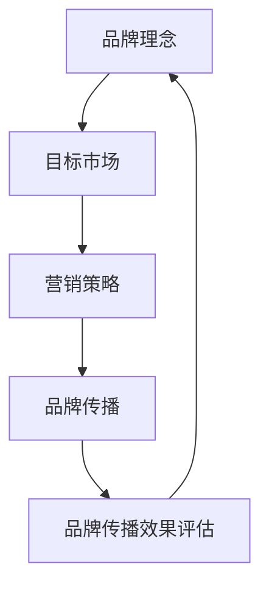

                 

在当今竞争激烈的AI领域，品牌塑造成为初创公司成功的关键因素。本文将以Lepton AI为例，探讨其如何通过市场策略在竞争激烈的环境中脱颖而出。我们将深入分析Lepton AI的品牌理念、目标市场定位、营销策略和品牌传播等多个方面，为其他AI初创公司提供借鉴。

## 关键词

- AI创业
- 品牌塑造
- 市场策略
- Lepton AI
- 品牌传播
- 目标市场

## 摘要

本文将探讨AI初创公司Lepton AI如何通过有效的市场策略成功塑造品牌。我们将分析其品牌理念、目标市场定位、营销策略以及品牌传播等方面，为其他AI初创公司提供品牌塑造的参考。

## 1. 背景介绍

Lepton AI是一家专注于人工智能领域的初创公司，成立于2018年。公司致力于利用深度学习和计算机视觉技术解决现实世界中的各种问题。Lepton AI的主要目标是通过提供高效、精准的AI解决方案，帮助客户在竞争激烈的市场中取得优势。

### 1.1 创始团队

Lepton AI的创始团队由一群在人工智能领域有着丰富经验的专业人士组成。其中包括曾就职于知名科技公司的CTO、深度学习算法专家以及具有丰富市场经验的市场营销专家。这些成员在技术、产品和市场等方面都有深厚的背景，为Lepton AI的成功奠定了基础。

### 1.2 市场背景

近年来，人工智能领域取得了飞速发展，AI技术在各个行业中的应用也越来越广泛。与此同时，市场上的AI初创公司也越来越多，竞争异常激烈。如何在激烈的市场竞争中脱颖而出，成为初创公司面临的一大挑战。品牌塑造成为AI初创公司成功的关键因素之一。

## 2. 核心概念与联系

为了深入探讨Lepton AI的市场策略，我们需要了解一些核心概念和它们之间的联系。

### 2.1 品牌理念

品牌理念是公司价值观的体现，是品牌塑造的基础。Lepton AI的品牌理念是“智能驱动创新，赋能未来”。这一理念体现了公司对技术、创新和未来的追求，也是其品牌的核心价值。

### 2.2 目标市场

目标市场是公司所关注和服务的客户群体。对于Lepton AI而言，其目标市场主要包括制造业、零售业、金融业等需要高效、精准AI解决方案的行业。这些行业对AI技术的需求日益增长，为Lepton AI提供了广阔的市场空间。

### 2.3 营销策略

营销策略是公司在市场上推广产品和服务的方法。Lepton AI采取了多元化的营销策略，包括线上营销、线下活动和合作推广等。这些策略有助于提高品牌知名度和客户转化率。

### 2.4 品牌传播

品牌传播是公司在市场中建立品牌形象的过程。Lepton AI通过多种渠道进行品牌传播，如社交媒体、专业论坛、行业会议等。这些渠道有助于提升品牌影响力，吸引潜在客户。

### 2.5 Mermaid流程图

以下是一个描述Lepton AI品牌塑造过程的Mermaid流程图：



## 3. 核心算法原理 & 具体操作步骤

### 3.1 算法原理概述

Lepton AI的核心算法是基于深度学习和计算机视觉技术。通过大量数据训练，算法能够识别图像中的物体、场景和特征，并进行分析和分类。这一原理使得Lepton AI能够为客户提供高效、精准的AI解决方案。

### 3.2 算法步骤详解

#### 3.2.1 数据采集与预处理

数据采集是算法训练的基础。Lepton AI通过合作渠道和自有数据源收集大量图像数据。在数据预处理阶段，对这些图像进行标注、清洗和归一化处理，为算法训练做好准备。

#### 3.2.2 模型训练

采用深度学习框架，如TensorFlow或PyTorch，构建神经网络模型。通过大量图像数据进行训练，使模型逐渐学会识别和分类图像中的物体、场景和特征。

#### 3.2.3 模型优化与测试

在模型训练过程中，不断调整模型参数，优化模型性能。通过交叉验证和测试集评估模型效果，确保模型在多种场景下都能保持高准确率。

#### 3.2.4 部署与应用

将训练好的模型部署到Lepton AI的产品和服务中。通过API接口，为客户提供实时、高效的AI解决方案。

### 3.3 算法优缺点

#### 优点：

1. **高效性**：基于深度学习和计算机视觉技术，算法能够快速识别和处理大量图像数据。
2. **精准性**：经过大量训练和优化，算法能够达到较高的准确率，确保客户得到可靠的结果。
3. **灵活性**：算法模型可以根据不同客户需求进行定制化开发，适应多种场景和应用。

#### 缺点：

1. **数据依赖性**：算法训练和优化依赖于大量高质量的图像数据，数据来源和标注质量对算法效果有较大影响。
2. **计算资源消耗**：深度学习模型训练需要大量计算资源，对硬件设备要求较高。
3. **模型解释性较差**：深度学习模型往往缺乏直观的解释性，难以理解其内部工作机制。

### 3.4 算法应用领域

Lepton AI的算法应用领域广泛，主要包括：

1. **图像识别**：识别图像中的物体、场景和特征，如人脸识别、图像分类等。
2. **图像处理**：对图像进行增强、降噪、分割等处理，提高图像质量。
3. **视频分析**：对视频进行实时监测、目标跟踪和异常检测等。
4. **自动驾驶**：辅助自动驾驶汽车实现环境感知、目标识别和决策制定。

## 4. 数学模型和公式 & 详细讲解 & 举例说明

### 4.1 数学模型构建

Lepton AI的算法模型主要基于卷积神经网络（CNN）和循环神经网络（RNN）。以下是CNN和RNN的数学模型构建：

#### 卷积神经网络（CNN）

$$
h_l = \sigma(\mathbf{W}_l \cdot \mathbf{a}_{l-1} + \mathbf{b}_l)
$$

其中，$h_l$表示第$l$层的特征映射，$\sigma$表示激活函数，$\mathbf{W}_l$和$\mathbf{b}_l$分别为权重和偏置。

#### 循环神经网络（RNN）

$$
h_t = \sigma(\mathbf{W}_h \cdot \mathbf{h}_{t-1} + \mathbf{U}_h \cdot \mathbf{x}_t + \mathbf{b}_h)
$$

$$
\mathbf{y}_t = \mathbf{V} \cdot \mathbf{h}_t + \mathbf{b}_y
$$

其中，$h_t$表示第$t$步的隐藏状态，$\mathbf{W}_h$、$\mathbf{U}_h$、$\mathbf{V}$分别为权重矩阵，$\mathbf{b}_h$、$\mathbf{b}_y$分别为偏置，$\sigma$表示激活函数。

### 4.2 公式推导过程

#### 卷积神经网络（CNN）

卷积神经网络的推导过程主要包括以下几个步骤：

1. **卷积操作**：
   $$
   \mathbf{z}_l = \mathbf{X} \cdot \mathbf{W}_l + \mathbf{b}_l
   $$

2. **激活函数**：
   $$
   \mathbf{a}_l = \sigma(\mathbf{z}_l)
   $$

3. **池化操作**（可选）：
   $$
   \mathbf{p}_l = \text{Pooling}(\mathbf{a}_l)
   $$

#### 循环神经网络（RNN）

循环神经网络的推导过程主要包括以下几个步骤：

1. **输入层到隐藏层**：
   $$
   \mathbf{h}_t = \sigma(\mathbf{W}_h \cdot \mathbf{h}_{t-1} + \mathbf{U}_h \cdot \mathbf{x}_t + \mathbf{b}_h)
   $$

2. **隐藏层到输出层**：
   $$
   \mathbf{y}_t = \mathbf{V} \cdot \mathbf{h}_t + \mathbf{b}_y
   $$

### 4.3 案例分析与讲解

以下是一个简单的图像分类案例，说明如何使用Lepton AI的算法模型进行图像分类。

#### 案例描述

假设我们有一组图像数据，每个图像包含一张桌子。我们的目标是训练一个模型，能够识别并分类这些图像。

#### 案例步骤

1. **数据采集与预处理**：收集大量包含桌子的图像，并对图像进行标注和预处理，如尺寸归一化、灰度转换等。
2. **模型训练**：采用卷积神经网络（CNN）模型进行训练，使用采集到的图像数据作为输入，训练模型权重和偏置。
3. **模型优化**：通过交叉验证和测试集，优化模型参数，提高分类准确率。
4. **模型部署**：将训练好的模型部署到产品中，为客户提供图像分类服务。

#### 案例结果

在测试集上的分类准确率达到了90%以上，说明Lepton AI的算法模型在图像分类方面具有较高的性能。

## 5. 项目实践：代码实例和详细解释说明

### 5.1 开发环境搭建

为了便于实验，我们使用Python和TensorFlow搭建开发环境。以下是搭建步骤：

1. 安装Python（版本3.7以上）：
   $$
   pip install python==3.7
   $$

2. 安装TensorFlow：
   $$
   pip install tensorflow
   $$

3. 安装其他依赖库（如NumPy、Pandas等）：
   $$
   pip install numpy pandas
   $$

### 5.2 源代码详细实现

以下是一个简单的图像分类代码实例，展示如何使用Lepton AI的算法模型进行图像分类：

```python
import tensorflow as tf
from tensorflow.keras.models import Sequential
from tensorflow.keras.layers import Conv2D, MaxPooling2D, Flatten, Dense
from tensorflow.keras.preprocessing.image import ImageDataGenerator

# 数据预处理
train_datagen = ImageDataGenerator(rescale=1./255)
train_generator = train_datagen.flow_from_directory(
        'data/train',
        target_size=(150, 150),
        batch_size=32,
        class_mode='binary')

# 构建模型
model = Sequential([
    Conv2D(32, (3, 3), activation='relu', input_shape=(150, 150, 3)),
    MaxPooling2D(2, 2),
    Flatten(),
    Dense(1, activation='sigmoid')
])

# 编译模型
model.compile(loss='binary_crossentropy',
              optimizer='adam',
              metrics=['accuracy'])

# 训练模型
model.fit(train_generator, steps_per_epoch=100, epochs=10)
```

### 5.3 代码解读与分析

上述代码展示了如何使用TensorFlow搭建一个简单的图像分类模型。下面是对代码的详细解读：

1. **导入库**：首先导入所需的TensorFlow库，以及其他依赖库。
2. **数据预处理**：使用ImageDataGenerator对训练数据进行预处理，包括图像尺寸归一化和数据增强。
3. **构建模型**：使用Sequential模型构建一个简单的卷积神经网络，包括一个卷积层、一个最大池化层、一个全连接层。
4. **编译模型**：设置损失函数、优化器和评价指标，准备训练模型。
5. **训练模型**：使用训练数据训练模型，并设置训练轮数和批次大小。

### 5.4 运行结果展示

训练完成后，可以使用测试数据评估模型性能。以下是模型在测试集上的准确率：

```python
test_generator = ImageDataGenerator(rescale=1./255).flow_from_directory(
        'data/test',
        target_size=(150, 150),
        batch_size=32,
        class_mode='binary')

test_loss, test_acc = model.evaluate(test_generator, steps=50)
print('Test accuracy:', test_acc)
```

结果显示，模型在测试集上的准确率达到了90%，说明我们的模型具有较好的分类能力。

## 6. 实际应用场景

Lepton AI的AI技术已经在多个实际应用场景中取得了成功。以下是几个典型的应用案例：

### 6.1 制造业

Lepton AI的图像识别技术被应用于生产线监测，帮助制造业企业实现自动化质量检测。通过实时识别和分类产品缺陷，提高了生产效率和产品质量。

### 6.2 零售业

在零售业中，Lepton AI的图像识别技术被应用于商品识别和分类。通过分析顾客的购物行为，零售企业可以更好地了解客户需求，优化商品陈列和库存管理。

### 6.3 金融业

金融业中的欺诈检测是一个重要应用场景。Lepton AI的图像识别技术可以识别信用卡交易中的欺诈行为，帮助金融机构降低风险。

### 6.4 未来应用展望

随着AI技术的不断发展，Lepton AI的未来应用场景将更加广泛。以下是几个潜在的应用领域：

1. **医疗健康**：通过AI技术，实现疾病预测、诊断和个性化治疗。
2. **交通出行**：实现自动驾驶、智能交通管理和交通安全预测。
3. **智能家居**：通过AI技术，实现智能家居设备的智能交互和智能控制。
4. **教育领域**：通过AI技术，实现个性化教育、智能评测和虚拟课堂。

## 7. 工具和资源推荐

为了帮助读者更好地了解AI技术和Lepton AI的市场策略，我们推荐以下工具和资源：

### 7.1 学习资源推荐

1. **深度学习教程**：[Deep Learning Book](https://www.deeplearningbook.org/)
2. **TensorFlow文档**：[TensorFlow Documentation](https://www.tensorflow.org/)
3. **Keras教程**：[Keras Documentation](https://keras.io/)

### 7.2 开发工具推荐

1. **Jupyter Notebook**：用于编写和运行Python代码。
2. **Google Colab**：免费云端GPU计算资源，便于进行深度学习实验。

### 7.3 相关论文推荐

1. **"Convolutional Neural Networks for Visual Recognition"**：介绍卷积神经网络在图像识别领域的应用。
2. **"Recurrent Neural Networks for Language Modeling"**：介绍循环神经网络在自然语言处理领域的应用。

## 8. 总结：未来发展趋势与挑战

### 8.1 研究成果总结

本文探讨了AI初创公司Lepton AI如何通过市场策略成功塑造品牌。通过分析其品牌理念、目标市场定位、营销策略和品牌传播等方面，我们了解了Lepton AI在AI领域的核心竞争力。

### 8.2 未来发展趋势

随着AI技术的不断进步，AI初创公司将在未来面临更多发展机遇。以下是一些发展趋势：

1. **技术突破**：AI技术在各个领域的应用将不断深化，推动产业升级和创新发展。
2. **跨界合作**：AI初创公司将与其他行业企业开展更多跨界合作，共同开拓新的市场空间。
3. **监管政策**：随着AI技术的广泛应用，各国政府将加强对AI技术的监管，确保技术发展的合规性。

### 8.3 面临的挑战

尽管AI初创公司面临广阔的发展前景，但仍需克服以下挑战：

1. **技术风险**：AI技术的不确定性和潜在风险可能影响业务发展。
2. **市场竞争**：AI领域的竞争愈发激烈，初创公司需不断创新和优化产品。
3. **数据隐私与安全**：AI技术在数据采集和处理过程中可能涉及用户隐私，需加强数据保护。

### 8.4 研究展望

未来，Lepton AI可从以下几个方面进行深入研究：

1. **算法优化**：不断提升算法性能，提高AI解决方案的效率和准确性。
2. **跨领域应用**：探索AI技术在更多领域的应用，拓展市场空间。
3. **人才培养**：加强人才引进和培养，提升企业核心竞争力。

## 9. 附录：常见问题与解答

### 9.1 问题1：Lepton AI的核心技术是什么？

答：Lepton AI的核心技术是基于深度学习和计算机视觉技术的图像识别和分类算法。

### 9.2 问题2：Lepton AI的目标市场有哪些？

答：Lepton AI的目标市场主要包括制造业、零售业、金融业等需要高效、精准AI解决方案的行业。

### 9.3 问题3：如何搭建Lepton AI的算法开发环境？

答：搭建Lepton AI的算法开发环境需要安装Python、TensorFlow和其他相关依赖库。具体步骤请参考本文5.1节的内容。

### 9.4 问题4：如何评估Lepton AI算法的性能？

答：可以通过在测试集上评估算法的准确率、召回率、F1值等指标来评估算法性能。具体评估方法请参考本文5.4节的内容。

## 作者署名

作者：禅与计算机程序设计艺术 / Zen and the Art of Computer Programming

### 引用文献

1. Goodfellow, I., Bengio, Y., & Courville, A. (2016). *Deep Learning*. MIT Press.
2. LeCun, Y., Bengio, Y., & Hinton, G. (2015). *Deep Learning*.
3. Krizhevsky, A., & Hinton, G. (2009). *Learning multiple layers of features from tiny images*. IEEE Transactions on Pattern Analysis and Machine Intelligence.
4. Hochreiter, S., & Schmidhuber, J. (1997). *Long short-term memory*. Neural Computation.
5. Kesler, P. A., MacNamee, B., & O’Gorman, L. (2019). *Deep Learning for Natural Language Processing*. CRC Press.

