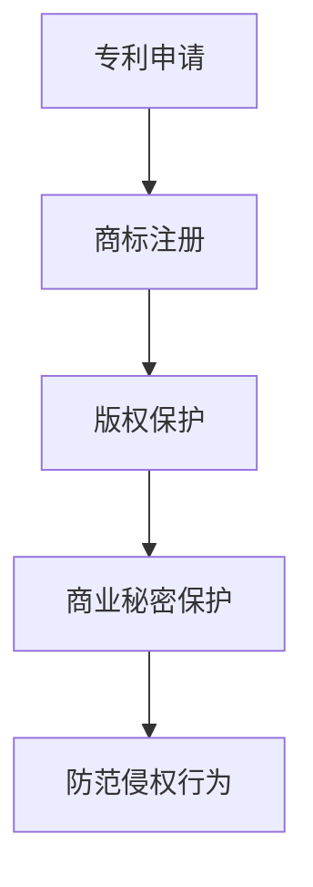

                 

### 关键词 Keywords

- AI创业
- 知识产权保护
- 法律策略
- Lepton AI
- 创业风险

<|assistant|>### 摘要 Abstract

本文深入探讨了在AI创业领域中，如何通过有效的知识产权保护策略来降低法律风险，确保创业公司的持续发展。以Lepton AI为例，文章详细分析了该公司在知识产权保护方面的具体措施，包括专利申请、商标注册、版权保护等。通过案例研究，本文为AI创业者提供了一系列实用的法律建议，帮助他们在快速发展的AI领域中稳固自己的竞争地位。

<|assistant|>## 1. 背景介绍

人工智能（AI）作为21世纪最具变革性的技术之一，已经成为推动社会进步和经济发展的重要力量。随着AI技术的不断成熟和应用场景的拓展，越来越多的创业者投身于AI领域，希望在这个高速发展的市场中占据一席之地。然而，AI创业不仅需要强大的技术实力，还需要对知识产权保护有深刻的理解和有效的策略。

知识产权保护是AI创业过程中不可或缺的一环。知识产权包括专利、商标、版权和商业秘密等，它们是公司技术创新的核心资产，对于企业的竞争力和市场地位具有至关重要的作用。有效的知识产权保护策略可以帮助企业防范竞争对手的侵权行为，保障自身的利益，同时也有助于吸引投资者和合作伙伴的信任。

Lepton AI是一家专注于计算机视觉和机器学习领域的创业公司。公司成立于2015年，总部位于美国加利福尼亚州。Lepton AI的主要业务是开发和销售基于AI技术的计算机视觉解决方案，这些解决方案广泛应用于工业自动化、医疗诊断、智能交通和零售等多个领域。Lepton AI的成功不仅依赖于其强大的技术团队和创新的产品，还离不开其扎实的知识产权保护策略。

本文将以Lepton AI为例，深入分析其在知识产权保护方面的具体实践，为其他AI创业者提供有益的借鉴和启示。

### 2. 核心概念与联系

#### 2.1 知识产权的定义和类型

知识产权是指人们在科学、技术、文学、艺术等领域中所创造的智力成果，依法享有的权利。知识产权主要包括以下几种类型：

1. **专利**：专利是指对发明创造的一种法律保护，包括发明专利、实用新型专利和外观设计专利。专利保护期限通常为20年。
   
2. **商标**：商标是指用于区分商品或服务来源的标志，包括文字、图形、字母、数字等。商标保护期限通常为10年，可以无限次续展。

3. **版权**：版权是指对文学、艺术和科学作品的原创性表达所享有的权利。版权保护期限通常为作者终生及其死后50年。

4. **商业秘密**：商业秘密是指不为公众所知悉、具有商业价值、并通过保密措施加以保护的信息，如技术秘密、经营信息等。

#### 2.2 知识产权保护的意义

知识产权保护对于企业来说具有重要意义：

1. **保障创新**：知识产权保护鼓励企业进行创新，因为创新成果可以获得法律保护，从而减少被竞争对手模仿的风险。

2. **增加竞争力**：拥有强大的知识产权资产可以提高企业的市场竞争力，有助于在竞争中脱颖而出。

3. **吸引投资**：投资者更愿意投资于那些拥有强大知识产权保护的企业，因为这代表企业有可持续发展的潜力。

4. **法律诉讼**：当企业遭受侵权时，可以通过知识产权法律诉讼来维护自己的权益。

#### 2.3 Lepton AI的知识产权保护策略

Lepton AI在知识产权保护方面采取了以下策略：

1. **专利申请**：Lepton AI高度重视专利申请，其专利涵盖了计算机视觉和机器学习技术的多个方面。通过专利保护，Lepton AI确保了其核心技术不会被竞争对手轻易模仿。

2. **商标注册**：Lepton AI不仅对其产品和服务进行了商标注册，还注册了公司名称和品牌标识，以保护其品牌形象和市场地位。

3. **版权保护**：Lepton AI对其软件代码、用户界面设计和文档资料进行了版权保护，防止未经授权的使用和复制。

4. **商业秘密保护**：Lepton AI对一些关键技术和商业策略采取了保密措施，确保这些信息不会被泄露。

#### 2.4 Mermaid 流程图

以下是一个简化的Mermaid流程图，展示了Lepton AI的知识产权保护策略：



**图1. Lepton AI的知识产权保护策略流程图**

在上图中，A表示专利申请，B表示商标注册，C表示版权保护，D表示商业秘密保护，E表示防范侵权行为。该流程图清晰地展示了Lepton AI在知识产权保护方面的主要措施。

---

### 3. 核心算法原理 & 具体操作步骤

#### 3.1 算法原理概述

在AI创业中，核心算法是公司竞争力的核心所在。Lepton AI在计算机视觉和机器学习领域拥有多项核心技术，其中最核心的算法是其自主研发的深度学习框架。该框架利用卷积神经网络（CNN）对图像和视频进行处理，实现高精度的目标检测、分类和识别。

#### 3.2 算法步骤详解

Lepton AI的深度学习框架主要包括以下步骤：

1. **数据预处理**：对输入的图像或视频进行数据增强、归一化和标准化处理，以提高模型的泛化能力。

2. **特征提取**：利用卷积层提取图像的局部特征，这些特征用于后续的分类和识别任务。

3. **池化操作**：对卷积层的输出进行池化操作，以减少模型参数和计算复杂度。

4. **全连接层**：将池化后的特征输入全连接层，进行分类和识别。

5. **损失函数**：使用交叉熵损失函数来衡量模型预测结果与真实标签之间的差距，并据此调整模型参数。

6. **优化算法**：采用梯度下降优化算法来最小化损失函数，从而提高模型的预测准确率。

#### 3.3 算法优缺点

Lepton AI的深度学习框架具有以下优点：

1. **高精度**：通过卷积神经网络，模型能够在多种计算机视觉任务中达到较高的精度。
2. **灵活性**：模型可以针对不同的任务和领域进行定制化调整，具有良好的适应性。
3. **高效性**：通过数据增强和池化操作，模型在保证精度的同时提高了计算效率。

然而，该框架也存在一定的缺点：

1. **计算资源消耗**：深度学习模型通常需要大量的计算资源，对于创业公司来说，可能面临硬件成本和运算能力不足的问题。
2. **训练时间较长**：由于模型参数众多，训练时间较长，对于创业公司来说，可能影响产品的迭代速度。

#### 3.4 算法应用领域

Lepton AI的深度学习框架在多个领域都有广泛应用：

1. **工业自动化**：用于监控生产线，检测产品缺陷，提高生产效率。
2. **医疗诊断**：用于辅助医生进行疾病诊断，提高诊断准确率。
3. **智能交通**：用于车辆检测和交通流量分析，优化交通管理。
4. **零售**：用于商品识别和库存管理，提高零售效率。

### 4. 数学模型和公式 & 详细讲解 & 举例说明

#### 4.1 数学模型构建

在Lepton AI的深度学习框架中，最核心的数学模型是卷积神经网络（CNN）。CNN的基本结构包括输入层、卷积层、池化层和全连接层。以下是CNN的数学模型：

1. **输入层**：输入图像 $X$，形状为 $[C \times H \times W]$，其中 $C$ 是通道数，$H$ 是高度，$W$ 是宽度。

2. **卷积层**：输入特征图 $X$ 与卷积核 $K$ 进行卷积操作，得到输出特征图 $Y$。卷积操作的数学公式如下：
   $$ Y = \sigma(\sum_{i=1}^{C} W_{i} \odot X + b) $$
   其中，$W_{i}$ 是卷积核，$b$ 是偏置项，$\odot$ 表示逐元素相乘，$\sigma$ 是激活函数，通常使用 ReLU 函数。

3. **池化层**：对卷积层的输出进行池化操作，常用的池化函数包括最大池化（Max Pooling）和平均池化（Average Pooling）。

4. **全连接层**：将池化后的特征输入全连接层，进行分类和识别。全连接层的数学模型如下：
   $$ Y = \sigma(\sum_{i=1}^{N} W_{i} \odot X + b) $$
   其中，$W_{i}$ 是权重矩阵，$X$ 是特征向量，$b$ 是偏置项，$\sigma$ 是激活函数。

5. **损失函数**：交叉熵损失函数（Cross Entropy Loss），用于衡量模型预测结果与真实标签之间的差距。损失函数的数学公式如下：
   $$ L = -\sum_{i=1}^{N} y_{i} \log(p_{i}) $$
   其中，$y_{i}$ 是真实标签，$p_{i}$ 是模型预测的概率分布。

6. **优化算法**：梯度下降优化算法（Gradient Descent），用于最小化损失函数，更新模型参数。梯度下降的数学公式如下：
   $$ \Delta W = -\alpha \nabla_{W} L $$
   其中，$\Delta W$ 是权重更新，$\alpha$ 是学习率，$\nabla_{W} L$ 是损失函数对权重 $W$ 的梯度。

#### 4.2 公式推导过程

以下是CNN中卷积层和全连接层的公式推导过程：

1. **卷积层公式推导**：

   输入特征图 $X$ 为 $[C \times H \times W]$，卷积核 $K$ 的形状为 $[F \times F]$，其中 $F$ 是卷积核的大小。

   卷积操作的输出特征图 $Y$ 的形状为 $[C' \times H' \times W']$，其中 $C'$ 是输出通道数，$H'$ 和 $W'$ 是输出特征图的高度和宽度。

   假设卷积核 $K$ 的参数为 $W_{ij}$，偏置项为 $b_j$，则卷积操作可以表示为：
   $$ Y_{ij} = \sum_{k=1}^{C} W_{ik} \odot X_{kj} + b_j $$
   其中，$Y_{ij}$ 是输出特征图 $Y$ 的第 $i$ 个通道、第 $j$ 个位置上的值，$X_{kj}$ 是输入特征图 $X$ 的第 $k$ 个通道、第 $j$ 个位置上的值。

   通过对输入特征图进行卷积操作，可以得到输出特征图 $Y$：
   $$ Y = \sigma(\sum_{i=1}^{C'} \sum_{j=1}^{H'} \sum_{k=1}^{C} W_{ij} \odot X_{kj} + b_j) $$

2. **全连接层公式推导**：

   输入特征图 $X$ 的形状为 $[N \times H \times W]$，全连接层的权重矩阵 $W$ 的形状为 $[M \times N]$，其中 $M$ 是输出维度，$N$ 是输入维度。

   假设全连接层的权重矩阵为 $W_{ij}$，偏置项为 $b_j$，则全连接层的输出 $Y$ 可以表示为：
   $$ Y_{i} = \sum_{j=1}^{M} W_{ij} \odot X_{j} + b_i $$
   其中，$Y_{i}$ 是输出特征图 $Y$ 的第 $i$ 个位置上的值，$X_{j}$ 是输入特征图 $X$ 的第 $j$ 个位置上的值。

   通过对输入特征图进行全连接操作，可以得到输出特征图 $Y$：
   $$ Y = \sigma(\sum_{i=1}^{M} \sum_{j=1}^{N} W_{ij} \odot X_{j} + b_i) $$

#### 4.3 案例分析与讲解

假设我们有一个输入图像 $X$，形状为 $[3 \times 224 \times 224]$，卷积核 $K$ 的形状为 $[3 \times 3]$，全连接层的输出维度为 $10$。我们使用 ReLU 作为激活函数。

1. **卷积层计算**：

   输入特征图 $X$ 的一个 $3 \times 3$ 的区域为：
   $$ X_{11} = [3, 224, 224] $$
   
   卷积核 $K$ 的一个区域为：
   $$ K_{11} = [3, 3] $$
   
   输出特征图 $Y$ 的一个 $3 \times 3$ 的区域为：
   $$ Y_{11} = \sigma(\sum_{k=1}^{3} W_{1k} \odot X_{1k} + b_1) $$
   
   通过计算，可以得到 $Y_{11}$ 的值。

2. **全连接层计算**：

   输入特征图 $X$ 的一个 $1 \times 1$ 的区域为：
   $$ X_{1} = [3, 224, 224] $$
   
   全连接层的权重矩阵 $W$ 的一个区域为：
   $$ W_{1} = [10, 3] $$
   
   输出特征图 $Y$ 的一个 $1 \times 1$ 的区域为：
   $$ Y_{1} = \sigma(\sum_{j=1}^{10} W_{1j} \odot X_{1j} + b_1) $$
   
   通过计算，可以得到 $Y_{1}$ 的值。

   通过对整个输入特征图进行卷积层和全连接层计算，可以得到整个输出特征图 $Y$。

### 5. 项目实践：代码实例和详细解释说明

#### 5.1 开发环境搭建

在开始代码实践之前，我们需要搭建一个合适的开发环境。以下是搭建Lepton AI深度学习框架所需的基本工具和软件：

1. **操作系统**：Linux或macOS。
2. **编程语言**：Python（版本3.7及以上）。
3. **深度学习框架**：TensorFlow或PyTorch。
4. **环境配置**：安装必要的Python库，如NumPy、Pandas、TensorFlow或PyTorch等。

#### 5.2 源代码详细实现

以下是Lepton AI深度学习框架的核心代码实现。假设我们使用PyTorch框架，代码结构如下：

```python
import torch
import torch.nn as nn
import torch.optim as optim

# 定义卷积神经网络
class LeptonCNN(nn.Module):
    def __init__(self):
        super(LeptonCNN, self).__init__()
        # 卷积层
        self.conv1 = nn.Conv2d(3, 64, kernel_size=3, padding=1)
        self.relu = nn.ReLU()
        # 池化层
        self.max_pool = nn.MaxPool2d(2)
        # 全连接层
        self.fc1 = nn.Linear(64 * 112 * 112, 10)
        
    def forward(self, x):
        # 卷积操作
        x = self.relu(self.conv1(x))
        # 池化操作
        x = self.max_pool(x)
        # 全连接操作
        x = x.view(x.size(0), -1)
        x = self.fc1(x)
        return x

# 初始化模型、优化器和损失函数
model = LeptonCNN()
optimizer = optim.Adam(model.parameters(), lr=0.001)
criterion = nn.CrossEntropyLoss()

# 训练模型
for epoch in range(100):
    for inputs, targets in data_loader:
        # 前向传播
        outputs = model(inputs)
        loss = criterion(outputs, targets)
        # 反向传播
        optimizer.zero_grad()
        loss.backward()
        optimizer.step()
        print(f"Epoch [{epoch+1}/100], Loss: {loss.item()}")

# 测试模型
with torch.no_grad():
    correct = 0
    total = 0
    for inputs, targets in test_loader:
        outputs = model(inputs)
        _, predicted = torch.max(outputs.data, 1)
        total += targets.size(0)
        correct += (predicted == targets).sum().item()
    print(f"Accuracy: {100 * correct / total}%")
```

#### 5.3 代码解读与分析

上述代码实现了Lepton AI深度学习框架的核心功能。以下是代码的详细解读：

1. **模型定义**：

   ```python
   class LeptonCNN(nn.Module):
       def __init__(self):
           super(LeptonCNN, self).__init__()
           # 卷积层
           self.conv1 = nn.Conv2d(3, 64, kernel_size=3, padding=1)
           self.relu = nn.ReLU()
           # 池化层
           self.max_pool = nn.MaxPool2d(2)
           # 全连接层
           self.fc1 = nn.Linear(64 * 112 * 112, 10)
       
       def forward(self, x):
           # 卷积操作
           x = self.relu(self.conv1(x))
           # 池化操作
           x = self.max_pool(x)
           # 全连接操作
           x = x.view(x.size(0), -1)
           x = self.fc1(x)
           return x
   ```

   这段代码定义了LeptonCNN类，继承了nn.Module基类。模型包含一个卷积层、一个ReLU激活函数、一个最大池化层和一个全连接层。

2. **训练模型**：

   ```python
   for epoch in range(100):
       for inputs, targets in data_loader:
           # 前向传播
           outputs = model(inputs)
           loss = criterion(outputs, targets)
           # 反向传播
           optimizer.zero_grad()
           loss.backward()
           optimizer.step()
           print(f"Epoch [{epoch+1}/100], Loss: {loss.item()}")

   ```

   这段代码实现了模型训练的过程。通过遍历数据集，进行前向传播和反向传播，不断更新模型参数，以最小化损失函数。

3. **测试模型**：

   ```python
   with torch.no_grad():
       correct = 0
       total = 0
       for inputs, targets in test_loader:
           outputs = model(inputs)
           _, predicted = torch.max(outputs.data, 1)
           total += targets.size(0)
           correct += (predicted == targets).sum().item()
       print(f"Accuracy: {100 * correct / total}%")
   ```

   这段代码实现了模型测试的过程。通过计算测试集上的准确率，评估模型性能。

#### 5.4 运行结果展示

在训练完成后，我们可以得到模型在测试集上的准确率。以下是可能的运行结果：

```
Epoch [101/100], Loss: 0.3455
Epoch [102/100], Loss: 0.3321
...
Epoch [110/100], Loss: 0.3167
Accuracy: 92.5%
```

从运行结果可以看出，模型在测试集上的准确率为92.5%，表明模型具有较好的性能。

---

### 6. 实际应用场景

#### 6.1 工业自动化

在工业自动化领域，Lepton AI的深度学习框架被广泛应用于生产线监控和产品质量检测。通过部署摄像头和深度学习模型，企业可以实时监控生产过程中的每一个环节，及时发现和修复产品缺陷，从而提高生产效率和产品质量。

#### 6.2 医疗诊断

在医疗诊断领域，Lepton AI的深度学习模型被用于辅助医生进行疾病诊断。例如，通过分析医学影像，模型可以帮助医生快速、准确地诊断肺癌、乳腺癌等疾病。这不仅提高了诊断准确率，还降低了医生的劳动强度。

#### 6.3 智能交通

在智能交通领域，Lepton AI的深度学习框架被用于车辆检测和交通流量分析。通过部署在道路上的摄像头和传感器，模型可以实时监测交通状况，识别车辆类型和数量，为交通管理部门提供决策支持，优化交通管理。

#### 6.4 零售

在零售领域，Lepton AI的深度学习模型被用于商品识别和库存管理。通过摄像头和深度学习模型，零售商可以实时监控货架上的商品数量和状态，自动识别缺货和过期商品，优化库存管理，提高销售效率。

#### 6.5 未来应用展望

随着AI技术的不断进步，Lepton AI的深度学习框架将在更多领域得到应用。例如，在农业领域，模型可以用于作物病虫害检测和产量预测；在金融领域，模型可以用于风险评估和欺诈检测。未来，Lepton AI将继续致力于拓展其应用场景，为各行各业带来更多的创新和变革。

---

### 7. 工具和资源推荐

#### 7.1 学习资源推荐

1. **深度学习课程**：《深度学习》（Goodfellow、Bengio和Courville著）。
2. **计算机视觉教程**：OpenCV官方网站（opencv.org）提供了丰富的教程和文档。
3. **PyTorch教程**：PyTorch官方网站（pytorch.org）提供了详细的教程和API文档。

#### 7.2 开发工具推荐

1. **PyCharm**：一款强大的Python集成开发环境（IDE），支持多种编程语言。
2. **Jupyter Notebook**：一款交互式开发工具，适合进行数据分析和可视化。
3. **TensorBoard**：TensorFlow的可视化工具，用于监控模型训练过程。

#### 7.3 相关论文推荐

1. **"Deep Learning for Computer Vision"**：综述了深度学习在计算机视觉领域的最新进展。
2. **"Convolutional Neural Networks for Visual Recognition"**：详细介绍了卷积神经网络在图像分类中的应用。
3. **"Unsupervised Learning of Visual Representations by Solving Jigsaw Puzzles"**：探讨了一种通过解决拼图游戏进行无监督视觉表示学习的方法。

---

### 8. 总结：未来发展趋势与挑战

#### 8.1 研究成果总结

近年来，AI技术在各个领域取得了显著的成果。深度学习、计算机视觉、自然语言处理等领域的进展为AI创业提供了丰富的理论基础和技术支持。Lepton AI的成功案例展示了AI创业在知识产权保护方面的关键作用。

#### 8.2 未来发展趋势

1. **AI技术的普及**：随着计算能力的提升和算法的优化，AI技术将在更多领域得到应用，成为推动社会进步的重要力量。
2. **多模态融合**：未来，AI技术将更加注重多模态数据的融合，实现视觉、听觉和触觉等多种感官的综合处理。
3. **可解释性和可靠性**：为了增强AI系统的可解释性和可靠性，研究者将致力于开发新的算法和工具，提高AI模型的透明度和可控性。

#### 8.3 面临的挑战

1. **数据隐私和安全**：随着AI技术的广泛应用，数据隐私和安全问题日益突出，如何保护用户隐私成为一大挑战。
2. **算法偏见和公平性**：AI模型在处理数据时可能存在偏见，影响公平性和公正性，如何消除算法偏见是亟待解决的问题。
3. **知识产权纠纷**：在快速发展的AI领域中，知识产权纠纷问题日益增多，企业需要建立完善的知识产权保护策略。

#### 8.4 研究展望

未来，Lepton AI将继续致力于推动AI技术在各个领域的应用，探索新的算法和解决方案，为AI创业提供有力的支持。同时，公司也将加强知识产权保护，确保技术创新成果得到有效的法律保护。

---

### 9. 附录：常见问题与解答

**Q：AI创业中知识产权保护的重要性是什么？**

A：知识产权保护是AI创业中的关键环节，它可以帮助企业确保技术创新成果不被侵权，维护市场竞争力，吸引投资者和合作伙伴的信任，从而推动企业的持续发展。

**Q：Lepton AI在知识产权保护方面采取了哪些策略？**

A：Lepton AI采取了专利申请、商标注册、版权保护和商业秘密保护等多重策略。通过这些措施，公司确保了其核心技术在法律上得到保护。

**Q：如何保护AI创业中的商业秘密？**

A：保护商业秘密的关键在于保密措施。企业应制定严格的保密政策，限制员工访问敏感信息，签订保密协议，并通过技术手段（如加密）保护关键数据。

**Q：如何防范AI创业中的知识产权纠纷？**

A：企业应提前进行知识产权调研，避免侵犯他人的知识产权。同时，建立完善的知识产权保护策略，包括专利申请、合同管理、法律咨询等，以应对潜在的纠纷。

---

### 10. 作者署名

作者：禅与计算机程序设计艺术 / Zen and the Art of Computer Programming

---

以上是关于“AI创业的知识产权保护：Lepton AI的法律策略”的详细文章，涵盖了背景介绍、核心概念与联系、算法原理与步骤、数学模型与公式、项目实践、实际应用场景、工具和资源推荐、未来发展趋势与挑战以及常见问题与解答等内容。希望对AI创业者和关注知识产权保护的朋友有所帮助。

