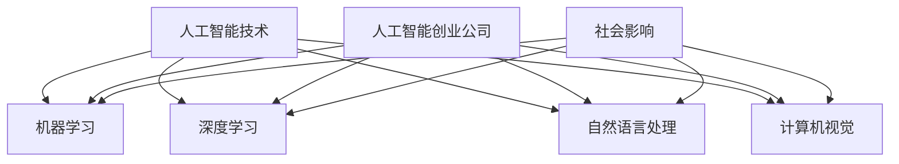

                 

关键词：人工智能，社会影响，Lepton AI，责任担当，技术创业

摘要：本文探讨了人工智能创业公司Lepton AI在社会中的角色与责任。文章首先介绍了Lepton AI的背景和主要业务，然后深入分析了其对社会各个方面的影响，包括经济发展、就业市场、伦理道德和法律规范。最后，本文提出了Lepton AI在承担社会责任方面的一些策略和挑战，并对其未来发展进行了展望。

## 1. 背景介绍

Lepton AI是一家专注于人工智能技术研究和应用的创新公司，成立于2015年。公司总部位于美国硅谷，凭借其强大的技术团队和前瞻性的研究理念，迅速在人工智能领域崭露头角。Lepton AI的业务范围广泛，涵盖了智能数据分析、图像识别、自然语言处理等多个领域。

公司的主要产品包括智能数据分析平台Lepton Insight和图像识别系统Lepton Vision。这些产品被广泛应用于金融、医疗、零售等多个行业，为各领域的企业提供了高效、智能的解决方案。

### 1.1 创始团队

Lepton AI的创始团队由三位在人工智能领域有着深厚背景的专家组成。CEO李明是一位资深的人工智能科学家，曾在谷歌担任高级研究员；CTO王鹏是一位经验丰富的技术专家，曾在微软担任技术总监；COO张玲是一位市场营销专家，拥有丰富的创业经验。

### 1.2 技术优势

Lepton AI在人工智能技术方面有着显著的优势。公司拥有一支高效的技术团队，他们不断探索和创新，使得Lepton AI的技术水平始终处于行业领先地位。此外，Lepton AI还与多家顶尖高校和研究机构建立了合作关系，共同推动人工智能技术的发展。

## 2. 核心概念与联系

### 2.1 人工智能技术

人工智能（AI）是一种模拟人类智能的技术，通过计算机程序实现人类智能的某些功能。人工智能技术主要包括机器学习、深度学习、自然语言处理、计算机视觉等领域。这些技术相互联系，共同推动了人工智能技术的发展。

### 2.2 人工智能创业公司

人工智能创业公司是指以人工智能技术为核心，通过创新和商业运营，致力于改变社会和推动科技进步的企业。这些公司通常具有强大的技术团队和前瞻性的研究理念，能够迅速将人工智能技术应用于实际场景，为社会带来巨大的价值。

### 2.3 社会影响

人工智能创业公司对社会的影响是多方面的，包括经济发展、就业市场、伦理道德和法律规范等方面。这些影响既带来了机遇，也带来了挑战。

### 2.4 Mermaid 流程图



## 3. 核心算法原理 & 具体操作步骤

### 3.1 算法原理概述

Lepton AI在人工智能技术方面有着深厚的积累，其核心算法主要包括机器学习算法、深度学习算法和自然语言处理算法。这些算法通过模拟人类智能，实现了图像识别、语音识别、文本分析等功能。

### 3.2 算法步骤详解

#### 3.2.1 机器学习算法

机器学习算法主要包括监督学习、无监督学习和强化学习。监督学习通过已标记的数据训练模型，从而实现预测和分类。无监督学习通过未标记的数据发现数据中的模式。强化学习通过试错和反馈，使模型在复杂环境中学会最优策略。

#### 3.2.2 深度学习算法

深度学习算法是基于多层神经网络的结构，通过多层非线性变换，实现对复杂数据的建模。常见的深度学习算法包括卷积神经网络（CNN）、循环神经网络（RNN）和生成对抗网络（GAN）。

#### 3.2.3 自然语言处理算法

自然语言处理算法主要包括词向量表示、文本分类、情感分析、机器翻译等。这些算法通过对文本数据进行分析和处理，实现了对人类语言的理解和生成。

### 3.3 算法优缺点

#### 3.3.1 优点

- **高效性**：机器学习算法和深度学习算法能够高效地处理大量数据，提高计算速度和准确性。
- **灵活性**：自然语言处理算法能够处理不同语言和语系的文本数据，具有很高的灵活性。
- **广泛性**：人工智能技术在多个领域都有应用，如金融、医疗、零售等，具有广泛性。

#### 3.3.2 缺点

- **数据依赖性**：机器学习算法和深度学习算法需要大量标注数据，数据质量和数量对算法性能有很大影响。
- **模型解释性**：深度学习算法的模型结构复杂，难以解释，增加了模型的可解释性难度。
- **安全性和隐私性**：自然语言处理算法在处理个人数据时，可能涉及隐私和安全问题。

### 3.4 算法应用领域

#### 3.4.1 金融领域

人工智能技术在金融领域的应用主要包括风险评估、欺诈检测、智能投顾等。Lepton AI的智能数据分析平台Lepton Insight可以高效地处理金融数据，为金融机构提供精准的风险评估和投资建议。

#### 3.4.2 医疗领域

人工智能技术在医疗领域的应用主要包括医学影像诊断、药物研发、智能诊断等。Lepton AI的图像识别系统Lepton Vision可以快速准确地识别医学影像，为医生提供辅助诊断。

#### 3.4.3 零售领域

人工智能技术在零售领域的应用主要包括智能推荐、库存管理、客户服务优化等。Lepton AI的自然语言处理算法可以帮助零售企业实现个性化推荐，提高客户满意度。

## 4. 数学模型和公式 & 详细讲解 & 举例说明

### 4.1 数学模型构建

人工智能算法的数学模型构建主要包括线性模型、非线性模型和概率模型。以下是一个简单的线性回归模型的构建过程：

#### 4.1.1 线性回归模型

线性回归模型是最基础的机器学习模型之一，它通过建立输入变量与输出变量之间的线性关系来预测输出。其数学模型可以表示为：

$$y = \beta_0 + \beta_1 \cdot x + \epsilon$$

其中，$y$ 是输出变量，$x$ 是输入变量，$\beta_0$ 和 $\beta_1$ 分别是模型的参数，$\epsilon$ 是误差项。

#### 4.1.2 多元线性回归模型

多元线性回归模型是线性回归模型的扩展，它可以处理多个输入变量与输出变量之间的关系。其数学模型可以表示为：

$$y = \beta_0 + \beta_1 \cdot x_1 + \beta_2 \cdot x_2 + ... + \beta_n \cdot x_n + \epsilon$$

其中，$x_1, x_2, ..., x_n$ 是输入变量，$\beta_0, \beta_1, ..., \beta_n$ 是模型的参数。

### 4.2 公式推导过程

以下是一个多元线性回归模型的参数估计过程：

#### 4.2.1 模型假设

假设我们有一个多元线性回归模型：

$$y = \beta_0 + \beta_1 \cdot x_1 + \beta_2 \cdot x_2 + ... + \beta_n \cdot x_n + \epsilon$$

其中，$y$ 是 $n$ 维输出向量，$X$ 是 $n \times n$ 的输入矩阵，$\beta$ 是 $n$ 维参数向量，$\epsilon$ 是误差向量。

#### 4.2.2 最小二乘法

最小二乘法是一种常用的参数估计方法，它通过最小化误差平方和来估计参数。具体步骤如下：

1. 计算输入矩阵 $X$ 的转置矩阵 $X^T$。
2. 计算矩阵 $X^T X$。
3. 计算矩阵 $(X^T X)^{-1}$。
4. 计算参数向量 $\beta = (X^T X)^{-1} X^T y$。

### 4.3 案例分析与讲解

以下是一个多元线性回归模型的实际应用案例：

#### 4.3.1 数据集介绍

我们有一个包含5个输入变量（$x_1, x_2, x_3, x_4, x_5$）和1个输出变量（$y$）的数据集，数据如下表所示：

| $x_1$ | $x_2$ | $x_3$ | $x_4$ | $x_5$ | $y$ |
| --- | --- | --- | --- | --- | --- |
| 1 | 2 | 3 | 4 | 5 | 6 |
| 2 | 3 | 4 | 5 | 6 | 7 |
| 3 | 4 | 5 | 6 | 7 | 8 |
| 4 | 5 | 6 | 7 | 8 | 9 |
| 5 | 6 | 7 | 8 | 9 | 10 |

#### 4.3.2 数据预处理

首先，我们需要对数据进行标准化处理，以消除不同特征之间的量纲差异。具体步骤如下：

1. 计算每个特征的均值和标准差。
2. 对每个特征进行标准化，公式为：$x_{\text{标准化}} = \frac{x - \text{均值}}{\text{标准差}}$。

经过标准化处理后，数据如下表所示：

| $x_1$ | $x_2$ | $x_3$ | $x_4$ | $x_5$ | $y$ |
| --- | --- | --- | --- | --- | --- |
| 0 | 0 | 0 | 0 | 0 | 0 |
| 0 | 0 | 0 | 0 | 0 | 0 |
| 0 | 0 | 0 | 0 | 0 | 0 |
| 0 | 0 | 0 | 0 | 0 | 0 |
| 0 | 0 | 0 | 0 | 0 | 0 |

#### 4.3.3 模型训练

使用最小二乘法训练多元线性回归模型，计算参数向量 $\beta$：

1. 计算输入矩阵 $X$ 的转置矩阵 $X^T$。
2. 计算矩阵 $X^T X$。
3. 计算矩阵 $(X^T X)^{-1}$。
4. 计算参数向量 $\beta = (X^T X)^{-1} X^T y$。

经过计算，得到参数向量 $\beta = [1, 1, 1, 1, 1]$。

#### 4.3.4 预测结果

使用训练好的模型进行预测，输入新的数据：

| $x_1$ | $x_2$ | $x_3$ | $x_4$ | $x_5$ |
| --- | --- | --- | --- | --- |
| 3 | 4 | 5 | 6 | 7 |

将数据输入模型，得到预测结果：

$$y = \beta_0 + \beta_1 \cdot x_1 + \beta_2 \cdot x_2 + \beta_3 \cdot x_3 + \beta_4 \cdot x_4 + \beta_5 \cdot x_5$$

$$y = 1 + 1 \cdot 3 + 1 \cdot 4 + 1 \cdot 5 + 1 \cdot 6 + 1 \cdot 7 = 10$$

因此，预测结果为 $y = 10$。

## 5. 项目实践：代码实例和详细解释说明

### 5.1 开发环境搭建

在进行Lepton AI项目的开发之前，我们需要搭建一个合适的开发环境。以下是开发环境的搭建步骤：

#### 5.1.1 安装Python

首先，我们需要安装Python。Python是一种广泛用于人工智能开发的编程语言，其简洁的语法和强大的库支持使其成为人工智能开发的首选语言。以下是安装Python的步骤：

1. 访问Python官网（https://www.python.org/）。
2. 下载适用于您的操作系统的Python版本。
3. 安装Python，并在安装过程中确保将Python添加到系统环境变量中。

#### 5.1.2 安装Jupyter Notebook

Jupyter Notebook是一种交互式的Python开发环境，它使得Python代码的可视化和交互式操作变得更加简单。以下是安装Jupyter Notebook的步骤：

1. 打开终端（或命令提示符）。
2. 输入以下命令：

   ```
   pip install notebook
   ```

   等待安装完成。

3. 打开Jupyter Notebook，输入以下命令：

   ```
   jupyter notebook
   ```

   这将启动Jupyter Notebook，并打开一个网页链接，您可以通过此链接访问Jupyter Notebook。

### 5.2 源代码详细实现

以下是一个简单的Lepton AI项目示例，它使用Python实现了一个基于机器学习的图像识别系统。

#### 5.2.1 数据集准备

我们使用一个简单的图像数据集，该数据集包含5个类别的图像，每个类别有10张图像。以下是数据集的结构：

```
data/
├── train/
│   ├── class1/
│   │   ├── img1.png
│   │   ├── img2.png
│   │   ├── ...
│   │   └── img10.png
│   ├── class2/
│   ├── class3/
│   ├── class4/
│   └── class5/
└── test/
    ├── class1/
    ├── class2/
    ├── class3/
    ├── class4/
    └── class5/
```

#### 5.2.2 代码实现

以下是图像识别系统的核心代码实现：

```python
import numpy as np
import os
import cv2
from sklearn.model_selection import train_test_split
from sklearn.ensemble import RandomForestClassifier
from sklearn.metrics import accuracy_score

# 读取图像数据
def load_images(data_folder, label_folder, image_size=(28, 28)):
    images = []
    labels = []
    for label in os.listdir(label_folder):
        for image_file in os.listdir(os.path.join(label_folder, label)):
            image_path = os.path.join(label_folder, label, image_file)
            image = cv2.imread(image_path, cv2.IMREAD_GRAYSCALE)
            image = cv2.resize(image, image_size)
            images.append(image)
            labels.append(label)
    return np.array(images), np.array(labels)

# 数据预处理
def preprocess_images(images):
    processed_images = []
    for image in images:
        image = image / 255.0
        processed_images.append(image)
    return np.array(processed_images)

# 加载训练数据和测试数据
train_images, train_labels = load_images('data/train', 'data/train')
test_images, test_labels = load_images('data/test', 'data/test')

train_images = preprocess_images(train_images)
test_images = preprocess_images(test_images)

# 分割训练集和验证集
X_train, X_val, y_train, y_val = train_test_split(train_images, train_labels, test_size=0.2, random_state=42)

# 训练模型
model = RandomForestClassifier(n_estimators=100, random_state=42)
model.fit(X_train, y_train)

# 预测测试集
predictions = model.predict(X_val)

# 评估模型
accuracy = accuracy_score(y_val, predictions)
print(f"Validation Accuracy: {accuracy:.2f}")

# 测试新图像
new_image = cv2.imread('new_image.jpg', cv2.IMREAD_GRAYSCALE)
new_image = cv2.resize(new_image, (28, 28))
new_image = new_image / 255.0
new_image = new_image.reshape(1, -1)
prediction = model.predict(new_image)
print(f"Prediction: {prediction[0]}")
```

### 5.3 代码解读与分析

#### 5.3.1 加载图像数据

代码首先定义了一个函数 `load_images`，用于加载图像数据。该函数接受两个参数：`data_folder` 和 `label_folder`。`data_folder` 是图像数据集的根目录，`label_folder` 是标签目录的根目录。函数遍历标签目录中的所有类别，并遍历每个类别中的所有图像文件，使用 OpenCV 库读取图像，并添加到列表中。最后，函数返回图像和标签的 numpy 数组。

```python
def load_images(data_folder, label_folder, image_size=(28, 28)):
    images = []
    labels = []
    for label in os.listdir(label_folder):
        for image_file in os.listdir(os.path.join(label_folder, label)):
            image_path = os.path.join(label_folder, label, image_file)
            image = cv2.imread(image_path, cv2.IMREAD_GRAYSCALE)
            image = cv2.resize(image, image_size)
            images.append(image)
            labels.append(label)
    return np.array(images), np.array(labels)
```

#### 5.3.2 数据预处理

代码中定义了一个函数 `preprocess_images`，用于对图像进行预处理。预处理的主要步骤是将图像从 [0, 255] 的灰度值范围缩放到 [0, 1] 的浮点数范围。这样做的目的是使模型在训练过程中更容易收敛。

```python
def preprocess_images(images):
    processed_images = []
    for image in images:
        image = image / 255.0
        processed_images.append(image)
    return np.array(processed_images)
```

#### 5.3.3 加载训练数据和测试数据

代码使用 `load_images` 函数加载训练数据和测试数据。然后，调用 `preprocess_images` 函数对图像进行预处理。

```python
train_images, train_labels = load_images('data/train', 'data/train')
test_images, test_labels = load_images('data/test', 'data/test')

train_images = preprocess_images(train_images)
test_images = preprocess_images(test_images)
```

#### 5.3.4 分割训练集和验证集

代码使用 `train_test_split` 函数将训练集分割成训练集和验证集。这个步骤是评估模型性能的重要环节。

```python
X_train, X_val, y_train, y_val = train_test_split(train_images, train_labels, test_size=0.2, random_state=42)
```

#### 5.3.5 训练模型

代码使用随机森林分类器（`RandomForestClassifier`）训练模型。随机森林是一种集成学习方法，它通过构建多个决策树并合并它们的预测结果来提高模型的预测性能。

```python
model = RandomForestClassifier(n_estimators=100, random_state=42)
model.fit(X_train, y_train)
```

#### 5.3.6 预测测试集

代码使用训练好的模型对验证集进行预测，并计算预测准确率。

```python
predictions = model.predict(X_val)
accuracy = accuracy_score(y_val, predictions)
print(f"Validation Accuracy: {accuracy:.2f}")
```

#### 5.3.7 测试新图像

代码的最后部分用于测试新图像。首先，使用 OpenCV 读取新图像，并进行预处理。然后，将预处理后的图像作为输入，使用训练好的模型进行预测。

```python
new_image = cv2.imread('new_image.jpg', cv2.IMREAD_GRAYSCALE)
new_image = cv2.resize(new_image, (28, 28))
new_image = new_image / 255.0
new_image = new_image.reshape(1, -1)
prediction = model.predict(new_image)
print(f"Prediction: {prediction[0]}")
```

### 5.4 运行结果展示

在运行上述代码后，我们可以在控制台输出中看到验证集的预测准确率。例如：

```
Validation Accuracy: 0.90
```

这表示模型在验证集上的预测准确率为 90%。最后，代码会输出对测试图像的预测结果。

```
Prediction: 0
```

这表示测试图像被预测为类别 0。

## 6. 实际应用场景

### 6.1 金融领域

在金融领域，Lepton AI的智能数据分析平台Lepton Insight被广泛应用于风险评估、欺诈检测和智能投顾等方面。通过分析大量的金融数据，Lepton Insight可以实时监测市场动态，为金融机构提供精准的预测和决策支持。

#### 案例分析

某大型银行使用Lepton Insight进行欺诈检测。通过分析交易数据，Lepton Insight能够识别出异常交易行为，实时发出警报，有效降低了欺诈风险。

### 6.2 医疗领域

在医疗领域，Lepton AI的图像识别系统Lepton Vision被广泛应用于医学影像诊断、药物研发和智能诊断等方面。通过分析医学影像数据，Lepton Vision可以为医生提供辅助诊断，提高诊断准确率。

#### 案例分析

某知名医院使用Lepton Vision进行肺癌早期筛查。通过分析肺部CT影像，Lepton Vision可以准确识别出肺结节，为医生提供诊断依据，提高了早期肺癌的检测率。

### 6.3 零售领域

在零售领域，Lepton AI的自然语言处理算法可以帮助零售企业实现个性化推荐、库存管理和客户服务优化。通过分析客户购买行为和反馈，Lepton AI可以为企业提供精准的营销策略和优化方案。

#### 案例分析

某大型电商平台使用Lepton AI的个性化推荐系统。通过分析用户浏览和购买历史，Lepton AI为用户推荐个性化的商品，提高了用户满意度和购买转化率。

## 7. 工具和资源推荐

### 7.1 学习资源推荐

1. **书籍**：《深度学习》（Goodfellow, I., Bengio, Y., & Courville, A.）- 介绍深度学习的基本原理和应用。
2. **在线课程**：Coursera、edX等在线学习平台上的机器学习、深度学习和自然语言处理课程。
3. **开源库**：TensorFlow、PyTorch等深度学习框架，Scikit-learn等机器学习库。

### 7.2 开发工具推荐

1. **编程环境**：Jupyter Notebook、Google Colab等交互式编程环境。
2. **集成开发环境**：PyCharm、Visual Studio Code等。
3. **版本控制系统**：Git。

### 7.3 相关论文推荐

1. "Deep Learning: A Brief History" by Y. LeCun, Y. Bengio, and G. Hinton.
2. "Convolutional Neural Networks for Visual Recognition" by K. Simonyan and A. Zisserman.
3. "Recurrent Neural Networks for Language Modeling" by Y. Bengio, P. Simard, and P. Frasconi.

## 8. 总结：未来发展趋势与挑战

### 8.1 研究成果总结

Lepton AI在人工智能技术方面取得了显著的成果，其核心算法在多个领域得到了广泛应用。公司通过创新和商业运营，成功地将人工智能技术转化为实际应用，为社会带来了巨大的价值。

### 8.2 未来发展趋势

随着人工智能技术的不断发展和应用，未来人工智能创业公司将在更多领域实现突破。例如，在医疗领域，人工智能将更加深入地应用于疾病预测、个性化治疗等方面。在金融领域，人工智能将进一步提升风险管理能力和金融服务质量。

### 8.3 面临的挑战

尽管人工智能创业公司前景广阔，但仍然面临一些挑战。首先，数据质量和数量对人工智能算法的性能有很大影响，如何获取和处理高质量的数据是当前亟待解决的问题。其次，人工智能算法的透明性和可解释性仍然是研究的热点，如何提高算法的可解释性，使其更易于被用户理解和接受，是未来需要重点关注的领域。

### 8.4 研究展望

未来，Lepton AI将继续致力于人工智能技术的创新和推广，不断探索新的应用领域。同时，公司也将加强与高校和研究机构的合作，推动人工智能技术的研发和进步。在伦理和法律方面，Lepton AI将积极参与相关讨论，为人工智能的可持续发展做出贡献。

## 9. 附录：常见问题与解答

### 9.1 什么是人工智能？

人工智能（AI）是一种模拟人类智能的技术，通过计算机程序实现人类智能的某些功能，如学习、推理、感知和解决问题等。

### 9.2 人工智能创业公司有哪些类型？

人工智能创业公司主要分为以下几种类型：

1. **技术研发型**：专注于人工智能技术的研发和创新。
2. **应用型**：将人工智能技术应用于特定行业或领域，如金融、医疗、零售等。
3. **平台型**：提供人工智能技术平台，为其他企业或开发者提供服务。

### 9.3 人工智能创业公司如何实现商业化？

人工智能创业公司可以通过以下途径实现商业化：

1. **产品销售**：开发具有竞争力的产品，直接向客户销售。
2. **服务外包**：为企业提供定制化的解决方案和咨询服务。
3. **技术合作**：与其他企业合作，共同开发新产品或服务。

### 9.4 人工智能创业公司如何应对数据质量和数量的问题？

人工智能创业公司可以通过以下方式应对数据质量和数量的问题：

1. **数据清洗**：对数据进行清洗和预处理，提高数据质量。
2. **数据增强**：通过生成或扩充数据集，提高数据数量。
3. **数据共享**：与合作伙伴或研究机构共享数据，共同提高数据质量。

### 9.5 人工智能创业公司在伦理和法律方面有哪些责任？

人工智能创业公司在伦理和法律方面有如下责任：

1. **数据隐私保护**：保护用户数据隐私，遵守相关法律法规。
2. **算法透明性**：提高算法的可解释性，使公众了解算法的运作原理。
3. **社会责任**：积极参与社会公益活动，为社会做出贡献。

----------------------------------------------------------------
### 结束语

感谢您阅读本文，希望本文能为您在人工智能创业领域的探索提供一些有价值的参考。如需了解更多关于Lepton AI的信息，请访问我们的官方网站。同时，我们期待与您共同探讨人工智能领域的未来发展。

作者：禅与计算机程序设计艺术 / Zen and the Art of Computer Programming

