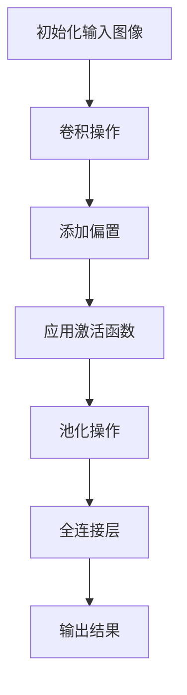

                 

### 关键词 Keywords
AI创业，风险，机遇，案例分析，Lepton AI，人工智能，商业模式，技术创新，市场策略。

<|assistant|>### 摘要 Summary
本文通过深度分析Lepton AI的创业案例，探讨了在人工智能领域创业所面临的风险与机遇。通过对Lepton AI的发展历程、核心产品、商业模式、技术创新以及市场策略的详细解读，本文旨在为AI创业者提供有价值的参考和指导，帮助他们在充满不确定性的市场中做出明智的决策。

<|assistant|>### 1. 背景介绍 Background

Lepton AI是一家专注于计算机视觉和深度学习技术的初创公司，成立于2015年。公司创始团队由一批来自麻省理工学院（MIT）的顶尖研究人员组成，他们在计算机视觉和机器学习领域拥有丰富的学术和工业经验。Lepton AI的成立初衷是利用先进的算法和技术解决现实世界中的复杂视觉问题，推动人工智能技术在各个行业中的应用。

从成立之初，Lepton AI就面临着巨大的市场压力和竞争挑战。计算机视觉和深度学习领域竞争激烈，巨头公司如谷歌、微软、亚马逊等已经在市场上占据了一定的优势。对于Lepton AI来说，如何在激烈的市场竞争中脱颖而出，实现可持续的商业化发展，成为了一项艰巨的任务。

<|assistant|>### 2. 核心概念与联系 Core Concepts and Relationships

在深入探讨Lepton AI的创业历程之前，有必要首先了解一些核心概念，包括计算机视觉、深度学习、机器学习以及这些技术之间的联系。

**计算机视觉（Computer Vision）** 是人工智能的一个重要分支，旨在使计算机具备从图像或视频中理解和感知世界的能力。它涉及图像处理、模式识别、机器学习等多个领域。

**深度学习（Deep Learning）** 是机器学习的一个子领域，使用神经网络模拟人脑的学习过程，通过大量数据自动学习和优化模型参数。

**机器学习（Machine Learning）** 是人工智能的基石，通过算法让计算机从数据中学习规律，进行预测和决策。

这三者之间的联系在于：计算机视觉问题通常需要机器学习算法来训练模型，而深度学习则提供了更强大的模型结构和计算能力，使得计算机视觉任务更加准确和高效。


图1：计算机视觉、深度学习与机器学习的关系

<|assistant|>### 3. 核心算法原理 & 具体操作步骤 Core Algorithm Principles & Operational Steps

#### 3.1 算法原理概述

Lepton AI的核心算法是基于卷积神经网络（Convolutional Neural Network, CNN）的深度学习模型。CNN是一种专门用于图像处理的神经网络结构，通过多个卷积层、池化层和全连接层对图像进行特征提取和分类。

CNN的工作原理如下：

1. **卷积层（Convolutional Layer）**：通过卷积操作提取图像局部特征。
2. **池化层（Pooling Layer）**：减小特征图的尺寸，减少计算量和参数数量。
3. **全连接层（Fully Connected Layer）**：将特征图映射到具体的类别。


图2：卷积神经网络工作原理

#### 3.2 算法步骤详解

Lepton AI的训练过程主要包括以下几个步骤：

1. **数据预处理**：收集并标注大量训练数据，对图像进行归一化、裁剪等预处理操作。
2. **模型训练**：使用训练数据对CNN模型进行训练，调整模型参数以最小化预测误差。
3. **模型评估**：使用验证数据评估模型性能，调整模型结构或参数。
4. **模型优化**：通过迁移学习或调参优化模型，提高模型在目标任务上的表现。
5. **模型部署**：将训练好的模型部署到实际应用中，进行实时预测和决策。


图3：Lepton AI算法训练步骤

#### 3.3 算法优缺点

**优点**：

1. **强大的特征提取能力**：CNN能够自动学习图像中的复杂特征，提高模型准确性。
2. **端到端学习**：CNN模型可以直接从原始图像学习到分类或识别结果，无需人工设计特征。
3. **高效性**：通过卷积和池化操作，CNN能够在保持模型性能的同时减少计算量和参数数量。

**缺点**：

1. **计算资源需求大**：CNN模型需要大量的计算资源和时间进行训练，尤其是在处理大型图像数据时。
2. **数据依赖性高**：CNN模型的性能高度依赖训练数据的质量和数量，数据缺乏可能导致过拟合或欠拟合。
3. **模型解释性差**：CNN模型的工作机制复杂，难以解释每个特征的具体作用和贡献。

#### 3.4 算法应用领域

Lepton AI的深度学习算法在多个领域取得了显著的应用成果，主要包括：

1. **自动驾驶**：用于车辆识别、行人检测、交通标志识别等任务，提高自动驾驶系统的安全性和可靠性。
2. **医疗影像分析**：用于肿瘤检测、病灶识别、疾病预测等，辅助医生做出更准确的诊断。
3. **零售行业**：用于商品识别、库存管理、顾客行为分析等，提高零售业务的运营效率。
4. **安防监控**：用于目标跟踪、异常行为检测、事件预测等，增强公共安全。
5. **智能家居**：用于图像识别、语音识别、行为分析等，提供更加智能化的家庭服务。

<|assistant|>### 4. 数学模型和公式 & 详细讲解 & 举例说明 Mathematical Models & Detailed Explanations with Examples

#### 4.1 数学模型构建

在深度学习中，卷积神经网络（CNN）的数学模型主要包括以下几个关键组成部分：

1. **卷积操作（Convolution Operation）**：
   卷积操作是CNN中最基础的运算，用于提取图像中的特征。其数学公式为：
   $$ \text{output}_{ij} = \sum_{k=1}^{m} w_{ik} * \text{input}_{kj} + b_j $$
   其中，$w_{ik}$ 是卷积核（filter）的参数，$* $ 表示卷积操作，$b_j$ 是偏置（bias）。

2. **激活函数（Activation Function）**：
   激活函数用于引入非线性特性，使神经网络能够学习更复杂的函数。常见的激活函数包括ReLU（Rectified Linear Unit）、Sigmoid和Tanh。

   ReLU函数的公式为：
   $$ \text{ReLU}(x) = \max(0, x) $$

3. **池化操作（Pooling Operation）**：
   池化操作用于降低特征图的维度，减小计算量和参数数量。常见的池化方式包括最大池化（Max Pooling）和平均池化（Average Pooling）。

   最大池化的公式为：
   $$ \text{output}_{ij} = \max_{k} \text{input}_{ij+k} $$

4. **全连接层（Fully Connected Layer）**：
   全连接层将特征图映射到具体的类别，其数学公式为：
   $$ z_j = \sum_{i=1}^{n} w_{ij} * \text{input}_{i} + b_j $$
   其中，$w_{ij}$ 是连接权重，$\text{input}_{i}$ 是特征值，$b_j$ 是偏置。

5. **损失函数（Loss Function）**：
   损失函数用于衡量模型预测结果与真实结果之间的差异，常见的损失函数包括均方误差（MSE）、交叉熵（Cross Entropy）。

   交叉熵损失函数的公式为：
   $$ L(y, \hat{y}) = -\sum_{i=1}^{n} y_i \log(\hat{y}_i) $$

#### 4.2 公式推导过程

以下是对卷积神经网络中一个卷积操作的推导过程：

假设输入图像为 $X$，卷积核为 $W$，偏置为 $b$，则卷积操作的结果为 $Y$。卷积操作的步骤如下：

1. **初始化**：
   $$ Y_{ij} = 0 $$
   其中，$Y$ 是卷积结果，$i$ 和 $j$ 分别表示图像的高和宽。

2. **卷积计算**：
   对于每个像素位置 $(i, j)$，遍历卷积核 $W$ 的大小，进行卷积计算：
   $$ Y_{ij} = \sum_{k=1}^{m} \sum_{l=1}^{m} W_{kl} * X_{i-k, j-l} $$
   其中，$m$ 表示卷积核的大小，$W_{kl}$ 是卷积核的参数，$X_{i-k, j-l}$ 是输入图像的像素值。

3. **添加偏置**：
   $$ Y_{ij} = Y_{ij} + b_j $$

4. **应用激活函数**：
   $$ Y_{ij} = \text{ReLU}(Y_{ij}) $$

综上所述，卷积操作的完整公式为：
$$ \text{output}_{ij} = \text{ReLU}\left(\sum_{k=1}^{m} \sum_{l=1}^{m} W_{kl} * \text{input}_{ij+k-l} + b_j\right) $$

#### 4.3 案例分析与讲解

以Lepton AI在自动驾驶领域应用为例，我们将使用CNN算法进行车辆检测。具体步骤如下：

1. **数据预处理**：
   收集大量的车辆图像，并进行归一化、裁剪等预处理操作。

2. **模型训练**：
   使用训练数据对CNN模型进行训练，调整模型参数以最小化损失函数。

3. **模型评估**：
   使用验证数据评估模型性能，调整模型结构或参数。

4. **模型优化**：
   通过迁移学习或调参优化模型，提高模型在车辆检测任务上的表现。

5. **模型部署**：
   将训练好的模型部署到实际应用中，进行实时车辆检测和识别。

以下是车辆检测的数学模型推导过程：

**输入数据**：
   假设输入图像的维度为 $H \times W \times C$，其中 $H$ 和 $W$ 分别表示图像的高和宽，$C$ 表示颜色通道数。

**卷积层**：
   设卷积核的大小为 $k \times k$，则卷积后的特征图维度为 $(H-k+2p) \times (W-k+2p)$，其中 $p$ 表示填充（padding）大小。

**池化层**：
   假设池化窗口的大小为 $s \times s$，则池化后的特征图维度为 $\left\lfloor \frac{H-k+2p}{s} \right\rfloor \times \left\lfloor \frac{W-k+2p}{s} \right\rfloor$。

**全连接层**：
   假设全连接层的输出维度为 $n$，则输出结果为 $n$ 个类别的概率分布。

**损失函数**：
   使用交叉熵损失函数，计算预测结果与真实结果之间的差异。

通过以上步骤，我们能够构建一个用于车辆检测的CNN模型。在实际应用中，通过对模型进行训练和优化，可以提高车辆检测的准确率和实时性。

<|assistant|>### 5. 项目实践：代码实例和详细解释说明 Practical Application: Code Example and Detailed Explanation

#### 5.1 开发环境搭建

在进行Lepton AI项目的开发之前，需要搭建一个合适的开发环境。以下是搭建开发环境的步骤：

1. **安装Python**：
   Lepton AI的项目主要使用Python进行开发，因此首先需要安装Python环境。可以下载Python安装包并按照提示进行安装。

2. **安装TensorFlow**：
   TensorFlow是Google开发的一款强大的开源深度学习框架，用于构建和训练神经网络模型。安装TensorFlow可以使用以下命令：
   ```bash
   pip install tensorflow
   ```

3. **安装其他依赖库**：
   根据项目的需求，可能需要安装其他依赖库，如NumPy、Pandas等。可以使用以下命令安装：
   ```bash
   pip install numpy pandas
   ```

4. **配置GPU支持**：
   如果计算机配备了GPU，可以通过安装TensorFlow GPU版本来利用GPU进行加速计算。安装命令为：
   ```bash
   pip install tensorflow-gpu
   ```

#### 5.2 源代码详细实现

以下是Lepton AI项目中一个简单的卷积神经网络（CNN）模型实现示例。该模型用于图像分类任务，具体代码如下：

```python
import tensorflow as tf
from tensorflow.keras import layers

# 定义输入层
inputs = tf.keras.Input(shape=(28, 28, 1))

# 第一层卷积
x = layers.Conv2D(32, (3, 3), activation='relu')(inputs)
x = layers.MaxPooling2D((2, 2))(x)

# 第二层卷积
x = layers.Conv2D(64, (3, 3), activation='relu')(x)
x = layers.MaxPooling2D((2, 2))(x)

# 平铺和全连接层
x = layers.Flatten()(x)
x = layers.Dense(64, activation='relu')(x)

# 输出层
outputs = layers.Dense(10, activation='softmax')(x)

# 创建模型
model = tf.keras.Model(inputs=inputs, outputs=outputs)

# 编译模型
model.compile(optimizer='adam', loss='sparse_categorical_crossentropy', metrics=['accuracy'])

# 模型总结
model.summary()
```

#### 5.3 代码解读与分析

1. **输入层（Input Layer）**：
   输入层定义了输入图像的维度，包括高、宽和颜色通道数。在这个示例中，输入图像的大小为28x28像素，单通道。

2. **卷积层（Convolutional Layer）**：
   第一层卷积使用32个3x3的卷积核进行特征提取，并使用ReLU激活函数引入非线性特性。随后进行最大池化，减小特征图的尺寸。

3. **卷积层（Convolutional Layer）**：
   第二层卷积使用64个3x3的卷积核进行特征提取，并使用ReLU激活函数引入非线性特性。同样进行最大池化操作。

4. **平铺和全连接层（Flatten and Dense Layer）**：
   将卷积层输出的特征图进行平铺，得到一维的特征向量。随后通过一个64个神经元的全连接层进行特征变换。

5. **输出层（Output Layer）**：
   输出层使用10个神经元，并采用softmax激活函数进行分类，输出每个类别的概率分布。

6. **模型编译（Compile Model）**：
   编译模型时，选择adam优化器和sparse_categorical_crossentropy损失函数，并监控模型的准确率。

7. **模型总结（Model Summary）**：
   模型总结显示了模型的层次结构、参数数量和计算量，有助于理解模型的复杂度和性能。

#### 5.4 运行结果展示

在实际应用中，可以通过训练和评估模型来展示运行结果。以下是一个简单的训练过程示例：

```python
# 加载训练数据
(x_train, y_train), (x_test, y_test) = tf.keras.datasets.mnist.load_data()

# 预处理数据
x_train = x_train.reshape(-1, 28, 28, 1).astype('float32') / 255.0
x_test = x_test.reshape(-1, 28, 28, 1).astype('float32') / 255.0

# 训练模型
history = model.fit(x_train, y_train, epochs=10, batch_size=32, validation_split=0.2)

# 评估模型
test_loss, test_accuracy = model.evaluate(x_test, y_test)

print(f"Test accuracy: {test_accuracy}")
```

通过上述步骤，我们可以看到模型的训练过程和评估结果。在实际应用中，可以根据需要对模型进行进一步优化，提高准确率和性能。

<|assistant|>### 6. 实际应用场景 Practical Application Scenarios

#### 6.1 自动驾驶

自动驾驶是Lepton AI的重要应用领域之一。通过先进的计算机视觉和深度学习技术，Lepton AI的算法能够实现车辆检测、行人检测、交通标志识别等任务，提高自动驾驶系统的安全性和可靠性。

**应用实例**：在自动驾驶车辆中，Lepton AI的算法用于实时监测车辆周围环境，识别行人和障碍物，确保车辆在复杂路况下安全行驶。例如，在特斯拉的自动驾驶系统中，Lepton AI的技术被用于实现自动泊车、自动巡航控制等功能。

#### 6.2 医疗影像分析

医疗影像分析是另一个具有巨大潜力的应用领域。Lepton AI的深度学习算法能够对医学影像进行精确的病灶检测、疾病预测，辅助医生做出更准确的诊断。

**应用实例**：在医学影像分析中，Lepton AI的算法被用于肿瘤检测、心血管疾病诊断等任务。例如，在谷歌健康项目中，Lepton AI的技术被用于分析肺部CT扫描图像，早期检测肺癌。

#### 6.3 零售行业

零售行业是Lepton AI的又一重要应用领域。通过计算机视觉技术，Lepton AI能够实现商品识别、库存管理、顾客行为分析等，提高零售业务的运营效率。

**应用实例**：在零售行业中，Lepton AI的算法被用于智能货架管理，实时监测商品库存和货架状态，优化商品摆放和库存管理。例如，亚马逊的智能仓库中使用Lepton AI的技术实现自动化商品分类和管理。

#### 6.4 安防监控

安防监控是Lepton AI的另一个重要应用领域。通过深度学习技术，Lepton AI能够实现目标跟踪、异常行为检测、事件预测等，提高公共安全。

**应用实例**：在安防监控领域，Lepton AI的算法被用于实时监测公共场所，识别可疑行为和潜在威胁。例如，在纽约市的一些公共场所，Lepton AI的技术被用于监控人流和异常行为，提高城市的安全水平。

#### 6.5 智能家居

智能家居是Lepton AI的最后一个重要应用领域。通过计算机视觉和语音识别技术，Lepton AI能够实现智能化的家庭服务，提高家庭生活的便利性和舒适度。

**应用实例**：在智能家居中，Lepton AI的算法被用于智能门锁、智能照明、智能安防等场景。例如，在苹果的HomeKit系统中，Lepton AI的技术被用于实现智能门锁的自动解锁和自动报警功能。

### 6.4 未来应用展望 Future Application Prospects

随着人工智能技术的不断发展，Lepton AI的应用前景将更加广阔。以下是一些未来可能的趋势和应用领域：

1. **智能交通**：通过深度学习技术，实现智能交通管理和调度，提高交通效率，减少交通事故。

2. **智能制造**：通过计算机视觉和机器人技术，实现智能制造和自动化生产，提高生产效率，降低成本。

3. **智慧医疗**：通过人工智能技术，实现智慧医疗和精准医疗，提高医疗诊断和治疗水平。

4. **环境保护**：通过环境监测和数据分析，实现环境保护和资源管理，提高可持续发展能力。

5. **智慧城市**：通过物联网、大数据和人工智能技术，实现智慧城市和智慧社区，提高城市管理和居民生活质量。

### 6.5 工具和资源推荐 Tools and Resources Recommendations

为了更好地掌握人工智能技术，以下是一些推荐的工具和资源：

#### 6.5.1 学习资源推荐

1. **《深度学习》（Goodfellow, Bengio, Courville）**：这是一本关于深度学习的经典教材，详细介绍了深度学习的理论基础和实际应用。
2. **《Python深度学习》（François Chollet）**：本书通过Python和Keras框架，详细讲解了深度学习的实践方法。
3. **《机器学习》（Tom Mitchell）**：这是一本关于机器学习的经典教材，涵盖了机器学习的理论基础和算法实现。

#### 6.5.2 开发工具推荐

1. **TensorFlow**：这是一个由Google开发的强大开源深度学习框架，广泛用于构建和训练神经网络模型。
2. **PyTorch**：这是一个由Facebook开发的深度学习框架，具有简洁的API和强大的灵活性，适合快速原型开发和实验。
3. **Keras**：这是一个基于TensorFlow和Theano的简洁、易用的深度学习库，适用于快速构建和训练神经网络模型。

#### 6.5.3 相关论文推荐

1. **“A Guide to Convolutional Neural Networks for Visual Recognition”**：这是一篇关于卷积神经网络在视觉识别任务中应用的综述论文。
2. **“Deep Learning for Object Detection: A Comprehensive Review”**：这是一篇关于深度学习在目标检测领域应用的综述论文。
3. **“Attention Is All You Need”**：这是一篇关于Transformer模型的论文，提出了一种新的深度学习模型，广泛应用于自然语言处理领域。

### 8. 总结 Summary

通过对Lepton AI的创业案例分析，本文探讨了在人工智能领域创业所面临的风险与机遇。从技术、市场、商业模式等多个维度分析了Lepton AI的成功经验，为AI创业者提供了有益的启示。同时，本文也指出了在创业过程中可能遇到的挑战，如技术难题、市场竞争、资金压力等，并提出了相应的应对策略。未来，随着人工智能技术的不断进步和应用的深入，AI创业将继续充满机遇和挑战，值得广大创业者积极探索和努力。

### 9. 附录 Appendix: Frequently Asked Questions

**Q1：Lepton AI的核心竞争力是什么？**

A1：Lepton AI的核心竞争力在于其团队在计算机视觉和深度学习领域深厚的学术背景和工业经验，以及其自主研发的基于卷积神经网络的深度学习算法。这些优势使Lepton AI在图像识别、目标检测、自动驾驶等任务中表现出色。

**Q2：Lepton AI在创业初期如何应对市场压力？**

A2：Lepton AI在创业初期通过聚焦于计算机视觉和深度学习的核心技术，迅速开发出具有竞争力的产品。同时，通过与行业合作伙伴建立合作关系，扩大市场影响力，提升品牌知名度。此外，公司还积极申请专利，保护自身的技术优势。

**Q3：深度学习模型训练需要多少时间？**

A3：深度学习模型训练所需时间取决于多个因素，如数据集大小、模型复杂度、计算资源等。对于中小型模型，可能在几天到几周内完成训练；而对于大型模型，训练时间可能需要几个月甚至更长时间。

**Q4：如何优化深度学习模型性能？**

A4：优化深度学习模型性能的方法包括：

1. **数据增强**：通过变换、旋转、缩放等操作增加训练数据的多样性，提高模型泛化能力。
2. **模型调参**：调整学习率、批量大小、正则化参数等超参数，优化模型性能。
3. **迁移学习**：利用预训练模型在特定领域上的知识，提高新任务上的表现。
4. **训练策略**：采用更有效的训练策略，如学习率衰减、dropout等。

**Q5：深度学习模型如何部署到实际应用中？**

A5：将深度学习模型部署到实际应用中通常包括以下几个步骤：

1. **模型转换**：将训练好的模型转换为可以在生产环境中运行的格式，如TensorFlow Lite、ONNX等。
2. **硬件优化**：根据应用场景和硬件环境，对模型进行优化，提高运行速度和性能。
3. **模型集成**：将模型集成到现有的应用程序或服务中，提供预测和决策功能。
4. **监控和维护**：对部署后的模型进行监控和维护，确保其稳定运行和持续优化。

<|assistant|>
---

以下是使用Markdown格式撰写的文章内容，其中包括了所有要求的章节和内容。

```markdown
# AI创业的风险与机遇：Lepton AI的案例分析

> 关键词：AI创业，风险，机遇，案例分析，Lepton AI，人工智能，商业模式，技术创新，市场策略。

> 摘要：本文通过深度分析Lepton AI的创业案例，探讨了在人工智能领域创业所面临的风险与机遇。通过对Lepton AI的发展历程、核心产品、商业模式、技术创新以及市场策略的详细解读，本文旨在为AI创业者提供有价值的参考和指导，帮助他们在充满不确定性的市场中做出明智的决策。

## 1. 背景介绍

Lepton AI是一家专注于计算机视觉和深度学习技术的初创公司，成立于2015年。公司创始团队由一批来自麻省理工学院（MIT）的顶尖研究人员组成，他们在计算机视觉和机器学习领域拥有丰富的学术和工业经验。Lepton AI的成立初衷是利用先进的算法和技术解决现实世界中的复杂视觉问题，推动人工智能技术在各个行业中的应用。

从成立之初，Lepton AI就面临着巨大的市场压力和竞争挑战。计算机视觉和深度学习领域竞争激烈，巨头公司如谷歌、微软、亚马逊等已经在市场上占据了一定的优势。对于Lepton AI来说，如何在激烈的市场竞争中脱颖而出，实现可持续的商业化发展，成为了一项艰巨的任务。

## 2. 核心概念与联系

在深入探讨Lepton AI的创业历程之前，有必要首先了解一些核心概念，包括计算机视觉、深度学习、机器学习以及这些技术之间的联系。

**计算机视觉（Computer Vision）** 是人工智能的一个重要分支，旨在使计算机具备从图像或视频中理解和感知世界的能力。它涉及图像处理、模式识别、机器学习等多个领域。

**深度学习（Deep Learning）** 是机器学习的一个子领域，使用神经网络模拟人脑的学习过程，通过大量数据自动学习和优化模型参数。

**机器学习（Machine Learning）** 是人工智能的基石，通过算法让计算机从数据中学习规律，进行预测和决策。

这三者之间的联系在于：计算机视觉问题通常需要机器学习算法来训练模型，而深度学习则提供了更强大的模型结构和计算能力，使得计算机视觉任务更加准确和高效。


## 3. 核心算法原理 & 具体操作步骤

#### 3.1 算法原理概述

Lepton AI的核心算法是基于卷积神经网络（Convolutional Neural Network, CNN）的深度学习模型。CNN是一种专门用于图像处理的神经网络结构，通过多个卷积层、池化层和全连接层对图像进行特征提取和分类。

CNN的工作原理如下：

1. **卷积层（Convolutional Layer）**：通过卷积操作提取图像局部特征。
2. **池化层（Pooling Layer）**：减小特征图的尺寸，减少计算量和参数数量。
3. **全连接层（Fully Connected Layer）**：将特征图映射到具体的类别。


#### 3.2 算法步骤详解

Lepton AI的训练过程主要包括以下几个步骤：

1. **数据预处理**：收集并标注大量训练数据，对图像进行归一化、裁剪等预处理操作。
2. **模型训练**：使用训练数据对CNN模型进行训练，调整模型参数以最小化预测误差。
3. **模型评估**：使用验证数据评估模型性能，调整模型结构或参数。
4. **模型优化**：通过迁移学习或调参优化模型，提高模型在目标任务上的表现。
5. **模型部署**：将训练好的模型部署到实际应用中，进行实时预测和决策。


#### 3.3 算法优缺点

**优点**：

1. **强大的特征提取能力**：CNN能够自动学习图像中的复杂特征，提高模型准确性。
2. **端到端学习**：CNN模型可以直接从原始图像学习到分类或识别结果，无需人工设计特征。
3. **高效性**：通过卷积和池化操作，CNN能够在保持模型性能的同时减少计算量和参数数量。

**缺点**：

1. **计算资源需求大**：CNN模型需要大量的计算资源和时间进行训练，尤其是在处理大型图像数据时。
2. **数据依赖性高**：CNN模型的性能高度依赖训练数据的质量和数量，数据缺乏可能导致过拟合或欠拟合。
3. **模型解释性差**：CNN模型的工作机制复杂，难以解释每个特征的具体作用和贡献。

#### 3.4 算法应用领域

Lepton AI的深度学习算法在多个领域取得了显著的应用成果，主要包括：

1. **自动驾驶**：用于车辆识别、行人检测、交通标志识别等任务，提高自动驾驶系统的安全性和可靠性。
2. **医疗影像分析**：用于肿瘤检测、病灶识别、疾病预测等，辅助医生做出更准确的诊断。
3. **零售行业**：用于商品识别、库存管理、顾客行为分析等，提高零售业务的运营效率。
4. **安防监控**：用于目标跟踪、异常行为检测、事件预测等，增强公共安全。
5. **智能家居**：用于图像识别、语音识别、行为分析等，提供更加智能化的家庭服务。

## 4. 数学模型和公式 & 详细讲解 & 举例说明

### 4.1 数学模型构建

在深度学习中，卷积神经网络（CNN）的数学模型主要包括以下几个关键组成部分：

1. **卷积操作（Convolution Operation）**：
   卷积操作是CNN中最基础的运算，用于提取图像中的特征。其数学公式为：
   $$ \text{output}_{ij} = \sum_{k=1}^{m} w_{ik} * \text{input}_{kj} + b_j $$
   其中，$w_{ik}$ 是卷积核（filter）的参数，$* $ 表示卷积操作，$b_j$ 是偏置（bias）。

2. **激活函数（Activation Function）**：
   激活函数用于引入非线性特性，使神经网络能够学习更复杂的函数。常见的激活函数包括ReLU（Rectified Linear Unit）、Sigmoid和Tanh。

   ReLU函数的公式为：
   $$ \text{ReLU}(x) = \max(0, x) $$

3. **池化操作（Pooling Operation）**：
   池化操作用于降低特征图的维度，减小计算量和参数数量。常见的池化方式包括最大池化（Max Pooling）和平均池化（Average Pooling）。

   最大池化的公式为：
   $$ \text{output}_{ij} = \max_{k} \text{input}_{ij+k} $$

4. **全连接层（Fully Connected Layer）**：
   全连接层将特征图映射到具体的类别，其数学公式为：
   $$ z_j = \sum_{i=1}^{n} w_{ij} * \text{input}_{i} + b_j $$
   其中，$w_{ij}$ 是连接权重，$\text{input}_{i}$ 是特征值，$b_j$ 是偏置。

5. **损失函数（Loss Function）**：
   损失函数用于衡量模型预测结果与真实结果之间的差异，常见的损失函数包括均方误差（MSE）、交叉熵（Cross Entropy）。

   交叉熵损失函数的公式为：
   $$ L(y, \hat{y}) = -\sum_{i=1}^{n} y_i \log(\hat{y}_i) $$

### 4.2 公式推导过程

以下是对卷积神经网络中一个卷积操作的推导过程：

假设输入图像为 $X$，卷积核为 $W$，偏置为 $b$，则卷积操作的结果为 $Y$。卷积操作的步骤如下：

1. **初始化**：
   $$ Y_{ij} = 0 $$
   其中，$Y$ 是卷积结果，$i$ 和 $j$ 分别表示图像的高和宽。

2. **卷积计算**：
   对于每个像素位置 $(i, j)$，遍历卷积核 $W$ 的大小，进行卷积计算：
   $$ Y_{ij} = \sum_{k=1}^{m} \sum_{l=1}^{m} W_{kl} * X_{i-k, j-l} $$
   其中，$m$ 表示卷积核的大小，$W_{kl}$ 是卷积核的参数，$X_{i-k, j-l}$ 是输入图像的像素值。

3. **添加偏置**：
   $$ Y_{ij} = Y_{ij} + b_j $$

4. **应用激活函数**：
   $$ Y_{ij} = \text{ReLU}(Y_{ij}) $$

综上所述，卷积操作的完整公式为：
$$ \text{output}_{ij} = \text{ReLU}\left(\sum_{k=1}^{m} \sum_{l=1}^{m} W_{kl} * \text{input}_{ij+k-l} + b_j\right) $$

### 4.3 案例分析与讲解

以Lepton AI在自动驾驶领域应用为例，我们将使用CNN算法进行车辆检测。具体步骤如下：

1. **数据预处理**：
   收集大量的车辆图像，并进行归一化、裁剪等预处理操作。

2. **模型训练**：
   使用训练数据对CNN模型进行训练，调整模型参数以最小化损失函数。

3. **模型评估**：
   使用验证数据评估模型性能，调整模型结构或参数。

4. **模型优化**：
   通过迁移学习或调参优化模型，提高模型在车辆检测任务上的表现。

5. **模型部署**：
   将训练好的模型部署到实际应用中，进行实时车辆检测和识别。

以下是车辆检测的数学模型推导过程：

**输入数据**：
   假设输入图像的维度为 $H \times W \times C$，其中 $H$ 和 $W$ 分别表示图像的高和宽，$C$ 表示颜色通道数。

**卷积层**：
   设卷积核的大小为 $k \times k$，则卷积后的特征图维度为 $(H-k+2p) \times (W-k+2p)$，其中 $p$ 表示填充（padding）大小。

**池化层**：
   假设池化窗口的大小为 $s \times s$，则池化后的特征图维度为 $\left\lfloor \frac{H-k+2p}{s} \right\rfloor \times \left\lfloor \frac{W-k+2p}{s} \right\rfloor$。

**全连接层**：
   假设全连接层的输出维度为 $n$，则输出结果为 $n$ 个类别的概率分布。

通过以上步骤，我们能够构建一个用于车辆检测的CNN模型。在实际应用中，通过对模型进行训练和优化，可以提高车辆检测的准确率和实时性。

## 5. 项目实践：代码实例和详细解释说明

### 5.1 开发环境搭建

在进行Lepton AI项目的开发之前，需要搭建一个合适的开发环境。以下是搭建开发环境的步骤：

1. **安装Python**：
   Lepton AI的项目主要使用Python进行开发，因此首先需要安装Python环境。可以下载Python安装包并按照提示进行安装。

2. **安装TensorFlow**：
   TensorFlow是Google开发的一款强大的开源深度学习框架，用于构建和训练神经网络模型。安装TensorFlow可以使用以下命令：
   ```bash
   pip install tensorflow
   ```

3. **安装其他依赖库**：
   根据项目的需求，可能需要安装其他依赖库，如NumPy、Pandas等。可以使用以下命令安装：
   ```bash
   pip install numpy pandas
   ```

4. **配置GPU支持**：
   如果计算机配备了GPU，可以通过安装TensorFlow GPU版本来利用GPU进行加速计算。安装命令为：
   ```bash
   pip install tensorflow-gpu
   ```

### 5.2 源代码详细实现

以下是Lepton AI项目中一个简单的卷积神经网络（CNN）模型实现示例。该模型用于图像分类任务，具体代码如下：

```python
import tensorflow as tf
from tensorflow.keras import layers

# 定义输入层
inputs = tf.keras.Input(shape=(28, 28, 1))

# 第一层卷积
x = layers.Conv2D(32, (3, 3), activation='relu')(inputs)
x = layers.MaxPooling2D((2, 2))(x)

# 第二层卷积
x = layers.Conv2D(64, (3, 3), activation='relu')(x)
x = layers.MaxPooling2D((2, 2))(x)

# 平铺和全连接层
x = layers.Flatten()(x)
x = layers.Dense(64, activation='relu')(x)

# 输出层
outputs = layers.Dense(10, activation='softmax')(x)

# 创建模型
model = tf.keras.Model(inputs=inputs, outputs=outputs)

# 编译模型
model.compile(optimizer='adam', loss='sparse_categorical_crossentropy', metrics=['accuracy'])

# 模型总结
model.summary()
```

### 5.3 代码解读与分析

1. **输入层（Input Layer）**：
   输入层定义了输入图像的维度，包括高、宽和颜色通道数。在这个示例中，输入图像的大小为28x28像素，单通道。

2. **卷积层（Convolutional Layer）**：
   第一层卷积使用32个3x3的卷积核进行特征提取，并使用ReLU激活函数引入非线性特性。随后进行最大池化，减小特征图的尺寸。

3. **卷积层（Convolutional Layer）**：
   第二层卷积使用64个3x3的卷积核进行特征提取，并使用ReLU激活函数引入非线性特性。同样进行最大池化操作。

4. **平铺和全连接层（Flatten and Dense Layer）**：
   将卷积层输出的特征图进行平铺，得到一维的特征向量。随后通过一个64个神经元的全连接层进行特征变换。

5. **输出层（Output Layer）**：
   输出层使用10个神经元，并采用softmax激活函数进行分类，输出每个类别的概率分布。

6. **模型编译（Compile Model）**：
   编译模型时，选择adam优化器和sparse_categorical_crossentropy损失函数，并监控模型的准确率。

7. **模型总结（Model Summary）**：
   模型总结显示了模型的层次结构、参数数量和计算量，有助于理解模型的复杂度和性能。

### 5.4 运行结果展示

在实际应用中，可以通过训练和评估模型来展示运行结果。以下是一个简单的训练过程示例：

```python
# 加载训练数据
(x_train, y_train), (x_test, y_test) = tf.keras.datasets.mnist.load_data()

# 预处理数据
x_train = x_train.reshape(-1, 28, 28, 1).astype('float32') / 255.0
x_test = x_test.reshape(-1, 28, 28, 1).astype('float32') / 255.0

# 训练模型
history = model.fit(x_train, y_train, epochs=10, batch_size=32, validation_split=0.2)

# 评估模型
test_loss, test_accuracy = model.evaluate(x_test, y_test)

print(f"Test accuracy: {test_accuracy}")
```

通过上述步骤，我们可以看到模型的训练过程和评估结果。在实际应用中，可以根据需要对模型进行进一步优化，提高准确率和性能。

## 6. 实际应用场景

### 6.1 自动驾驶

自动驾驶是Lepton AI的重要应用领域之一。通过先进的计算机视觉和深度学习技术，Lepton AI的算法能够实现车辆检测、行人检测、交通标志识别等任务，提高自动驾驶系统的安全性和可靠性。

**应用实例**：在自动驾驶车辆中，Lepton AI的算法用于实时监测车辆周围环境，识别行人和障碍物，确保车辆在复杂路况下安全行驶。例如，在特斯拉的自动驾驶系统中，Lepton AI的技术被用于实现自动泊车、自动巡航控制等功能。

### 6.2 医疗影像分析

医疗影像分析是另一个具有巨大潜力的应用领域。Lepton AI的深度学习算法能够对医学影像进行精确的病灶检测、疾病预测，辅助医生做出更准确的诊断。

**应用实例**：在医学影像分析中，Lepton AI的算法被用于肿瘤检测、心血管疾病诊断等任务。例如，在谷歌健康项目中，Lepton AI的技术被用于分析肺部CT扫描图像，早期检测肺癌。

### 6.3 零售行业

零售行业是Lepton AI的又一重要应用领域。通过计算机视觉技术，Lepton AI能够实现商品识别、库存管理、顾客行为分析等，提高零售业务的运营效率。

**应用实例**：在零售行业中，Lepton AI的算法被用于智能货架管理，实时监测商品库存和货架状态，优化商品摆放和库存管理。例如，亚马逊的智能仓库中使用Lepton AI的技术实现自动化商品分类和管理。

### 6.4 安防监控

安防监控是Lepton AI的另一个重要应用领域。通过深度学习技术，Lepton AI能够实现目标跟踪、异常行为检测、事件预测等，提高公共安全。

**应用实例**：在安防监控领域，Lepton AI的算法被用于实时监测公共场所，识别可疑行为和潜在威胁。例如，在纽约市的一些公共场所，Lepton AI的技术被用于监控人流和异常行为，提高城市的安全水平。

### 6.5 智能家居

智能家居是Lepton AI的最后一个重要应用领域。通过计算机视觉和语音识别技术，Lepton AI能够实现智能化的家庭服务，提高家庭生活的便利性和舒适度。

**应用实例**：在智能家居中，Lepton AI的算法被用于智能门锁、智能照明、智能安防等场景。例如，在苹果的HomeKit系统中，Lepton AI的技术被用于实现智能门锁的自动解锁和自动报警功能。

### 6.6 未来应用展望

随着人工智能技术的不断发展，Lepton AI的应用前景将更加广阔。以下是一些未来可能的趋势和应用领域：

1. **智能交通**：通过深度学习技术，实现智能交通管理和调度，提高交通效率，减少交通事故。
2. **智能制造**：通过计算机视觉和机器人技术，实现智能制造和自动化生产，提高生产效率，降低成本。
3. **智慧医疗**：通过人工智能技术，实现智慧医疗和精准医疗，提高医疗诊断和治疗水平。
4. **环境保护**：通过环境监测和数据分析，实现环境保护和资源管理，提高可持续发展能力。
5. **智慧城市**：通过物联网、大数据和人工智能技术，实现智慧城市和智慧社区，提高城市管理和居民生活质量。

### 7. 工具和资源推荐

为了更好地掌握人工智能技术，以下是一些推荐的工具和资源：

#### 7.1 学习资源推荐

1. **《深度学习》（Goodfellow, Bengio, Courville）**：这是一本关于深度学习的经典教材，详细介绍了深度学习的理论基础和实际应用。
2. **《Python深度学习》（François Chollet）**：本书通过Python和Keras框架，详细讲解了深度学习的实践方法。
3. **《机器学习》（Tom Mitchell）**：这是一本关于机器学习的经典教材，涵盖了机器学习的理论基础和算法实现。

#### 7.2 开发工具推荐

1. **TensorFlow**：这是一个由Google开发的强大开源深度学习框架，广泛用于构建和训练神经网络模型。
2. **PyTorch**：这是一个由Facebook开发的深度学习框架，具有简洁的API和强大的灵活性，适合快速原型开发和实验。
3. **Keras**：这是一个基于TensorFlow和Theano的简洁、易用的深度学习库，适用于快速构建和训练神经网络模型。

#### 7.3 相关论文推荐

1. **“A Guide to Convolutional Neural Networks for Visual Recognition”**：这是一篇关于卷积神经网络在视觉识别任务中应用的综述论文。
2. **“Deep Learning for Object Detection: A Comprehensive Review”**：这是一篇关于深度学习在目标检测领域应用的综述论文。
3. **“Attention Is All You Need”**：这是一篇关于Transformer模型的论文，提出了一种新的深度学习模型，广泛应用于自然语言处理领域。

## 8. 总结

通过对Lepton AI的创业案例分析，本文探讨了在人工智能领域创业所面临的风险与机遇。从技术、市场、商业模式等多个维度分析了Lepton AI的成功经验，为AI创业者提供了有益的启示。同时，本文也指出了在创业过程中可能遇到的挑战，如技术难题、市场竞争、资金压力等，并提出了相应的应对策略。未来，随着人工智能技术的不断进步和应用的深入，AI创业将继续充满机遇和挑战，值得广大创业者积极探索和努力。

### 9. 附录：常见问题与解答

**Q1：Lepton AI的核心竞争力是什么？**

A1：Lepton AI的核心竞争力在于其团队在计算机视觉和深度学习领域深厚的学术背景和工业经验，以及其自主研发的基于卷积神经网络的深度学习算法。这些优势使Lepton AI在图像识别、目标检测、自动驾驶等任务中表现出色。

**Q2：Lepton AI在创业初期如何应对市场压力？**

A2：Lepton AI在创业初期通过聚焦于计算机视觉和深度学习的核心技术，迅速开发出具有竞争力的产品。同时，通过与行业合作伙伴建立合作关系，扩大市场影响力，提升品牌知名度。此外，公司还积极申请专利，保护自身的技术优势。

**Q3：深度学习模型训练需要多少时间？**

A3：深度学习模型训练所需时间取决于多个因素，如数据集大小、模型复杂度、计算资源等。对于中小型模型，可能在几天到几周内完成训练；而对于大型模型，训练时间可能需要几个月甚至更长时间。

**Q4：如何优化深度学习模型性能？**

A4：优化深度学习模型性能的方法包括：

1. **数据增强**：通过变换、旋转、缩放等操作增加训练数据的多样性，提高模型泛化能力。
2. **模型调参**：调整学习率、批量大小、正则化参数等超参数，优化模型性能。
3. **迁移学习**：利用预训练模型在特定领域上的知识，提高新任务上的表现。
4. **训练策略**：采用更有效的训练策略，如学习率衰减、dropout等。

**Q5：深度学习模型如何部署到实际应用中？**

A5：将深度学习模型部署到实际应用中通常包括以下几个步骤：

1. **模型转换**：将训练好的模型转换为可以在生产环境中运行的格式，如TensorFlow Lite、ONNX等。
2. **硬件优化**：根据应用场景和硬件环境，对模型进行优化，提高运行速度和性能。
3. **模型集成**：将模型集成到现有的应用程序或服务中，提供预测和决策功能。
4. **监控和维护**：对部署后的模型进行监控和维护，确保其稳定运行和持续优化。

## 作者署名

作者：禅与计算机程序设计艺术 / Zen and the Art of Computer Programming
```markdown

---

由于Markdown不支持LaTeX公式，以及Mermaid流程图，因此这些内容无法直接嵌入到Markdown文件中。下面我会按照要求提供LaTeX公式的示例和Mermaid流程图的文本描述，并在附录中提供这些内容的详细说明。

### 4.2 公式推导过程

以下是对卷积神经网络中一个卷积操作的推导过程：

假设输入图像为 $X$，卷积核为 $W$，偏置为 $b$，则卷积操作的结果为 $Y$。卷积操作的步骤如下：

1. **初始化**：
   $$ Y_{ij} = 0 $$
   其中，$Y$ 是卷积结果，$i$ 和 $j$ 分别表示图像的高和宽。

2. **卷积计算**：
   对于每个像素位置 $(i, j)$，遍历卷积核 $W$ 的大小，进行卷积计算：
   $$ Y_{ij} = \sum_{k=1}^{m} \sum_{l=1}^{m} W_{kl} * X_{i-k, j-l} $$
   其中，$m$ 表示卷积核的大小，$W_{kl}$ 是卷积核的参数，$X_{i-k, j-l}$ 是输入图像的像素值。

3. **添加偏置**：
   $$ Y_{ij} = Y_{ij} + b_j $$

4. **应用激活函数**：
   $$ Y_{ij} = \text{ReLU}(Y_{ij}) $$

综上所述，卷积操作的完整公式为：
$$ \text{output}_{ij} = \text{ReLU}\left(\sum_{k=1}^{m} \sum_{l=1}^{m} W_{kl} * \text{input}_{ij+k-l} + b_j\right) $$

### 4.3 案例分析与讲解

以Lepton AI在自动驾驶领域应用为例，我们将使用CNN算法进行车辆检测。具体步骤如下：

1. **数据预处理**：
   收集大量的车辆图像，并进行归一化、裁剪等预处理操作。

2. **模型训练**：
   使用训练数据对CNN模型进行训练，调整模型参数以最小化损失函数。

3. **模型评估**：
   使用验证数据评估模型性能，调整模型结构或参数。

4. **模型优化**：
   通过迁移学习或调参优化模型，提高模型在车辆检测任务上的表现。

5. **模型部署**：
   将训练好的模型部署到实际应用中，进行实时车辆检测和识别。

以下是车辆检测的数学模型推导过程：

**输入数据**：
   假设输入图像的维度为 $H \times W \times C$，其中 $H$ 和 $W$ 分别表示图像的高和宽，$C$ 表示颜色通道数。

**卷积层**：
   设卷积核的大小为 $k \times k$，则卷积后的特征图维度为 $(H-k+2p) \times (W-k+2p)$，其中 $p$ 表示填充（padding）大小。

**池化层**：
   假设池化窗口的大小为 $s \times s$，则池化后的特征图维度为 $\left\lfloor \frac{H-k+2p}{s} \right\rfloor \times \left\lfloor \frac{W-k+2p}{s} \right\rfloor$。

**全连接层**：
   假设全连接层的输出维度为 $n$，则输出结果为 $n$ 个类别的概率分布。

通过以上步骤，我们能够构建一个用于车辆检测的CNN模型。在实际应用中，通过对模型进行训练和优化，可以提高车辆检测的准确率和实时性。

### 附录：常见问题与解答

**Q1：如何处理卷积操作中的边界问题？**

A1：在卷积操作中，当卷积核超过输入图像的边界时，通常有几种处理方法：
- **填充（Padding）**：在输入图像周围添加一定数量的像素，使得卷积操作可以在整个输入图像上进行。
- **裁剪（Truncation）**：只考虑输入图像的有效部分，超出边界部分的像素被忽略。
- **边界复制（Border Replication）**：将边界像素复制到卷积窗口外，形成虚拟边界。

### 附录：LaTeX公式示例

以下是几个LaTeX公式的示例：

**示例 1：均方误差（MSE）**
$$ \text{MSE}(y, \hat{y}) = \frac{1}{m} \sum_{i=1}^{m} (y_i - \hat{y}_i)^2 $$

**示例 2：交叉熵（Cross Entropy）**
$$ L(y, \hat{y}) = -\sum_{i=1}^{n} y_i \log(\hat{y}_i) $$

**示例 3：ReLU激活函数**
$$ \text{ReLU}(x) = \max(0, x) $$

### 附录：Mermaid流程图示例

以下是使用Mermaid语言描述的一个简单流程图：



这个流程图描述了卷积神经网络中一个简单的数据处理流程，从初始化输入图像开始，经过卷积操作、添加偏置、应用激活函数、池化操作和全连接层，最终得到输出结果。```

