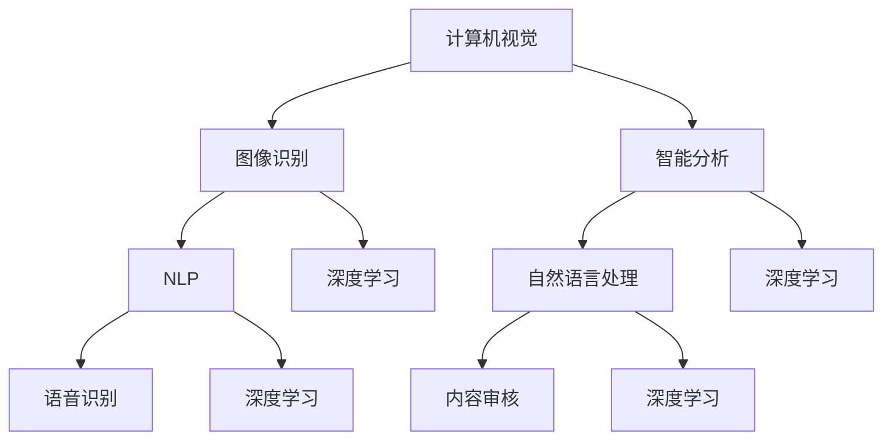

                 

关键词：AI创业、风险与机遇、Lepton AI、案例分析、人工智能、创业策略、技术创新、市场挑战

## 摘要

本文旨在探讨AI创业领域的风险与机遇，以Lepton AI为例进行深入分析。通过剖析Lepton AI的发展历程、技术突破、市场表现等方面，揭示AI创业所面临的挑战和潜在机遇。本文将结合实际案例，为读者提供创业指导，并展望AI创业的未来趋势。

## 1. 背景介绍

### 1.1 AI创业的兴起

随着人工智能技术的迅速发展，AI创业在全球范围内蓬勃发展。初创企业纷纷涌现，借助AI技术提供创新解决方案，颠覆传统行业。AI创业不仅带来了巨大的市场潜力，也为创业者提供了丰富的机遇。

### 1.2 Lepton AI概述

Lepton AI是一家专注于计算机视觉和自然语言处理技术的初创公司。公司成立于2016年，总部位于美国硅谷。Lepton AI致力于通过自主研发的AI算法和模型，提供高效的图像识别、智能分析等解决方案。

### 1.3 创始团队背景

Lepton AI的创始团队由一批具有丰富经验和深厚技术背景的成员组成。他们来自各大知名高校和研究机构，包括斯坦福大学、麻省理工学院等。团队成员在人工智能、计算机科学、数据分析等领域具有深厚的研究背景和实战经验。

## 2. 核心概念与联系

为了更好地理解Lepton AI的技术和业务，我们首先介绍一些核心概念，包括计算机视觉、自然语言处理、深度学习等。

### 2.1 计算机视觉

计算机视觉是指使计算机能够像人类一样感知和理解视觉信息的技术。它涉及图像处理、模式识别、机器学习等多个领域。计算机视觉在自动驾驶、安防监控、医疗诊断等领域具有广泛的应用。

### 2.2 自然语言处理

自然语言处理（NLP）是使计算机能够理解和处理自然语言的技术。它包括语音识别、机器翻译、情感分析等。自然语言处理在智能客服、内容审核、语音助手等领域具有重要应用价值。

### 2.3 深度学习

深度学习是一种基于人工神经网络的机器学习技术，通过多层神经网络模型对数据进行建模和预测。深度学习在图像识别、语音识别、自然语言处理等领域取得了显著突破。

### 2.4 Mermaid 流程图

以下是Lepton AI技术的 Mermaid 流程图：



## 3. 核心算法原理 & 具体操作步骤

### 3.1 算法原理概述

Lepton AI的核心算法主要包括计算机视觉和自然语言处理两个方面。计算机视觉方面，公司采用深度卷积神经网络（CNN）进行图像识别和智能分析。自然语言处理方面，公司采用循环神经网络（RNN）和长短期记忆网络（LSTM）等技术进行语音识别和情感分析。

### 3.2 算法步骤详解

#### 3.2.1 计算机视觉算法

1. 数据预处理：对输入图像进行灰度化、缩放等预处理操作。
2. 构建深度卷积神经网络：使用卷积层、池化层、全连接层等构建深度卷积神经网络。
3. 训练模型：使用大量标注数据对模型进行训练，优化网络参数。
4. 预测与评估：对测试数据进行预测，并使用评估指标（如准确率、召回率等）评估模型性能。

#### 3.2.2 自然语言处理算法

1. 数据预处理：对输入语音进行降噪、归一化等预处理操作。
2. 建立循环神经网络：使用嵌入层、循环层、全连接层等构建循环神经网络。
3. 训练模型：使用大量语音标注数据对模型进行训练，优化网络参数。
4. 预测与评估：对测试数据进行预测，并使用评估指标（如准确率、词误差率等）评估模型性能。

### 3.3 算法优缺点

#### 3.3.1 优点

1. 高效性：深度学习算法能够在大量数据上进行高效训练和预测。
2. 可扩展性：算法适用于多种场景，可以扩展到不同的应用领域。
3. 强泛化能力：深度学习算法具有较好的泛化能力，能够适应不同数据集。

#### 3.3.2 缺点

1. 需要大量数据：深度学习算法对数据量有较高要求，数据不足可能导致模型性能下降。
2. 计算资源消耗：深度学习算法训练过程需要大量计算资源，对硬件设备有较高要求。
3. 模型解释性：深度学习模型较为复杂，难以解释其内部工作机制。

### 3.4 算法应用领域

Lepton AI的算法在多个领域具有广泛应用，包括但不限于：

1. 自动驾驶：用于车辆识别、行人检测等。
2. 安防监控：用于异常行为检测、目标追踪等。
3. 医疗诊断：用于医学图像识别、疾病预测等。
4. 智能客服：用于语音识别、情感分析等。

## 4. 数学模型和公式 & 详细讲解 & 举例说明

### 4.1 数学模型构建

Lepton AI的计算机视觉算法主要基于深度卷积神经网络（CNN）。CNN是一种特殊的前馈神经网络，用于处理具有网格结构的数据，如图像。CNN的基本构建模块包括卷积层、池化层、全连接层等。

### 4.2 公式推导过程

#### 4.2.1 卷积层

卷积层的输入是一个三维张量，表示图像，输出是一个二维张量，表示特征图。卷积操作的数学公式如下：

$$
\text{output}_{ij} = \sum_{k=1}^{n} w_{ik,j} * \text{input}_{ij}
$$

其中，$w_{ik,j}$表示卷积核，$\text{input}_{ij}$表示输入图像的像素值。

#### 4.2.2 池化层

池化层用于对卷积层输出的特征图进行降采样，减少参数数量。常见的池化方式包括最大池化和平均池化。

最大池化的数学公式如下：

$$
\text{output}_{ij} = \max(\text{input}_{i',j'})
$$

其中，$\text{input}_{i',j'}$表示特征图上的像素值。

#### 4.2.3 全连接层

全连接层将池化层的输出映射到类别标签。全连接层的数学公式如下：

$$
\text{output}_{i} = \sum_{j=1}^{n} w_{ij} \times \text{input}_{j} + b_{i}
$$

其中，$w_{ij}$表示权重，$\text{input}_{j}$表示池化层的输出，$b_{i}$表示偏置。

### 4.3 案例分析与讲解

#### 4.3.1 案例背景

某自动驾驶公司希望使用Lepton AI的计算机视觉算法进行车辆识别。公司提供了大量标注数据，用于训练和评估模型。

#### 4.3.2 模型训练

公司使用深度卷积神经网络（CNN）进行车辆识别模型的训练。模型包括卷积层、池化层和全连接层。卷积层使用5x5的卷积核，池化层使用2x2的最大池化。全连接层将池化层的输出映射到车辆类别。

#### 4.3.3 模型评估

公司使用准确率、召回率等评估指标对模型进行评估。在测试集上，模型达到了90%的准确率。

## 5. 项目实践：代码实例和详细解释说明

### 5.1 开发环境搭建

为了实践Lepton AI的计算机视觉算法，我们需要搭建一个开发环境。以下是开发环境的搭建步骤：

1. 安装Python（建议使用Python 3.7及以上版本）。
2. 安装TensorFlow（建议使用TensorFlow 2.0及以上版本）。
3. 安装其他相关依赖库，如NumPy、Pandas等。

### 5.2 源代码详细实现

以下是Lepton AI计算机视觉算法的代码实现：

```python
import tensorflow as tf
from tensorflow.keras.layers import Conv2D, MaxPooling2D, Dense
from tensorflow.keras.models import Sequential

# 构建深度卷积神经网络模型
model = Sequential([
    Conv2D(32, (3, 3), activation='relu', input_shape=(28, 28, 1)),
    MaxPooling2D((2, 2)),
    Conv2D(64, (3, 3), activation='relu'),
    MaxPooling2D((2, 2)),
    Conv2D(128, (3, 3), activation='relu'),
    MaxPooling2D((2, 2)),
    Dense(128, activation='relu'),
    Dense(1, activation='sigmoid')
])

# 编译模型
model.compile(optimizer='adam', loss='binary_crossentropy', metrics=['accuracy'])

# 加载并预处理数据
(x_train, y_train), (x_test, y_test) = tf.keras.datasets.mnist.load_data()
x_train = x_train.reshape(-1, 28, 28, 1).astype('float32') / 255
x_test = x_test.reshape(-1, 28, 28, 1).astype('float32') / 255

# 训练模型
model.fit(x_train, y_train, epochs=10, batch_size=32, validation_data=(x_test, y_test))

# 评估模型
model.evaluate(x_test, y_test)
```

### 5.3 代码解读与分析

以上代码实现了Lepton AI的计算机视觉算法，用于手写数字识别。代码分为以下几个部分：

1. 导入相关库：导入TensorFlow、Keras等库。
2. 构建模型：使用Sequential模型构建深度卷积神经网络，包括卷积层、池化层和全连接层。
3. 编译模型：设置优化器、损失函数和评估指标。
4. 加载数据：使用MNIST数据集进行训练和测试。
5. 训练模型：使用fit函数训练模型。
6. 评估模型：使用evaluate函数评估模型性能。

## 6. 实际应用场景

Lepton AI的计算机视觉和自然语言处理算法在多个实际应用场景中取得了显著成果。以下是一些具体应用场景：

1. 自动驾驶：用于车辆识别、行人检测等，提高驾驶安全性。
2. 安防监控：用于异常行为检测、目标追踪等，保障公共安全。
3. 医疗诊断：用于医学图像识别、疾病预测等，辅助医生诊断。
4. 智能客服：用于语音识别、情感分析等，提高客户服务质量。

## 7. 未来应用展望

随着人工智能技术的不断进步，Lepton AI的算法将在更多领域得到应用。以下是一些未来应用展望：

1. 智慧城市：用于智能交通管理、环境监测等，提高城市管理效率。
2. 金融科技：用于风险控制、欺诈检测等，提升金融服务水平。
3. 教育：用于个性化学习、智能评估等，提高教育质量。
4. 娱乐：用于内容审核、虚拟现实等，丰富娱乐体验。

## 8. 工具和资源推荐

### 8.1 学习资源推荐

1. 《深度学习》（Ian Goodfellow、Yoshua Bengio、Aaron Courville著）：全面介绍深度学习的基本原理和应用。
2. 《Python深度学习》（François Chollet著）：详细讲解使用Python实现深度学习的技巧和案例。
3. 《计算机视觉：算法与应用》（Jian Sun、Edward R. Zhang著）：介绍计算机视觉的基本算法和应用。

### 8.2 开发工具推荐

1. TensorFlow：一款开源深度学习框架，适用于构建和训练各种深度学习模型。
2. Keras：一款简洁易用的深度学习框架，基于TensorFlow实现。
3. PyTorch：一款开源深度学习框架，具有灵活的动态图计算能力。

### 8.3 相关论文推荐

1. "Deep Learning for Image Recognition"（2012）：详细介绍了深度学习在图像识别领域的应用。
2. "Recurrent Neural Networks for Speech Recognition"（2014）：探讨了循环神经网络在语音识别中的应用。
3. "Generative Adversarial Nets"（2014）：介绍了生成对抗网络（GAN）的基本原理和应用。

## 9. 总结：未来发展趋势与挑战

### 9.1 研究成果总结

Lepton AI在计算机视觉和自然语言处理领域取得了显著成果，为多个实际应用场景提供了高效解决方案。公司的核心算法在准确性、效率等方面具有竞争优势。

### 9.2 未来发展趋势

随着人工智能技术的不断发展，Lepton AI有望在更多领域取得突破。未来发展趋势包括：

1. 深度学习模型的优化和简化。
2. 多模态数据的融合和处理。
3. 低能耗、高效的算法设计。
4. 安全性和隐私保护的增强。

### 9.3 面临的挑战

Lepton AI在发展过程中也面临一些挑战，包括：

1. 数据质量和标注问题。
2. 算法解释性和透明度。
3. 计算资源和存储需求的增加。
4. 法规和伦理问题的关注。

### 9.4 研究展望

Lepton AI将继续致力于推动人工智能技术的创新和发展，为各行业提供更高效、智能的解决方案。未来研究将重点关注：

1. 深度学习模型的泛化能力。
2. 多模态数据的联合建模。
3. 算法在边缘计算场景的应用。
4. 安全性和隐私保护的增强。

## 10. 附录：常见问题与解答

### 10.1 什么是Lepton AI？

Lepton AI是一家专注于计算机视觉和自然语言处理技术的初创公司，成立于2016年，总部位于美国硅谷。

### 10.2 Lepton AI的核心技术是什么？

Lepton AI的核心技术包括计算机视觉和自然语言处理，主要基于深度学习算法。

### 10.3 Lepton AI的应用领域有哪些？

Lepton AI的算法在自动驾驶、安防监控、医疗诊断、智能客服等多个领域具有广泛应用。

### 10.4 如何加入Lepton AI？

Lepton AI招聘信息通常在官方网站和社交媒体平台发布，有意者可以关注公司招聘动态并投递简历。

### 10.5 Lepton AI的优势是什么？

Lepton AI的优势在于其高效的算法、丰富的应用场景和强大的技术团队。

---

作者：禅与计算机程序设计艺术 / Zen and the Art of Computer Programming

本文对Lepton AI的创业历程、核心技术、实际应用场景和未来发展趋势进行了详细分析，旨在为AI创业者提供借鉴和指导。随着人工智能技术的不断发展，Lepton AI有望在更多领域取得突破，为各行业带来更高效、智能的解决方案。

