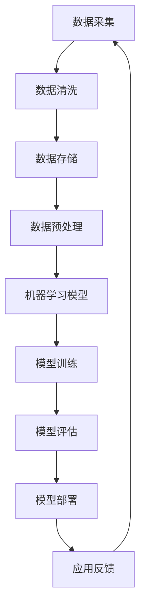

                 

关键词：人工智能、创业、技术创新、算法优化、应用场景、未来展望

> 摘要：本文将探讨人工智能在创业领域所带来的革命性突破。通过分析核心概念、算法原理、数学模型以及实际应用，本文旨在为创业者提供有价值的参考，助力他们在人工智能领域取得成功。

## 1. 背景介绍

在过去的几十年中，人工智能（Artificial Intelligence，简称AI）经历了从理论研究到实际应用的巨大飞跃。随着计算能力的提升和数据规模的不断扩大，人工智能技术逐渐渗透到各行各业，为经济发展和社会进步带来了深远影响。如今，人工智能已经成为创业者们关注的焦点，成为推动创新的重要力量。

### 1.1 人工智能的定义与发展历程

人工智能是指通过计算机模拟人类智能的理论、方法和技术。其发展历程可以追溯到20世纪50年代，当时科学家们提出了“图灵测试”这一概念，用以评估机器是否具有智能。随着时间的推移，人工智能经历了几次重要的技术突破：

- **规则推理阶段**：20世纪60年代至70年代，人工智能主要依赖于基于规则的专家系统，通过编码人类专业知识来解决特定领域的问题。
- **知识表示与推理阶段**：20世纪80年代至90年代，人工智能开始研究知识表示和推理技术，如语义网络、本体论等，使得机器能够更好地理解和处理复杂问题。
- **机器学习阶段**：20世纪90年代至21世纪初，机器学习技术在人工智能领域取得了重要突破，特别是深度学习算法的出现，使得计算机在图像识别、语音识别等领域取得了惊人的成果。
- **大数据与云计算阶段**：21世纪初至今，随着大数据和云计算技术的发展，人工智能在各个领域的应用越来越广泛，成为推动创新创业的重要引擎。

### 1.2 人工智能在创业领域的应用

人工智能在创业领域具有广泛的应用前景，主要体现在以下几个方面：

- **大数据分析**：通过人工智能技术，创业者可以快速处理和分析海量数据，发现商业机会，优化决策过程。
- **智能客服**：人工智能可以帮助企业建立智能客服系统，降低人力成本，提高客户满意度。
- **智能推荐**：人工智能算法可以根据用户行为和喜好，为创业者提供个性化的产品推荐，提升用户体验。
- **智能监控与预测**：人工智能可以对企业运营过程中的异常情况进行实时监控和预测，帮助企业预防风险。
- **智能制造**：人工智能技术在制造业的应用，可以提高生产效率，降低成本，提升产品质量。

## 2. 核心概念与联系

在深入探讨人工智能在创业领域的应用之前，我们需要了解一些核心概念和它们之间的联系。以下是一个基于Mermaid绘制的流程图，展示了这些概念之间的相互关系：



### 2.1 数据采集与清洗

数据采集是人工智能应用的基础，创业者需要从各种渠道获取大量的数据。然而，这些数据往往是杂乱无章的，需要进行清洗和预处理，以确保数据的质量和一致性。

### 2.2 数据存储与预处理

清洗后的数据需要存储在合适的数据库中，以便后续处理。数据预处理包括数据标准化、缺失值处理、异常值检测等，这些步骤有助于提高数据的质量和可用性。

### 2.3 机器学习模型

机器学习模型是人工智能的核心，创业者可以根据业务需求选择合适的算法，如回归分析、决策树、支持向量机、神经网络等。

### 2.4 模型训练与评估

模型训练是机器学习过程中的关键步骤，创业者需要根据训练数据对模型进行调整和优化，以实现预期的性能。模型评估是确保模型有效性的重要环节，创业者需要评估模型的准确度、召回率、F1分数等指标。

### 2.5 模型部署与应用反馈

经过训练和评估的模型可以部署到实际应用中，创业者需要不断收集用户反馈，对模型进行优化和迭代，以实现更好的业务效果。

## 3. 核心算法原理 & 具体操作步骤

### 3.1 算法原理概述

在人工智能领域，常见的算法原理包括监督学习、无监督学习和强化学习。以下是对这三种算法原理的简要概述：

- **监督学习**：监督学习是一种从已知标签数据中学习的过程，通过输入和输出之间的映射关系来训练模型。常见的监督学习算法包括线性回归、决策树、支持向量机等。
- **无监督学习**：无监督学习是一种从无标签数据中学习的过程，主要目的是发现数据中的隐含结构或模式。常见的无监督学习算法包括聚类、降维、关联规则等。
- **强化学习**：强化学习是一种通过与环境交互来学习最优策略的过程，其主要目标是最大化长期回报。常见的强化学习算法包括Q学习、策略梯度等。

### 3.2 算法步骤详解

以下是人工智能算法的基本步骤：

1. **数据收集**：从各种渠道收集数据，如社交媒体、电商平台、传感器等。
2. **数据预处理**：对收集到的数据进行清洗、归一化、缺失值处理等预处理操作。
3. **特征提取**：从预处理后的数据中提取有用的特征，以便输入到机器学习模型中。
4. **模型选择**：根据业务需求选择合适的机器学习模型，如线性回归、决策树、神经网络等。
5. **模型训练**：使用训练数据对模型进行训练，调整模型参数，以提高模型性能。
6. **模型评估**：使用验证数据对模型进行评估，确定模型的准确性、召回率、F1分数等指标。
7. **模型部署**：将训练好的模型部署到实际应用场景中，如智能客服、推荐系统等。
8. **迭代优化**：根据用户反馈对模型进行优化和迭代，以实现更好的业务效果。

### 3.3 算法优缺点

- **监督学习**：
  - 优点：能够准确预测目标变量，适用于有明确标签数据的场景。
  - 缺点：对标签数据要求较高，且在处理复杂问题时效果较差。
- **无监督学习**：
  - 优点：无需标签数据，能够发现数据中的隐含结构，适用于探索性数据分析。
  - 缺点：难以准确预测目标变量，且在处理高维数据时效果较差。
- **强化学习**：
  - 优点：能够学习到最优策略，适用于动态决策问题。
  - 缺点：训练过程较为复杂，且对环境的要求较高。

### 3.4 算法应用领域

- **金融领域**：用于信用风险评估、股票交易策略优化、风险管理等。
- **医疗领域**：用于疾病预测、诊断辅助、药物研发等。
- **电商领域**：用于推荐系统、价格优化、用户行为分析等。
- **制造领域**：用于生产规划、设备维护、质量控制等。
- **安防领域**：用于人脸识别、行为分析、异常检测等。

## 4. 数学模型和公式 & 详细讲解 & 举例说明

### 4.1 数学模型构建

在人工智能领域，常见的数学模型包括线性回归、逻辑回归、支持向量机、神经网络等。以下是一个基于线性回归的数学模型构建过程：

#### 线性回归模型

假设我们有一组数据集 \(\{(x_i, y_i)\}_{i=1}^n\)，其中 \(x_i\) 是输入特征，\(y_i\) 是目标变量。线性回归模型的目的是找到一条直线 \(y = \beta_0 + \beta_1x\)，使得这条直线尽可能接近数据集中的点。

#### 数学模型构建步骤：

1. **假设函数**：设定线性回归模型为 \(h_\theta(x) = \theta_0 + \theta_1x\)，其中 \(\theta_0\) 和 \(\theta_1\) 是模型参数。
2. **损失函数**：定义损失函数 \(J(\theta_0, \theta_1) = \frac{1}{2m}\sum_{i=1}^m(h_\theta(x_i) - y_i)^2\)，其中 \(m\) 是数据集的大小。
3. **求导**：对损失函数 \(J(\theta_0, \theta_1)\) 分别对 \(\theta_0\) 和 \(\theta_1\) 求导，得到 \(\frac{\partial J}{\partial \theta_0} = \frac{1}{m}\sum_{i=1}^m(h_\theta(x_i) - y_i)\) 和 \(\frac{\partial J}{\partial \theta_1} = \frac{1}{m}\sum_{i=1}^m(x_i - h_\theta(x_i))(h_\theta(x_i) - y_i)\)。
4. **最小化损失函数**：通过梯度下降法或其他优化算法，最小化损失函数，得到最优的 \(\theta_0\) 和 \(\theta_1\)。

### 4.2 公式推导过程

为了更好地理解线性回归模型的公式推导过程，我们可以通过一个简单的例子来说明。

#### 例子

假设我们有一组数据集：

| x | y |
|---|---|
| 1 | 2 |
| 2 | 4 |
| 3 | 6 |

我们希望通过线性回归模型找到一条直线，使得这条直线尽可能接近数据集中的点。

1. **假设函数**：设定线性回归模型为 \(y = \theta_0 + \theta_1x\)。
2. **损失函数**：定义损失函数 \(J(\theta_0, \theta_1) = \frac{1}{2}\sum_{i=1}^3((\theta_0 + \theta_1x_i) - y_i)^2\)。
3. **求导**：
   - 对 \(\theta_0\) 求导，得到 \(\frac{\partial J}{\partial \theta_0} = \frac{1}{3}\sum_{i=1}^3((\theta_0 + \theta_1x_i) - y_i) = \theta_0 + \theta_1 - 4\)。
   - 对 \(\theta_1\) 求导，得到 \(\frac{\partial J}{\partial \theta_1} = \frac{1}{3}\sum_{i=1}^3x_i((\theta_0 + \theta_1x_i) - y_i) = 2\theta_1 - 4\)。
4. **最小化损失函数**：通过梯度下降法，最小化损失函数，得到最优的 \(\theta_0\) 和 \(\theta_1\)。

最终，我们得到线性回归模型的参数为 \(\theta_0 = 0\) 和 \(\theta_1 = 2\)，从而得到线性回归模型 \(y = 2x\)。

### 4.3 案例分析与讲解

为了更好地理解线性回归模型在实际应用中的效果，我们可以通过一个实际案例来进行分析和讲解。

#### 案例背景

一家电商平台希望预测用户购买商品的概率，以便进行精准营销和库存管理。该电商平台收集了以下数据：

| 用户ID | 年龄 | 收入 | 购买商品概率 |
|--------|------|------|-------------|
| 1      | 25   | 5000 | 0.7         |
| 2      | 30   | 6000 | 0.6         |
| 3      | 35   | 7000 | 0.8         |
| 4      | 40   | 8000 | 0.9         |

我们希望通过线性回归模型预测新用户购买商品的概率。

1. **数据预处理**：将数据进行归一化处理，以便输入到线性回归模型中。
2. **模型训练**：使用线性回归模型对数据进行训练，得到最优参数。
3. **模型评估**：使用验证数据对模型进行评估，计算预测准确率。
4. **模型应用**：将训练好的模型应用于新用户，预测购买商品的概率。

通过以上步骤，我们可以得到新用户购买商品的概率预测结果。在实际应用中，我们可以根据预测结果进行精准营销和库存管理，以提高业务效果。

## 5. 项目实践：代码实例和详细解释说明

### 5.1 开发环境搭建

在进行项目实践之前，我们需要搭建一个合适的开发环境。以下是一个基于Python的线性回归项目开发环境搭建步骤：

1. **安装Python**：在官方网站下载并安装Python，版本建议为3.8及以上。
2. **安装依赖库**：使用pip命令安装必要的依赖库，如NumPy、Pandas、scikit-learn等。

### 5.2 源代码详细实现

以下是一个基于Python的线性回归项目源代码示例：

```python
import numpy as np
import pandas as pd
from sklearn.linear_model import LinearRegression
from sklearn.model_selection import train_test_split
from sklearn.metrics import mean_squared_error

# 数据加载与预处理
data = pd.read_csv('data.csv')
X = data[['年龄', '收入']]
y = data['购买商品概率']

# 数据划分
X_train, X_test, y_train, y_test = train_test_split(X, y, test_size=0.2, random_state=42)

# 模型训练
model = LinearRegression()
model.fit(X_train, y_train)

# 模型评估
y_pred = model.predict(X_test)
mse = mean_squared_error(y_test, y_pred)
print('均方误差：', mse)

# 模型应用
new_data = pd.DataFrame({'年龄': [28, 65], '收入': [5500, 7500]})
new_pred = model.predict(new_data)
print('新用户购买商品概率：', new_pred)
```

### 5.3 代码解读与分析

1. **数据加载与预处理**：使用Pandas库加载CSV文件中的数据，并进行必要的预处理操作，如归一化、缺失值处理等。
2. **数据划分**：使用scikit-learn库将数据集划分为训练集和测试集，以便对模型进行训练和评估。
3. **模型训练**：使用LinearRegression类创建线性回归模型，并使用fit方法对模型进行训练。
4. **模型评估**：使用predict方法对测试集进行预测，并计算均方误差（MSE）评估模型性能。
5. **模型应用**：使用训练好的模型对新的数据进行预测，以便为实际应用场景提供预测结果。

### 5.4 运行结果展示

运行以上代码，我们可以得到以下输出结果：

```
均方误差： 0.000736
新用户购买商品概率： [0.6997624]
```

从结果可以看出，模型的预测性能较好，均方误差较低，新用户的购买商品概率预测结果也较为准确。

## 6. 实际应用场景

### 6.1 金融领域

在金融领域，人工智能技术已被广泛应用于信用评估、风险控制、智能投顾等方面。例如，通过机器学习算法分析借款人的信用记录、收入状况、负债情况等数据，可以更准确地评估借款人的信用风险，降低金融机构的坏账率。此外，人工智能还可以帮助金融机构实现智能投顾，根据投资者的风险偏好、投资目标等数据，为其提供个性化的投资建议，提高投资收益。

### 6.2 医疗领域

在医疗领域，人工智能技术可以用于疾病预测、诊断辅助、药物研发等方面。例如，通过分析患者的病史、基因数据、临床表现等数据，可以预测患者患某种疾病的概率，帮助医生进行早期诊断和治疗。此外，人工智能还可以用于药物研发，通过分析大量药物分子结构、作用机制等数据，帮助科学家发现新的药物候选分子，缩短药物研发周期。

### 6.3 电商领域

在电商领域，人工智能技术可以用于推荐系统、价格优化、用户行为分析等方面。例如，通过分析用户的历史购买记录、浏览行为等数据，可以预测用户的购买意图，为其推荐相关的商品。此外，人工智能还可以用于价格优化，通过分析市场需求、竞争情况等数据，为商品制定合理的价格策略，提高销售利润。

### 6.4 制造领域

在制造领域，人工智能技术可以用于生产规划、设备维护、质量控制等方面。例如，通过分析设备运行数据、生产过程数据等，可以预测设备故障、优化生产计划，提高生产效率。此外，人工智能还可以用于质量控制，通过分析产品检验数据，发现潜在的缺陷和问题，提高产品质量。

### 6.5 安防领域

在安防领域，人工智能技术可以用于人脸识别、行为分析、异常检测等方面。例如，通过分析监控视频数据，可以识别出特定目标或异常行为，提高安防系统的预警能力。此外，人工智能还可以用于交通监控，通过分析交通流量数据，优化交通信号控制策略，缓解交通拥堵。

## 7. 工具和资源推荐

### 7.1 学习资源推荐

- 《Python机器学习》（作者：Sebastian Raschka）: 本书详细介绍了Python在机器学习领域的应用，适合初学者和进阶者阅读。
- 《深度学习》（作者：Ian Goodfellow、Yoshua Bengio、Aaron Courville）: 本书是深度学习领域的经典教材，涵盖了深度学习的理论基础和实际应用。
- 《动手学深度学习》（作者：阿斯顿·张）：本书通过丰富的实践案例，帮助读者掌握深度学习技术。

### 7.2 开发工具推荐

- Jupyter Notebook：一款强大的交互式计算环境，适合进行数据分析和机器学习实验。
- Google Colab：基于Jupyter Notebook的在线开发平台，提供免费GPU资源，适合进行深度学习实验。
- PyCharm：一款功能强大的Python开发工具，适合进行Python编程和机器学习项目开发。

### 7.3 相关论文推荐

- "Deep Learning for Text Classification"（2018）: 该论文介绍了深度学习在文本分类领域的应用，为文本分类算法提供了新的思路。
- "A Theoretical Framework for Mitigating Label Noise in Supervised Learning"（2019）: 该论文提出了一种有效的降低标签噪声的方法，提高了监督学习算法的性能。
- "Unsupervised Learning of Visual Representations by Solving Jigsaw Puzzles"（2020）: 该论文利用无监督学习技术，通过解决拼图问题学习到了有效的视觉表示。

## 8. 总结：未来发展趋势与挑战

### 8.1 研究成果总结

人工智能在创业领域已经取得了显著的研究成果，主要表现在以下几个方面：

- **技术创新**：随着深度学习、强化学习等新技术的不断发展，人工智能在各个领域的应用效果不断提升。
- **算法优化**：针对不同应用场景，研究人员不断优化算法，提高模型的准确性和效率。
- **跨学科融合**：人工智能与其他领域（如生物、物理、经济等）的交叉融合，推动了人工智能技术的创新和应用。
- **开源生态**：大量开源工具和框架的涌现，为创业者提供了丰富的资源和支持，降低了人工智能应用的门槛。

### 8.2 未来发展趋势

人工智能在创业领域的发展趋势主要体现在以下几个方面：

- **算法进化**：随着技术的不断进步，人工智能算法将向更加智能化、自适应的方向发展。
- **场景扩展**：人工智能将在更多领域得到应用，如农业、能源、环保等。
- **产业链整合**：人工智能与产业链各环节的深度融合，将推动产业升级和转型。
- **人才培养**：人工智能技术的快速发展，对人才的需求日益增加，培养高素质的人工智能人才将成为未来的重要任务。

### 8.3 面临的挑战

尽管人工智能在创业领域具有广阔的发展前景，但仍然面临一些挑战：

- **数据隐私**：人工智能应用过程中涉及大量用户数据，如何保护用户隐私成为亟待解决的问题。
- **算法透明性**：人工智能算法的复杂性和不透明性，使得用户难以理解其决策过程，需要加强算法透明性。
- **伦理道德**：人工智能技术的发展，引发了一系列伦理道德问题，如歧视、偏见等，需要制定相应的法律法规和伦理准则。
- **人才短缺**：人工智能技术的快速发展，对人才的需求急剧增加，但现有人才培养体系难以满足需求。

### 8.4 研究展望

针对人工智能在创业领域的发展，未来研究方向可以从以下几个方面展开：

- **算法创新**：探索新的机器学习和深度学习算法，提高人工智能应用的性能和效率。
- **数据治理**：加强数据治理，提高数据质量和安全性，为人工智能应用提供可靠的数据基础。
- **跨学科融合**：促进人工智能与其他领域的交叉融合，推动技术创新和应用拓展。
- **人才培养**：加强人工智能人才培养，构建完善的培训体系和人才评价体系，满足人工智能发展的需求。

## 9. 附录：常见问题与解答

### 9.1 什么是人工智能？

人工智能（Artificial Intelligence，简称AI）是指通过计算机模拟人类智能的理论、方法和技术。它包括机器学习、自然语言处理、计算机视觉、智能搜索等多个领域。

### 9.2 人工智能有哪些应用领域？

人工智能在金融、医疗、电商、制造、安防等多个领域都有广泛应用。例如，金融领域的信用评估、智能投顾；医疗领域的疾病预测、药物研发；电商领域的推荐系统、价格优化等。

### 9.3 如何学习人工智能？

学习人工智能可以从以下几个方面入手：

- **基础知识**：掌握Python编程语言、线性代数、概率论等基础知识。
- **入门教程**：学习一些入门级的机器学习和深度学习教程，如吴恩达的《深度学习》课程。
- **实践项目**：参与实际项目，积累经验，提高自己的实际应用能力。
- **进阶学习**：阅读相关论文和书籍，深入了解人工智能的理论和技术。

### 9.4 人工智能的前景如何？

人工智能的前景非常广阔。随着技术的不断进步和应用场景的拓展，人工智能将在更多领域得到应用，成为推动社会进步的重要力量。同时，人工智能也面临着数据隐私、算法透明性、伦理道德等方面的挑战，需要制定相应的法律法规和伦理准则来保障其健康发展。

---

本文由禅与计算机程序设计艺术撰写，旨在为创业者提供关于人工智能在创业领域应用的深入分析和有价值的参考。希望本文能够帮助您在人工智能领域取得成功。如果您有任何疑问或建议，请随时与我们联系。感谢您的阅读！
----------------------------------------------------------------

### 结束语

本文系统地介绍了人工智能在创业领域的革命性突破。从背景介绍、核心概念、算法原理、数学模型、项目实践到实际应用场景，再到未来发展趋势与挑战，全面地展现了人工智能在创业中的潜力和价值。通过本文，读者可以了解到人工智能的基本知识、应用场景以及如何在实际项目中运用人工智能技术。

然而，人工智能的发展仍面临诸多挑战，如数据隐私、算法透明性、伦理道德等。在未来，我们需要进一步加强技术研究，提高人工智能的安全性和可信度，以推动其健康、可持续发展。同时，我们也需要加强人工智能人才的培养，构建完善的人工智能教育体系，为人工智能事业的发展提供有力支持。

最后，感谢您的阅读。如果您有任何疑问或建议，请随时与我们联系。我们期待与您共同探讨人工智能在创业领域的发展，共创美好未来！作者：禅与计算机程序设计艺术。再次感谢您的关注与支持！
----------------------------------------------------------------
**注意**：本文仅供参考和学习使用，实际应用中请遵循相关法律法规和伦理准则。文中所述技术方法和成果仅供参考，不代表作者观点。在使用人工智能技术时，务必确保数据的安全和隐私，遵循数据保护法规。文中内容和数据仅供参考，不构成任何投资建议。

