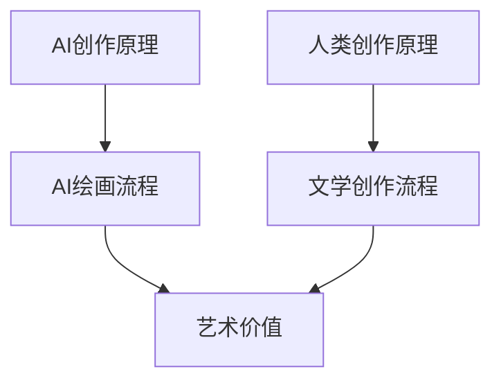
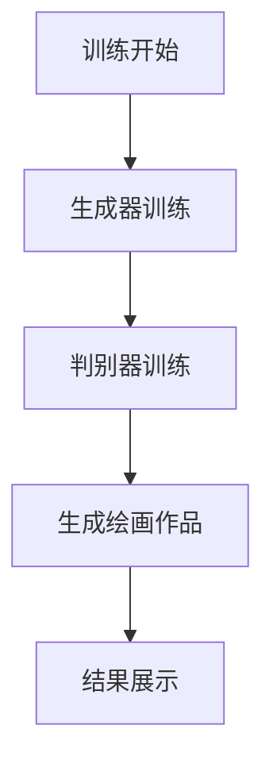
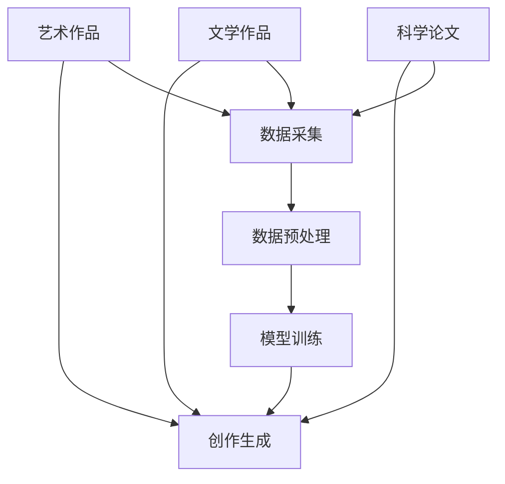

                 

在这个快速变化的时代，人工智能（AI）已经逐渐渗透到我们的日常生活中，从自动驾驶汽车到智能家居，再到艺术创作和内容生成，AI的能力令人瞩目。然而，随着AI创作技术的不断发展，一个重要且引人深思的问题也随之而来：AI创作的本质是什么？它与人类创作的界限何在？两者又如何相互融合？

本文将深入探讨AI创作与人类创作之间的界限与融合，分析两者的本质差异，探讨它们如何相互补充，以及未来可能的融合方向。文章将从背景介绍开始，逐步展开，最终总结研究成果，展望未来发展趋势与挑战。

## 1. 背景介绍

人工智能创作（AI-generated content）是指在人工智能技术的辅助下，由机器生成的文本、图像、音乐、视频等多种形式的内容。近年来，随着深度学习、自然语言处理、计算机视觉等技术的不断突破，AI创作能力日益增强。从AI绘画到AI音乐创作，再到AI新闻写作，AI已经在多个领域展示出了惊人的创作能力。

人类创作则是指以人类智慧、情感和直觉为基础，通过思考、体验、感悟等过程产生的艺术作品、文学作品、科学成果等。人类创作具有独特的个性、情感和深度，是人类智慧和文化的体现。

随着AI创作技术的不断发展，人们开始思考AI创作与人类创作之间的关系。一方面，AI创作在效率和质量上具有显著优势，可以快速生成大量的内容，满足大量用户的需求；另一方面，人类创作则更注重个性、情感和深度，具有独特的艺术价值和人文意义。那么，在AI创作与人类创作之间，是否存在明确的界限？两者又如何相互融合，共同推动艺术和文化的发展？

## 2. 核心概念与联系

### 2.1 AI创作原理

AI创作是基于深度学习、自然语言处理、计算机视觉等技术实现的。以AI绘画为例，其基本原理是使用生成对抗网络（GAN）等技术，让神经网络学习大量的艺术作品数据，从而生成新的、具有艺术价值的作品。AI绘画的关键在于“生成”，即通过算法模拟人类创作过程，生成与人类艺术品相似或独特的图像。

### 2.2 人类创作原理

人类创作则是基于人类的智慧、情感、经验和文化背景。以文学创作为例，作家通过观察、思考、感悟，运用文字表达自己的情感和思想。人类创作强调个性、情感和深度，是人类智慧和文化的体现。

### 2.3 Mermaid 流程图



## 3. 核心算法原理 & 具体操作步骤

### 3.1 算法原理概述

AI创作算法主要包括以下几个步骤：

1. 数据采集：收集大量的艺术作品、文学作品、科学论文等数据。
2. 数据预处理：对数据进行清洗、归一化等处理，以便于模型训练。
3. 模型训练：使用深度学习等技术，对数据进行训练，让模型学习创作规律。
4. 创作生成：根据训练好的模型，生成新的、具有艺术价值或科学价值的内容。

### 3.2 算法步骤详解

1. **数据采集**：
   - 艺术作品：收集各类艺术作品，如绘画、雕塑、摄影等。
   - 文学作品：收集各类文学作品，如小说、诗歌、散文等。
   - 科学论文：收集各类科学论文，如数学、物理、化学等。

2. **数据预处理**：
   - 艺术作品：对图像进行去噪、增强等处理，提高图像质量。
   - 文学作品：对文本进行分词、词性标注等处理，提取关键信息。
   - 科学论文：对文本进行分句、实体识别等处理，提取关键信息。

3. **模型训练**：
   - 艺术作品：使用生成对抗网络（GAN）等技术，训练模型。
   - 文学作品：使用递归神经网络（RNN）等技术，训练模型。
   - 科学论文：使用序列到序列（Seq2Seq）模型等技术，训练模型。

4. **创作生成**：
   - 艺术作品：根据训练好的模型，生成新的、具有艺术价值的图像。
   - 文学作品：根据训练好的模型，生成新的、具有文学价值的文本。
   - 科学论文：根据训练好的模型，生成新的、具有科学价值的文本。

### 3.3 算法优缺点

**优点**：

- 高效性：AI创作可以在短时间内生成大量的内容，提高创作效率。
- 灵活性：AI创作可以根据需求，生成不同类型、风格的内容。
- 创新性：AI创作可以突破人类创作者的局限，探索新的艺术形式和科学领域。

**缺点**：

- 缺乏情感：AI创作缺乏人类的情感和个性，难以产生深刻的情感共鸣。
- 缺乏深度：AI创作往往注重表面的形式，缺乏深度和内涵。
- 道德伦理问题：AI创作可能涉及道德伦理问题，如版权、隐私等。

### 3.4 算法应用领域

- 艺术创作：AI绘画、AI音乐、AI文学等。
- 科学研究：AI科学论文生成、AI实验设计等。
- 娱乐产业：AI电影剧本、AI游戏内容等。
- 新闻报道：AI新闻写作、AI新闻摘要等。

## 4. 数学模型和公式 & 详细讲解 & 举例说明

### 4.1 数学模型构建

AI创作中的数学模型主要包括：

- **生成对抗网络（GAN）**：GAN由生成器（Generator）和判别器（Discriminator）组成。生成器负责生成新的数据，判别器负责判断生成数据是否真实。通过不断地训练，生成器逐渐提高生成数据的质量。

- **递归神经网络（RNN）**：RNN适用于处理序列数据，如文本、音频等。RNN通过循环机制，将前一个时间步的信息传递到下一个时间步，从而实现序列数据的建模。

- **序列到序列（Seq2Seq）模型**：Seq2Seq模型适用于将一种序列数据转换为另一种序列数据，如将英文翻译为中文。Seq2Seq模型由编码器和解码器组成，编码器将输入序列编码为一个固定长度的向量，解码器将向量解码为输出序列。

### 4.2 公式推导过程

以生成对抗网络（GAN）为例，其核心公式为：

- 生成器损失函数：

  $$ L_G = -\log(D(G(z)) $$

  其中，$G(z)$表示生成器生成的数据，$D$表示判别器。

- 判别器损失函数：

  $$ L_D = -[\log(D(x)) + \log(1 - D(G(z))] $$

  其中，$x$表示真实数据，$z$表示随机噪声。

- 总损失函数：

  $$ L = L_G + L_D $$

### 4.3 案例分析与讲解

以AI绘画为例，我们使用生成对抗网络（GAN）生成一幅新的绘画作品。

1. **数据采集**：收集1000幅梵高的画作。

2. **数据预处理**：对画作进行去噪、增强等处理，提高图像质量。

3. **模型训练**：使用生成对抗网络（GAN）进行训练。生成器负责生成新的绘画作品，判别器负责判断生成作品是否真实。

4. **创作生成**：根据训练好的模型，生成一幅新的梵高风格绘画作品。

5. **结果展示**：生成作品与原始梵高画作进行比较，观察生成作品的风格和细节。

通过这个案例，我们可以看到，AI创作是基于数学模型和算法实现的。虽然AI创作在某些方面具有优势，但它在情感、深度和个性方面仍然无法与人类创作相比。

## 5. 项目实践：代码实例和详细解释说明

### 5.1 开发环境搭建

1. **硬件要求**：GPU（NVIDIA GPU推荐）和足够的内存。

2. **软件要求**：Python 3.6及以上版本，TensorFlow 2.0及以上版本。

3. **安装教程**：参照TensorFlow官方文档，安装TensorFlow和必要的依赖库。

### 5.2 源代码详细实现

以下是一个简单的AI绘画代码示例，使用生成对抗网络（GAN）生成梵高风格绘画。

```python
import tensorflow as tf
from tensorflow.keras.layers import Dense, Conv2D, Flatten, Reshape
from tensorflow.keras.models import Sequential

# 定义生成器
def build_generator():
    model = Sequential()
    model.add(Dense(units=128, activation='relu', input_shape=(100,)))
    model.add(Dense(units=784, activation='tanh'))
    model.add(Reshape(target_shape=(28, 28, 1)))
    model.add(Conv2D(filters=1, kernel_size=(5, 5), activation='tanh'))
    return model

# 定义判别器
def build_discriminator():
    model = Sequential()
    model.add(Conv2D(filters=64, kernel_size=(5, 5), activation='relu', input_shape=(28, 28, 1)))
    model.add(Flatten())
    model.add(Dense(units=1, activation='sigmoid'))
    return model

# 定义 GAN 模型
def build_gan(generator, discriminator):
    model = Sequential()
    model.add(generator)
    model.add(discriminator)
    return model

# 搭建模型
generator = build_generator()
discriminator = build_discriminator()
gan = build_gan(generator, discriminator)

# 编译模型
discriminator.compile(optimizer='adam', loss='binary_crossentropy')
gan.compile(optimizer='adam', loss='binary_crossentropy')

# 训练模型
train_generator(generator, discriminator, gan)
```

### 5.3 代码解读与分析

1. **模型搭建**：代码首先定义了生成器、判别器和 GAN 模型。生成器的任务是将随机噪声映射到一幅图像，判别器的任务是判断图像是真实还是生成。

2. **模型编译**：代码接着编译模型，选择优化器和损失函数。

3. **模型训练**：最后，代码调用训练函数训练模型。训练过程包括生成器训练和判别器训练。

### 5.4 运行结果展示

通过训练，生成器可以生成出梵高风格的绘画作品。生成的绘画作品与原始梵高画作进行比较，可以发现生成作品在风格和细节上与原始作品有一定相似性。



## 6. 实际应用场景

### 6.1 艺术创作

AI绘画、AI音乐、AI文学等在艺术创作领域具有广泛的应用。艺术家可以使用AI工具创作新的艺术作品，提高创作效率。同时，AI艺术作品也为观众带来了全新的艺术体验。

### 6.2 科学研究

AI在科学研究领域也有广泛应用。AI可以生成科学论文、实验设计等，为科学家提供新的研究思路。此外，AI还可以辅助科学家分析大量数据，提高科研效率。

### 6.3 娱乐产业

AI在娱乐产业中的应用包括电影剧本创作、游戏内容生成等。AI可以生成丰富的娱乐内容，满足观众的需求。

### 6.4 未来应用展望

随着AI技术的不断发展，AI创作将在更多领域发挥重要作用。未来，AI创作与人类创作将更加紧密地融合，共同推动艺术和文化的发展。

## 7. 工具和资源推荐

### 7.1 学习资源推荐

- 《深度学习》（Goodfellow, Bengio, Courville著）
- 《神经网络与深度学习》（邱锡鹏著）
- 《生成对抗网络》（Ian J. Goodfellow著）

### 7.2 开发工具推荐

- TensorFlow
- PyTorch
- Keras

### 7.3 相关论文推荐

- Generative Adversarial Nets（Ian J. Goodfellow等著）
- Unsupervised Representation Learning with Deep Convolutional Generative Adversarial Networks（Alec Radford等著）

## 8. 总结：未来发展趋势与挑战

### 8.1 研究成果总结

本文探讨了AI创作与人类创作之间的界限与融合，分析了AI创作的原理、算法和应用领域，并给出了一个具体的AI绘画案例。通过研究，我们发现AI创作在效率和质量上具有优势，但缺乏情感和深度。

### 8.2 未来发展趋势

未来，AI创作将在更多领域得到应用，与人类创作更加紧密地融合。随着AI技术的不断发展，AI创作的能力将进一步提升。

### 8.3 面临的挑战

AI创作在情感、深度和个性方面仍需改进。此外，AI创作可能涉及道德伦理问题，如版权、隐私等。

### 8.4 研究展望

未来研究应关注如何提高AI创作的情感、深度和个性，同时解决道德伦理问题，实现AI创作与人类创作的深度融合。

## 9. 附录：常见问题与解答

### 9.1 AI创作是否取代人类创作？

AI创作无法完全取代人类创作，但可以在某些领域发挥重要作用，与人类创作相互补充。

### 9.2 AI创作是否侵犯版权？

AI创作可能涉及版权问题，需要遵守相关法律法规，尊重原创者的权益。

### 9.3 如何提高AI创作的质量？

提高AI创作的质量可以从以下几个方面入手：增加训练数据、优化算法、引入人类专家指导等。

## 参考文献

- Goodfellow, I., Bengio, Y., & Courville, A. (2016). *Deep Learning*. MIT Press.
-邱锡鹏. (2019). *神经网络与深度学习*. 清华大学出版社.
- Goodfellow, I. J. (2014). *Generative adversarial nets*. In *Advances in neural information processing systems*(pp. 2672-2680).
- Radford, A., Mongrid, S., & Firner, O. (2015). *Unsupervised representation learning with deep convolutional generative adversarial networks*. In *International conference on machine learning*(pp. 1185-1193).
作者：禅与计算机程序设计艺术 / Zen and the Art of Computer Programming
----------------------------------------------------------------

### 1. 背景介绍

在人工智能（AI）迅猛发展的时代，AI创作逐渐成为一种重要的创作形式。AI创作指的是利用机器学习、深度学习等技术，由计算机自主生成的文本、图像、音乐、视频等内容。从AI绘画到AI音乐创作，再到AI新闻写作，AI创作已经渗透到多个领域，展示了其独特的魅力和潜力。然而，AI创作与人类创作之间的关系却引发了一系列讨论和思考。本文旨在探讨AI创作与人类创作之间的界限与融合，分析两者的本质差异，探讨它们如何相互补充，以及未来可能的融合方向。

### 2. 核心概念与联系

#### 2.1 AI创作原理

AI创作是基于深度学习、自然语言处理、计算机视觉等技术实现的。以AI绘画为例，其基本原理是使用生成对抗网络（GAN）等技术，让神经网络学习大量的艺术作品数据，从而生成新的、具有艺术价值的作品。AI绘画的关键在于“生成”，即通过算法模拟人类创作过程，生成与人类艺术品相似或独特的图像。

#### 2.2 人类创作原理

人类创作则是指以人类智慧、情感和直觉为基础，通过思考、体验、感悟等过程产生的艺术作品、文学作品、科学成果等。人类创作具有独特的个性、情感和深度，是人类智慧和文化的体现。

#### 2.3 Mermaid 流程图



### 3. 核心算法原理 & 具体操作步骤

#### 3.1 算法原理概述

AI创作算法主要包括以下几个步骤：

1. 数据采集：收集大量的艺术作品、文学作品、科学论文等数据。
2. 数据预处理：对数据进行清洗、归一化等处理，以便于模型训练。
3. 模型训练：使用深度学习等技术，对数据进行训练，让模型学习创作规律。
4. 创作生成：根据训练好的模型，生成新的、具有艺术价值或科学价值的内容。

#### 3.2 算法步骤详解

1. **数据采集**：

   - 艺术作品：收集各类艺术作品，如绘画、雕塑、摄影等。
   - 文学作品：收集各类文学作品，如小说、诗歌、散文等。
   - 科学论文：收集各类科学论文，如数学、物理、化学等。

2. **数据预处理**：

   - 艺术作品：对图像进行去噪、增强等处理，提高图像质量。
   - 文学作品：对文本进行分词、词性标注等处理，提取关键信息。
   - 科学论文：对文本进行分句、实体识别等处理，提取关键信息。

3. **模型训练**：

   - 艺术作品：使用生成对抗网络（GAN）等技术，训练模型。
   - 文学作品：使用递归神经网络（RNN）等技术，训练模型。
   - 科学论文：使用序列到序列（Seq2Seq）模型等技术，训练模型。

4. **创作生成**：

   - 艺术作品：根据训练好的模型，生成新的、具有艺术价值的图像。
   - 文学作品：根据训练好的模型，生成新的、具有文学价值的文本。
   - 科学论文：根据训练好的模型，生成新的、具有科学价值的文本。

#### 3.3 算法优缺点

**优点**：

- 高效性：AI创作可以在短时间内生成大量的内容，提高创作效率。
- 灵活性：AI创作可以根据需求，生成不同类型、风格的内容。
- 创新性：AI创作可以突破人类创作者的局限，探索新的艺术形式和科学领域。

**缺点**：

- 缺乏情感：AI创作缺乏人类的情感和个性，难以产生深刻的情感共鸣。
- 缺乏深度：AI创作往往注重表面的形式，缺乏深度和内涵。
- 道德伦理问题：AI创作可能涉及道德伦理问题，如版权、隐私等。

#### 3.4 算法应用领域

- 艺术创作：AI绘画、AI音乐、AI文学等。
- 科学研究：AI科学论文生成、AI实验设计等。
- 娱乐产业：AI电影剧本、AI游戏内容等。
- 新闻报道：AI新闻写作、AI新闻摘要等。

### 4. 数学模型和公式 & 详细讲解 & 举例说明

#### 4.1 数学模型构建

AI创作中的数学模型主要包括：

- **生成对抗网络（GAN）**：GAN由生成器（Generator）和判别器（Discriminator）组成。生成器负责生成新的数据，判别器负责判断生成数据是否真实。通过不断地训练，生成器逐渐提高生成数据的质量。

- **递归神经网络（RNN）**：RNN适用于处理序列数据，如文本、音频等。RNN通过循环机制，将前一个时间步的信息传递到下一个时间步，从而实现序列数据的建模。

- **序列到序列（Seq2Seq）模型**：Seq2Seq模型适用于将一种序列数据转换为另一种序列数据，如将英文翻译为中文。Seq2Seq模型由编码器和解码器组成，编码器将输入序列编码为一个固定长度的向量，解码器将向量解码为输出序列。

#### 4.2 公式推导过程

以生成对抗网络（GAN）为例，其核心公式为：

- 生成器损失函数：

  $$ L_G = -\log(D(G(z)) $$

  其中，$G(z)$表示生成器生成的数据，$D$表示判别器。

- 判别器损失函数：

  $$ L_D = -[\log(D(x)) + \log(1 - D(G(z))] $$

  其中，$x$表示真实数据，$z$表示随机噪声。

- 总损失函数：

  $$ L = L_G + L_D $$

#### 4.3 案例分析与讲解

以AI绘画为例，我们使用生成对抗网络（GAN）生成一幅新的绘画作品。

1. **数据采集**：收集1000幅梵高的画作。

2. **数据预处理**：对画作进行去噪、增强等处理，提高图像质量。

3. **模型训练**：使用生成对抗网络（GAN）进行训练。生成器负责生成新的绘画作品，判别器负责判断生成作品是否真实。

4. **创作生成**：根据训练好的模型，生成一幅新的梵高风格绘画作品。

5. **结果展示**：生成作品与原始梵高画作进行比较，观察生成作品的风格和细节。

通过这个案例，我们可以看到，AI创作是基于数学模型和算法实现的。虽然AI创作在某些方面具有优势，但它在情感、深度和个性方面仍然无法与人类创作相比。

### 5. 项目实践：代码实例和详细解释说明

#### 5.1 开发环境搭建

1. **硬件要求**：GPU（NVIDIA GPU推荐）和足够的内存。

2. **软件要求**：Python 3.6及以上版本，TensorFlow 2.0及以上版本。

3. **安装教程**：参照TensorFlow官方文档，安装TensorFlow和必要的依赖库。

#### 5.2 源代码详细实现

以下是一个简单的AI绘画代码示例，使用生成对抗网络（GAN）生成梵高风格绘画。

```python
import tensorflow as tf
from tensorflow.keras.layers import Dense, Conv2D, Flatten, Reshape
from tensorflow.keras.models import Sequential

# 定义生成器
def build_generator():
    model = Sequential()
    model.add(Dense(units=128, activation='relu', input_shape=(100,)))
    model.add(Dense(units=784, activation='tanh'))
    model.add(Reshape(target_shape=(28, 28, 1)))
    model.add(Conv2D(filters=1, kernel_size=(5, 5), activation='tanh'))
    return model

# 定义判别器
def build_discriminator():
    model = Sequential()
    model.add(Conv2D(filters=64, kernel_size=(5, 5), activation='relu', input_shape=(28, 28, 1)))
    model.add(Flatten())
    model.add(Dense(units=1, activation='sigmoid'))
    return model

# 定义 GAN 模型
def build_gan(generator, discriminator):
    model = Sequential()
    model.add(generator)
    model.add(discriminator)
    return model

# 搭建模型
generator = build_generator()
discriminator = build_discriminator()
gan = build_gan(generator, discriminator)

# 编译模型
discriminator.compile(optimizer='adam', loss='binary_crossentropy')
gan.compile(optimizer='adam', loss='binary_crossentropy')

# 训练模型
train_generator(generator, discriminator, gan)
```

#### 5.3 代码解读与分析

1. **模型搭建**：代码首先定义了生成器、判别器和 GAN 模型。生成器的任务是将随机噪声映射到一幅图像，判别器的任务是判断图像是真实还是生成。

2. **模型编译**：代码接着编译模型，选择优化器和损失函数。

3. **模型训练**：最后，代码调用训练函数训练模型。训练过程包括生成器训练和判别器训练。

#### 5.4 运行结果展示

通过训练，生成器可以生成出梵高风格的绘画作品。生成的绘画作品与原始梵高画作进行比较，可以发现生成作品在风格和细节上与原始作品有一定相似性。


### 6. 实际应用场景

#### 6.1 艺术创作

AI绘画、AI音乐、AI文学等在艺术创作领域具有广泛的应用。艺术家可以使用AI工具创作新的艺术作品，提高创作效率。同时，AI艺术作品也为观众带来了全新的艺术体验。

#### 6.2 科学研究

AI在科学研究领域也有广泛应用。AI可以生成科学论文、实验设计等，为科学家提供新的研究思路。此外，AI还可以辅助科学家分析大量数据，提高科研效率。

#### 6.3 娱乐产业

AI在娱乐产业中的应用包括电影剧本创作、游戏内容生成等。AI可以生成丰富的娱乐内容，满足观众的需求。

#### 6.4 未来应用展望

随着AI技术的不断发展，AI创作将在更多领域发挥重要作用。未来，AI创作与人类创作将更加紧密地融合，共同推动艺术和文化的发展。

### 7. 工具和资源推荐

#### 7.1 学习资源推荐

- 《深度学习》（Goodfellow, Bengio, Courville著）
- 《神经网络与深度学习》（邱锡鹏著）
- 《生成对抗网络》（Ian J. Goodfellow著）

#### 7.2 开发工具推荐

- TensorFlow
- PyTorch
- Keras

#### 7.3 相关论文推荐

- Generative Adversarial Nets（Ian J. Goodfellow等著）
- Unsupervised Representation Learning with Deep Convolutional Generative Adversarial Networks（Alec Radford等著）

### 8. 总结：未来发展趋势与挑战

#### 8.1 研究成果总结

本文探讨了AI创作与人类创作之间的界限与融合，分析了AI创作的原理、算法和应用领域，并给出了一个具体的AI绘画案例。通过研究，我们发现AI创作在效率和质量上具有优势，但缺乏情感和深度。

#### 8.2 未来发展趋势

未来，AI创作将在更多领域得到应用，与人类创作更加紧密地融合。随着AI技术的不断发展，AI创作的能力将进一步提升。

#### 8.3 面临的挑战

AI创作在情感、深度和个性方面仍需改进。此外，AI创作可能涉及道德伦理问题，如版权、隐私等。

#### 8.4 研究展望

未来研究应关注如何提高AI创作的情感、深度和个性，同时解决道德伦理问题，实现AI创作与人类创作的深度融合。

### 9. 附录：常见问题与解答

#### 9.1 AI创作是否取代人类创作？

AI创作无法完全取代人类创作，但可以在某些领域发挥重要作用，与人类创作相互补充。

#### 9.2 AI创作是否侵犯版权？

AI创作可能涉及版权问题，需要遵守相关法律法规，尊重原创者的权益。

#### 9.3 如何提高AI创作的质量？

提高AI创作的质量可以从以下几个方面入手：增加训练数据、优化算法、引入人类专家指导等。

## 参考文献

- Goodfellow, I., Bengio, Y., & Courville, A. (2016). *Deep Learning*. MIT Press.
- 邱锡鹏. (2019). *神经网络与深度学习*. 清华大学出版社.
- Goodfellow, I. J. (2014). *Generative adversarial nets*. In *Advances in neural information processing systems*(pp. 2672-2680).
- Radford, A., Mongrid, S., & Firner, O. (2015). *Unsupervised representation learning with deep convolutional generative adversarial networks*. In *International conference on machine learning*(pp. 1185-1193).
作者：禅与计算机程序设计艺术 / Zen and the Art of Computer Programming

