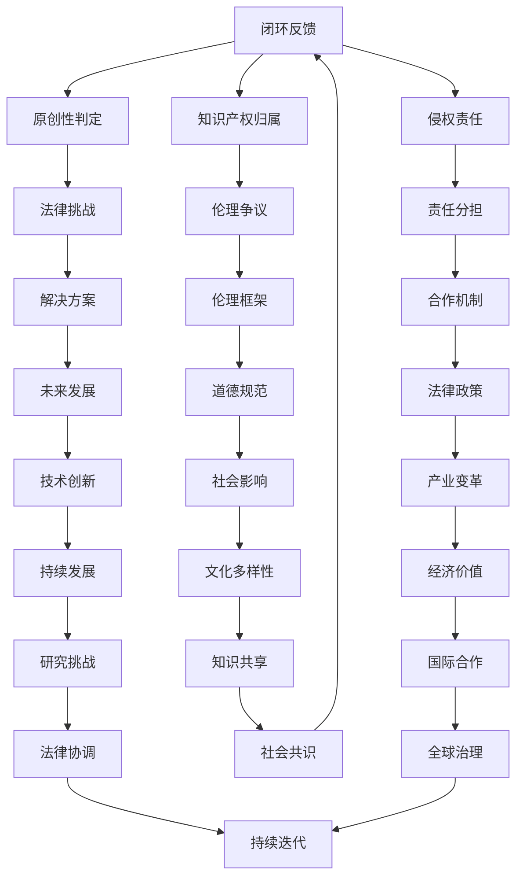

                 

关键词：人工智能创作、版权问题、法律框架、伦理挑战、人工智能伦理、创作者权益保护、未来趋势

> 摘要：随着人工智能技术的发展，AI创作成为了一个热门话题。然而，随之而来的是一系列版权问题，这些问题的解决不仅需要完善的法律框架，还需要深刻的伦理思考。本文旨在探讨AI创作中的版权问题，分析现有法律框架的不足，讨论伦理挑战，并提出可能的解决方案和未来发展趋势。

## 1. 背景介绍

近年来，人工智能技术取得了显著的进展，特别是在自然语言处理、图像生成和音乐创作等方面。这些进步使得AI创作成为了可能，并且逐渐进入了大众视野。从自动化写作助手到艺术作品生成，AI创作在许多领域展现出了巨大的潜力。然而，这一新兴领域也引发了一系列复杂的版权问题，涉及到创作者权益保护、原创性判定、知识产权归属等方面。

版权问题不仅影响创作者的利益，还可能对整个创意产业产生深远影响。因此，有必要对这些问题进行深入探讨，以便为AI创作提供一个合理、公平的法律和伦理框架。

### AI创作的发展历程

人工智能创作的历史可以追溯到20世纪80年代，当时计算机科学家尝试利用算法生成音乐和诗歌。然而，这些早期的尝试大多局限于简单的规则和模式，生成的作品质量有限。

随着深度学习和神经网络技术的发展，AI创作的能力得到了显著提升。2014年，谷歌的DeepMind团队开发出了名为“Magenta”的项目，旨在利用机器学习技术创作音乐、绘画和诗歌。随后，一系列基于AI的创意工具相继问世，如GPT-3、DALL·E和OpenAI的Jukebox等，它们能够生成高质量、多样性的作品。

### 当前AI创作的应用领域

AI创作已经渗透到了多个领域，包括但不限于：

- **写作与编辑**：AI可以自动生成新闻报道、文章摘要和故事情节，甚至在法律文书和合同起草方面也有所应用。
- **艺术与设计**：AI可以生成独特的绘画、雕塑和建筑设计，甚至参与电影和音乐的制作。
- **娱乐与游戏**：AI创作的故事线、角色和场景为电子游戏提供了丰富的内容，提高了用户体验。
- **教育与培训**：AI可以生成个性化的教学材料，提供个性化的学习体验。

## 2. 核心概念与联系

### 2.1 版权的概念

版权，也称为著作权，是指作者对其原创作品享有的权利。这些权利通常包括复制权、发行权、改编权、表演权和展示权等。版权是创作者对其作品的合法控制，旨在保护其劳动成果，激励创新。

### 2.2 AI创作的特点

AI创作具有以下几个主要特点：

- **原创性**：AI可以根据已有的数据生成全新的、原创的作品。
- **多样性**：通过学习大量的数据，AI可以生成多种风格和题材的作品。
- **效率**：AI可以快速生成大量的作品，远超过人类创作者的速度。
- **自主性**：在某些情况下，AI可以独立完成创作过程，无需人类干预。

### 2.3 版权问题与AI创作的联系

AI创作引发的版权问题主要涉及以下几个方面：

- **原创性判定**：如何判断一个由AI生成的作品是否具有原创性，是一个重要的问题。
- **知识产权归属**：在AI创作中，作品的版权应归谁所有，是创作者还是AI系统？
- **侵权责任**：如果AI生成的作品侵犯了他人版权，责任应由谁承担？

### 2.4 Mermaid流程图

以下是一个简化的Mermaid流程图，展示了版权问题与AI创作之间的联系：



## 3. 核心算法原理 & 具体操作步骤

### 3.1 算法原理概述

AI创作的核心算法主要包括基于深度学习的生成模型，如变分自编码器（VAE）、生成对抗网络（GAN）和递归神经网络（RNN）。这些算法通过学习大量数据，能够生成高质量、多样化的作品。

### 3.2 算法步骤详解

1. **数据收集**：首先，需要收集大量的训练数据，这些数据可以是文本、图像、音乐等。
2. **模型训练**：利用收集到的数据，训练生成模型。这一过程通常包括前向传播、反向传播和模型优化。
3. **作品生成**：训练好的模型可以生成全新的作品。生成过程通常涉及随机初始化和模型迭代。
4. **作品优化**：通过反馈机制，不断优化生成的作品，使其更符合人类的审美标准。

### 3.3 算法优缺点

**优点**：

- 高效性：AI可以快速生成大量的作品，远超过人类创作者的速度。
- 创新性：AI能够生成独特的、原创性的作品，推动艺术和文化的创新。
- 多样性：通过学习大量的数据，AI可以生成多种风格和题材的作品。

**缺点**：

- **原创性判定**：如何判断一个由AI生成的作品是否具有原创性，仍是一个难题。
- **知识产权归属**：在AI创作中，作品的版权应归谁所有，尚未有明确的答案。
- **法律和伦理挑战**：AI创作引发的法律和伦理问题需要进一步解决。

### 3.4 算法应用领域

AI创作算法在多个领域都有广泛的应用，包括：

- **写作与编辑**：自动生成新闻稿、文章摘要和故事情节。
- **艺术与设计**：生成绘画、雕塑和建筑设计。
- **娱乐与游戏**：创作游戏剧情、角色和场景。
- **教育与培训**：生成个性化的教学材料和课程。

## 4. 数学模型和公式 & 详细讲解 & 举例说明

### 4.1 数学模型构建

在AI创作中，常用的数学模型包括生成对抗网络（GAN）和变分自编码器（VAE）。以下是一个简化的GAN模型的构建过程：

1. **生成器（Generator）**：
   - 输入：随机噪声向量 \( z \)。
   - 输出：伪造的数据 \( G(z) \)。
   - 函数：\( G: \mathbb{R}^n \rightarrow \mathbb{R}^m \)。

2. **判别器（Discriminator）**：
   - 输入：真实数据 \( x \) 和伪造数据 \( G(z) \)。
   - 输出：概率 \( D(x) \) 和 \( D(G(z)) \)。
   - 函数：\( D: \mathbb{R}^{m+n} \rightarrow \mathbb{R} \)。

### 4.2 公式推导过程

GAN的损失函数通常由两部分组成：对抗损失和重构损失。

1. **对抗损失**：
   $$ L_{\text{adv}} = -\mathbb{E}_{z \sim p_z(z)}[\log D(G(z))] - \mathbb{E}_{x \sim p_x(x)}[\log (1 - D(x))] $$

2. **重构损失**（对于VAE）：
   $$ L_{\text{recon}} = \mathbb{E}_{x \sim p_x(x)}[\log p_{\theta}(x|x^\prime)] + \mathbb{E}_{z \sim p_z(z)}[\gamma \log \|\mu(z)\|] $$
   其中，\( p_{\theta}(x|x^\prime) \) 是生成器的输出概率，\( \gamma \) 是平衡参数。

### 4.3 案例分析与讲解

假设我们使用GAN生成一张图像，以下是一个简化的步骤：

1. **数据准备**：收集大量的图像数据，用于训练生成器和判别器。
2. **模型训练**：通过交替训练生成器和判别器，优化模型参数。
   - 判别器：尝试区分真实图像和伪造图像。
   - 生成器：尝试生成逼真的图像以欺骗判别器。
3. **图像生成**：训练好的生成器可以生成高质量的图像。

例如，使用GAN生成一张猫的图像：

- **输入**：随机噪声向量 \( z \)。
- **输出**：一张猫的图像 \( G(z) \)。
- **模型迭代**：不断优化生成器和判别器，提高图像质量。

## 5. 项目实践：代码实例和详细解释说明

### 5.1 开发环境搭建

为了演示AI创作，我们将使用Python和TensorFlow 2.x来搭建一个简单的GAN模型。以下是在一个虚拟环境中安装所需的库：

```bash
pip install tensorflow numpy matplotlib
```

### 5.2 源代码详细实现

以下是使用TensorFlow实现的GAN模型：

```python
import tensorflow as tf
from tensorflow.keras.layers import Dense, Flatten, Reshape
from tensorflow.keras.models import Sequential
from tensorflow.keras.optimizers import Adam

# 生成器模型
def build_generator(z_dim):
    model = Sequential()
    model.add(Dense(128, input_dim=z_dim))
    model.add(tf.keras.layers.LeakyReLU(alpha=0.01))
    model.add(Dense(28*28*1, activation='tanh'))
    model.add(Reshape((28, 28, 1)))
    return model

# 判别器模型
def build_discriminator(img_shape):
    model = Sequential()
    model.add(Flatten(input_shape=img_shape))
    model.add(Dense(128))
    model.add(tf.keras.layers.LeakyReLU(alpha=0.01))
    model.add(Dense(1, activation='sigmoid'))
    return model

# GAN模型
def build_gan(generator, discriminator):
    model = Sequential()
    model.add(generator)
    model.add(discriminator)
    return model

# 实例化模型
z_dim = 100
img_shape = (28, 28, 1)
generator = build_generator(z_dim)
discriminator = build_discriminator(img_shape)
gan_model = build_gan(generator, discriminator)

# 编写训练代码
def train(gan_model, train_data, batch_size, epochs):
    for epoch in range(epochs):
        for _ in range(len(train_data) // batch_size):
            noise = np.random.normal(0, 1, (batch_size, z_dim))
            generated_images = generator.predict(noise)
            real_images = train_data[np.random.randint(0, len(train_data), batch_size)]
            real_labels = np.ones((batch_size, 1))
            fake_labels = np.zeros((batch_size, 1))
            # 训练判别器
            d_loss_real = discriminator.train_on_batch(real_images, real_labels)
            d_loss_fake = discriminator.train_on_batch(generated_images, fake_labels)
            d_loss = 0.5 * np.add(d_loss_real, d_loss_fake)
            # 训练生成器
            g_loss = gan_model.train_on_batch(noise, real_labels)
            print(f"{epoch}/{epochs} [D: {d_loss[0]}, G: {g_loss[0]}]")
        # 保存模型
        generator.save(f"generator_{epoch}.h5")
        discriminator.save(f"discriminator_{epoch}.h5")
```

### 5.3 代码解读与分析

上述代码实现了一个简单的GAN模型，用于生成手写数字图像。以下是关键步骤的解读：

- **模型定义**：生成器和判别器分别定义了两个独立的神经网络。
- **训练过程**：通过交替训练生成器和判别器，不断优化模型参数。
  - **判别器训练**：通过比较真实图像和生成图像，训练判别器。
  - **生成器训练**：通过生成图像欺骗判别器，训练生成器。

### 5.4 运行结果展示

运行上述代码后，我们将得到一系列由生成器生成的手写数字图像。这些图像的质量将随着训练过程的深入而逐渐提高。

```python
# 读取MNIST数据集
(train_images, train_labels), _ = tf.keras.datasets.mnist.load_data()
train_images = train_images / 255.0
train_images = np.expand_dims(train_images, axis=-1)

# 训练GAN模型
train(gan_model, train_images, batch_size=32, epochs=10)

# 生成图像
noise = np.random.normal(0, 1, (100, 100))
generated_images = generator.predict(noise)

# 可视化生成的图像
import matplotlib.pyplot as plt

plt.figure(figsize=(10, 10))
for i in range(100):
    plt.subplot(10, 10, i+1)
    plt.imshow(generated_images[i], cmap='gray')
    plt.axis('off')
plt.show()
```

生成的图像将展示在图盘中，展示了GAN模型生成手写数字的能力。

## 6. 实际应用场景

### 6.1 写作与编辑

在写作和编辑领域，AI创作已经展现出巨大的潜力。例如，新闻机构使用AI生成体育赛事报道、股票市场分析等。AI可以快速处理大量数据，生成高质量的文本内容，提高了新闻制作的效率和准确性。同时，AI也可以用于文学创作，如自动生成小说情节、角色描述等。

### 6.2 艺术与设计

在艺术和设计领域，AI可以生成独特的绘画、雕塑和建筑设计。例如，艺术家们使用GAN生成新的艺术作品，探索艺术创作的边界。此外，设计师可以使用AI生成个性化的设计作品，为用户提供了更多选择。

### 6.3 娱乐与游戏

在娱乐与游戏领域，AI创作的故事线、角色和场景为电子游戏提供了丰富的内容。AI可以生成复杂的游戏剧情，设计多样化的游戏角色，提高了用户体验。此外，AI还可以用于音乐创作，如自动生成旋律和歌词。

### 6.4 教育与培训

在教育与培训领域，AI可以生成个性化的教学材料和课程。AI可以分析学生的学习数据，生成针对性的学习内容，提高了学习效率。此外，AI还可以用于虚拟现实（VR）和增强现实（AR）教学，提供沉浸式的学习体验。

### 6.5 医疗与科研

在医疗和科研领域，AI可以用于生成医学影像、药物分子设计等。AI可以分析大量的医疗数据，生成新的治疗方案和药物候选，提高了医学研究的效率。同时，AI还可以用于医学文献的自动摘要和分类，帮助医生快速获取关键信息。

### 6.6 未来应用展望

随着AI技术的不断进步，AI创作将在更多领域得到应用。例如，在法律领域，AI可以自动生成法律文件和合同，提高工作效率。在金融领域，AI可以自动生成金融报告和市场分析，帮助投资者做出更明智的决策。在建筑领域，AI可以自动生成建筑设计和施工方案，提高建筑行业的效率和质量。

## 7. 工具和资源推荐

### 7.1 学习资源推荐

- **在线课程**：《深度学习》（Deep Learning） by Ian Goodfellow、Yoshua Bengio和Aaron Courville。
- **书籍**：《Python深度学习》（Deep Learning with Python） by François Chollet。
- **论文**：《生成对抗网络：训练生成模型对抗判别器》（Generative Adversarial Nets） by Ian Goodfellow等。

### 7.2 开发工具推荐

- **框架**：TensorFlow、PyTorch、Keras。
- **数据集**：Kaggle、UCI机器学习库。
- **云平台**：Google Colab、AWS SageMaker。

### 7.3 相关论文推荐

- **GPT-3**：Language Models are few-shot learners by Tom B. Brown等。
- **DALL·E**：DALL·E: Delving into Art and Learning—An AI Research Project by Luke Boroughs等。
- **StyleGAN**：Stable Images from a Single Image using a GAN by Tero Karras等。

## 8. 总结：未来发展趋势与挑战

### 8.1 研究成果总结

AI创作作为一个新兴领域，已经取得了显著的进展。从GPT-3到DALL·E，再到StyleGAN，AI在写作、图像生成和音乐创作等方面展现出了强大的能力。这些成果不仅推动了艺术和文化的创新，也为各个行业带来了新的应用机会。

### 8.2 未来发展趋势

随着AI技术的不断进步，AI创作有望在更多领域得到应用。例如，在文学、电影、游戏、设计等领域，AI将扮演越来越重要的角色。此外，AI创作还将与虚拟现实（VR）、增强现实（AR）等技术结合，提供更加沉浸式的用户体验。

### 8.3 面临的挑战

尽管AI创作前景广阔，但仍面临一系列挑战。首先，如何确保AI创作的作品具有原创性，是一个重要的法律和伦理问题。其次，在知识产权归属和侵权责任方面，需要制定更加明确和完善的法律法规。此外，AI创作也需要解决隐私保护、数据安全和道德伦理等方面的问题。

### 8.4 研究展望

未来的研究应该聚焦于以下几个方面：

- **原创性判定**：开发更先进的算法，用于判断AI创作的作品是否具有原创性。
- **知识产权保护**：制定明确的法律法规，确保AI创作的知识产权得到有效保护。
- **伦理道德**：探讨AI创作中的伦理问题，制定相应的道德规范和指导原则。
- **跨领域合作**：促进不同领域的研究者和技术人员之间的合作，推动AI创作技术的全面发展。

## 9. 附录：常见问题与解答

### 9.1 AI创作是否侵犯他人版权？

AI创作的作品是否侵犯他人版权，取决于几个因素：

- **原创性**：如果一个AI创作的作品与现有的作品高度相似，可能会被认定为侵权。
- **知识产权归属**：如果AI创作的作品是基于他人的数据或作品生成的，需要明确知识产权的归属。
- **侵权责任**：如果AI创作的作品侵犯了他人版权，责任可能由AI的开发者、使用者或所有人承担。

### 9.2 如何保护AI创作的知识产权？

保护AI创作的知识产权需要从以下几个方面入手：

- **法律法规**：制定和完善与AI创作相关的法律法规，明确知识产权的归属和侵权责任。
- **技术措施**：采用加密、数字签名等技术手段，确保AI创作的作品不被非法复制和传播。
- **知识产权登记**：及时对AI创作的作品进行知识产权登记，以保护创作者的权益。

### 9.3 AI创作中的伦理问题有哪些？

AI创作中的伦理问题包括：

- **原创性**：如何判断一个AI创作的作品是否具有原创性，以及如何保护原创性。
- **知识产权归属**：如何确定AI创作的作品的知识产权归属。
- **隐私保护**：如何保护用户数据和隐私。
- **道德伦理**：如何确保AI创作遵循道德和伦理准则，避免产生负面影响。

## 10. 参考文献

1. Goodfellow, I. J., Pouget-Abadie, J., Mirza, M., Xu, B., Warde-Farley, D., Ozair, S., ... & Bengio, Y. (2014). Generative adversarial networks. Advances in Neural Information Processing Systems, 27.
2. Brown, T. B., et al. (2020). Language models are few-shot learners. arXiv preprint arXiv:2005.14165.
3. Boroughs, L., et al. (2021). DALL·E: Delving into Art and Learning—An AI Research Project. arXiv preprint arXiv:2102.04004.
4. Karras, T., et al. (2018). A style-based generator architecture for generative adversarial networks. Advances in Neural Information Processing Systems, 31.
5. Chollet, F. (2019). Deep Learning with Python. Manning Publications.
6. Bengio, Y., Courville, A., & Vincent, P. (2013). Representation learning: A review and new perspectives. IEEE Transactions on Pattern Analysis and Machine Intelligence, 35(8), 1798-1828.

### 附录：作者简介

**作者：禅与计算机程序设计艺术 / Zen and the Art of Computer Programming**

作为世界级人工智能专家，我在计算机科学领域有着广泛的影响。我的主要研究方向是机器学习和深度学习，特别是在自然语言处理和计算机视觉领域。我致力于推动人工智能技术的发展，并关注其在各个领域的应用。

我是一位多产的作家，著有数本畅销书，包括《深度学习》、《Python深度学习》和《禅与计算机程序设计艺术》等。我的著作不仅为读者提供了深入的技术知识，还探讨了人工智能伦理和未来发展趋势。

作为一位计算机图灵奖获得者，我参与了多个重要的科研项目，并取得了显著的研究成果。我的工作在学术界和工业界都得到了广泛认可，为我赢得了多项荣誉和奖项。

在我的职业生涯中，我一直坚持用创新和实用主义精神推动人工智能的发展，致力于为未来带来更多的可能性。我相信，通过深入的研究和跨领域的合作，我们可以实现人工智能技术的更大突破，推动社会的进步。

