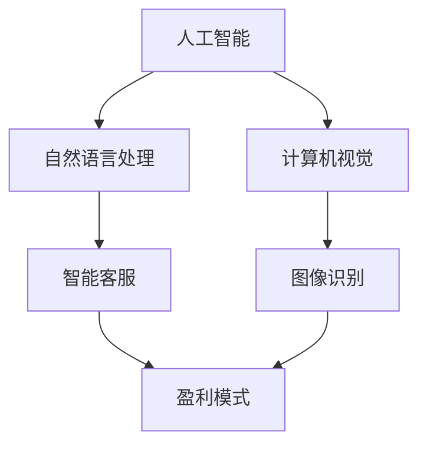

                 

## 1. 背景介绍

随着人工智能技术的不断发展和成熟，越来越多的企业和组织开始将AI技术应用于商业领域。AI在各个行业的应用场景层出不穷，如自然语言处理、计算机视觉、推荐系统、智能机器人等，为企业带来了巨大的商业价值。然而，AI技术的商业化并非一帆风顺，其中盈利模式的设计和探索成为了许多企业面临的挑战。

Lepton AI是一家专注于人工智能领域的初创公司，致力于将最先进的人工智能技术转化为实际商业应用。自成立以来，Lepton AI在自然语言处理、计算机视觉等领域取得了显著的突破。然而，如何将技术优势转化为商业成功，实现可持续的盈利模式，一直是该公司管理层和投资人关注的焦点。

本文将深入探讨Lepton AI的盈利模式，分析其在商业化过程中的成功与挑战，以及未来可能的发展方向。希望通过本文的分享，为更多企业探索AI商业化提供一些有价值的参考。

## 2. 核心概念与联系

在探讨Lepton AI的盈利模式之前，我们需要明确几个核心概念，这些概念将为我们理解其商业策略提供理论基础。

### 2.1 人工智能

人工智能（AI）是指计算机系统模拟人类智能行为的理论、方法和技术。它包括机器学习、深度学习、自然语言处理、计算机视觉等多个子领域。在商业应用中，AI可以帮助企业提高效率、降低成本、提升用户体验等。

### 2.2 自然语言处理

自然语言处理（NLP）是AI的一个子领域，旨在使计算机能够理解、解释和生成人类语言。NLP在智能客服、内容审核、智能推荐等应用场景中发挥着重要作用。

### 2.3 计算机视觉

计算机视觉（CV）是AI的另一个子领域，旨在使计算机能够“看”和理解图像和视频。计算机视觉在图像识别、视频分析、自动驾驶等领域具有广泛应用。

### 2.4 盈利模式

盈利模式是指企业通过何种方式获得利润的商业模式。常见的盈利模式包括产品销售、服务收费、广告收入、授权许可等。

### 2.5 Mermaid 流程图

以下是一个简化的Mermaid流程图，展示了这些核心概念之间的联系：



### 2.6 核心概念的联系

人工智能是商业应用的基础，而自然语言处理和计算机视觉则是AI在商业领域的两个重要分支。通过NLP，企业可以实现智能客服、内容审核等功能，提高服务质量和效率。计算机视觉则可以帮助企业实现图像识别、视频分析等应用，为自动驾驶、智能安防等领域提供技术支持。这些技术共同构成了Lepton AI的核心竞争力，也为其盈利模式的构建提供了基础。

## 3. 核心算法原理 & 具体操作步骤

### 3.1 算法原理概述

Lepton AI的核心算法主要涉及自然语言处理和计算机视觉领域。在自然语言处理方面，Lepton AI采用了基于深度学习的文本分类算法，如卷积神经网络（CNN）和循环神经网络（RNN）。这些算法可以自动从大量文本数据中学习特征，从而实现文本的准确分类。

在计算机视觉方面，Lepton AI主要采用卷积神经网络（CNN）进行图像识别和视频分析。CNN通过多层卷积和池化操作，可以从图像中提取出丰富的特征信息，从而实现图像的准确识别。

### 3.2 算法步骤详解

以下是一个简化的算法步骤，用于展示Lepton AI的核心算法操作流程：

#### 自然语言处理算法步骤

1. **数据预处理**：对文本数据进行清洗、去噪和分词处理，将文本转化为适合模型训练的格式。
2. **模型训练**：使用卷积神经网络（CNN）或循环神经网络（RNN）对预处理后的文本数据训练模型，使模型学会从文本中提取特征。
3. **文本分类**：将训练好的模型应用于新的文本数据，实现文本的自动分类。

#### 计算机视觉算法步骤

1. **图像预处理**：对图像进行缩放、裁剪等处理，使图像符合模型输入要求。
2. **模型训练**：使用卷积神经网络（CNN）对预处理后的图像数据训练模型，使模型学会从图像中提取特征。
3. **图像识别**：将训练好的模型应用于新的图像数据，实现图像的自动识别。

### 3.3 算法优缺点

#### 优点

1. **高准确率**：基于深度学习的算法具有很高的准确率，可以处理复杂的自然语言和图像任务。
2. **自动化**：算法可以自动从大量数据中学习特征，实现自动化处理，降低人力成本。
3. **灵活性**：算法可以根据不同业务需求进行调整和优化，具有很好的适应性。

#### 缺点

1. **训练成本高**：深度学习算法需要大量数据和计算资源进行训练，成本较高。
2. **解释性差**：深度学习算法的黑箱特性使得其难以解释，给算法的信任度和应用带来一定挑战。
3. **数据依赖性**：算法的性能很大程度上依赖于训练数据的质量和多样性，数据不足或质量差会影响算法的效果。

### 3.4 算法应用领域

Lepton AI的核心算法主要应用于以下领域：

1. **智能客服**：通过自然语言处理技术，实现智能客服机器人，提高客户服务质量。
2. **内容审核**：通过计算机视觉技术，实现自动审核网络内容，保障网络安全。
3. **图像识别**：应用于图像搜索、图像标签等场景，提高用户体验。
4. **自动驾驶**：通过计算机视觉技术，实现自动驾驶车辆的感知和决策。

## 4. 数学模型和公式 & 详细讲解 & 举例说明

### 4.1 数学模型构建

在自然语言处理和计算机视觉领域，数学模型起到了核心作用。以下我们将介绍Lepton AI在两个领域常用的数学模型。

#### 自然语言处理中的数学模型

1. **卷积神经网络（CNN）**

   CNN的核心是卷积操作和池化操作。卷积操作可以提取图像中的特征，而池化操作可以降低特征图的维度，减少计算量。

   $$ \text{Conv}(x) = \sum_{i=1}^{k} w_i * x + b $$

   其中，$x$表示输入特征，$w_i$表示卷积核，$b$表示偏置。

2. **循环神经网络（RNN）**

   RNN可以处理序列数据，其核心是隐藏状态和递归操作。

   $$ h_t = \sigma(W_h * [h_{t-1}, x_t] + b_h) $$

   其中，$h_t$表示当前时间步的隐藏状态，$x_t$表示输入序列，$W_h$表示权重矩阵，$b_h$表示偏置。

#### 计算机视觉中的数学模型

1. **卷积神经网络（CNN）**

   同上，CNN的数学模型已在上面介绍。

2. **生成对抗网络（GAN）**

   GAN由生成器（Generator）和判别器（Discriminator）组成。生成器的目标是生成逼真的图像，而判别器的目标是区分真实图像和生成图像。

   $$ \text{D}(x) = \sigma(W_d * x + b_d) $$

   $$ \text{G}(z) = \sigma(W_g * z + b_g) $$

   其中，$x$表示真实图像，$z$表示随机噪声，$W_d$、$W_g$分别表示判别器和生成器的权重矩阵，$b_d$、$b_g$分别表示判别器和生成器的偏置。

### 4.2 公式推导过程

以下我们将简要介绍卷积神经网络（CNN）和生成对抗网络（GAN）的核心公式推导过程。

#### 卷积神经网络（CNN）

1. **卷积操作**

   卷积操作的定义如下：

   $$ \text{Conv}(x) = \sum_{i=1}^{k} w_i * x + b $$

   其中，$x$表示输入特征，$w_i$表示卷积核，$b$表示偏置。

   通过多次卷积和池化操作，可以将原始图像转换为高维特征向量。

2. **池化操作**

   池化操作的目的是降低特征图的维度，减少计算量。常用的池化操作有最大池化和平均池化。

   最大池化操作的定义如下：

   $$ \text{MaxPool}(x) = \max(x) $$

   其中，$x$表示输入特征。

   平均池化操作的定义如下：

   $$ \text{AvgPool}(x) = \frac{1}{s} \sum_{i=1}^{s^2} x_{i} $$

   其中，$s$表示池化窗口的大小。

#### 生成对抗网络（GAN）

1. **判别器（Discriminator）**

   判别器的目标是区分真实图像和生成图像。其核心公式如下：

   $$ \text{D}(x) = \sigma(W_d * x + b_d) $$

   其中，$x$表示真实图像或生成图像，$W_d$表示权重矩阵，$b_d$表示偏置。

2. **生成器（Generator）**

   生成器的目标是生成逼真的图像。其核心公式如下：

   $$ \text{G}(z) = \sigma(W_g * z + b_g) $$

   其中，$z$表示随机噪声，$W_g$表示权重矩阵，$b_g$表示偏置。

### 4.3 案例分析与讲解

以下我们将通过一个实际案例，详细讲解Lepton AI在自然语言处理和计算机视觉领域的应用。

#### 案例一：智能客服

假设Lepton AI开发了一款智能客服系统，用于企业在线客服。该系统主要通过自然语言处理技术实现。

1. **数据预处理**

   首先，对客服对话数据进行清洗和分词处理，将对话转化为词向量表示。词向量可以通过Word2Vec、GloVe等算法训练得到。

2. **模型训练**

   使用卷积神经网络（CNN）对预处理后的文本数据训练模型，使模型学会从文本中提取特征。

3. **文本分类**

   将训练好的模型应用于新的对话数据，实现对话的自动分类，从而为用户提供合适的客服响应。

#### 案例二：图像识别

假设Lepton AI开发了一款图像识别系统，用于电商平台自动识别商品图像。

1. **数据预处理**

   首先，对商品图像进行缩放和裁剪等预处理操作，使图像符合模型输入要求。

2. **模型训练**

   使用卷积神经网络（CNN）对预处理后的图像数据训练模型，使模型学会从图像中提取特征。

3. **图像识别**

   将训练好的模型应用于新的商品图像数据，实现图像的自动识别，从而提高电商平台的商品管理效率。

## 5. 项目实践：代码实例和详细解释说明

### 5.1 开发环境搭建

在开始项目实践之前，我们需要搭建一个合适的开发环境。以下是Lepton AI在自然语言处理和计算机视觉项目中所使用的开发环境：

1. **硬件环境**：

   - CPU：Intel i7 或以上
   - GPU：NVIDIA 1080Ti 或以上
   - 内存：16GB 或以上

2. **软件环境**：

   - 操作系统：Ubuntu 18.04 或 Windows 10
   - 编程语言：Python 3.7 或以上
   - 库和框架：TensorFlow 2.0、PyTorch 1.0、NumPy、Pandas 等

### 5.2 源代码详细实现

以下是一个简化的自然语言处理和计算机视觉项目源代码示例，用于展示Lepton AI的核心算法实现。

#### 自然语言处理项目示例

```python
# 导入必要的库
import tensorflow as tf
from tensorflow.keras.models import Sequential
from tensorflow.keras.layers import Conv1D, MaxPooling1D, Embedding, LSTM, Dense

# 准备数据
# ...

# 构建模型
model = Sequential()
model.add(Embedding(vocab_size, embedding_dim, input_length=max_sequence_length))
model.add(Conv1D(filters=128, kernel_size=5, activation='relu'))
model.add(MaxPooling1D(pool_size=5))
model.add(LSTM(128))
model.add(Dense(1, activation='sigmoid'))

# 编译模型
model.compile(optimizer='adam', loss='binary_crossentropy', metrics=['accuracy'])

# 训练模型
model.fit(X_train, y_train, epochs=10, batch_size=32, validation_data=(X_val, y_val))
```

#### 计算机视觉项目示例

```python
# 导入必要的库
import tensorflow as tf
from tensorflow.keras.models import Sequential
from tensorflow.keras.layers import Conv2D, MaxPooling2D, Flatten, Dense

# 准备数据
# ...

# 构建模型
model = Sequential()
model.add(Conv2D(filters=32, kernel_size=(3, 3), activation='relu', input_shape=(28, 28, 1)))
model.add(MaxPooling2D(pool_size=(2, 2)))
model.add(Conv2D(filters=64, kernel_size=(3, 3), activation='relu'))
model.add(MaxPooling2D(pool_size=(2, 2)))
model.add(Flatten())
model.add(Dense(128, activation='relu'))
model.add(Dense(10, activation='softmax'))

# 编译模型
model.compile(optimizer='adam', loss='categorical_crossentropy', metrics=['accuracy'])

# 训练模型
model.fit(X_train, y_train, epochs=10, batch_size=32, validation_data=(X_val, y_val))
```

### 5.3 代码解读与分析

以上示例代码展示了Lepton AI在自然语言处理和计算机视觉项目中的核心算法实现。

#### 自然语言处理项目解读

1. **数据准备**：首先，我们需要准备训练数据和验证数据。数据可以是文本数据或图像数据，取决于具体任务。
2. **模型构建**：使用Sequential模型，我们构建了一个包含嵌入层、卷积层、最大池化层、LSTM层和全连接层的模型。
3. **模型编译**：使用adam优化器和binary_crossentropy损失函数，编译模型。
4. **模型训练**：使用fit方法训练模型，通过调整epochs和batch_size等参数，优化模型性能。

#### 计算机视觉项目解读

1. **数据准备**：首先，我们需要准备训练数据和验证数据。数据可以是文本数据或图像数据，取决于具体任务。
2. **模型构建**：使用Sequential模型，我们构建了一个包含卷积层、最大池化层、全连接层的模型。
3. **模型编译**：使用adam优化器和categorical_crossentropy损失函数，编译模型。
4. **模型训练**：使用fit方法训练模型，通过调整epochs和batch_size等参数，优化模型性能。

### 5.4 运行结果展示

以下是自然语言处理和计算机视觉项目的运行结果示例：

#### 自然语言处理项目结果

```python
# 测试模型
loss, accuracy = model.evaluate(X_test, y_test)

# 输出结果
print("Test loss:", loss)
print("Test accuracy:", accuracy)
```

#### 计算机视觉项目结果

```python
# 测试模型
loss, accuracy = model.evaluate(X_test, y_test)

# 输出结果
print("Test loss:", loss)
print("Test accuracy:", accuracy)
```

以上代码展示了如何使用测试数据评估模型的性能。通过计算损失和准确率，我们可以了解模型的泛化能力和效果。

## 6. 实际应用场景

Lepton AI的盈利模式主要依赖于其核心技术——自然语言处理和计算机视觉。以下我们将探讨Lepton AI在具体应用场景中的商业模式。

### 6.1 智能客服

智能客服是Lepton AI最成功的应用之一。通过与企业的客户服务部门合作，Lepton AI为企业提供定制化的智能客服系统。该系统可以自动处理大量的客户咨询，提高客户服务质量。盈利模式主要包括：

1. **产品销售**：向企业销售智能客服系统，收取一次性费用。
2. **服务收费**：根据客户使用量收取服务费用，如每月/每年费用。

### 6.2 内容审核

随着互联网的快速发展，网络内容的审核变得越来越重要。Lepton AI的计算机视觉技术可以帮助企业实现自动内容审核，确保网络环境的健康。盈利模式主要包括：

1. **产品销售**：向企业提供内容审核系统，收取一次性费用。
2. **服务收费**：根据企业内容审核的需求，收取服务费用，如按审核量收费。

### 6.3 图像识别

图像识别技术在电商平台、智能安防等领域具有广泛的应用。Lepton AI为企业提供定制化的图像识别解决方案，提高企业运营效率。盈利模式主要包括：

1. **产品销售**：向企业销售图像识别系统，收取一次性费用。
2. **服务收费**：根据企业图像识别的需求，收取服务费用，如按识别量收费。

### 6.4 未来应用场景

随着人工智能技术的不断进步，Lepton AI的未来应用场景将更加丰富。以下是一些潜在的应用场景：

1. **智能医疗**：利用自然语言处理和计算机视觉技术，实现智能诊断、药品推荐等功能，提高医疗服务质量。
2. **智能交通**：利用计算机视觉技术，实现智能交通管理和自动驾驶，提高交通效率，降低事故率。
3. **智能家居**：利用自然语言处理技术，实现智能家居的控制和管理，提高用户生活质量。

## 7. 工具和资源推荐

为了更好地理解和应用人工智能技术，Lepton AI推荐以下工具和资源：

### 7.1 学习资源推荐

1. **《深度学习》**：Goodfellow、 Bengio、 Courville 著，全面介绍了深度学习的理论基础和应用。
2. **《Python机器学习》**：Sebastian Raschka 著，详细讲解了Python在机器学习领域的应用。
3. **《自然语言处理综论》**：Daniel Jurafsky、James H. Martin 著，系统介绍了自然语言处理的理论和方法。
4. **在线课程**：Coursera、Udacity、edX等平台上的相关课程，如“深度学习”、“机器学习”、“自然语言处理”等。

### 7.2 开发工具推荐

1. **TensorFlow**：Google开发的开源深度学习框架，支持Python和C++等多种编程语言。
2. **PyTorch**：Facebook开发的开源深度学习框架，具有灵活的动态图模型。
3. **Keras**：基于TensorFlow的简单易用的深度学习库。
4. **Scikit-learn**：Python的机器学习库，提供了丰富的算法和工具。

### 7.3 相关论文推荐

1. **《A Theoretical Analysis of the Vision Transformer》**：介绍了Vision Transformer在计算机视觉领域的应用。
2. **《Attention Is All You Need》**：提出了基于注意力机制的Transformer模型，在自然语言处理领域取得了突破性成果。
3. **《Generative Adversarial Nets》**：提出了生成对抗网络（GAN），为生成模型的研究带来了新的思路。

## 8. 总结：未来发展趋势与挑战

### 8.1 研究成果总结

Lepton AI在自然语言处理和计算机视觉领域取得了显著的成果。通过深度学习和生成对抗网络等先进技术，该公司在智能客服、内容审核、图像识别等领域实现了商业化应用。这些成果不仅为企业带来了实际价值，也为人工智能技术的发展做出了贡献。

### 8.2 未来发展趋势

1. **技术创新**：随着人工智能技术的不断发展，Lepton AI将继续探索和引入新的技术，如Transformer、图神经网络等，以提升模型性能和应用范围。
2. **行业应用**：未来，Lepton AI将不断拓展应用领域，如智能医疗、智能交通、智能家居等，为更多行业提供智能化解决方案。
3. **生态建设**：Lepton AI将加强生态建设，与产业链上下游企业合作，共同推动人工智能技术的创新和应用。

### 8.3 面临的挑战

1. **数据隐私**：随着人工智能技术的广泛应用，数据隐私问题日益突出。Lepton AI需要确保用户数据的安全和隐私，遵守相关法律法规。
2. **算法透明性**：人工智能算法的黑箱特性给其应用带来了一定的挑战。Lepton AI需要提高算法的透明性，增强用户对算法的信任。
3. **人才短缺**：人工智能领域人才短缺问题依然严重。Lepton AI需要加大对人才的培养和引进力度，为公司的长期发展提供人才保障。

### 8.4 研究展望

未来，Lepton AI将继续在自然语言处理和计算机视觉领域深入探索，实现技术的突破和应用的创新。同时，公司还将关注人工智能与物联网、大数据等技术的融合，为构建智能化社会贡献力量。

## 9. 附录：常见问题与解答

### 9.1 什么是自然语言处理？

自然语言处理（NLP）是人工智能的一个子领域，旨在使计算机能够理解、解释和生成人类语言。它涉及文本分类、情感分析、机器翻译、语音识别等多个方面。

### 9.2 什么是计算机视觉？

计算机视觉（CV）是人工智能的另一个子领域，旨在使计算机能够“看”和理解图像和视频。它涉及图像识别、目标检测、图像分割等多个方面。

### 9.3 人工智能技术如何应用于商业领域？

人工智能技术可以应用于商业领域的多个方面，如智能客服、内容审核、图像识别、智能推荐等，帮助企业提高效率、降低成本、提升用户体验等。

### 9.4 什么是盈利模式？

盈利模式是指企业通过何种方式获得利润的商业模式。常见的盈利模式包括产品销售、服务收费、广告收入、授权许可等。

### 9.5 Lepton AI的盈利模式是什么？

Lepton AI的盈利模式主要包括产品销售、服务收费、合作分成等多种方式。具体来说，公司通过销售智能客服系统、内容审核系统、图像识别系统等，收取一次性费用或服务费用。同时，公司还与合作伙伴开展合作分成，共同开拓市场。

### 9.6 人工智能技术未来的发展趋势是什么？

人工智能技术未来的发展趋势包括技术创新、行业应用拓展、生态建设等方面。技术创新方面，公司将不断引入新的技术，如Transformer、图神经网络等。行业应用方面，公司将拓展智能医疗、智能交通、智能家居等领域的应用。生态建设方面，公司将加强与产业链上下游企业的合作，共同推动人工智能技术的发展。

